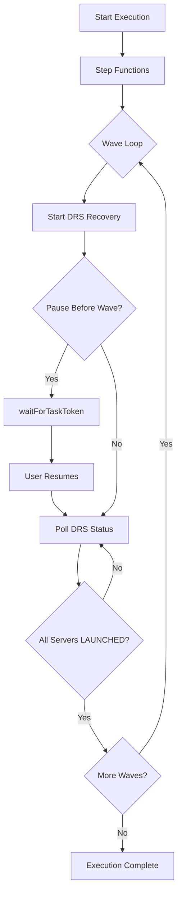
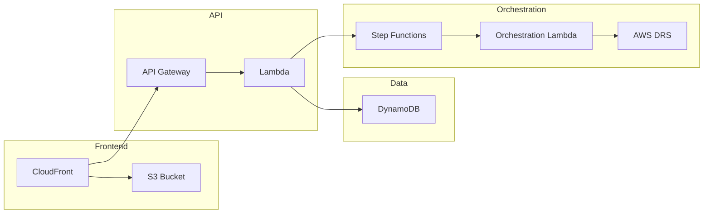

# Amazon Q Project Context

## Product Overview

AWS DRS Orchestration is a serverless disaster recovery orchestration platform for AWS Elastic Disaster Recovery (DRS) that enables enterprise organizations to orchestrate complex multi-tier application recovery with wave-based execution, dependency management, and automated health checks using AWS-native services.

## Value Proposition

- **Wave-Based Recovery**: Execute disaster recovery in coordinated waves with explicit dependencies between tiers (database → application → web)
- **Protection Groups**: Organize DRS source servers into logical groups for coordinated recovery with automatic discovery
- **Pause/Resume Execution**: Pause execution before specific waves for manual validation, then resume when ready
- **Drill Mode**: Test recovery procedures without impacting production environments
- **Real-Time Monitoring**: Track execution progress with 3-second polling, detailed status updates, and comprehensive audit trails
- **Instance Lifecycle Management**: Terminate recovery instances after drill completion to manage costs
- **API-First Design**: Complete REST API (42 endpoints across 12 categories) for DevOps integration and automation workflows
- **Enterprise-Grade**: Built on AWS serverless architecture with CloudFormation IaC for reproducible deployments

## Key Features

### Protection Groups
- Organize DRS source servers into logical groups
- Automatic server discovery across all 30 AWS DRS-supported regions
- Visual server selection with real-time status indicators (Available/Assigned)
- Single server per group constraint (globally enforced across all users)
- Real-time search and filtering in server discovery panel
- Conflict detection prevents duplicate server assignments
- Server validation against DRS API (prevents fake/invalid server IDs)

### Recovery Plans
- Define multi-wave recovery sequences with unlimited waves
- Each wave can reference its own Protection Group (multi-PG support)
- Sequential wave execution with dependencies
- Configurable pause points before any wave (except Wave 1)
- Dependency validation with circular dependency detection
- Support for both Drill and Recovery execution types

### Execution Engine
- Step Functions-based orchestration with `waitForTaskToken` callback pattern
- Wave-by-wave execution with automatic status polling
- Pause/Resume capability using Step Functions task tokens (up to 1 year timeout)
- DRS job monitoring with LAUNCHED status detection
- Comprehensive execution history and audit trails
- Real-time progress tracking with 3-second UI polling intervals
- Terminate Instances action for post-drill cleanup
- **Server Conflict Detection**: Prevents starting executions when servers are in use by another active/paused execution (UI buttons grayed out with reason)
- **Status Values**: PENDING, POLLING, INITIATED, LAUNCHING, STARTED, IN_PROGRESS, RUNNING, PAUSED, COMPLETED, PARTIAL, FAILED, CANCELLED

### DRS Service Limits Validation
- **Hard Limit Enforcement**: 300 replicating servers per account per region
- **Job Size Validation**: Maximum 100 servers per recovery job
- **Concurrent Job Monitoring**: Maximum 20 concurrent jobs
- **Total Server Tracking**: Maximum 500 servers across all active jobs
- **Real-time Quota Display**: Live usage metrics in UI with status indicators
- **Proactive Blocking**: Prevents operations that would exceed limits

### Frontend Application
- CloudScape Design System UI with 37 components
- Cognito-based authentication with 45-minute auto-logout
- CloudFront CDN distribution for global performance
- Real-time status updates and execution monitoring with 3-second polling
- DRS Job Events timeline with auto-refresh
- DRS Service Limits validation and quota display
- Intuitive protection group and recovery plan management
- Tag-based server selection with preview capability
- Invocation source tracking (UI, CLI, API, EventBridge, SSM, Step Functions)

### DRS Source Server Management
- Server Info & Recovery Dashboard: Read-only visibility into server details, replication state, recovery readiness
- DRS Launch Settings: Instance type right sizing, launch disposition, copy private IP/tags, OS licensing
- EC2 Launch Template: Instance type, subnet, security groups, IAM instance profile selection
- Tags Management: View, add, edit, delete tags on DRS source servers
- Disk Settings: Per-disk configuration (type, IOPS, throughput)
- Replication Settings: Staging area, bandwidth throttling, PIT snapshot policy
- Post-Launch Settings: SSM automation, deployment type, S3 log configuration

## AWS DRS Regional Availability

The solution supports disaster recovery orchestration in all **30 AWS regions** where Elastic Disaster Recovery (DRS) is available:

| Region Group | Count | Regions |
|--------------|-------|---------|
| **Americas** | 6 | US East (N. Virginia, Ohio), US West (Oregon, N. California), Canada (Central), South America (São Paulo) |
| **Europe** | 8 | Ireland, London, Frankfurt, Paris, Stockholm, Milan, Spain, Zurich |
| **Asia Pacific** | 10 | Tokyo, Seoul, Osaka, Singapore, Sydney, Mumbai, Hyderabad, Jakarta, Melbourne, Hong Kong |
| **Middle East & Africa** | 4 | Bahrain, UAE, Cape Town, Tel Aviv |
| **GovCloud** | 2 | US-East, US-West |

*Note: Regional availability is determined by AWS DRS service availability, not the orchestration solution.*

## Project Structure

### Directory Organization

```text
AWS-ElasticDRS-Orchestration/
├── .amazonq/                     # Amazon Q Developer rules and configuration
│   └── rules/                    # Amazon Q specific project context
├── .kiro/                        # Kiro AI assistant configuration
│   ├── settings/                 # MCP and other settings
│   ├── specs/                    # Active specifications (fresh-deployment)
│   └── steering/                 # AI steering documents (project-context.md)
├── buildspecs/                   # AWS CodeBuild specifications (6 active files)
│   ├── validate-buildspec.yml    # Template validation and code quality
│   ├── security-buildspec.yml    # Comprehensive security scanning
│   ├── build-buildspec.yml       # Lambda and frontend builds
│   ├── test-buildspec.yml        # Unit and integration tests
│   ├── deploy-infra-buildspec.yml # Infrastructure deployment
│   └── deploy-frontend-buildspec.yml # Frontend deployment with dynamic config
├── cfn/                          # CloudFormation Infrastructure as Code (7 templates)
├── frontend/                     # React + CloudScape UI (37 components, 9 pages)
├── lambda/                       # Python Lambda functions (5 active functions)
├── scripts/                      # Deployment and automation scripts
├── tests/                        # Python unit/integration and Playwright E2E tests
└── docs/                         # Comprehensive documentation
```

### Core Components

**CloudFormation Templates (`cfn/`)**
Modular nested stack architecture for infrastructure deployment:

- **master-template.yaml**: Root orchestrator, parameter propagation, stack outputs
- **database-stack.yaml**: 3 DynamoDB tables (protection-groups, recovery-plans, execution-history)
- **lambda-stack.yaml**: 5 Lambda functions with IAM roles and permissions
- **api-stack-rbac.yaml**: API Gateway, Cognito User Pool, authorizer configuration
- **step-functions-stack.yaml**: Step Functions orchestration state machine with waitForTaskToken
- **frontend-stack.yaml**: S3 static hosting, CloudFront CDN distribution
- **security-stack.yaml**: Optional WAF and CloudTrail audit logging

**Frontend Application (`frontend/`)**
React + TypeScript + CloudScape Design System:

```text
frontend/
├── src/
│   ├── components/          # 37 components
│   ├── pages/               # 9 page components
│   ├── services/            # API client and authentication services
│   ├── contexts/            # React contexts (Auth, API, Notification)
│   ├── types/               # TypeScript type definitions
│   ├── theme/               # CloudScape theme customization
│   └── App.tsx              # Main application component with routing
├── public/                  # Static assets and aws-config.json
├── vite.config.ts           # Vite build configuration
└── package.json             # Dependencies and build scripts
```

**Lambda Functions (`lambda/`)**
Python 3.12 serverless compute:

**Active Functions (5 deployed):**
- **index.py** → `api-handler`: REST API endpoints (42 endpoints across 12 categories) for protection groups, recovery plans, executions, DRS integration, terminate recovery instances
- **orchestration_stepfunctions.py** → `orchestration-stepfunctions`: Step Functions orchestration engine with wave execution, pause/resume via waitForTaskToken
- **build_and_deploy.py** → `frontend-builder`: CloudFormation custom resource for frontend deployment
- **poller/execution_finder.py** → `execution-finder`: Queries StatusIndex GSI for executions in POLLING status (EventBridge scheduled)
- **poller/execution_poller.py** → `execution-poller`: Polls DRS job status and updates execution wave states

**Dependencies**: crhelper==2.0.11 (boto3 provided by Lambda runtime)

## Technology Stack

### Core Technologies

**Frontend Stack**

| Package | Version | Purpose |
|---------|---------|---------|
| React | 19.1.1 | UI framework with hooks and functional components |
| CloudScape Design System | 3.0.1148 | AWS-native UI component library |
| @cloudscape-design/collection-hooks | 1.0.78 | Table state management |
| Vite | 7.1.7 | Fast build tool and development server |
| React Router | 7.9.5 | Client-side routing and navigation |
| AWS Amplify | 6.15.8 | Authentication and AWS service integration |
| Axios | 1.13.2 | HTTP client for API communication |
| react-hot-toast | 2.6.0 | Toast notifications |
| date-fns | 4.1.0 | Date formatting and manipulation |
| TypeScript | 5.9.3 | Type checking |
| ESLint | 9.36.0 | Code quality and linting |

**Backend Stack**
- **AWS Lambda**: Serverless compute (Python 3.12 runtime)
- **boto3**: AWS SDK for Python (provided by Lambda runtime)
- **crhelper 2.0.11**: CloudFormation custom resource helper
- **Complete REST API**: 42 endpoints across 12 categories for comprehensive automation

**AWS Services**

| Service | Purpose |
|---------|---------|
| API Gateway | REST API with Cognito authorizer |
| Cognito | User authentication with 45-minute session timeout |
| Step Functions | Orchestration state machine with waitForTaskToken |
| DynamoDB | NoSQL database for protection groups, recovery plans, execution history |
| S3 | Static website hosting and deployment artifact storage |
| CloudFront | CDN for global frontend distribution |
| CloudFormation | Infrastructure as Code deployment |
| IAM | Least-privilege access control |
| CloudWatch Logs | Centralized logging and monitoring |
| EventBridge | Scheduled execution polling (1-minute intervals) |
| AWS DRS | Elastic Disaster Recovery service integration |

## Architectural Patterns

### Nested Stack Architecture
- Master template orchestrates 6 nested stacks (database, lambda, api, step-functions, security, frontend)
- Parameter propagation from master to child stacks
- Modular design enables independent stack updates
- Outputs aggregated at master level for easy access

### API-First Design
- REST API via API Gateway with Cognito JWT authentication
- Lambda functions handle all business logic
- DynamoDB for data persistence with single-table design per entity
- Step Functions for long-running orchestration workflows

### Event-Driven Orchestration


### Frontend Architecture
- Single-page application with client-side routing
- CloudScape components for consistent AWS UI/UX
- Amplify Auth for Cognito integration with 45-minute auto-logout
- Axios for API communication with JWT token injection
- 3-second polling intervals for active execution monitoring

### Data Flow



1. **User Request** → CloudFront → S3 (static frontend)
2. **API Call** → API Gateway → Cognito (auth) → Lambda (business logic)
3. **Execution Start** → Lambda → Step Functions → Orchestration Lambda
4. **DRS Integration** → Orchestration Lambda → AWS DRS API → EC2 Recovery Instances
5. **Status Updates** → DynamoDB → Poller Lambda → API Gateway → Frontend

### Key Relationships

- **Protection Groups** contain DRS source servers organized logically
- **Recovery Plans** reference Protection Groups per wave and define wave execution order
- **Executions** instantiate Recovery Plans with drill/recovery mode
- **Step Functions** orchestrate wave-by-wave execution with pause/resume capability
- **DynamoDB Tables** store all entities with execution history for audit trails

## CI/CD Infrastructure

### AWS CodePipeline Deployment

The project uses **AWS CodePipeline** for automated deployment with the following active infrastructure:

| Component | Name | Purpose |
|-----------|------|---------|
| **Pipeline** | `aws-elasticdrs-orchestrator-pipeline-dev` | 7-stage automated deployment |
| **Primary Repository** | `aws-elasticdrs-orchestrator-dev` (CodeCommit) | Source code repository |
| **Secondary Repository** | GitHub mirror | Development collaboration |
| **Account** | 438465159935 | AWS account for all resources |
| **Deployment Bucket** | `aws-elasticdrs-orchestrator` | Artifact storage |

### Pipeline Stages

1. **Source** (~30s) - Code retrieval from CodeCommit
2. **Validate** (~2-3min) - CloudFormation validation, Python linting
3. **SecurityScan** (~3-4min) - Bandit security scan, cfn-lint checks
4. **Build** (~4-5min) - Lambda packaging, frontend builds
5. **Test** (~3-4min) - Unit tests, integration tests, coverage
6. **DeployInfrastructure** (~8-10min) - CloudFormation stack updates
7. **DeployFrontend** (~2-3min) - S3 sync, CloudFront invalidation

**Total Duration**: 15-20 minutes for complete deployment

### Development Workflow Options

#### CI/CD Pipeline (Production)
```bash
# Configure Git for CodeCommit
export AWS_PROFILE=438465159935_AdministratorAccess
git config --global credential.helper '!aws codecommit credential-helper $@'
git config --global credential.UseHttpPath true

# Add CodeCommit remote and push to trigger pipeline
git remote add aws-pipeline https://git-codecommit.us-east-1.amazonaws.com/v1/repos/aws-elasticdrs-orchestrator-dev
git push aws-pipeline main  # Triggers 15-20 minute deployment
```

#### Manual Deployment (Development)
```bash
# Fast development workflow using S3 deployment bucket
./scripts/sync-to-deployment-bucket.sh --update-lambda-code  # 5 seconds
./scripts/sync-to-deployment-bucket.sh --deploy-cfn         # 5-10 minutes
```

## S3 Deployment Bucket (Source of Truth)

```
s3://aws-elasticdrs-orchestrator/
├── cfn/                     # CloudFormation templates (7 total)
├── lambda/                  # Lambda deployment packages (5 functions)
└── frontend/                # Frontend build artifacts
```

## Architecture Highlights

- **Serverless**: 5 Lambda functions, Step Functions, API Gateway, DynamoDB
- **Infrastructure as Code**: 7 CloudFormation templates (1 master + 6 nested stacks)
- **Security**: Cognito authentication, IAM least-privilege policies, encryption at rest
- **Cost-Effective**: Pay-per-use serverless architecture ($12-40/month estimated)
- **Scalable**: Handles multiple concurrent executions and unlimited protection groups/plans
- **Data Storage**: 3 DynamoDB tables (protection-groups, recovery-plans, execution-history)

## Key Implementation Patterns

### Pause/Resume Execution
Uses Step Functions `waitForTaskToken` callback pattern for wave-by-wave execution control.

### Real-Time Polling
- Frontend polls every 3 seconds for active executions
- EventBridge triggers execution-finder every 1 minute
- DRS job status polled until LAUNCHED or FAILED

### API-First Design
- REST API via API Gateway with Cognito JWT authentication
- Lambda functions handle all business logic
- Complete CRUD operations with validation and error handling
- Every UI function has corresponding API endpoint for automation