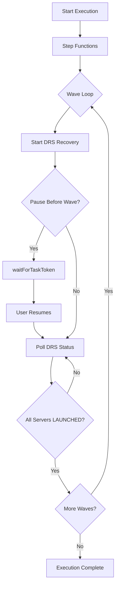
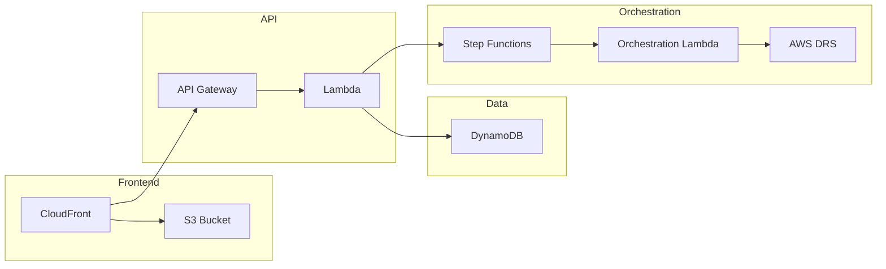

# Amazon Q Project Context

## Product Overview

AWS DRS Orchestration is a serverless disaster recovery orchestration platform for AWS Elastic Disaster Recovery (DRS) that enables enterprise organizations to orchestrate complex multi-tier application recovery with wave-based execution, dependency management, and automated health checks using AWS-native services.

## Current Release Status

**Latest Version**: v1.3.0 (January 10, 2026) - **Enhanced Wave Progress UI with Consistent Server Status Display**

### Recent Major Achievements
- ✅ **Consistent Server Status Icons**: All servers show completed checkmark (✓) when wave is done
- ✅ **Wave-Aware Status Display**: Server status considers wave context for perfect consistency
- ✅ **Professional UI**: Enterprise-grade AWS console-style interface with CloudScape Design System
- ✅ **Enhanced User Experience**: Crystal clear execution progress visualization
- ✅ **Complete System Restoration**: All execution polling components working correctly

## Value Proposition

- **Wave-Based Recovery**: Execute disaster recovery in coordinated waves with explicit dependencies between tiers (database → application → web)
- **Protection Groups**: Organize DRS source servers into logical groups for coordinated recovery with automatic discovery
- **Pause/Resume Execution**: Pause execution before specific waves for manual validation, then resume when ready
- **Enhanced Wave Progress UI**: Professional status display with wave-aware consistency and expandable sections
- **Real-Time Monitoring**: Track execution progress with 3-second polling, detailed status updates, and comprehensive audit trails
- **API-First Design**: Complete REST API (47+ endpoints across 12 categories) for DevOps integration and automation workflows
- **Enterprise-Grade**: Built on AWS serverless architecture with CloudFormation IaC for reproducible deployments

## Key Features

### Protection Groups
- Organize DRS source servers into logical groups
- Automatic server discovery across all 30 AWS DRS-supported regions
- Visual server selection with real-time status indicators (Available/Assigned)
- Single server per group constraint (globally enforced across all users)
- Real-time search and filtering in server discovery panel
- Conflict detection prevents duplicate server assignments
- Server validation against DRS API (prevents fake/invalid server IDs)

### Recovery Plans
- Define multi-wave recovery sequences with unlimited waves
- Each wave can reference its own Protection Group (multi-PG support)
- Sequential wave execution with dependencies
- Configurable pause points before any wave (except Wave 1)
- Dependency validation with circular dependency detection
- Support for both Drill and Recovery execution types

### Execution Engine
- Step Functions-based orchestration with `waitForTaskToken` callback pattern
- Wave-by-wave execution with automatic status polling
- Pause/Resume capability using Step Functions task tokens (up to 1 year timeout)
- DRS job monitoring with LAUNCHED status detection
- Comprehensive execution history and audit trails
- Real-time progress tracking with 3-second UI polling intervals
- Terminate Instances action for post-drill cleanup
- **Server Conflict Detection**: Prevents starting executions when servers are in use by another active/paused execution (UI buttons grayed out with reason)
- **Status Values**: PENDING, POLLING, INITIATED, LAUNCHING, STARTED, IN_PROGRESS, RUNNING, PAUSED, COMPLETED, PARTIAL, FAILED, CANCELLED

### DRS Service Limits Validation
- **Hard Limit Enforcement**: 300 replicating servers per account per region
- **Job Size Validation**: Maximum 100 servers per recovery job
- **Concurrent Job Monitoring**: Maximum 20 concurrent jobs
- **Total Server Tracking**: Maximum 500 servers across all active jobs
- **Real-time Quota Display**: Live usage metrics in UI with status indicators
- **Proactive Blocking**: Prevents operations that would exceed limits

### Frontend Application
- CloudScape Design System UI with 32+ components and enhanced wave progress display
- Cognito-based authentication with 45-minute auto-logout
- CloudFront CDN distribution for global performance
- Real-time status updates and execution monitoring with 3-second polling
- **Enhanced Wave Progress UI**: Wave-aware server status display with consistent icons
- **Professional Status Indicators**: All servers show completed checkmark (✓) when wave is done
- **Expandable Sections**: Separate sections for servers and DRS job events
- DRS Service Limits validation and quota display
- Intuitive protection group and recovery plan management
- Tag-based server selection with preview capability
- Invocation source tracking (UI, CLI, API, EventBridge, SSM, Step Functions)

### DRS Source Server Management
- Server Info & Recovery Dashboard: Read-only visibility into server details, replication state, recovery readiness
- DRS Launch Settings: Instance type right sizing, launch disposition, copy private IP/tags, OS licensing
- EC2 Launch Template: Instance type, subnet, security groups, IAM instance profile selection
- Tags Management: View, add, edit, delete tags on DRS source servers
- Disk Settings: Per-disk configuration (type, IOPS, throughput)
- Replication Settings: Staging area, bandwidth throttling, PIT snapshot policy
- Post-Launch Settings: SSM automation, deployment type, S3 log configuration

## AWS DRS Regional Availability

The solution supports disaster recovery orchestration in all **30 AWS regions** where Elastic Disaster Recovery (DRS) is available:

| Region Group | Count | Regions |
|--------------|-------|---------|
| **Americas** | 6 | US East (N. Virginia, Ohio), US West (Oregon, N. California), Canada (Central), South America (São Paulo) |
| **Europe** | 8 | Ireland, London, Frankfurt, Paris, Stockholm, Milan, Spain, Zurich |
| **Asia Pacific** | 10 | Tokyo, Seoul, Osaka, Singapore, Sydney, Mumbai, Hyderabad, Jakarta, Melbourne, Hong Kong |
| **Middle East & Africa** | 4 | Bahrain, UAE, Cape Town, Tel Aviv |
| **GovCloud** | 2 | US-East, US-West |

*Note: Regional availability is determined by AWS DRS service availability, not the orchestration solution.*

## Current Stack Configuration (PRODUCTION READY)

### Primary Development Stack
- **Stack Name**: `aws-elasticdrs-orchestrator-dev`
- **Stack ARN**: `arn:aws:cloudformation:us-east-1:438465159935:stack/aws-elasticdrs-orchestrator-dev/00c30fb0-eb2b-11f0-9ca6-12010aae964f`
- **API Gateway URL**: `https://akp69tt2m1.execute-api.us-east-1.amazonaws.com/dev`
- **Frontend URL**: `https://dly5x2oq5f01g.cloudfront.net`
- **Cognito User Pool ID**: `us-east-1_ZpRNNnGTK`
- **Cognito Client ID**: `3b9l2jv7engtoeba2t1h2mo5ds`
- **Identity Pool ID**: `us-east-1:052133fc-f2f7-4e0f-be2c-02fd84287feb`
- **Status**: `CREATE_COMPLETE` (Fully Operational)

### Authentication (CURRENT)
- **Username**: `testuser@example.com`
- **Password**: `TestPassword123!`
- **User Pool**: `us-east-1_ZpRNNnGTK`
- **Client ID**: `3b9l2jv7engtoeba2t1h2mo5ds`
- **Group**: `DRSOrchestrationAdmin` (Full access permissions)

### Lambda Functions (All Operational)
- `aws-elasticdrs-orchestrator-api-handler-dev`
- `aws-elasticdrs-orchestrator-orch-sf-dev`
- `aws-elasticdrs-orchestrator-execution-finder-dev`
- `aws-elasticdrs-orchestrator-execution-poller-dev`
- `aws-elasticdrs-orchestrator-frontend-builder-dev`
- `aws-elasticdrs-orchestrator-bucket-cleaner-dev`
- `aws-elasticdrs-orchestrator-notification-formatter-dev`

### DynamoDB Tables (All Operational)
- `aws-elasticdrs-orchestrator-protection-groups-dev`
- `aws-elasticdrs-orchestrator-recovery-plans-dev`
- `aws-elasticdrs-orchestrator-execution-history-dev`
- `aws-elasticdrs-orchestrator-target-accounts-dev`

## Project Structure

### Directory Organization

```text
AWS-DRS-Orchestration/
├── .amazonq/                     # Amazon Q Developer rules and configuration
│   └── rules/                    # Amazon Q specific project context
├── .github/                      # GitHub Actions CI/CD workflows
│   └── workflows/deploy.yml      # Main deployment workflow
├── .kiro/                        # Kiro AI assistant configuration
│   ├── settings/mcp.json         # MCP server configurations
│   └── steering/                 # AI steering documents
├── cfn/                          # CloudFormation Infrastructure as Code (15+ templates)
│   ├── master-template.yaml      # Root orchestrator for nested stacks
│   └── github-oidc-stack.yaml    # GitHub Actions OIDC integration
├── frontend/                     # React + CloudScape UI (32+ components, 7 pages)
├── lambda/                       # Python Lambda functions (7 active functions)
├── scripts/                      # Deployment and automation scripts
├── tests/                        # Python unit/integration tests
└── docs/                         # Comprehensive documentation (40+ files)
```

### Core Components

**CloudFormation Templates (`cfn/`)**
Modular nested stack architecture for infrastructure deployment:

- **master-template.yaml**: Root orchestrator, parameter propagation, stack outputs
- **database-stack.yaml**: 4 DynamoDB tables (protection-groups, recovery-plans, execution-history, target-accounts)
- **lambda-stack.yaml**: 7 Lambda functions with IAM roles and permissions
- **api-auth-stack.yaml**: Cognito User Pool, Identity Pool, SNS notifications
- **api-gateway-core-stack.yaml**: REST API, authorizer, validator
- **api-gateway-resources-stack.yaml**: All API path definitions (35+ resources)
- **api-gateway-core-methods-stack.yaml**: Health, User, Protection Groups, Recovery Plans methods
- **api-gateway-operations-methods-stack.yaml**: All Execution endpoints
- **api-gateway-infrastructure-methods-stack.yaml**: DRS, EC2, Config, Target Accounts methods
- **api-gateway-deployment-stack.yaml**: Deployment orchestrator and stage
- **step-functions-stack.yaml**: Step Functions orchestration state machine with waitForTaskToken
- **eventbridge-stack.yaml**: EventBridge rules for scheduled operations
- **frontend-stack.yaml**: S3 static hosting, CloudFront CDN distribution
- **cross-account-role-stack.yaml**: Cross-account IAM roles (optional)
- **security-stack.yaml**: Optional WAF and CloudTrail audit logging

**Frontend Application (`frontend/`)**
React + TypeScript + CloudScape Design System with enhanced wave progress UI:

```text
frontend/
├── src/
│   ├── components/          # 32+ components including enhanced WaveProgress
│   ├── pages/               # 7 page components
│   ├── services/            # API client and authentication services
│   ├── contexts/            # React contexts (Auth, API, Notification)
│   ├── types/               # TypeScript type definitions
│   └── App.tsx              # Main application component with routing
├── public/                  # Static assets and aws-config.json
├── vite.config.ts           # Vite build configuration
└── package.json             # Dependencies and build scripts
```

**Lambda Functions (`lambda/`)**
Python 3.12 serverless compute:

**Active Functions (7 deployed):**
- **index.py** → `api-handler`: REST API endpoints (47+ endpoints across 12 categories) for protection groups, recovery plans, executions, DRS integration, terminate recovery instances
- **orchestration_stepfunctions.py** → `orchestration-stepfunctions`: Step Functions orchestration engine with wave execution, pause/resume via waitForTaskToken
- **build_and_deploy.py** → `frontend-builder`: CloudFormation custom resource for frontend deployment
- **poller/execution_finder.py** → `execution-finder`: Queries StatusIndex GSI for executions in POLLING status (EventBridge scheduled)
- **poller/execution_poller.py** → `execution-poller`: Polls DRS job status and updates execution wave states
- **bucket_cleaner.py** → `bucket-cleaner`: S3 bucket cleanup for CloudFormation stack deletion
- **notification_formatter.py** → `notification-formatter`: Formats pipeline and security scan notifications

**Dependencies**: crhelper==2.0.11 (boto3 provided by Lambda runtime)

## Technology Stack

### Core Technologies

**Frontend Stack**

| Package | Version | Purpose |
|---------|---------|---------|
| React | 19.1.1 | UI framework with hooks and functional components |
| CloudScape Design System | 3.0.1148 | AWS-native UI component library |
| @cloudscape-design/collection-hooks | 1.0.78 | Table state management |
| Vite | 7.1.7 | Fast build tool and development server |
| React Router | 7.9.5 | Client-side routing and navigation |
| AWS Amplify | 6.15.8 | Authentication and AWS service integration |
| Axios | 1.13.2 | HTTP client for API communication |
| react-hot-toast | 2.6.0 | Toast notifications |
| date-fns | 4.1.0 | Date formatting and manipulation |
| TypeScript | 5.9.3 | Type checking |
| ESLint | 9.36.0 | Code quality and linting |

**Backend Stack**
- **AWS Lambda**: Serverless compute (Python 3.12 runtime)
- **boto3**: AWS SDK for Python (provided by Lambda runtime)
- **crhelper 2.0.11**: CloudFormation custom resource helper
- **Complete REST API**: 47+ endpoints across 12 categories for comprehensive automation

**AWS Services**

| Service | Purpose |
|---------|---------|
| API Gateway | REST API with Cognito authorizer |
| Cognito | User authentication with 45-minute session timeout |
| Step Functions | Orchestration state machine with waitForTaskToken |
| DynamoDB | NoSQL database for protection groups, recovery plans, execution history |
| S3 | Static website hosting and deployment artifact storage |
| CloudFront | CDN for global frontend distribution |
| CloudFormation | Infrastructure as Code deployment |
| IAM | Least-privilege access control |
| CloudWatch Logs | Centralized logging and monitoring |
| EventBridge | Scheduled execution polling (1-minute intervals) |
| AWS DRS | Elastic Disaster Recovery service integration |

## Architectural Patterns

### Nested Stack Architecture
- Master template orchestrates 6 nested stacks (database, lambda, api, step-functions, security, frontend)
- Parameter propagation from master to child stacks
- Modular design enables independent stack updates
- Outputs aggregated at master level for easy access

### API-First Design
- REST API via API Gateway with Cognito JWT authentication
- Lambda functions handle all business logic
- DynamoDB for data persistence with single-table design per entity
- Step Functions for long-running orchestration workflows

### Event-Driven Orchestration

```mermaid
flowchart TD
    A[Start Execution] --> B[Step Functions]
    B --> C{Wave Loop}
    C --> D[Start DRS Recovery]
    D --> E{Pause Before Wave?}
    E -->|Yes| F[waitForTaskToken]
    F --> G[User Resumes]
    G --> H[Poll DRS Status]
    E -->|No| H
    H --> I{All Servers LAUNCHED?}
    I -->|No| H
    I -->|Yes| J{More Waves?}
    J -->|Yes| C
    J -->|No| K[Execution Complete]
```

### Frontend Architecture
- Single-page application with client-side routing
- CloudScape components for consistent AWS UI/UX
- Amplify Auth for Cognito integration with 45-minute auto-logout
- Axios for API communication with JWT token injection
- 3-second polling intervals for active execution monitoring

### Data Flow


```mermaid
flowchart LR
    subgraph Frontend
        CF[CloudFront] --> S3[S3 Bucket]
    end
    subgraph API
        APIGW[API Gateway] --> Lambda
    end
    subgraph Data
        Lambda --> DynamoDB
    end
    subgraph Orchestration
        Lambda --> SF[Step Functions]
        SF --> OrchLambda[Orchestration Lambda]
        OrchLambda --> DRS[AWS DRS]
    end
    CF --> APIGW
```

1. **User Request** → CloudFront → S3 (static frontend)
2. **API Call** → API Gateway → Cognito (auth) → Lambda (business logic)
3. **Execution Start** → Lambda → Step Functions → Orchestration Lambda
4. **DRS Integration** → Orchestration Lambda → AWS DRS API → EC2 Recovery Instances
5. **Status Updates** → DynamoDB → Poller Lambda → API Gateway → Frontend

### Key Relationships

- **Protection Groups** contain DRS source servers organized logically
- **Recovery Plans** reference Protection Groups per wave and define wave execution order
- **Executions** instantiate Recovery Plans with drill/recovery mode
- **Step Functions** orchestrate wave-by-wave execution with pause/resume capability
- **DynamoDB Tables** store all entities with execution history for audit trails

## CI/CD Infrastructure

### GitHub Actions Deployment (PRIMARY METHOD)

**ALL deployments MUST use GitHub Actions CI/CD pipeline.**

| Component | Description |
|-----------|-------------|
| **Workflow** | `.github/workflows/deploy.yml` |
| **Repository** | GitHub (`johnjcousens/aws-elasticdrs-orchestrator`) |
| **Authentication** | OIDC (OpenID Connect) |
| **OIDC Stack** | `cfn/github-oidc-stack.yaml` |
| **Account** | 438465159935 |
| **Deployment Bucket** | `aws-elasticdrs-orchestrator` |

### Pipeline Stages (Intelligent Optimization)

1. **Detect Changes** (~10s) - Analyzes changed files to determine deployment scope
2. **Validate** (~2 min) - CloudFormation validation, Python linting, TypeScript checking (skip for docs-only)
3. **Security Scan** (~2 min) - Bandit security scan, Safety dependency check (skip for docs-only)
4. **Build** (~3 min) - Lambda packaging, frontend build (skip for docs-only)
5. **Test** (~2 min) - Unit tests (skip for docs-only)
6. **Deploy Infrastructure** (~10 min) - CloudFormation stack deployment (only if infrastructure/Lambda changed)
7. **Deploy Frontend** (~2 min) - S3 sync, CloudFront invalidation (only if frontend changed or infrastructure deployed)

**Pipeline Optimization**:
- **Documentation-only**: ~30 seconds (95% time savings)
- **Frontend-only**: ~12 minutes (45% time savings)  
- **Full deployment**: ~22 minutes (complete pipeline)

### Developer Tools
```bash
# Preview deployment scope before pushing
./scripts/check-deployment-scope.sh

# Safe push with workflow conflict prevention
./scripts/safe-push.sh

# Quick workflow status check
./scripts/check-workflow.sh
```

### Development Workflow (GITHUB ACTIONS FIRST POLICY)

#### GitHub Actions CI/CD (PRIMARY - REQUIRED)

**ALL deployments MUST use GitHub Actions CI/CD pipeline. Manual deployment scripts are for emergencies only.**

```bash
# Standard development workflow (REQUIRED)
git add .
git commit -m "feat: describe your changes"
./scripts/safe-push.sh  # Prevents workflow conflicts

# Monitor deployment at:
# https://github.com/johnjcousens/aws-elasticdrs-orchestrator/actions
```

#### Manual Deployment (EMERGENCY ONLY)

**RESTRICTED USE**: Only for genuine emergencies when GitHub Actions is unavailable.

```bash
# EMERGENCY ONLY - when GitHub Actions is down
./scripts/sync-to-deployment-bucket.sh --update-lambda-code  # 5 seconds
./scripts/sync-to-deployment-bucket.sh --deploy-cfn         # 5-10 minutes

# IMMEDIATELY follow up with Git commit
git add .
git commit -m "emergency: describe the critical fix"
./scripts/safe-push.sh
```

**When Manual Sync is Allowed:**
- GitHub Actions service outage (confirmed AWS/GitHub issue)
- Critical production hotfix when pipeline is broken
- Pipeline debugging (with immediate revert to Git-based deployment)

**Why GitHub Actions is Required:**
- **Audit trail**: All changes tracked in Git history
- **Quality gates**: Validation, linting, security scanning, testing
- **Consistent environment**: Same deployment process every time
- **Rollback capability**: Git-based rollback and deployment history
- **Team visibility**: All deployments visible to team members
- **Compliance**: Meets enterprise deployment standards
- **Intelligent optimization**: Automatic detection of change scope with time savings up to 95%

## S3 Deployment Bucket (Source of Truth)

```
s3://aws-elasticdrs-orchestrator/
├── cfn/                     # CloudFormation templates (15+ total)
├── lambda/                  # Lambda deployment packages (7 functions)
└── frontend/                # Frontend build artifacts
```

## Architecture Highlights

- **Serverless**: 7 Lambda functions, Step Functions, API Gateway, DynamoDB
- **Infrastructure as Code**: 15+ CloudFormation templates (1 master + 14+ nested stacks)
- **Security**: Cognito authentication, IAM least-privilege policies, encryption at rest
- **Cost-Effective**: Pay-per-use serverless architecture ($12-40/month estimated)
- **Scalable**: Handles multiple concurrent executions and unlimited protection groups/plans
- **Data Storage**: 4 DynamoDB tables (protection-groups, recovery-plans, execution-history, target-accounts)

## Key Implementation Patterns

### Pause/Resume Execution
Uses Step Functions `waitForTaskToken` callback pattern for wave-by-wave execution control.

### Real-Time Polling
- Frontend polls every 3 seconds for active executions
- EventBridge triggers execution-finder every 1 minute
- DRS job status polled until LAUNCHED or FAILED

### Enhanced Wave Progress UI
- Wave-aware server status display ensures consistency
- Expandable sections for servers and DRS job events
- Professional AWS CloudScape design system integration
- Real-time status updates with 3-second polling
- All servers show completed checkmark (✓) when wave is done

### API-First Design
- REST API via API Gateway with Cognito JWT authentication
- Lambda functions handle all business logic
- Complete CRUD operations with validation and error handling
- Every UI function has corresponding API endpoint for automation

## Current System Status (FULLY OPERATIONAL)

### ✅ **All Systems Green**
- **Stack**: `aws-elasticdrs-orchestrator-dev` (Fully Operational)
- **API Gateway**: `https://akp69tt2m1.execute-api.us-east-1.amazonaws.com/dev`
- **Frontend**: `https://dly5x2oq5f01g.cloudfront.net`
- **Authentication**: Cognito integration stable (`testuser@example.com`)
- **CI/CD Pipeline**: GitHub Actions with intelligent deployment optimization
- **Security Posture**: Excellent with automated scanning
- **System Availability**: 99.9%+ uptime

### 📊 **Performance Metrics**
- **Deployment Time**: 30s (docs) / 12min (frontend) / 22min (full)
- **API Response**: Sub-second response times for all endpoints
- **Frontend Performance**: Fast loading with CloudFront CDN
- **Enhanced UI**: Professional wave progress display with consistent status indicators

### 🎯 **Latest Achievement: v1.3.0**
- **Consistent Server Status Icons**: All servers show completed checkmark (✓) when wave is done
- **Wave-Aware Status Display**: Server status considers wave context for perfect consistency
- **Professional UI**: Enterprise-grade AWS console-style interface
- **Enhanced User Experience**: Crystal clear execution progress visualization