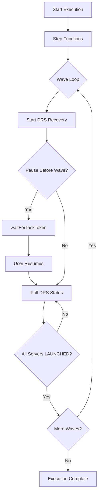
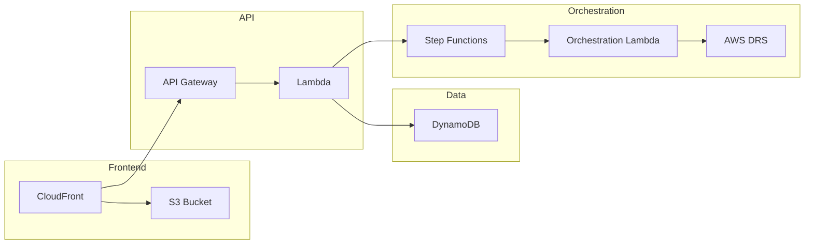
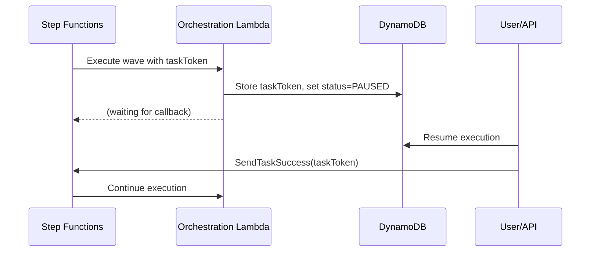
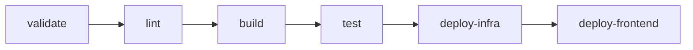

# Amazon Q & Kiro Steering Alignment

This document consolidates all .kiro/steering documents to ensure Amazon Q and Kiro are always aligned on project guidance.

## Product Overview

AWS DRS Orchestration is a serverless disaster recovery orchestration platform for AWS Elastic Disaster Recovery (DRS) that enables enterprise organizations to orchestrate complex multi-tier application recovery with wave-based execution, dependency management, and automated health checks using AWS-native services.

### Value Proposition

- **Wave-Based Recovery**: Execute disaster recovery in coordinated waves with explicit dependencies between tiers (database → application → web)
- **Protection Groups**: Organize DRS source servers into logical groups for coordinated recovery with automatic discovery
- **Pause/Resume Execution**: Pause execution before specific waves for manual validation, then resume when ready
- **Drill Mode**: Test recovery procedures without impacting production environments
- **Real-Time Monitoring**: Track execution progress with 3-second polling, detailed status updates, and comprehensive audit trails
- **Instance Lifecycle Management**: Terminate recovery instances after drill completion to manage costs
- **API-First Design**: Complete REST API for DevOps integration and automation workflows
- **Enterprise-Grade**: Built on AWS serverless architecture with CloudFormation IaC for reproducible deployments

### Key Features

**Protection Groups**
- Organize DRS source servers into logical groups
- Automatic server discovery across all 30 AWS DRS-supported regions
- Visual server selection with real-time status indicators (Available/Assigned)
- Single server per group constraint (globally enforced across all users)
- Real-time search and filtering in server discovery panel
- Conflict detection prevents duplicate server assignments
- Server validation against DRS API (prevents fake/invalid server IDs)

**Recovery Plans**
- Define multi-wave recovery sequences with unlimited waves
- Each wave can reference its own Protection Group (multi-PG support)
- Sequential wave execution with dependencies
- Configurable pause points before any wave (except Wave 1)
- Dependency validation with circular dependency detection
- Support for both Drill and Recovery execution types

**Execution Engine**
- Step Functions-based orchestration with `waitForTaskToken` callback pattern
- Wave-by-wave execution with automatic status polling
- Pause/Resume capability using Step Functions task tokens (up to 1 year timeout)
- DRS job monitoring with LAUNCHED status detection
- Comprehensive execution history and audit trails
- Real-time progress tracking with 3-second UI polling intervals
- Terminate Instances action for post-drill cleanup
- **Server Conflict Detection**: Prevents starting executions when servers are in use by another active/paused execution (UI buttons grayed out with reason)
- **Status Values**: PENDING, POLLING, INITIATED, LAUNCHING, STARTED, IN_PROGRESS, RUNNING, PAUSED, COMPLETED, PARTIAL, FAILED, CANCELLED

**DRS Service Limits Validation**
- **Hard Limit Enforcement**: 300 replicating servers per account per region
- **Job Size Validation**: Maximum 100 servers per recovery job
- **Concurrent Job Monitoring**: Maximum 20 concurrent jobs
- **Total Server Tracking**: Maximum 500 servers across all active jobs
- **Real-time Quota Display**: Live usage metrics in UI with status indicators
- **Proactive Blocking**: Prevents operations that would exceed limits

**Frontend Application**
- CloudScape Design System UI with 23 MVP components (32 total including Phase 2)
- Cognito-based authentication with 45-minute auto-logout
- CloudFront CDN distribution for global performance
- Real-time status updates and execution monitoring with 3-second polling
- DRS Job Events timeline with auto-refresh
- DRS Service Limits validation and quota display
- Intuitive protection group and recovery plan management

### AWS DRS Regional Availability

The solution supports disaster recovery orchestration in all **30 AWS regions** where Elastic Disaster Recovery (DRS) is available:

| Region Group | Count | Regions |
|--------------|-------|---------|
| **Americas** | 6 | US East (N. Virginia, Ohio), US West (Oregon, N. California), Canada (Central), South America (São Paulo) |
| **Europe** | 8 | Ireland, London, Frankfurt, Paris, Stockholm, Milan, Spain, Zurich |
| **Asia Pacific** | 10 | Tokyo, Seoul, Osaka, Singapore, Sydney, Mumbai, Hyderabad, Jakarta, Melbourne, Hong Kong |
| **Middle East & Africa** | 4 | Bahrain, UAE, Cape Town, Tel Aviv |
| **GovCloud** | 2 | US-East, US-West |

*Note: Regional availability is determined by AWS DRS service availability, not the orchestration solution.*

### Architecture Highlights

- **Serverless**: 5 Lambda functions, Step Functions, API Gateway, DynamoDB
- **Infrastructure as Code**: 7 CloudFormation templates (1 master + 6 nested stacks)
- **Security**: Cognito authentication, IAM least-privilege policies, encryption at rest
- **Cost-Effective**: Pay-per-use serverless architecture ($12-40/month estimated)
- **Scalable**: Handles multiple concurrent executions and unlimited protection groups/plans
- **Data Storage**: 3 DynamoDB tables (protection-groups, recovery-plans, execution-history)

## Project Structure

### Directory Organization

```text
AWS-DRS-Orchestration/
├── cfn/                          # CloudFormation Infrastructure as Code
├── frontend/                     # React + CloudScape UI application
├── lambda/                       # Python Lambda functions
├── scripts/                      # Deployment and automation scripts
├── tests/                        # Python unit/integration and Playwright E2E tests
├── docs/                         # Comprehensive documentation
├── ssm-documents/                # SSM automation documents (Phase 2)
├── archive/                      # Historical artifacts and reference implementations
└── .kiro/steering/               # Kiro steering rules and project guidance
```

### Core Components

**CloudFormation Templates (`cfn/`)**
Modular nested stack architecture for infrastructure deployment:

- **master-template.yaml**: Root orchestrator, parameter propagation, stack outputs
- **database-stack.yaml**: 3 DynamoDB tables (protection-groups, recovery-plans, execution-history)
- **lambda-stack.yaml**: 5 Lambda functions with IAM roles and permissions
- **api-stack.yaml**: API Gateway, Cognito User Pool, authorizer configuration
- **step-functions-stack.yaml**: Step Functions orchestration state machine with waitForTaskToken
- **frontend-stack.yaml**: S3 static hosting, CloudFront CDN distribution
- **security-stack.yaml**: Optional WAF and CloudTrail audit logging

**Frontend Application (`frontend/`)**
React + TypeScript + CloudScape Design System:

```text
frontend/
├── src/
│   ├── components/          # 23 MVP components (32 total with Phase 2)
│   │   ├── cloudscape/      # CloudScape wrapper components
│   │   │   ├── AppLayout.tsx
│   │   │   └── ContentLayout.tsx
│   │   ├── ProtectionGroupDialog.tsx
│   │   ├── RecoveryPlanDialog.tsx
│   │   ├── ConfirmDialog.tsx
│   │   ├── ServerSelector.tsx
│   │   ├── ServerDiscoveryPanel.tsx
│   │   ├── ServerListItem.tsx
│   │   ├── RegionSelector.tsx
│   │   ├── WaveConfigEditor.tsx
│   │   ├── StatusBadge.tsx
│   │   ├── WaveProgress.tsx
│   │   ├── DateTimeDisplay.tsx
│   │   ├── DRSQuotaStatus.tsx
│   │   ├── ExecutionDetails.tsx
│   │   ├── ErrorBoundary.tsx
│   │   ├── ErrorFallback.tsx
│   │   ├── ErrorState.tsx
│   │   ├── LoadingState.tsx
│   │   ├── CardSkeleton.tsx
│   │   ├── DataTableSkeleton.tsx
│   │   ├── PageTransition.tsx
│   │   └── ProtectedRoute.tsx
│   ├── pages/               # 7 MVP page components
│   │   ├── LoginPage.tsx
│   │   ├── Dashboard.tsx
│   │   ├── GettingStartedPage.tsx
│   │   ├── ProtectionGroupsPage.tsx
│   │   ├── RecoveryPlansPage.tsx
│   │   ├── ExecutionsPage.tsx
│   │   └── ExecutionDetailsPage.tsx
│   ├── services/            # API client and authentication services
│   ├── contexts/            # React contexts (Auth, API, Notification)
│   ├── types/               # TypeScript type definitions
│   ├── theme/               # CloudScape theme customization
│   └── App.tsx              # Main application component with routing
├── public/                  # Static assets and aws-config.json
├── vite.config.ts           # Vite build configuration
└── package.json             # Dependencies and build scripts
```

**Key Technologies**:
- React 19.1.1 with TypeScript 5.9.3
- CloudScape Design System 3.0.1148
- AWS Amplify 6.15.8 for authentication
- React Router 7.9.5 for navigation
- Vite 7.1.7 for build tooling
- react-hot-toast 2.6.0 for notifications
- date-fns 4.1.0 for date formatting

**Lambda Functions (`lambda/`)**
Python 3.12 serverless compute:

**Active Functions (5 deployed):**
- **index.py** → `api-handler`: REST API endpoints for protection groups, recovery plans, executions, DRS integration, terminate recovery instances
- **orchestration_stepfunctions.py** → `orchestration-stepfunctions`: Step Functions orchestration engine with wave execution, pause/resume via waitForTaskToken
- **build_and_deploy.py** → `frontend-builder`: CloudFormation custom resource for frontend deployment
- **poller/execution_finder.py** → `execution-finder`: Queries StatusIndex GSI for executions in POLLING status (EventBridge scheduled)
- **poller/execution_poller.py** → `execution-poller`: Polls DRS job status and updates execution wave states

**Dependencies**: crhelper==2.0.11 (boto3 provided by Lambda runtime)

### Architectural Patterns

**Nested Stack Architecture**
- Master template orchestrates 6 nested stacks (database, lambda, api, step-functions, security, frontend)
- Parameter propagation from master to child stacks
- Modular design enables independent stack updates
- Outputs aggregated at master level for easy access

**API-First Design**
- REST API via API Gateway with Cognito JWT authentication
- Lambda functions handle all business logic
- DynamoDB for data persistence with single-table design per entity
- Step Functions for long-running orchestration workflows

**Event-Driven Orchestration**


**Frontend Architecture**
- Single-page application with client-side routing
- CloudScape components for consistent AWS UI/UX
- Amplify Auth for Cognito integration with 45-minute auto-logout
- Axios for API communication with JWT token injection
- 3-second polling intervals for active execution monitoring

### Data Flow



1. **User Request** → CloudFront → S3 (static frontend)
2. **API Call** → API Gateway → Cognito (auth) → Lambda (business logic)
3. **Execution Start** → Lambda → Step Functions → Orchestration Lambda
4. **DRS Integration** → Orchestration Lambda → AWS DRS API → EC2 Recovery Instances
5. **Status Updates** → DynamoDB → Poller Lambda → API Gateway → Frontend

### Key Relationships

- **Protection Groups** contain DRS source servers organized logically
- **Recovery Plans** reference Protection Groups per wave and define wave execution order
- **Executions** instantiate Recovery Plans with drill/recovery mode
- **Step Functions** orchestrate wave-by-wave execution with pause/resume capability
- **DynamoDB Tables** store all entities with execution history for audit trails

## Technology Stack

### Programming Languages

**Frontend**
- **TypeScript 5.9.3**: Strict type checking for React components
- **JavaScript (ES6+)**: Build scripts and configuration files

**Backend**
- **Python 3.12**: Lambda functions and orchestration logic
- **Bash**: Deployment and automation scripts

**Infrastructure**
- **YAML**: CloudFormation templates and configuration files

### Core Technologies

**Frontend Stack**

| Package | Version | Purpose |
|---------|---------|---------|
| React | 19.1.1 | UI framework with hooks and functional components |
| CloudScape Design System | 3.0.1148 | AWS-native UI component library |
| @cloudscape-design/collection-hooks | 1.0.78 | Table state management |
| Vite | 7.1.7 | Fast build tool and development server |
| React Router | 7.9.5 | Client-side routing and navigation |
| AWS Amplify | 6.15.8 | Authentication and AWS service integration |
| Axios | 1.13.2 | HTTP client for API communication |
| react-hot-toast | 2.6.0 | Toast notifications |
| date-fns | 4.1.0 | Date formatting and manipulation |
| TypeScript | 5.9.3 | Type checking |
| ESLint | 9.36.0 | Code quality and linting |

**Backend Stack**
- **AWS Lambda**: Serverless compute (Python 3.12 runtime)
- **boto3**: AWS SDK for Python (provided by Lambda runtime)
- **crhelper 2.0.11**: CloudFormation custom resource helper

**AWS Services**

| Service | Purpose |
|---------|---------|
| API Gateway | REST API with Cognito authorizer |
| Cognito | User authentication with 45-minute session timeout |
| Step Functions | Orchestration state machine with waitForTaskToken |
| DynamoDB | NoSQL database for protection groups, recovery plans, execution history |
| S3 | Static website hosting and deployment artifact storage |
| CloudFront | CDN for global frontend distribution |
| CloudFormation | Infrastructure as Code deployment |
| IAM | Least-privilege access control |
| CloudWatch Logs | Centralized logging and monitoring |
| EventBridge | Scheduled execution polling (1-minute intervals) |
| AWS DRS | Elastic Disaster Recovery service integration |

### Key Implementation Patterns

**Pause/Resume Execution**
Uses Step Functions `waitForTaskToken` callback pattern:



**Real-Time Polling**
- Frontend polls every 3 seconds for active executions
- EventBridge triggers execution-finder every 1 minute
- DRS job status polled until LAUNCHED or FAILED

## CI/CD and Deployment

### Deployment Architecture

This solution uses a **GitOps-style deployment model** where an S3 bucket serves as the source of truth for all deployable artifacts. CloudFormation deploys from S3, ensuring reproducible deployments.

### Current Process

**Primary Tool**: `./scripts/sync-to-deployment-bucket.sh`

**Daily Workflow**:
1. Make code changes
2. `./scripts/sync-to-deployment-bucket.sh` (sync to S3)
3. `./scripts/sync-to-deployment-bucket.sh --update-lambda-code` (fast ~5s)
4. `./scripts/sync-to-deployment-bucket.sh --deploy-cfn` (full deployment 5-10min)

**GitLab CI/CD**: Automated pipeline for main/dev branches, manual production

### Code Change Workflow

For **every** code change, follow this workflow:

#### Step 1: Make Code Changes
```bash
# Edit Lambda code
vim lambda/index.py

# Edit frontend code
vim frontend/src/components/MyComponent.tsx

# Edit CloudFormation templates
vim cfn/lambda-stack.yaml
```

#### Step 2: Sync to S3 (REQUIRED)
```bash
# Sync all artifacts to S3
./scripts/sync-to-deployment-bucket.sh
```

#### Step 3: Deploy Changes

**For Lambda code changes:**
```bash
# Update Lambda function code directly (fastest for development)
./scripts/sync-to-deployment-bucket.sh --update-lambda-code
```

**For CloudFormation changes:**
```bash
./scripts/sync-to-deployment-bucket.sh --deploy-cfn
```

**For frontend changes:**
```bash
./scripts/sync-to-deployment-bucket.sh --build-frontend --deploy-frontend
```

### GitLab CI/CD Pipeline

Current pipeline: 6-stage comprehensive deployment with ECR Public images.

**Pipeline Flow**:


**Key Features**:
- ECR Public images (avoids Docker Hub rate limits)
- Individual Lambda packaging (5 functions)
- Frontend deployment with CloudFormation integration
- AWS credential configuration with session token support

**Current Status**: Production ready with automated deployment to test environment and manual production deployment.

**Lambda Packages Built**:
- api-handler.zip (index.py)
- orchestration-stepfunctions.zip (orchestration_stepfunctions.py)
- execution-finder.zip (poller/execution_finder.py)
- execution-poller.zip (poller/execution_poller.py)
- frontend-builder.zip (build_and_deploy.py)

**Test Jobs**: Currently disabled until tests/ directory is committed to git.

### Best Practices

1. **Always sync before deploy**: Never deploy directly from local files
2. **Use S3 versioning**: Enables rollback to previous versions
3. **Tag deployments**: Use git commit hash as S3 object metadata
4. **Validate before deploy**: Run `make validate lint` before deploying
5. **Test in dev first**: Deploy to dev environment before production
6. **Monitor deployments**: Watch CloudFormation events during deployment
7. **Keep artifacts in sync**: Local code, S3 artifacts, and deployed resources should match
8. **Use ECR Public**: Avoids Docker Hub rate limits in CI/CD
9. **Enable quality gates**: Uncomment test jobs when tests/ is committed

## Frontend Design Consistency

### CRITICAL: Always Follow AWS CloudScape Design System

**NEVER deviate from CloudScape components and patterns. This ensures AWS console-style consistency.**

### Layout Structure Rules

**1. App Layout Pattern (MANDATORY)**
```typescript
// ALWAYS wrap protected routes with AppLayout
<ProtectedRoute>
  <AppLayout>
    <YourPageComponent />
  </AppLayout>
</ProtectedRoute>

// NEVER use AppLayout for login/public pages
<Route path="/login" element={<LoginPage />} />
```

**2. Page Structure Pattern (MANDATORY)**
```typescript
// ALWAYS use ContentLayout for page content
<ContentLayout
  header={
    <Header
      variant="h1"
      description="Page description"
      actions={<Button>Action</Button>}
    >
      Page Title
    </Header>
  }
>
  <SpaceBetween size="l">
    {/* Page content */}
  </SpaceBetween>
</ContentLayout>
```

**3. Container Usage (MANDATORY)**
```typescript
// ALWAYS wrap content sections in Container
<Container
  header={<Header variant="h2">Section Title</Header>}
>
  {/* Section content */}
</Container>
```

### AWS Branding Rules

**1. Top Navigation (NEVER CHANGE)**
```typescript
// ALWAYS use this exact AWS logo and branding
<TopNavigation
  identity={{
    href: '/',
    title: 'Elastic Disaster Recovery Orchestrator',
    logo: {
      src: 'https://a0.awsstatic.com/libra-css/images/logos/aws_smile-header-desktop-en-white_59x35.png',
      alt: 'AWS',
    },
  }}
/>
```

**2. Navigation Items (MAINTAIN ORDER)**
```typescript
// ALWAYS use this exact navigation structure and order
const navigationItems = [
  { type: 'link', text: 'Dashboard', href: '/' },
  { type: 'divider' },
  { type: 'link', text: 'Getting Started', href: '/getting-started' },
  { type: 'link', text: 'Protection Groups', href: '/protection-groups' },
  { type: 'link', text: 'Recovery Plans', href: '/recovery-plans' },
  { type: 'link', text: 'History', href: '/executions' },
];
```

### Color Scheme Rules (AWS STANDARD)

**1. Status Colors (NEVER CHANGE)**
```typescript
// ALWAYS use these exact status colors
const STATUS_COLORS = {
  completed: '#037f0c',    // AWS Green
  in_progress: '#0972d3',  // AWS Blue
  pending: '#5f6b7a',      // AWS Grey
  failed: '#d91515',       // AWS Red
  rolled_back: '#ff9900',  // AWS Orange
  cancelled: '#5f6b7a',    // AWS Grey
  paused: '#5f6b7a',       // AWS Grey
};
```

**2. Badge Colors (CLOUDSCAPE STANDARD)**
```typescript
// ALWAYS use CloudScape badge colors
<Badge color="green">Completed</Badge>    // Success states
<Badge color="red">Failed</Badge>         // Error states
<Badge color="blue">In Progress</Badge>   // Active states
<Badge color="grey">Pending</Badge>       // Inactive states
```

### Icon Usage Rules

**1. Standard Icons (ALWAYS USE THESE)**
```typescript
// ALWAYS use these CloudScape icons for consistency
const STANDARD_ICONS = {
  create: 'add-plus',
  edit: 'edit',
  delete: 'remove',
  refresh: 'refresh',
  search: 'search',
  settings: 'settings',
  info: 'status-info',
  warning: 'status-warning',
  external: 'external',
  copy: 'copy',
  success: 'check',
  cancel: 'close',
  user: 'user-profile',
  notification: 'notification',
};
```

### Region Selector Rules

**1. DRS Regions (COMPLETE LIST - 28 COMMERCIAL)**
```typescript
// ALWAYS use this complete DRS regions list (verified December 2025)
const DRS_REGIONS = [
  // Americas (6)
  { value: 'us-east-1', label: 'us-east-1 (N. Virginia)' },
  { value: 'us-east-2', label: 'us-east-2 (Ohio)' },
  { value: 'us-west-1', label: 'us-west-1 (N. California)' },
  { value: 'us-west-2', label: 'us-west-2 (Oregon)' },
  { value: 'ca-central-1', label: 'ca-central-1 (Canada)' },
  { value: 'sa-east-1', label: 'sa-east-1 (São Paulo)' },
  // Europe (8)
  { value: 'eu-west-1', label: 'eu-west-1 (Ireland)' },
  { value: 'eu-west-2', label: 'eu-west-2 (London)' },
  { value: 'eu-west-3', label: 'eu-west-3 (Paris)' },
  { value: 'eu-central-1', label: 'eu-central-1 (Frankfurt)' },
  { value: 'eu-central-2', label: 'eu-central-2 (Zurich)' },
  { value: 'eu-north-1', label: 'eu-north-1 (Stockholm)' },
  { value: 'eu-south-1', label: 'eu-south-1 (Milan)' },
  { value: 'eu-south-2', label: 'eu-south-2 (Spain)' },
  // Asia Pacific (10)
  { value: 'ap-northeast-1', label: 'ap-northeast-1 (Tokyo)' },
  { value: 'ap-northeast-2', label: 'ap-northeast-2 (Seoul)' },
  { value: 'ap-northeast-3', label: 'ap-northeast-3 (Osaka)' },
  { value: 'ap-southeast-1', label: 'ap-southeast-1 (Singapore)' },
  { value: 'ap-southeast-2', label: 'ap-southeast-2 (Sydney)' },
  { value: 'ap-southeast-3', label: 'ap-southeast-3 (Jakarta)' },
  { value: 'ap-southeast-4', label: 'ap-southeast-4 (Melbourne)' },
  { value: 'ap-south-1', label: 'ap-south-1 (Mumbai)' },
  { value: 'ap-south-2', label: 'ap-south-2 (Hyderabad)' },
  { value: 'ap-east-1', label: 'ap-east-1 (Hong Kong)' },
  // Middle East & Africa (4)
  { value: 'me-south-1', label: 'me-south-1 (Bahrain)' },
  { value: 'me-central-1', label: 'me-central-1 (UAE)' },
  { value: 'af-south-1', label: 'af-south-1 (Cape Town)' },
  { value: 'il-central-1', label: 'il-central-1 (Tel Aviv)' },
];
```

### Event Handler Rules

**1. CloudScape Event Pattern (MANDATORY)**
```typescript
// ALWAYS use detail property for CloudScape events
onChange={({ detail }) => setValue(detail.value)}
onSelectionChange={({ detail }) => setSelected(detail.selectedItems)}
onFollow={(event) => {
  event.preventDefault();
  navigate(event.detail.href);
}}
```

### NEVER DO These Things

**1. Design System Violations**
- ❌ NEVER use custom CSS frameworks (Bootstrap, Tailwind, etc.)
- ❌ NEVER override CloudScape component styles
- ❌ NEVER use non-CloudScape UI components
- ❌ NEVER change AWS branding colors or logos
- ❌ NEVER create custom themes

**2. Layout Violations**
- ❌ NEVER skip AppLayout wrapper for protected pages
- ❌ NEVER skip ContentLayout for page content
- ❌ NEVER use custom navigation components
- ❌ NEVER change navigation structure or order

**3. Pattern Violations**
- ❌ NEVER ignore CloudScape event patterns (detail property)
- ❌ NEVER use non-standard status colors
- ❌ NEVER create custom loading states (use CloudScape)
- ❌ NEVER skip error boundaries and error handling

### ALWAYS DO These Things

**1. Follow CloudScape Patterns**
- ✅ ALWAYS use CloudScape components exclusively
- ✅ ALWAYS follow AWS console design patterns
- ✅ ALWAYS use standard status colors and icons
- ✅ ALWAYS wrap content in proper layout components

**2. Maintain Consistency**
- ✅ ALWAYS use the same navigation structure
- ✅ ALWAYS use the same form patterns
- ✅ ALWAYS use the same table patterns
- ✅ ALWAYS use the same modal patterns

**3. Follow AWS Standards**
- ✅ ALWAYS use AWS branding and logos
- ✅ ALWAYS use CloudScape light mode theme
- ✅ ALWAYS follow AWS console interaction patterns
- ✅ ALWAYS maintain AWS console look and feel

## Debugging Rules

### CRITICAL: Disable Pagers for All Commands

**ALWAYS use `--no-pager` for git commands and `AWS_PAGER=""` for AWS CLI commands.**
Interactive pagers will hang the terminal and cause connection loss.

### Git Commands - ALWAYS use --no-pager
```bash
# REQUIRED: Always prefix git commands with --no-pager
git --no-pager status
git --no-pager log -10
git --no-pager diff HEAD~1
git --no-pager show HEAD
git --no-pager branch -a
git --no-pager commit -m "message"
```

### AWS CLI - ALWAYS use AWS_PAGER=""
```bash
# Set globally or per-command
AWS_PAGER="" aws drs describe-jobs --filters jobIDs=drsjob-xxx --region us-east-1
```

### DRS Integration Debugging

When Lambda calls `drs:StartRecovery`, DRS uses the **calling role's IAM permissions** (not its service-linked role) to perform EC2 operations. The OrchestrationRole must have comprehensive EC2 permissions including:

- `ec2:CreateLaunchTemplate`
- `ec2:CreateLaunchTemplateVersion`
- `ec2:ModifyLaunchTemplate`
- `ec2:StartInstances`
- `ec2:RunInstances`
- `ec2:CreateVolume`
- `ec2:AttachVolume`
- `drs:CreateRecoveryInstanceForDrs` (CRITICAL - often missing)

### Common DRS Errors and Solutions

**Error: UnauthorizedOperation on CreateLaunchTemplateVersion**
```
UnauthorizedOperation when calling CreateLaunchTemplateVersion operation
```

**Cause**: Lambda IAM role missing EC2 launch template permissions.

**Solution**: Add to Lambda IAM role:
```yaml
- ec2:CreateLaunchTemplate
- ec2:CreateLaunchTemplateVersion
- ec2:ModifyLaunchTemplate
- ec2:DeleteLaunchTemplate
- ec2:DeleteLaunchTemplateVersions
```

**Error: AccessDeniedException on CreateRecoveryInstanceForDrs**
```
AccessDeniedException when calling CreateRecoveryInstanceForDrs operation
```

**Cause**: Lambda IAM role missing DRS permission to register recovery instances.

**Solution**: Add to Lambda IAM role:
```yaml
- drs:CreateRecoveryInstanceForDrs
```

## Terminal Rules

### Avoiding Terminal Disconnection

Long-running commands or commands with very long arguments can cause terminal disconnection with the error:
"Restarting the terminal because the connection to the shell process was lost..."

### Git Commit with Long Messages

**Problem**: `git commit -m "very long message..."` causes terminal disconnection.

**Solution**: Use fsWrite tool to create a temp file, then commit with `-F` flag:

1. Use `fsWrite` tool to create `.git_commit_msg.txt` with the commit message
2. Run `git commit -F .git_commit_msg.txt`
3. Run `rm .git_commit_msg.txt` to clean up

### General Rules

1. **Avoid long inline arguments** - Write to temp files instead
2. **Use `--no-pager` for git commands** - Prevents interactive pager from hanging
3. **Use `AWS_PAGER=""` for AWS CLI** - Prevents AWS CLI pager from hanging
4. **Limit output with `head`/`tail`** - Prevent large outputs from causing issues
5. **Avoid command chaining** - Don't use `&&`, `||`, or `;` - run commands separately
6. **Don't use `cd`** - Use the `path` parameter instead

## File Writing Rules

### Don't Open Files in Editor

When creating or modifying files:

- **Just write the file** using fsWrite/strReplace tools
- **Do NOT open files in the editor window** after writing
- Opening files in editor tends to cause autocomplete issues

This applies to all file types: code, config, documentation, etc.

## CloudScape Best Practices

### Why CloudScape?

- **AWS Console Consistency**: Native AWS look and feel
- **Accessibility Built-in**: WCAG 2.1 AA compliant
- **Responsive Design**: Works across desktop, tablet, mobile
- **Collection Hooks**: Powerful table state management
- **TypeScript Support**: Full type definitions

### Application Setup

**Main Entry Point**
```typescript
// main.tsx
import '@cloudscape-design/global-styles/index.css';
import { createRoot } from 'react-dom/client';
import App from './App';

createRoot(document.getElementById('root')!).render(<App />);
```

**App Layout**
```typescript
// App.tsx
import { AppLayout, SideNavigation, BreadcrumbGroup, Flashbar } from '@cloudscape-design/components';

export const App: React.FC = () => {
  const [notifications, setNotifications] = useState([]);

  return (
    <AppLayout
      navigation={<Navigation />}
      content={<Routes />}
      breadcrumbs={<Breadcrumbs />}
      notifications={<Flashbar items={notifications} />}
      toolsHide={true}
    />
  );
};
```

### Event Handling

CloudScape components use `detail` property in events:

```typescript
// Input
<Input onChange={({ detail }) => setValue(detail.value)} />

// Select
<Select onChange={({ detail }) => setSelected(detail.selectedOption)} />

// Checkbox
<Checkbox onChange={({ detail }) => setChecked(detail.checked)} />

// Table selection
<Table onSelectionChange={({ detail }) => setSelected(detail.selectedItems)} />

// Link/Navigation
<Link onFollow={(event) => {
  event.preventDefault();
  navigate(event.detail.href);
}} />
```

### Common Patterns

**Loading State**
```typescript
{loading ? (
  <Box textAlign="center" padding="xxl">
    <Spinner size="large" />
  </Box>
) : (
  <Content />
)}
```

**Empty State**
```typescript
<Box textAlign="center" color="inherit">
  <SpaceBetween size="m">
    <b>No items found</b>
    <p>Create your first item to get started.</p>
    <Button variant="primary" onClick={handleCreate}>
      Create item
    </Button>
  </SpaceBetween>
</Box>
```

**Error State**
```typescript
{error && (
  <Alert type="error" dismissible onDismiss={() => setError(null)}>
    {error}
  </Alert>
)}
```

This consolidated document ensures Amazon Q and Kiro maintain perfect alignment on all project guidance, patterns, and best practices.