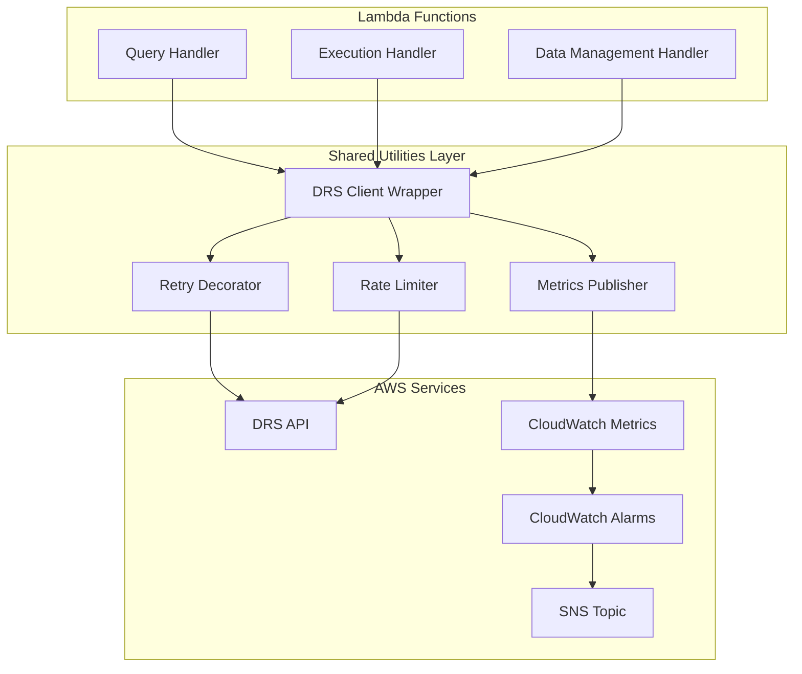
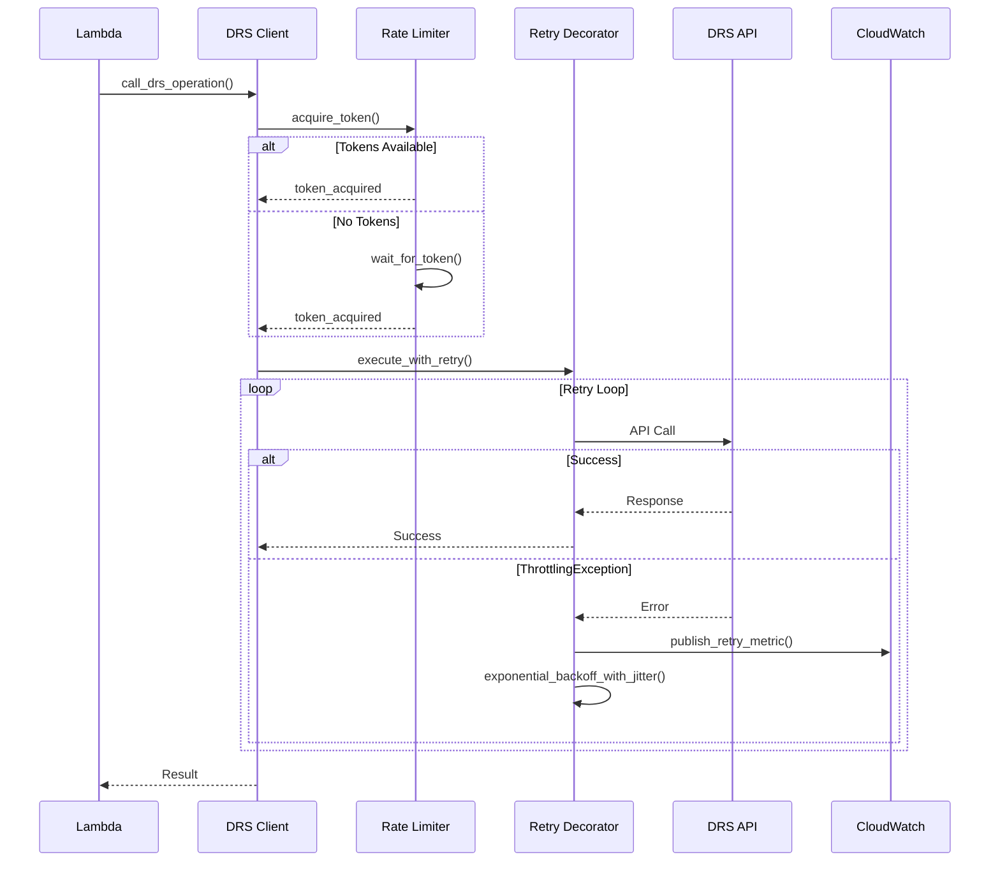

# Design Document: DRS Rate Limit Handling

## Overview

This design document describes the implementation of comprehensive DRS API rate limit handling for the AWS DR Orchestration Platform. The solution provides a layered approach combining exponential backoff retry logic, token bucket rate limiting, and CloudWatch-based monitoring with alerting.

The implementation follows a decorator pattern for retry logic and a singleton pattern for rate limiters, ensuring consistent behavior across all DRS API operations while maintaining thread safety for concurrent Lambda invocations.

## Architecture

### High-Level Architecture



### Request Flow with Rate Limiting



## Components and Interfaces

### 1. Retry Decorator (`lambda/shared/retry_decorator.py`)

A reusable Python decorator that wraps functions with exponential backoff retry logic.

```python
from functools import wraps
from typing import Callable, Optional, Set, Tuple
import logging
import random
import time

from botocore.exceptions import ClientError

logger = logging.getLogger(__name__)

# Retryable DRS error codes
RETRYABLE_ERRORS: Set[str] = {
    "ThrottlingException",
    "RequestLimitExceeded",
    "ServiceUnavailable",
    "InternalServerException",
    "ServiceQuotaExceededException",
}


class RetryConfig:
    """Configuration for retry behavior."""
    
    def __init__(
        self,
        max_retries: int = 5,
        base_delay: float = 1.0,
        max_delay: float = 60.0,
        jitter_range: Tuple[float, float] = (0.5, 1.5),
        retryable_errors: Optional[Set[str]] = None,
    ):
        self.max_retries = max_retries
        self.base_delay = base_delay
        self.max_delay = max_delay
        self.jitter_range = jitter_range
        self.retryable_errors = retryable_errors or RETRYABLE_ERRORS


def drs_retry(config: Optional[RetryConfig] = None) -> Callable:
    """
    Decorator for DRS API calls with exponential backoff retry.
    
    Args:
        config: Optional RetryConfig for customizing retry behavior
        
    Returns:
        Decorated function with retry logic
        
    Raises:
        RetryExhaustedException: When all retry attempts exhausted
    """
    if config is None:
        config = RetryConfig()
    
    def decorator(func: Callable) -> Callable:
        @wraps(func)
        def wrapper(*args, **kwargs):
            last_exception = None
            
            for attempt in range(config.max_retries + 1):
                try:
                    return func(*args, **kwargs)
                except ClientError as e:
                    error_code = e.response.get("Error", {}).get(
                        "Code", "Unknown"
                    )
                    
                    if error_code not in config.retryable_errors:
                        raise
                    
                    if attempt >= config.max_retries:
                        last_exception = e
                        break
                    
                    delay = _calculate_delay(
                        attempt,
                        config.base_delay,
                        config.max_delay,
                        config.jitter_range,
                    )
                    
                    logger.warning(
                        "Retry %d/%d for %s: %s, waiting %.2fs",
                        attempt + 1,
                        config.max_retries,
                        func.__name__,
                        error_code,
                        delay,
                    )
                    
                    time.sleep(delay)
            
            raise RetryExhaustedException(
                f"Max retries ({config.max_retries}) exhausted",
                last_exception=last_exception,
                attempts=config.max_retries + 1,
            )
        
        return wrapper
    return decorator


def _calculate_delay(
    attempt: int,
    base_delay: float,
    max_delay: float,
    jitter_range: Tuple[float, float],
) -> float:
    """Calculate delay with exponential backoff and jitter."""
    exponential_delay = base_delay * (2 ** attempt)
    capped_delay = min(exponential_delay, max_delay)
    jitter_multiplier = random.uniform(*jitter_range)
    return capped_delay * jitter_multiplier


class RetryExhaustedException(Exception):
    """Raised when all retry attempts are exhausted."""
    
    def __init__(
        self,
        message: str,
        last_exception: Exception,
        attempts: int,
    ):
        super().__init__(message)
        self.last_exception = last_exception
        self.attempts = attempts
```

### 2. Token Bucket Rate Limiter (`lambda/shared/rate_limiter.py`)

Thread-safe token bucket implementation for controlling API request rates.

```python
import threading
import time
from typing import Optional


class TokenBucket:
    """
    Thread-safe token bucket rate limiter.
    
    Implements the token bucket algorithm for controlling request rates.
    Tokens are added at a fixed rate up to a maximum capacity.
    Each request consumes one token.
    """
    
    def __init__(
        self,
        rate: float = 10.0,
        capacity: int = 20,
    ):
        """
        Initialize token bucket.
        
        Args:
            rate: Tokens added per second (default: 10 TPS for DRS API)
            capacity: Maximum tokens in bucket (default: 20 for burst)
        """
        self.rate = rate
        self.capacity = capacity
        self._tokens = float(capacity)
        self._last_update = time.monotonic()
        self._lock = threading.Lock()
    
    def acquire(self, timeout: Optional[float] = None) -> bool:
        """
        Acquire a token, blocking if necessary.
        
        Args:
            timeout: Maximum seconds to wait (None = wait forever)
            
        Returns:
            True if token acquired, False if timeout
        """
        start_time = time.monotonic()
        
        while True:
            with self._lock:
                self._refill()
                
                if self._tokens >= 1.0:
                    self._tokens -= 1.0
                    return True
                
                # Calculate wait time for next token
                wait_time = (1.0 - self._tokens) / self.rate
            
            # Check timeout
            if timeout is not None:
                elapsed = time.monotonic() - start_time
                if elapsed + wait_time > timeout:
                    return False
            
            # Wait for token to become available
            time.sleep(min(wait_time, 0.1))
    
    def try_acquire(self) -> bool:
        """
        Try to acquire a token without blocking.
        
        Returns:
            True if token acquired, False if no tokens available
        """
        with self._lock:
            self._refill()
            
            if self._tokens >= 1.0:
                self._tokens -= 1.0
                return True
            
            return False
    
    def available_tokens(self) -> float:
        """Get current number of available tokens."""
        with self._lock:
            self._refill()
            return self._tokens
    
    def _refill(self) -> None:
        """Refill tokens based on elapsed time (must hold lock)."""
        now = time.monotonic()
        elapsed = now - self._last_update
        self._last_update = now
        
        self._tokens = min(
            self.capacity,
            self._tokens + elapsed * self.rate,
        )


# Regional rate limiters (singleton per region)
_rate_limiters: dict = {}
_rate_limiter_lock = threading.Lock()


def get_rate_limiter(region: str, rate: float = 10.0, capacity: int = 20) -> TokenBucket:
    """
    Get or create a rate limiter for a specific region.
    
    Args:
        region: AWS region code
        rate: Tokens per second
        capacity: Maximum tokens
        
    Returns:
        TokenBucket instance for the region
    """
    with _rate_limiter_lock:
        if region not in _rate_limiters:
            _rate_limiters[region] = TokenBucket(rate=rate, capacity=capacity)
        return _rate_limiters[region]
```

### 3. DRS Client Wrapper (`lambda/shared/drs_client.py`)

Unified DRS client combining retry logic and rate limiting.

```python
import boto3
from typing import Any, Dict, List, Optional
from functools import wraps

from shared.retry_decorator import drs_retry, RetryConfig
from shared.rate_limiter import get_rate_limiter
from shared.metrics_publisher import publish_api_call_metric
from shared.cross_account import get_cross_account_session


class DRSClient:
    """
    DRS client wrapper with retry and rate limiting.
    
    Provides a drop-in replacement for boto3 DRS client with
    automatic retry logic and rate limiting.
    """
    
    def __init__(
        self,
        region: str,
        account_context: Optional[Dict] = None,
        retry_config: Optional[RetryConfig] = None,
        rate_limit_rate: float = 10.0,
        rate_limit_capacity: int = 20,
    ):
        """
        Initialize DRS client with rate limiting and retry.
        
        Args:
            region: AWS region
            account_context: Optional cross-account context
            retry_config: Optional retry configuration
            rate_limit_rate: Tokens per second for rate limiter
            rate_limit_capacity: Maximum tokens for rate limiter
        """
        self.region = region
        self.account_context = account_context
        self.retry_config = retry_config or RetryConfig()
        self.rate_limiter = get_rate_limiter(
            region, rate_limit_rate, rate_limit_capacity
        )
        self._client = self._create_client()
    
    def _create_client(self):
        """Create boto3 DRS client with optional cross-account access."""
        if self.account_context and not self.account_context.get("isCurrentAccount", True):
            account_id = self.account_context.get("accountId")
            role_name = self.account_context.get("assumeRoleName")
            external_id = self.account_context.get("externalId")
            
            role_arn = f"arn:aws:iam::{account_id}:role/{role_name}"
            session = get_cross_account_session(role_arn, external_id)
            return session.client("drs", region_name=self.region)
        
        return boto3.client("drs", region_name=self.region)
    
    def _rate_limited_call(self, method_name: str, *args, **kwargs) -> Any:
        """Execute a rate-limited API call with retry."""
        # Acquire rate limit token
        self.rate_limiter.acquire(timeout=30.0)
        
        # Get the actual boto3 method
        method = getattr(self._client, method_name)
        
        # Apply retry decorator dynamically
        @drs_retry(self.retry_config)
        def call_with_retry():
            return method(*args, **kwargs)
        
        try:
            result = call_with_retry()
            publish_api_call_metric(
                operation=method_name,
                region=self.region,
                success=True,
            )
            return result
        except Exception as e:
            publish_api_call_metric(
                operation=method_name,
                region=self.region,
                success=False,
                error_code=_extract_error_code(e),
            )
            raise
    
    # DRS API Methods with rate limiting
    
    def describe_source_servers(self, **kwargs) -> Dict:
        """Describe source servers with rate limiting."""
        return self._rate_limited_call("describe_source_servers", **kwargs)
    
    def describe_jobs(self, **kwargs) -> Dict:
        """Describe jobs with rate limiting."""
        return self._rate_limited_call("describe_jobs", **kwargs)
    
    def start_recovery(self, **kwargs) -> Dict:
        """Start recovery with rate limiting."""
        return self._rate_limited_call("start_recovery", **kwargs)
    
    def describe_recovery_instances(self, **kwargs) -> Dict:
        """Describe recovery instances with rate limiting."""
        return self._rate_limited_call("describe_recovery_instances", **kwargs)
    
    def terminate_recovery_instances(self, **kwargs) -> Dict:
        """Terminate recovery instances with rate limiting."""
        return self._rate_limited_call("terminate_recovery_instances", **kwargs)
    
    def get_paginator(self, operation_name: str):
        """Get paginator with rate-limited iteration."""
        return RateLimitedPaginator(
            self._client.get_paginator(operation_name),
            self.rate_limiter,
            self.retry_config,
            self.region,
        )


class RateLimitedPaginator:
    """Paginator wrapper with rate limiting per page."""
    
    def __init__(self, paginator, rate_limiter, retry_config, region):
        self._paginator = paginator
        self._rate_limiter = rate_limiter
        self._retry_config = retry_config
        self._region = region
    
    def paginate(self, **kwargs):
        """Paginate with rate limiting per page."""
        for page in self._paginator.paginate(**kwargs):
            self._rate_limiter.acquire(timeout=30.0)
            yield page


def _extract_error_code(exception: Exception) -> str:
    """Extract AWS error code from exception."""
    if hasattr(exception, "response"):
        return exception.response.get("Error", {}).get("Code", "Unknown")
    return type(exception).__name__
```

### 4. Metrics Publisher (`lambda/shared/metrics_publisher.py`)

Asynchronous CloudWatch metrics publishing for rate limit monitoring.

```python
import boto3
import threading
from typing import Dict, List, Optional
from datetime import datetime
from queue import Queue, Empty
import atexit

# Metrics namespace
METRICS_NAMESPACE = "DRS/RateLimits"

# Metric buffer for batching
_metric_buffer: Queue = Queue()
_publisher_thread: Optional[threading.Thread] = None
_shutdown_event = threading.Event()


def publish_rate_limit_error(
    error_type: str,
    region: str,
    operation: str,
) -> None:
    """
    Publish rate limit error metric to CloudWatch.
    
    Args:
        error_type: Type of error (ThrottlingException, etc.)
        region: AWS region
        operation: DRS operation name
    """
    _metric_buffer.put({
        "MetricName": "RateLimitErrors",
        "Value": 1,
        "Unit": "Count",
        "Dimensions": [
            {"Name": "ErrorType", "Value": error_type},
            {"Name": "Region", "Value": region},
            {"Name": "Operation", "Value": operation},
        ],
        "Timestamp": datetime.utcnow(),
    })
    _ensure_publisher_running()


def publish_retry_metric(
    region: str,
    operation: str,
    attempt: int,
    success: bool,
) -> None:
    """
    Publish retry attempt metric to CloudWatch.
    
    Args:
        region: AWS region
        operation: DRS operation name
        attempt: Retry attempt number
        success: Whether retry succeeded
    """
    _metric_buffer.put({
        "MetricName": "RetryAttempts",
        "Value": 1,
        "Unit": "Count",
        "Dimensions": [
            {"Name": "Region", "Value": region},
            {"Name": "Operation", "Value": operation},
            {"Name": "Attempt", "Value": str(attempt)},
            {"Name": "Success", "Value": str(success)},
        ],
        "Timestamp": datetime.utcnow(),
    })
    _ensure_publisher_running()


def publish_retry_exhausted(
    region: str,
    operation: str,
    total_attempts: int,
) -> None:
    """
    Publish retry exhausted metric to CloudWatch.
    
    Args:
        region: AWS region
        operation: DRS operation name
        total_attempts: Total retry attempts made
    """
    _metric_buffer.put({
        "MetricName": "RetryExhausted",
        "Value": 1,
        "Unit": "Count",
        "Dimensions": [
            {"Name": "Region", "Value": region},
            {"Name": "Operation", "Value": operation},
        ],
        "Timestamp": datetime.utcnow(),
    })
    _ensure_publisher_running()


def publish_api_call_metric(
    operation: str,
    region: str,
    success: bool,
    error_code: Optional[str] = None,
) -> None:
    """
    Publish API call metric to CloudWatch.
    
    Args:
        operation: DRS operation name
        region: AWS region
        success: Whether call succeeded
        error_code: Optional error code if failed
    """
    dimensions = [
        {"Name": "Region", "Value": region},
        {"Name": "Operation", "Value": operation},
        {"Name": "Success", "Value": str(success)},
    ]
    
    if error_code:
        dimensions.append({"Name": "ErrorCode", "Value": error_code})
    
    _metric_buffer.put({
        "MetricName": "APICallCount",
        "Value": 1,
        "Unit": "Count",
        "Dimensions": dimensions,
        "Timestamp": datetime.utcnow(),
    })
    _ensure_publisher_running()


def _ensure_publisher_running() -> None:
    """Ensure the background publisher thread is running."""
    global _publisher_thread
    
    if _publisher_thread is None or not _publisher_thread.is_alive():
        _publisher_thread = threading.Thread(
            target=_publisher_worker,
            daemon=True,
        )
        _publisher_thread.start()


def _publisher_worker() -> None:
    """Background worker that batches and publishes metrics."""
    cloudwatch = boto3.client("cloudwatch")
    batch: List[Dict] = []
    
    while not _shutdown_event.is_set():
        try:
            # Collect metrics with timeout
            metric = _metric_buffer.get(timeout=1.0)
            batch.append(metric)
            
            # Publish when batch is full or queue is empty
            if len(batch) >= 20 or _metric_buffer.empty():
                _publish_batch(cloudwatch, batch)
                batch = []
                
        except Empty:
            # Publish any remaining metrics
            if batch:
                _publish_batch(cloudwatch, batch)
                batch = []


def _publish_batch(cloudwatch, batch: List[Dict]) -> None:
    """Publish a batch of metrics to CloudWatch."""
    if not batch:
        return
    
    try:
        cloudwatch.put_metric_data(
            Namespace=METRICS_NAMESPACE,
            MetricData=batch,
        )
    except Exception as e:
        print(f"Error publishing metrics: {e}")


@atexit.register
def _shutdown_publisher() -> None:
    """Shutdown the publisher thread gracefully."""
    _shutdown_event.set()
    if _publisher_thread and _publisher_thread.is_alive():
        _publisher_thread.join(timeout=5.0)
```

### 5. Job Throttler (`lambda/shared/job_throttler.py`)

Semaphore-based throttling for concurrent job creation.

```python
import os
import time
import logging
from typing import Dict, Optional

import boto3

from shared.drs_limits import DRS_LIMITS

logger = logging.getLogger(__name__)

# Default throttling configuration
DEFAULT_THROTTLE_THRESHOLD = 18  # 90% of 20 concurrent jobs
DEFAULT_POLL_INTERVAL = 30  # seconds
DEFAULT_TIMEOUT = 600  # 10 minutes


class JobThrottler:
    """
    Throttles job creation when approaching DRS concurrent job limits.
    
    Implements a semaphore-like mechanism that delays job creation
    when the number of active jobs approaches the 20-job limit.
    """
    
    def __init__(
        self,
        region: str,
        drs_client=None,
        throttle_threshold: Optional[int] = None,
        poll_interval: Optional[int] = None,
        timeout: Optional[int] = None,
    ):
        """
        Initialize job throttler.
        
        Args:
            region: AWS region
            drs_client: Optional DRS client (creates one if not provided)
            throttle_threshold: Job count to start throttling (default: 18)
            poll_interval: Seconds between capacity checks (default: 30)
            timeout: Maximum seconds to wait (default: 600)
        """
        self.region = region
        self._drs_client = drs_client or boto3.client("drs", region_name=region)
        
        self.throttle_threshold = throttle_threshold or int(
            os.environ.get("JOB_THROTTLE_THRESHOLD", DEFAULT_THROTTLE_THRESHOLD)
        )
        self.poll_interval = poll_interval or int(
            os.environ.get("JOB_POLL_INTERVAL", DEFAULT_POLL_INTERVAL)
        )
        self.timeout = timeout or int(
            os.environ.get("JOB_THROTTLE_TIMEOUT", DEFAULT_TIMEOUT)
        )
    
    def wait_for_capacity(self) -> Dict:
        """
        Wait until there is capacity to create a new job.
        
        Returns:
            Dict with status and current job count
            
        Raises:
            TimeoutError: If timeout exceeded waiting for capacity
        """
        start_time = time.time()
        
        while True:
            current_jobs = self._get_active_job_count()
            
            if current_jobs < self.throttle_threshold:
                logger.info(
                    f"Job capacity available: {current_jobs}/"
                    f"{DRS_LIMITS['MAX_CONCURRENT_JOBS']} active jobs"
                )
                return {
                    "status": "CAPACITY_AVAILABLE",
                    "currentJobs": current_jobs,
                    "maxJobs": DRS_LIMITS["MAX_CONCURRENT_JOBS"],
                    "waitTime": time.time() - start_time,
                }
            
            elapsed = time.time() - start_time
            if elapsed >= self.timeout:
                raise TimeoutError(
                    f"Timeout waiting for job capacity after {elapsed:.0f}s. "
                    f"Current jobs: {current_jobs}/{DRS_LIMITS['MAX_CONCURRENT_JOBS']}"
                )
            
            logger.warning(
                f"Job throttling active: {current_jobs}/"
                f"{DRS_LIMITS['MAX_CONCURRENT_JOBS']} jobs. "
                f"Waiting {self.poll_interval}s..."
            )
            
            time.sleep(self.poll_interval)
    
    def _get_active_job_count(self) -> int:
        """Get count of active DRS jobs."""
        active_count = 0
        paginator = self._drs_client.get_paginator("describe_jobs")
        
        for page in paginator.paginate():
            for job in page.get("items", []):
                if job.get("status") in ["PENDING", "STARTED"]:
                    active_count += 1
        
        return active_count
    
    def check_capacity(self) -> Dict:
        """
        Check current job capacity without waiting.
        
        Returns:
            Dict with capacity status and metrics
        """
        current_jobs = self._get_active_job_count()
        max_jobs = DRS_LIMITS["MAX_CONCURRENT_JOBS"]
        
        return {
            "currentJobs": current_jobs,
            "maxJobs": max_jobs,
            "availableSlots": max_jobs - current_jobs,
            "throttlingActive": current_jobs >= self.throttle_threshold,
            "atCapacity": current_jobs >= max_jobs,
        }
```

## Data Models

### RetryConfig

```python
@dataclass
class RetryConfig:
    """Configuration for retry behavior."""
    max_retries: int = 5
    base_delay: float = 1.0
    max_delay: float = 60.0
    jitter_range: Tuple[float, float] = (0.5, 1.5)
    retryable_errors: Set[str] = field(default_factory=lambda: {
        "ThrottlingException",
        "RequestLimitExceeded", 
        "ServiceUnavailable",
        "InternalServerException",
        "ServiceQuotaExceededException",
    })
```

### RateLimitMetric

```python
@dataclass
class RateLimitMetric:
    """CloudWatch metric for rate limit events."""
    metric_name: str
    value: float
    unit: str
    dimensions: List[Dict[str, str]]
    timestamp: datetime
```

### ThrottleStatus

```python
@dataclass
class ThrottleStatus:
    """Status of job throttling."""
    current_jobs: int
    max_jobs: int
    available_slots: int
    throttling_active: bool
    at_capacity: bool
    wait_time: Optional[float] = None
```

## Correctness Properties

*A property is a characteristic or behavior that should hold true across all valid executions of a system—essentially, a formal statement about what the system should do. Properties serve as the bridge between human-readable specifications and machine-verifiable correctness guarantees.*


### Property 1: Retry on Retryable Errors

*For any* DRS API call that throws a retryable error (ThrottlingException, RequestLimitExceeded, ServiceUnavailable, InternalServerException, ServiceQuotaExceededException), the Retry_Decorator SHALL retry the call up to the configured maximum retries before failing.

**Validates: Requirements 1.1, 1.2, 1.3**

### Property 2: Exponential Backoff with Jitter

*For any* retry attempt, the delay SHALL be calculated as `min(base_delay * 2^attempt, max_delay) * jitter` where jitter is a random value within the configured jitter_range, ensuring delays are non-deterministic and bounded.

**Validates: Requirements 1.4, 1.6, 1.7**

### Property 3: Retry Configuration Respected

*For any* RetryConfig with custom max_retries, base_delay, and max_delay values, the Retry_Decorator SHALL make exactly max_retries retry attempts (max_retries + 1 total calls) with delays respecting the configured bounds.

**Validates: Requirements 1.5, 1.6, 1.7**

### Property 4: Retry Exhaustion Exception

*For any* operation that fails all retry attempts, the Retry_Decorator SHALL raise a RetryExhaustedException containing the original exception and the total number of attempts made.

**Validates: Requirements 1.8**

### Property 5: Token Bucket Invariants

*For any* sequence of acquire/release operations on a TokenBucket, the token count SHALL always be between 0 and capacity (inclusive), tokens SHALL be consumed on successful acquire, and tokens SHALL refill at the configured rate over time.

**Validates: Requirements 2.1, 2.3, 2.4, 2.5, 2.6, 2.7, 2.8**

### Property 6: Token Bucket Thread Safety

*For any* concurrent access to a TokenBucket from multiple threads, the total tokens consumed SHALL equal the number of successful acquires, with no race conditions causing over-consumption or token loss.

**Validates: Requirements 2.2**

### Property 7: DRS Client Rate Limiting Integration

*For any* DRS_Client method call, the Rate_Limiter SHALL be consulted before the API call is made, and the Retry_Decorator SHALL be applied to handle transient errors.

**Validates: Requirements 3.2, 3.3**

### Property 8: Region-Specific Rate Limiters

*For any* two DRS_Client instances with different regions, they SHALL use independent TokenBucket instances, such that consuming tokens in one region does not affect token availability in another region.

**Validates: Requirements 3.8**

### Property 9: Metrics Publication Correctness

*For any* rate limit error, retry attempt, or retry exhaustion event, the system SHALL publish a CloudWatch metric with the correct metric name, value, and dimensions (region, operation, error type).

**Validates: Requirements 4.1, 4.2, 4.3, 4.4**

### Property 10: Job Throttler Capacity Check

*For any* job creation request when active jobs are at or above the throttle threshold, the JobThrottler SHALL block and poll for capacity until either capacity becomes available or the timeout is reached.

**Validates: Requirements 6.1, 6.2, 6.6**

### Property 11: Job Throttler Timeout

*For any* job creation request that waits for capacity, if the timeout duration is exceeded without capacity becoming available, the JobThrottler SHALL raise a TimeoutError with the current job count and wait duration.

**Validates: Requirements 6.7**

### Property 12: Structured Error Logging

*For any* rate limit error or retry exhaustion event, the system SHALL produce a structured JSON log entry containing operation name, region, account context, error details, and correlation ID.

**Validates: Requirements 7.1, 7.2, 7.4, 7.5**

## Integration with Existing Codebase

### Current DRS API Call Patterns

The execution-handler currently creates DRS clients directly via `boto3.client("drs", region_name=region)` in multiple locations:
- `start_drs_recovery()` - Starting recovery jobs
- `get_launch_configurations()` - Fetching launch configs
- `poll_wave_status()` - Polling job status
- `terminate_recovery_instances()` - Terminating instances
- `describe_source_servers()` - Querying servers

### Migration Strategy

The new `DRSClient` wrapper will be introduced as a drop-in replacement:

```python
# Before (current pattern)
drs_client = boto3.client("drs", region_name=region)
response = drs_client.describe_source_servers()

# After (with rate limiting)
from shared.drs_client import DRSClient
drs_client = DRSClient(region=region)
response = drs_client.describe_source_servers()
```

### Integration with Existing Shared Utilities

The new modules follow existing patterns from `lambda/shared/`:

1. **Follows `notifications.py` pattern**: Non-blocking, failure-tolerant operations
2. **Follows `response_utils.py` pattern**: Consistent error handling and logging
3. **Follows `cross_account.py` pattern**: Supports cross-account operations via role assumption
4. **Follows `drs_limits.py` pattern**: Uses existing DRS_LIMITS constants

### SNS Integration for Escalation

Leverages existing SNS notification infrastructure:

```python
# Uses existing DRS_ALERTS_TOPIC_ARN from notifications.py
from shared.notifications import DRS_ALERTS_TOPIC_ARN

def send_rate_limit_escalation(
    operation: str,
    region: str,
    error_details: str,
    retry_count: int,
) -> None:
    """Send escalation notification when retries exhausted."""
    if not DRS_ALERTS_TOPIC_ARN:
        print("No DRS alerts topic configured")
        return
    
    try:
        subject = f"⚠️ DRS Rate Limit Escalation - {region}"
        message = f"""
⚠️ DRS API Rate Limit Escalation

Details:
• Operation: {operation}
• Region: {region}
• Retry Attempts: {retry_count}
• Error: {error_details}
• Timestamp: {datetime.now(timezone.utc).strftime('%Y-%m-%d %H:%M:%S UTC')}

Recommended Actions:
1. Check DRS service quotas in AWS Console
2. Review concurrent job count in region
3. Consider spreading operations across regions
4. Contact AWS Support if limits need increase
"""
        sns.publish(TopicArn=DRS_ALERTS_TOPIC_ARN, Subject=subject, Message=message)
    except Exception as e:
        print(f"Warning: Failed to send rate limit escalation: {e}")
```

## Error Handling

### Retry Error Handling

The retry decorator handles errors in a layered approach:

1. **Retryable Errors**: ThrottlingException, RequestLimitExceeded, ServiceUnavailable, InternalServerException, ServiceQuotaExceededException are automatically retried with exponential backoff.

2. **Non-Retryable Errors**: All other errors (AccessDenied, ValidationException, etc.) are raised immediately without retry.

3. **Retry Exhaustion**: When max retries are exceeded, a `RetryExhaustedException` is raised containing:
   - Original exception for debugging
   - Total attempt count
   - Operation context

```python
try:
    result = drs_client.describe_source_servers()
except RetryExhaustedException as e:
    logger.critical(
        f"DRS API call failed after {e.attempts} attempts",
        extra={
            "operation": "describe_source_servers",
            "last_error": str(e.last_exception),
            "attempts": e.attempts,
        }
    )
    # Publish escalation metric and SNS notification
    publish_retry_exhausted(region, "describe_source_servers", e.attempts)
    send_escalation_notification(e)
    raise
```

### Rate Limiter Error Handling

1. **Token Acquisition Timeout**: If `acquire(timeout=X)` times out, returns `False` instead of blocking indefinitely.

2. **Rate Limiter Initialization**: Rate limiters are lazily initialized per region to avoid startup overhead.

### Job Throttler Error Handling

1. **Timeout**: Raises `TimeoutError` with context when capacity doesn't become available.

2. **DRS API Errors**: Errors querying job status are logged but don't block job creation (fail-open for availability).

```python
try:
    throttler.wait_for_capacity()
    drs_client.start_recovery(...)
except TimeoutError as e:
    logger.error(f"Job throttling timeout: {e}")
    return response(429, {
        "error": "JOB_CAPACITY_TIMEOUT",
        "message": str(e),
        "currentJobs": throttler.check_capacity()["currentJobs"],
    })
```

## Testing Strategy

### Dual Testing Approach

This feature requires both unit tests and property-based tests for comprehensive coverage:

- **Unit tests**: Verify specific examples, edge cases, and integration points
- **Property tests**: Verify universal properties across all valid inputs using Hypothesis

### Property-Based Testing Configuration

- **Library**: Hypothesis (Python property-based testing library)
- **Minimum iterations**: 100 per property test
- **Tag format**: `Feature: drs-rate-limit-handling, Property {number}: {property_text}`

### Test Categories

#### 1. Retry Decorator Tests

**Unit Tests**:
- Test retry on specific error codes (ThrottlingException, etc.)
- Test immediate failure on non-retryable errors
- Test default configuration values
- Test custom configuration values

**Property Tests**:
- Property 1: Retry on retryable errors
- Property 2: Exponential backoff with jitter bounds
- Property 3: Configuration respected
- Property 4: Retry exhaustion exception

#### 2. Token Bucket Tests

**Unit Tests**:
- Test initial token count equals capacity
- Test token consumption decrements count
- Test token refill over time
- Test blocking behavior when empty

**Property Tests**:
- Property 5: Token bucket invariants
- Property 6: Thread safety under concurrent access

#### 3. DRS Client Tests

**Unit Tests**:
- Test rate limiter integration
- Test retry decorator application
- Test cross-account client creation
- Test paginator rate limiting

**Property Tests**:
- Property 7: Rate limiting integration
- Property 8: Region-specific rate limiters

#### 4. Metrics Publisher Tests

**Unit Tests**:
- Test metric structure and dimensions
- Test namespace configuration
- Test batching behavior

**Property Tests**:
- Property 9: Metrics publication correctness

#### 5. Job Throttler Tests

**Unit Tests**:
- Test capacity check at various job counts
- Test throttling activation at threshold
- Test timeout behavior
- Test environment variable configuration

**Property Tests**:
- Property 10: Capacity check behavior
- Property 11: Timeout behavior

#### 6. Error Logging Tests

**Unit Tests**:
- Test log format structure
- Test correlation ID inclusion
- Test severity categorization

**Property Tests**:
- Property 12: Structured error logging

### Test File Organization

```
tests/unit/
├── test_retry_decorator_unit.py
├── test_retry_decorator_property.py
├── test_rate_limiter_unit.py
├── test_rate_limiter_property.py
├── test_drs_client_unit.py
├── test_drs_client_property.py
├── test_metrics_publisher_unit.py
├── test_metrics_publisher_property.py
├── test_job_throttler_unit.py
├── test_job_throttler_property.py
└── test_error_logging_property.py
```

### Mocking Strategy

- **boto3 clients**: Mock DRS, CloudWatch, SNS clients for isolated testing
- **Time functions**: Mock `time.sleep` and `time.monotonic` for deterministic timing tests
- **Threading**: Use `threading.Barrier` for synchronized concurrent tests
- **Environment variables**: Use `unittest.mock.patch.dict` for configuration tests

## Coding Standards Compliance

### Python Standards (PEP 8)

All new modules MUST follow these standards:

1. **Line Length**: Maximum 79 characters per line
2. **Indentation**: 4 spaces (no tabs)
3. **String Quotes**: Double quotes for strings
4. **Import Organization**:
   ```python
   # 1. Standard library
   import logging
   import threading
   import time
   from datetime import datetime, timezone
   from functools import wraps
   from typing import Any, Callable, Dict, List, Optional, Set, Tuple
   
   # 2. Third-party
   import boto3
   from botocore.exceptions import ClientError
   
   # 3. Local
   from shared.cross_account import get_cross_account_session
   from shared.drs_limits import DRS_LIMITS
   ```

5. **Type Hints**: Required on all functions
   ```python
   def calculate_delay(
       attempt: int,
       base_delay: float,
       max_delay: float,
   ) -> float:
       """Calculate exponential backoff delay."""
       pass
   ```

6. **Docstrings**: Required on all public functions following Google style
   ```python
   def drs_retry(config: Optional[RetryConfig] = None) -> Callable:
       """
       Decorator for DRS API calls with exponential backoff retry.
       
       Args:
           config: Optional RetryConfig for customizing retry behavior
           
       Returns:
           Decorated function with retry logic
           
       Raises:
           RetryExhaustedException: When all retry attempts are exhausted
       """
       pass
   ```

7. **Logging**: Use `logging` module instead of `print()`
   ```python
   import logging
   
   logger = logging.getLogger(__name__)
   
   logger.info("Starting DRS operation")
   logger.warning("Rate limit encountered, retrying")
   logger.error("Operation failed", exc_info=True)
   ```

8. **Error Handling**: Use specific exceptions
   ```python
   try:
       result = drs_client.describe_source_servers()
   except ClientError as e:
       error_code = e.response["Error"]["Code"]
       if error_code == "ThrottlingException":
           logger.warning(f"Throttled: {e}")
           # Handle throttling
       else:
           logger.error(f"DRS API error: {e}")
           raise
   except Exception as e:
       logger.exception("Unexpected error")
       raise
   ```

### Testing Standards

1. **Test File Naming**: `test_{module}_unit.py` and `test_{module}_property.py`
2. **Test Function Naming**: `test_{scenario}_{expected_outcome}`
3. **Property Test Markers**: Use `@pytest.mark.property` decorator
4. **Minimum Coverage**: 80% code coverage for new modules
