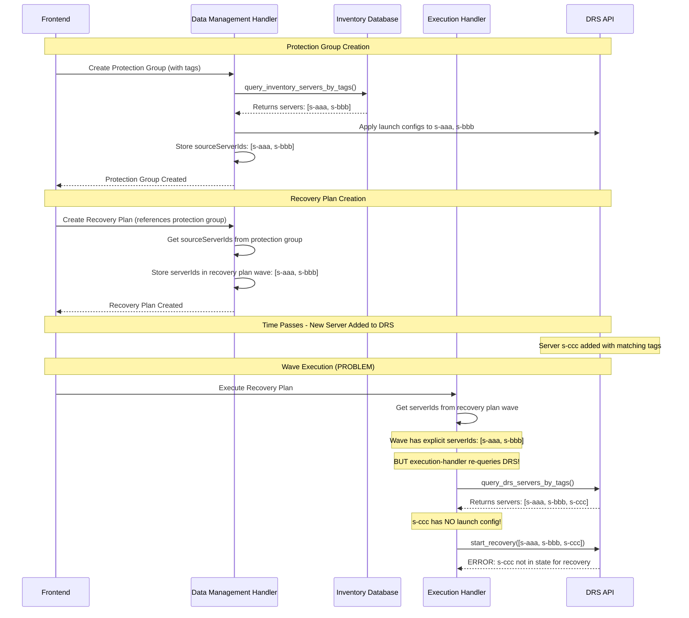
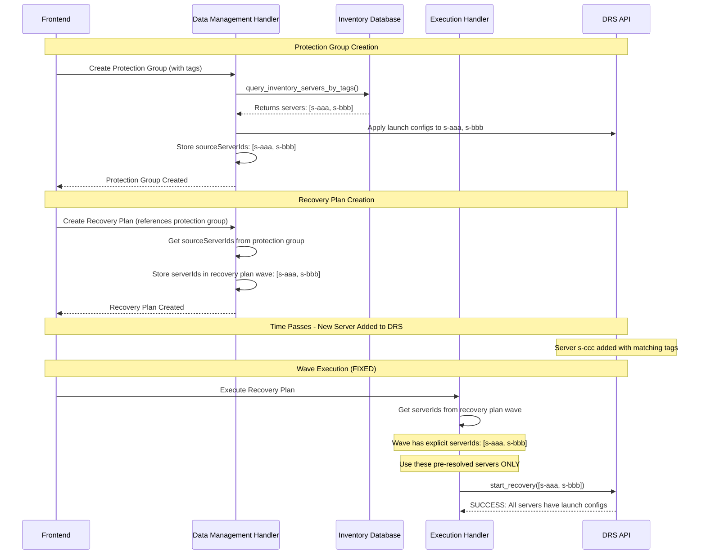
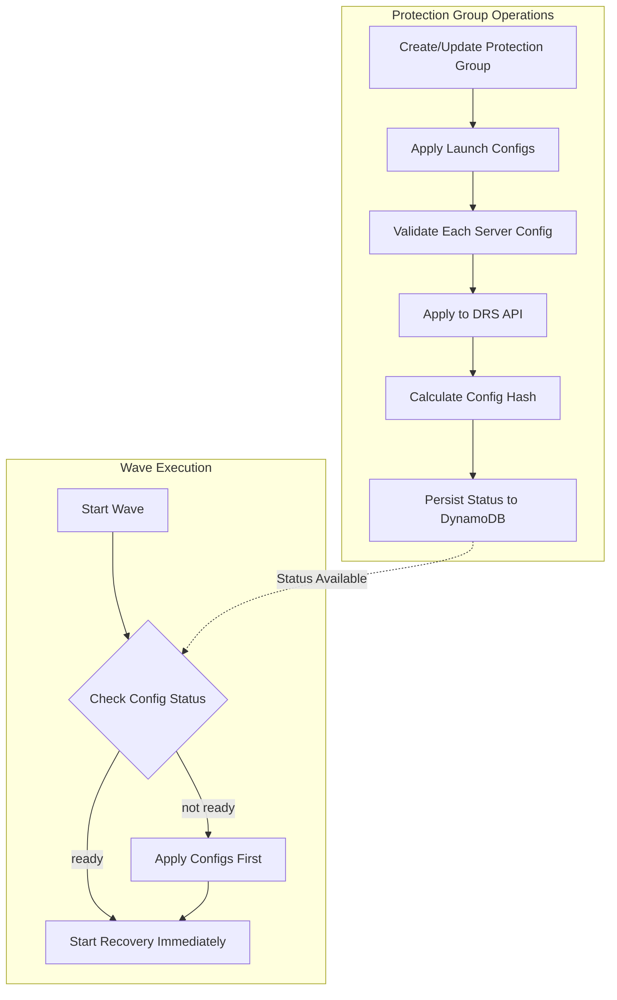
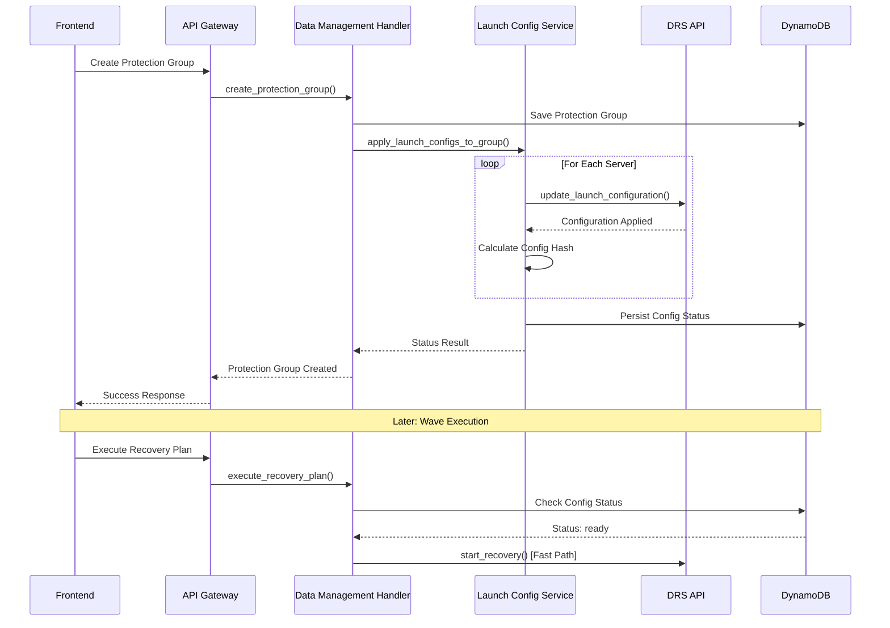

# Launch Configuration Pre-Application - Design Document

## Overview

This design fixes a critical bug in the DR Orchestration Platform where recovery executions fail with "Source server ARN is not in a state that allows recovery" errors. The root cause is duplicate server resolution logic in the execution-handler that re-queries DRS at execution time, discovering new servers that don't have launch configurations applied.

**Root Cause:**
When protection groups use tag-based server selection (`serverSelectionTags`), the system resolves servers at two different times:
1. **Creation Time** (`create_protection_group` in data-management-handler): Queries inventory database, resolves servers, applies launch configs, stores `sourceServerIds`
2. **Execution Time** (`start_wave_recovery` in execution-handler): Re-queries DRS API directly, may discover different servers

This causes execution-time discovery of new servers (added to DRS after protection group creation) that don't have launch configurations applied, resulting in recovery failures.

**Solution:**
Remove the duplicate server resolution logic from execution-handler. The execution-handler should use the pre-resolved `sourceServerIds` from the protection group instead of re-querying DRS. This ensures only servers with applied launch configurations are included in recovery operations.

As a secondary optimization, this design also implements performance improvements by pre-applying DRS launch configurations when protection groups are created or updated, rather than applying them at runtime during wave execution. This eliminates 30-60 seconds of configuration overhead per wave, reducing total execution time by approximately 80%.

### Key Benefits

- **Correctness**: Fixes recovery execution failures caused by duplicate server resolution
- **Consistency**: Ensures only servers with launch configs are recovered
- **Performance**: Wave execution time reduced from 30-60s to 5-10s per wave
- **Visibility**: Configuration status tracked per server with error details
- **Reliability**: Configuration drift detection prevents stale configs
- **Flexibility**: Manual re-apply operation for recovery from failures
- **Backward Compatible**: Falls back to runtime application if configs not pre-applied

## Duplicate Server Resolution Fix

### Current Problematic Flow



### Fixed Flow



### Code Changes Required

**File: `lambda/execution-handler/index.py`**

**Location: Line ~1850 in `start_wave_recovery()` function**

**Current Code (PROBLEMATIC):**
```python
def start_wave_recovery(state: Dict, wave_number: int) -> None:
    """Start recovery for a specific wave."""
    wave = state["waves"][wave_number - 1]
    
    # Wave already has explicit serverIds from recovery plan creation
    # Recovery plan resolved servers from protection group at plan creation time
    server_ids = wave.get("serverIds", [])
    
    # PROBLEM: Execution-handler ignores pre-resolved serverIds
    # and re-queries DRS using tags from protection group
    protection_group_id = wave.get("protectionGroupId")
    protection_group = get_protection_group(protection_group_id)
    
    if "serverSelectionTags" in protection_group:
        # Re-queries DRS API, may find NEW servers without launch configs
        server_ids = query_drs_servers_by_tags(
            protection_group["serverSelectionTags"],
            protection_group["region"]
        )
    
    # Start recovery with potentially incorrect server list
    start_drs_recovery(server_ids, ...)
```

**Fixed Code:**
```python
def start_wave_recovery(state: Dict, wave_number: int) -> None:
    """Start recovery for a specific wave."""
    wave = state["waves"][wave_number - 1]
    
    # FIXED: Use pre-resolved serverIds from recovery plan wave
    # These servers were resolved at recovery plan creation time
    # from the protection group's sourceServerIds
    # All these servers have launch configs applied
    server_ids = wave.get("serverIds", [])
    
    if not server_ids:
        raise ValueError(
            f"Wave {wave_number} has no server IDs. "
            "This should not happen - waves must have servers."
        )
    
    logger.info(
        f"Starting recovery for wave {wave_number} with "
        f"{len(server_ids)} pre-resolved servers from recovery plan"
    )
    
    # Start recovery with correct server list (all have launch configs)
    start_drs_recovery(server_ids, ...)
```

### Why This Fix Is Correct

1. **Server Resolution Happens Twice (Correctly)**:
   - At protection group creation: Tags → servers → launch configs applied → `sourceServerIds` stored
   - At recovery plan creation: Protection group `sourceServerIds` → recovery plan wave `serverIds`

2. **Launch Configs Applied Once**: To the resolved servers at protection group creation

3. **Execution Uses Pre-Resolved List**: From recovery plan wave `serverIds`, no re-querying

4. **Consistency Guaranteed**: Only servers with launch configs are recovered

5. **Tag-Based Selection Still Works**: Tags are used at protection group creation time to resolve servers

### Impact on Tag-Based Protection Groups

**Before Fix:**
- Tags used at protection group creation to resolve servers
- Server IDs copied to recovery plan at plan creation
- Tags used AGAIN at wave execution to re-resolve servers
- New servers discovered at execution time (without launch configs)
- Recovery fails for new servers

**After Fix:**
- Tags used ONLY at protection group creation to resolve servers
- Server IDs copied to recovery plan at plan creation
- Execution uses pre-resolved server IDs from recovery plan wave
- No new servers discovered at execution time
- Recovery succeeds for all servers (all have launch configs)

**To Add New Servers:**
- User must update the protection group (triggers re-resolution using tags)
- Launch configs applied to new servers
- New servers added to `sourceServerIds`
- User must create NEW recovery plan (or update existing plan)
- New recovery plan includes updated server list
- Next execution includes new servers

### Backward Compatibility

**Recovery Plans Without Explicit Server IDs:**
- Should not exist (recovery plans always resolve servers from protection groups)
- If they exist, execution will fail with clear error message
- User must recreate recovery plan

**Recovery Plans With Explicit Server IDs:**
- Already have `serverIds` in each wave
- Fix removes execution-time tag resolution
- Uses existing `serverIds` field from wave
- Fully compatible with existing data

**Migration:**
- No data migration required
- All existing recovery plans have `serverIds` in waves
- Fix is purely code change in execution-handler

## Architecture

### High-Level Flow



### Component Interaction



## Components and Interfaces

### 1. Launch Config Service (lambda/shared/launch_config_service.py)

New shared utility module for configuration application and status management.

#### Core Functions

```python
def apply_launch_configs_to_group(
    group_id: str,
    region: str,
    server_ids: List[str],
    launch_configs: Dict[str, Dict],
    account_context: Optional[Dict] = None,
    timeout_seconds: int = 300
) -> Dict:
    """
    Apply launch configurations to all servers in a protection group.
    
    Args:
        group_id: Protection group ID
        region: AWS region
        server_ids: List of DRS source server IDs
        launch_configs: Dict mapping server_id to launch config
        account_context: Cross-account context (for staging accounts)
        timeout_seconds: Maximum time to spend applying configs
        
    Returns:
        {
            "status": "ready" | "partial" | "failed",
            "appliedServers": 10,
            "failedServers": 0,
            "serverConfigs": {
                "s-xxx": {
                    "status": "ready",
                    "lastApplied": "2025-02-16T10:30:00Z",
                    "configHash": "sha256:abc123...",
                    "errors": []
                }
            },
            "errors": []
        }
    """


def calculate_config_hash(launch_config: Dict) -> str:
    """
    Calculate SHA-256 hash of launch configuration for drift detection.
    
    Args:
        launch_config: Launch configuration dictionary
        
    Returns:
        Hash string in format "sha256:abc123..."
    """

def get_config_status(group_id: str) -> Dict:
    """
    Retrieve configuration status from DynamoDB.
    
    Args:
        group_id: Protection group ID
        
    Returns:
        {
            "status": "ready" | "pending" | "failed" | "not_configured",
            "lastApplied": "2025-02-16T10:30:00Z",
            "appliedBy": "user@example.com",
            "serverConfigs": {...},
            "errors": []
        }
    """

def persist_config_status(
    group_id: str,
    config_status: Dict
) -> None:
    """
    Persist configuration status to DynamoDB.
    
    Args:
        group_id: Protection group ID
        config_status: Status dictionary to persist
    """

def detect_config_drift(
    group_id: str,
    current_configs: Dict[str, Dict]
) -> Dict:
    """
    Detect configuration drift by comparing current config hashes
    with stored hashes.
    
    Args:
        group_id: Protection group ID
        current_configs: Current launch configurations
        
    Returns:
        {
            "hasDrift": bool,
            "driftedServers": ["s-xxx", ...],
            "details": {...}
        }
    """
```

#### Error Handling

```python
class LaunchConfigApplicationError(Exception):
    """Base exception for launch config application errors."""
    pass

class LaunchConfigTimeoutError(LaunchConfigApplicationError):
    """Raised when config application exceeds timeout."""
    pass

class LaunchConfigValidationError(LaunchConfigApplicationError):
    """Raised when config validation fails."""
    pass
```

### 2. Data Management Handler Integration

Modifications to `lambda/data-management-handler/index.py`:

#### New Operations

```python
def apply_launch_configs(group_id: str, body: Dict) -> Dict:
    """
    Manually apply launch configurations to a protection group.
    
    Supports three invocation methods:
    - Frontend: Via API Gateway with Cognito auth
    - API: Via API Gateway with IAM auth
    - Direct: Lambda invocation with operation parameter
    
    Args:
        group_id: Protection group ID
        body: {"force": bool}  # Force re-apply even if status is ready
        
    Returns:
        {
            "groupId": "pg-xxx",
            "status": "ready",
            "appliedServers": 10,
            "failedServers": 0,
            "errors": []
        }
    """

def get_launch_config_status(group_id: str) -> Dict:
    """
    Get launch configuration status for a protection group.
    
    Supports three invocation methods.
    
    Args:
        group_id: Protection group ID
        
    Returns:
        Configuration status dictionary
    """
```

#### Modified Operations

```python
def create_protection_group(event: Dict, body: Dict) -> Dict:
    """
    Create protection group with automatic launch config application.
    
    Flow:
    1. Validate inputs
    2. Create protection group in DynamoDB
    3. Apply launch configs (with timeout)
    4. Return response with config status
    
    If config application times out or fails:
    - Group creation still succeeds
    - Config status marked as "pending" or "failed"
    - User can manually re-apply later
    """

def update_protection_group(group_id: str, body: Dict) -> Dict:
    """
    Update protection group with selective config re-application.
    
    Re-apply configs if:
    - Server list changed (added/removed servers)
    - Launch configurations changed
    - force=true in request body
    
    Otherwise, preserve existing config status.
    """
```

### 3. Execution Handler Optimization

Modifications to `lambda/execution-handler/index.py`:

```python
def start_wave_recovery(state: Dict, wave_number: int) -> None:
    """
    Start wave recovery with config status check.
    
    Flow:
    1. Get protection group ID from state
    2. Check config status in DynamoDB
    3. If status is "ready":
       - Start recovery immediately (fast path)
    4. If status is not "ready":
       - Apply configs first (fallback path)
       - Then start recovery
    5. Detect config drift and re-apply if needed
    """
    
    group_id = state["protectionGroupId"]
    
    # Check configuration status
    config_status = launch_config_service.get_config_status(group_id)
    
    if config_status["status"] == "ready":
        # Fast path: configs already applied
        logger.info(f"Launch configs pre-applied for {group_id}, starting recovery immediately")
        start_drs_recovery_for_wave(state, wave_number)
    else:
        # Fallback path: apply configs at runtime
        logger.warning(f"Launch configs not ready for {group_id}, applying at runtime")
        apply_launch_config_before_recovery(state, wave_number)
        start_drs_recovery_for_wave(state, wave_number)
```

### 4. DynamoDB Schema Extension

Add `launchConfigStatus` field to protection groups table:

```python
# Protection Group Item Structure
{
    "groupId": "pg-abc123",
    "name": "Web Servers",
    "region": "us-east-2",
    "serverIds": ["s-xxx", "s-yyy"],
    "launchConfigs": {...},
    
    # NEW: Launch configuration status
    "launchConfigStatus": {
        "status": "ready",  # ready | pending | failed | not_configured
        "lastApplied": "2025-02-16T10:30:00Z",
        "appliedBy": "user@example.com",
        "serverConfigs": {
            "s-xxx": {
                "status": "ready",
                "lastApplied": "2025-02-16T10:30:00Z",
                "configHash": "sha256:abc123...",
                "errors": []
            },
            "s-yyy": {
                "status": "failed",
                "lastApplied": "2025-02-16T10:30:00Z",
                "configHash": null,
                "errors": ["DRS API timeout"]
            }
        },
        "errors": []
    }
}
```

## Data Models

### LaunchConfigStatus

```python
from typing import Dict, List, Optional
from datetime import datetime

class ServerConfigStatus:
    """Per-server configuration status."""
    
    status: str  # ready | pending | failed
    last_applied: datetime
    config_hash: Optional[str]
    errors: List[str]

class LaunchConfigStatus:
    """Protection group launch configuration status."""
    
    status: str  # ready | pending | failed | not_configured
    last_applied: Optional[datetime]
    applied_by: Optional[str]
    server_configs: Dict[str, ServerConfigStatus]
    errors: List[str]
    
    def is_ready(self) -> bool:
        """Check if all servers have ready status."""
        return self.status == "ready"
    
    def get_failed_servers(self) -> List[str]:
        """Get list of server IDs with failed status."""
        return [
            server_id 
            for server_id, config in self.server_configs.items()
            if config.status == "failed"
        ]
```

## Correctness Properties

*A property is a characteristic or behavior that should hold true across all valid executions of a system—essentially, a formal statement about what the system should do. Properties serve as the bridge between human-readable specifications and machine-verifiable correctness guarantees.*

Before writing the correctness properties, I need to analyze the acceptance criteria from the requirements document to determine which are testable as properties, examples, or edge cases.


### Property Reflection

After analyzing the acceptance criteria, I identified several areas where properties can be consolidated:

**Redundancy Analysis:**
- Properties 1.1 and 1.2 (launch configs and launch template settings applied) can be combined into a single property about complete configuration application
- Properties 1.5, 4.1, and 4.2 (wave execution checks status and starts immediately if ready) can be combined into a single property about the fast path
- Properties 2.2 and 2.3 (status values and timestamp) can be combined into a single property about status schema validity
- Properties 3.2, 3.3, and 3.4 (re-apply behavior) can be combined into a single comprehensive property about re-apply completeness
- Properties 4.3 and 4.4 (fallback path and drift detection) can be combined into a single property about configuration recovery

**Consolidated Properties:**
After reflection, we have 12 unique, non-redundant properties that provide comprehensive validation coverage.

### Correctness Properties

Property 1: Configuration Application Completeness
*For any* protection group create or update operation with launch configurations, all server configurations (including launch configs and launch template settings) should be applied to DRS and the application status should be persisted to DynamoDB.
**Validates: Requirements 1.1, 1.2, 1.4**

Property 2: Configuration Validation Before Persistence
*For any* configuration application attempt, validation must occur before any data is persisted to DynamoDB, ensuring that invalid configurations are rejected without creating inconsistent state.
**Validates: Requirements 1.3**

Property 3: Wave Execution Fast Path
*For any* wave execution where the protection group has configuration status "ready", the wave should start recovery immediately without making DRS API calls to apply configurations.
**Validates: Requirements 1.5, 4.1, 4.2**

Property 4: Configuration Status Schema Validity
*For any* protection group with configuration status, the status field must be one of ["ready", "pending", "failed", "not_configured"], and if status is not "not_configured", the lastApplied timestamp must be present and valid.
**Validates: Requirements 2.1, 2.2, 2.3**

Property 5: Error Visibility
*For any* configuration application that fails for one or more servers, the errors array in the configuration status must contain descriptive error messages for each failed server.
**Validates: Requirements 2.4, 3.4**

Property 6: Re-apply Operation Completeness
*For any* manual re-apply operation on a protection group, all servers in the group must have their configurations validated and applied, and the resulting status must accurately reflect the outcome (ready if all succeeded, failed if any failed).
**Validates: Requirements 3.2, 3.3**

Property 7: Wave Execution Fallback Path
*For any* wave execution where the protection group has configuration status not "ready" (pending, failed, or not_configured), configurations must be applied before starting recovery.
**Validates: Requirements 4.3**

Property 8: Configuration Drift Detection
*For any* wave execution, if the current configuration hash differs from the stored hash in DynamoDB, the configurations must be re-applied before starting recovery.
**Validates: Requirements 4.4**

Property 9: Status Update Atomicity
*For any* configuration status update operation, either all fields (status, lastApplied, serverConfigs) are updated together, or none are updated, ensuring atomic state transitions.
**Validates: Requirements 4.5**

Property 10: Configuration Hash Consistency
*For any* launch configuration, calculating the hash multiple times with the same input should always produce the same hash value (idempotent hash calculation).
**Validates: Requirements 4.4** (drift detection depends on consistent hashing)

Property 11: Status Transition Validity
*For any* sequence of configuration operations on a protection group, the status transitions must follow valid paths: not_configured → pending → (ready | failed), and ready → pending → (ready | failed) on re-apply.
**Validates: Requirements 1.4, 3.3, 4.5**

Property 12: Configuration Round-Trip Persistence
*For any* configuration status persisted to DynamoDB, retrieving the status immediately after persistence should return an equivalent status object with all fields intact.
**Validates: Requirements 1.4**

## Error Handling

### Configuration Application Errors

**Timeout Handling:**
- Configuration application has a configurable timeout (default: 300 seconds)
- If timeout is reached, mark remaining servers as "pending"
- Protection group operation still succeeds
- User can manually re-apply later

**DRS API Errors:**
- Capture per-server errors (throttling, validation, permissions)
- Store errors in configuration status
- Continue applying to other servers (partial success)
- Overall status reflects worst case (failed if any server failed)

**Validation Errors:**
- Validate configurations before applying to DRS
- Reject invalid configurations early
- Return validation errors to user
- Do not persist invalid configuration status

### Wave Execution Error Handling

**Config Status Check Failures:**
- If DynamoDB query fails, fall back to runtime config application
- Log warning but continue with wave execution
- Ensures backward compatibility

**Config Application Failures During Wave:**
- If runtime config application fails, fail the wave
- Capture errors in wave status
- User can retry wave after fixing configurations

**Drift Detection Failures:**
- If hash calculation fails, assume drift and re-apply
- Safer to re-apply than risk stale configs
- Log warning for investigation

## Testing Strategy

### Unit Testing

**Test Coverage:**
- All functions in `launch_config_service.py`
- Configuration application logic
- Hash calculation and drift detection
- Status persistence and retrieval
- Error handling and retry logic

**Test Files:**
- `test_launch_config_service_unit.py`: Core service functions
- `test_data_management_launch_config_integration.py`: Integration with data management
- `test_execution_handler_launch_config_optimization.py`: Integration with execution handler

### Property-Based Testing

**Property Test Configuration:**
- Minimum 100 iterations per property test
- Use Hypothesis library for Python
- Tag each test with feature name and property number

**Test Files:**
- `test_launch_config_service_property.py`: Properties 1-12

**Example Property Test:**
```python
from hypothesis import given, strategies as st
import pytest

@given(
    group_id=st.text(min_size=1),
    server_ids=st.lists(st.text(min_size=1), min_size=1, max_size=10),
    launch_configs=st.dictionaries(
        keys=st.text(min_size=1),
        values=st.dictionaries(
            keys=st.text(min_size=1),
            values=st.text()
        )
    )
)
def test_property_1_configuration_application_completeness(
    group_id, server_ids, launch_configs
):
    """
    Feature: launch-config-preapplication, Property 1:
    For any protection group with launch configurations,
    all server configurations should be applied and status persisted.
    """
    # Apply configurations
    result = apply_launch_configs_to_group(
        group_id=group_id,
        region="us-east-2",
        server_ids=server_ids,
        launch_configs=launch_configs
    )
    
    # Verify all servers processed
    assert result["appliedServers"] + result["failedServers"] == len(server_ids)
    
    # Verify status persisted
    status = get_config_status(group_id)
    assert status is not None
    assert "serverConfigs" in status
    assert len(status["serverConfigs"]) == len(server_ids)
```

### Integration Testing

**End-to-End Workflows:**
- Protection group creation with config application
- Protection group update with selective re-application
- Wave execution with pre-applied configs (fast path)
- Wave execution with runtime config application (fallback path)
- Configuration drift detection and recovery
- Manual re-apply operation

**Test Files:**
- `test_launch_config_e2e_integration.py`: End-to-end scenarios
- `test_launch_config_invocation_methods.py`: Multi-invocation testing

### Performance Testing

**Performance Benchmarks:**
- Wave execution time before optimization: 30-60s per wave
- Wave execution time after optimization: 5-10s per wave
- Target: 80% reduction in wave execution time
- Configuration application time: <5s for 10 servers, <30s for 100 servers

**Test Files:**
- `test_launch_config_performance.py`: Performance validation

**Test Scenarios:**
- Measure wave execution with pre-applied configs
- Measure wave execution with runtime config application
- Measure config application during group create/update
- Test with varying group sizes (10, 50, 100 servers)

## API Endpoints

### Apply Launch Configurations

```
POST /protection-groups/{groupId}/apply-launch-configs
```

**Request:**
```json
{
    "force": false
}
```

**Response:**
```json
{
    "groupId": "pg-abc123",
    "status": "ready",
    "appliedServers": 10,
    "failedServers": 0,
    "serverConfigs": {
        "s-xxx": {
            "status": "ready",
            "lastApplied": "2025-02-16T10:30:00Z",
            "configHash": "sha256:abc123...",
            "errors": []
        }
    },
    "errors": []
}
```

**Invocation Methods:**
- Frontend: User clicks "Apply Configurations" button
- API: `POST https://api-url/dev/protection-groups/{groupId}/apply-launch-configs`
- Direct: Lambda invocation with `operation: "apply_launch_configs"`

### Get Configuration Status

```
GET /protection-groups/{groupId}/launch-config-status
```

**Response:**
```json
{
    "groupId": "pg-abc123",
    "status": "ready",
    "lastApplied": "2025-02-16T10:30:00Z",
    "appliedBy": "user@example.com",
    "serverConfigs": {
        "s-xxx": {
            "status": "ready",
            "lastApplied": "2025-02-16T10:30:00Z",
            "configHash": "sha256:abc123...",
            "errors": []
        }
    },
    "errors": []
}
```

**Invocation Methods:**
- Frontend: Displayed in protection group details page
- API: `GET https://api-url/dev/protection-groups/{groupId}/launch-config-status`
- Direct: Lambda invocation with `operation: "get_launch_config_status"`

## Security Considerations

### Access Control

- Configuration application requires protection group write permissions
- Configuration status viewing requires protection group read permissions
- Manual re-apply requires protection group write permissions
- Cross-account configuration application uses OrchestrationRole

### Data Protection

- Configuration status includes sensitive launch settings
- Ensure proper encryption at rest (DynamoDB encryption)
- Ensure proper encryption in transit (TLS)
- Audit log all configuration operations

### Input Validation

- Validate all configuration inputs before application
- Sanitize user inputs to prevent injection attacks
- Validate group_id format and existence
- Validate server_id format and membership

## Performance Optimization

### Before Optimization

**Wave Execution Timeline:**
1. Fetch launch configs from DRS API: 5-10s
2. Validate settings: 2-3s
3. Apply configs to each server: 20-40s (2-4s per server × 10 servers)
4. Wait for DRS processing: 3-7s
5. Start recovery: 5-10s

**Total per wave: 35-70s**
**Total for 5 waves: 175-350s (3-6 minutes)**

### After Optimization

**Wave Execution Timeline (Fast Path):**
1. Check config status in DynamoDB: 0.1-0.2s
2. Start recovery immediately: 5-10s

**Total per wave: 5-10s**
**Total for 5 waves: 25-50s**

**Configuration Application (One-Time Cost):**
- Moved to protection group create/update
- Happens once, not per wave
- User gets immediate feedback on config status
- Can be done asynchronously if needed

### Performance Metrics

- **Wave execution time reduction: 80-85%**
- **Total execution time reduction: 80-85%**
- **Configuration application overhead: Moved to group operations**
- **DynamoDB query latency: <200ms**
- **Config status check overhead: Negligible (<1% of wave time)**

## Migration and Rollout Strategy

### Phase 1: Add Configuration Status Tracking (Week 1)

**Changes:**
- Add `launchConfigStatus` field to DynamoDB schema
- Implement `launch_config_service.py` with core functions
- Add unit tests for service functions
- No behavior changes yet (backward compatible)

**Validation:**
- All existing tests pass
- New unit tests pass
- Schema migration successful

### Phase 2: Apply Configs on Protection Group Operations (Week 2)

**Changes:**
- Modify `create_protection_group` to apply configs
- Modify `update_protection_group` to re-apply configs selectively
- Add new API endpoints (apply_launch_configs, get_launch_config_status)
- Wave execution still applies configs (backward compatible)

**Validation:**
- Protection group operations apply configs successfully
- Config status persisted correctly
- Existing wave execution still works
- Integration tests pass

### Phase 3: Optimize Wave Execution (Week 3)

**Changes:**
- Modify `start_wave_recovery` to check config status first
- Implement fast path (skip config application if status is ready)
- Implement fallback path (apply configs if status not ready)
- Add configuration drift detection

**Validation:**
- Wave execution uses fast path when configs pre-applied
- Wave execution falls back to runtime application when needed
- Performance improvement validated (80% reduction)
- All tests pass

### Phase 4: Frontend Integration and Monitoring (Week 4)

**Changes:**
- Add config status display to protection group details page
- Add manual re-apply button
- Add monitoring and alerting for config failures
- Update documentation

**Validation:**
- Frontend displays config status correctly
- Manual re-apply works from UI
- Monitoring captures config failures
- User documentation complete

### Rollback Plan

**If issues arise:**
1. Phase 4: Remove frontend changes (no backend impact)
2. Phase 3: Revert wave execution optimization (fall back to runtime application)
3. Phase 2: Disable automatic config application on group operations
4. Phase 1: Remove schema fields (requires data migration)

**Rollback triggers:**
- Configuration application success rate <95%
- Wave execution performance degradation
- Data consistency issues
- Critical bugs in production

## Monitoring and Observability

### CloudWatch Metrics

**Configuration Application Metrics:**
- `LaunchConfigApplicationSuccess`: Count of successful applications
- `LaunchConfigApplicationFailure`: Count of failed applications
- `LaunchConfigApplicationDuration`: Time to apply configs
- `LaunchConfigDriftDetected`: Count of drift detections

**Wave Execution Metrics:**
- `WaveExecutionFastPath`: Count of waves using fast path
- `WaveExecutionFallbackPath`: Count of waves using fallback path
- `WaveExecutionDuration`: Time to execute wave (before/after comparison)

### CloudWatch Logs

**Log Groups:**
- `/aws/lambda/hrp-drs-tech-adapter-data-management-handler-dev`
- `/aws/lambda/hrp-drs-tech-adapter-execution-handler-dev`

**Log Events:**
- Config application start/complete
- Config application errors (per server)
- Config status updates
- Drift detection events
- Fast path vs fallback path decisions

### Alarms

**Critical Alarms:**
- Config application failure rate >5%
- Config application timeout rate >10%
- Wave execution fallback path rate >20% (indicates configs not being pre-applied)

**Warning Alarms:**
- Config drift detection rate >10%
- Config application duration >60s for groups with <20 servers

## Documentation Updates

### API Documentation

- Add new endpoints to API reference
- Document configuration status schema
- Add examples for all invocation methods
- Document error codes and responses

### User Guide

- Explain configuration pre-application feature
- Show how to view configuration status
- Explain how to manually re-apply configurations
- Troubleshooting guide for configuration failures

### Developer Guide

- Architecture overview with diagrams
- Code walkthrough of key components
- Testing strategy and examples
- Performance optimization details

### Operations Guide

- Monitoring and alerting setup
- Troubleshooting common issues
- Rollback procedures
- Performance tuning guidelines

## Success Criteria

### Performance

- ✅ Wave execution time reduced by 80% (from 30-60s to 5-10s per wave)
- ✅ Configuration application success rate >99%
- ✅ Configuration application time <5s for 10 servers
- ✅ DynamoDB query latency <200ms

### Reliability

- ✅ Zero configuration drift incidents in production
- ✅ Backward compatibility maintained (fallback path works)
- ✅ All existing tests pass
- ✅ New tests achieve >90% code coverage

### User Experience

- ✅ Configuration status visible in UI
- ✅ Manual re-apply operation available
- ✅ Clear error messages for configuration failures
- ✅ User satisfaction with recovery speed improvement

## Dependencies

### Internal Dependencies

- DynamoDB table schema update
- Existing launch configuration validation utilities (`launch_config_validation.py`)
- Existing DRS API integration (`drs_utils.py`)
- Protection group management operations (`data-management-handler`)
- Wave execution logic (`execution-handler`)

### External Dependencies

- AWS DRS API availability
- DynamoDB service availability
- IAM permissions for DRS operations
- Cross-account role assumptions (for staging accounts)

### Library Dependencies

- boto3 (AWS SDK)
- hypothesis (property-based testing)
- pytest (unit testing)
- hashlib (configuration hashing)

## Risks and Mitigations

### Risk 1: Configuration drift between pre-application and execution

**Impact:** High - Could result in incorrect recovery configurations

**Mitigation:**
- Implement hash-based drift detection
- Automatic re-application when drift detected
- Monitor drift detection rate
- Alert on high drift rates

### Risk 2: Configuration application failures during group operations

**Impact:** Medium - Could block group creation/updates

**Mitigation:**
- Implement timeout with graceful degradation
- Allow group creation to succeed even if config application fails
- Store errors in DynamoDB for visibility
- Provide manual re-apply operation
- Continue with partial success (per-server status)

### Risk 3: Backward compatibility with existing executions

**Impact:** High - Could break existing wave executions

**Mitigation:**
- Implement fallback path in wave execution
- Check config status and apply at runtime if not ready
- Extensive testing of both fast path and fallback path
- Phased rollout with monitoring

### Risk 4: DRS API rate limiting during config application

**Impact:** Medium - Could slow down group operations

**Mitigation:**
- Implement exponential backoff retry logic
- Batch configuration applications where possible
- Monitor DRS API throttling metrics
- Implement timeout to prevent indefinite delays

### Risk 5: DynamoDB consistency issues

**Impact:** High - Could result in incorrect config status

**Mitigation:**
- Use atomic updates for status changes
- Implement optimistic locking with version numbers
- Validate status after persistence (round-trip check)
- Monitor for consistency anomalies

## Future Enhancements

### Phase 5: Async Configuration Application

- Move config application to background job
- Return immediately from group operations
- Poll for completion status
- Notify user when complete

### Phase 6: Configuration Caching

- Cache validated configurations in memory
- Reduce DynamoDB queries
- Invalidate cache on updates
- Monitor cache hit rate

### Phase 7: Bulk Configuration Operations

- Apply configs to multiple groups simultaneously
- Batch DRS API calls for efficiency
- Progress tracking for bulk operations
- Parallel processing with concurrency limits

### Phase 8: Configuration Templates

- Pre-defined configuration templates
- Apply template to multiple groups
- Template versioning and history
- Template validation and testing


## Implementation Standards

### Python Coding Standards (PEP 8)

All Python code must follow PEP 8 standards as defined in the project's coding standards:

**Critical Requirements:**
- Line length: 79 characters maximum
- Indentation: 4 spaces (NO TABS)
- String quotes: Double quotes `"text"`
- String formatting: f-strings for all string interpolation
- Import organization: Standard library → Third-party → Local
- Type hints: Required for all function parameters and return values
- Docstrings: Required for all public functions (PEP 257 format)

**Example:**
```python
from typing import Dict, List, Optional
import boto3
from lambda.shared.drs_utils import drs_api_call_with_backoff


def apply_launch_configs_to_group(
    group_id: str,
    region: str,
    server_ids: List[str],
    launch_configs: Dict[str, Dict],
    account_context: Optional[Dict] = None,
    timeout_seconds: int = 300
) -> Dict:
    """
    Apply launch configurations to all servers in a protection group.
    
    Args:
        group_id: Protection group ID
        region: AWS region
        server_ids: List of DRS source server IDs
        launch_configs: Dict mapping server_id to launch config
        account_context: Cross-account context (for staging accounts)
        timeout_seconds: Maximum time to spend applying configs
        
    Returns:
        Dictionary containing application status with keys:
        - status: Overall status (ready | partial | failed)
        - appliedServers: Count of successfully applied servers
        - failedServers: Count of failed servers
        - serverConfigs: Per-server configuration status
        - errors: List of error messages
        
    Raises:
        LaunchConfigTimeoutError: When config application exceeds timeout
        LaunchConfigValidationError: When config validation fails
    """
    pass
```

### DynamoDB Naming Convention

**CRITICAL: All DynamoDB attributes MUST use camelCase**

This is consistent with existing tables and frontend expectations:

```python
# ✅ CORRECT - camelCase
{
    "groupId": "pg-abc123",
    "launchConfigStatus": {
        "lastApplied": "2025-02-16T10:30:00Z",
        "appliedBy": "user@example.com",
        "serverConfigs": {...}
    }
}

# ❌ WRONG - snake_case
{
    "group_id": "pg-abc123",
    "launch_config_status": {
        "last_applied": "2025-02-16T10:30:00Z",
        "applied_by": "user@example.com",
        "server_configs": {...}
    }
}
```

**Rationale:**
- Existing DynamoDB tables use camelCase (groupId, planId, executionId)
- Frontend expects camelCase in API responses
- Consistency across the entire data layer
- No transformation needed between DynamoDB and API responses

### Version Control Standards (Conventional Commits)

**CRITICAL: Follow Conventional Commits format for all commits**

**Commit Message Format:**
```
<type>[optional scope]: <description>

[optional body]

[optional footer(s)]
```

**Required Types:**
- `feat`: New feature (correlates with MINOR in SemVer)
- `fix`: Bug fix (correlates with PATCH in SemVer)
- `test`: Adding/correcting tests
- `refactor`: Code change that neither fixes bug nor adds feature
- `docs`: Documentation only changes
- `chore`: Build process or auxiliary tool changes

**Scope Guidelines:**
- Use `launch-config` for this feature
- Examples:
  - `feat(launch-config): add config status persistence`
  - `test(launch-config): add property tests for status transitions`
  - `fix(launch-config): handle DRS API timeout during config apply`
  - `refactor(launch-config): extract hash calculation to separate function`
  - `docs(launch-config): update API documentation for new endpoints`

**Commit Frequency:**
- Commit after each logical unit of work
- Push commits immediately after creation
- One function/class per commit (for new code)
- One test file per commit
- One bug fix per commit
- One documentation update per commit

**Example Commit Sequence:**
```bash
# 1. Add DynamoDB schema extension
git add lambda/shared/models.py
git commit -m "feat(launch-config): add LaunchConfigStatus to protection group schema"
git push origin main

# 2. Add configuration service
git add lambda/shared/launch_config_service.py
git commit -m "feat(launch-config): add launch config application service"
git push origin main

# 3. Add unit tests
git add tests/unit/test_launch_config_service_unit.py
git commit -m "test(launch-config): add unit tests for config service"
git push origin main

# 4. Add property-based tests
git add tests/unit/test_launch_config_service_property.py
git commit -m "test(launch-config): add property tests for config status transitions"
git push origin main

# 5. Integrate with data management handler
git add lambda/data-management-handler/index.py
git commit -m "feat(launch-config): integrate config application with protection group create"
git push origin main
```

**Benefits:**
- Easy to identify which change introduced a bug
- Simple to revert specific changes without losing other work
- Clear history of implementation progress
- Enables bisecting to find problematic commits
- Reduces risk of losing work

### Error Handling Standards

**Always use specific exception handling:**
```python
# ✅ CORRECT
try:
    result = drs_client.update_launch_configuration(
        sourceServerID=server_id,
        **launch_config
    )
except ClientError as e:
    error_code = e.response["Error"]["Code"]
    if error_code == "ThrottlingException":
        raise LaunchConfigTimeoutError(f"DRS API throttled for {server_id}")
    elif error_code == "ValidationException":
        raise LaunchConfigValidationError(f"Invalid config for {server_id}")
    else:
        raise LaunchConfigApplicationError(f"DRS API error: {error_code}")
except Exception as e:
    logger.exception(f"Unexpected error applying config to {server_id}")
    raise

# ❌ WRONG - bare except
try:
    result = drs_client.update_launch_configuration(...)
except:
    pass
```

### Logging Standards

**Use structured logging with appropriate levels:**
```python
import logging
logger = logging.getLogger(__name__)

# Info: Normal operations
logger.info(f"Applying launch configs to group {group_id} with {len(server_ids)} servers")

# Warning: Recoverable issues
logger.warning(f"Config application timeout for {group_id}, marking as pending")

# Error: Failures that need attention
logger.error(f"Failed to apply config to server {server_id}: {error}")

# Exception: Include stack trace
try:
    apply_config()
except Exception as e:
    logger.exception(f"Unexpected error in config application")
    raise
```

### Testing Standards

**Property-Based Test Configuration:**
- Minimum 100 iterations per property test
- Tag each test with feature name and property number
- Use Hypothesis library for Python

**Example:**
```python
from hypothesis import given, strategies as st
import pytest

@given(
    group_id=st.text(min_size=1),
    server_ids=st.lists(st.text(min_size=1), min_size=1, max_size=10)
)
def test_property_1_configuration_application_completeness(
    group_id, server_ids
):
    """
    Feature: launch-config-preapplication, Property 1:
    For any protection group with launch configurations,
    all server configurations should be applied and status persisted.
    """
    # Test implementation
    pass
```

**Unit Test Standards:**
- Test file naming: `test_<module>_<type>.py`
- Test function naming: `test_<function>_<scenario>`
- Use pytest fixtures for common setup
- Mock external dependencies (DRS API, DynamoDB)
- Achieve >90% code coverage for new code

### AWS Service Integration Standards

**DRS API Calls:**
- Always use `drs_api_call_with_backoff` from `drs_utils.py`
- Handle throttling with exponential backoff
- Log all DRS API calls
- Capture and store errors per server

**DynamoDB Operations:**
- Use boto3 DynamoDB resource (not client)
- Handle conditional check failures
- Use atomic updates for status changes
- Validate data after persistence (round-trip check)

**Cross-Account Operations:**
- Use `account_context` parameter for staging accounts
- Assume roles using `cross_account.py` utilities
- Handle role assumption failures gracefully
- Log all cross-account operations

### Security Standards

**Input Validation:**
- Validate all user inputs before processing
- Sanitize inputs to prevent injection attacks
- Validate group_id and server_id formats
- Check permissions before operations

**Access Control:**
- Verify user permissions for all operations
- Use RBAC middleware for API Gateway requests
- Check OrchestrationRole for direct invocations
- Audit log all configuration operations

**Data Protection:**
- Encrypt sensitive data at rest (DynamoDB encryption)
- Encrypt data in transit (TLS)
- Redact sensitive information from logs
- Follow least privilege principle for IAM roles

## Compliance with Project Standards

This design document incorporates all project standards:

✅ **Python Coding Standards (PEP 8)**
- 79 character line length
- 4 space indentation
- Double quotes for strings
- f-strings for formatting
- Type hints on all functions
- Comprehensive docstrings

✅ **DynamoDB Naming Convention**
- camelCase for all attributes
- Consistent with existing tables
- No transformation needed for frontend

✅ **Version Control Standards**
- Conventional Commits format
- Frequent commits and pushes
- Descriptive commit messages
- Granular commit scope

✅ **Testing Standards**
- Unit tests with >90% coverage
- Property-based tests with 100+ iterations
- Integration tests for critical paths
- Performance tests for optimization claims

✅ **Security Standards**
- Input validation
- Access control
- Data protection
- Audit logging

✅ **AWS Integration Standards**
- DRS API with backoff
- DynamoDB atomic updates
- Cross-account support
- Error handling and retry logic


### Code Comment Standards

**CRITICAL: Follow project comment standards**

Based on the development principles steering document:

**Preserve Comments:**
- NEVER remove code comments unless they are actively false
- Comments are important documentation

**Evergreen Comments:**
- Comments should describe the code as it is NOW
- Not what it used to do or how it changed
- No temporal references

**No Temporal References:**
- NEVER refer to temporal context in comments
- ❌ WRONG: "recently refactored", "moved from", "updated to use"
- ✅ CORRECT: Describe current behavior and rationale

**Value-Adding Comments:**
- Only include comments that explain WHY code exists or works a certain way
- Not WHAT it does (the code itself should be clear enough)

**Examples of Good Comments:**
```python
# Cache results to avoid expensive DRS API calls on subsequent checks
def get_config_status_cached(group_id: str) -> Dict:
    pass

# Timeout must be at least 300s to allow DRS API processing time
DEFAULT_CONFIG_TIMEOUT = 300

# Handle edge case where server has no launch config but group requires one
if not server_config and group_requires_config:
    apply_default_config(server_id)

# Hash calculation must be deterministic for drift detection to work
def calculate_config_hash(launch_config: Dict) -> str:
    # Sort keys to ensure consistent ordering
    sorted_config = json.dumps(launch_config, sort_keys=True)
    return hashlib.sha256(sorted_config.encode()).hexdigest()
```

**Examples of Bad Comments:**
```python
# ❌ WRONG - Temporal reference
# Updated this function to use the new DRS API
def apply_launch_config(server_id: str) -> None:
    pass

# ❌ WRONG - Temporal reference
# Moved from data_management_handler.py
def get_config_status(group_id: str) -> Dict:
    pass

# ❌ WRONG - Redundant (name already says this)
# This function applies launch configurations
def apply_launch_configs_to_group(...) -> Dict:
    pass

# ❌ WRONG - Describes what, not why
# Get the group ID from the state
group_id = state["protectionGroupId"]

# ✅ CORRECT - Explains why
# Group ID is required for config status lookup in DynamoDB
group_id = state["protectionGroupId"]
```

**Avoid "New/Improved" Names:**
- If you name something "new" or "enhanced" or "improved", you've probably made a mistake
- ❌ WRONG: `new_apply_launch_config()`, `enhanced_config_service.py`
- ✅ CORRECT: `apply_launch_config()`, `launch_config_service.py`

### Naming Convention Standards

**Domain-Focused Names:**
- Names MUST tell what code does, not how it's implemented or its history
- No historical context in names

**Examples:**
```python
# ✅ CORRECT - Domain-focused
def apply_launch_configs_to_group(...) -> Dict:
    """Apply launch configurations to all servers in a protection group."""
    pass

def calculate_config_hash(launch_config: Dict) -> str:
    """Calculate SHA-256 hash of launch configuration for drift detection."""
    pass

def detect_config_drift(group_id: str, current_configs: Dict) -> Dict:
    """Detect configuration drift by comparing current and stored hashes."""
    pass

# ❌ WRONG - Historical context
def apply_launch_configs_to_group_v2(...) -> Dict:
    pass

def new_calculate_config_hash(launch_config: Dict) -> str:
    pass

def improved_detect_config_drift(group_id: str, current_configs: Dict) -> Dict:
    pass
```

### Code Quality Principles

**Simple over Clever:**
- Prefer simple, clean, maintainable solutions over clever or complex ones
- Readability and maintainability are PRIMARY CONCERNS
- Even at the cost of conciseness or performance

**Minimal Changes:**
- Make the SMALLEST reasonable changes to achieve the desired outcome
- Don't over-engineer a solution when a simple one is possible

**No Unrelated Changes:**
- NEVER make code changes unrelated to your current task
- If you notice something that should be fixed but is unrelated, document it rather than fixing it immediately

**Match Existing Style:**
- MATCH the style and formatting of surrounding code
- Consistency within a file trumps external standards

**Example:**
```python
# If existing code in data-management-handler uses this style:
def create_protection_group(event: Dict, body: Dict) -> Dict:
    """Create a new protection group."""
    # Validate inputs
    validate_inputs(body)
    
    # Create group
    group = create_group_in_dynamodb(body)
    
    # Return response
    return format_response(200, group)

# Then new code should match this style:
def apply_launch_configs(group_id: str, body: Dict) -> Dict:
    """Apply launch configurations to a protection group."""
    # Validate inputs
    validate_group_exists(group_id)
    
    # Apply configs
    result = apply_configs_to_servers(group_id, body)
    
    # Return response
    return format_response(200, result)
```

## Summary of All Standards

This design document now incorporates ALL project standards:

✅ **Python Coding Standards (PEP 8)**
- 79 character line length
- 4 space indentation
- Double quotes for strings
- f-strings for formatting
- Type hints on all functions
- Comprehensive docstrings

✅ **DynamoDB Naming Convention**
- camelCase for all attributes
- Consistent with existing tables
- No transformation needed for frontend

✅ **Version Control Standards**
- Conventional Commits format
- Frequent commits and pushes
- Descriptive commit messages
- Granular commit scope

✅ **Comment Standards**
- No temporal references
- Evergreen comments (describe current state)
- Value-adding comments (explain WHY, not WHAT)
- Preserve existing comments
- No "new/improved" naming

✅ **Naming Standards**
- Domain-focused names
- No historical context
- Match existing code style
- Descriptive and clear

✅ **Code Quality Principles**
- Simple over clever
- Minimal changes
- No unrelated changes
- Match existing style

✅ **Testing Standards**
- Unit tests with >90% coverage
- Property-based tests with 100+ iterations
- Integration tests for critical paths
- Performance tests for optimization claims

✅ **Security Standards**
- Input validation
- Access control
- Data protection
- Audit logging

✅ **AWS Integration Standards**
- DRS API with backoff
- DynamoDB atomic updates
- Cross-account support
- Error handling and retry logic


## Infrastructure Changes

### CloudFormation Stack Analysis

After analyzing the nested CloudFormation stack structure, **NO infrastructure changes are required** for this feature:

**Existing Infrastructure (No Changes Needed):**
- ✅ DynamoDB tables already exist (`DatabaseStack`)
- ✅ Lambda functions already exist (`LambdaStack`)
- ✅ API Gateway infrastructure already exists (7 nested API stacks)
- ✅ IAM roles already have required permissions (`UnifiedOrchestrationRole`)

**What Changes:**
- Lambda code only (data-management-handler, execution-handler)
- New shared utility module (launch_config_service.py)
- DynamoDB schema extension (add launchConfigStatus field)
- API Gateway routes (add new endpoints to existing API)

### DynamoDB Schema Changes

The `launchConfigStatus` field will be added to the existing Protection Groups table created by `DatabaseStack`:

**Table:** `hrp-drs-tech-adapter-protection-groups-dev`
**Change:** Add optional `launchConfigStatus` attribute (camelCase)
**Migration:** No migration needed - new field is optional, existing items work without it

### API Gateway Route Changes

New routes will be added to the existing API Gateway REST API via `ApiGatewayInfrastructureMethodsStack`:

**New Routes:**
- `POST /protection-groups/{groupId}/apply-launch-configs`
- `GET /protection-groups/{groupId}/launch-config-status`

**Modified Routes:**
- `POST /protection-groups` (add config application after creation)
- `PUT /protection-groups/{groupId}` (add config re-application on update)

### IAM Permissions

The existing `UnifiedOrchestrationRole` already has all required permissions:

✅ **DRS Write Access:**
- `drs:UpdateLaunchConfiguration` (already granted)
- `drs:GetLaunchConfiguration` (already granted)

✅ **DynamoDB Access:**
- `dynamodb:GetItem`, `dynamodb:PutItem`, `dynamodb:UpdateItem` (already granted)
- Scoped to `hrp-drs-tech-adapter-*` tables

✅ **EC2 Access:**
- `ec2:DescribeInstances`, `ec2:DescribeLaunchTemplates` (already granted)
- Required for launch template validation

**No IAM policy changes needed.**

### Deployment Process

**Standard Deployment:**
```bash
# Deploy to dev environment
./scripts/deploy.sh dev

# What happens:
# 1. Validation (cfn-lint, flake8, black, TypeScript)
# 2. Security scans (bandit, npm audit, cfn_nag, detect-secrets)
# 3. Tests (pytest, vitest)
# 4. Git push
# 5. Lambda code packaging
# 6. S3 sync to deployment bucket
# 7. CloudFormation stack update (Lambda code only)
```

**Lambda-Only Deployment (Faster):**
```bash
# Just update Lambda code without full stack update
./scripts/deploy.sh dev --lambda-only

# What happens:
# 1. Validation and tests
# 2. Git push
# 3. Lambda code packaging
# 4. Direct Lambda function code update (no CloudFormation)
# 5. ~30-60 seconds vs 3-5 minutes for full deployment
```

### Rollback Strategy

**If issues arise after deployment:**

1. **Immediate Rollback (Lambda Code):**
   ```bash
   # Revert to previous Lambda code version
   aws lambda update-function-code \
     --function-name hrp-drs-tech-adapter-data-management-handler-dev \
     --s3-bucket hrp-drs-tech-adapter-dev \
     --s3-key lambda/data-management-handler.zip \
     --s3-object-version <previous-version-id>
   ```

2. **Git Rollback:**
   ```bash
   # Revert commits and redeploy
   git revert <commit-hash>
   git push origin main
   ./scripts/deploy.sh dev --lambda-only
   ```

3. **DynamoDB Schema Rollback:**
   - No rollback needed - new field is optional
   - Existing items continue to work without launchConfigStatus
   - Can safely remove field from new code without data migration

### Testing in Dev Environment

**Pre-Deployment Testing:**
```bash
# Run all tests locally
source .venv/bin/activate
pytest tests/unit/ -v
pytest tests/unit/test_launch_config_service_property.py --hypothesis-show-statistics

# Validate CloudFormation (no changes expected)
./scripts/deploy.sh dev --validate-only
```

**Post-Deployment Testing:**
```bash
# Test new endpoints
curl -H "Authorization: Bearer $TOKEN" \
  https://cbpdf7d52d.execute-api.us-east-2.amazonaws.com/dev/protection-groups/pg-123/launch-config-status

# Test protection group creation with config application
curl -X POST -H "Authorization: Bearer $TOKEN" \
  -H "Content-Type: application/json" \
  -d '{"name":"Test Group","region":"us-east-2","serverIds":["s-xxx"]}' \
  https://cbpdf7d52d.execute-api.us-east-2.amazonaws.com/dev/protection-groups

# Verify DynamoDB schema
aws dynamodb get-item \
  --table-name hrp-drs-tech-adapter-protection-groups-dev \
  --key '{"groupId":{"S":"pg-123"}}' \
  --query 'Item.launchConfigStatus'
```

### Monitoring Post-Deployment

**CloudWatch Metrics to Monitor:**
- Lambda invocation errors (data-management-handler, execution-handler)
- Lambda duration (should not increase significantly)
- DynamoDB throttling (should remain at 0)
- API Gateway 4xx/5xx errors

**CloudWatch Logs to Check:**
- `/aws/lambda/hrp-drs-tech-adapter-data-management-handler-dev`
- `/aws/lambda/hrp-drs-tech-adapter-execution-handler-dev`
- Search for: "launch config", "config status", "config application"

**Alarms to Set:**
- Lambda error rate >1%
- Lambda duration >30s (data-management-handler)
- DynamoDB throttling >0
- API Gateway 5xx rate >1%
