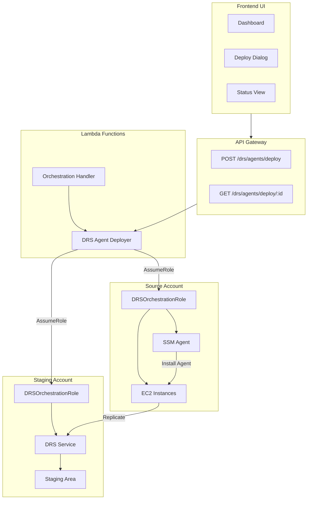
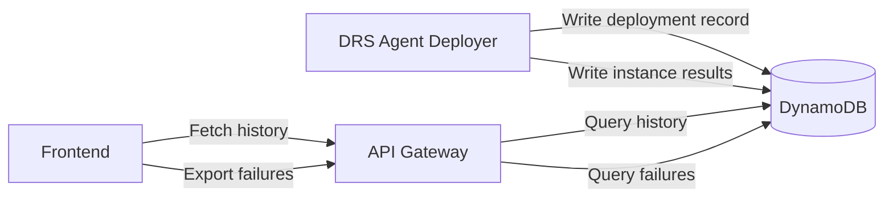
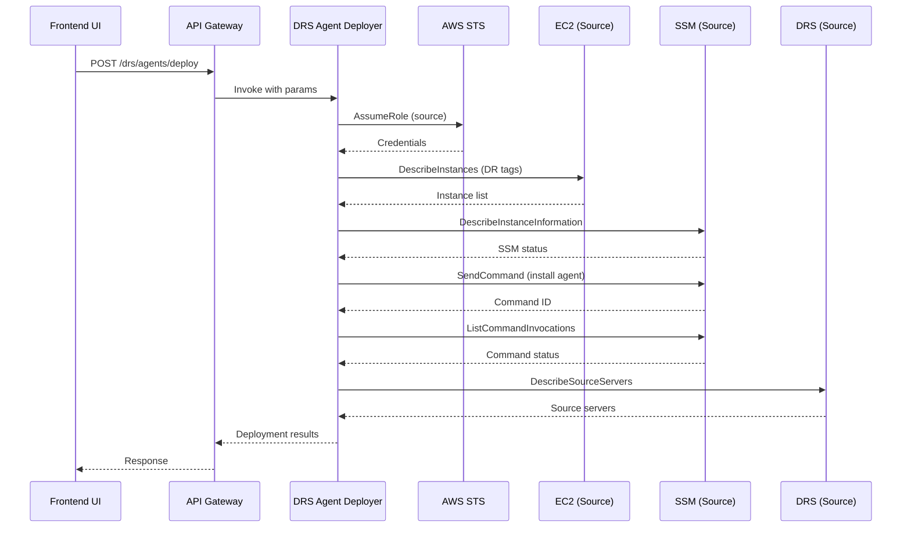
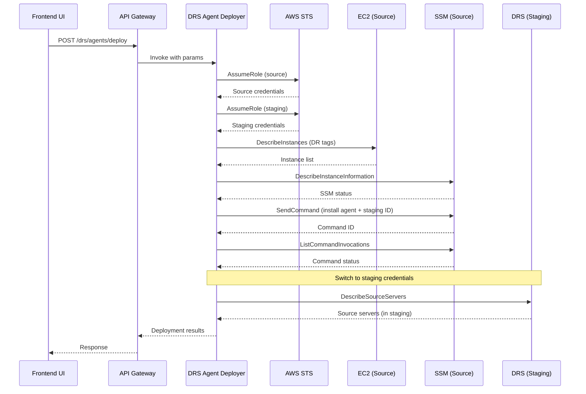
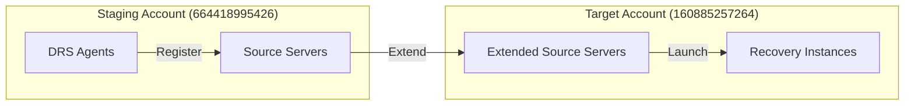
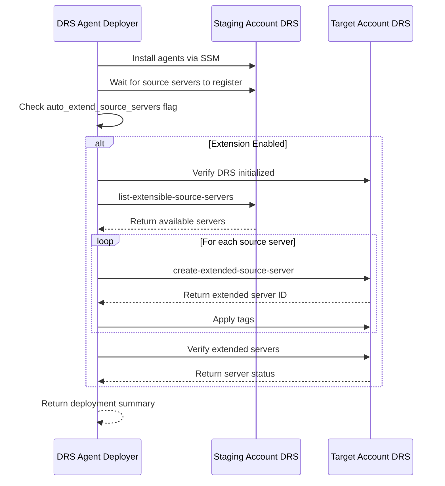

# DRS Agent Deployer - Design

## Architecture Overview

The DRS Agent Deployer is a Lambda-based solution that automates the deployment of AWS Elastic Disaster Recovery agents across multiple AWS accounts. It supports both same-account and cross-account replication patterns through a centralized orchestration approach.

### High-Level Architecture



## Component Design

### 1. Lambda Function (`lambda/drs-agent-deployer/index.py`)

#### Class: `DRSAgentDeployer`

**Purpose**: Handles DRS agent deployment to EC2 instances with cross-account support.

**Attributes**:
- `source_account_id`: Account where agents are installed
- `staging_account_id`: Account where data replicates to
- `source_region`: Region where instances are located
- `target_region`: Region to replicate to
- `source_role_arn`: Role ARN in source account
- `staging_role_arn`: Role ARN in staging account
- `external_id`: External ID for role assumption
- `deployment_pattern`: 'same-account' or 'cross-account'
- `source_credentials`: Credentials for source account
- `staging_credentials`: Credentials for staging account
- `ec2_client`: EC2 client (source account)
- `ssm_client`: SSM client (source account)
- `drs_client`: DRS client (staging account)
- `dynamodb_client`: DynamoDB client (orchestration account)
- `deployment_table`: DynamoDB table name for deployment history

**Methods**:

```python
def __init__(
    source_account_id: str,
    staging_account_id: str,
    source_region: str,
    target_region: str,
    source_role_arn: Optional[str] = None,
    staging_role_arn: Optional[str] = None,
    external_id: Optional[str] = None,
    deployment_pattern: str = 'same-account',
    deployment_table: Optional[str] = None
) -> None
```

```python
def _assume_role(
    role_arn: str,
    session_name: str
) -> Dict[str, str]
```

```python
def _get_client(
    service: str,
    region: str,
    credentials: Optional[Dict[str, str]]
) -> boto3.client
```

```python
def discover_instances() -> List[Dict[str, Any]]
```

```python
def check_ssm_status(
    instance_ids: List[str],
    max_wait: int = 300
) -> Dict[str, str]
```

```python
def deploy_agents(
    wait_for_completion: bool = True,
    timeout_seconds: int = 600
) -> Dict[str, Any]
```

```python
def _wait_for_command(
    command_id: str,
    instance_ids: List[str],
    timeout_seconds: int
) -> Dict[str, Any]
```

```python
def _get_source_servers() -> List[Dict[str, Any]]
```

```python
def _save_deployment_history(
    deployment_id: str,
    result: Dict[str, Any]
) -> None
```

```python
def _extract_failed_instances(
    command_results: Dict[str, Any],
    instances: List[Dict[str, Any]]
) -> List[Dict[str, Any]]
```

#### Function: `lambda_handler`

**Purpose**: Main entry point for Lambda invocations.

**Input Event Structure**:
```json
{
  "source_account_id": "160885257264",
  "staging_account_id": "664418995426",
  "source_region": "us-east-1",
  "target_region": "us-west-2",
  "source_role_arn": "arn:aws:iam::160885257264:role/DRSOrchestrationRole-dev",
  "staging_role_arn": "arn:aws:iam::664418995426:role/DRSOrchestrationRole-dev",
  "external_id": "drs-orchestration-dev-160885257264",
  "wait_for_completion": true,
  "timeout_seconds": 600,
  "tag_filters": {
    "dr:enabled": "true",
    "dr:recovery-strategy": "drs"
  },
  "wave_tag_key": "dr:wave",
  "priority_tag_key": "dr:priority"
}
```

**Output Structure**:
```json
{
  "statusCode": 200,
  "body": {
    "status": "success",
    "source_account_id": "160885257264",
    "staging_account_id": "664418995426",
    "source_region": "us-east-1",
    "target_region": "us-west-2",
    "deployment_pattern": "cross-account",
    "instances_discovered": 6,
    "instances_online": 6,
    "instances_deployed": 6,
    "command_id": "abc123-def456",
    "command_results": {...},
    "source_servers": [...],
    "duration_seconds": 245.3,
    "timestamp": "2026-01-30T10:30:00Z"
  }
}
```

### 2. CloudFormation Integration

#### Lambda Stack (`cfn/lambda-stack.yaml`)

**Resource**: `DRSAgentDeployerFunction`

```yaml
DRSAgentDeployerFunction:
  Type: AWS::Lambda::Function
  Properties:
    FunctionName: !Sub '${ProjectName}-drs-agent-deployer-${Environment}'
    Runtime: python3.12
    Handler: index.lambda_handler
    Role: !Ref OrchestrationRoleArn
    Timeout: 900
    MemorySize: 512
    Environment:
      Variables:
        TARGET_REGION: !Ref TargetRegion
        EXTERNAL_ID: !Ref ExternalId
        SNS_TOPIC_ARN: !Ref NotificationTopicArn
    Code:
      S3Bucket: !Ref DeploymentBucket
      S3Key: !Sub 'lambda/drs-agent-deployer-${Environment}.zip'
```

**Resource**: `DRSAgentDeployerLogGroup`

```yaml
DRSAgentDeployerLogGroup:
  Type: AWS::Logs::LogGroup
  Properties:
    LogGroupName: !Sub '/aws/lambda/${DRSAgentDeployerFunction}'
    RetentionInDays: 30
```

**Outputs**:
```yaml
DRSAgentDeployerFunctionArn:
  Value: !GetAtt DRSAgentDeployerFunction.Arn
  Export:
    Name: !Sub '${ProjectName}-drs-agent-deployer-arn-${Environment}'

DRSAgentDeployerFunctionName:
  Value: !Ref DRSAgentDeployerFunction
  Export:
    Name: !Sub '${ProjectName}-drs-agent-deployer-name-${Environment}'
```

#### Cross-Account Role Stack (`cfn/cross-account-role-stack.yaml`)

**Resource**: `DRSOrchestrationRole`

```yaml
DRSOrchestrationRole:
  Type: AWS::IAM::Role
  Properties:
    RoleName: DRSOrchestrationRole
    AssumeRolePolicyDocument:
      Version: '2012-10-17'
      Statement:
        - Effect: Allow
          Principal:
            AWS: !Sub 'arn:aws:iam::${OrchestrationAccountId}:root'
          Action: sts:AssumeRole
          Condition:
            StringEquals:
              sts:ExternalId: !Ref ExternalId
    Policies:
      - PolicyName: DRSAgentDeployment
        PolicyDocument:
          Version: '2012-10-17'
          Statement:
            - Effect: Allow
              Action:
                - ec2:DescribeInstances
                - ec2:DescribeInstanceStatus
                - ec2:DescribeTags
              Resource: '*'
            - Effect: Allow
              Action:
                - ssm:SendCommand
                - ssm:ListCommandInvocations
                - ssm:GetCommandInvocation
                - ssm:DescribeInstanceInformation
              Resource: '*'
            - Effect: Allow
              Action:
                - drs:DescribeSourceServers
                - drs:DescribeJobs
                - drs:DescribeJobLogItems
              Resource: '*'
```

### 3. API Gateway Integration

#### Resource: `/drs/agents/deploy`

**Method**: POST

**Request Body**:
```json
{
  "source_account_id": "string",
  "staging_account_id": "string",
  "source_region": "string",
  "target_region": "string",
  "source_role_arn": "string",
  "staging_role_arn": "string",
  "wait_for_completion": boolean
}
```

**Integration**: Lambda proxy integration to `DRSAgentDeployerFunction`

**Authorization**: Cognito User Pool

**Response**: 200 OK with deployment results

#### Resource: `/drs/agents/deploy/{deployment_id}`

**Method**: GET

**Path Parameters**: `deployment_id` (command ID)

**Integration**: Query SSM command status

**Response**: 200 OK with command status

#### Resource: `/drs/agents/deployments`

**Method**: GET

**Query Parameters**:
- `account_id` (optional) - Filter by source account
- `start_date` (optional) - ISO 8601 date
- `end_date` (optional) - ISO 8601 date
- `pattern` (optional) - 'same-account' | 'cross-account'
- `status` (optional) - 'success' | 'partial' | 'failed'
- `limit` (optional) - Max results (default: 50)

**Integration**: Lambda function to query DynamoDB

**Authorization**: Cognito User Pool

**Response**: 200 OK with deployment history array

#### Resource: `/drs/agents/failures`

**Method**: GET

**Query Parameters**:
- `account_id` (optional) - Filter by source account
- `start_date` (optional) - ISO 8601 date
- `end_date` (optional) - ISO 8601 date
- `limit` (optional) - Max results (default: 100)

**Integration**: Lambda function to query failed deployments

**Authorization**: Cognito User Pool

**Response**: 200 OK with failed instances array

#### Resource: `/drs/agents/failures/export`

**Method**: GET

**Query Parameters**:
- `format` (required) - 'csv' | 'json'
- `account_id` (optional) - Filter by source account
- `start_date` (optional) - ISO 8601 date
- `end_date` (optional) - ISO 8601 date

**Integration**: Lambda function to generate export file

**Authorization**: Cognito User Pool

**Response**: 200 OK with file download (Content-Type: text/csv or application/json)

### 4. Frontend Integration

#### Component: `DRSAgentDeployDialog.tsx`

**Purpose**: Modal dialog for deploying DRS agents.

**Props**:
```typescript
interface DRSAgentDeployDialogProps {
  visible: boolean;
  onDismiss: () => void;
  onSuccess: (result: DeploymentResult) => void;
}
```

**State**:
```typescript
interface State {
  sourceAccountId: string;
  stagingAccountId: string;
  sourceRegion: string;
  targetRegion: string;
  deploymentPattern: 'same-account' | 'cross-account';
  loading: boolean;
  error: string | null;
}
```

**UI Elements**:
- Account selector (source)
- Account selector (staging, optional)
- Region selectors (source, target)
- Deployment pattern indicator
- Deploy button
- Progress indicator
- Error display

#### Component: `DRSAgentStatus.tsx`

**Purpose**: Display deployment status and results.

**Props**:
```typescript
interface DRSAgentStatusProps {
  deploymentId: string;
  autoRefresh?: boolean;
}
```

**Displays**:
- Deployment pattern
- Accounts involved
- Instances discovered/deployed
- Command execution status
- Source servers registered
- Duration
- Error messages

#### Component: `DRSAgentStatusCard.tsx`

**Purpose**: Dashboard card showing agent deployment status with visual indicators.

**Props**:
```typescript
interface DRSAgentStatusCardProps {
  refreshInterval?: number; // Auto-refresh in seconds
  dateRange?: { start: Date; end: Date };
}
```

**State**:
```typescript
interface State {
  deployments: DeploymentHistory[];
  loading: boolean;
  selectedAccount: string | null;
  filterPattern: 'all' | 'same-account' | 'cross-account';
}

interface DeploymentHistory {
  deployment_id: string;
  timestamp: string;
  source_account_id: string;
  source_account_name: string;
  staging_account_id?: string;
  deployment_pattern: 'same-account' | 'cross-account';
  total_instances: number;
  successful_instances: number;
  failed_instances: number;
  success_rate: number;
  duration_seconds: number;
  status: 'success' | 'partial' | 'failed';
  failed_instance_details?: FailedInstance[];
}

interface FailedInstance {
  instance_id: string;
  instance_name: string;
  error_code: string;
  error_message: string;
  wave?: string;
  priority?: number;
}
```

**UI Elements**:
- **Header**: "DRS Agent Deployments" with refresh button
- **Summary Stats**:
  - Total deployments (last 24h/7d/30d)
  - Overall success rate (percentage with color indicator)
  - Total agents deployed
  - Total failures
- **Visual Status Grid**:
  - Per-account status cards
  - Color-coded: Green (>95%), Yellow (80-95%), Red (<80%)
  - Shows: Account name, success/fail counts, success rate
- **Failed Instances Table**:
  - Expandable section showing failed instances
  - Columns: Account, Instance ID, Instance Name, Wave, Error, Timestamp
  - Click to view full error details
  - Export button (CSV/JSON)
- **Filters**:
  - Date range picker
  - Account selector
  - Deployment pattern filter
  - Status filter (all/success/partial/failed)

#### Component: `DRSAgentFailureReport.tsx`

**Purpose**: Detailed report of failed agent deployments.

**Props**:
```typescript
interface DRSAgentFailureReportProps {
  accountId?: string; // Filter by account
  dateRange: { start: Date; end: Date };
  onExport: (format: 'csv' | 'json') => void;
}
```

**Displays**:
- Failed instances grouped by account
- Error categorization (SSM offline, permission denied, DRS registration failed)
- Remediation suggestions per error type
- Timeline of failures
- Export functionality

#### Service: `api.ts`

**Function**: `deployDRSAgents`

```typescript
export async function deployDRSAgents(
  params: DRSAgentDeploymentParams
): Promise<DRSAgentDeploymentResult> {
  const response = await apiClient.post('/drs/agents/deploy', params);
  return response.data;
}
```

**Function**: `getDRSAgentDeploymentStatus`

```typescript
export async function getDRSAgentDeploymentStatus(
  deploymentId: string
): Promise<DRSAgentDeploymentStatus> {
  const response = await apiClient.get(`/drs/agents/deploy/${deploymentId}`);
  return response.data;
}
```

**Function**: `getDRSAgentDeploymentHistory`

```typescript
export async function getDRSAgentDeploymentHistory(
  filters?: {
    accountId?: string;
    startDate?: string;
    endDate?: string;
    pattern?: 'same-account' | 'cross-account';
    status?: 'success' | 'partial' | 'failed';
  }
): Promise<DeploymentHistory[]> {
  const response = await apiClient.get('/drs/agents/deployments', { params: filters });
  return response.data;
}
```

**Function**: `exportDRSAgentFailures`

```typescript
export async function exportDRSAgentFailures(
  format: 'csv' | 'json',
  filters?: {
    accountId?: string;
    startDate?: string;
    endDate?: string;
  }
): Promise<Blob> {
  const response = await apiClient.get('/drs/agents/failures/export', {
    params: { format, ...filters },
    responseType: 'blob',
  });
  return response.data;
}
```

## Data Flow

### Deployment History Persistence



### DynamoDB Schema

**Table**: `drs-agent-deployments-{environment}`

**Primary Key**:
- `deployment_id` (String, Partition Key) - UUID for each deployment
- `timestamp` (String, Sort Key) - ISO 8601 timestamp

**Attributes**:
```json
{
  "deployment_id": "550e8400-e29b-41d4-a716-446655440000",
  "timestamp": "2026-01-30T10:30:00Z",
  "source_account_id": "160885257264",
  "source_account_name": "Production",
  "staging_account_id": "664418995426",
  "staging_account_name": "DR Staging",
  "source_region": "us-east-1",
  "target_region": "us-west-2",
  "deployment_pattern": "cross-account",
  "total_instances": 10,
  "successful_instances": 8,
  "failed_instances": 2,
  "success_rate": 80.0,
  "duration_seconds": 245.3,
  "status": "partial",
  "command_id": "abc123-def456",
  "failed_instance_details": [
    {
      "instance_id": "i-1234567890abcdef0",
      "instance_name": "web-server-01",
      "wave": "wave-1",
      "priority": 1,
      "error_code": "SSM_AGENT_OFFLINE",
      "error_message": "SSM agent not responding"
    }
  ],
  "ttl": 1738281000
}
```

**Global Secondary Indexes**:

1. **AccountIndex**:
   - Partition Key: `source_account_id`
   - Sort Key: `timestamp`
   - Purpose: Query deployments by account

2. **StatusIndex**:
   - Partition Key: `status`
   - Sort Key: `timestamp`
   - Purpose: Query failed/partial deployments

3. **PatternIndex**:
   - Partition Key: `deployment_pattern`
   - Sort Key: `timestamp`
   - Purpose: Query by deployment pattern

**TTL**: 90 days (configurable)

### Same-Account Deployment Flow



### Cross-Account Deployment Flow



## Error Handling

### Error Categories

1. **Validation Errors** (400)
   - Missing required parameters
   - Invalid account IDs
   - Invalid region names

2. **Authentication Errors** (403)
   - Role assumption failed
   - Invalid external ID
   - Insufficient permissions

3. **Resource Errors** (404)
   - No instances found with DR tags
   - SSM agents not online
   - DRS service not initialized

4. **Execution Errors** (500)
   - SSM command failed
   - Agent installation failed
   - DRS registration failed

### Error Response Structure

```json
{
  "statusCode": 400,
  "body": {
    "status": "error",
    "message": "source_account_id is required",
    "error_code": "MISSING_PARAMETER",
    "details": {
      "parameter": "source_account_id"
    }
  }
}
```

## Security Design

### Authentication & Authorization

1. **API Gateway**: Cognito User Pool authentication
2. **Lambda Execution**: Uses `UnifiedOrchestrationRole`
3. **Cross-Account**: STS AssumeRole with external ID
4. **Least Privilege**: Minimal permissions per role

### Data Protection

1. **In Transit**: TLS 1.2+ for all API calls
2. **At Rest**: DRS staging area uses encrypted EBS
3. **Credentials**: Never logged or stored
4. **External ID**: Required for all role assumptions

### Audit & Compliance

1. **CloudTrail**: All API calls logged
2. **CloudWatch Logs**: Detailed execution logs
3. **Role Assumption**: Tracked in CloudTrail
4. **Deployment History**: Stored in DynamoDB (future)

## Performance Considerations

### Optimization Strategies

1. **Parallel Operations**: Discover instances in parallel
2. **Batch Processing**: SSM commands sent in batches
3. **Async Invocation**: Support async Lambda invocation
4. **Caching**: Cache role credentials for session duration
5. **Pagination**: Handle large instance lists efficiently

### Resource Limits

| Resource | Limit | Mitigation |
|----------|-------|------------|
| Lambda Timeout | 15 minutes | Use async invocation for large deployments |
| SSM Command Targets | 50 instances | Batch deployments |
| STS Session Duration | 1 hour | Refresh credentials if needed |
| DRS Source Servers | 1000 per account | Deploy in waves |

## Testing Strategy

### Unit Tests

- `test_assume_role()` - Role assumption logic
- `test_discover_instances()` - Instance discovery
- `test_check_ssm_status()` - SSM status checking
- `test_deployment_pattern_detection()` - Pattern detection

### Integration Tests

- `test_same_account_deployment()` - End-to-end same-account
- `test_cross_account_deployment()` - End-to-end cross-account
- `test_multi_account_deployment()` - Multiple accounts
- `test_error_handling()` - Error scenarios

### Manual Testing

- Deploy to dev account
- Deploy cross-account (dev → staging)
- Verify DRS source servers
- Test UI integration
- Test API endpoints

## Deployment Strategy

### Phase 1: Lambda Function (Complete)
- ✅ Lambda function implemented
- ✅ Test events created
- ✅ Documentation written

### Phase 2: CloudFormation Integration (Pending)
- Add to `cfn/lambda-stack.yaml`
- Update master stack parameters
- Deploy to dev environment
- Verify function works

### Phase 3: API Gateway Integration (Pending)
- Add `/drs/agents/deploy` endpoint
- Add `/drs/agents/deploy/{id}` endpoint
- Configure authentication
- Test API endpoints

### Phase 4: Frontend Integration (Pending)
- Create `DRSAgentDeployDialog` component
- Create `DRSAgentStatus` component
- Add to Protection Groups page
- Add to Dashboard
- Test UI workflows

### Phase 5: Production Rollout (Pending)
- Deploy to test environment
- Perform DR drill
- Deploy to production
- Monitor and optimize

## Monitoring & Observability

### CloudWatch Metrics

- `DeploymentSuccess` - Successful deployments
- `DeploymentFailure` - Failed deployments
- `DeploymentDuration` - Time to complete
- `InstancesDeployed` - Total instances deployed
- `AgentRegistrationRate` - Agents registered / installed

### CloudWatch Alarms

- Deployment failure rate > 5%
- Average deployment duration > 10 minutes
- Agent registration rate < 95%
- Lambda errors > 10 per hour

### CloudWatch Logs Insights Queries

```sql
-- Deployment success rate
fields @timestamp, status
| filter @message like /Deployment results/
| stats count() by status

-- Average deployment duration
fields @timestamp, duration_seconds
| filter @message like /duration_seconds/
| stats avg(duration_seconds) as avg_duration

-- Failed deployments
fields @timestamp, @message
| filter status = "error"
| sort @timestamp desc
```

## Future Enhancements

### Phase 2 Features
- Deployment history tracking (DynamoDB)
- Scheduled deployments (EventBridge)
- Agent health monitoring
- Automated DR testing

### Phase 3 Features
- Agent updates/upgrades
- Custom replication configuration
- Cost optimization recommendations
- Multi-region orchestration

## Related Documentation

See `reference/` directory for:
- API specifications
- CloudFormation templates
- Frontend component specs
- Testing procedures


## Extended Source Server Configuration

### Overview

The extended source server feature enables automatic extension of source servers from staging accounts to the target account, allowing capacity scaling beyond the 300 source server per-account limit.

### Architecture Pattern



### Component Design

#### Method: `_extend_source_servers`

**Purpose**: Automatically extend source servers to target account after agent installation.

**Signature**:
```python
def _extend_source_servers(
    self,
    source_servers: List[Dict[str, Any]],
    target_account_id: str,
    deployment_id: str
) -> Dict[str, Any]:
    """
    Extend source servers to target account.
    
    Args:
        source_servers: List of source server details from staging account
        target_account_id: Target account ID to extend servers to
        deployment_id: Unique deployment identifier for tagging
        
    Returns:
        Dict containing:
            - extended_count: Number of successfully extended servers
            - failed_count: Number of failed extensions
            - already_extended_count: Number of servers already extended
            - details: List of extension results per server
            
    Raises:
        ClientError: If target account access fails
    """
```

**Implementation Logic**:
1. Verify target account configuration
2. Get list of extensible source servers from staging account
3. For each source server:
   - Check if already extended (skip if yes)
   - Call `create-extended-source-server` API
   - Apply tags: Name, ExtendedFrom, DeploymentID
   - Handle errors with retry logic
4. Verify extension in target account
5. Return extension summary

**Error Handling**:
- `ConflictException`: Server already extended (skip, log info)
- `AccessDeniedException`: Missing permissions (fail with clear message)
- `ResourceNotFoundException`: Target account DRS not initialized
- `ThrottlingException`: Retry with exponential backoff
- Network errors: Retry up to 3 times

#### Method: `_verify_target_account_access`

**Purpose**: Verify target account has necessary permissions and DRS initialized.

**Signature**:
```python
def _verify_target_account_access(
    self,
    target_account_id: str
) -> bool:
    """
    Verify target account is ready for extended source servers.
    
    Args:
        target_account_id: Target account ID
        
    Returns:
        True if target account is ready, False otherwise
        
    Checks:
        - DRS service initialized in target region
        - Service-linked role exists
        - Cross-account trust configured
    """
```

#### Method: `_get_extensible_source_servers`

**Purpose**: Get list of source servers available for extension.

**Signature**:
```python
def _get_extensible_source_servers(
    self,
    staging_account_id: str
) -> List[Dict[str, Any]]:
    """
    Get list of extensible source servers from staging account.
    
    Args:
        staging_account_id: Staging account ID
        
    Returns:
        List of source server details:
            - arn: Source server ARN
            - hostname: Server hostname
            - tags: Server tags
    """
```

### Configuration Schema

#### Deployment Configuration

```json
{
  "source_account_id": "664418995426",
  "staging_account_id": "664418995426",
  "target_account_id": "160885257264",
  "auto_extend_source_servers": true,
  "extension_config": {
    "enabled": true,
    "target_region": "us-west-2",
    "retry_attempts": 3,
    "retry_delay_seconds": 5,
    "tags": {
      "ExtendedFrom": "staging",
      "ManagedBy": "drs-orchestration"
    }
  }
}
```

### Data Flow



### IAM Permissions

#### Target Account Role

The target account role needs these additional permissions:

```json
{
  "Version": "2012-10-17",
  "Statement": [
    {
      "Effect": "Allow",
      "Action": [
        "drs:CreateExtendedSourceServer",
        "drs:ListExtensibleSourceServers",
        "drs:DescribeSourceServers",
        "drs:TagResource"
      ],
      "Resource": "*"
    }
  ]
}
```

#### Staging Account Role

No additional permissions needed - uses existing DRS permissions.

### Error Scenarios

| Error | Cause | Handling |
|-------|-------|----------|
| `ConflictException` | Server already extended | Skip, log info, continue |
| `AccessDeniedException` | Missing permissions | Fail with clear message |
| `ResourceNotFoundException` | DRS not initialized | Fail with setup instructions |
| `ThrottlingException` | API rate limit | Retry with backoff |
| `ValidationException` | Invalid server ARN | Log error, skip server |
| Network timeout | Connectivity issue | Retry up to 3 times |

### Monitoring & Logging

#### CloudWatch Metrics

- `ExtendedSourceServers` - Count of successfully extended servers
- `ExtensionFailures` - Count of failed extensions
- `ExtensionDuration` - Time to extend all servers
- `AlreadyExtendedCount` - Count of servers already extended

#### Log Events

```json
{
  "event": "extension_started",
  "deployment_id": "deploy-123",
  "staging_account": "664418995426",
  "target_account": "160885257264",
  "server_count": 6
}
```

```json
{
  "event": "server_extended",
  "source_server_id": "s-500fd51b10efec8be",
  "hostname": "EC2AMAZ-GRCHRS5",
  "target_server_id": "s-554d5e5c0fc062655",
  "duration_ms": 1250
}
```

```json
{
  "event": "extension_complete",
  "deployment_id": "deploy-123",
  "extended_count": 6,
  "failed_count": 0,
  "already_extended_count": 0,
  "total_duration_ms": 8500
}
```

### Capacity Management

#### Limits Tracking

```python
def _check_capacity_limits(
    self,
    target_account_id: str,
    new_server_count: int
) -> Dict[str, Any]:
    """
    Check if adding new servers exceeds capacity limits.
    
    Returns:
        {
            "within_limits": bool,
            "current_count": int,
            "new_count": int,
            "limit": int,
            "utilization_percent": float
        }
    """
```

#### Alerts

- Warning at 80% capacity (240/300 servers)
- Critical at 90% capacity (270/300 servers)
- Block at 100% capacity (300/300 servers)

