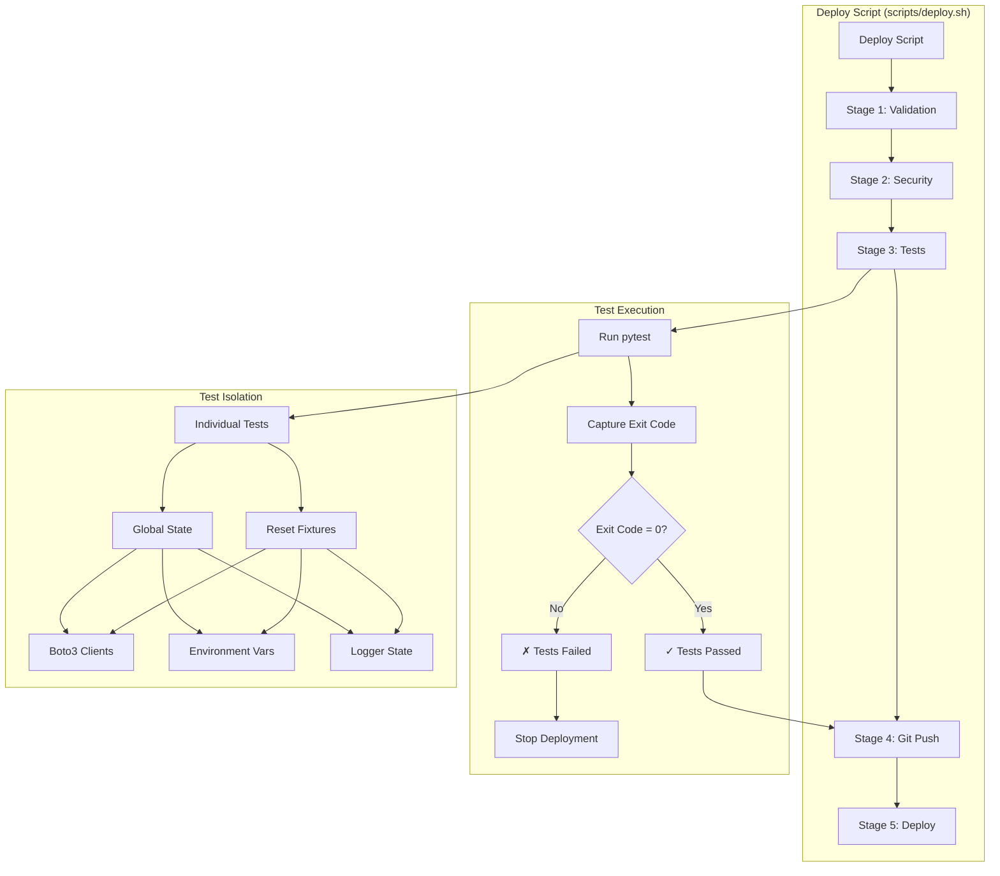

# Deploy Script Test Detection Fix - Design

## Overview

This design addresses two critical issues:
1. Deploy script incorrectly handling test failures (allowing broken code to deploy)
2. Five tests failing in batch mode due to test isolation issues

The solution involves fixing the deploy script's test detection logic and resolving global state leakage between tests.

## Architecture

### Component Diagram



## Design Decisions

### 1. Deploy Script Test Detection

**Decision:** Use pytest exit code instead of parsing output strings

**Rationale:**
- Exit codes are the standard way to detect command success/failure
- Parsing output strings is fragile and error-prone
- Current approach creates false positives (ignoring real failures)
- Exit code 0 = success, non-zero = failure (universal convention)

**Alternatives Considered:**
1. ❌ Keep current string parsing approach
   - Too fragile, already causing issues
   - Assumes all failures are "test isolation issues"
   
2. ❌ Parse pytest JSON output
   - More complex than needed
   - Requires additional pytest flags
   - Exit code is simpler and more reliable

3. ✅ Use exit code (SELECTED)
   - Standard Unix convention
   - Simple and reliable
   - Works with all pytest configurations

### 2. Test Isolation Strategy

**Decision:** Add autouse fixtures to reset global state before each test

**Rationale:**
- Tests should be independent and not affect each other
- Global state leakage is the root cause of batch failures
- Fixtures with `autouse=True` run automatically for all tests
- Centralized in conftest.py for consistency

**Alternatives Considered:**
1. ❌ Manually reset state in each test
   - Error-prone (easy to forget)
   - Duplicated code across tests
   - Hard to maintain
   
2. ❌ Refactor code to eliminate global state
   - Too large a change for this fix
   - Would require Lambda handler refactoring
   - Out of scope for this spec

3. ✅ Autouse fixtures (SELECTED)
   - Automatic and consistent
   - Centralized in conftest.py
   - Easy to maintain and extend

## Implementation Design

### Part 1: Deploy Script Fix

**File:** `scripts/deploy.sh`

**CRITICAL: Two locations need fixing - both full test mode and fast test mode have the same bug**

**Location 1: Full Test Mode (lines 643-649)**

**Current Code:**
```bash
if ! $PYTEST_CMD tests/unit/ -q --tb=no 2>&1 | tee /tmp/pytest_output.txt; then
    # Check if failures are only test isolation issues
    if grep -q "passed" /tmp/pytest_output.txt && grep -q "failed" /tmp/pytest_output.txt; then
        echo -e "${YELLOW}  ⚠ Some tests failed (may be test isolation issues)${NC}"
        echo -e "${YELLOW}  Continuing deployment (tests pass individually)${NC}"
    else
        TEST_FAILED=true
    fi
fi
```

**Location 2: Fast Test Mode (lines 655-662)**

**Current Code:**
```bash
if ! $PYTEST_CMD tests/unit/ -m "not property" -q --tb=no 2>&1 | tee /tmp/pytest_output.txt; then
    # Check if failures are only test isolation issues
    if grep -q "passed" /tmp/pytest_output.txt && grep -q "failed" /tmp/pytest_output.txt; then
        echo -e "${YELLOW}  ⚠ Some tests failed (may be test isolation issues)${NC}"
        echo -e "${YELLOW}  Continuing deployment (tests pass individually)${NC}"
    else
        TEST_FAILED=true
    fi
fi
```

**New Code (for Location 1 - Full Test Mode):**
```bash
# Run unit tests and capture exit code
set +e
$PYTEST_CMD tests/unit/ -v --tb=short 2>&1 | tee /tmp/pytest_output.txt
PYTEST_EXIT_CODE=$?
set -e

if [ $PYTEST_EXIT_CODE -ne 0 ]; then
    echo -e "${RED}  ✗ Unit tests failed (exit code: $PYTEST_EXIT_CODE)${NC}"
    
    # Count failures
    FAILED_COUNT=$(grep -c "FAILED" /tmp/pytest_output.txt || echo "0")
    PASSED_COUNT=$(grep -c "PASSED" /tmp/pytest_output.txt || echo "0")
    echo -e "${RED}  Failed: $FAILED_COUNT tests${NC}"
    echo -e "${GREEN}  Passed: $PASSED_COUNT tests${NC}"
    
    # Show which tests failed
    echo -e "${YELLOW}  Failed test details:${NC}"
    grep "FAILED" /tmp/pytest_output.txt | head -20 || true
    
    echo ""
    echo -e "${YELLOW}  To debug:${NC}"
    echo -e "${YELLOW}    1. Run full suite: source .venv/bin/activate && pytest tests/unit/ -v${NC}"
    echo -e "${YELLOW}    2. Run specific test: pytest tests/unit/test_file.py::test_name -v${NC}"
    echo -e "${YELLOW}    3. Check test output: cat /tmp/pytest_output.txt${NC}"
    
    TEST_FAILED=true
else
    PASSED_COUNT=$(grep -c "PASSED" /tmp/pytest_output.txt || echo "0")
    echo -e "${GREEN}  ✓ Unit tests passed ($PASSED_COUNT tests)${NC}"
fi
```

**Key Changes (Applied to BOTH Locations):**
1. Explicitly capture pytest exit code with `$?` using `set +e` / `set -e` wrapper
2. Check exit code instead of parsing output strings
3. Show clear failure summary with counts
4. List failed tests (up to 20 for readability)
5. Provide debugging guidance specific to each test mode
6. Remove the "test isolation issues" workaround completely

**Why Both Locations Need Fixing:**
The deploy script has two test execution paths:
- Full test mode: Runs all tests including property-based tests
- Fast test mode: Skips property-based tests with `-m "not property"`

Both paths have the identical flawed logic that checks for "passed" AND "failed" strings instead of using the exit code. Both must be fixed with the same pattern to ensure test failures are properly detected regardless of which test mode is used.

**New Code (for Location 2 - Fast Test Mode):**
```bash
# Run fast unit tests (skip property-based tests) and capture exit code
set +e
$PYTEST_CMD tests/unit/ -m "not property" -v --tb=short 2>&1 | tee /tmp/pytest_output.txt
PYTEST_EXIT_CODE=$?
set -e

if [ $PYTEST_EXIT_CODE -ne 0 ]; then
    echo -e "${RED}  ✗ Unit tests failed (exit code: $PYTEST_EXIT_CODE)${NC}"
    
    # Count failures
    FAILED_COUNT=$(grep -c "FAILED" /tmp/pytest_output.txt || echo "0")
    PASSED_COUNT=$(grep -c "PASSED" /tmp/pytest_output.txt || echo "0")
    echo -e "${RED}  Failed: $FAILED_COUNT tests${NC}"
    echo -e "${GREEN}  Passed: $PASSED_COUNT tests${NC}"
    
    # Show which tests failed
    echo -e "${YELLOW}  Failed test details:${NC}"
    grep "FAILED" /tmp/pytest_output.txt | head -20 || true
    
    echo ""
    echo -e "${YELLOW}  To debug:${NC}"
    echo -e "${YELLOW}    1. Run fast suite: source .venv/bin/activate && pytest tests/unit/ -m 'not property' -v${NC}"
    echo -e "${YELLOW}    2. Run specific test: pytest tests/unit/test_file.py::test_name -v${NC}"
    echo -e "${YELLOW}    3. Check test output: cat /tmp/pytest_output.txt${NC}"
    
    TEST_FAILED=true
else
    PASSED_COUNT=$(grep -c "PASSED" /tmp/pytest_output.txt || echo "0")
    echo -e "${GREEN}  ✓ Unit tests passed ($PASSED_COUNT tests)${NC}"
fi
```

### Part 2: Test Isolation Fixes

#### Investigation Process

**Step 1: Identify the failing tests**
```bash
# Run individually (should pass)
pytest tests/unit/test_data_management_response_format.py::TestDirectInvocationResponseFormat::test_create_protection_group_direct_format -v

# Run in batch (currently fails)
pytest tests/unit/ -v
```

**Step 2: Identify global state**

Check these Lambda handler modules for global variables:
- `lambda/data-management-handler/index.py`
- `lambda/query-handler/index.py`
- `lambda/shared/conflict_detection.py`

Common patterns:
```python
# Global variables with lazy initialization
_dynamodb_table = None
_drs_client = None
_logger = None

def get_table():
    global _dynamodb_table
    if _dynamodb_table is None:
        _dynamodb_table = boto3.resource('dynamodb').Table('name')
    return _dynamodb_table
```

**Step 3: Add reset fixtures**

#### Fixture Design

**File:** `tests/unit/conftest.py`

**Add these fixtures:**

```python
import os
import logging
import pytest
from unittest.mock import MagicMock


@pytest.fixture(autouse=True)
def reset_environment_variables():
    """
    Reset environment variables before and after each test.
    
    This prevents environment variable leakage between tests.
    """
    original_env = os.environ.copy()
    yield
    os.environ.clear()
    os.environ.update(original_env)


@pytest.fixture(autouse=True)
def reset_logger_state():
    """
    Reset logger state before each test.
    
    This prevents logger configuration and handlers from leaking between tests.
    """
    # Get root logger
    root_logger = logging.getLogger()
    
    # Store original state
    original_level = root_logger.level
    original_handlers = root_logger.handlers.copy()
    
    yield
    
    # Reset to original state
    root_logger.setLevel(original_level)
    root_logger.handlers = original_handlers


@pytest.fixture(autouse=True)
def reset_module_caches():
    """
    Reset module-level caches before each test.
    
    This prevents cached boto3 clients and DynamoDB tables from leaking between tests.
    """
    # Import modules that have global state
    try:
        from lambda.shared import conflict_detection
        # Reset conflict_detection global tables
        conflict_detection._protection_groups_table = None
        conflict_detection._recovery_plans_table = None
        conflict_detection._execution_history_table = None
    except ImportError:
        pass
    
    try:
        import sys
        # Reset data-management-handler if loaded
        if 'data-management-handler.index' in sys.modules:
            handler = sys.modules['data-management-handler.index']
            if hasattr(handler, '_target_accounts_table'):
                handler._target_accounts_table = None
            if hasattr(handler, '_tag_sync_config_table'):
                handler._tag_sync_config_table = None
    except (ImportError, AttributeError):
        pass
    
    yield


@pytest.fixture(autouse=True)
def reset_mock_state():
    """
    Reset mock call history before each test.
    
    This prevents mock call history from leaking between tests.
    """
    yield
    # Cleanup happens automatically with pytest's mock cleanup


@pytest.fixture(autouse=True)
def isolate_test_execution(monkeypatch):
    """
    Ensure complete test isolation by resetting all global state.
    
    This is a catch-all fixture that runs before every test to ensure
    no state leaks from previous tests.
    """
    # Set consistent test environment
    monkeypatch.setenv('AWS_DEFAULT_REGION', 'us-east-1')
    monkeypatch.setenv('AWS_REGION', 'us-east-1')
    
    # Ensure we're not using real AWS credentials
    monkeypatch.delenv('AWS_ACCESS_KEY_ID', raising=False)
    monkeypatch.delenv('AWS_SECRET_ACCESS_KEY', raising=False)
    monkeypatch.delenv('AWS_SESSION_TOKEN', raising=False)
    
    yield
```

#### Specific Test Fixes

**Test 1: test_data_management_response_format.py**

**Issue:** Direct invocation response format test fails in batch mode

**Root Cause Analysis:**
- Test expects specific response format for direct invocation
- Previous tests may have set environment variables or mocked functions
- Response format depends on invocation context

**Fix:**
```python
# In test_data_management_response_format.py

def test_create_protection_group_direct_format(reset_environment_variables):
    """Test direct invocation returns correct format."""
    # Explicitly set direct invocation mode
    os.environ['DIRECT_INVOCATION'] = 'true'
    
    # Create mock table
    mock_table = MagicMock()
    mock_table.put_item.return_value = {}
    mock_table.scan.return_value = {'Items': []}
    
    # Patch getter function
    with patch("data-management-handler.index.get_protection_groups_table", return_value=mock_table):
        # Test logic
        result = handler(event, context)
        
        # Verify direct invocation format
        assert 'statusCode' not in result  # Direct invocation doesn't wrap in API Gateway format
        assert 'GroupId' in result
```

**Test 2 & 3: test_error_handling_query_handler.py**

**Issue:** DynamoDB error handling tests fail in batch mode

**Root Cause Analysis:**
- Tests mock DynamoDB exceptions
- Previous tests may have cached boto3 clients
- Mock configurations may be leaking

**Fix:**
```python
# In test_error_handling_query_handler.py

def test_dynamodb_throttling_error(reset_module_caches):
    """Test DynamoDB throttling error handling."""
    from botocore.exceptions import ClientError
    
    # Create mock table that raises throttling error
    mock_table = MagicMock()
    mock_table.query.side_effect = ClientError(
        {'Error': {'Code': 'ProvisionedThroughputExceededException', 'Message': 'Rate exceeded'}},
        'Query'
    )
    
    # Patch getter function
    with patch("query-handler.index.get_protection_groups_table", return_value=mock_table):
        event = {
            'httpMethod': 'GET',
            'path': '/protection-groups',
            'queryStringParameters': {'status': 'ACTIVE'}
        }
        
        result = handler(event, {})
        
        # Verify error response
        assert result['statusCode'] == 429
        body = json.loads(result['body'])
        assert 'retryAfter' in body
        assert body['error']['code'] == 'ThrottlingException'


def test_dynamodb_resource_not_found(reset_module_caches):
    """Test DynamoDB resource not found error handling."""
    from botocore.exceptions import ClientError
    
    # Create mock table that raises resource not found error
    mock_table = MagicMock()
    mock_table.get_item.side_effect = ClientError(
        {'Error': {'Code': 'ResourceNotFoundException', 'Message': 'Table not found'}},
        'GetItem'
    )
    
    # Patch getter function
    with patch("query-handler.index.get_protection_groups_table", return_value=mock_table):
        event = {
            'httpMethod': 'GET',
            'path': '/protection-groups/pg-123',
            'pathParameters': {'id': 'pg-123'}
        }
        
        result = handler(event, {})
        
        # Verify error response
        assert result['statusCode'] == 404
        body = json.loads(result['body'])
        assert body['error']['code'] == 'ResourceNotFound'
```

**Test 4: test_error_handling_query_handler.py**

**Issue:** Retryable errors test fails in batch mode

**Root Cause Analysis:**
- Test checks for retry guidance in error responses
- Previous tests may have modified error handler configuration
- Logger state may be affecting error formatting

**Fix:**
```python
def test_retryable_errors_include_retry_guidance(reset_logger_state, reset_module_caches):
    """Test that retryable errors include retry guidance."""
    from botocore.exceptions import ClientError
    
    # Create mock table that raises retryable error
    mock_table = MagicMock()
    mock_table.query.side_effect = ClientError(
        {'Error': {'Code': 'ServiceUnavailable', 'Message': 'Service temporarily unavailable'}},
        'Query'
    )
    
    # Patch getter function
    with patch("query-handler.index.get_protection_groups_table", return_value=mock_table):
        event = {
            'httpMethod': 'GET',
            'path': '/protection-groups',
            'queryStringParameters': {}
        }
        
        result = handler(event, {})
        
        # Verify error response includes retry guidance
        assert result['statusCode'] == 503
        body = json.loads(result['body'])
        assert 'retryable' in body
        assert body['retryable'] is True
        assert 'retryAfter' in body
        assert body['retryAfter'] > 0
```

**Test 5: test_iam_audit_logging_property.py**

**Issue:** Property-based test for IAM audit logging fails in batch mode

**Root Cause Analysis:**
- Property-based tests generate many test cases
- Logger state accumulates across test cases
- Previous tests may have configured logger differently

**Fix:**
```python
# In test_iam_audit_logging_property.py

from hypothesis import given, strategies as st, settings

@given(
    action=st.sampled_from(['CREATE', 'UPDATE', 'DELETE', 'READ']),
    resource_type=st.sampled_from(['ProtectionGroup', 'RecoveryPlan', 'Execution']),
    resource_id=st.text(min_size=1, max_size=50),
    user_id=st.text(min_size=1, max_size=100)
)
@settings(max_examples=50, deadline=None)
def test_audit_log_always_contains_required_fields(
    action, resource_type, resource_id, user_id,
    reset_logger_state, reset_environment_variables
):
    """
    Property: All audit log entries must contain required fields.
    
    This test verifies that regardless of the action, resource type, or user,
    the audit log always contains the required fields for compliance.
    """
    # Setup logger to capture audit logs
    import logging
    from io import StringIO
    
    log_capture = StringIO()
    handler = logging.StreamHandler(log_capture)
    handler.setLevel(logging.INFO)
    
    audit_logger = logging.getLogger('audit')
    audit_logger.setLevel(logging.INFO)
    audit_logger.handlers = [handler]
    
    # Trigger audit log
    from lambda.shared.audit import log_audit_event
    
    log_audit_event(
        action=action,
        resource_type=resource_type,
        resource_id=resource_id,
        user_id=user_id
    )
    
    # Get log output
    log_output = log_capture.getvalue()
    
    # Parse log as JSON
    import json
    log_entry = json.loads(log_output)
    
    # Verify required fields are present
    required_fields = ['timestamp', 'action', 'resourceType', 'resourceId', 'userId', 'requestId']
    for field in required_fields:
        assert field in log_entry, f"Required field '{field}' missing from audit log"
    
    # Verify field values are not empty
    assert log_entry['action'] == action
    assert log_entry['resourceType'] == resource_type
    assert log_entry['resourceId'] == resource_id
    assert log_entry['userId'] == user_id
    assert len(log_entry['timestamp']) > 0
    assert len(log_entry['requestId']) > 0
```

## Testing Strategy

### Deploy Script Testing

**Test 1: Verify failure detection**
```bash
# Create a test that intentionally fails
cat > tests/unit/test_intentional_failure.py << 'EOF'
def test_this_should_fail():
    assert False, "Intentional failure for testing"
EOF

# Run deploy script
./scripts/deploy.sh test --validate-only

# Expected: Deploy script should stop at Stage 3 with clear error message
# Expected output:
#   ✗ Unit tests failed (exit code: 1)
#   Failed: 1 tests
#   Failed test details:
#   FAILED tests/unit/test_intentional_failure.py::test_this_should_fail

# Cleanup
rm tests/unit/test_intentional_failure.py
```

**Test 2: Verify success detection**
```bash
# Run deploy script with all tests passing
./scripts/deploy.sh test --validate-only

# Expected: Deploy script should complete Stage 3 successfully
# Expected output:
#   ✓ Unit tests passed (XXX tests)
```

### Test Isolation Testing

**Test 1: Individual execution**
```bash
# Activate virtual environment
source .venv/bin/activate

# Run each failing test individually
pytest tests/unit/test_data_management_response_format.py::TestDirectInvocationResponseFormat::test_create_protection_group_direct_format -v
pytest tests/unit/test_error_handling_query_handler.py::TestDynamoDBErrors::test_dynamodb_throttling_error -v
pytest tests/unit/test_error_handling_query_handler.py::TestDynamoDBErrors::test_dynamodb_resource_not_found -v
pytest tests/unit/test_error_handling_query_handler.py::TestErrorResponseStructure::test_retryable_errors_include_retry_guidance -v
pytest tests/unit/test_iam_audit_logging_property.py::test_audit_log_always_contains_required_fields -v

# Expected: All tests should pass
```

**Test 2: Batch execution**
```bash
# Run full test suite
pytest tests/unit/ -v

# Expected: All tests should pass (including the 5 previously failing tests)
```

**Test 3: Verify no regression**
```bash
# Run full test suite multiple times to ensure consistency
for i in {1..3}; do
    echo "Run $i:"
    pytest tests/unit/ -v --tb=short
    echo "---"
done

# Expected: All runs should pass with same results
```

## Correctness Properties

### Property 1: Deploy Script Exit Code Detection
**Property:** Deploy script must fail when pytest returns non-zero exit code

**Test:**
```bash
# Given: A test that fails
# When: Deploy script runs
# Then: Deploy script exits with error before deployment stage
```

**Validation:**
```python
def test_deploy_script_detects_test_failures():
    """Property: Deploy script must detect and fail on test failures."""
    # Create failing test
    with open('tests/unit/test_temp_failure.py', 'w') as f:
        f.write('def test_fail(): assert False\n')
    
    # Run deploy script
    result = subprocess.run(
        ['./scripts/deploy.sh', 'test', '--validate-only'],
        capture_output=True,
        text=True
    )
    
    # Verify deploy script failed
    assert result.returncode != 0
    assert 'Unit tests failed' in result.stdout
    
    # Cleanup
    os.remove('tests/unit/test_temp_failure.py')
```

### Property 2: Test Isolation
**Property:** Tests must pass in both individual and batch execution modes

**Test:**
```python
@pytest.mark.parametrize('test_path', [
    'tests/unit/test_data_management_response_format.py::TestDirectInvocationResponseFormat::test_create_protection_group_direct_format',
    'tests/unit/test_error_handling_query_handler.py::TestDynamoDBErrors::test_dynamodb_throttling_error',
    'tests/unit/test_error_handling_query_handler.py::TestDynamoDBErrors::test_dynamodb_resource_not_found',
    'tests/unit/test_error_handling_query_handler.py::TestErrorResponseStructure::test_retryable_errors_include_retry_guidance',
    'tests/unit/test_iam_audit_logging_property.py::test_audit_log_always_contains_required_fields',
])
def test_isolation_property(test_path):
    """
    Property: Test results must be consistent regardless of execution mode.
    
    A test that passes individually must also pass when run as part of the full suite.
    """
    # Run test individually
    individual_result = subprocess.run(
        ['pytest', test_path, '-v'],
        capture_output=True
    )
    
    # Run test in batch
    batch_result = subprocess.run(
        ['pytest', 'tests/unit/', '-v'],
        capture_output=True
    )
    
    # Both should pass
    assert individual_result.returncode == 0, f"Individual run failed: {test_path}"
    assert batch_result.returncode == 0, f"Batch run failed"
```

### Property 3: Global State Reset
**Property:** Global state must be reset before each test

**Test:**
```python
def test_global_state_reset_property():
    """
    Property: Global state must not leak between tests.
    
    After each test, all global variables should be reset to their initial state.
    """
    # Import module with global state
    from lambda.shared import conflict_detection
    
    # Set global state
    conflict_detection._protection_groups_table = "test_value"
    
    # Run a test (fixture should reset state)
    pytest.main(['-v', 'tests/unit/test_conflict_detection_comprehensive.py::test_no_conflicts'])
    
    # Verify state was reset
    assert conflict_detection._protection_groups_table is None
```

## Deployment Plan

### Phase 1: Deploy Script Fix (Low Risk)
1. Update `scripts/deploy.sh` with new test detection logic
2. Test with intentional failure
3. Test with all tests passing
4. Commit changes

### Phase 2: Fixture Enhancement (Medium Risk)
1. Add new fixtures to `tests/unit/conftest.py`
2. Run full test suite to verify no regressions
3. Commit changes

### Phase 3: Individual Test Fixes (Low Risk)
1. Fix test_data_management_response_format.py
2. Run test individually and in batch
3. Fix test_error_handling_query_handler.py (3 tests)
4. Run tests individually and in batch
5. Fix test_iam_audit_logging_property.py
6. Run test individually and in batch
7. Commit changes

### Phase 4: Verification (Critical)
1. Run full test suite 3 times to ensure consistency
2. Run deploy script with --validate-only
3. Verify all tests pass
4. Commit final changes

### Phase 5: Deployment
1. Run full deployment: `./scripts/deploy.sh test`
2. Verify deployment succeeds
3. Verify all AWS resources updated correctly

## Rollback Plan

If issues occur:

1. **Deploy script issues:**
   ```bash
   git revert <commit-hash>
   ./scripts/deploy.sh test
   ```

2. **Test failures:**
   ```bash
   # Revert test changes
   git revert <commit-hash>
   
   # Run tests to verify
   pytest tests/unit/ -v
   ```

3. **Deployment failures:**
   ```bash
   # CloudFormation will automatically rollback
   # Monitor in AWS Console
   aws cloudformation describe-stack-events --stack-name hrp-drs-tech-adapter-dev
   ```

## Success Metrics

1. ✅ Deploy script properly detects test failures (exit code check)
2. ✅ Deploy script shows clear error messages with test names
3. ✅ All 5 affected tests pass individually
4. ✅ All 5 affected tests pass in batch mode
5. ✅ Full test suite passes consistently (3+ runs)
6. ✅ Deploy script completes successfully with passing tests
7. ✅ No regression in existing tests

## Documentation Updates

After implementation:

1. Update `docs/TEST_PATTERNS.md` with new fixture patterns
2. Update `docs/TEST_FIXES_SUMMARY.md` with this fix
3. Add comment in `scripts/deploy.sh` explaining test detection logic
4. Update `.kiro/specs/deploy-script-test-detection-fix/IMPLEMENTATION_SUMMARY.md`
