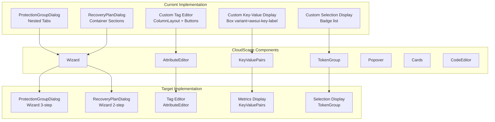

# Design Document: CloudScape Component Improvements

## Overview

This design document outlines the architecture and implementation strategy for adopting additional CloudScape Design System components in the AWS DRS Orchestration frontend application. The goal is to replace custom component implementations with native CloudScape components to improve consistency, accessibility, and maintainability.

### Goals

1. **Improve UX Consistency**: Align with AWS Console patterns using native CloudScape components
2. **Reduce Custom Code**: Replace custom implementations with battle-tested CloudScape components
3. **Enhance Accessibility**: Leverage CloudScape's built-in WCAG 2.1 AA compliance
4. **Simplify Maintenance**: Use components with regular updates and bug fixes from AWS

### Scope

**In Scope:**
- Adopting Wizard component for multi-step dialogs
- Adopting AttributeEditor for tag management
- Adopting KeyValuePairs for metadata display
- Adopting TokenGroup for selection display
- Adopting Popover for contextual information
- Adopting Cards for gallery views
- Adopting CodeEditor for JSON configuration

**Out of Scope:**
- CSS refactoring (covered in `.kiro/specs/css-refactoring/`)
- Design token migration (covered in css-refactoring spec)
- New feature development
- API changes

### Success Criteria

- All targeted custom implementations replaced with CloudScape components
- Existing functionality preserved (form validation, API contracts)
- Visual regression tests pass
- Accessibility compliance maintained

## Architecture

### High-Level Component Migration Architecture



### Migration Strategy

**Phase 1: Dashboard Improvements (Lowest Risk - No Functional Impact)**
1. KeyValuePairs for Dashboard execution metrics
2. KeyValuePairs for CapacityDashboard metrics
3. Cards for Dashboard metric containers
4. Popover for capacity warnings

**Phase 2: Display Components (Low Risk)**
5. KeyValuePairs for ExecutionDetails metadata
6. TokenGroup for ServerSelector selected display
7. TokenGroup for WaveConfigEditor selected PGs

**Phase 3: Form Enhancements (Medium Risk)**
8. AttributeEditor for tag management in ProtectionGroupDialog

**Phase 4: Workflow Improvements (Higher Risk - Major Refactor)**
9. Wizard for ProtectionGroupDialog
10. Wizard for RecoveryPlanDialog

**Phase 5: Advanced Features (Optional)**
11. Cards gallery view for ProtectionGroupsPage
12. CodeEditor for JSON configuration

## Components and Interfaces

### 1. Wizard Component Integration

**Target Files:**
- `frontend/src/components/ProtectionGroupDialog.tsx`
- `frontend/src/components/RecoveryPlanDialog.tsx`

**Current Implementation (ProtectionGroupDialog):**
```typescript
// Current: Nested Tabs for step navigation
<Tabs
  activeTabId={activeTabId}
  tabs={[
    { id: 'servers', label: 'Server Selection', content: <ServerSelection /> },
    { id: 'launch-config', label: 'Launch Settings', content: <LaunchConfig /> },
    { id: 'server-configs', label: 'Server Configurations', content: <ServerConfigs /> },
  ]}
/>
```

**Target Implementation:**
```typescript
import { Wizard } from '@cloudscape-design/components';

<Wizard
  i18nStrings={{
    stepNumberLabel: stepNumber => `Step ${stepNumber}`,
    collapsedStepsLabel: (stepNumber, stepsCount) => `Step ${stepNumber} of ${stepsCount}`,
    cancelButton: 'Cancel',
    previousButton: 'Previous',
    nextButton: 'Next',
    submitButton: isEditMode ? 'Update Group' : 'Create Group',
    optional: 'optional',
  }}
  onCancel={handleCancel}
  onSubmit={handleSave}
  onNavigate={({ detail }) => setActiveStepIndex(detail.requestedStepIndex)}
  activeStepIndex={activeStepIndex}
  steps={[
    {
      title: 'Server Selection',
      description: 'Select servers for this protection group',
      content: <ServerSelectionStep />,
      errorText: validationErrors.servers,
    },
    {
      title: 'Launch Settings',
      description: 'Configure default launch settings',
      content: <LaunchSettingsStep />,
    },
    {
      title: 'Server Configurations',
      description: 'Configure per-server overrides',
      content: <ServerConfigurationsStep />,
      isOptional: true,
    },
  ]}
/>
```

**Interface:**
```typescript
interface WizardStep {
  title: string;
  description?: string;
  content: React.ReactNode;
  errorText?: string;
  isOptional?: boolean;
}

interface ProtectionGroupWizardProps {
  open: boolean;
  group?: ProtectionGroup | null;
  onClose: () => void;
  onSave: (group: ProtectionGroup) => void;
}
```

### 2. AttributeEditor Component Integration

**Target Files:**
- `frontend/src/components/ProtectionGroupDialog.tsx` (tag editor section)

**Current Implementation:**
```typescript
// Current: Manual ColumnLayout with add/remove buttons
{tags.map((tag, index) => (
  <ColumnLayout key={index} columns={3}>
    <FormField label={index === 0 ? 'Tag Key' : undefined}>
      <Input value={tag.key} onChange={...} />
    </FormField>
    <FormField label={index === 0 ? 'Tag Value' : undefined}>
      <Input value={tag.value} onChange={...} />
    </FormField>
    <Box padding={{ top: index === 0 ? 'l' : 'n' }}>
      <Button iconName="close" variant="icon" onClick={() => handleRemoveTag(index)} />
    </Box>
  </ColumnLayout>
))}
<Button iconName="add-plus" onClick={handleAddTag}>Add Tag</Button>
```

**Target Implementation:**
```typescript
import { AttributeEditor } from '@cloudscape-design/components';

<AttributeEditor
  onAddButtonClick={() => setTags([...tags, { key: '', value: '' }])}
  onRemoveButtonClick={({ detail: { itemIndex } }) => 
    setTags(tags.filter((_, i) => i !== itemIndex))
  }
  items={tags}
  addButtonText="Add tag"
  definition={[
    {
      label: 'Key',
      control: (item, itemIndex) => (
        <Input
          value={item.key}
          onChange={({ detail }) => handleTagChange(itemIndex, 'key', detail.value)}
          placeholder="e.g., DR-Application"
        />
      ),
      errorText: (item) => item.key && !item.key.trim() ? 'Key is required' : undefined,
    },
    {
      label: 'Value',
      control: (item, itemIndex) => (
        <Input
          value={item.value}
          onChange={({ detail }) => handleTagChange(itemIndex, 'value', detail.value)}
          placeholder="e.g., Production"
        />
      ),
      errorText: (item) => item.value && !item.value.trim() ? 'Value is required' : undefined,
    },
  ]}
  empty="No tags defined. Add tags to filter servers."
/>
```

**Interface:**
```typescript
interface TagEntry {
  key: string;
  value: string;
}

interface AttributeEditorDefinition<T> {
  label: string;
  control: (item: T, itemIndex: number) => React.ReactNode;
  errorText?: (item: T) => string | undefined;
}
```

### 3. KeyValuePairs Component Integration

**Target Files:**
- `frontend/src/components/CapacityDashboard.tsx`
- `frontend/src/pages/Dashboard.tsx`
- `frontend/src/components/ExecutionDetails.tsx`

**Current Implementation (CapacityDashboard):**
```typescript
// Current: Box variant="awsui-key-label" with manual styling
<ColumnLayout columns={4} variant="text-grid">
  <div>
    <Box variant="awsui-key-label">Total Replicating</Box>
    <Box variant="awsui-value-large">{formatNumber(data.totalReplicating)}</Box>
  </div>
  <div>
    <Box variant="awsui-key-label">Percentage Used</Box>
    <Box variant="awsui-value-large">{data.percentUsed.toFixed(1)}%</Box>
  </div>
  ...
</ColumnLayout>
```

**Target Implementation:**
```typescript
import { KeyValuePairs } from '@cloudscape-design/components';

<KeyValuePairs
  columns={4}
  items={[
    {
      label: 'Total Replicating',
      value: `${formatNumber(data.totalReplicating)} / ${formatNumber(data.maxReplicating)}`,
    },
    {
      label: 'Percentage Used',
      value: `${data.percentUsed.toFixed(1)}%`,
    },
    {
      label: 'Available Slots',
      value: formatNumber(data.availableSlots),
    },
    {
      label: 'Status',
      value: <StatusIndicator type={getStatusType(data.status)}>{data.status}</StatusIndicator>,
    },
  ]}
/>
```

**Interface:**
```typescript
interface KeyValuePairItem {
  label: string;
  value: React.ReactNode;
  info?: React.ReactNode;
}
```

### 4. TokenGroup Component Integration

**Target Files:**
- `frontend/src/components/ServerSelector.tsx`
- `frontend/src/components/WaveConfigEditor.tsx`

**Current Implementation (ServerSelector):**
```typescript
// Current: Badge list with manual styling
<SpaceBetween direction="horizontal" size="xs">
  {Object.entries(server.tags || {}).map(([key, value]) => (
    <Badge key={key} color="blue">{key}: {value}</Badge>
  ))}
</SpaceBetween>
```

**Target Implementation:**
```typescript
import { TokenGroup } from '@cloudscape-design/components';

<TokenGroup
  items={selectedServers.map(server => ({
    label: server.hostname || server.id,
    description: server.tags?.['Protection Group'] || undefined,
    dismissLabel: `Remove ${server.hostname || server.id}`,
  }))}
  onDismiss={({ detail: { itemIndex } }) => {
    const newSelection = [...selectedServerIds];
    newSelection.splice(itemIndex, 1);
    onChange(newSelection);
  }}
  i18nStrings={{
    limitShowFewer: 'Show fewer',
    limitShowMore: 'Show more',
  }}
  limit={10}
/>
```

**Interface:**
```typescript
interface TokenGroupItem {
  label: string;
  description?: string;
  dismissLabel?: string;
  disabled?: boolean;
  iconName?: string;
  labelTag?: string;
  tags?: string[];
}
```

### 5. Popover Component Integration

**Target Files:**
- `frontend/src/components/CapacityDashboard.tsx` (capacity warnings)
- `frontend/src/components/StatusBadge.tsx` (status details)

**Target Implementation:**
```typescript
import { Popover, StatusIndicator } from '@cloudscape-design/components';

<Popover
  header="Capacity Warning"
  content={
    <SpaceBetween size="s">
      <div>Region approaching 300-server limit</div>
      <div>Current: {data.current} / {data.max}</div>
      <Link href="/capacity">View capacity details</Link>
    </SpaceBetween>
  }
  triggerType="custom"
  position="right"
>
  <StatusIndicator type="warning">High Capacity</StatusIndicator>
</Popover>
```

### 6. Cards Component Integration

**Target Files:**
- `frontend/src/pages/Dashboard.tsx` (metrics cards)
- `frontend/src/pages/ProtectionGroupsPage.tsx` (gallery view)

**Target Implementation:**
```typescript
import { Cards } from '@cloudscape-design/components';

<Cards
  items={protectionGroups}
  cardDefinition={{
    header: item => item.groupName,
    sections: [
      {
        id: 'servers',
        header: 'Servers',
        content: item => `${item.serverCount} servers`,
      },
      {
        id: 'region',
        header: 'Region',
        content: item => item.region,
      },
      {
        id: 'status',
        content: item => (
          <StatusIndicator type={item.status === 'ACTIVE' ? 'success' : 'warning'}>
            {item.status}
          </StatusIndicator>
        ),
      },
    ],
  }}
  cardsPerRow={[{ cards: 1 }, { minWidth: 500, cards: 2 }, { minWidth: 800, cards: 3 }]}
  selectionType="single"
  selectedItems={selectedItems}
  onSelectionChange={({ detail }) => setSelectedItems(detail.selectedItems)}
  empty={
    <Box textAlign="center" color="inherit">
      <b>No protection groups</b>
      <Box variant="p" color="inherit">
        Create a protection group to get started.
      </Box>
    </Box>
  }
/>
```

### 7. CodeEditor Component Integration

**Target Files:**
- New component: `frontend/src/components/JsonConfigEditor.tsx`
- Integration in launch template configuration

**Target Implementation:**
```typescript
import { CodeEditor } from '@cloudscape-design/components';

<CodeEditor
  ace={ace}
  language="json"
  value={jsonConfig}
  onChange={({ detail }) => setJsonConfig(detail.value)}
  preferences={preferences}
  onPreferencesChange={({ detail }) => setPreferences(detail)}
  loading={loading}
  i18nStrings={{
    loadingState: 'Loading code editor',
    errorState: 'There was an error loading the code editor.',
    errorStateRecovery: 'Retry',
    editorGroupAriaLabel: 'Code editor',
    statusBarGroupAriaLabel: 'Status bar',
    cursorPosition: (row, column) => `Ln ${row}, Col ${column}`,
    errorsTab: 'Errors',
    warningsTab: 'Warnings',
    preferencesButtonAriaLabel: 'Preferences',
    paneCloseButtonAriaLabel: 'Close',
    preferencesModalHeader: 'Preferences',
    preferencesModalCancel: 'Cancel',
    preferencesModalConfirm: 'Confirm',
    preferencesModalWrapLines: 'Wrap lines',
    preferencesModalTheme: 'Theme',
    preferencesModalLightThemes: 'Light themes',
    preferencesModalDarkThemes: 'Dark themes',
  }}
/>
```

## Data Models

### Component State Models

```typescript
// Wizard state for ProtectionGroupDialog
interface ProtectionGroupWizardState {
  activeStepIndex: number;
  name: string;
  description: string;
  region: string;
  selectionMode: 'tags' | 'servers';
  tags: TagEntry[];
  selectedServerIds: string[];
  launchConfig: LaunchConfig;
  serverConfigs: Map<string, ServerLaunchConfig>;
  validationErrors: {
    name?: string;
    region?: string;
    tags?: string;
    servers?: string;
  };
}

// Wizard state for RecoveryPlanDialog
interface RecoveryPlanWizardState {
  activeStepIndex: number;
  name: string;
  description: string;
  waves: Wave[];
  validationErrors: {
    name?: string;
    waves?: string;
  };
}

// TokenGroup items for server selection
interface ServerToken {
  label: string;
  description?: string;
  dismissLabel: string;
  serverId: string;
}

// KeyValuePairs items for capacity display
interface CapacityMetric {
  label: string;
  value: React.ReactNode;
  info?: React.ReactNode;
}
```

### Migration Tracking Model

```typescript
interface ComponentMigration {
  componentPath: string;
  componentName: string;
  cloudscapeComponent: string;
  priority: 1 | 2 | 3 | 4;
  phase: 'low-risk' | 'form-enhancement' | 'workflow' | 'advanced';
  status: 'not_started' | 'in_progress' | 'completed' | 'tested';
  currentImplementation: string;
  targetImplementation: string;
  breakingChanges: boolean;
  notes?: string;
}

const migrations: ComponentMigration[] = [
  // Phase 1: Dashboard Improvements (Lowest Risk)
  {
    componentPath: 'frontend/src/pages/Dashboard.tsx',
    componentName: 'Execution Metrics',
    cloudscapeComponent: 'KeyValuePairs',
    priority: 1,
    phase: 'dashboard',
    status: 'not_started',
    currentImplementation: 'Box variant="awsui-key-label"',
    targetImplementation: 'KeyValuePairs with columns',
    breakingChanges: false,
    notes: 'Display-only change, no functional impact',
  },
  {
    componentPath: 'frontend/src/components/CapacityDashboard.tsx',
    componentName: 'Capacity Metrics',
    cloudscapeComponent: 'KeyValuePairs',
    priority: 1,
    phase: 'dashboard',
    status: 'not_started',
    currentImplementation: 'Box variant="awsui-key-label"',
    targetImplementation: 'KeyValuePairs with columns',
    breakingChanges: false,
    notes: 'Display-only change, no functional impact',
  },
  {
    componentPath: 'frontend/src/pages/Dashboard.tsx',
    componentName: 'Metric Containers',
    cloudscapeComponent: 'Cards',
    priority: 1,
    phase: 'dashboard',
    status: 'not_started',
    currentImplementation: 'ColumnLayout with Container',
    targetImplementation: 'Cards component',
    breakingChanges: false,
    notes: 'Visual enhancement only',
  },
  {
    componentPath: 'frontend/src/components/CapacityDashboard.tsx',
    componentName: 'Capacity Warnings',
    cloudscapeComponent: 'Popover',
    priority: 1,
    phase: 'dashboard',
    status: 'not_started',
    currentImplementation: 'Alert component',
    targetImplementation: 'Popover on StatusIndicator',
    breakingChanges: false,
    notes: 'Enhanced UX for warnings',
  },
  
  // Phase 2: Display Components (Low Risk)
  {
    componentPath: 'frontend/src/components/ExecutionDetails.tsx',
    componentName: 'Execution Metadata',
    cloudscapeComponent: 'KeyValuePairs',
    priority: 2,
    phase: 'display',
    status: 'not_started',
    currentImplementation: 'ColumnLayout with manual styling',
    targetImplementation: 'KeyValuePairs with columns',
    breakingChanges: false,
  },
  {
    componentPath: 'frontend/src/components/ServerSelector.tsx',
    componentName: 'Selected Servers Display',
    cloudscapeComponent: 'TokenGroup',
    priority: 2,
    phase: 'display',
    status: 'not_started',
    currentImplementation: 'Badge list with SpaceBetween',
    targetImplementation: 'TokenGroup with dismiss handlers',
    breakingChanges: false,
  },
  {
    componentPath: 'frontend/src/components/WaveConfigEditor.tsx',
    componentName: 'Selected PGs Display',
    cloudscapeComponent: 'TokenGroup',
    priority: 2,
    phase: 'display',
    status: 'not_started',
    currentImplementation: 'Multiselect display',
    targetImplementation: 'TokenGroup with dismiss handlers',
    breakingChanges: false,
  },
  
  // Phase 3: Form Enhancements (Medium Risk)
  {
    componentPath: 'frontend/src/components/ProtectionGroupDialog.tsx',
    componentName: 'Tag Editor Section',
    cloudscapeComponent: 'AttributeEditor',
    priority: 3,
    phase: 'form-enhancement',
    status: 'not_started',
    currentImplementation: 'ColumnLayout with manual add/remove',
    targetImplementation: 'AttributeEditor with definition array',
    breakingChanges: false,
  },
  
  // Phase 4: Workflow Improvements (Higher Risk)
  {
    componentPath: 'frontend/src/components/ProtectionGroupDialog.tsx',
    componentName: 'Dialog Structure',
    cloudscapeComponent: 'Wizard',
    priority: 4,
    phase: 'workflow',
    status: 'not_started',
    currentImplementation: 'Modal with nested Tabs',
    targetImplementation: 'Wizard with 3 steps',
    breakingChanges: false,
    notes: 'Major refactor - extract step components',
  },
  {
    componentPath: 'frontend/src/components/RecoveryPlanDialog.tsx',
    componentName: 'Dialog Structure',
    cloudscapeComponent: 'Wizard',
    priority: 4,
    phase: 'workflow',
    status: 'not_started',
    currentImplementation: 'Modal with Container sections',
    targetImplementation: 'Wizard with 2 steps',
    breakingChanges: false,
  },
  
  // Phase 5: Advanced Features (Optional)
  {
    componentPath: 'frontend/src/pages/ProtectionGroupsPage.tsx',
    componentName: 'Gallery View',
    cloudscapeComponent: 'Cards',
    priority: 5,
    phase: 'advanced',
    status: 'not_started',
    currentImplementation: 'Table only',
    targetImplementation: 'Table + Cards toggle',
    breakingChanges: false,
    notes: 'New feature - add view toggle',
  },
];
```


## Correctness Properties

*A property is a characteristic or behavior that should hold true across all valid executions of a system—essentially, a formal statement about what the system should do. Properties serve as the bridge between human-readable specifications and machine-verifiable correctness guarantees.*

### Property 1: Wizard Navigation Consistency

*For any* Wizard component with N steps (N > 1), when the user is on step index I (where 0 < I < N), the "Previous" button should be enabled, and when on step index I (where I < N-1) with valid step data, the "Next" button should be enabled.

**Validates: Requirements 1.2, 1.3, 2.2, 2.3**

### Property 2: Wizard Validation Blocking

*For any* Wizard step with validation errors, attempting to navigate to the next step should be blocked, and the step should display an error indicator. Navigation should only be enabled when all required fields pass validation.

**Validates: Requirements 1.5, 2.4, 2.5**

### Property 3: AttributeEditor Item Operations

*For any* AttributeEditor with N items, clicking "Add" should result in N+1 items, clicking "Remove" on item at index I should result in N-1 items with item I removed, and editing item at index I should update only that item while preserving all other items.

**Validates: Requirements 3.1, 3.2, 3.3, 3.4**

### Property 4: AttributeEditor Duplicate Key Validation

*For any* AttributeEditor containing tag items, if two or more items have the same non-empty key value, the component should display a validation error indicating duplicate keys are not allowed.

**Validates: Requirements 3.6**

### Property 5: KeyValuePairs Missing Value Handling

*For any* KeyValuePairs item where the value is null, undefined, or empty string, the component should display a placeholder dash character ("-") instead of blank space.

**Validates: Requirements 4.5**

### Property 6: TokenGroup Display and Dismissal

*For any* array of N selected items passed to TokenGroup, the component should render exactly N tokens. When the dismiss handler is called for token at index I, the resulting selection should have N-1 items with the item at index I removed.

**Validates: Requirements 6.1, 6.2, 6.3, 7.1, 7.2, 7.3, 7.4**

### Property 7: Cards Content Rendering

*For any* array of items passed to Cards component, each card should render with the header matching the item's designated header field, and all defined sections should contain the corresponding item data.

**Validates: Requirements 9.1, 10.2, 10.3**

### Property 8: CodeEditor JSON Validation

*For any* string value passed to CodeEditor with language="json", if the string is not valid JSON syntax, the component should display validation errors. If the string is valid JSON, no syntax errors should be displayed.

**Validates: Requirements 11.4**

### Property 9: Component Migration Behavior Preservation

*For any* component migrated to use CloudScape components, the component should produce identical API payloads for the same user inputs, maintain the same keyboard navigation order, and pass the same accessibility audit checks as the original implementation.

**Validates: Requirements 12.1, 12.2, 12.3, 12.4**

## Error Handling

### Wizard Step Validation Errors

**Error Scenario**: User attempts to navigate to next step with invalid data

**Handling Strategy**:
1. Wizard's `onNavigate` handler checks validation before allowing navigation
2. Step's `errorText` prop displays validation message
3. User must fix errors before proceeding

**Implementation**:
```typescript
const handleNavigate = ({ detail }: { detail: { requestedStepIndex: number } }) => {
  const currentStep = activeStepIndex;
  const targetStep = detail.requestedStepIndex;
  
  // Allow backward navigation always
  if (targetStep < currentStep) {
    setActiveStepIndex(targetStep);
    return;
  }
  
  // Validate current step before forward navigation
  if (!validateStep(currentStep)) {
    return; // Block navigation, errors are displayed via errorText
  }
  
  setActiveStepIndex(targetStep);
};
```

### AttributeEditor Validation Errors

**Error Scenario**: User enters duplicate tag keys or empty values

**Handling Strategy**:
1. Definition's `errorText` function returns error message for invalid items
2. Form-level validation prevents submission with errors
3. Clear error messages guide user to fix issues

**Implementation**:
```typescript
const definition = [
  {
    label: 'Key',
    control: (item, itemIndex) => <Input value={item.key} onChange={...} />,
    errorText: (item) => {
      if (!item.key.trim()) return 'Key is required';
      const duplicates = tags.filter(t => t.key === item.key);
      if (duplicates.length > 1) return 'Duplicate key';
      return undefined;
    },
  },
];
```

### TokenGroup Empty State

**Error Scenario**: No items selected

**Handling Strategy**:
1. TokenGroup renders empty when items array is empty
2. Parent component can show guidance message
3. Form validation ensures at least one selection

**Implementation**:
```typescript
{selectedServers.length > 0 ? (
  <TokenGroup items={tokens} onDismiss={handleDismiss} />
) : (
  <Box color="text-body-secondary">No servers selected</Box>
)}
```

### CodeEditor JSON Parse Errors

**Error Scenario**: User enters invalid JSON syntax

**Handling Strategy**:
1. CodeEditor's ace integration provides syntax highlighting for errors
2. Custom validation can parse JSON and display errors
3. Form submission blocked until JSON is valid

**Implementation**:
```typescript
const validateJson = (value: string): string | undefined => {
  try {
    JSON.parse(value);
    return undefined;
  } catch (e) {
    return `Invalid JSON: ${e.message}`;
  }
};
```

## Testing Strategy

### Dual Testing Approach

This feature requires both unit tests and property-based tests:

**Unit Tests**: Verify specific examples and edge cases
- Test that Wizard renders with correct step titles
- Test that AttributeEditor shows empty state
- Test that TokenGroup handles zero items
- Test that CodeEditor displays syntax errors for invalid JSON

**Property Tests**: Verify universal properties across all inputs
- Test Wizard navigation for any valid step sequence
- Test AttributeEditor operations preserve item integrity
- Test TokenGroup displays correct count for any selection
- Test CodeEditor validates any JSON string correctly

### Property-Based Testing Configuration

All property tests should:
- Run with minimum 100 iterations
- Use fast-check for generating test data
- Tag tests with feature name and property number

**Example Property Test (fast-check)**:
```typescript
import fc from 'fast-check';

// Feature: cloudscape-component-improvements, Property 3: AttributeEditor Item Operations
describe('AttributeEditor Item Operations', () => {
  it('should maintain item count after add operation', () => {
    fc.assert(
      fc.property(
        fc.array(fc.record({ key: fc.string(), value: fc.string() }), { minLength: 0, maxLength: 20 }),
        (initialItems) => {
          const { result } = renderHook(() => useAttributeEditorState(initialItems));
          
          act(() => {
            result.current.onAddButtonClick();
          });
          
          expect(result.current.items.length).toBe(initialItems.length + 1);
        }
      ),
      { numRuns: 100 }
    );
  });

  it('should remove correct item on dismiss', () => {
    fc.assert(
      fc.property(
        fc.array(fc.record({ key: fc.string(), value: fc.string() }), { minLength: 1, maxLength: 20 }),
        fc.nat(),
        (initialItems, indexSeed) => {
          const indexToRemove = indexSeed % initialItems.length;
          const { result } = renderHook(() => useAttributeEditorState(initialItems));
          
          const itemToRemove = result.current.items[indexToRemove];
          
          act(() => {
            result.current.onRemoveButtonClick({ detail: { itemIndex: indexToRemove } });
          });
          
          expect(result.current.items.length).toBe(initialItems.length - 1);
          expect(result.current.items).not.toContainEqual(itemToRemove);
        }
      ),
      { numRuns: 100 }
    );
  });
});
```

### Unit Test Examples

```typescript
// Feature: cloudscape-component-improvements, Unit Tests
describe('ProtectionGroupWizard', () => {
  it('should render three steps with correct titles', () => {
    render(<ProtectionGroupWizard open={true} onClose={jest.fn()} onSave={jest.fn()} />);
    
    expect(screen.getByText('Server Selection')).toBeInTheDocument();
    expect(screen.getByText('Launch Settings')).toBeInTheDocument();
    expect(screen.getByText('Server Configurations')).toBeInTheDocument();
  });

  it('should show "Create Group" button on final step for new group', () => {
    render(<ProtectionGroupWizard open={true} onClose={jest.fn()} onSave={jest.fn()} />);
    
    // Navigate to final step
    fireEvent.click(screen.getByText('Next'));
    fireEvent.click(screen.getByText('Next'));
    
    expect(screen.getByText('Create Group')).toBeInTheDocument();
  });

  it('should show "Update Group" button on final step for existing group', () => {
    const existingGroup = { protectionGroupId: 'pg-123', groupName: 'Test' };
    render(<ProtectionGroupWizard open={true} group={existingGroup} onClose={jest.fn()} onSave={jest.fn()} />);
    
    // Navigate to final step
    fireEvent.click(screen.getByText('Next'));
    fireEvent.click(screen.getByText('Next'));
    
    expect(screen.getByText('Update Group')).toBeInTheDocument();
  });
});

describe('AttributeEditor Empty State', () => {
  it('should display empty message when no tags', () => {
    render(<TagEditor tags={[]} onChange={jest.fn()} />);
    
    expect(screen.getByText('No tags defined. Add tags to filter servers.')).toBeInTheDocument();
  });
});

describe('TokenGroup Empty State', () => {
  it('should display empty message when no servers selected', () => {
    render(<ServerTokenGroup selectedServers={[]} onDismiss={jest.fn()} />);
    
    expect(screen.getByText('No servers selected')).toBeInTheDocument();
  });
});
```

### Visual Regression Testing

For each component migration:
1. Take screenshot before migration
2. Implement CloudScape component
3. Take screenshot after migration
4. Compare for visual differences
5. Document any intentional visual changes

### Accessibility Testing

All migrated components should:
- Pass axe-core accessibility audit
- Support keyboard navigation
- Have proper ARIA labels
- Work with screen readers

```typescript
import { axe, toHaveNoViolations } from 'jest-axe';

expect.extend(toHaveNoViolations);

describe('Accessibility', () => {
  it('ProtectionGroupWizard should have no accessibility violations', async () => {
    const { container } = render(<ProtectionGroupWizard open={true} onClose={jest.fn()} onSave={jest.fn()} />);
    const results = await axe(container);
    expect(results).toHaveNoViolations();
  });
});
```
