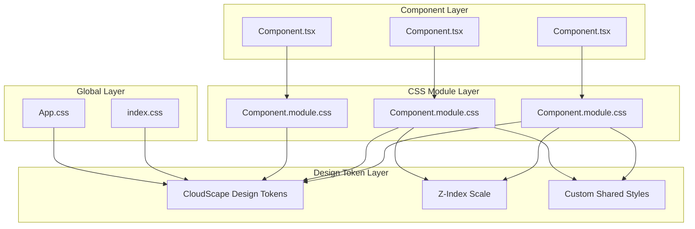

# Design Document: CSS Refactoring

## Overview

This design document outlines the architecture and implementation strategy for refactoring custom CSS in the AWS DRS Orchestration frontend application. The refactoring will eliminate inline styles, establish a CSS module architecture, implement CloudScape design tokens throughout the application, and ensure compliance with official AWS Management Console design standards.

### Goals

1. **Eliminate Technical Debt**: Remove 50+ instances of inline styles scattered across components
2. **Establish Maintainability**: Create organized CSS module structure with clear ownership
3. **Ensure AWS Compliance**: Align with official AWS Management Console visual standards
4. **Enable Theme Support**: Leverage CloudScape tokens for automatic light/dark mode adaptation
5. **Improve Developer Experience**: Provide clear patterns and documentation for styling

### Scope

**In Scope:**
- Refactoring all inline styles to CSS modules
- Implementing CloudScape design tokens for colors, spacing, typography
- Creating centralized z-index layering system
- Updating global styles (index.css, App.css)
- Creating design token reference documentation
- Establishing CSS linting rules
- Styling custom wrapper components and layouts

**Out of Scope:**
- Changing component functionality or behavior
- Modifying CloudScape component props or structure
- Overriding CloudScape component internal styles (discouraged by CloudScape)
- Redesigning UI layouts or user flows
- Adding new features or components

**Critical Design Principle:**
According to CloudScape documentation, custom CSS classes on CloudScape components are deprecated because the internal HTML and CSS structure can change with updates. Our refactoring will:
- Use CloudScape components as-is without style overrides
- Apply custom styles only to wrapper divs and custom components
- Use CloudScape's built-in variant props for styling variations
- Leverage CloudScape design tokens for consistency

### Success Criteria

- Zero inline styles in component files (except justified dynamic values)
- All colors use CloudScape design tokens
- All spacing uses CloudScape spacing scale
- Visual regression tests pass (no visual changes)
- Theme switching works correctly in light/dark mode
- CSS linting integrated into CI/CD pipeline

## Architecture

### High-Level Architecture



### CSS Architecture Layers

**Layer 1: Global Styles**
- `frontend/src/index.css` - Global resets and base styles
- `frontend/src/App.css` - App-level styles (scrollbar, root container)
- Minimal scope, only essential global styles

**Layer 2: Design Token Foundation**
- CloudScape design tokens (from `@cloudscape-design/design-tokens`)
- Custom z-index scale (`frontend/src/styles/z-index.css`)
- Shared utility styles (`frontend/src/styles/utilities.css`)

**Layer 3: Component CSS Modules**
- Component-specific styles in `.module.css` files
- Scoped to individual components
- Import design tokens via CSS custom properties
- **NEVER override CloudScape component internals**

**Layer 4: Component TypeScript**
- Import CSS modules
- Apply className bindings to wrapper divs, not CloudScape components
- Use CloudScape component variant props for styling
- Minimal inline styles (only for truly dynamic values)

### CloudScape Component Styling Guidelines

**DO:**
- ✅ Wrap CloudScape components in styled divs
- ✅ Use CloudScape component variant props (e.g., `variant="primary"`)
- ✅ Use CloudScape spacing components (SpaceBetween, Box)
- ✅ Use CloudScape design tokens in custom CSS
- ✅ Style custom wrapper components with CSS modules

**DON'T:**
- ❌ Add className to CloudScape components (deprecated)
- ❌ Override CloudScape component internal styles
- ❌ Use !important to override CloudScape styles
- ❌ Rely on CloudScape internal HTML structure
- ❌ Target CloudScape internal class names

**Example - WRONG:**
```typescript
// ❌ Don't override CloudScape component styles
<Button className={styles.customButton}>Click</Button>

// styles.customButton overrides Button internals - will break on updates
```

**Example - CORRECT:**
```typescript
// ✅ Wrap in styled div
<div className={styles.buttonWrapper}>
  <Button variant="primary">Click</Button>
</div>

// styles.buttonWrapper styles the wrapper, not the Button
```

### File Organization Strategy

```
frontend/src/
├── styles/
│   ├── z-index.css                    # Centralized z-index scale
│   ├── utilities.css                  # Shared utility classes
│   ├── design-tokens.md               # Token reference documentation
│   └── cloudscape-theme.ts            # Theme configuration (existing)
├── components/
│   ├── MyComponent.tsx
│   ├── MyComponent.module.css         # Component-specific styles
│   ├── AnotherComponent.tsx
│   └── AnotherComponent.module.css
├── pages/
│   ├── Dashboard.tsx
│   ├── Dashboard.module.css
│   ├── ExecutionsPage.tsx
│   └── ExecutionsPage.module.css
├── index.css                          # Global styles
└── App.css                            # App-level styles
```

### Migration Strategy

**Phase 1: Foundation (Priority 1)**
1. Create z-index scale
2. Create utilities.css
3. Create design token reference documentation
4. Update global styles (index.css, App.css)

**Phase 2: Pages (Priority 2)**
5. Refactor Dashboard.tsx
6. Refactor ExecutionsPage.tsx
7. Refactor ExecutionDetailsPage.tsx
8. Refactor RecoveryPlansPage.tsx
9. Refactor ProtectionGroupsPage.tsx
10. Refactor LoginPage.tsx

**Phase 3: Shared Components (Priority 3)**
11. Refactor LoadingState.tsx
12. Refactor StatusBadge.tsx
13. Refactor ErrorState.tsx
14. Refactor ConfirmDialog.tsx
15. Refactor modals and dialogs

**Phase 4: Specialized Components (Priority 4)**
16. Refactor remaining components
17. Refactor utility components

**Phase 5: Validation & Cleanup (Priority 5)**
18. Configure CSS linting
19. Run visual regression tests
20. Update developer documentation

## Components and Interfaces

### CSS Module Interface

Each component CSS module follows this structure:

```css
/* ComponentName.module.css */

/* Container/wrapper styles */
.container {
  /* Layout */
  display: flex;
  flex-direction: column;
  gap: var(--awsui-space-scaled-m);
  
  /* Visual */
  background-color: var(--awsui-color-background-container-content);
  border: 1px solid var(--awsui-color-border-container-top);
  border-radius: var(--awsui-border-radius-container);
  padding: var(--awsui-space-scaled-m);
}

/* Header styles */
.header {
  color: var(--awsui-color-text-heading-default);
  font-size: var(--awsui-font-size-heading-m);
  font-weight: var(--awsui-font-weight-heading);
  margin-bottom: var(--awsui-space-scaled-s);
}

/* Content styles */
.content {
  /* Component-specific styles */
}

/* State modifiers */
.loading {
  opacity: 0.6;
  pointer-events: none;
}

.error {
  border-color: var(--awsui-color-border-status-error);
}
```

### TypeScript Component Interface

```typescript
// ComponentName.tsx
import React from 'react';
import styles from './ComponentName.module.css';

interface ComponentNameProps {
  title: string;
  loading?: boolean;
  error?: boolean;
}

export const ComponentName: React.FC<ComponentNameProps> = ({
  title,
  loading = false,
  error = false,
}) => {
  return (
    <div className={`${styles.container} ${loading ? styles.loading : ''} ${error ? styles.error : ''}`}>
      <h2 className={styles.header}>{title}</h2>
      <div className={styles.content}>
        {/* Component content */}
      </div>
    </div>
  );
};
```

### Z-Index Scale Interface

```css
/* frontend/src/styles/z-index.css */

:root {
  /* Base layer - default stacking context */
  --z-index-base: 0;
  
  /* Dropdown layer - select menus, autocomplete */
  --z-index-dropdown: 1000;
  
  /* Modal overlay layer - backdrop behind modals */
  --z-index-modal-overlay: 1999;
  
  /* Modal layer - dialog boxes, confirmations */
  --z-index-modal: 2000;
  
  /* Tooltip layer - hover tooltips, popovers */
  --z-index-tooltip: 3000;
  
  /* Notification layer - toast messages, alerts */
  --z-index-notification: 4000;
}
```

### Utilities Interface

```css
/* frontend/src/styles/utilities.css */

/* Flexbox utilities */
.flexRow {
  display: flex;
  flex-direction: row;
  align-items: center;
}

.flexColumn {
  display: flex;
  flex-direction: column;
}

.flexBetween {
  display: flex;
  justify-content: space-between;
  align-items: center;
}

/* Spacing utilities */
.gapXs {
  gap: var(--awsui-space-scaled-xs);
}

.gapS {
  gap: var(--awsui-space-scaled-s);
}

.gapM {
  gap: var(--awsui-space-scaled-m);
}

/* Text utilities */
.textSecondary {
  color: var(--awsui-color-text-body-secondary);
}

.textMuted {
  color: var(--awsui-color-text-body-secondary);
  font-size: var(--awsui-font-size-body-s);
}

.textMonospace {
  font-family: Monaco, Menlo, 'Courier New', monospace;
  font-size: var(--awsui-font-size-body-s);
}
```

## Data Models

### Design Token Mapping Model

This model defines the mapping between hardcoded values and CloudScape tokens:

```typescript
interface TokenMapping {
  category: 'color' | 'spacing' | 'typography' | 'border' | 'shadow';
  hardcodedValue: string;
  cloudscapeToken: string;
  cssVariable: string;
  description: string;
}

const tokenMappings: TokenMapping[] = [
  // Color mappings
  {
    category: 'color',
    hardcodedValue: '#5f6b7a',
    cloudscapeToken: 'colorTextBodySecondary',
    cssVariable: 'var(--awsui-color-text-body-secondary)',
    description: 'Secondary text color for labels and metadata'
  },
  {
    category: 'color',
    hardcodedValue: '#16191f',
    cloudscapeToken: 'colorTextBodyDefault',
    cssVariable: 'var(--awsui-color-text-body-default)',
    description: 'Primary text color for body content'
  },
  {
    category: 'color',
    hardcodedValue: '#0972d3',
    cloudscapeToken: 'colorTextLinkDefault',
    cssVariable: 'var(--awsui-color-text-link-default)',
    description: 'Link and interactive element color'
  },
  {
    category: 'color',
    hardcodedValue: '#037f0c',
    cloudscapeToken: 'colorTextStatusSuccess',
    cssVariable: 'var(--awsui-color-text-status-success)',
    description: 'Success status color'
  },
  {
    category: 'color',
    hardcodedValue: '#d13212',
    cloudscapeToken: 'colorTextStatusError',
    cssVariable: 'var(--awsui-color-text-status-error)',
    description: 'Error status color'
  },
  {
    category: 'color',
    hardcodedValue: '#ffffff',
    cloudscapeToken: 'colorBackgroundContainerContent',
    cssVariable: 'var(--awsui-color-background-container-content)',
    description: 'Container background color'
  },
  {
    category: 'color',
    hardcodedValue: '#f2f3f3',
    cloudscapeToken: 'colorBackgroundLayoutMain',
    cssVariable: 'var(--awsui-color-background-layout-main)',
    description: 'Main layout background color'
  },
  
  // Spacing mappings
  {
    category: 'spacing',
    hardcodedValue: '4px',
    cloudscapeToken: 'spaceScaledXxs',
    cssVariable: 'var(--awsui-space-scaled-xxs)',
    description: 'Extra extra small spacing (4px)'
  },
  {
    category: 'spacing',
    hardcodedValue: '8px',
    cloudscapeToken: 'spaceScaledXs',
    cssVariable: 'var(--awsui-space-scaled-xs)',
    description: 'Extra small spacing (8px)'
  },
  {
    category: 'spacing',
    hardcodedValue: '12px',
    cloudscapeToken: 'spaceScaledS',
    cssVariable: 'var(--awsui-space-scaled-s)',
    description: 'Small spacing (12px)'
  },
  {
    category: 'spacing',
    hardcodedValue: '16px',
    cloudscapeToken: 'spaceScaledM',
    cssVariable: 'var(--awsui-space-scaled-m)',
    description: 'Medium spacing (16px)'
  },
  {
    category: 'spacing',
    hardcodedValue: '20px',
    cloudscapeToken: 'spaceScaledL',
    cssVariable: 'var(--awsui-space-scaled-l)',
    description: 'Large spacing (20px)'
  },
  {
    category: 'spacing',
    hardcodedValue: '24px',
    cloudscapeToken: 'spaceScaledXl',
    cssVariable: 'var(--awsui-space-scaled-xl)',
    description: 'Extra large spacing (24px)'
  },
  {
    category: 'spacing',
    hardcodedValue: '32px',
    cloudscapeToken: 'spaceScaledXxl',
    cssVariable: 'var(--awsui-space-scaled-xxl)',
    description: 'Extra extra large spacing (32px)'
  },
  
  // Typography mappings
  {
    category: 'typography',
    hardcodedValue: '12px',
    cloudscapeToken: 'fontSizeBodyS',
    cssVariable: 'var(--awsui-font-size-body-s)',
    description: 'Small body text (12px)'
  },
  {
    category: 'typography',
    hardcodedValue: '14px',
    cloudscapeToken: 'fontSizeBodyM',
    cssVariable: 'var(--awsui-font-size-body-m)',
    description: 'Medium body text (14px)'
  },
  {
    category: 'typography',
    hardcodedValue: '16px',
    cloudscapeToken: 'fontSizeHeadingS',
    cssVariable: 'var(--awsui-font-size-heading-s)',
    description: 'Small heading (16px)'
  },
  {
    category: 'typography',
    hardcodedValue: '18px',
    cloudscapeToken: 'fontSizeHeadingM',
    cssVariable: 'var(--awsui-font-size-heading-m)',
    description: 'Medium heading (18px)'
  },
  {
    category: 'typography',
    hardcodedValue: '20px',
    cloudscapeToken: 'fontSizeHeadingL',
    cssVariable: 'var(--awsui-font-size-heading-l)',
    description: 'Large heading (20px)'
  },
  {
    category: 'typography',
    hardcodedValue: '24px',
    cloudscapeToken: 'fontSizeHeadingXl',
    cssVariable: 'var(--awsui-font-size-heading-xl)',
    description: 'Extra large heading (24px)'
  },
  {
    category: 'typography',
    hardcodedValue: '600',
    cloudscapeToken: 'fontWeightHeading',
    cssVariable: 'var(--awsui-font-weight-heading)',
    description: 'Heading font weight (600)'
  },
  {
    category: 'typography',
    hardcodedValue: '700',
    cloudscapeToken: 'fontWeightBold',
    cssVariable: 'var(--awsui-font-weight-bold)',
    description: 'Bold font weight (700)'
  }
];
```

### Component Refactoring Model

This model tracks the refactoring status of each component:

```typescript
interface ComponentRefactoring {
  componentPath: string;
  componentName: string;
  priority: 1 | 2 | 3 | 4 | 5;
  phase: 'foundation' | 'pages' | 'shared' | 'specialized' | 'validation';
  status: 'not_started' | 'in_progress' | 'completed' | 'tested';
  inlineStyleCount: number;
  hardcodedColorCount: number;
  hardcodedSpacingCount: number;
  cssModuleCreated: boolean;
  visualRegressionTested: boolean;
  notes?: string;
}

const componentRefactorings: ComponentRefactoring[] = [
  // Phase 2: Pages
  {
    componentPath: 'frontend/src/pages/Dashboard.tsx',
    componentName: 'Dashboard',
    priority: 2,
    phase: 'pages',
    status: 'not_started',
    inlineStyleCount: 8,
    hardcodedColorCount: 6,
    hardcodedSpacingCount: 4,
    cssModuleCreated: false,
    visualRegressionTested: false
  },
  {
    componentPath: 'frontend/src/pages/ExecutionsPage.tsx',
    componentName: 'ExecutionsPage',
    priority: 2,
    phase: 'pages',
    status: 'not_started',
    inlineStyleCount: 4,
    hardcodedColorCount: 2,
    hardcodedSpacingCount: 2,
    cssModuleCreated: false,
    visualRegressionTested: false
  },
  {
    componentPath: 'frontend/src/pages/ExecutionDetailsPage.tsx',
    componentName: 'ExecutionDetailsPage',
    priority: 2,
    phase: 'pages',
    status: 'not_started',
    inlineStyleCount: 15,
    hardcodedColorCount: 12,
    hardcodedSpacingCount: 10,
    cssModuleCreated: false,
    visualRegressionTested: false
  },
  {
    componentPath: 'frontend/src/pages/RecoveryPlansPage.tsx',
    componentName: 'RecoveryPlansPage',
    priority: 2,
    phase: 'pages',
    status: 'not_started',
    inlineStyleCount: 6,
    hardcodedColorCount: 4,
    hardcodedSpacingCount: 3,
    cssModuleCreated: false,
    visualRegressionTested: false
  },
  {
    componentPath: 'frontend/src/pages/LoginPage.tsx',
    componentName: 'LoginPage',
    priority: 2,
    phase: 'pages',
    status: 'not_started',
    inlineStyleCount: 12,
    hardcodedColorCount: 8,
    hardcodedSpacingCount: 6,
    cssModuleCreated: false,
    visualRegressionTested: false
  },
  
  // Phase 3: Shared Components
  {
    componentPath: 'frontend/src/components/LoadingState.tsx',
    componentName: 'LoadingState',
    priority: 3,
    phase: 'shared',
    status: 'not_started',
    inlineStyleCount: 4,
    hardcodedColorCount: 2,
    hardcodedSpacingCount: 3,
    cssModuleCreated: false,
    visualRegressionTested: false
  },
  {
    componentPath: 'frontend/src/components/StatusBadge.tsx',
    componentName: 'StatusBadge',
    priority: 3,
    phase: 'shared',
    status: 'not_started',
    inlineStyleCount: 0,
    hardcodedColorCount: 0,
    hardcodedSpacingCount: 0,
    cssModuleCreated: false,
    visualRegressionTested: false,
    notes: 'Uses CloudScape StatusIndicator, minimal custom styling'
  }
];
```

### CSS Linting Configuration Model

This model defines the linting rules for CSS:

```typescript
interface CSSLintingConfig {
  eslintRules: {
    ruleName: string;
    severity: 'error' | 'warn';
    options: any;
    description: string;
  }[];
  stylelintRules: {
    ruleName: string;
    severity: 'error' | 'warn';
    options: any;
    description: string;
  }[];
}

const cssLintingConfig: CSSLintingConfig = {
  eslintRules: [
    {
      ruleName: 'react/forbid-dom-props',
      severity: 'error',
      options: {
        forbid: [
          {
            propName: 'style',
            message: 'Inline styles are not allowed. Use CSS modules instead.'
          }
        ]
      },
      description: 'Prevents inline style attributes in JSX'
    },
    {
      ruleName: 'react/forbid-component-props',
      severity: 'warn',
      options: {
        forbid: [
          {
            propName: 'style',
            message: 'Consider using CSS modules for component styling.'
          }
        ]
      },
      description: 'Warns about style props on components'
    }
  ],
  stylelintRules: [
    {
      ruleName: 'color-no-hex',
      severity: 'error',
      options: null,
      description: 'Disallows hex colors, enforces design tokens'
    },
    {
      ruleName: 'declaration-property-value-disallowed-list',
      severity: 'error',
      options: {
        '/^(margin|padding|gap|width|height)/': ['/^\\d+px$/'],
        message: 'Use CloudScape spacing tokens instead of hardcoded pixel values'
      },
      description: 'Disallows hardcoded spacing values'
    },
    {
      ruleName: 'custom-property-pattern',
      severity: 'error',
      options: '^[a-z][a-zA-Z0-9]*$',
      description: 'Enforces camelCase for custom properties'
    },
    {
      ruleName: 'selector-class-pattern',
      severity: 'error',
      options: '^[a-z][a-zA-Z0-9]*$',
      description: 'Enforces camelCase for class names'
    }
  ]
};
```


## Correctness Properties

*A property is a characteristic or behavior that should hold true across all valid executions of a system—essentially, a formal statement about what the system should do. Properties serve as the bridge between human-readable specifications and machine-verifiable correctness guarantees.*

### Property 1: No Inline Styles

*For any* React component file (.tsx), the file should contain zero inline `style={{}}` attributes, except where a comment immediately preceding the style attribute justifies it as necessary for dynamic values that cannot be predetermined (e.g., calculated widths based on runtime data).

**Validates: Requirements 1.1, 1.3, 1.4**

### Property 2: CSS Modules Exist and Are Co-Located

*For any* React component that uses custom CSS classes (not just CloudScape components), a corresponding CSS module file should exist in the same directory with the naming pattern `ComponentName.module.css`, and shared styles used by multiple components should exist in `frontend/src/styles/`.

**Validates: Requirements 1.2, 3.1, 3.2, 3.3**

### Property 3: TypeScript-Safe CSS Module Imports

*For any* CSS module import in a TypeScript file, the import should use the pattern `import styles from './ComponentName.module.css'` and the styles object should be used with dot notation (e.g., `styles.className`).

**Validates: Requirements 3.5**

### Property 4: No Hex Colors

*For any* CSS file (including .css and .module.css files), the file should contain zero hex color values (matching pattern `#[0-9a-fA-F]{3,6}`), and all color declarations should use CloudScape design token CSS custom properties (e.g., `var(--awsui-color-text-body-default)`).

**Validates: Requirements 2.1, 2.4, 11.1, 11.8**

### Property 5: No Hardcoded Spacing

*For any* CSS file, spacing properties (margin, padding, gap, width, height) should not use hardcoded pixel values (e.g., `8px`, `16px`), and should instead use CloudScape spacing token CSS custom properties (e.g., `var(--awsui-space-scaled-xs)`).

**Validates: Requirements 2.2, 2.5, 11.5**

### Property 6: No Hardcoded Typography

*For any* CSS file, typography properties (font-size, font-weight, line-height) should not use hardcoded values, and should instead use CloudScape typography token CSS custom properties (e.g., `var(--awsui-font-size-body-m)`, `var(--awsui-font-weight-heading)`).

**Validates: Requirements 2.3, 11.3**

### Property 7: camelCase Naming Convention

*For any* CSS file, all class names and custom property names should match the camelCase pattern (starting with lowercase letter, followed by alphanumeric characters with uppercase letters for word boundaries, no hyphens or underscores).

**Validates: Requirements 3.4, 12.1, 12.2**

### Property 8: Z-Index Uses Centralized Scale

*For any* CSS file, z-index declarations should not use hardcoded numeric values, and should instead use CSS custom properties from the centralized z-index scale defined in `frontend/src/styles/z-index.css` (e.g., `var(--z-index-modal)`).

**Validates: Requirements 4.3, 4.5**

### Property 9: Global Styles Use Design Tokens

*For any* global CSS file (`index.css`, `App.css`), color and spacing declarations should use CloudScape design token CSS custom properties rather than hardcoded values.

**Validates: Requirements 5.1, 5.2, 5.3, 5.4**

### Property 10: Status Colors Use CloudScape Tokens

*For any* CSS class related to status display (containing keywords like "success", "error", "warning", "info", "status"), the color property should use CloudScape status color tokens (e.g., `var(--awsui-color-text-status-success)`).

**Validates: Requirements 11.2**

### Property 11: Thin Borders and Strategic Shadows

*For any* CSS class for containers or cards, border declarations should use `1px` width, and box-shadow declarations should only appear on classes for interactive or transient elements (modals, dropdowns, tooltips, not static containers).

**Validates: Requirements 11.4**

### Property 12: Color Paired with Text or Icons

*For any* component that uses color to convey status or information, the component should also include text content or an icon (using CloudScape StatusIndicator, Badge, or similar components that include text labels).

**Validates: Requirements 11.6**

### Property 13: Border-Radius Uses CloudScape Tokens

*For any* CSS file, border-radius declarations should use CloudScape border-radius token CSS custom properties (e.g., `var(--awsui-border-radius-container)`) rather than hardcoded values.

**Validates: Requirements 11.7**

### Property 14: Theme Switching Preserves Appearance

*For any* page in the application, switching between light and dark themes should result in all CloudScape design token CSS custom properties updating to their theme-appropriate values, and the visual appearance should remain consistent with CloudScape component theming.

**Validates: Requirements 7.2**

### Property 15: Animations and Transitions Preserved

*For any* CSS file that existed before refactoring, any transition or animation properties should be preserved in the refactored CSS module with equivalent behavior.

**Validates: Requirements 7.5**

## Error Handling

### CSS Module Loading Errors

**Error Scenario**: CSS module file not found during import

**Handling Strategy**:
1. TypeScript will catch missing CSS module imports at compile time
2. Webpack will fail the build if CSS modules are missing
3. Development server will display clear error messages

**Prevention**:
- Use TypeScript strict mode to catch import errors
- Configure Webpack to validate CSS module imports
- Add pre-commit hooks to verify CSS module existence

### Design Token Missing Errors

**Error Scenario**: CSS custom property not defined (design token doesn't exist)

**Handling Strategy**:
1. Browser will fall back to default values or show unstyled content
2. Console warnings will indicate missing custom properties
3. Visual regression tests will catch styling issues

**Prevention**:
- Use only documented CloudScape design tokens
- Add Stylelint rules to validate token names
- Create comprehensive design token reference documentation

### Z-Index Conflicts

**Error Scenario**: Multiple elements competing for same z-index layer

**Handling Strategy**:
1. Centralized z-index scale prevents conflicts by design
2. Clear layer definitions (dropdown < modal < tooltip < notification)
3. Documentation explains proper layer usage

**Prevention**:
- Use only centralized z-index custom properties
- Document z-index layering system with examples
- Add linting rules to prevent hardcoded z-index values

### Theme Switching Issues

**Error Scenario**: Styles don't adapt correctly when switching themes

**Handling Strategy**:
1. CloudScape design tokens automatically adapt to theme changes
2. Visual regression tests catch theme-specific issues
3. Manual testing in both light and dark modes

**Prevention**:
- Use only CloudScape design tokens (no hardcoded colors)
- Test all components in both themes during development
- Add automated theme switching tests

### CSS Module Naming Conflicts

**Error Scenario**: CSS class names conflict between modules

**Handling Strategy**:
1. CSS modules automatically scope class names to prevent conflicts
2. Webpack generates unique class names with hash suffixes
3. TypeScript provides type safety for CSS module imports

**Prevention**:
- Use CSS modules for all component-specific styles
- Follow naming conventions (camelCase, descriptive names)
- Avoid global class names in CSS modules

### Visual Regression

**Error Scenario**: Refactored styles cause unintended visual changes

**Handling Strategy**:
1. Visual regression testing compares before/after screenshots
2. Manual review of all major pages
3. Rollback capability if issues detected

**Prevention**:
- Take screenshots before refactoring each component
- Test in multiple browsers and viewport sizes
- Use pixel-perfect comparison tools
- Maintain staging environment for testing

## Testing Strategy

### Dual Testing Approach

This refactoring requires both unit tests and property-based tests to ensure comprehensive coverage:

**Unit Tests**: Verify specific examples, edge cases, and configuration
- Test that specific files exist (z-index.css, design-tokens.md)
- Test that linting configuration is correct
- Test that example components render correctly
- Test specific token mappings

**Property Tests**: Verify universal properties across all files
- Test that no component files contain inline styles
- Test that all CSS files use design tokens
- Test that all class names follow camelCase convention
- Test that theme switching works across all components

### Property-Based Testing Configuration

All property tests should:
- Run with minimum 100 iterations to ensure comprehensive coverage
- Use file system scanning to test across all relevant files
- Generate random test cases where applicable
- Tag tests with feature name and property number

**Example Property Test Structure**:
```typescript
// Feature: css-refactoring, Property 1: No Inline Styles
describe('CSS Refactoring - Property 1', () => {
  it('should have zero inline styles in component files', () => {
    const componentFiles = glob.sync('frontend/src/**/*.tsx');
    
    for (const file of componentFiles) {
      const content = fs.readFileSync(file, 'utf-8');
      const inlineStyles = content.match(/style=\{\{/g);
      
      if (inlineStyles) {
        // Check for justification comments
        const hasJustification = content.includes('// Dynamic style:') || 
                                 content.includes('// Justified:');
        expect(hasJustification).toBe(true);
      }
    }
  });
});
```

### Unit Testing Patterns

**File Existence Tests**:
```typescript
describe('CSS Refactoring - Foundation Files', () => {
  it('should have z-index.css file', () => {
    expect(fs.existsSync('frontend/src/styles/z-index.css')).toBe(true);
  });
  
  it('should have design-tokens.md documentation', () => {
    expect(fs.existsSync('frontend/src/styles/design-tokens.md')).toBe(true);
  });
});
```

**Configuration Tests**:
```typescript
describe('CSS Refactoring - Linting Configuration', () => {
  it('should have ESLint rule for inline styles', () => {
    const eslintConfig = require('../.eslintrc.json');
    expect(eslintConfig.rules['react/forbid-dom-props']).toBeDefined();
  });
  
  it('should have Stylelint rule for hex colors', () => {
    const stylelintConfig = require('../.stylelintrc.json');
    expect(stylelintConfig.rules['color-no-hex']).toBe(true);
  });
});
```

**Visual Regression Tests**:
```typescript
describe('CSS Refactoring - Visual Regression', () => {
  it('should match baseline screenshot for Dashboard', async () => {
    const screenshot = await page.screenshot();
    expect(screenshot).toMatchImageSnapshot({
      customSnapshotIdentifier: 'dashboard-after-refactoring',
      failureThreshold: 0.01,
      failureThresholdType: 'percent'
    });
  });
});
```

### Testing Phases

**Phase 1: Pre-Refactoring**
1. Capture baseline screenshots of all major pages
2. Document current inline style count
3. Document current hardcoded value count
4. Establish visual regression baseline

**Phase 2: During Refactoring**
1. Test each refactored component in isolation
2. Verify CSS module imports work correctly
3. Test theme switching for refactored components
4. Run linting on refactored files

**Phase 3: Post-Refactoring**
1. Run all property-based tests
2. Run visual regression tests
3. Test in multiple browsers (Chrome, Firefox, Safari)
4. Test at multiple viewport sizes
5. Test theme switching across entire application
6. Verify CI/CD pipeline includes CSS linting

### Test Coverage Goals

- 100% of component files tested for inline styles
- 100% of CSS files tested for design token usage
- 100% of major pages tested for visual regression
- 100% of components tested for theme switching
- All linting rules validated in CI/CD pipeline
