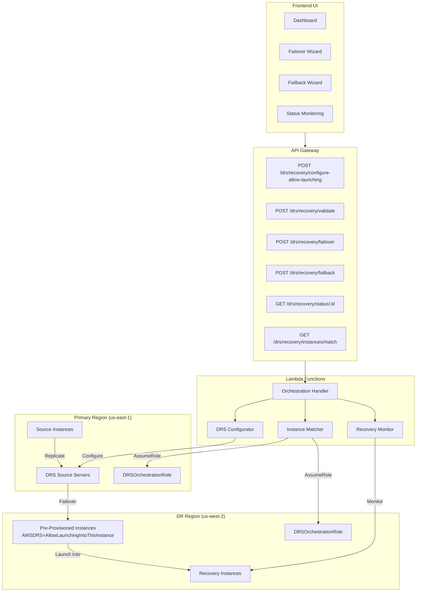
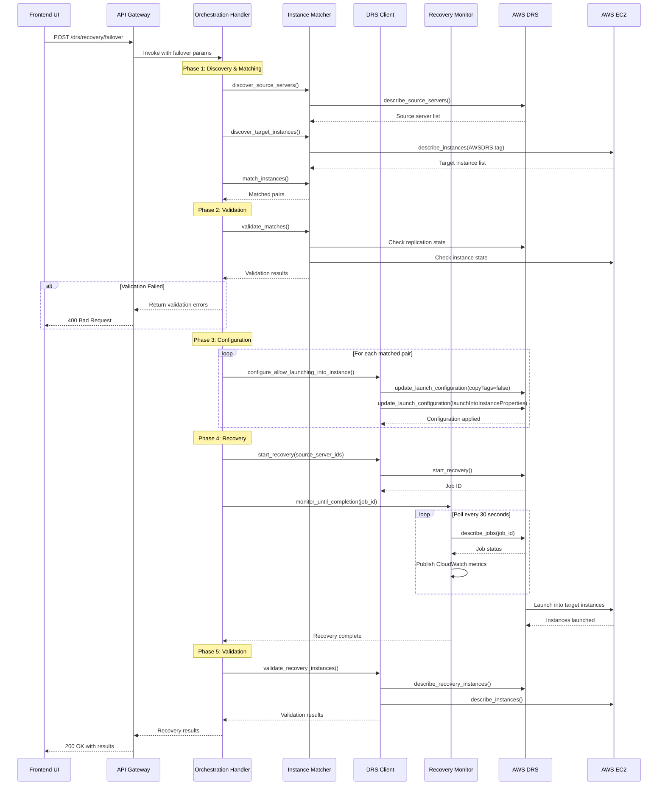
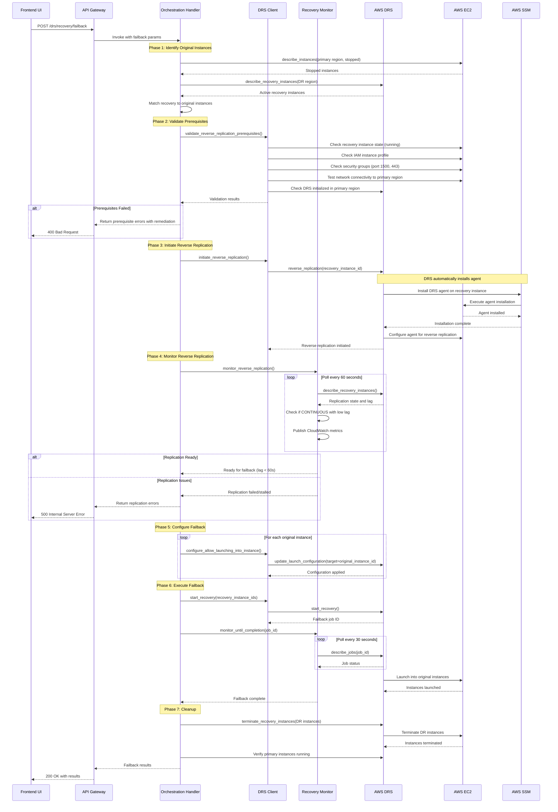

# DRS AllowLaunchingIntoThisInstance Pattern - Design

## Executive Summary

This design document describes the integration of AWS DRS AllowLaunchingIntoThisInstance pattern into the existing DR Orchestration Platform. The pattern enables launching recovery instances into pre-provisioned EC2 instances, preserving instance identity (instance ID, private IP, network configuration) through complete disaster recovery cycles.

**Key Integration Points**:
- **Existing Architecture**: Integrates with three existing Lambda handlers (data-management, execution, query) rather than creating a new handler
- **Dual Invocation**: Supports both API Gateway (frontend) and direct Lambda invocation (backend/scripts)
- **Shared Modules**: Four new shared modules (`instance_matcher.py`, `drs_client.py`, `drs_job_monitor.py`, `drs_error_handler.py`)
- **DynamoDB**: Two new tables for configuration and failback state tracking
- **Step Functions**: Extends existing state machine with new states for AllowLaunchingIntoThisInstance workflows
- **EventBridge**: Extends existing polling rule for execution monitoring

**Performance Targets**:
- RTO: <30 minutes for 100 instances (88-92% improvement vs standard DRS)
- Instance Matching: <10 seconds for 1000 pairs
- Configuration Update: <5 seconds per source server
- API Response Time: <2 seconds

**Business Value**:
- Eliminates DNS changes and application reconfiguration during failback
- Enables true round-trip DR (failover + failback to original instances)
- Reduces operational complexity and human error risk

## Architecture Overview

The DRS AllowLaunchingIntoThisInstance pattern enables launching recovery instances into pre-provisioned EC2 instances, preserving instance identity (instance ID, private IP, network configuration) through complete disaster recovery cycles. This design dramatically reduces Recovery Time Objective (RTO) from 2-4 hours to 15-30 minutes by reusing existing instances instead of creating new ones.

### High-Level Architecture




## Lambda Handler Integration Strategy

**DECISION**: Integrate AllowLaunchingIntoThisInstance functionality into existing Lambda handlers based on operation type, NOT as a new handler.

See [INTEGRATION_DECISION.md](./INTEGRATION_DECISION.md) for detailed analysis and rationale.

### Integration Summary

Based on the existing Lambda Handlers Architecture (see [LAMBDA_HANDLERS_ARCHITECTURE.md](./LAMBDA_HANDLERS_ARCHITECTURE.md)), the three-handler pattern is:

| Handler | File | Lines | Operations | Rationale |
|---------|------|-------|-----------|-----------|
| **data-management-handler** | `lambda/data-management-handler/index.py` | ~4,200 | Configuration (CRUD) | Instance pair configuration, DRS settings, IP mappings are data management tasks |
| **execution-handler** | `lambda/execution-handler/index.py` | ~5,826 | Execution (failover/failback) | Failover and failback are execution workflows with state management |
| **query-handler** | `lambda/query-handler/index.py` | ~4,755 | Query (read-only) | Instance matching, validation, status checks are read-only queries |
| **drs-agent-deployer** | `lambda/drs-agent-deployer/index.py` | Separate | Agent installation | Remains separate - infrastructure operation invoked by execution handler |

### Existing Handler Responsibilities

**Data Management Handler** (Current):
- Protection Groups: Create/Read/Update/Delete (6 operations)
- Recovery Plans: Create/Read/Update/Delete (5 operations)
- Tag Synchronization (2 operations)
- Configuration Import/Export (1 operation)
- Target Accounts: CRUD (4 operations)

**Execution Handler** (Current):
- Execution Lifecycle: Start/List/Get/Cancel/Pause/Resume (6 operations)
- Wave Execution Orchestration via Step Functions
- DRS Job Management: Create/Monitor/Handle failures
- Conflict Detection & Validation
- EventBridge-triggered polling (30s intervals)

**Query Handler** (Current):
- DRS Infrastructure Queries (4 operations)
- EC2 Resource Queries (4 operations)
- Account Information (1 operation)
- Configuration Export (1 operation)
- User Permissions (1 operation - API Gateway only)

### API Endpoint Organization

**Configuration Endpoints** (data-management-handler):
- `POST /protection-groups/{id}/instance-pairs` - Configure instance pairs
- `PUT /protection-groups/{id}/instance-pairs/{pairId}` - Update instance pair
- `DELETE /protection-groups/{id}/instance-pairs/{pairId}` - Delete instance pair
- `POST /protection-groups/{id}/configure-allow-launching` - Configure DRS launch settings

**Execution Endpoints** (execution-handler):
- `POST /executions/allow-launching/failover` - Execute failover
- `POST /executions/allow-launching/failback` - Execute failback
- `GET /executions/{id}/allow-launching/status` - Get execution status

**Query Endpoints** (query-handler):
- `POST /drs/instances/match` - Match instances by Name tag
- `POST /drs/instances/validate-pairs` - Validate instance pairs
- `GET /drs/executions/{id}/status` - Get execution status
- `POST /drs/instances/validate-ip` - Validate IP preservation

### Dual Invocation Pattern Support

All three handlers support both API Gateway and Direct Lambda invocation patterns:

**API Gateway Pattern** (Frontend/CLI):
```python
{
    "requestContext": {...},
    "httpMethod": "POST",
    "path": "/protection-groups/{id}/instance-pairs",
    "body": "{...}"
}
```

**Direct Lambda Pattern** (Backend/Scripts):
```python
{
    "operation": "configure_instance_pairs",
    "body": {...}
}
```

This dual pattern enables:
- Frontend UI integration via API Gateway
- Backend automation via direct Lambda invocation
- CLI tools and scripts without API Gateway
- Step Functions orchestration callbacks

## Component Design

### 1. Instance Matcher Module (`lambda/shared/instance_matcher.py`)

#### Class: `InstanceMatcher`

**Purpose**: Matches source servers in primary region to pre-provisioned target instances in DR region using Name tag matching.

**Attributes**:
- `primary_account_id`: Source account ID
- `dr_account_id`: DR account ID
- `primary_region`: Source region
- `dr_region`: DR region
- `primary_role_arn`: Role ARN in primary account
- `dr_role_arn`: Role ARN in DR account
- `external_id`: External ID for role assumption
- `ec2_primary`: EC2 client for primary region
- `ec2_dr`: EC2 client for DR region
- `drs_primary`: DRS client for primary region
- `matching_results`: Cached matching results

**Methods**:

```python
def __init__(
    primary_account_id: str,
    dr_account_id: str,
    primary_region: str,
    dr_region: str,
    primary_role_arn: Optional[str] = None,
    dr_role_arn: Optional[str] = None,
    external_id: Optional[str] = None
) -> None:
    """Initialize instance matcher with account and region configuration"""
```

```python
def discover_source_servers() -> List[Dict[str, Any]]:
    """
    Discover DRS source servers in primary region.
    
    Returns:
        List of source server details:
            - source_server_id: DRS source server ID
            - hostname: Server hostname
            - name_tag: EC2 Name tag value
            - replication_state: Current replication state
            - lag_duration: Replication lag
            - tags: All server tags
    """
```

```python
def discover_target_instances() -> List[Dict[str, Any]]:
    """
    Discover pre-provisioned instances in DR region with AWSDRS tag.
    
    Returns:
        List of target instance details:
            - instance_id: EC2 instance ID
            - name_tag: EC2 Name tag value
            - state: Instance state (must be 'stopped')
            - private_ip: Private IP address
            - subnet_id: Subnet ID
            - security_groups: Security group IDs
            - tags: All instance tags
    
    Filters:
        - Tag: AWSDRS=AllowLaunchingIntoThisInstance
        - State: stopped
    """
```

```python
def match_instances(
    fuzzy_tolerance: float = 0.0
) -> Dict[str, Any]:
    """
    Match source servers to target instances by Name tag.
    
    Args:
        fuzzy_tolerance: Tolerance for fuzzy matching (0.0 = exact match only)
        
    Returns:
        {
            'matched_pairs': [
                {
                    'source_server_id': 's-xxx',
                    'source_hostname': 'web-app01',
                    'source_name_tag': 'web-app01',
                    'target_instance_id': 'i-xxx',
                    'target_name_tag': 'web-app01',
                    'target_private_ip': '10.1.1.100',
                    'match_confidence': 1.0,
                    'match_method': 'exact'
                }
            ],
            'unmatched_sources': [
                {
                    'source_server_id': 's-yyy',
                    'source_name_tag': 'db-server01',
                    'reason': 'No matching target instance found'
                }
            ],
            'unmatched_targets': [
                {
                    'target_instance_id': 'i-zzz',
                    'target_name_tag': 'cache-server01',
                    'reason': 'No matching source server found'
                }
            ],
            'match_rate': 0.95,
            'total_sources': 20,
            'total_targets': 20,
            'matched_count': 19
        }
    """
```

```python
def _normalize_name(name: str) -> str:
    """
    Normalize name tag for matching.
    
    Normalization:
        - Convert to lowercase
        - Strip leading/trailing whitespace
        - Replace multiple spaces with single space
        - Remove special characters (optional)
        
    Args:
        name: Original name tag value
        
    Returns:
        Normalized name string
    """
```

```python
def _calculate_match_confidence(
    source_name: str,
    target_name: str
) -> float:
    """
    Calculate match confidence score using string similarity.
    
    Uses Levenshtein distance for fuzzy matching.
    
    Args:
        source_name: Source server name
        target_name: Target instance name
        
    Returns:
        Confidence score (0.0 to 1.0)
    """
```

```python
def validate_matches() -> Dict[str, Any]:
    """
    Validate matched pairs meet prerequisites.
    
    Checks:
        - Source server in CONTINUOUS replication state
        - Target instance in stopped state
        - AWSDRS tag present on target
        - Network configuration compatible
        - No duplicate matches
        
    Returns:
        {
            'valid_pairs': [...],
            'invalid_pairs': [
                {
                    'source_server_id': 's-xxx',
                    'target_instance_id': 'i-xxx',
                    'validation_errors': [
                        'Source server not in CONTINUOUS state',
                        'Target instance not stopped'
                    ]
                }
            ],
            'validation_passed': bool
        }
    """
```

```python
def save_matching_results(
    dynamodb_table: str
) -> None:
    """
    Save matching results to DynamoDB for audit trail.
    
    Args:
        dynamodb_table: DynamoDB table name
    """
```


### 2. DRS Client Module (`lambda/shared/drs_client.py`)

#### Class: `DRSClient`

**Purpose**: Wrapper around boto3 DRS client with AllowLaunchingIntoThisInstance configuration support.

**Attributes**:
- `account_id`: AWS account ID
- `region`: AWS region
- `role_arn`: Role ARN for cross-account access
- `external_id`: External ID for role assumption
- `drs_client`: boto3 DRS client
- `ec2_client`: boto3 EC2 client

**Methods**:

```python
def __init__(
    account_id: str,
    region: str,
    role_arn: Optional[str] = None,
    external_id: Optional[str] = None
) -> None:
    """Initialize DRS client with account and region configuration"""
```

```python
def configure_allow_launching_into_instance(
    source_server_id: str,
    target_instance_id: str,
    validate_prerequisites: bool = True
) -> Dict[str, Any]:
    """
    Configure DRS source server to launch into specific EC2 instance.
    
    Two-step process:
        1. Disable conflicting settings:
           - copyTags = false
           - copyPrivateIp = false
           - targetInstanceTypeRightSizingMethod = NONE
        2. Configure launchIntoInstanceProperties:
           - launchIntoEC2InstanceID = target_instance_id
    
    Args:
        source_server_id: DRS source server ID
        target_instance_id: Target EC2 instance ID
        validate_prerequisites: Validate before configuring
        
    Returns:
        {
            'source_server_id': 's-xxx',
            'target_instance_id': 'i-xxx',
            'configuration_applied': bool,
            'previous_config': {...},
            'new_config': {...},
            'validation_results': {...}
        }
        
    Raises:
        ValidationError: If prerequisites not met
        ConfigurationError: If configuration fails
    """
```

```python
def validate_configuration_prerequisites(
    source_server_id: str,
    target_instance_id: str
) -> Dict[str, Any]:
    """
    Validate prerequisites for AllowLaunchingIntoThisInstance configuration.
    
    Checks:
        - Source server exists and is in CONTINUOUS state
        - Target instance exists and is in stopped state
        - AWSDRS tag present on target instance
        - Network configuration compatible
        - IAM permissions sufficient
        
    Returns:
        {
            'valid': bool,
            'checks': [
                {
                    'check_name': 'source_server_state',
                    'passed': bool,
                    'message': 'Source server in CONTINUOUS state',
                    'severity': 'critical' | 'warning' | 'info'
                }
            ],
            'errors': [...],
            'warnings': [...]
        }
    """
```

```python
def get_launch_configuration(
    source_server_id: str
) -> Dict[str, Any]:
    """
    Get current launch configuration for source server.
    
    Returns:
        DRS launch configuration including:
            - copyPrivateIp
            - copyTags
            - targetInstanceTypeRightSizingMethod
            - launchIntoInstanceProperties
    """
```

```python
def update_launch_configuration(
    source_server_id: str,
    config_updates: Dict[str, Any]
) -> Dict[str, Any]:
    """
    Update launch configuration for source server.
    
    Args:
        source_server_id: DRS source server ID
        config_updates: Configuration updates to apply
        
    Returns:
        Updated launch configuration
    """
```

```python
def start_recovery(
    source_server_ids: List[str],
    is_drill: bool = False,
    tags: Optional[Dict[str, str]] = None
) -> Dict[str, Any]:
    """
    Start DRS recovery job.
    
    CRITICAL: Do NOT include tags parameter if full EC2 conversion is needed.
    Tags can cause DRS to skip the conversion phase.
    
    Args:
        source_server_ids: List of source server IDs
        is_drill: True for drill mode, False for recovery mode
        tags: Optional tags (use with caution)
        
    Returns:
        {
            'job_id': 'drsjob-xxx',
            'status': 'PENDING',
            'source_servers': [...],
            'is_drill': bool
        }
    """
```

```python
def monitor_recovery_job(
    job_id: str,
    timeout_seconds: int = 1800,
    poll_interval: int = 30
) -> Dict[str, Any]:
    """
    Monitor DRS recovery job until completion or timeout.
    
    Args:
        job_id: DRS job ID
        timeout_seconds: Maximum time to wait
        poll_interval: Seconds between polls
        
    Returns:
        {
            'job_id': 'drsjob-xxx',
            'status': 'COMPLETED' | 'FAILED' | 'TIMEOUT',
            'duration_seconds': float,
            'recovery_instances': [
                {
                    'source_server_id': 's-xxx',
                    'recovery_instance_id': 'i-xxx',
                    'ec2_instance_id': 'i-xxx',
                    'launch_status': 'LAUNCHED',
                    'point_in_time': '2026-02-03T10:30:00Z'
                }
            ],
            'errors': [...]
        }
    """
```

```python
def validate_recovery_instances(
    recovery_instance_ids: List[str],
    expected_instance_ids: List[str]
) -> Dict[str, Any]:
    """
    Validate recovery instances launched into expected targets.
    
    Args:
        recovery_instance_ids: DRS recovery instance IDs
        expected_instance_ids: Expected EC2 instance IDs
        
    Returns:
        {
            'validation_passed': bool,
            'matched_instances': [...],
            'mismatched_instances': [...],
            'errors': [...]
        }
    """
```

```python
def initiate_reverse_replication(
    recovery_instance_id: str,
    validate_prerequisites: bool = True
) -> Dict[str, Any]:
    """
    Initiate reverse replication for failback.
    
    CRITICAL: DRS automatically installs agent on recovery instance during this call.
    Prerequisites must be validated BEFORE calling this method.
    
    Prerequisites:
        - Recovery instance is running
        - Network connectivity: DR region → Primary region (port 1500)
        - Security groups allow DRS replication traffic
        - IAM instance profile has DRS permissions
        - DRS service initialized in primary region
    
    Args:
        recovery_instance_id: DRS recovery instance ID
        validate_prerequisites: Validate before initiating
        
    Returns:
        {
            'recovery_instance_id': 'i-xxx',
            'job_id': 'drsjob-xxx',
            'agent_installation_status': 'IN_PROGRESS',
            'reverse_replication_state': 'INITIATING',
            'validation_results': {...}
        }
        
    Raises:
        ValidationError: If prerequisites not met
        AgentInstallationError: If agent installation fails
    """
```

```python
def monitor_reverse_replication(
    recovery_instance_id: str,
    target_lag_seconds: int = 60,
    timeout_seconds: int = 3600
) -> Dict[str, Any]:
    """
    Monitor reverse replication until CONTINUOUS state with low lag.
    
    Args:
        recovery_instance_id: DRS recovery instance ID
        target_lag_seconds: Target replication lag
        timeout_seconds: Maximum time to wait
        
    Returns:
        {
            'recovery_instance_id': 'i-xxx',
            'replication_state': 'CONTINUOUS',
            'lag_duration': 'PT45S',
            'lag_seconds': 45,
            'ready_for_failback': bool,
            'duration_seconds': float
        }
    """
```

```python
def validate_reverse_replication_prerequisites(
    recovery_instance_id: str
) -> Dict[str, Any]:
    """
    Validate prerequisites for reverse replication (failback).
    
    Checks:
        - Recovery instance is running
        - Network connectivity to primary region (port 1500, 443)
        - Security groups allow DRS traffic
        - IAM instance profile attached with DRS permissions
        - DRS service initialized in primary region
        - Staging area subnet configured
        - Sufficient disk space for agent
        
    Returns:
        {
            'valid': bool,
            'checks': [
                {
                    'check_name': 'network_connectivity',
                    'passed': bool,
                    'message': 'Port 1500 reachable to primary region',
                    'severity': 'critical',
                    'remediation': 'Update security group to allow outbound TCP 1500'
                }
            ],
            'critical_failures': [...],
            'warnings': [...]
        }
    """
```


### 3. Recovery Monitor Module (`lambda/shared/drs_job_monitor.py`)

#### Class: `RecoveryJobMonitor`

**Purpose**: Monitor DRS recovery jobs with detailed status tracking and error handling.

**Attributes**:
- `drs_client`: DRS client instance
- `cloudwatch_client`: CloudWatch client for metrics
- `job_id`: Current job ID being monitored
- `start_time`: Job start timestamp
- `poll_interval`: Seconds between status checks

**Methods**:

```python
def __init__(
    drs_client: DRSClient,
    job_id: str,
    poll_interval: int = 30
) -> None:
    """Initialize recovery job monitor"""
```

```python
def monitor_until_completion(
    timeout_seconds: int = 1800
) -> Dict[str, Any]:
    """
    Monitor job until completion, failure, or timeout.
    
    Publishes CloudWatch metrics:
        - RecoveryJobDuration
        - RecoveryJobStatus
        - InstancesLaunched
        - InstancesFailed
        
    Returns:
        {
            'job_id': 'drsjob-xxx',
            'status': 'COMPLETED' | 'FAILED' | 'TIMEOUT',
            'duration_seconds': float,
            'instances_launched': int,
            'instances_failed': int,
            'recovery_instances': [...],
            'errors': [...],
            'timeline': [
                {
                    'timestamp': '2026-02-03T10:30:00Z',
                    'event': 'JOB_STARTED',
                    'details': {...}
                }
            ]
        }
    """
```

```python
def get_job_status() -> Dict[str, Any]:
    """
    Get current job status.
    
    Returns:
        {
            'job_id': 'drsjob-xxx',
            'status': 'PENDING' | 'STARTED' | 'COMPLETED' | 'FAILED',
            'participating_servers': [
                {
                    'source_server_id': 's-xxx',
                    'launch_status': 'PENDING' | 'IN_PROGRESS' | 'LAUNCHED' | 'FAILED',
                    'recovery_instance_id': 'i-xxx',
                    'error': {...}
                }
            ],
            'created_date_time': '2026-02-03T10:30:00Z',
            'end_date_time': '2026-02-03T10:45:00Z'
        }
    """
```

```python
def get_job_logs() -> List[Dict[str, Any]]:
    """
    Get detailed job logs from DRS.
    
    Returns:
        List of log entries with timestamps and messages
    """
```

```python
def publish_metrics(
    metrics: Dict[str, float]
) -> None:
    """
    Publish custom CloudWatch metrics.
    
    Args:
        metrics: Dictionary of metric name to value
    """
```


## Data Models

### DynamoDB Schema

#### Table: `drs-allow-launching-config-{environment}`

**Purpose**: Store AllowLaunchingIntoThisInstance configuration and matching results.

**Primary Key**:
- `config_id` (String, Partition Key) - UUID for each configuration
- `timestamp` (String, Sort Key) - ISO 8601 timestamp

**Attributes**:
```json
{
  "config_id": "cfg-550e8400-e29b-41d4-a716-446655440000",
  "timestamp": "2026-02-03T10:30:00Z",
  "primary_account_id": "160885257264",
  "dr_account_id": "664418995426",
  "primary_region": "us-east-1",
  "dr_region": "us-west-2",
  "matched_pairs": [
    {
      "source_server_id": "s-1234567890abcdef0",
      "source_hostname": "web-app01",
      "source_name_tag": "web-app01",
      "target_instance_id": "i-0abc123def456789",
      "target_name_tag": "web-app01",
      "target_private_ip": "10.1.1.100",
      "match_confidence": 1.0,
      "configuration_applied": true,
      "configuration_timestamp": "2026-02-03T10:30:00Z"
    }
  ],
  "unmatched_sources": [
    {
      "source_server_id": "s-9876543210fedcba0",
      "source_name_tag": "db-server01",
      "reason": "No matching target instance found"
    }
  ],
  "match_rate": 0.95,
  "total_sources": 20,
  "matched_count": 19,
  "status": "configured",
  "ttl": 1738281000
}
```

**Global Secondary Indexes**:

1. **AccountIndex**:
   - Partition Key: `primary_account_id`
   - Sort Key: `timestamp`
   - Purpose: Query configurations by account

2. **StatusIndex**:
   - Partition Key: `status`
   - Sort Key: `timestamp`
   - Purpose: Query by configuration status

**TTL**: 90 days (configurable)

#### Table: `drs-recovery-executions-{environment}`

**Purpose**: Store recovery execution history with AllowLaunchingIntoThisInstance details.

**Primary Key**:
- `execution_id` (String, Partition Key) - UUID for each execution
- `timestamp` (String, Sort Key) - ISO 8601 timestamp

**Attributes**:
```json
{
  "execution_id": "exec-550e8400-e29b-41d4-a716-446655440000",
  "timestamp": "2026-02-03T10:30:00Z",
  "execution_type": "failover",
  "job_id": "drsjob-1234567890abcdef0",
  "is_drill": false,
  "primary_account_id": "160885257264",
  "dr_account_id": "664418995426",
  "primary_region": "us-east-1",
  "dr_region": "us-west-2",
  "wave": "wave-1",
  "recovery_instances": [
    {
      "source_server_id": "s-1234567890abcdef0",
      "target_instance_id": "i-0abc123def456789",
      "recovery_instance_id": "i-0abc123def456789",
      "ec2_instance_id": "i-0abc123def456789",
      "launch_status": "LAUNCHED",
      "point_in_time": "2026-02-03T10:30:00Z",
      "identity_preserved": true
    }
  ],
  "status": "COMPLETED",
  "duration_seconds": 245.3,
  "instances_launched": 19,
  "instances_failed": 1,
  "rto_achieved": true,
  "rto_target_seconds": 1800,
  "rto_actual_seconds": 245,
  "errors": [],
  "ttl": 1738281000
}
```

**Global Secondary Indexes**:

1. **AccountIndex**:
   - Partition Key: `primary_account_id`
   - Sort Key: `timestamp`

2. **ExecutionTypeIndex**:
   - Partition Key: `execution_type`
   - Sort Key: `timestamp`

3. **WaveIndex**:
   - Partition Key: `wave`
   - Sort Key: `timestamp`

#### Table: `drs-failback-state-{environment}`

**Purpose**: Track failback state and reverse replication progress.

**Primary Key**:
- `failback_id` (String, Partition Key) - UUID for each failback
- `timestamp` (String, Sort Key) - ISO 8601 timestamp

**Attributes**:
```json
{
  "failback_id": "fb-550e8400-e29b-41d4-a716-446655440000",
  "timestamp": "2026-02-03T10:30:00Z",
  "recovery_instance_id": "i-0abc123def456789",
  "original_instance_id": "i-original123456789",
  "primary_account_id": "160885257264",
  "dr_account_id": "664418995426",
  "primary_region": "us-east-1",
  "dr_region": "us-west-2",
  "reverse_replication_state": "CONTINUOUS",
  "reverse_replication_lag_seconds": 45,
  "agent_installation_status": "COMPLETED",
  "agent_installation_timestamp": "2026-02-03T10:35:00Z",
  "prerequisites_validated": true,
  "prerequisite_checks": [
    {
      "check_name": "network_connectivity",
      "passed": true,
      "timestamp": "2026-02-03T10:30:00Z"
    },
    {
      "check_name": "security_groups",
      "passed": true,
      "timestamp": "2026-02-03T10:30:00Z"
    },
    {
      "check_name": "iam_permissions",
      "passed": true,
      "timestamp": "2026-02-03T10:30:00Z"
    }
  ],
  "failback_job_id": "drsjob-failback123456",
  "failback_status": "IN_PROGRESS",
  "ready_for_finalization": false,
  "ttl": 1738281000
}
```

**Global Secondary Indexes**:

1. **RecoveryInstanceIndex**:
   - Partition Key: `recovery_instance_id`
   - Sort Key: `timestamp`

2. **StatusIndex**:
   - Partition Key: `failback_status`
   - Sort Key: `timestamp`


## Workflow Diagrams

### Failover Workflow with AllowLaunchingIntoThisInstance



### Failback Workflow with Reverse Replication




## API Integration

### CloudFormation Integration

AllowLaunchingIntoThisInstance endpoints will be added to existing API Gateway stacks:

**1. Add Resources to `api-gateway-resources-stack.yaml`**:
```yaml
# Under ProtectionGroupsResource
ProtectionGroupInstancePairsResource:
  Type: AWS::ApiGateway::Resource
  Properties:
    RestApiId: !Ref RestApiId
    ParentId: !Ref ProtectionGroupByIdResourceId
    PathPart: 'instance-pairs'

ProtectionGroupInstancePairByIdResource:
  Type: AWS::ApiGateway::Resource
  Properties:
    RestApiId: !Ref RestApiId
    ParentId: !Ref ProtectionGroupInstancePairsResource
    PathPart: '{pairId}'

ProtectionGroupConfigureAllowLaunchingResource:
  Type: AWS::ApiGateway::Resource
  Properties:
    RestApiId: !Ref RestApiId
    ParentId: !Ref ProtectionGroupByIdResourceId
    PathPart: 'configure-allow-launching'

# Under ExecutionsResource
ExecutionsAllowLaunchingResource:
  Type: AWS::ApiGateway::Resource
  Properties:
    RestApiId: !Ref RestApiId
    ParentId: !Ref ExecutionsResourceId
    PathPart: 'allow-launching'

ExecutionsAllowLaunchingFailoverResource:
  Type: AWS::ApiGateway::Resource
  Properties:
    RestApiId: !Ref RestApiId
    ParentId: !Ref ExecutionsAllowLaunchingResource
    PathPart: 'failover'

ExecutionsAllowLaunchingFailbackResource:
  Type: AWS::ApiGateway::Resource
  Properties:
    RestApiId: !Ref RestApiId
    ParentId: !Ref ExecutionsAllowLaunchingResource
    PathPart: 'failback'

ExecutionAllowLaunchingStatusResource:
  Type: AWS::ApiGateway::Resource
  Properties:
    RestApiId: !Ref RestApiId
    ParentId: !Ref ExecutionByIdResourceId
    PathPart: 'allow-launching'

ExecutionAllowLaunchingStatusDetailResource:
  Type: AWS::ApiGateway::Resource
  Properties:
    RestApiId: !Ref RestApiId
    ParentId: !Ref ExecutionAllowLaunchingStatusResource
    PathPart: 'status'

# Under DrsResource
DrsInstancesResource:
  Type: AWS::ApiGateway::Resource
  Properties:
    RestApiId: !Ref RestApiId
    ParentId: !Ref DrsResourceId
    PathPart: 'instances'

DrsInstancesMatchResource:
  Type: AWS::ApiGateway::Resource
  Properties:
    RestApiId: !Ref RestApiId
    ParentId: !Ref DrsInstancesResource
    PathPart: 'match'

DrsInstancesValidatePairsResource:
  Type: AWS::ApiGateway::Resource
  Properties:
    RestApiId: !Ref RestApiId
    ParentId: !Ref DrsInstancesResource
    PathPart: 'validate-pairs'

DrsInstancesValidateIpResource:
  Type: AWS::ApiGateway::Resource
  Properties:
    RestApiId: !Ref RestApiId
    ParentId: !Ref DrsInstancesResource
    PathPart: 'validate-ip'
```

**2. Add Methods to `api-gateway-core-methods-stack.yaml`** (Configuration operations):
```yaml
# POST /protection-groups/{id}/instance-pairs
ProtectionGroupInstancePairsPostMethod:
  Type: AWS::ApiGateway::Method
  Properties:
    RestApiId: !Ref RestApiId
    ResourceId: !Ref ProtectionGroupInstancePairsResourceId
    HttpMethod: POST
    AuthorizationType: COGNITO_USER_POOLS
    AuthorizerId: !Ref ApiAuthorizerId
    Integration:
      Type: AWS_PROXY
      IntegrationHttpMethod: POST
      Uri: !Sub 'arn:aws:apigateway:${AWS::Region}:lambda:path/2015-03-31/functions/${DataManagementHandlerArn}/invocations'

# PUT /protection-groups/{id}/instance-pairs/{pairId}
ProtectionGroupInstancePairPutMethod:
  Type: AWS::ApiGateway::Method
  Properties:
    RestApiId: !Ref RestApiId
    ResourceId: !Ref ProtectionGroupInstancePairByIdResourceId
    HttpMethod: PUT
    AuthorizationType: COGNITO_USER_POOLS
    AuthorizerId: !Ref ApiAuthorizerId
    Integration:
      Type: AWS_PROXY
      IntegrationHttpMethod: POST
      Uri: !Sub 'arn:aws:apigateway:${AWS::Region}:lambda:path/2015-03-31/functions/${DataManagementHandlerArn}/invocations'

# DELETE /protection-groups/{id}/instance-pairs/{pairId}
ProtectionGroupInstancePairDeleteMethod:
  Type: AWS::ApiGateway::Method
  Properties:
    RestApiId: !Ref RestApiId
    ResourceId: !Ref ProtectionGroupInstancePairByIdResourceId
    HttpMethod: DELETE
    AuthorizationType: COGNITO_USER_POOLS
    AuthorizerId: !Ref ApiAuthorizerId
    Integration:
      Type: AWS_PROXY
      IntegrationHttpMethod: POST
      Uri: !Sub 'arn:aws:apigateway:${AWS::Region}:lambda:path/2015-03-31/functions/${DataManagementHandlerArn}/invocations'

# POST /protection-groups/{id}/configure-allow-launching
ProtectionGroupConfigureAllowLaunchingPostMethod:
  Type: AWS::ApiGateway::Method
  Properties:
    RestApiId: !Ref RestApiId
    ResourceId: !Ref ProtectionGroupConfigureAllowLaunchingResourceId
    HttpMethod: POST
    AuthorizationType: COGNITO_USER_POOLS
    AuthorizerId: !Ref ApiAuthorizerId
    Integration:
      Type: AWS_PROXY
      IntegrationHttpMethod: POST
      Uri: !Sub 'arn:aws:apigateway:${AWS::Region}:lambda:path/2015-03-31/functions/${DataManagementHandlerArn}/invocations'
```

**3. Add Methods to `api-gateway-operations-methods-stack.yaml`** (Execution operations):
```yaml
# POST /executions/allow-launching/failover
ExecutionsAllowLaunchingFailoverPostMethod:
  Type: AWS::ApiGateway::Method
  Properties:
    RestApiId: !Ref RestApiId
    ResourceId: !Ref ExecutionsAllowLaunchingFailoverResourceId
    HttpMethod: POST
    AuthorizationType: COGNITO_USER_POOLS
    AuthorizerId: !Ref ApiAuthorizerId
    Integration:
      Type: AWS_PROXY
      IntegrationHttpMethod: POST
      Uri: !Sub 'arn:aws:apigateway:${AWS::Region}:lambda:path/2015-03-31/functions/${ExecutionHandlerArn}/invocations'

# POST /executions/allow-launching/failback
ExecutionsAllowLaunchingFailbackPostMethod:
  Type: AWS::ApiGateway::Method
  Properties:
    RestApiId: !Ref RestApiId
    ResourceId: !Ref ExecutionsAllowLaunchingFailbackResourceId
    HttpMethod: POST
    AuthorizationType: COGNITO_USER_POOLS
    AuthorizerId: !Ref ApiAuthorizerId
    Integration:
      Type: AWS_PROXY
      IntegrationHttpMethod: POST
      Uri: !Sub 'arn:aws:apigateway:${AWS::Region}:lambda:path/2015-03-31/functions/${ExecutionHandlerArn}/invocations'

# GET /executions/{id}/allow-launching/status
ExecutionAllowLaunchingStatusGetMethod:
  Type: AWS::ApiGateway::Method
  Properties:
    RestApiId: !Ref RestApiId
    ResourceId: !Ref ExecutionAllowLaunchingStatusDetailResourceId
    HttpMethod: GET
    AuthorizationType: COGNITO_USER_POOLS
    AuthorizerId: !Ref ApiAuthorizerId
    Integration:
      Type: AWS_PROXY
      IntegrationHttpMethod: POST
      Uri: !Sub 'arn:aws:apigateway:${AWS::Region}:lambda:path/2015-03-31/functions/${ExecutionHandlerArn}/invocations'
```

**4. Add Methods to `api-gateway-infrastructure-methods-stack.yaml`** (Query operations):
```yaml
# POST /drs/instances/match
DrsInstancesMatchPostMethod:
  Type: AWS::ApiGateway::Method
  Properties:
    RestApiId: !Ref RestApiId
    ResourceId: !Ref DrsInstancesMatchResourceId
    HttpMethod: POST
    AuthorizationType: COGNITO_USER_POOLS
    AuthorizerId: !Ref ApiAuthorizerId
    Integration:
      Type: AWS_PROXY
      IntegrationHttpMethod: POST
      Uri: !Sub 'arn:aws:apigateway:${AWS::Region}:lambda:path/2015-03-31/functions/${QueryHandlerArn}/invocations'

# POST /drs/instances/validate-pairs
DrsInstancesValidatePairsPostMethod:
  Type: AWS::ApiGateway::Method
  Properties:
    RestApiId: !Ref RestApiId
    ResourceId: !Ref DrsInstancesValidatePairsResourceId
    HttpMethod: POST
    AuthorizationType: COGNITO_USER_POOLS
    AuthorizerId: !Ref ApiAuthorizerId
    Integration:
      Type: AWS_PROXY
      IntegrationHttpMethod: POST
      Uri: !Sub 'arn:aws:apigateway:${AWS::Region}:lambda:path/2015-03-31/functions/${QueryHandlerArn}/invocations'

# POST /drs/instances/validate-ip
DrsInstancesValidateIpPostMethod:
  Type: AWS::ApiGateway::Method
  Properties:
    RestApiId: !Ref RestApiId
    ResourceId: !Ref DrsInstancesValidateIpResourceId
    HttpMethod: POST
    AuthorizationType: COGNITO_USER_POOLS
    AuthorizerId: !Ref ApiAuthorizerId
    Integration:
      Type: AWS_PROXY
      IntegrationHttpMethod: POST
      Uri: !Sub 'arn:aws:apigateway:${AWS::Region}:lambda:path/2015-03-31/functions/${QueryHandlerArn}/invocations'
```

### Lambda Handler Integration

**1. Data Management Handler** (`lambda/data-management-handler/index.py`):

Add new route handlers in `handle_api_gateway_request()`:
```python
def handle_api_gateway_request(event: Dict) -> Dict:
    """Route API Gateway requests to appropriate handlers"""
    path = event.get("path", "")
    method = event.get("httpMethod", "")
    
    # Existing routes...
    
    # NEW: AllowLaunchingIntoThisInstance Configuration Routes
    if "/instance-pairs" in path:
        if method == "POST" and path.endswith("/instance-pairs"):
            return handle_configure_instance_pairs(event)
        elif method == "PUT" and "/instance-pairs/" in path:
            return handle_update_instance_pair(event)
        elif method == "DELETE" and "/instance-pairs/" in path:
            return handle_delete_instance_pair(event)
    
    if "/configure-allow-launching" in path and method == "POST":
        return handle_configure_allow_launching(event)
    
    # Existing routes...
```

Add new operation handlers in `handle_direct_invocation()`:
```python
def handle_direct_invocation(event: Dict) -> Dict:
    """Route direct Lambda invocations to appropriate handlers"""
    operation = event.get("operation")
    
    # Existing operations...
    
    # NEW: AllowLaunchingIntoThisInstance Configuration Operations
    if operation == "configure_instance_pairs":
        return handle_configure_instance_pairs(event)
    elif operation == "update_instance_pair":
        return handle_update_instance_pair(event)
    elif operation == "delete_instance_pair":
        return handle_delete_instance_pair(event)
    elif operation == "configure_allow_launching":
        return handle_configure_allow_launching(event)
    
    # Existing operations...
```

**New Handler Functions**:
```python
def handle_configure_instance_pairs(event: Dict) -> Dict:
    """
    Configure instance pairs for AllowLaunchingIntoThisInstance.
    
    Workflow:
        1. Discover source servers and target instances
        2. Match instances by Name tag
        3. Validate matches
        4. Store configuration in DynamoDB
        5. Optionally apply DRS launch configuration
    """
    pass

def handle_update_instance_pair(event: Dict) -> Dict:
    """Update existing instance pair configuration"""
    pass

def handle_delete_instance_pair(event: Dict) -> Dict:
    """Delete instance pair configuration"""
    pass

def handle_configure_allow_launching(event: Dict) -> Dict:
    """
    Apply DRS launch configuration for AllowLaunchingIntoThisInstance.
    
    Workflow:
        1. Retrieve instance pairs from DynamoDB
        2. For each pair, configure DRS launch settings
        3. Update configuration status in DynamoDB
    """
    pass
```

**2. Execution Handler** (`lambda/execution-handler/index.py`):

Add new route handlers in `handle_api_gateway_request()`:
```python
def handle_api_gateway_request(event: Dict) -> Dict:
    """Route API Gateway requests to appropriate handlers"""
    path = event.get("path", "")
    method = event.get("httpMethod", "")
    
    # Existing routes...
    
    # NEW: AllowLaunchingIntoThisInstance Execution Routes
    if "/allow-launching/failover" in path and method == "POST":
        return handle_allow_launching_failover(event)
    elif "/allow-launching/failback" in path and method == "POST":
        return handle_allow_launching_failback(event)
    elif "/allow-launching/status" in path and method == "GET":
        return handle_allow_launching_status(event)
    
    # Existing routes...
```

Add new operation handlers in `handle_direct_invocation()`:
```python
def handle_direct_invocation(event: Dict) -> Dict:
    """Route direct Lambda invocations to appropriate handlers"""
    operation = event.get("operation")
    
    # Existing operations...
    
    # NEW: AllowLaunchingIntoThisInstance Execution Operations
    if operation == "execute_allow_launching_failover":
        return handle_allow_launching_failover(event)
    elif operation == "execute_allow_launching_failback":
        return handle_allow_launching_failback(event)
    elif operation == "poll_allow_launching_execution":
        return handle_allow_launching_status(event)
    
    # Existing operations...
```

**New Handler Functions**:
```python
def handle_allow_launching_failover(event: Dict) -> Dict:
    """
    Execute failover with AllowLaunchingIntoThisInstance.
    
    Workflow:
        1. Retrieve instance pair configuration
        2. Validate prerequisites (replication state, instance state)
        3. Configure DRS launch settings if not already configured
        4. Create DRS recovery job
        5. Monitor job until completion
        6. Validate recovery instances launched into correct targets
        7. Store execution results in DynamoDB
        8. Publish CloudWatch metrics
    """
    pass

def handle_allow_launching_failback(event: Dict) -> Dict:
    """
    Execute failback with reverse replication.
    
    Workflow:
        1. Identify original source instances (now stopped)
        2. Validate reverse replication prerequisites
        3. Initiate reverse replication (DRS installs agent automatically)
        4. Monitor reverse replication until CONTINUOUS state
        5. Configure DRS to launch into original instances
        6. Create failback recovery job
        7. Monitor job until completion
        8. Validate instances launched into original targets
        9. Terminate DR recovery instances
        10. Store execution results in DynamoDB
        11. Publish CloudWatch metrics
    """
    pass

def handle_allow_launching_status(event: Dict) -> Dict:
    """Get execution status for AllowLaunchingIntoThisInstance operation"""
    pass
```

**3. Query Handler** (`lambda/query-handler/index.py`):

Add new route handlers in `handle_api_gateway_request()`:
```python
def handle_api_gateway_request(event: Dict) -> Dict:
    """Route API Gateway requests to appropriate handlers"""
    path = event.get("path", "")
    method = event.get("httpMethod", "")
    
    # Existing routes...
    
    # NEW: AllowLaunchingIntoThisInstance Query Routes
    if "/instances/match" in path and method == "POST":
        return handle_match_instances(event)
    elif "/instances/validate-pairs" in path and method == "POST":
        return handle_validate_instance_pairs(event)
    elif "/instances/validate-ip" in path and method == "POST":
        return handle_validate_ip_preservation(event)
    
    # Existing routes...
```

Add new operation handlers in `handle_direct_invocation()`:
```python
def handle_direct_invocation(event: Dict) -> Dict:
    """Route direct Lambda invocations to appropriate handlers"""
    operation = event.get("operation")
    
    # Existing operations...
    
    # NEW: AllowLaunchingIntoThisInstance Query Operations
    if operation == "match_instances_by_name":
        return handle_match_instances(event)
    elif operation == "validate_instance_pairs":
        return handle_validate_instance_pairs(event)
    elif operation == "validate_ip_preservation":
        return handle_validate_ip_preservation(event)
    elif operation == "get_allow_launching_status":
        return handle_allow_launching_status(event)
    
    # Existing operations...
```

**New Handler Functions**:
```python
def handle_match_instances(event: Dict) -> Dict:
    """
    Match source servers to target instances by Name tag.
    
    Workflow:
        1. Discover source servers in primary region
        2. Discover target instances in DR region (AWSDRS tag)
        3. Match by normalized Name tag
        4. Calculate match confidence
        5. Return matching results
    """
    pass

def handle_validate_instance_pairs(event: Dict) -> Dict:
    """
    Validate instance pairs meet prerequisites.
    
    Checks:
        - Source server in CONTINUOUS replication state
        - Target instance in stopped state
        - AWSDRS tag present
        - Network configuration compatible
    """
    pass

def handle_validate_ip_preservation(event: Dict) -> Dict:
    """
    Validate private IP address preservation.
    
    Checks:
        - Source instance private IP captured
        - Target instance private IP matches expected
        - Recovery instance private IP preserved
    """
    pass

def handle_allow_launching_status(event: Dict) -> Dict:
    """Get status of AllowLaunchingIntoThisInstance execution"""
    pass
```

### Shared Module Integration

All three handlers will use the new shared modules:

**Shared Modules**:
- `lambda/shared/instance_matcher.py` - Instance matching logic
- `lambda/shared/drs_client.py` - DRS API wrapper with AllowLaunchingIntoThisInstance support
- `lambda/shared/drs_job_monitor.py` - Recovery job monitoring
- `lambda/shared/drs_error_handler.py` - Error handling and retry logic

**Existing Shared Modules** (reused):
- `lambda/shared/cross_account.py` - Cross-account role assumption
- `lambda/shared/drs_utils.py` - DRS utility functions
- `lambda/shared/conflict_detection.py` - Server conflict detection
- `lambda/shared/drs_limits.py` - DRS service limit validation
- `lambda/shared/response_utils.py` - Response formatting

### DynamoDB Integration

**Existing Tables** (reused):
- `PROTECTION_GROUPS_TABLE` - Store instance pair associations
- `EXECUTION_HISTORY_TABLE` - Store execution results
- `TARGET_ACCOUNTS_TABLE` - Cross-account role mappings

**New Tables** (created):
- `drs-allow-launching-config-{environment}` - Instance pair configuration
- `drs-failback-state-{environment}` - Failback state tracking

### Step Functions Integration

The execution handler will integrate with the existing Step Functions state machine for wave-based orchestration:

**Existing State Machine**: `hrp-drs-tech-adapter-state-machine-{environment}`

**New States** (added):
- `ConfigureAllowLaunching` - Configure DRS launch settings before recovery
- `ValidateRecoveryInstances` - Validate instances launched into correct targets
- `InitiateReverseReplication` - Start reverse replication for failback
- `MonitorReverseReplication` - Monitor reverse replication progress
- `ExecuteFailback` - Execute failback recovery job

### EventBridge Integration

The existing EventBridge rule for execution polling will be extended to support AllowLaunchingIntoThisInstance executions:

**Existing Rule**: `hrp-drs-tech-adapter-execution-poller-{environment}`
- Trigger: Every 30 seconds
- Target: execution-handler Lambda
- Operation: `poll_execution_status`

**Extension**: Add support for polling AllowLaunchingIntoThisInstance executions with additional status checks for:
- Instance identity preservation validation
- Private IP preservation validation
- Reverse replication progress (for failback)

### REST API Endpoints

#### 1. Configure AllowLaunchingIntoThisInstance

**Endpoint**: `POST /drs/recovery/configure-allow-launching`

**Request Body**:
```json
{
  "primary_account_id": "160885257264",
  "dr_account_id": "664418995426",
  "primary_region": "us-east-1",
  "dr_region": "us-west-2",
  "fuzzy_matching_tolerance": 0.0,
  "validate_prerequisites": true,
  "auto_configure": true
}
```

**Response** (200 OK):
```json
{
  "config_id": "cfg-550e8400-e29b-41d4-a716-446655440000",
  "timestamp": "2026-02-03T10:30:00Z",
  "matched_pairs": [
    {
      "source_server_id": "s-1234567890abcdef0",
      "target_instance_id": "i-0abc123def456789",
      "configuration_applied": true
    }
  ],
  "match_rate": 0.95,
  "total_sources": 20,
  "matched_count": 19,
  "unmatched_sources": 1,
  "configuration_errors": []
}
```

#### 2. Validate Prerequisites

**Endpoint**: `POST /drs/recovery/validate`

**Request Body**:
```json
{
  "primary_account_id": "160885257264",
  "dr_account_id": "664418995426",
  "primary_region": "us-east-1",
  "dr_region": "us-west-2",
  "validation_type": "failover"
}
```

**Response** (200 OK):
```json
{
  "validation_passed": true,
  "checks": [
    {
      "check_name": "source_servers_continuous",
      "passed": true,
      "message": "All source servers in CONTINUOUS state",
      "severity": "critical"
    },
    {
      "check_name": "target_instances_stopped",
      "passed": true,
      "message": "All target instances in stopped state",
      "severity": "critical"
    }
  ],
  "errors": [],
  "warnings": []
}
```

#### 3. Execute Failover

**Endpoint**: `POST /drs/recovery/failover`

**Request Body**:
```json
{
  "primary_account_id": "160885257264",
  "dr_account_id": "664418995426",
  "primary_region": "us-east-1",
  "dr_region": "us-west-2",
  "wave": "wave-1",
  "is_drill": false,
  "wait_for_completion": true,
  "timeout_seconds": 1800
}
```

**Response** (200 OK):
```json
{
  "execution_id": "exec-550e8400-e29b-41d4-a716-446655440000",
  "job_id": "drsjob-1234567890abcdef0",
  "status": "COMPLETED",
  "duration_seconds": 245.3,
  "instances_launched": 19,
  "instances_failed": 1,
  "rto_achieved": true,
  "recovery_instances": [
    {
      "source_server_id": "s-1234567890abcdef0",
      "target_instance_id": "i-0abc123def456789",
      "ec2_instance_id": "i-0abc123def456789",
      "identity_preserved": true
    }
  ]
}
```

#### 4. Execute Failback

**Endpoint**: `POST /drs/recovery/failback`

**Request Body**:
```json
{
  "recovery_instance_ids": ["i-0abc123def456789"],
  "primary_account_id": "160885257264",
  "dr_account_id": "664418995426",
  "primary_region": "us-east-1",
  "dr_region": "us-west-2",
  "validate_prerequisites": true,
  "wait_for_reverse_replication": true,
  "target_lag_seconds": 60,
  "wait_for_completion": true
}
```

**Response** (200 OK):
```json
{
  "failback_id": "fb-550e8400-e29b-41d4-a716-446655440000",
  "status": "COMPLETED",
  "reverse_replication_duration_seconds": 3600,
  "failback_duration_seconds": 300,
  "total_duration_seconds": 3900,
  "instances_failed_back": 19,
  "instances_failed": 1,
  "original_instances_restored": [
    {
      "recovery_instance_id": "i-0abc123def456789",
      "original_instance_id": "i-original123456789",
      "identity_preserved": true
    }
  ]
}
```

#### 5. Get Recovery Status

**Endpoint**: `GET /drs/recovery/status/{execution_id}`

**Response** (200 OK):
```json
{
  "execution_id": "exec-550e8400-e29b-41d4-a716-446655440000",
  "execution_type": "failover",
  "status": "IN_PROGRESS",
  "current_phase": "recovery",
  "progress_percent": 65,
  "duration_seconds": 180,
  "estimated_remaining_seconds": 120,
  "instances_launched": 13,
  "instances_pending": 6,
  "instances_failed": 1
}
```

#### 6. Get Instance Matching Results

**Endpoint**: `GET /drs/recovery/instances/match`

**Query Parameters**:
- `primary_account_id` (required)
- `dr_account_id` (required)
- `primary_region` (required)
- `dr_region` (required)

**Response** (200 OK):
```json
{
  "matched_pairs": [
    {
      "source_server_id": "s-1234567890abcdef0",
      "source_name_tag": "web-app01",
      "target_instance_id": "i-0abc123def456789",
      "target_name_tag": "web-app01",
      "match_confidence": 1.0
    }
  ],
  "unmatched_sources": [],
  "unmatched_targets": [],
  "match_rate": 1.0
}
```

#### 7. Validate Reverse Replication Prerequisites

**Endpoint**: `POST /drs/recovery/validate-reverse-replication`

**Request Body**:
```json
{
  "recovery_instance_id": "i-0abc123def456789",
  "primary_region": "us-east-1",
  "dr_region": "us-west-2"
}
```

**Response** (200 OK):
```json
{
  "valid": true,
  "checks": [
    {
      "check_name": "recovery_instance_running",
      "passed": true,
      "message": "Recovery instance is in running state",
      "severity": "critical"
    },
    {
      "check_name": "network_connectivity_port_1500",
      "passed": true,
      "message": "Port 1500 reachable to primary region",
      "severity": "critical"
    },
    {
      "check_name": "security_groups",
      "passed": true,
      "message": "Security groups allow DRS traffic",
      "severity": "critical"
    },
    {
      "check_name": "iam_permissions",
      "passed": true,
      "message": "IAM instance profile has DRS permissions",
      "severity": "critical"
    }
  ],
  "critical_failures": [],
  "warnings": [],
  "ready_for_reverse_replication": true
}
```


## Security Design

### Authentication & Authorization

1. **API Gateway**: Cognito User Pool authentication
2. **Lambda Execution**: Uses `UnifiedOrchestrationRole`
3. **Cross-Account**: STS AssumeRole with external ID
4. **Least Privilege**: Minimal IAM permissions per operation

### IAM Permissions

#### Orchestration Role (Lambda Execution Role)

```json
{
  "Version": "2012-10-17",
  "Statement": [
    {
      "Sid": "DRSAllowLaunchingOperations",
      "Effect": "Allow",
      "Action": [
        "drs:DescribeSourceServers",
        "drs:DescribeRecoveryInstances",
        "drs:GetLaunchConfiguration",
        "drs:UpdateLaunchConfiguration",
        "drs:StartRecovery",
        "drs:TerminateRecoveryInstances",
        "drs:ReverseReplication",
        "drs:DescribeJobs",
        "drs:DescribeJobLogItems"
      ],
      "Resource": "*"
    },
    {
      "Sid": "EC2InstanceDiscovery",
      "Effect": "Allow",
      "Action": [
        "ec2:DescribeInstances",
        "ec2:DescribeInstanceStatus",
        "ec2:DescribeTags",
        "ec2:DescribeSecurityGroups",
        "ec2:DescribeSubnets",
        "ec2:DescribeNetworkInterfaces"
      ],
      "Resource": "*"
    },
    {
      "Sid": "EC2LaunchOperations",
      "Effect": "Allow",
      "Action": [
        "ec2:CreateLaunchTemplate",
        "ec2:CreateLaunchTemplateVersion",
        "ec2:ModifyLaunchTemplate",
        "ec2:RunInstances",
        "ec2:StartInstances",
        "ec2:StopInstances",
        "ec2:TerminateInstances",
        "ec2:CreateVolume",
        "ec2:AttachVolume",
        "ec2:CreateTags"
      ],
      "Resource": "*",
      "Condition": {
        "StringEquals": {
          "aws:RequestedRegion": ["us-east-1", "us-west-2"]
        }
      }
    },
    {
      "Sid": "IAMPassRole",
      "Effect": "Allow",
      "Action": "iam:PassRole",
      "Resource": "arn:aws:iam::*:role/AWSElasticDisasterRecovery*",
      "Condition": {
        "StringEquals": {
          "iam:PassedToService": "ec2.amazonaws.com"
        }
      }
    },
    {
      "Sid": "DynamoDBOperations",
      "Effect": "Allow",
      "Action": [
        "dynamodb:GetItem",
        "dynamodb:PutItem",
        "dynamodb:UpdateItem",
        "dynamodb:Query",
        "dynamodb:Scan"
      ],
      "Resource": [
        "arn:aws:dynamodb:*:*:table/drs-allow-launching-config-*",
        "arn:aws:dynamodb:*:*:table/drs-recovery-executions-*",
        "arn:aws:dynamodb:*:*:table/drs-failback-state-*"
      ]
    },
    {
      "Sid": "CloudWatchMetrics",
      "Effect": "Allow",
      "Action": [
        "cloudwatch:PutMetricData"
      ],
      "Resource": "*",
      "Condition": {
        "StringEquals": {
          "cloudwatch:namespace": "DRS/AllowLaunchingIntoInstance"
        }
      }
    }
  ]
}
```

#### Cross-Account Role (Source/DR Accounts)

```json
{
  "Version": "2012-10-17",
  "Statement": [
    {
      "Effect": "Allow",
      "Principal": {
        "AWS": "arn:aws:iam::891376951562:root"
      },
      "Action": "sts:AssumeRole",
      "Condition": {
        "StringEquals": {
          "sts:ExternalId": "drs-orchestration-{environment}-{account-id}"
        }
      }
    }
  ]
}
```

### Data Protection

1. **In Transit**: TLS 1.2+ for all API calls
2. **At Rest**: DRS staging area uses encrypted EBS (KMS)
3. **Credentials**: Never logged or stored
4. **External ID**: Required for all cross-account role assumptions
5. **Sensitive Data**: PII/credentials filtered from logs

### Audit & Compliance

1. **CloudTrail**: All API calls logged
2. **CloudWatch Logs**: Detailed execution logs (30-day retention)
3. **DynamoDB**: Configuration and execution history (90-day TTL)
4. **Role Assumption**: Tracked in CloudTrail with external ID


## Error Handling & Retry Logic

### Error Categories

1. **Validation Errors** (400)
   - Missing required parameters
   - Invalid account IDs or regions
   - Prerequisites not met
   - Instance matching failures

2. **Authentication Errors** (403)
   - Role assumption failed
   - Invalid external ID
   - Insufficient IAM permissions

3. **Resource Errors** (404)
   - Source servers not found
   - Target instances not found
   - DRS service not initialized

4. **Configuration Errors** (500)
   - DRS configuration update failed
   - Launch configuration conflicts
   - Network configuration incompatible

5. **Recovery Errors** (500)
   - Recovery job failed
   - Instance launch failed
   - Reverse replication failed

### Retry Strategy

```python
class RetryConfig:
    """Retry configuration for DRS operations"""
    
    # Transient errors - retry with exponential backoff
    RETRYABLE_ERRORS = [
        'ThrottlingException',
        'RequestLimitExceeded',
        'ServiceUnavailable',
        'InternalServerError'
    ]
    
    # Non-retryable errors - fail immediately
    NON_RETRYABLE_ERRORS = [
        'ValidationException',
        'AccessDeniedException',
        'ResourceNotFoundException',
        'ConflictException'
    ]
    
    MAX_RETRIES = 3
    BASE_DELAY_SECONDS = 2
    MAX_DELAY_SECONDS = 60
    BACKOFF_MULTIPLIER = 2
```

**Exponential Backoff Implementation**:
```python
def retry_with_backoff(
    func: Callable,
    max_retries: int = 3,
    base_delay: int = 2
) -> Any:
    """
    Retry function with exponential backoff.
    
    Delay calculation: min(base_delay * (2 ** attempt), max_delay)
    """
    for attempt in range(max_retries):
        try:
            return func()
        except ClientError as e:
            error_code = e.response['Error']['Code']
            
            if error_code in RetryConfig.NON_RETRYABLE_ERRORS:
                raise
            
            if error_code in RetryConfig.RETRYABLE_ERRORS:
                if attempt == max_retries - 1:
                    raise
                
                delay = min(
                    base_delay * (2 ** attempt),
                    RetryConfig.MAX_DELAY_SECONDS
                )
                time.sleep(delay)
            else:
                raise
```

### Error Response Structure

```json
{
  "statusCode": 400,
  "body": {
    "error": {
      "code": "VALIDATION_FAILED",
      "message": "Prerequisites not met for AllowLaunchingIntoThisInstance",
      "details": {
        "failed_checks": [
          {
            "check_name": "target_instance_state",
            "expected": "stopped",
            "actual": "running",
            "instance_id": "i-0abc123def456789",
            "remediation": "Stop the target instance before configuring"
          }
        ]
      },
      "request_id": "req-550e8400-e29b-41d4-a716-446655440000",
      "timestamp": "2026-02-03T10:30:00Z"
    }
  }
}
```


## Testing Strategy

### Unit Tests (59 tests)

#### Instance Matcher Tests (12 tests)
- `test_discover_source_servers()` - Source server discovery
- `test_discover_target_instances()` - Target instance discovery with AWSDRS tag
- `test_match_instances_exact()` - Exact name tag matching
- `test_match_instances_fuzzy()` - Fuzzy name tag matching
- `test_normalize_name()` - Name normalization logic
- `test_calculate_match_confidence()` - Confidence score calculation
- `test_validate_matches()` - Match validation
- `test_unmatched_sources()` - Handle unmatched source servers
- `test_unmatched_targets()` - Handle unmatched target instances
- `test_duplicate_matches()` - Detect duplicate matches
- `test_cross_account_matching()` - Cross-account instance matching
- `test_save_matching_results()` - DynamoDB persistence

#### DRS Client Tests (18 tests)
- `test_configure_allow_launching()` - Configuration workflow
- `test_disable_conflicting_settings()` - Disable copyTags, copyPrivateIp
- `test_configure_launch_into_properties()` - Set launchIntoEC2InstanceID
- `test_validate_configuration_prerequisites()` - Prerequisite validation
- `test_get_launch_configuration()` - Get current configuration
- `test_update_launch_configuration()` - Update configuration
- `test_start_recovery()` - Start recovery job
- `test_start_recovery_without_tags()` - Recovery without tags parameter
- `test_monitor_recovery_job()` - Job monitoring
- `test_validate_recovery_instances()` - Post-recovery validation
- `test_initiate_reverse_replication()` - Failback initiation
- `test_monitor_reverse_replication()` - Reverse replication monitoring
- `test_validate_reverse_replication_prerequisites()` - Failback prerequisites
- `test_network_connectivity_check()` - Port 1500/443 connectivity
- `test_security_group_validation()` - Security group rules
- `test_iam_permissions_validation()` - IAM instance profile check
- `test_agent_installation_monitoring()` - Agent installation tracking
- `test_retry_logic()` - Exponential backoff retry

#### Error Handling Tests (14 tests)
- `test_validation_error_handling()` - Validation error responses
- `test_authentication_error_handling()` - Auth error responses
- `test_resource_not_found_handling()` - 404 error handling
- `test_configuration_error_handling()` - Configuration failures
- `test_recovery_job_failure_handling()` - Job failure handling
- `test_retry_transient_errors()` - Retry transient errors
- `test_no_retry_permanent_errors()` - Don't retry permanent errors
- `test_max_retries_exceeded()` - Max retry limit
- `test_timeout_handling()` - Timeout scenarios
- `test_partial_failure_handling()` - Some instances succeed, some fail
- `test_network_error_handling()` - Network connectivity failures
- `test_agent_installation_failure()` - Agent installation errors
- `test_reverse_replication_failure()` - Reverse replication errors
- `test_error_logging()` - Error logging and metrics

#### Configuration Validation Tests (15 tests)
- `test_source_server_continuous_state()` - Replication state check
- `test_target_instance_stopped_state()` - Instance state check
- `test_awsdrs_tag_present()` - AWSDRS tag validation
- `test_name_tag_matching()` - Name tag validation
- `test_network_configuration_compatible()` - Network compatibility
- `test_iam_permissions_sufficient()` - IAM permission check
- `test_subnet_compatibility()` - Subnet validation
- `test_security_group_compatibility()` - Security group validation
- `test_instance_type_compatibility()` - Instance type check
- `test_ebs_encryption_compatibility()` - EBS encryption check
- `test_kms_key_access()` - KMS key permissions
- `test_multiple_account_validation()` - Cross-account validation
- `test_multiple_region_validation()` - Cross-region validation
- `test_validation_report_generation()` - Validation report format
- `test_remediation_suggestions()` - Remediation guidance

### Integration Tests (37 tests)

#### Recovery Job Creation Tests (15 tests)
- `test_end_to_end_configuration()` - Full configuration workflow
- `test_single_instance_recovery()` - Single instance failover
- `test_multiple_instance_recovery()` - Multiple instance failover
- `test_wave_based_recovery()` - Wave-based orchestration
- `test_cross_account_recovery()` - Cross-account failover
- `test_same_account_recovery()` - Same-account failover
- `test_drill_mode_recovery()` - Drill mode execution
- `test_recovery_mode_recovery()` - Recovery mode execution
- `test_recovery_with_tags()` - Recovery with tags (skip conversion)
- `test_recovery_without_tags()` - Recovery without tags (full conversion)
- `test_parallel_recovery_jobs()` - Multiple concurrent jobs
- `test_recovery_job_cancellation()` - Cancel in-progress job
- `test_recovery_job_timeout()` - Job timeout handling
- `test_recovery_instance_validation()` - Post-recovery validation
- `test_identity_preservation()` - Verify instance ID preserved

#### Job Monitoring Tests (10 tests)
- `test_job_status_polling()` - Poll job status
- `test_job_completion_detection()` - Detect completion
- `test_job_failure_detection()` - Detect failures
- `test_job_timeout_detection()` - Detect timeouts
- `test_per_instance_status_tracking()` - Track individual instances
- `test_cloudwatch_metrics_publishing()` - Publish metrics
- `test_job_log_retrieval()` - Get job logs
- `test_job_timeline_tracking()` - Track timeline events
- `test_job_duration_measurement()` - Measure duration
- `test_rto_calculation()` - Calculate RTO achieved

#### Failover/Failback Cycle Tests (12 tests)
- `test_complete_failover_failback_cycle()` - Full round-trip
- `test_failover_to_dr_region()` - Failover execution
- `test_reverse_replication_initiation()` - Start reverse replication
- `test_reverse_replication_monitoring()` - Monitor reverse replication
- `test_agent_installation_on_recovery_instance()` - Agent installation
- `test_reverse_replication_continuous_state()` - Reach CONTINUOUS state
- `test_failback_to_original_instances()` - Failback execution
- `test_original_instance_id_preservation()` - Verify ID preserved
- `test_original_ip_preservation()` - Verify IP preserved
- `test_dr_instance_cleanup()` - Cleanup DR instances
- `test_normal_replication_resumption()` - Resume normal replication
- `test_failback_validation()` - Post-failback validation

### End-to-End Tests (8 tests)

- `test_10_instance_recovery()` - 10 instances, target RTO <5 minutes
- `test_50_instance_recovery()` - 50 instances, target RTO <15 minutes
- `test_100_instance_recovery()` - 100 instances, target RTO <30 minutes
- `test_complete_failover_failback_10_instances()` - Full cycle, 10 instances
- `test_multi_wave_recovery()` - 3 waves, 30 instances total
- `test_cross_account_multi_region()` - Cross-account, cross-region
- `test_partial_failure_recovery()` - Some instances fail, others succeed
- `test_drill_mode_end_to_end()` - Complete drill execution

### Performance Tests

- **RTO Measurement**: Measure actual RTO for various scales
- **Concurrent Job Handling**: Test parallel recovery jobs
- **API Response Time**: Measure API latency under load
- **Instance Matching Performance**: Test matching algorithm speed
- **Configuration Update Performance**: Test configuration speed
- **Monitoring Overhead**: Measure monitoring impact

### Test Coverage Goals

- **Unit Test Coverage**: >80% for new code
- **Integration Test Coverage**: >70% for workflows
- **End-to-End Test Coverage**: All critical paths
- **Performance Test Coverage**: All scale targets


## Monitoring & Observability

### CloudWatch Metrics

**Namespace**: `DRS/AllowLaunchingIntoInstance`

#### Recovery Metrics
- `RecoveryJobDuration` - Time to complete recovery (seconds)
- `RecoveryJobSuccess` - Successful recovery jobs (count)
- `RecoveryJobFailure` - Failed recovery jobs (count)
- `InstancesLaunched` - Instances successfully launched (count)
- `InstancesFailed` - Instances failed to launch (count)
- `RTOAchieved` - Whether RTO target was met (boolean)
- `RTOActual` - Actual RTO achieved (seconds)

#### Matching Metrics
- `InstanceMatchRate` - Percentage of successful matches
- `InstanceMatchDuration` - Time to match instances (seconds)
- `UnmatchedSources` - Source servers without matches (count)
- `UnmatchedTargets` - Target instances without matches (count)

#### Configuration Metrics
- `ConfigurationSuccess` - Successful configurations (count)
- `ConfigurationFailure` - Failed configurations (count)
- `ConfigurationDuration` - Time to configure (seconds)

#### Failback Metrics
- `ReverseReplicationDuration` - Time to reach CONTINUOUS state (seconds)
- `ReverseReplicationLag` - Replication lag (seconds)
- `FailbackSuccess` - Successful failbacks (count)
- `FailbackFailure` - Failed failbacks (count)
- `AgentInstallationSuccess` - Successful agent installations (count)
- `AgentInstallationFailure` - Failed agent installations (count)

### CloudWatch Alarms

#### Critical Alarms
- **RecoveryJobFailureRate** > 5% (5 minutes)
- **RTOExceeded** - RTO target not met
- **AgentInstallationFailure** - Agent installation failed
- **ReverseReplicationStalled** - Replication not progressing

#### Warning Alarms
- **InstanceMatchRate** < 95% (15 minutes)
- **ConfigurationFailureRate** > 2% (15 minutes)
- **RecoveryJobDuration** > 1800 seconds (30 minutes)

### CloudWatch Logs Insights Queries

**Recovery Success Rate**:
```sql
fields @timestamp, execution_type, status
| filter @message like /Recovery complete/
| stats count() by status
| sort status desc
```

**Average RTO by Wave**:
```sql
fields @timestamp, wave, duration_seconds
| filter @message like /Wave complete/
| stats avg(duration_seconds) as avg_rto by wave
| sort wave asc
```

**Failed Recoveries**:
```sql
fields @timestamp, execution_id, error_message
| filter status = "FAILED"
| sort @timestamp desc
| limit 50
```

**Instance Matching Accuracy**:
```sql
fields @timestamp, match_rate, unmatched_sources
| filter @message like /Instance matching complete/
| stats avg(match_rate) as avg_match_rate, sum(unmatched_sources) as total_unmatched
```

### CloudWatch Dashboard

**Dashboard Name**: `DRS-AllowLaunchingIntoInstance-{environment}`

**Widgets**:
1. **Recovery Overview** (Number widgets)
   - Total recoveries (24h)
   - Success rate (%)
   - Average RTO (seconds)
   - Instances launched (24h)

2. **Recovery Timeline** (Line graph)
   - Recovery job duration over time
   - RTO target line
   - Success/failure markers

3. **Instance Matching** (Pie chart)
   - Matched instances
   - Unmatched sources
   - Unmatched targets

4. **Failback Status** (Bar graph)
   - Reverse replication duration
   - Failback success rate
   - Agent installation success rate

5. **Error Distribution** (Pie chart)
   - Error types and counts

6. **Recent Executions** (Log widget)
   - Last 10 recovery executions
   - Status and duration


## Performance Considerations

### Optimization Strategies

1. **Parallel Operations**
   - Discover instances in parallel across accounts
   - Configure multiple source servers concurrently
   - Monitor multiple recovery jobs simultaneously

2. **Caching**
   - Cache role credentials for session duration (1 hour)
   - Cache instance matching results (5 minutes)
   - Cache DRS configuration state (1 minute)

3. **Batch Processing**
   - Batch DRS API calls where possible
   - Group configuration updates by account
   - Batch CloudWatch metric publishing

4. **Async Invocation**
   - Support async Lambda invocation for large deployments
   - Use Step Functions for long-running workflows
   - Queue recovery jobs for sequential processing

5. **Pagination**
   - Handle large instance lists efficiently
   - Use pagination for DRS API calls
   - Stream results for large datasets

### Resource Limits

| Resource | Limit | Mitigation |
|----------|-------|------------|
| Lambda Timeout | 15 minutes | Use Step Functions for longer workflows |
| DRS Concurrent Jobs | 20 per region | Queue jobs, process sequentially |
| DRS Source Servers per Job | 100 | Split into multiple jobs |
| EC2 API Rate Limits | Varies by operation | Implement exponential backoff |
| DynamoDB Write Capacity | Auto-scaling | Configure auto-scaling policies |
| CloudWatch Metrics | 150 TPS per account | Batch metric publishing |

### Performance Targets

| Operation | Target | Measurement |
|-----------|--------|-------------|
| Instance Matching | <10 seconds for 1000 pairs | P95 latency |
| Configuration Update | <5 seconds per server | P95 latency |
| Recovery Job Start | <30 seconds | P95 latency |
| Recovery Completion | <30 minutes for 100 instances | P95 duration |
| Failback Initiation | <5 minutes | P95 latency |
| Reverse Replication | <1 hour to CONTINUOUS | P95 duration |
| API Response Time | <2 seconds | P95 latency |

### Scalability Limits

| Metric | Limit | Notes |
|--------|-------|-------|
| Instances per Recovery | 1000 | DRS service limit |
| Concurrent Recoveries | 20 | DRS concurrent job limit |
| Accounts Supported | 50 | Orchestration account limit |
| Waves per Plan | 20 | Step Functions state limit |
| Matching Pairs | 10,000 | DynamoDB query limit |


## Deployment Strategy

### Phase 1: Core Modules (Weeks 1-2)

**Deliverables**:
- `lambda/shared/instance_matcher.py` - Instance matching logic
- `lambda/shared/drs_client.py` - DRS API wrapper
- `lambda/shared/drs_job_monitor.py` - Job monitoring
- `lambda/shared/drs_error_handler.py` - Error handling
- Unit tests (59 tests)
- Integration tests (15 tests)

**Deployment Steps**:
1. Create Lambda layer with dependencies
2. Deploy shared modules to Lambda layer
3. Run unit tests in CI/CD pipeline
4. Deploy to dev environment
5. Run integration tests

**Success Criteria**:
- All unit tests pass (100%)
- Integration tests pass (>95%)
- Code coverage >80%

### Phase 2: Configuration Management (Week 3)

**Deliverables**:
- DRS launch configuration workflow
- Validation logic
- DynamoDB state tracking
- Configuration API endpoints

**Deployment Steps**:
1. Create DynamoDB tables
2. Deploy configuration Lambda functions
3. Add API Gateway endpoints
4. Test configuration workflow
5. Deploy to dev environment

**Success Criteria**:
- Configuration success rate >99%
- API response time <2 seconds
- Validation catches all prerequisite failures

### Phase 3: Recovery Orchestration (Week 4)

**Deliverables**:
- Failover workflow integration
- Step Functions state machine updates
- Recovery job creation and monitoring
- Post-recovery validation

**Deployment Steps**:
1. Update Step Functions state machine
2. Deploy orchestration Lambda functions
3. Test failover workflow
4. Deploy to dev environment
5. Run end-to-end tests

**Success Criteria**:
- Failover completes in <30 minutes for 100 instances
- Recovery success rate >95%
- Instance identity preserved (100%)

### Phase 4: Failback Implementation (Week 5)

**Deliverables**:
- Reverse replication monitoring
- Failback workflow
- Original instance identification
- Failback validation
- Agent installation monitoring

**Deployment Steps**:
1. Deploy failback Lambda functions
2. Add reverse replication monitoring
3. Test complete failover/failback cycle
4. Deploy to dev environment
5. Run failback tests

**Success Criteria**:
- Reverse replication reaches CONTINUOUS state
- Failback success rate >90%
- Original instance ID/IP preserved (100%)
- Agent installation success rate >95%

### Phase 5: API Integration (Week 6)

**Deliverables**:
- REST API endpoints
- API documentation
- Integration tests
- Postman collection

**Deployment Steps**:
1. Add API Gateway endpoints
2. Configure authentication
3. Deploy API documentation
4. Test all endpoints
5. Deploy to dev environment

**Success Criteria**:
- All API endpoints functional
- API response time <2 seconds
- Authentication working correctly

### Phase 6: Frontend Integration (Week 7)

**Deliverables**:
- Instance matching display
- Failover wizard
- Failback wizard
- Status monitoring dashboard

**Deployment Steps**:
1. Create React components
2. Integrate with API
3. Test UI workflows
4. Deploy to dev environment
5. User acceptance testing

**Success Criteria**:
- UI workflows intuitive
- Real-time status updates working
- Error messages clear and actionable

### Phase 7: Testing & Validation (Week 8)

**Deliverables**:
- Complete test suite execution
- Performance testing
- Load testing
- Test report

**Deployment Steps**:
1. Run all unit tests
2. Run all integration tests
3. Run all end-to-end tests
4. Run performance tests
5. Generate test report

**Success Criteria**:
- Unit test pass rate 100%
- Integration test pass rate >95%
- End-to-end test pass rate >90%
- Performance targets met

### Phase 8: Production Rollout (Week 9)

**Deliverables**:
- Production deployment
- DR drill execution
- Performance validation
- Documentation updates

**Deployment Steps**:
1. Deploy to test environment
2. Execute DR drill
3. Validate performance
4. Deploy to production
5. Monitor for 48 hours

**Success Criteria**:
- Production deployment successful
- DR drill completes successfully
- RTO target achieved (<30 minutes)
- No critical issues in 48 hours

## Related Documentation

### Internal Documentation
- [Requirements Document](requirements.md)
- [Task Breakdown](tasks.md)
- [README](README.md)

### Reference Documentation
- [Instance Matching Algorithm](reference/INSTANCE_MATCHING_ALGORITHM.md)
- [DRS Launch Configuration](reference/DRS_LAUNCH_CONFIGURATION.md)
- [Failover/Failback Workflows](reference/FAILOVER_FAILBACK_WORKFLOWS.md)
- [Testing Strategy](reference/TESTING_STRATEGY.md)

### Existing Documentation
- [DRS Agent Deployer Design](../drs-agent-deployer/design.md)
- [DRS Recovery and Failback Guide](../../docs/guides/DRS_RECOVERY_AND_FAILBACK_COMPLETE_GUIDE.md)
- [DRS Cross-Account Setup](../../docs/guides/DRS_CROSS_ACCOUNT_SETUP_VERIFICATION.md)

### AWS Documentation
- [AWS DRS User Guide](https://docs.aws.amazon.com/drs/latest/userguide/)
- [DRS Launch Configuration](https://docs.aws.amazon.com/drs/latest/userguide/launch-settings.html)
- [DRS API Reference](https://docs.aws.amazon.com/drs/latest/APIReference/)

---

**Document Version**: 1.0  
**Last Updated**: 2026-02-03  
**Maintained By**: AWS DRS Orchestration Project Team

