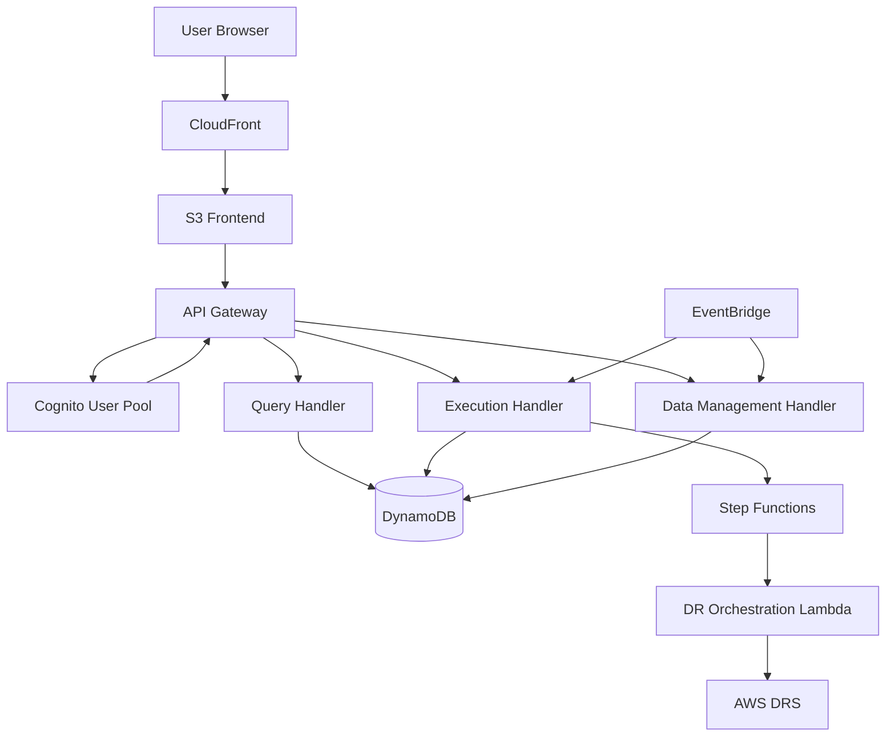
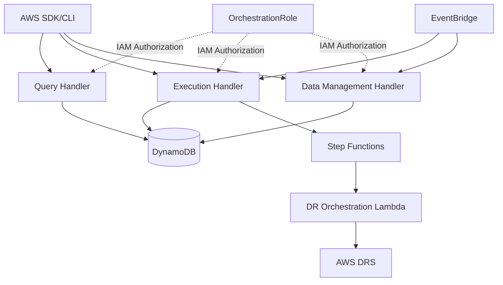
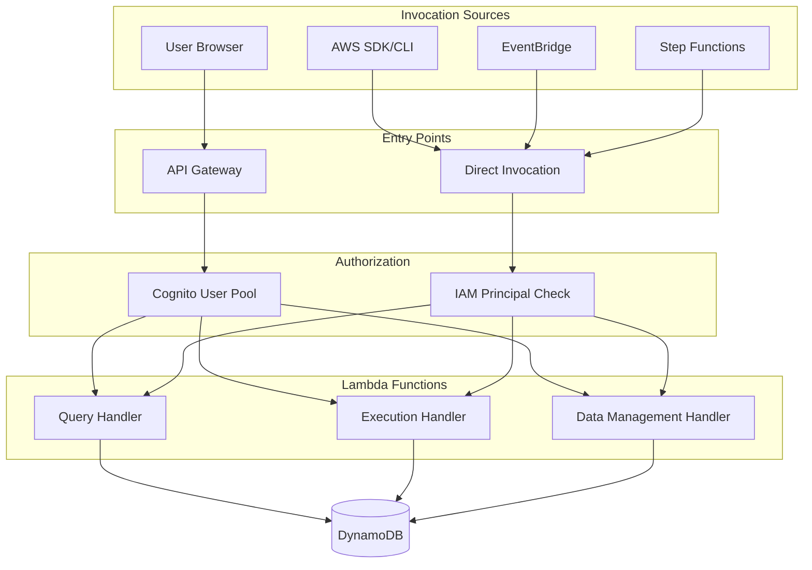

# Design Document: Direct Lambda Invocation Mode

## Overview

This design adds Direct Lambda Invocation Mode to the AWS DRS Orchestration Platform, enabling headless operation without API Gateway, Cognito, or frontend dependencies. The platform will support two deployment modes:

1. **Full Mode** (current): API Gateway + Cognito + Frontend + Lambda functions
2. **Headless Mode** (new): Lambda functions only with direct IAM-based invocation

Lambda functions will implement dual-mode support, detecting invocation patterns and responding appropriately. This enables infrastructure-as-code workflows, CI/CD pipelines, and programmatic disaster recovery operations.

### Key Design Principles

- **Backward Compatibility**: Existing API Gateway deployments continue working without changes
- **Dual-Mode Detection**: Lambda functions automatically detect invocation pattern (API Gateway vs direct)
- **IAM-Based Authorization**: Direct invocations use IAM principal validation instead of Cognito
- **Consistent Responses**: Both modes return data in predictable formats
- **Conditional Deployment**: CloudFormation parameters control which components are deployed

### Complete API Reference

For comprehensive documentation of all operations, request/response formats, AWS CLI examples, and Python boto3 examples, see:

**[API Reference Document](./api-reference.md)**

The API reference includes:
- 33 operations across all Lambda handlers
- Complete JSON request/response formats
- Error codes and troubleshooting
- AWS CLI and Python boto3 examples for every operation
- IAM policy requirements
- Migration guide from API Gateway to direct invocation
- Integration examples (Python scripts, Bash scripts, Terraform)

## Architecture

### Current Architecture (Full Mode)



### New Architecture (Headless Mode)



### Dual-Mode Architecture



## Components and Interfaces

### 1. Lambda Handler Invocation Detection

Each Lambda function implements a unified handler that detects invocation patterns:

```python
def lambda_handler(event, context):
    """
    Unified entry point supporting multiple invocation patterns.
    
    Invocation Patterns:
    1. API Gateway: event contains "requestContext"
    2. Direct Invocation: event contains "operation"
    3. Step Functions: event contains "action"
    4. EventBridge: event contains "source" = "aws.events"
    """
    if "requestContext" in event:
        # API Gateway invocation - extract Cognito user
        return handle_api_gateway_request(event, context)
    elif "operation" in event:
        # Direct invocation - validate IAM principal
        return handle_direct_invocation(event, context)
    elif "action" in event:
        # Step Functions action-based invocation
        return handle_action_invocation(event, context)
    elif event.get("source") == "aws.events":
        # EventBridge scheduled invocation
        return handle_scheduled_invocation(event, context)
    else:
        return {
            "error": "INVALID_INVOCATION",
            "message": "Event must contain 'requestContext', 'operation', 'action', or 'source'"
        }
```

### 2. Direct Invocation Event Format

#### Query Handler Operations

```json
{
  "operation": "list_protection_groups",
  "queryParams": {
    "limit": 50,
    "nextToken": "optional-pagination-token"
  }
}
```

```json
{
  "operation": "get_protection_group",
  "groupId": "pg-abc123"
}
```

```json
{
  "operation": "list_recovery_plans",
  "queryParams": {
    "status": "ACTIVE"
  }
}
```

```json
{
  "operation": "get_recovery_plan",
  "planId": "plan-xyz789"
}
```

```json
{
  "operation": "list_executions",
  "queryParams": {
    "status": "IN_PROGRESS",
    "limit": 20
  }
}
```

```json
{
  "operation": "get_execution",
  "executionId": "exec-123456"
}
```

```json
{
  "operation": "get_drs_source_servers",
  "queryParams": {
    "region": "us-east-1",
    "accountId": "123456789012"
  }
}
```

```json
{
  "operation": "get_target_accounts"
}
```

#### Execution Handler Operations

```json
{
  "operation": "start_execution",
  "planId": "plan-xyz789",
  "executionType": "DRILL",
  "dryRun": false
}
```

```json
{
  "operation": "cancel_execution",
  "executionId": "exec-123456",
  "reason": "User requested cancellation"
}
```

```json
{
  "operation": "pause_execution",
  "executionId": "exec-123456"
}
```

```json
{
  "operation": "resume_execution",
  "executionId": "exec-123456"
}
```

```json
{
  "operation": "terminate_instances",
  "executionId": "exec-123456"
}
```

```json
{
  "operation": "get_recovery_instances",
  "executionId": "exec-123456"
}
```

#### Data Management Handler Operations

```json
{
  "operation": "create_protection_group",
  "body": {
    "name": "Production Servers",
    "description": "Critical production workloads",
    "tags": {
      "Environment": "Production",
      "Application": "WebApp"
    }
  }
}
```

```json
{
  "operation": "update_protection_group",
  "groupId": "pg-abc123",
  "body": {
    "description": "Updated description",
    "tags": {
      "Environment": "Production",
      "Application": "WebApp",
      "Owner": "Platform Team"
    }
  }
}
```

```json
{
  "operation": "delete_protection_group",
  "groupId": "pg-abc123"
}
```

```json
{
  "operation": "create_recovery_plan",
  "body": {
    "name": "Production DR Plan",
    "description": "Disaster recovery for production",
    "protectionGroupId": "pg-abc123",
    "waves": [
      {
        "waveNumber": 1,
        "name": "Database Tier",
        "launchOrder": 1
      },
      {
        "waveNumber": 2,
        "name": "Application Tier",
        "launchOrder": 2
      }
    ]
  }
}
```

```json
{
  "operation": "update_recovery_plan",
  "planId": "plan-xyz789",
  "body": {
    "description": "Updated recovery plan",
    "waves": [
      {
        "waveNumber": 1,
        "name": "Database Tier",
        "launchOrder": 1
      }
    ]
  }
}
```

```json
{
  "operation": "delete_recovery_plan",
  "planId": "plan-xyz789"
}
```

### 3. IAM Principal Validation

Direct invocations validate the IAM principal from Lambda context:

```python
def validate_iam_principal(context):
    """
    Validate IAM principal for direct invocations.
    
    Args:
        context: Lambda context object
        
    Returns:
        Dict with authorization result
        
    Raises:
        AuthorizationError: If principal is not authorized
    """
    # Extract IAM principal from Lambda context
    invoked_function_arn = context.invoked_function_arn
    # Format: arn:aws:lambda:region:account:function:name
    
    # Get caller identity from context
    # Lambda context doesn't directly expose caller identity
    # We need to check if the function was invoked by OrchestrationRole
    
    # For direct invocations, the execution role is the caller
    # We validate by checking environment variables set by CloudFormation
    orchestration_role_arn = os.environ.get("ORCHESTRATION_ROLE_ARN")
    
    # In Lambda, we can't directly get the caller's role
    # Instead, we rely on Lambda resource-based policies
    # Only OrchestrationRole is granted lambda:InvokeFunction permission
    
    # If the invocation succeeded, the caller has permission
    # Log the invocation for audit purposes
    logger.info(f"Direct invocation from function ARN: {invoked_function_arn}")
    
    return {
        "authorized": True,
        "principal": "OrchestrationRole",  # Inferred from successful invocation
        "principalType": "IAM_ROLE"
    }
```

### 4. Response Format Handling

```python
def handle_direct_invocation(event, context):
    """
    Handle direct Lambda invocation.
    
    Returns data directly without API Gateway wrapping.
    """
    operation = event.get("operation")
    
    if operation == "list_protection_groups":
        groups = list_protection_groups_from_dynamodb()
        return {
            "protectionGroups": groups,
            "count": len(groups)
        }
    elif operation == "get_protection_group":
        group_id = event.get("groupId")
        if not group_id:
            return {
                "error": "MISSING_PARAMETER",
                "message": "groupId is required"
            }
        group = get_protection_group_from_dynamodb(group_id)
        if not group:
            return {
                "error": "NOT_FOUND",
                "message": f"Protection group {group_id} not found"
            }
        return group
    else:
        return {
            "error": "INVALID_OPERATION",
            "message": f"Operation '{operation}' is not supported",
            "supportedOperations": [
                "list_protection_groups",
                "get_protection_group",
                "create_protection_group",
                "update_protection_group",
                "delete_protection_group"
            ]
        }

def handle_api_gateway_request(event, context):
    """
    Handle API Gateway invocation.
    
    Returns API Gateway response format with statusCode, headers, body.
    """
    # Extract HTTP method and path
    method = event.get("httpMethod")
    path = event.get("path")
    
    # Route to appropriate handler
    if method == "GET" and path == "/protection-groups":
        groups = list_protection_groups_from_dynamodb()
        return response(200, {
            "protectionGroups": groups,
            "count": len(groups)
        })
    elif method == "GET" and "/protection-groups/" in path:
        group_id = event.get("pathParameters", {}).get("id")
        group = get_protection_group_from_dynamodb(group_id)
        if not group:
            return response(404, {
                "error": "NOT_FOUND",
                "message": f"Protection group {group_id} not found"
            })
        return response(200, group)
    else:
        return response(404, {
            "error": "NOT_FOUND",
            "message": f"No handler for {method} {path}"
        })
```

### 5. Audit Logging

```python
def log_invocation(event, context, invocation_type, result):
    """
    Log invocation for audit trail.
    
    Args:
        event: Lambda event
        context: Lambda context
        invocation_type: "API_GATEWAY" or "DIRECT"
        result: Operation result
    """
    if invocation_type == "API_GATEWAY":
        # Extract Cognito user from API Gateway authorizer
        user = get_user_from_event(event)
        principal = {
            "type": "COGNITO_USER",
            "userId": user.get("userId"),
            "email": user.get("email"),
            "username": user.get("username")
        }
    else:
        # Extract IAM principal from Lambda context
        principal = {
            "type": "IAM_ROLE",
            "arn": "OrchestrationRole",  # Inferred from successful invocation
            "accountId": context.invoked_function_arn.split(":")[4]
        }
    
    audit_log = {
        "timestamp": datetime.now(timezone.utc).isoformat(),
        "requestId": context.request_id,
        "invocationType": invocation_type,
        "principal": principal,
        "operation": event.get("operation") or f"{event.get('httpMethod')} {event.get('path')}",
        "result": "SUCCESS" if not result.get("error") else "ERROR",
        "errorMessage": result.get("error")
    }
    
    logger.info(json.dumps(audit_log))
```

## Data Models

### Direct Invocation Request

```python
@dataclass
class DirectInvocationRequest:
    """Direct Lambda invocation request."""
    operation: str
    query_params: Optional[Dict[str, Any]] = None
    body: Optional[Dict[str, Any]] = None
    resource_id: Optional[str] = None  # For operations on specific resources
    
    def validate(self):
        """Validate request parameters."""
        if not self.operation:
            raise ValueError("operation is required")
        
        # Validate operation-specific parameters
        if self.operation in ["get_protection_group", "update_protection_group", "delete_protection_group"]:
            if not self.resource_id:
                raise ValueError(f"{self.operation} requires resource_id (groupId)")
        
        if self.operation in ["create_protection_group", "update_protection_group", "create_recovery_plan", "update_recovery_plan"]:
            if not self.body:
                raise ValueError(f"{self.operation} requires body")
```

### Direct Invocation Response

```python
@dataclass
class DirectInvocationResponse:
    """Direct Lambda invocation response."""
    data: Optional[Dict[str, Any]] = None
    error: Optional[str] = None
    message: Optional[str] = None
    details: Optional[Dict[str, Any]] = None
    
    def to_dict(self):
        """Convert to dictionary for JSON serialization."""
        result = {}
        if self.data is not None:
            result.update(self.data)
        if self.error:
            result["error"] = self.error
        if self.message:
            result["message"] = self.message
        if self.details:
            result["details"] = self.details
        return result
```

### IAM Principal

```python
@dataclass
class IAMPrincipal:
    """IAM principal information for direct invocations."""
    principal_type: str  # "IAM_ROLE", "IAM_USER", "SERVICE"
    arn: str
    account_id: str
    role_name: Optional[str] = None
    user_name: Optional[str] = None
    
    def is_orchestration_role(self) -> bool:
        """Check if principal is OrchestrationRole."""
        return (
            self.principal_type == "IAM_ROLE" and
            self.role_name and
            "orchestration-role" in self.role_name.lower()
        )
```

## Correctness Properties


*A property is a characteristic or behavior that should hold true across all valid executions of a system—essentially, a formal statement about what the system should do. Properties serve as the bridge between human-readable specifications and machine-verifiable correctness guarantees.*

### Property 1: Invocation Mode Detection

*For any* Lambda event, if the event contains a "requestContext" field, then the system should route to API Gateway handler; if the event contains an "operation" field (and no "requestContext"), then the system should route to direct invocation handler; otherwise the system should return an invalid invocation error.

**Validates: Requirements 1.1, 1.2, 2.4, 2.5**

### Property 2: Cognito User Extraction

*For any* API Gateway event with valid Cognito claims, extracting user context should produce a user object containing email, userId, username, and groups fields.

**Validates: Requirements 1.3**

### Property 3: Response Format Consistency

*For any* operation result, if invoked via API Gateway mode, the response should be wrapped in API Gateway format (statusCode, headers, body); if invoked via direct mode, the response should be returned unwrapped as a plain dictionary.

**Validates: Requirements 1.5, 10.1, 10.2, 10.3, 10.4, 10.5, 10.6, 10.7**

### Property 4: Direct Invocation Event Validation

*For any* direct invocation event, if the event contains an "operation" field and all required parameters for that operation, then validation should succeed; if required parameters are missing, then validation should fail with a descriptive error.

**Validates: Requirements 2.1, 2.2, 2.3**

### Property 5: IAM Principal Authorization

*For any* direct invocation, if the IAM principal is OrchestrationRole (inferred from successful invocation), then all operations should be authorized; if the invocation fails due to Lambda resource policy, then the caller lacks permission.

**Validates: Requirements 3.2, 3.3**

### Property 6: Audit Log Completeness for Direct Invocations

*For any* direct invocation, the audit log should contain timestamp, requestId, invocationType="DIRECT", principal type and ARN, operation name, and result status.

**Validates: Requirements 3.4, 8.1, 8.2, 8.3, 8.4, 8.6**

### Property 7: Security Event Logging on Authorization Failure

*For any* authorization failure, a security event should be logged containing the IAM principal, attempted operation, and failure reason.

**Validates: Requirements 3.5, 8.5**

### Property 8: Query Handler Operation Routing

*For any* valid Query Handler operation name ("list_protection_groups", "get_protection_group", "list_recovery_plans", "get_recovery_plan", "list_executions", "get_execution", "get_drs_source_servers", "get_target_accounts"), invoking with that operation should route to the correct handler function and return appropriate data.

**Validates: Requirements 4.1, 4.2, 4.3, 4.4, 4.5, 4.6, 4.7, 4.8**

### Property 9: Query Handler Invalid Operation Rejection

*For any* invalid Query Handler operation name, the system should return an error with "INVALID_OPERATION" error code and a list of supported operations.

**Validates: Requirements 4.9**

### Property 10: Execution Handler Operation Routing

*For any* valid Execution Handler operation name ("start_execution", "cancel_execution", "pause_execution", "resume_execution", "terminate_instances", "get_recovery_instances"), invoking with that operation and required parameters should route to the correct handler function and perform the operation.

**Validates: Requirements 5.1, 5.2, 5.3, 5.4, 5.5, 5.6**

### Property 11: Execution Handler Invalid Operation Rejection

*For any* invalid Execution Handler operation name, the system should return an error with "INVALID_OPERATION" error code and a list of supported operations.

**Validates: Requirements 5.7**

### Property 12: Data Management Handler Operation Routing

*For any* valid Data Management Handler operation name ("create_protection_group", "update_protection_group", "delete_protection_group", "create_recovery_plan", "update_recovery_plan", "delete_recovery_plan"), invoking with that operation and required parameters should route to the correct handler function and perform the operation.

**Validates: Requirements 6.1, 6.2, 6.3, 6.4, 6.5, 6.6**

### Property 13: Data Management Handler Invalid Operation Rejection

*For any* invalid Data Management Handler operation name, the system should return an error with "INVALID_OPERATION" error code and a list of supported operations.

**Validates: Requirements 6.7**

### Property 14: Error Response Structure

*For any* error condition (missing parameters, invalid operation, authorization failure, DynamoDB error, DRS error), the error response should contain "error", "message", and optionally "details" fields in a consistent JSON structure.

**Validates: Requirements 9.1, 9.2, 9.3, 9.4, 9.5, 9.6, 9.7**

### Property 15: Backward Compatibility for API Gateway Invocations

*For any* existing API Gateway request pattern, after implementing direct invocation support, the request should be processed identically to before, with the same Cognito user extraction, RBAC checks, and response format.

**Validates: Requirements 12.1, 12.2, 12.3, 12.4**

### Property 16: Cross-Account Role Assumption

*For any* direct invocation specifying a target account ID, if the DRSOrchestrationRole exists in that account, then the system should successfully assume the role and use those credentials for DRS operations; if the role doesn't exist or assumption fails, then the system should return an error indicating the assume role failure.

**Validates: Requirements 13.1, 13.2, 13.3, 13.4**

### Property 17: Step Functions Action-Based Invocation Compatibility

*For any* Step Functions action-based event (containing "action" field), the Lambda function should process it identically regardless of whether API Gateway is deployed, maintaining the same state transitions and DRS operations.

**Validates: Requirements 14.1, 14.2, 14.3, 14.4**

### Property 18: EventBridge Scheduled Invocation Compatibility

*For any* EventBridge scheduled event (containing "source" = "aws.events"), the Lambda function should process it identically regardless of whether API Gateway is deployed, maintaining the same polling and monitoring behavior.

**Validates: Requirements 15.1, 15.2, 15.3**

## Error Handling

### Error Categories

1. **Invocation Errors**
   - Invalid event format (missing required fields)
   - Unknown invocation pattern
   - Malformed JSON

2. **Authorization Errors**
   - IAM principal not authorized (Lambda resource policy denial)
   - Missing required permissions
   - Cross-account role assumption failure

3. **Validation Errors**
   - Missing required parameters
   - Invalid parameter values
   - Invalid operation name

4. **Resource Errors**
   - Resource not found (protection group, recovery plan, execution)
   - Resource already exists (duplicate creation)
   - Resource in invalid state (cannot pause completed execution)

5. **AWS Service Errors**
   - DynamoDB errors (throttling, capacity exceeded)
   - DRS API errors (service unavailable, quota exceeded)
   - Step Functions errors (execution not found, invalid state)
   - STS errors (assume role failure)

### Error Response Format

All errors follow a consistent structure:

```json
{
  "error": "ERROR_CODE",
  "message": "Human-readable error message",
  "details": {
    "field": "specific field that caused error",
    "value": "invalid value",
    "constraint": "validation constraint that was violated"
  }
}
```

### Error Codes

- `INVALID_INVOCATION`: Event format is invalid
- `INVALID_OPERATION`: Operation name is not supported
- `MISSING_PARAMETER`: Required parameter is missing
- `INVALID_PARAMETER`: Parameter value is invalid
- `AUTHORIZATION_FAILED`: IAM principal is not authorized
- `NOT_FOUND`: Requested resource does not exist
- `ALREADY_EXISTS`: Resource with same identifier already exists
- `INVALID_STATE`: Resource is in invalid state for operation
- `DYNAMODB_ERROR`: DynamoDB operation failed
- `DRS_ERROR`: DRS API operation failed
- `STEP_FUNCTIONS_ERROR`: Step Functions operation failed
- `STS_ERROR`: STS assume role operation failed
- `INTERNAL_ERROR`: Unexpected internal error

### Error Handling Strategy

1. **Validation Errors**: Return immediately with 400-equivalent error
2. **Authorization Errors**: Log security event, return 403-equivalent error
3. **Resource Errors**: Return 404 or 409-equivalent error
4. **AWS Service Errors**: Log error details, return 500-equivalent error with sanitized message
5. **Internal Errors**: Log full stack trace, return 500-equivalent error with generic message

### Retry Guidance

Errors include retry guidance in the response:

```json
{
  "error": "DRS_ERROR",
  "message": "DRS service temporarily unavailable",
  "retryable": true,
  "retryAfter": 30
}
```

## Testing Strategy

### Dual Testing Approach

The testing strategy combines unit tests for specific scenarios and property-based tests for comprehensive coverage:

- **Unit Tests**: Verify specific examples, edge cases, and error conditions
- **Property Tests**: Verify universal properties across all inputs

### Unit Testing Focus

Unit tests validate:
- Specific invocation patterns (API Gateway event structure, direct invocation event structure)
- Error handling for specific error conditions
- Integration points with DynamoDB, DRS, Step Functions
- Edge cases (empty lists, missing optional parameters, boundary values)

### Property-Based Testing Focus

Property tests validate:
- Invocation mode detection across all possible event structures
- Operation routing for all supported operations
- Response format consistency across all operations and modes
- Error response structure across all error types
- Authorization logic across all IAM principals
- Audit logging completeness across all invocations

### Property Test Configuration

- **Library**: Python `hypothesis` for property-based testing
- **Iterations**: Minimum 100 iterations per property test
- **Tagging**: Each property test references its design document property
- **Tag Format**: `# Feature: direct-lambda-invocation-mode, Property N: [property text]`

### Test Organization

```
tests/
├── unit/
│   ├── test_query_handler_direct.py
│   ├── test_execution_handler_direct.py
│   ├── test_data_management_handler_direct.py
│   ├── test_invocation_detection.py
│   ├── test_iam_authorization.py
│   └── test_audit_logging.py
├── property/
│   ├── test_invocation_mode_detection_property.py
│   ├── test_operation_routing_property.py
│   ├── test_response_format_property.py
│   ├── test_error_handling_property.py
│   └── test_backward_compatibility_property.py
└── integration/
    ├── test_api_gateway_mode_integration.py
    ├── test_direct_mode_integration.py
    └── test_dual_mode_integration.py
```

### Example Property Test

```python
from hypothesis import given, strategies as st
import pytest

# Feature: direct-lambda-invocation-mode, Property 1: Invocation Mode Detection
@given(
    has_request_context=st.booleans(),
    has_operation=st.booleans(),
    has_action=st.booleans()
)
def test_invocation_mode_detection_property(has_request_context, has_operation, has_action):
    """
    Property: For any Lambda event, invocation mode detection should correctly
    identify the invocation pattern based on event structure.
    
    Validates: Requirements 1.1, 1.2, 2.4, 2.5
    """
    # Build event based on flags
    event = {}
    if has_request_context:
        event["requestContext"] = {"authorizer": {"claims": {}}}
    if has_operation:
        event["operation"] = "list_protection_groups"
    if has_action:
        event["action"] = "start_wave_recovery"
    
    # Detect invocation mode
    mode = detect_invocation_mode(event)
    
    # Verify correct mode detection
    if has_request_context:
        assert mode == "API_GATEWAY"
    elif has_operation:
        assert mode == "DIRECT"
    elif has_action:
        assert mode == "ACTION"
    else:
        assert mode == "INVALID"
```

### CloudFormation Template Testing

CloudFormation templates are validated using:
- `cfn-lint` for syntax and best practices
- `cfn_nag` for security issues
- Template validation with different parameter combinations
- Stack creation in test environment

### Integration Testing

Integration tests validate:
- End-to-end direct invocation workflows
- Cross-account operations with real AWS accounts
- Step Functions integration with direct invocation mode
- EventBridge scheduled invocations
- Backward compatibility with existing API Gateway deployments

### Test Coverage Goals

- **Unit Test Coverage**: >80% code coverage
- **Property Test Coverage**: All correctness properties implemented
- **Integration Test Coverage**: All major workflows tested end-to-end
- **CloudFormation Coverage**: All conditional deployment paths tested

## Implementation Notes

### Phase 1: Lambda Handler Updates

1. Update `query-handler/index.py`:
   - Add `handle_direct_invocation()` function
   - Add operation routing logic
   - Add IAM principal validation
   - Update audit logging

2. Update `execution-handler/index.py`:
   - Add `handle_direct_invocation()` function
   - Add operation routing logic
   - Add IAM principal validation
   - Update audit logging

3. Update `data-management-handler/index.py`:
   - Add `handle_direct_invocation()` function
   - Add operation routing logic
   - Add IAM principal validation
   - Update audit logging

### Phase 2: CloudFormation Updates

1. Update `cfn/master-template.yaml`:
   - Add `DeployApiGateway` parameter (default: "true")
   - Add conditions for API Gateway, Cognito, Frontend stacks
   - Update Lambda resource-based policies for direct invocation
   - Update OrchestrationRole with lambda:InvokeFunction permissions

2. Update `cfn/lambda-stack.yaml`:
   - Add Lambda resource-based policies for OrchestrationRole
   - Make API Gateway permissions conditional

3. Make API Gateway stacks conditional:
   - `cfn/api-gateway-core-stack.yaml`
   - `cfn/api-gateway-resources-stack.yaml`
   - `cfn/api-gateway-core-methods-stack.yaml`
   - `cfn/api-gateway-infrastructure-methods-stack.yaml`
   - `cfn/api-gateway-operations-methods-stack.yaml`
   - `cfn/api-gateway-deployment-stack.yaml`

4. Make Cognito stack conditional:
   - `cfn/api-auth-stack.yaml`

5. Make Frontend stack conditional:
   - `cfn/frontend-stack.yaml`

### Phase 3: Testing

1. Write unit tests for direct invocation handlers
2. Write property tests for correctness properties
3. Write integration tests for end-to-end workflows
4. Validate CloudFormation templates with both parameter values
5. Test backward compatibility with existing deployments

### Phase 4: Documentation

1. Create AWS CLI examples for all operations
2. Create Python boto3 examples for all operations
3. Document event format specifications
4. Document IAM policy requirements
5. Create migration guide from API Gateway to direct mode
6. Update deployment guide with new parameters

### Migration Path

For existing deployments:

1. **No Action Required**: Existing stacks continue working with `DeployApiGateway=true` (default)
2. **Gradual Adoption**: Deploy with `DeployApiGateway=true`, test direct invocations alongside API Gateway
3. **Full Migration**: Once validated, redeploy with `DeployApiGateway=false` to remove API Gateway, Cognito, and Frontend

### Rollback Strategy

If issues arise:
1. Redeploy with `DeployApiGateway=true` to restore API Gateway mode
2. Lambda functions continue supporting both modes, so no code changes needed
3. Existing API Gateway integrations continue working immediately

## Security Considerations

### IAM Resource-Based Policies

Lambda functions will have resource-based policies allowing invocation only from:
- API Gateway (when deployed)
- OrchestrationRole (always)
- Step Functions (always)
- EventBridge (always)

Example Lambda resource-based policy:

```json
{
  "Version": "2012-10-17",
  "Statement": [
    {
      "Effect": "Allow",
      "Principal": {
        "Service": "apigateway.amazonaws.com"
      },
      "Action": "lambda:InvokeFunction",
      "Resource": "arn:aws:lambda:region:account:function:query-handler",
      "Condition": {
        "ArnLike": {
          "AWS:SourceArn": "arn:aws:execute-api:region:account:api-id/*"
        }
      }
    },
    {
      "Effect": "Allow",
      "Principal": {
        "AWS": "arn:aws:iam::account:role/orchestration-role"
      },
      "Action": "lambda:InvokeFunction",
      "Resource": "arn:aws:lambda:region:account:function:query-handler"
    },
    {
      "Effect": "Allow",
      "Principal": {
        "Service": "states.amazonaws.com"
      },
      "Action": "lambda:InvokeFunction",
      "Resource": "arn:aws:lambda:region:account:function:query-handler"
    },
    {
      "Effect": "Allow",
      "Principal": {
        "Service": "events.amazonaws.com"
      },
      "Action": "lambda:InvokeFunction",
      "Resource": "arn:aws:lambda:region:account:function:query-handler"
    }
  ]
}
```

### Audit Trail

All direct invocations are logged with:
- IAM principal ARN
- Operation performed
- Parameters (sanitized)
- Result status
- Timestamp
- Request ID

Audit logs are written to CloudWatch Logs for compliance and security monitoring.

### Least Privilege

OrchestrationRole follows least privilege:
- Only granted permissions required for DRS orchestration
- Cross-account access limited to DRSOrchestrationRole in target accounts
- No permissions for IAM user/role creation or modification
- No permissions for account-level changes

### Defense in Depth

Multiple layers of security:
1. **Lambda Resource Policy**: Controls who can invoke functions
2. **IAM Execution Role**: Controls what functions can do
3. **Input Validation**: Sanitizes all user input
4. **Audit Logging**: Records all operations
5. **Error Sanitization**: Prevents information leakage in errors
