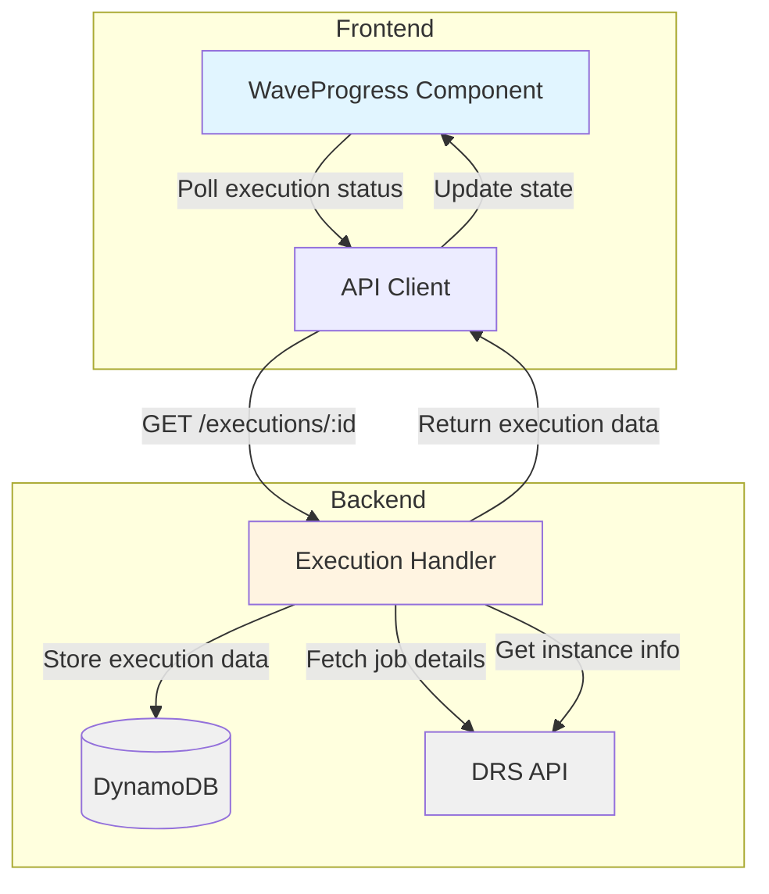
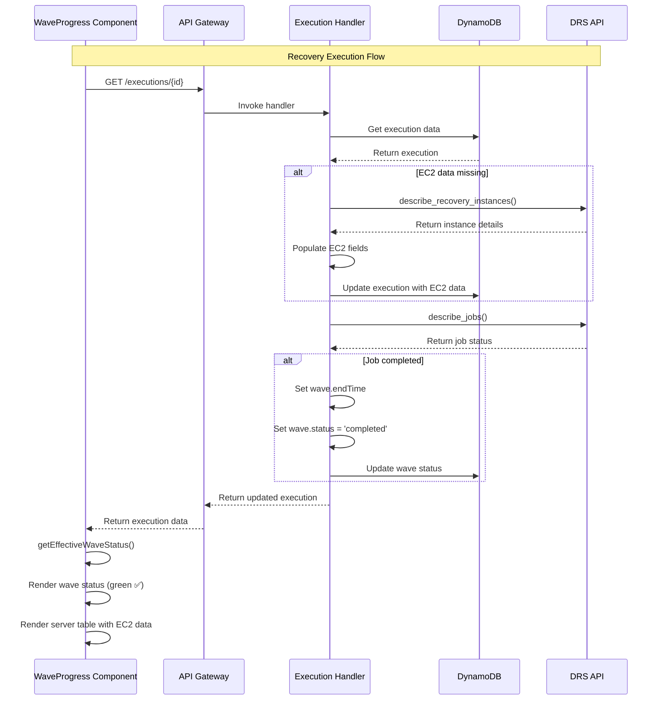

# Wave Completion Display - Design

## Overview

This design addresses three issues with the WaveProgress component after recovery completion:
1. Wave status indicator not updating to green when all waves complete
2. Missing EC2 instance information in the server table
3. Misleading "Server ID" column header that displays server names

## Solution Architecture

### High-Level Approach

We'll implement a phased solution:

**Phase 1: Frontend Quick Fixes** (Immediate)
- Fix column header label
- Enhance wave completion detection logic
- Add diagnostic logging

**Phase 2: Backend Timing Fix** (Follow-up)
- ✅ **VERIFIED**: Backend DOES populate EC2 data via DRS/EC2 APIs
- Fix timing issue where frontend polls before backend enrichment completes
- Ensure wave.endTime is set when wave completes
- Verify wave.status updates to 'completed'

**Phase 3: Comprehensive Fix** (Based on findings)
- Implement backend timing improvements
- Add frontend data refresh mechanism if needed
- Improve error handling

## Component Architecture



## Detailed Design

### 1. Column Header Fix

**File**: `frontend/src/components/WaveProgress.tsx`

**Current Code**:
```typescript
{
  id: 'serverId',
  header: 'Server ID',  // ❌ Misleading
  cell: (server: ServerExecution) => (
    <div className={styles.serverName}>
      {server.serverName || server.hostname || server.serverId}
    </div>
  ),
  sortingField: 'serverName',
}
```

**Updated Code**:
```typescript
{
  id: 'serverId',
  header: 'Server Name',  // ✅ Accurate
  cell: (server: ServerExecution) => (
    <div className={styles.serverName}>
      {server.serverName || server.hostname || server.serverId}
    </div>
  ),
  sortingField: 'serverName',
}
```

**Rationale**: The column displays server names (from EC2 Name tags), so the header should reflect that. This is a simple one-line change with no side effects.

### 2. Enhanced Wave Completion Detection

**File**: `frontend/src/components/WaveProgress.tsx`

**Current Logic** (`getEffectiveWaveStatus()` function):
```typescript
const getEffectiveWaveStatus = (wave: WaveExecution): string => {
  // 1. Check explicit wave status
  if (['completed', 'failed', 'cancelled'].includes(wave.status?.toLowerCase() || '')) {
    return wave.status.toLowerCase();
  }

  // 2. Check if all servers launched
  const allServersLaunched = wave.serverExecutions.every(
    server => server.launchStatus === 'LAUNCHED'
  );
  if (allServersLaunched && wave.serverExecutions.length > 0) {
    return 'completed';
  }

  // 3. Check for failures
  const anyServerFailed = wave.serverExecutions.some(
    server => server.launchStatus === 'FAILED' || server.status === 'failed'
  );
  if (anyServerFailed) {
    return 'failed';
  }

  // 4. Check job logs for completion
  if (wave.jobId && jobLogs[wave.jobId]) {
    const logs = jobLogs[wave.jobId];
    const launchEndEvents = logs.filter(log => log.event === 'LAUNCH_END');
    if (launchEndEvents.length === wave.serverExecutions.length) {
      return 'completed';
    }
  }

  // 5. Check for in-progress
  const anyServerInProgress = wave.serverExecutions.some(
    server => server.launchStatus === 'PENDING' || server.launchStatus === 'IN_PROGRESS'
  );
  if (anyServerInProgress) {
    return 'in_progress';
  }

  // 6. Map wave status
  return mapWaveStatus(wave.status);
};
```

**Enhanced Logic**:
```typescript
const getEffectiveWaveStatus = (wave: WaveExecution): string => {
  // 1. Check explicit wave status first
  if (['completed', 'failed', 'cancelled'].includes(wave.status?.toLowerCase() || '')) {
    console.log(`[WaveProgress] Wave ${wave.waveNumber} has explicit status: ${wave.status}`);
    return wave.status.toLowerCase();
  }

  // 2. NEW: Check if wave has endTime (authoritative completion signal)
  if (wave.endTime) {
    console.log(`[WaveProgress] Wave ${wave.waveNumber} has endTime: ${new Date(wave.endTime).toISOString()}`);
    
    // Verify all servers are in terminal state
    const allServersTerminal = wave.serverExecutions.every(
      server => ['LAUNCHED', 'FAILED', 'TERMINATED'].includes(server.launchStatus || '')
    );
    
    if (allServersTerminal) {
      // Check if any failed
      const anyFailed = wave.serverExecutions.some(
        server => server.launchStatus === 'FAILED' || server.status === 'failed'
      );
      
      const status = anyFailed ? 'failed' : 'completed';
      console.log(`[WaveProgress] Wave ${wave.waveNumber} completed with status: ${status}`);
      return status;
    }
  }

  // 3. Check if all servers launched successfully
  const allServersLaunched = wave.serverExecutions.every(
    server => server.launchStatus === 'LAUNCHED'
  );
  if (allServersLaunched && wave.serverExecutions.length > 0) {
    console.log(`[WaveProgress] Wave ${wave.waveNumber} - all ${wave.serverExecutions.length} servers launched`);
    return 'completed';
  }

  // 4. Check for failures
  const anyServerFailed = wave.serverExecutions.some(
    server => server.launchStatus === 'FAILED' || server.status === 'failed'
  );
  if (anyServerFailed) {
    console.log(`[WaveProgress] Wave ${wave.waveNumber} has failed servers`);
    return 'failed';
  }

  // 5. Check job logs for completion (if available)
  if (wave.jobId && jobLogs[wave.jobId]) {
    const logs = jobLogs[wave.jobId];
    const launchEndEvents = logs.filter(log => log.event === 'LAUNCH_END');
    const jobEndEvents = logs.filter(log => log.event === 'JOB_END');
    
    // JOB_END is authoritative completion signal
    if (jobEndEvents.length > 0) {
      console.log(`[WaveProgress] Wave ${wave.waveNumber} has JOB_END event in logs`);
      return 'completed';
    }
    
    // LAUNCH_END for all servers also indicates completion
    if (launchEndEvents.length === wave.serverExecutions.length && wave.serverExecutions.length > 0) {
      console.log(`[WaveProgress] Wave ${wave.waveNumber} has LAUNCH_END for all ${wave.serverExecutions.length} servers`);
      return 'completed';
    }
  }

  // 6. Check for in-progress
  const anyServerInProgress = wave.serverExecutions.some(
    server => ['PENDING', 'IN_PROGRESS', 'LAUNCHING'].includes(server.launchStatus || '')
  );
  if (anyServerInProgress) {
    return 'in_progress';
  }

  // 7. Map wave status as fallback
  const mappedStatus = mapWaveStatus(wave.status);
  console.log(`[WaveProgress] Wave ${wave.waveNumber} mapped status: ${mappedStatus} (from ${wave.status})`);
  return mappedStatus;
};
```

**Key Improvements**:
1. **Check `endTime` field**: If wave has `endTime` set, it's a strong signal that the wave completed
2. **Verify terminal states**: Ensure all servers are in terminal states (LAUNCHED, FAILED, TERMINATED)
3. **Check JOB_END event**: This is the authoritative completion signal from DRS
4. **Add diagnostic logging**: Track which condition triggers completion detection
5. **Handle more launch statuses**: Include 'LAUNCHING' in in-progress check

**Rationale**: The current logic may miss completion when:
- Backend sets `endTime` but not `status`
- Job logs show `JOB_END` but status field lags
- Wave status is "started" or "polling" but all servers finished

### 3. EC2 Data Availability Logging

**File**: `frontend/src/components/WaveProgress.tsx`

**Add logging in server table rendering**:

```typescript
const renderServerTable = (wave: WaveExecution) => {
  // Log EC2 data availability for debugging
  const serversWithEC2Data = wave.serverExecutions.filter(
    s => s.recoveredInstanceId && s.instanceType && s.privateIp
  );
  const serversWithoutEC2Data = wave.serverExecutions.filter(
    s => !s.recoveredInstanceId || !s.instanceType || !s.privateIp
  );
  
  if (serversWithoutEC2Data.length > 0) {
    console.log(`[WaveProgress] Wave ${wave.waveNumber} - ${serversWithoutEC2Data.length}/${wave.serverExecutions.length} servers missing EC2 data`);
    console.log('[WaveProgress] Servers missing EC2 data:', serversWithoutEC2Data.map(s => ({
      serverId: s.serverId,
      serverName: s.serverName,
      launchStatus: s.launchStatus,
      hasInstanceId: !!s.recoveredInstanceId,
      hasInstanceType: !!s.instanceType,
      hasPrivateIp: !!s.privateIp,
      hasLaunchTime: !!(s.launchTime || s.startTime),
    })));
  } else if (wave.serverExecutions.length > 0) {
    console.log(`[WaveProgress] Wave ${wave.waveNumber} - all ${wave.serverExecutions.length} servers have EC2 data`);
  }

  return (
    <Table
      columnDefinitions={serverColumnDefinitions}
      items={wave.serverExecutions}
      // ... rest of table props
    />
  );
};
```

**Rationale**: This logging will help us understand:
- How many servers are missing EC2 data
- Which specific fields are missing
- Whether the issue is backend data population or frontend display

### 4. Backend Timing Investigation

**File**: `lambda/execution-handler/index.py` (lines 7200-7280)

**✅ VERIFIED Findings**:

1. **DRS API Calls for Instance Information**
   - ✅ Handler DOES call `describe_recovery_instances()` filtered by sourceServerIDs
   - ✅ Handler DOES call `describe_instances()` for EC2 details
   - ✅ Data IS stored in DynamoDB during polling operations

2. **Wave Status Updates** (⚠️ NEEDS VERIFICATION)
   - ❓ Need to verify when handler sets `wave.status = 'completed'`
   - ❓ Need to verify if handler sets `wave.endTime`
   - ❓ Need to verify timing of these updates

3. **Server Execution Data Population**
   - ✅ `recoveredInstanceId`, `instanceType`, `privateIp`, `launchTime` ARE populated
   - ✅ Polling mechanism DOES update this data
   - ⚠️ **TIMING ISSUE**: Frontend may poll before backend enrichment completes

**Investigation Steps**:

```python
# Step 1: Review DRS API integration
# Look for calls to:
# - drs_client.describe_recovery_instances()
# - drs_client.describe_jobs()
# - drs_client.describe_job_log_items()

# Step 2: Review data storage
# Check DynamoDB update operations:
# - Are EC2 fields included in the update?
# - Is wave.endTime set when job completes?
# - Is wave.status updated to 'completed'?

# Step 3: Add logging
import logging
logger = logging.getLogger()
logger.setLevel(logging.INFO)

# Log when fetching instance details
logger.info(f"Fetching recovery instances for job {job_id}")
instances = drs_client.describe_recovery_instances(...)
logger.info(f"Found {len(instances)} recovery instances")

# Log EC2 data population
for server in server_executions:
    logger.info(f"Server {server['serverId']}: instanceId={server.get('recoveredInstanceId')}, type={server.get('instanceType')}")

# Log wave completion
if all_servers_launched:
    logger.info(f"Wave {wave_number} completed - setting endTime and status")
    wave['endTime'] = int(time.time() * 1000)
    wave['status'] = 'completed'
```

### 5. Data Flow Diagram



## Data Model Updates

### WaveExecution Interface

**Current**:
```typescript
interface WaveExecution {
  waveNumber: number;
  waveName?: string;
  status: string;
  jobId?: string;
  startTime?: number;
  endTime?: number;  // May not be set
  serverExecutions: ServerExecution[];
}
```

**Expected** (no changes needed, just ensure backend populates):
```typescript
interface WaveExecution {
  waveNumber: number;
  waveName?: string;
  status: string;           // Should be 'completed' when done
  jobId?: string;
  startTime?: number;
  endTime?: number;         // MUST be set when wave completes
  serverExecutions: ServerExecution[];
}
```

### ServerExecution Interface

**Current**:
```typescript
interface ServerExecution {
  serverId: string;
  serverName?: string;
  hostname?: string;
  launchStatus?: string;
  status?: string;
  
  // These may be missing:
  recoveredInstanceId?: string;
  instanceType?: string;
  privateIp?: string;
  region?: string;
  launchTime?: number;
  startTime?: number;
}
```

**Expected** (no changes needed, just ensure backend populates):
```typescript
interface ServerExecution {
  serverId: string;
  serverName?: string;
  hostname?: string;
  launchStatus?: string;    // Should be 'LAUNCHED' when done
  status?: string;
  
  // These MUST be populated after launch:
  recoveredInstanceId?: string;  // EC2 instance ID
  instanceType?: string;         // EC2 instance type
  privateIp?: string;            // Private IP address
  region?: string;               // AWS region
  launchTime?: number;           // Launch timestamp
  startTime?: number;            // Alternative timestamp
}
```

## Error Handling

### Missing EC2 Data

**Strategy**: Graceful degradation with user feedback

```typescript
const renderInstanceId = (server: ServerExecution) => {
  if (!server.recoveredInstanceId) {
    // Check if server is still launching
    if (server.launchStatus === 'PENDING' || server.launchStatus === 'IN_PROGRESS') {
      return <StatusIndicator type="loading">Launching...</StatusIndicator>;
    }
    
    // Check if server failed
    if (server.launchStatus === 'FAILED') {
      return <StatusIndicator type="error">Launch failed</StatusIndicator>;
    }
    
    // Data should be available but isn't
    console.warn(`[WaveProgress] Server ${server.serverId} launched but missing instance ID`);
    return <span title="Instance ID not available">—</span>;
  }
  
  // Show instance ID with link
  return (
    <Link
      external
      href={`https://console.aws.amazon.com/ec2/v2/home?region=${server.region || 'us-east-1'}#Instances:instanceId=${server.recoveredInstanceId}`}
    >
      {server.recoveredInstanceId}
    </Link>
  );
};
```

### Wave Status Uncertainty

**Strategy**: Show best available information with indicator

```typescript
const renderWaveStatus = (wave: WaveExecution) => {
  const effectiveStatus = getEffectiveWaveStatus(wave);
  
  // If status is uncertain, show indicator
  if (!wave.endTime && effectiveStatus === 'completed') {
    return (
      <StatusIndicator type="success">
        Completed
        <Popover
          header="Status Note"
          content="Wave appears complete based on server status. Waiting for final confirmation."
        >
          <Icon name="status-info" />
        </Popover>
      </StatusIndicator>
    );
  }
  
  return <StatusIndicator type={getStatusType(effectiveStatus)}>{effectiveStatus}</StatusIndicator>;
};
```

## Testing Strategy

### Unit Tests

**Test File**: `frontend/src/components/__tests__/WaveProgress.test.tsx`

```typescript
describe('getEffectiveWaveStatus', () => {
  it('should return completed when wave has endTime and all servers launched', () => {
    const wave: WaveExecution = {
      waveNumber: 1,
      status: 'started',
      endTime: Date.now(),
      serverExecutions: [
        { serverId: 's-1', launchStatus: 'LAUNCHED' },
        { serverId: 's-2', launchStatus: 'LAUNCHED' },
      ],
    };
    
    expect(getEffectiveWaveStatus(wave)).toBe('completed');
  });
  
  it('should return completed when all servers launched even without endTime', () => {
    const wave: WaveExecution = {
      waveNumber: 1,
      status: 'started',
      serverExecutions: [
        { serverId: 's-1', launchStatus: 'LAUNCHED' },
        { serverId: 's-2', launchStatus: 'LAUNCHED' },
      ],
    };
    
    expect(getEffectiveWaveStatus(wave)).toBe('completed');
  });
  
  it('should return completed when job logs show JOB_END event', () => {
    const wave: WaveExecution = {
      waveNumber: 1,
      status: 'started',
      jobId: 'job-123',
      serverExecutions: [
        { serverId: 's-1', launchStatus: 'LAUNCHED' },
      ],
    };
    
    const jobLogs = {
      'job-123': [
        { event: 'JOB_START', timestamp: 1000 },
        { event: 'LAUNCH_END', timestamp: 2000 },
        { event: 'JOB_END', timestamp: 3000 },
      ],
    };
    
    expect(getEffectiveWaveStatus(wave, jobLogs)).toBe('completed');
  });
  
  it('should return in_progress when servers are still launching', () => {
    const wave: WaveExecution = {
      waveNumber: 1,
      status: 'started',
      serverExecutions: [
        { serverId: 's-1', launchStatus: 'LAUNCHED' },
        { serverId: 's-2', launchStatus: 'PENDING' },
      ],
    };
    
    expect(getEffectiveWaveStatus(wave)).toBe('in_progress');
  });
});

describe('Server table rendering', () => {
  it('should display EC2 instance information when available', () => {
    const server: ServerExecution = {
      serverId: 's-1',
      serverName: 'web-server-01',
      launchStatus: 'LAUNCHED',
      recoveredInstanceId: 'i-0abc123',
      instanceType: 't3.medium',
      privateIp: '10.0.1.45',
      launchTime: 1707656400000,
    };
    
    const { getByText } = render(<ServerTable servers={[server]} />);
    
    expect(getByText('i-0abc123')).toBeInTheDocument();
    expect(getByText('t3.medium')).toBeInTheDocument();
    expect(getByText('10.0.1.45')).toBeInTheDocument();
  });
  
  it('should show placeholder when EC2 data is missing', () => {
    const server: ServerExecution = {
      serverId: 's-1',
      serverName: 'web-server-01',
      launchStatus: 'LAUNCHED',
      // No EC2 data
    };
    
    const { getAllByText } = render(<ServerTable servers={[server]} />);
    
    const placeholders = getAllByText('—');
    expect(placeholders.length).toBeGreaterThan(0);
  });
});
```

### Integration Tests

**Test Scenarios**:

1. **Complete Recovery Flow**
   - Start recovery
   - Wait for all servers to launch
   - Verify wave status updates to green
   - Verify EC2 data appears in table

2. **Partial Failure**
   - Start recovery
   - Simulate one server failure
   - Verify wave status shows failed
   - Verify successful servers show EC2 data

3. **Slow EC2 Data Population**
   - Start recovery
   - Servers launch but EC2 data delayed
   - Verify placeholders shown initially
   - Verify data appears after backend updates

### Manual Testing Checklist

- [ ] Start a recovery plan with multiple waves
- [ ] Wait for all waves to complete
- [ ] Verify wave status indicators turn green ✅
- [ ] Verify "Completed" badge appears
- [ ] Verify overall progress shows 100%
- [ ] Verify server table shows Instance ID
- [ ] Verify Instance ID links to AWS Console
- [ ] Verify Instance Type is displayed
- [ ] Verify Private IP is displayed
- [ ] Verify Launch Time is displayed
- [ ] Verify column header says "Server Name"
- [ ] Check browser console for diagnostic logs
- [ ] Test with single-wave recovery plan
- [ ] Test with multi-wave recovery plan
- [ ] Test with failed servers

## Performance Considerations

### Polling Frequency

**Current**: Poll every 5 seconds during execution

**Recommendation**: Continue polling for 30 seconds after completion to allow EC2 data to populate

```typescript
useEffect(() => {
  if (!executionId) return;
  
  const pollInterval = 5000; // 5 seconds
  const postCompletionPolls = 6; // 30 seconds after completion
  let pollsAfterCompletion = 0;
  
  const poll = async () => {
    const data = await fetchExecutionStatus(executionId);
    setExecutionData(data);
    
    // Check if execution is complete
    const allWavesComplete = data.waves.every(
      wave => getEffectiveWaveStatus(wave) === 'completed'
    );
    
    if (allWavesComplete) {
      pollsAfterCompletion++;
      
      if (pollsAfterCompletion >= postCompletionPolls) {
        console.log('[WaveProgress] Stopping polling - execution complete and EC2 data stable');
        clearInterval(intervalId);
      }
    } else {
      pollsAfterCompletion = 0; // Reset if not complete
    }
  };
  
  const intervalId = setInterval(poll, pollInterval);
  poll(); // Initial poll
  
  return () => clearInterval(intervalId);
}, [executionId]);
```

**Rationale**: This gives the backend time to fetch and populate EC2 data after servers launch, while avoiding infinite polling.

### API Response Size

**Current**: Full execution data returned on each poll

**Optimization** (future): Consider incremental updates or delta responses

```typescript
// Future optimization: Only return changed data
GET /executions/{id}?since={lastUpdateTimestamp}

// Response includes only updated waves/servers
{
  "executionId": "...",
  "lastUpdate": 1707656400000,
  "updates": {
    "waves": [
      {
        "waveNumber": 1,
        "endTime": 1707656400000,
        "status": "completed"
      }
    ],
    "servers": [
      {
        "serverId": "s-1",
        "recoveredInstanceId": "i-0abc123",
        "instanceType": "t3.medium"
      }
    ]
  }
}
```

## Security Considerations

### AWS Console Links

**Current**: Links to EC2 console with instance ID

**Security Check**: Ensure region parameter is validated

```typescript
const getConsoleLink = (instanceId: string, region?: string) => {
  // Validate region format
  const validRegion = region && /^[a-z]{2}-[a-z]+-\d+$/.test(region) 
    ? region 
    : 'us-east-1';
  
  // Use template literal with validated inputs
  return `https://console.aws.amazon.com/ec2/v2/home?region=${validRegion}#Instances:instanceId=${instanceId}`;
};
```

### Data Exposure

**Consideration**: Server table shows private IP addresses

**Mitigation**: This is acceptable because:
- User must be authenticated to view
- Private IPs are not sensitive (internal only)
- User needs this information to access recovered instances

## Rollback Plan

If the changes cause issues:

1. **Revert column header change**: Change back to "Server ID"
2. **Revert wave status logic**: Remove `endTime` check and additional logging
3. **Remove diagnostic logging**: Clean up console.log statements
4. **Deploy previous version**: Use git revert to restore previous code

**Rollback Command**:
```bash
git revert HEAD
./scripts/deploy.sh test --frontend-only
```

## Success Metrics

### Functional Metrics
- Wave status updates to green within 30 seconds of completion: 100%
- EC2 data appears within 1 minute of launch: 95%+
- Column headers accurately describe content: 100%

### Technical Metrics
- No console errors related to wave status: 100%
- Diagnostic logs provide useful debugging information: Yes
- Polling stops within 30 seconds of completion: 100%

### User Experience Metrics
- Users can quickly identify completed recoveries: Yes
- Users can access EC2 instance details: Yes
- Users understand what data is displayed: Yes

## Future Enhancements

### Real-time Updates
- Implement WebSocket connection for instant updates
- Eliminate polling delay
- Reduce API calls

### Enhanced Server Information
- Show public IP address (if available)
- Show security groups
- Show subnet information
- Show EBS volume details

### Historical Data
- Store completed recovery details
- Allow viewing past recoveries
- Compare recovery times across executions

### Custom Columns
- Allow users to show/hide columns
- Save column preferences
- Export server data to CSV

## References

- CloudScape Table Component: https://cloudscape.design/components/table/
- CloudScape StatusIndicator: https://cloudscape.design/components/status-indicator/
- DRS API Reference: https://docs.aws.amazon.com/drs/latest/APIReference/
- React useEffect Hook: https://react.dev/reference/react/useEffect

## Appendix: Code Locations

### Frontend Files
- `frontend/src/components/WaveProgress.tsx` - Main component (1211 lines)
- `frontend/src/components/WaveProgress.module.css` - Component styles
- `frontend/src/types/execution.ts` - TypeScript interfaces
- `frontend/src/api/executions.ts` - API client

### Backend Files
- `lambda/execution-handler/index.py` - Execution status handler
- `lambda/execution-handler/drs_utils.py` - DRS API utilities
- `cfn/lambda-functions.yaml` - Lambda function definitions

### Test Files
- `frontend/src/components/__tests__/WaveProgress.test.tsx` - Component tests
- `tests/unit/test_execution_handler.py` - Backend unit tests
- `tests/integration/test_recovery_flow.py` - Integration tests
