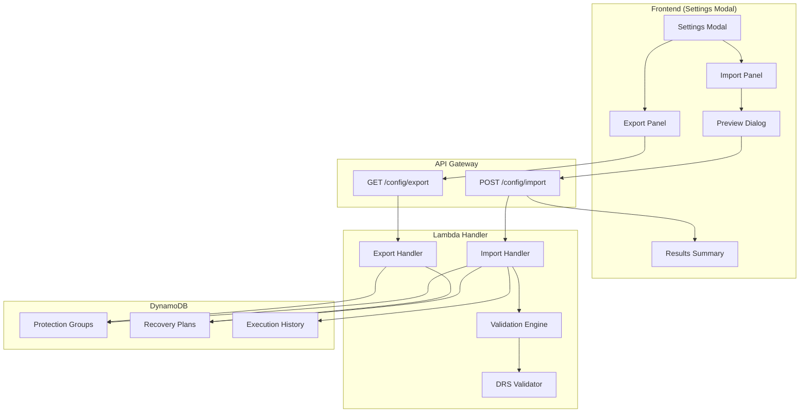
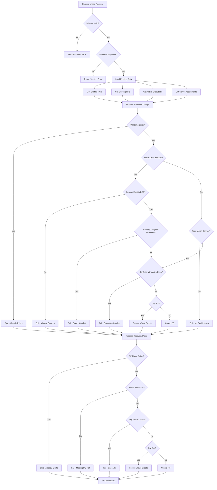

# Design Document: Configuration Export/Import

## Overview

This feature adds the ability to export and import the complete DRS Orchestration configuration (Protection Groups, Recovery Plans, and Launch Settings) via JSON files. The feature is accessed through the Settings gear icon in the top navigation bar, with corresponding API endpoints for CLI/automation use.

## Architecture



## Components and Interfaces

### Frontend Components

#### SettingsModal Component
New modal component triggered by the Settings gear icon in TopNavigation.

```typescript
interface SettingsModalProps {
  visible: boolean;
  onDismiss: () => void;
}

// Tabs: Export | Import
// Export tab: Export button, loading state, error display
// Import tab: File picker, preview, confirm, results
```

#### ConfigExportPanel Component
Handles export functionality within Settings modal.

```typescript
interface ConfigExportPanelProps {
  onExportComplete: () => void;
  onError: (error: string) => void;
}
```

#### ConfigImportPanel Component
Handles import functionality with preview and confirmation.

```typescript
interface ConfigImportPanelProps {
  onImportComplete: (results: ImportResults) => void;
  onError: (error: string) => void;
}

interface ImportPreview {
  protectionGroups: { total: number; new: number; existing: number };
  recoveryPlans: { total: number; new: number; existing: number };
  schemaVersion: string;
  exportedAt: string;
  sourceRegion: string;
}
```

#### ImportResultsDialog Component
Displays detailed import results with created, skipped, and failed resources.

```typescript
interface ImportResults {
  success: boolean;
  summary: {
    protectionGroups: { created: number; skipped: number; failed: number };
    recoveryPlans: { created: number; skipped: number; failed: number };
  };
  created: ResourceResult[];
  skipped: ResourceResult[];
  failed: ResourceResult[];
}

interface ResourceResult {
  type: 'ProtectionGroup' | 'RecoveryPlan';
  name: string;
  reason?: string;
  details?: Record<string, any>;
}
```

### API Endpoints

#### GET /config/export
Returns complete configuration as JSON.

**Response:**
```json
{
  "metadata": {
    "schemaVersion": "1.0",
    "exportedAt": "2024-12-13T10:30:00Z",
    "sourceRegion": "us-east-1",
    "exportedBy": "user@example.com"
  },
  "protectionGroups": [...],
  "recoveryPlans": [...]
}
```

#### POST /config/import
Imports configuration from JSON body.

**Request:**
```json
{
  "dryRun": false,
  "config": {
    "metadata": {...},
    "protectionGroups": [...],
    "recoveryPlans": [...]
  }
}
```

**Response:**
```json
{
  "success": true,
  "dryRun": false,
  "correlationId": "uuid",
  "summary": {...},
  "created": [...],
  "skipped": [...],
  "failed": [...]
}
```

### Backend Handler Functions

#### export_configuration()
```python
def export_configuration(region: str, user_email: str) -> dict:
    """
    Export all Protection Groups and Recovery Plans.
    Returns complete configuration with metadata.
    """
```

#### import_configuration()
```python
def import_configuration(
    config: dict, 
    region: str, 
    dry_run: bool = False
) -> ImportResults:
    """
    Import configuration with validation.
    Non-destructive, additive-only operation.
    """
```

#### validate_protection_group()
```python
def validate_protection_group(
    pg: dict, 
    existing_pgs: dict,
    existing_servers: set,
    active_execution_servers: set,
    drs_client
) -> ValidationResult:
    """
    Validate a Protection Group can be imported.
    Checks: name conflicts, server existence, server assignments, execution conflicts.
    """
```

## Data Models

### Export Schema (v1.0)

Based on actual DynamoDB data model from `lambda/index.py`:

```json
{
  "$schema": "http://json-schema.org/draft-07/schema#",
  "type": "object",
  "required": ["metadata", "protectionGroups", "recoveryPlans"],
  "properties": {
    "metadata": {
      "type": "object",
      "required": ["schemaVersion", "exportedAt", "sourceRegion"],
      "properties": {
        "schemaVersion": { "type": "string", "const": "1.0" },
        "exportedAt": { "type": "string", "format": "date-time" },
        "sourceRegion": { "type": "string" },
        "exportedBy": { "type": "string" }
      }
    },
    "protectionGroups": {
      "type": "array",
      "items": { "$ref": "#/definitions/ProtectionGroup" }
    },
    "recoveryPlans": {
      "type": "array",
      "items": { "$ref": "#/definitions/RecoveryPlan" }
    }
  },
  "definitions": {
    "ProtectionGroup": {
      "type": "object",
      "required": ["GroupName", "Region"],
      "properties": {
        "GroupName": { "type": "string", "maxLength": 64 },
        "Description": { "type": "string" },
        "Region": { "type": "string" },
        "AccountId": { "type": "string" },
        "Owner": { "type": "string" },
        "SourceServerIds": { 
          "type": "array", 
          "items": { "type": "string" },
          "description": "Explicit server IDs (mutually exclusive with ServerSelectionTags)"
        },
        "ServerSelectionTags": { 
          "type": "object",
          "additionalProperties": { "type": "string" },
          "description": "Tag-based selection (mutually exclusive with SourceServerIds)"
        },
        "LaunchConfig": { "$ref": "#/definitions/LaunchConfig" }
      }
    },
    "RecoveryPlan": {
      "type": "object",
      "required": ["PlanName", "Waves"],
      "properties": {
        "PlanName": { "type": "string", "maxLength": 64 },
        "Description": { "type": "string" },
        "Waves": { "type": "array", "items": { "$ref": "#/definitions/Wave" } }
      }
    },
    "Wave": {
      "type": "object",
      "required": ["WaveNumber", "ProtectionGroupName"],
      "properties": {
        "WaveNumber": { "type": "integer", "minimum": 1 },
        "ProtectionGroupName": { "type": "string" },
        "PauseBeforeWave": { "type": "boolean", "default": false }
      }
    },
    "LaunchConfig": {
      "type": "object",
      "properties": {
        "launchDisposition": { "type": "string", "enum": ["STOPPED", "STARTED"] },
        "copyPrivateIp": { "type": "boolean" },
        "copyTags": { "type": "boolean" },
        "targetInstanceTypeRightSizingMethod": { "type": "string", "enum": ["NONE", "BASIC", "IN_AWS"] },
        "ec2LaunchTemplateID": { "type": "string" },
        "SecurityGroupIds": { "type": "array", "items": { "type": "string" } },
        "SubnetId": { "type": "string" },
        "IamInstanceProfileArn": { "type": "string" }
      }
    }
  }
}
```

### Import Processing Flow



## Correctness Properties

*A property is a characteristic or behavior that should hold true across all valid executions of a system-essentially, a formal statement about what the system should do. Properties serve as the bridge between human-readable specifications and machine-verifiable correctness guarantees.*

### Property 1: Export Round-Trip Consistency
*For any* set of Protection Groups and Recovery Plans in the database, exporting and then importing (to an empty system) should produce an equivalent configuration.
**Validates: Requirements 1.1, 1.2, 3.2, 3.3**

### Property 2: Export Completeness
*For any* Protection Group in the database, the export output should contain that Protection Group with all its fields (Name, Region, SourceServerIds or ServerSelectionTags, LaunchConfig).
**Validates: Requirements 1.3, 1.4, 1.5**

### Property 3: Export Metadata Presence
*For any* export operation, the output should contain metadata with schemaVersion, exportedAt timestamp, and sourceRegion.
**Validates: Requirements 1.6, 7.1**

### Property 4: Import Idempotency
*For any* valid configuration, importing it twice should result in the same final state as importing it once (second import skips all resources).
**Validates: Requirements 3.2, 3.3**

### Property 5: Import Non-Destructiveness
*For any* import operation, all pre-existing Protection Groups and Recovery Plans should remain unchanged after import completes.
**Validates: Requirements 5.1**

### Property 6: Server Validation Completeness
*For any* explicit-server Protection Group in an import, if any SourceServerId does not exist in DRS, the Protection Group should be in the failed results with those specific server IDs listed.
**Validates: Requirements 3.4, 3.5, 8.4**

### Property 7: Tag Validation Completeness
*For any* tag-based Protection Group in an import, if the tags match zero servers, the Protection Group should be in the failed results with the tag details.
**Validates: Requirements 3.6, 8.5**

### Property 8: Cascade Failure Propagation
*For any* Recovery Plan that references a Protection Group that failed import, that Recovery Plan should also be in the failed results with cascade reason.
**Validates: Requirements 5.4, 8.2**

### Property 9: Dry Run Isolation
*For any* import with dryRun=true, the database should have zero new records after the operation completes.
**Validates: Requirements 6.3, 6.4**

### Property 10: Schema Version Validation
*For any* import with an unsupported schemaVersion, the operation should fail with an error listing supported versions.
**Validates: Requirements 7.2, 7.3**

### Property 11: Results Summary Accuracy
*For any* import operation, the sum of (created + skipped + failed) counts should equal the total number of resources in the import file.
**Validates: Requirements 3.7, 8.3**

## Error Handling

### Export Errors
| Error | HTTP Status | Response |
|-------|-------------|----------|
| Database read failure | 500 | `{"error": "Failed to read configuration", "details": "..."}` |
| Serialization error | 500 | `{"error": "Failed to serialize configuration", "details": "..."}` |

### Import Errors
| Error | HTTP Status | Response |
|-------|-------------|----------|
| Invalid JSON | 400 | `{"error": "Invalid JSON format", "details": "..."}` |
| Schema validation failed | 400 | `{"error": "Schema validation failed", "details": [...]}` |
| Unsupported schema version | 400 | `{"error": "Unsupported schema version", "supportedVersions": ["1.0"]}` |
| Partial failure | 200 | Full results with failed array populated |

### Error Response Structure
```json
{
  "type": "ProtectionGroup",
  "name": "web-servers",
  "reason": "SERVER_NOT_FOUND",
  "details": {
    "missingServerIds": ["s-abc123", "s-def456"],
    "region": "us-east-1"
  }
}
```

## Testing Strategy

### Unit Tests
- Export handler serialization
- Import handler validation logic
- Schema validation
- Filename generation

### Property-Based Tests
Use Hypothesis (Python) for backend property tests:
- Round-trip consistency (Property 1)
- Export completeness (Property 2)
- Import idempotency (Property 4)
- Non-destructiveness (Property 5)
- Dry run isolation (Property 9)
- Results accuracy (Property 11)

### Integration Tests
- Full export/import cycle with DynamoDB
- DRS server validation with mocked DRS client
- Active execution conflict detection

### E2E Tests (Playwright)
- Settings modal opens from gear icon
- Export downloads file
- Import file picker and preview
- Import results display
