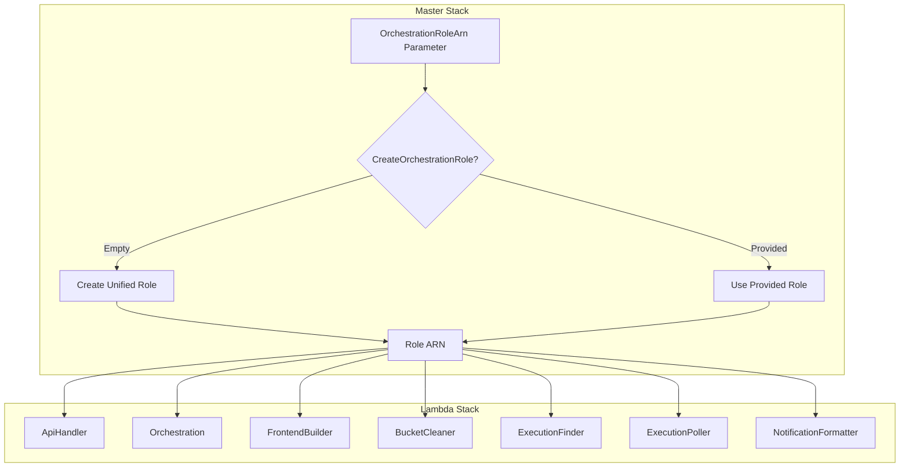

# Design Document

## Introduction

This document describes the technical design for implementing deployment flexibility features in the AWS DRS Orchestration Solution. The key changes are:

1. **Unified Orchestration Role**: Master stack creates a single role (consolidating 7 individual roles) OR uses an externally provided role
2. **Optional Frontend**: DeployFrontend parameter to skip frontend resources

**Benefits:**
- **Simpler architecture**: 1 role instead of 7
- **Full backward compatibility**: Default deployment works unchanged
- **HRP integration**: HRP can provide its own role for direct Lambda invocation
- **Smaller templates**: ~500 lines removed from lambda-stack.yaml

## CloudFormation Best Practices Validation

All design patterns have been validated against AWS CloudFormation documentation (January 2026):

| Pattern | AWS Documentation | Status |
|---------|-------------------|--------|
| Conditional resource creation with `Condition:` attribute | [Conditions syntax](https://docs.aws.amazon.com/AWSCloudFormation/latest/UserGuide/conditions-section-structure.html) | ✅ Validated |
| Conditional outputs with `Condition:` attribute | [Associate conditions with outputs](https://docs.aws.amazon.com/AWSCloudFormation/latest/UserGuide/conditions-section-structure.html#associate-conditions-with-outputs) | ✅ Validated |
| `Fn::If` for conditional parameter values | [Condition functions](https://docs.aws.amazon.com/AWSCloudFormation/latest/TemplateReference/intrinsic-function-reference-conditions.html) | ✅ Validated |
| Single IAM role for multiple Lambda functions | [Lambda IAM samples](https://github.com/aws-cloudformation/aws-cloudformation-templates) | ✅ Validated |
| `AWS::NoValue` for conditional property removal | [Pseudo parameters](https://docs.aws.amazon.com/AWSCloudFormation/latest/UserGuide/pseudo-parameter-reference.html) | ✅ Validated |

### Key Findings

1. **Condition attribute on resources**: CloudFormation creates the resource only when the condition evaluates to true
2. **Condition attribute on outputs**: CloudFormation creates the output only when the associated condition evaluates to true
3. **Fn::If in nested stack parameters**: Fully supported for passing conditional values
4. **Shared IAM roles**: AWS samples show single role used by multiple Lambda functions - this is a valid pattern
5. **Dependent resources**: If a resource with a condition isn't created, any resources that depend on it aren't created either

## Design Overview

### Architecture



### Deployment Modes

| OrchestrationRoleArn | DeployFrontend | Result |
|---------------------|----------------|--------|
| empty (default) | true (default) | **Current behavior** - Creates unified role + full frontend |
| empty | false | Creates unified role, API-only |
| provided | true | Uses HRP role + full frontend |
| provided | false | Uses HRP role, API-only (full HRP integration) |

## Detailed Design

### Component 1: Master Template Parameters

Add/modify parameters in `master-template.yaml`:

```yaml
Parameters:
  OrchestrationRoleArn:
    Type: String
    Default: ''
    Description: >-
      Optional ARN of an existing orchestration role for all Lambda functions.
      If empty (default), the stack creates a unified role with all required permissions.
      If provided (e.g., from HRP), all Lambdas use that role instead.
    AllowedPattern: '^(arn:aws:iam::[0-9]{12}:role/.+)?$'
    ConstraintDescription: Must be a valid IAM role ARN or empty

  DeployFrontend:
    Type: String
    Default: 'true'
    AllowedValues:
      - 'true'
      - 'false'
    Description: >-
      Set to 'false' to skip frontend deployment (S3, CloudFront, frontend-builder).
      Use 'false' for API-only deployments or HRP integration.
```

### Component 2: Master Template Conditions

Add conditions to `master-template.yaml`:

```yaml
Conditions:
  CreateOrchestrationRole: !Equals [!Ref OrchestrationRoleArn, '']
  DeployFrontendCondition: !Equals [!Ref DeployFrontend, 'true']
```

### Component 3: Unified Orchestration Role (in Master Template)

Add the unified role resource to `master-template.yaml` with condition:

```yaml
Resources:
  # =============================================================================
  # UNIFIED ORCHESTRATION ROLE
  # Only created when OrchestrationRoleArn parameter is empty
  # Consolidates permissions from all 7 Lambda functions
  # =============================================================================
  UnifiedOrchestrationRole:
    Type: AWS::IAM::Role
    Condition: CreateOrchestrationRole
    Properties:
      RoleName: !Sub "${ProjectName}-orchestration-role-${Environment}"
      AssumeRolePolicyDocument:
        Version: "2012-10-17"
        Statement:
          - Effect: Allow
            Principal:
              Service: lambda.amazonaws.com
            Action: sts:AssumeRole
      ManagedPolicyArns:
        - arn:aws:iam::aws:policy/service-role/AWSLambdaBasicExecutionRole
      Policies:
        # All consolidated policies here (see full policy list below)
```

### Component 4: Lambda Stack Parameter Passing

Update LambdaStack resource in `master-template.yaml`:

```yaml
LambdaStack:
  Type: AWS::CloudFormation::Stack
  Properties:
    TemplateURL: !Sub 'https://${DeploymentBucket}.s3.amazonaws.com/cfn/lambda-stack.yaml'
    Parameters:
      # ... existing parameters ...
      OrchestrationRoleArn: !If
        - CreateOrchestrationRole
        - !GetAtt UnifiedOrchestrationRole.Arn
        - !Ref OrchestrationRoleArn
```

### Component 5: Lambda Stack Simplification

Update `lambda-stack.yaml`:

```yaml
Parameters:
  OrchestrationRoleArn:
    Type: String
    Description: "ARN of the orchestration role for all Lambda functions (passed from master stack)"

Resources:
  # REMOVED: All 7 IAM role definitions
  # - ApiHandlerRole
  # - OrchestrationRole  
  # - CustomResourceRole
  # - BucketCleanerRole
  # - ExecutionFinderRole
  # - ExecutionPollerRole
  # - NotificationFormatterRole

  # All Lambda functions now use the passed role
  ApiHandlerFunction:
    Type: AWS::Lambda::Function
    Properties:
      Role: !Ref OrchestrationRoleArn
      # ... rest unchanged ...

  OrchestrationStepFunctionsFunction:
    Type: AWS::Lambda::Function
    Properties:
      Role: !Ref OrchestrationRoleArn
      # ... rest unchanged ...

  # ... same for all 7 Lambda functions ...
```

### Component 6: Conditional Frontend Stack

Update `master-template.yaml` FrontendStack resource:

```yaml
FrontendStack:
  Type: AWS::CloudFormation::Stack
  Condition: DeployFrontendCondition
  Properties:
    TemplateURL: !Sub 'https://${DeploymentBucket}.s3.amazonaws.com/cfn/frontend-stack.yaml'
    Parameters:
      # ... existing parameters ...
```

### Component 7: Conditional Outputs

Update `master-template.yaml` outputs:

```yaml
Outputs:
  # Always output
  ApiEndpoint:
    Description: API Gateway endpoint URL
    Value: !GetAtt ApiGatewayStack.Outputs.ApiEndpoint

  OrchestrationRoleArn:
    Description: ARN of the orchestration role used by all Lambda functions
    Value: !If
      - CreateOrchestrationRole
      - !GetAtt UnifiedOrchestrationRole.Arn
      - !Ref OrchestrationRoleArn

  # Conditional frontend outputs
  CloudFrontUrl:
    Condition: DeployFrontendCondition
    Description: CloudFront distribution URL
    Value: !GetAtt FrontendStack.Outputs.CloudFrontUrl

  CloudFrontDistributionId:
    Condition: DeployFrontendCondition
    Description: CloudFront distribution ID
    Value: !GetAtt FrontendStack.Outputs.CloudFrontDistributionId

  FrontendBucketName:
    Condition: DeployFrontendCondition
    Description: Frontend S3 bucket name
    Value: !GetAtt FrontendStack.Outputs.FrontendBucketName
```

## IAM Reference Document Analysis

Analysis of `DRS_IAM_AND_PERMISSIONS_REFERENCE.md` against current lambda-stack.yaml roles (January 2026):

### Permissions Validation

| Permission | Reference Doc | Current Status |
|------------|---------------|----------------|
| `drs:CreateRecoveryInstanceForDrs` | Critical for DRS recovery | ✅ Present in ApiHandlerRole, OrchestrationRole |
| `ec2:CreateLaunchTemplateVersion` | Common failure point | ✅ Present in ApiHandlerRole, OrchestrationRole |
| `ec2:ModifyLaunchTemplate` | Required for DRS | ✅ Present in ApiHandlerRole, OrchestrationRole |
| `ec2:GetLaunchTemplateData` | Required for DRS | ✅ Present in ApiHandlerRole |
| `drs:DescribeRecoverySnapshots` | Required for monitoring | ✅ Present in ApiHandlerRole, OrchestrationRole |
| `states:SendTaskSuccess` | Step Functions callback | ✅ Present in ApiHandlerRole |
| `states:SendTaskFailure` | Step Functions callback | ✅ Present in ApiHandlerRole |
| `states:SendTaskHeartbeat` | Long-running task heartbeat | ❌ **MISSING - ADD TO UNIFIED ROLE** |
| `drs:StartFailbackLaunch` | Failback operations | ✅ Present in ApiHandlerRole |

### Required Addition for Unified Role

The `states:SendTaskHeartbeat` permission must be added to the unified orchestration role. This permission is needed for long-running Step Functions tasks to send heartbeat signals and prevent timeout during extended DRS recovery operations.

```yaml
- PolicyName: StepFunctionsAccess
  PolicyDocument:
    Version: "2012-10-17"
    Statement:
      - Effect: Allow
        Action:
          - states:StartExecution
          - states:DescribeExecution
          - states:ListExecutions
          - states:SendTaskSuccess
          - states:SendTaskFailure
          - states:SendTaskHeartbeat  # ADD THIS - prevents timeout on long operations
        Resource:
          - !Sub "arn:${AWS::Partition}:states:${AWS::Region}:${AWS::AccountId}:stateMachine:${ProjectName}-*"
          - !Sub "arn:${AWS::Partition}:states:${AWS::Region}:${AWS::AccountId}:execution:${ProjectName}-*:*"
```

### Minor Inconsistency (Not a Bug)

OrchestrationRole uses `drs:StartFailback` while ApiHandlerRole uses `drs:StartFailbackLaunch`. Both are valid DRS actions - `StartFailbackLaunch` is the newer API name. The unified role should include both for compatibility.

## Implementation Documentation Analysis

Analysis of implementation documentation in `infra/orchestration/drs-orchestration/docs/implementation/` to identify any additional permissions needed for the unified orchestration role (January 2026):

### Documents Analyzed

| Document | Purpose | Permissions Impact |
|----------|---------|-------------------|
| `DRS_ALLOW_LAUNCHING_INTO_THIS_INSTANCE_RESEARCH.md` | Pre-provisioned instance recovery | No new permissions needed |
| `DRS_REPLICATION_SETTINGS_MANAGEMENT.md` | Replication drift detection | No new permissions needed |
| `FEATURES.md` | Comprehensive feature list | No new permissions needed |
| `DRS_CROSS_ACCOUNT_REFERENCE.md` | Cross-account operations | No new permissions needed |

### Pre-Provisioned Instance Support

The AllowLaunchingIntoThisInstance feature enables recovery into pre-provisioned EC2 instances (preserving IP address last octet). Required permissions:

| Permission | Status | Notes |
|------------|--------|-------|
| `ec2:DescribeInstances` with tag filters | ✅ Present | In EC2Access policy |
| `drs:UpdateLaunchConfiguration` with `launchIntoInstanceProperties` | ✅ Present | In DRSWriteAccess policy |

**Conclusion**: No additional permissions needed for pre-provisioned instance support.

### Replication Settings Management

Configuration drift detection and remediation for DRS replication settings. Required permissions:

| Permission | Status | Notes |
|------------|--------|-------|
| `drs:DescribeReplicationConfigurationTemplates` | ✅ Present | In DRSReadAccess policy |
| `drs:UpdateReplicationConfiguration` | ✅ Present | In DRSWriteAccess policy |
| `ec2:DescribeSecurityGroups` | ✅ Present | In EC2Access policy |
| `ec2:DescribeSubnets` | ✅ Present | In EC2Access policy |

**Conclusion**: No additional permissions needed for replication settings management.

### Cross-Account Operations

Cross-account DRS operations for multi-account environments. Required permissions:

| Permission | Status | Notes |
|------------|--------|-------|
| `sts:AssumeRole` | ✅ Present | In STSAccess policy |
| `kms:CreateGrant` (cross-account) | ✅ Present | In KMSAccess policy |
| `kms:DescribeKey` (cross-account) | ✅ Present | In KMSAccess policy |

**Conclusion**: No additional permissions needed for cross-account operations.

### Summary of Implementation Docs Analysis

**Result**: The current IAM role definitions already include all permissions required by the implementation documentation. The only missing permission identified is `states:SendTaskHeartbeat` from the IAM Reference Document Analysis (previous section).

**Final Unified Role Requirements**:
- All existing permissions from the 7 individual roles ✅
- Add `states:SendTaskHeartbeat` for long-running Step Functions tasks ❌ (must add)
- Include both `drs:StartFailback` and `drs:StartFailbackLaunch` for compatibility ✅

## Unified Role Policies

The unified role consolidates all permissions from the 7 individual roles:

### Policy Summary

| Policy Name | Source Roles | Purpose | Critical Permissions |
|-------------|--------------|---------|---------------------|
| DynamoDBAccess | ApiHandler, Orchestration, ExecutionFinder, ExecutionPoller | Table operations | dynamodb:GetItem, PutItem, Query, Scan |
| StepFunctionsAccess | ApiHandler | Start/describe executions | **states:SendTaskHeartbeat** (CRITICAL - prevents timeout) |
| DRSReadAccess | ApiHandler, Orchestration, ExecutionPoller | Describe operations | drs:DescribeSourceServers, DescribeJobs, DescribeRecoverySnapshots |
| DRSWriteAccess | ApiHandler, Orchestration | Recovery, configuration | **drs:CreateRecoveryInstanceForDrs** (CRITICAL), StartRecovery, UpdateLaunchConfiguration |
| EC2Access | ApiHandler, Orchestration | Instance, volume, launch template ops | **ec2:CreateLaunchTemplateVersion** (CRITICAL), DescribeInstances, CreateTags |
| IAMAccess | ApiHandler, Orchestration | PassRole for DRS | iam:PassRole, GetInstanceProfile, ListRoles |
| STSAccess | ApiHandler, Orchestration | Cross-account assume role | sts:AssumeRole |
| KMSAccess | ApiHandler | Encrypted EBS volumes | kms:DescribeKey, CreateGrant, ListAliases |
| CloudFormationAccess | ApiHandler, CustomResource, BucketCleaner | Stack operations | cloudformation:DescribeStacks, CreateStack, UpdateStack |
| S3Access | CustomResource, BucketCleaner | Frontend bucket operations | s3:GetObject, PutObject, ListBucket |
| CloudFrontAccess | CustomResource | Cache invalidation | cloudfront:CreateInvalidation |
| LambdaInvokeAccess | ApiHandler, ExecutionFinder | Cross-function invocation | lambda:InvokeFunction |
| EventBridgeAccess | ApiHandler | Schedule rule management | events:PutRule, PutTargets, DeleteRule |
| SSMAccess | Orchestration | Automation execution | ssm:StartAutomationExecution, **ssm:CreateOpsItem** (operational visibility) |
| SNSAccess | Orchestration, NotificationFormatter | Publish notifications | sns:Publish |
| CloudWatchAccess | ExecutionPoller | Put metrics | cloudwatch:PutMetricData, GetMetricStatistics |

### Critical Permissions Added (From Requirements Analysis)

The following permissions were identified as CRITICAL through IAM reference documentation analysis and MUST be included in the unified role:

1. **states:SendTaskHeartbeat** - Prevents timeout on long-running DRS operations (Step Functions callbacks)
2. **drs:CreateRecoveryInstanceForDrs** - Prevents AccessDeniedException during recovery operations
3. **ec2:CreateLaunchTemplateVersion** - Prevents UnauthorizedOperation failures during launch template updates
4. **ssm:CreateOpsItem** - Enables OpsCenter items for automation tracking and operational visibility

### Future-Ready Permissions (Agent Management)

The unified role includes permissions for future enhanced features (agent installation, failback operations):

- **drs:GetAgentInstallationAssetsForDrs** - Download agent installation files
- **drs:IssueAgentCertificateForDrs** - Issue agent authentication certificates
- **drs:CreateSourceServerForDrs** - Create source server entries during agent installation

These permissions are included now to avoid future role updates when agent management features are implemented.

### Full Policy Definitions

The unified role consolidates all 17 policy statements from the original 7 roles. Below are the complete policy definitions:

#### 1. DynamoDBAccess Policy
**Source Roles:** ApiHandler, Orchestration, ExecutionFinder, ExecutionPoller  
**Purpose:** Table operations for execution state and metadata

```yaml
- PolicyName: DynamoDBAccess
  PolicyDocument:
    Version: "2012-10-17"
    Statement:
      - Effect: Allow
        Action:
          - dynamodb:GetItem
          - dynamodb:PutItem
          - dynamodb:UpdateItem
          - dynamodb:DeleteItem
          - dynamodb:Query
          - dynamodb:Scan
          - dynamodb:BatchGetItem
          - dynamodb:BatchWriteItem
        Resource:
          - !Sub "arn:${AWS::Partition}:dynamodb:${AWS::Region}:${AWS::AccountId}:table/${ProjectName}-*"
```

#### 2. StepFunctionsAccess Policy (UPDATED)
**Source Roles:** ApiHandler  
**Purpose:** Start/describe executions and send task callbacks  
**CRITICAL UPDATE:** Added `states:SendTaskHeartbeat` for long-running DRS operations

```yaml
- PolicyName: StepFunctionsAccess
  PolicyDocument:
    Version: "2012-10-17"
    Statement:
      - Effect: Allow
        Action:
          - states:StartExecution
          - states:DescribeExecution
          - states:ListExecutions
          - states:SendTaskSuccess
          - states:SendTaskFailure
          - states:SendTaskHeartbeat  # CRITICAL - prevents timeout on long-running operations
        Resource:
          - !Sub "arn:${AWS::Partition}:states:${AWS::Region}:${AWS::AccountId}:stateMachine:${ProjectName}-*"
          - !Sub "arn:${AWS::Partition}:states:${AWS::Region}:${AWS::AccountId}:execution:${ProjectName}-*:*"
```

#### 3. DRSReadAccess Policy
**Source Roles:** ApiHandler, Orchestration, ExecutionPoller  
**Purpose:** Query DRS resources and configurations

```yaml
- PolicyName: DRSReadAccess
  PolicyDocument:
    Version: "2012-10-17"
    Statement:
      - Effect: Allow
        Action:
          - drs:DescribeSourceServers
          - drs:DescribeRecoverySnapshots
          - drs:DescribeRecoveryInstances
          - drs:DescribeJobs
          - drs:DescribeJobLogItems
          - drs:GetLaunchConfiguration
          - drs:GetReplicationConfiguration
          - drs:GetFailbackReplicationConfiguration
          - drs:DescribeLaunchConfigurationTemplates
          - drs:DescribeReplicationConfigurationTemplates
          - drs:ListLaunchActions
          - drs:ListTagsForResource
        Resource: "*"
```

#### 4. DRSWriteAccess Policy (UPDATED)
**Source Roles:** ApiHandler, Orchestration  
**Purpose:** Recovery operations and configuration updates  
**CRITICAL UPDATE:** Includes `drs:CreateRecoveryInstanceForDrs` and future agent management permissions

```yaml
- PolicyName: DRSWriteAccess
  PolicyDocument:
    Version: "2012-10-17"
    Statement:
      - Effect: Allow
        Action:
          - drs:StartRecovery
          - drs:CreateRecoveryInstanceForDrs  # CRITICAL - prevents AccessDeniedException
          - drs:TerminateRecoveryInstances
          - drs:DisconnectRecoveryInstance
          - drs:StartFailbackLaunch
          - drs:StartFailback  # Compatibility with older API
          - drs:StopFailback
          - drs:ReverseReplication
          - drs:UpdateLaunchConfiguration
          - drs:UpdateReplicationConfiguration
          - drs:UpdateFailbackReplicationConfiguration
          - drs:PutLaunchAction
          - drs:DeleteLaunchAction
          - drs:TagResource
          - drs:UntagResource
          # Future enhanced features - agent management
          - drs:GetAgentInstallationAssetsForDrs
          - drs:IssueAgentCertificateForDrs
          - drs:CreateSourceServerForDrs
        Resource: "*"
```

#### 5. EC2Access Policy (UPDATED)
**Source Roles:** ApiHandler, Orchestration  
**Purpose:** Instance, volume, and launch template operations  
**CRITICAL UPDATE:** Includes `ec2:CreateLaunchTemplateVersion` for pre-provisioned instances

```yaml
- PolicyName: EC2Access
  PolicyDocument:
    Version: "2012-10-17"
    Statement:
      - Effect: Allow
        Action:
          - ec2:DescribeInstances
          - ec2:DescribeInstanceStatus
          - ec2:DescribeInstanceTypes
          - ec2:DescribeInstanceAttribute
          - ec2:DescribeVolumes
          - ec2:DescribeSnapshots
          - ec2:DescribeImages
          - ec2:DescribeSecurityGroups
          - ec2:DescribeSubnets
          - ec2:DescribeVpcs
          - ec2:DescribeAvailabilityZones
          - ec2:DescribeAccountAttributes
          - ec2:CreateTags
          - ec2:DescribeTags
          - ec2:CreateLaunchTemplateVersion  # CRITICAL - prevents UnauthorizedOperation
          - ec2:DescribeLaunchTemplates
          - ec2:DescribeLaunchTemplateVersions
          - ec2:ModifyLaunchTemplate
        Resource: "*"
```

#### 6. IAMAccess Policy
**Source Roles:** ApiHandler, Orchestration  
**Purpose:** PassRole for DRS and EC2 operations

```yaml
- PolicyName: IAMAccess
  PolicyDocument:
    Version: "2012-10-17"
    Statement:
      - Effect: Allow
        Action:
          - iam:PassRole
          - iam:GetInstanceProfile
          - iam:ListInstanceProfiles
          - iam:ListRoles
        Resource: "*"
        Condition:
          StringEquals:
            iam:PassedToService:
              - drs.amazonaws.com
              - ec2.amazonaws.com
```

#### 7. STSAccess Policy
**Source Roles:** ApiHandler, Orchestration  
**Purpose:** Cross-account role assumption

```yaml
- PolicyName: STSAccess
  PolicyDocument:
    Version: "2012-10-17"
    Statement:
      - Effect: Allow
        Action:
          - sts:AssumeRole
        Resource:
          - !Sub "arn:${AWS::Partition}:iam::*:role/${ProjectName}-cross-account-*"
```

#### 8. KMSAccess Policy
**Source Roles:** ApiHandler  
**Purpose:** Encrypted EBS volume operations

```yaml
- PolicyName: KMSAccess
  PolicyDocument:
    Version: "2012-10-17"
    Statement:
      - Effect: Allow
        Action:
          - kms:DescribeKey
          - kms:ListAliases
          - kms:CreateGrant
        Resource: "*"
        Condition:
          StringEquals:
            kms:ViaService:
              - !Sub "ec2.${AWS::Region}.amazonaws.com"
              - !Sub "drs.${AWS::Region}.amazonaws.com"
```

#### 9. CloudFormationAccess Policy
**Source Roles:** ApiHandler, CustomResource, BucketCleaner  
**Purpose:** Stack operations for infrastructure management

```yaml
- PolicyName: CloudFormationAccess
  PolicyDocument:
    Version: "2012-10-17"
    Statement:
      - Effect: Allow
        Action:
          - cloudformation:DescribeStacks
          - cloudformation:DescribeStackEvents
          - cloudformation:DescribeStackResource
          - cloudformation:DescribeStackResources
          - cloudformation:ListStacks
        Resource: "*"
```

#### 10. S3Access Policy
**Source Roles:** CustomResource, BucketCleaner  
**Purpose:** Frontend bucket operations

```yaml
- PolicyName: S3Access
  PolicyDocument:
    Version: "2012-10-17"
    Statement:
      - Effect: Allow
        Action:
          - s3:GetObject
          - s3:PutObject
          - s3:DeleteObject
          - s3:ListBucket
        Resource:
          - !Sub "arn:${AWS::Partition}:s3:::${ProjectName}-*"
          - !Sub "arn:${AWS::Partition}:s3:::${ProjectName}-*/*"
```

#### 11. CloudFrontAccess Policy
**Source Roles:** CustomResource  
**Purpose:** Cache invalidation for frontend deployments

```yaml
- PolicyName: CloudFrontAccess
  PolicyDocument:
    Version: "2012-10-17"
    Statement:
      - Effect: Allow
        Action:
          - cloudfront:CreateInvalidation
          - cloudfront:GetInvalidation
          - cloudfront:ListInvalidations
        Resource: "*"
```

#### 12. LambdaInvokeAccess Policy
**Source Roles:** ApiHandler, ExecutionFinder  
**Purpose:** Cross-function invocation

```yaml
- PolicyName: LambdaInvokeAccess
  PolicyDocument:
    Version: "2012-10-17"
    Statement:
      - Effect: Allow
        Action:
          - lambda:InvokeFunction
        Resource:
          - !Sub "arn:${AWS::Partition}:lambda:${AWS::Region}:${AWS::AccountId}:function:${ProjectName}-*"
```

#### 13. EventBridgeAccess Policy
**Source Roles:** ApiHandler  
**Purpose:** Schedule rule management for automated operations

```yaml
- PolicyName: EventBridgeAccess
  PolicyDocument:
    Version: "2012-10-17"
    Statement:
      - Effect: Allow
        Action:
          - events:PutRule
          - events:DeleteRule
          - events:DescribeRule
          - events:EnableRule
          - events:DisableRule
          - events:PutTargets
          - events:RemoveTargets
        Resource:
          - !Sub "arn:${AWS::Partition}:events:${AWS::Region}:${AWS::AccountId}:rule/${ProjectName}-*"
```

#### 14. SSMAccess Policy (UPDATED)
**Source Roles:** Orchestration  
**Purpose:** Automation execution and operational tracking  
**CRITICAL UPDATE:** Added `ssm:CreateOpsItem` for automation tracking

```yaml
- PolicyName: SSMAccess
  PolicyDocument:
    Version: "2012-10-17"
    Statement:
      - Effect: Allow
        Action:
          - ssm:DescribeDocument
          - ssm:DescribeInstanceInformation
          - ssm:SendCommand
          - ssm:StartAutomationExecution
          - ssm:ListDocuments
          - ssm:ListCommandInvocations
          - ssm:GetParameter
          - ssm:PutParameter
          - ssm:GetDocument
          - ssm:GetAutomationExecution
          - ssm:CreateOpsItem  # CRITICAL - enables OpsItems for automation tracking
        Resource: "*"
```

#### 15. SNSAccess Policy
**Source Roles:** Orchestration, NotificationFormatter  
**Purpose:** Publish notifications for execution events

```yaml
- PolicyName: SNSAccess
  PolicyDocument:
    Version: "2012-10-17"
    Statement:
      - Effect: Allow
        Action:
          - sns:Publish
        Resource:
          - !Sub "arn:${AWS::Partition}:sns:${AWS::Region}:${AWS::AccountId}:${ProjectName}-*"
```

#### 16. CloudWatchAccess Policy
**Source Roles:** ExecutionPoller  
**Purpose:** Custom metrics for monitoring

```yaml
- PolicyName: CloudWatchAccess
  PolicyDocument:
    Version: "2012-10-17"
    Statement:
      - Effect: Allow
        Action:
          - cloudwatch:PutMetricData
          - cloudwatch:GetMetricStatistics
        Resource: "*"
```

#### 17. CloudWatchLogsAccess (Managed Policy)
**Source:** AWS Managed Policy  
**Purpose:** Lambda function logging

```yaml
ManagedPolicyArns:
  - arn:aws:iam::aws:policy/service-role/AWSLambdaBasicExecutionRole
```

**Note:** The AWSLambdaBasicExecutionRole managed policy provides CloudWatch Logs permissions (logs:CreateLogGroup, logs:CreateLogStream, logs:PutLogEvents)

### Permission Updates Summary

Three critical permissions were added based on IAM reference documentation analysis:

1. **states:SendTaskHeartbeat** - Prevents timeout on long-running Step Functions tasks during extended DRS recovery operations
2. **ssm:CreateOpsItem** - Enables OpsCenter items for automation tracking and operational visibility
3. **drs:CreateRecoveryInstanceForDrs** - Internal DRS operation that prevents AccessDeniedException during recovery

All other permissions are consolidated from existing roles with no changes.

## Deployment Workflows

### Workflow 1: Default Standalone (Unchanged)

```bash
# Same command as today - creates unified role + full frontend
./scripts/deploy.sh dev
```

### Workflow 2: API-Only Standalone

```bash
./scripts/deploy.sh dev --parameter-overrides DeployFrontend=false
```

### Workflow 3: HRP Integration with Frontend

```bash
./scripts/deploy.sh dev \
  --parameter-overrides OrchestrationRoleArn=arn:aws:iam::123456789012:role/HRPOrchestrationRole
```

### Workflow 4: Full HRP Integration (API-Only)

```bash
./scripts/deploy.sh dev \
  --parameter-overrides \
    OrchestrationRoleArn=arn:aws:iam::123456789012:role/HRPOrchestrationRole \
    DeployFrontend=false
```

## Migration Path

### For Existing Deployments

**No migration required!** The default behavior is preserved:
- OrchestrationRoleArn defaults to empty → creates unified role
- DeployFrontend defaults to 'true' → deploys frontend

When you update an existing stack:
1. CloudFormation creates the new unified role
2. Updates all Lambda functions to use the unified role
3. Deletes the 7 individual roles (after Lambda updates complete)

This is a seamless in-place update.

## Testing Strategy

### Unit Tests

1. **Template Validation**
   - Validate master-template.yaml with cfn-lint
   - Validate lambda-stack.yaml with cfn-lint
   - Verify condition logic

2. **Parameter Validation**
   - Test OrchestrationRoleArn pattern matching
   - Test DeployFrontend allowed values

### Integration Tests

1. **Default Deployment**
   - Deploy with no parameter overrides
   - Verify unified role created
   - Verify all Lambda functions work
   - Verify frontend deployed

2. **API-Only Deployment**
   - Deploy with DeployFrontend=false
   - Verify no frontend resources
   - Verify API works

3. **External Role Deployment**
   - Deploy with OrchestrationRoleArn provided
   - Verify no role created
   - Verify Lambdas use provided role

4. **Update Scenarios**
   - Update from current 7-role deployment
   - Verify seamless migration

## Security Considerations

### Unified Role Trade-offs

**Pros:**
- Single role to audit and manage
- Consistent permissions across all functions
- Easier to update permissions
- Cleaner CloudFormation template

**Cons:**
- Each Lambda has more permissions than strictly needed (least privilege relaxed at function level)
- Blast radius is larger if role is compromised

**Mitigation:**
- Resource-level restrictions where possible (table names, bucket names)
- Condition keys for service-specific access (KMS via service)
- Regular permission audits
- Role is still scoped to this application's resources

## Implementation Order

1. **Phase 1**: Add unified role to master-template.yaml (with condition)
2. **Phase 2**: Add parameters and conditions to master-template.yaml
3. **Phase 3**: Simplify lambda-stack.yaml (remove 7 roles, add parameter)
4. **Phase 4**: Add conditional frontend deployment
5. **Phase 5**: Add conditional outputs
6. **Phase 6**: Testing and validation
7. **Phase 7**: Documentation updates
