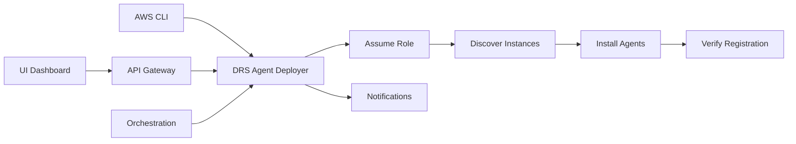

# DRS Agent Deployment Guide

## Overview

The DRS Agent Deployer automates the installation of AWS Elastic Disaster Recovery agents across multiple AWS accounts. It discovers EC2 instances with DR tags and deploys agents via SSM, supporting cross-account orchestration.

## Features

- **Auto-Discovery**: Finds instances tagged with `dr:enabled=true` AND `dr:recovery-strategy=drs`
- **Cross-Account**: Assumes roles in target accounts for multi-account deployments
- **Wave-Based**: Groups instances by `dr:wave` tag for organized deployment
- **SSM Integration**: Uses AWS Systems Manager for agent installation
- **Status Monitoring**: Tracks deployment progress and DRS registration
- **Multiple Invocation Methods**: API, UI, Lambda, or CLI

## Architecture



## Invocation Methods

### 1. API Endpoint (Recommended for UI)

**Endpoint**: `POST /drs/agents/deploy`

**Request**:
```json
{
  "account_id": "160885257264",
  "source_region": "us-east-1",
  "target_region": "us-west-2",
  "role_arn": "arn:aws:iam::160885257264:role/hrp-drs-tech-adapter-cross-account-role",
  "wait_for_completion": true,
  "timeout_seconds": 600
}
```

**Response**:
```json
{
  "status": "success",
  "account_id": "160885257264",
  "source_region": "us-east-1",
  "target_region": "us-west-2",
  "instances_discovered": 6,
  "instances_online": 6,
  "instances_deployed": 6,
  "command_id": "abc123-def456",
  "source_servers": [
    {
      "source_server_id": "s-5320cefb1068ac94f",
      "hostname": "EC2AMAZ-56UDGUH",
      "replication_state": "INITIAL_SYNC",
      "last_launch_result": "NOT_STARTED"
    }
  ],
  "duration_seconds": 245.3,
  "timestamp": "2026-01-30T10:30:00Z"
}
```

**cURL Example**:
```bash
curl -X POST https://api.example.com/drs/agents/deploy \
  -H "Authorization: Bearer $TOKEN" \
  -H "Content-Type: application/json" \
  -d '{
    "account_id": "160885257264",
    "source_region": "us-east-1",
    "target_region": "us-west-2",
    "role_arn": "arn:aws:iam::160885257264:role/hrp-drs-tech-adapter-cross-account-role"
  }'
```

### 2. Direct Lambda Invocation

**AWS CLI**:
```bash
aws lambda invoke \
  --function-name hrp-drs-tech-adapter-drs-agent-deployer-dev \
  --payload file://event.json \
  response.json

cat response.json | jq .
```

**event.json**:
```json
{
  "account_id": "160885257264",
  "source_region": "us-east-1",
  "target_region": "us-west-2",
  "role_arn": "arn:aws:iam::160885257264:role/hrp-drs-tech-adapter-cross-account-role",
  "wait_for_completion": true
}
```

**Python SDK**:
```python
import boto3
import json

lambda_client = boto3.client('lambda')

payload = {
    'account_id': '160885257264',
    'source_region': 'us-east-1',
    'target_region': 'us-west-2',
    'role_arn': 'arn:aws:iam::160885257264:role/hrp-drs-tech-adapter-cross-account-role'
}

response = lambda_client.invoke(
    FunctionName='hrp-drs-tech-adapter-drs-agent-deployer-dev',
    InvocationType='RequestResponse',
    Payload=json.dumps(payload)
)

result = json.loads(response['Payload'].read())
print(json.dumps(result, indent=2))
```

### 3. From Orchestration Lambda

**Within another Lambda function**:
```python
import boto3
import json
import os

def deploy_agents_to_account(account_id, source_region, target_region):
    """Deploy DRS agents from orchestration Lambda"""
    
    lambda_client = boto3.client('lambda')
    
    # Get function name from environment or construct it
    function_name = f"{os.environ['PROJECT_NAME']}-drs-agent-deployer-{os.environ['ENVIRONMENT']}"
    
    payload = {
        'account_id': account_id,
        'source_region': source_region,
        'target_region': target_region,
        'role_arn': f'arn:aws:iam::{account_id}:role/hrp-drs-tech-adapter-cross-account-role',
        'wait_for_completion': False  # Async for orchestration
    }
    
    response = lambda_client.invoke(
        FunctionName=function_name,
        InvocationType='Event',  # Async invocation
        Payload=json.dumps(payload)
    )
    
    return {
        'status': 'initiated',
        'account_id': account_id,
        'request_id': response['ResponseMetadata']['RequestId']
    }
```

### 4. Bash Script (Legacy)

**For local testing or manual operations**:
```bash
./scripts/deploy_drs_agents.sh 160885257264 us-east-1 us-west-2
```

## Prerequisites

### Target Account Setup

Each target account must have:

1. **Cross-Account IAM Role**:
```yaml
# cfn/cross-account-role-stack.yaml
Resources:
  DRSOrchestrationRole:
    Type: AWS::IAM::Role
    Properties:
      RoleName: hrp-drs-tech-adapter-cross-account-role
      AssumeRolePolicyDocument:
        Version: '2012-10-17'
        Statement:
          - Effect: Allow
            Principal:
              AWS: !Sub 'arn:aws:iam::${OrchestrationAccountId}:root'
            Action: sts:AssumeRole
            Condition:
              StringEquals:
                sts:ExternalId: DRSOrchestration2024
      ManagedPolicyArns:
        - arn:aws:iam::aws:policy/AmazonSSMFullAccess
      Policies:
        - PolicyName: DRSAgentDeployment
          PolicyDocument:
            Version: '2012-10-17'
            Statement:
              - Effect: Allow
                Action:
                  - ec2:DescribeInstances
                  - ec2:DescribeInstanceStatus
                  - ec2:DescribeTags
                  - ssm:SendCommand
                  - ssm:ListCommandInvocations
                  - ssm:GetCommandInvocation
                  - ssm:DescribeInstanceInformation
                  - drs:DescribeSourceServers
                Resource: '*'
```

2. **EC2 Instance Profile** (on each instance):
```yaml
Resources:
  EC2InstanceProfile:
    Type: AWS::IAM::InstanceProfile
    Properties:
      Roles:
        - !Ref EC2InstanceRole
  
  EC2InstanceRole:
    Type: AWS::IAM::Role
    Properties:
      ManagedPolicyArns:
        - arn:aws:iam::aws:policy/AmazonSSMManagedInstanceCore
        - arn:aws:iam::aws:policy/AWSElasticDisasterRecoveryAgentInstallationPolicy
```

3. **Instance Tags**:
```yaml
Tags:
  - Key: dr:enabled
    Value: 'true'
  - Key: dr:recovery-strategy
    Value: drs
  - Key: dr:wave
    Value: '1'  # or '2', '3', etc.
  - Key: dr:priority
    Value: critical  # or 'high', 'medium', 'low'
```

### Orchestration Account

The orchestration account needs:

1. **Lambda Function** (deployed via CloudFormation)
2. **Unified Orchestration Role** (from master stack)
3. **STS AssumeRole Permission** (already in master stack)

## Deployment Workflow

### Step 1: Discover Instances

The Lambda function queries EC2 for instances with both tags:
- `dr:enabled=true`
- `dr:recovery-strategy=drs`

Instances are grouped by `dr:wave` tag for organized deployment.

### Step 2: Verify SSM Status

Checks that SSM agents are online on all discovered instances. Waits up to 5 minutes for agents to register.

### Step 3: Deploy DRS Agents

Uses SSM Run Command with the AWS-provided document:
- `AWSDisasterRecovery-InstallDRAgentOnInstance`

Monitors command execution status for each instance.

### Step 4: Verify DRS Registration

After agent installation, verifies that source servers appear in DRS console in the target region.

### Step 5: Send Notifications

Publishes deployment results to SNS topic (if configured).

## Multi-Account Deployment

### Sequential Deployment

```python
accounts = [
    {
        'account_id': '160885257264',
        'source_region': 'us-east-1',
        'target_region': 'us-west-2'
    },
    {
        'account_id': '664418995426',
        'source_region': 'us-east-1',
        'target_region': 'us-west-2'
    }
]

for account in accounts:
    result = deploy_agents_to_account(**account)
    print(f"Deployed to {account['account_id']}: {result['status']}")
```

### Parallel Deployment (Step Functions)

```yaml
# Step Functions state machine
StartAt: DeployAgentsMap
States:
  DeployAgentsMap:
    Type: Map
    ItemsPath: $.accounts
    MaxConcurrency: 5
    Iterator:
      StartAt: DeployAgents
      States:
        DeployAgents:
          Type: Task
          Resource: arn:aws:lambda:us-east-1:123456789012:function:drs-agent-deployer
          End: true
    End: true
```

## Monitoring and Troubleshooting

### CloudWatch Logs

```bash
# Tail logs
aws logs tail /aws/lambda/hrp-drs-tech-adapter-drs-agent-deployer-dev --follow

# Search for errors
aws logs filter-log-events \
  --log-group-name /aws/lambda/hrp-drs-tech-adapter-drs-agent-deployer-dev \
  --filter-pattern "ERROR"
```

### Check Deployment Status

```bash
# Check SSM command status
aws ssm list-command-invocations \
  --command-id abc123-def456 \
  --details

# Check DRS source servers
aws drs describe-source-servers \
  --region us-west-2 \
  --query 'items[*].[sourceServerID,tags.Name,dataReplicationInfo.dataReplicationState]' \
  --output table
```

### Common Issues

#### 1. SSM Agent Not Online

**Symptom**: "No instances have SSM agent online"

**Solution**:
- Verify instance has IAM instance profile attached
- Check SSM agent is running: `sudo systemctl status amazon-ssm-agent`
- Verify security groups allow outbound HTTPS (443)

#### 2. Permission Denied

**Symptom**: "AccessDeniedException" or "UnauthorizedOperation"

**Solution**:
- Verify cross-account role has correct permissions
- Check external ID matches: `DRSOrchestration2024`
- Verify instance profile has DRS agent installation policy

#### 3. Agent Installation Failed

**Symptom**: SSM command status shows "Failed"

**Solution**:
```bash
# Get detailed error
aws ssm get-command-invocation \
  --command-id abc123-def456 \
  --instance-id i-1234567890abcdef0

# Check instance has internet access for agent download
# Verify Windows: PowerShell execution policy allows scripts
# Verify Linux: Python is installed
```

#### 4. Source Server Not Appearing in DRS

**Symptom**: Agent installed but no source server in DRS console

**Solution**:
- Wait 2-5 minutes for registration
- Check DRS service is initialized in target region
- Verify network connectivity to DRS endpoints
- Check CloudTrail for DRS API errors

## Best Practices

### 1. Tag Strategy

Use consistent tagging across all DR-enabled instances:

```yaml
Tags:
  - Key: dr:enabled
    Value: 'true'
  - Key: dr:recovery-strategy
    Value: drs
  - Key: dr:wave
    Value: '1'
  - Key: dr:priority
    Value: critical
  - Key: dr:rto
    Value: '1h'
  - Key: dr:rpo
    Value: '15m'
  - Key: Application
    Value: core-banking
  - Key: Environment
    Value: production
```

### 2. Deployment Timing

- **Initial Deployment**: During maintenance window
- **New Instances**: Immediately after launch
- **Re-deployment**: After agent updates or configuration changes

### 3. Monitoring

Set up CloudWatch alarms for:
- Lambda function errors
- SSM command failures
- DRS replication lag
- Source server disconnections

### 4. Testing

Test in non-production accounts first:
```bash
# Test in dev account
aws lambda invoke \
  --function-name hrp-drs-tech-adapter-drs-agent-deployer-dev \
  --payload '{"account_id":"664418995426","source_region":"us-east-1","target_region":"us-west-2"}' \
  response.json
```

### 5. Documentation

Maintain documentation for:
- Account IDs and their purposes
- Cross-account role ARNs
- Target regions for each account
- Wave definitions and priorities

## Security Considerations

### 1. Least Privilege

Cross-account role should have minimum permissions:
- EC2 read-only for discovery
- SSM command execution only
- DRS read-only for verification

### 2. External ID

Always use external ID for cross-account role assumption:
```python
assume_role_params = {
    'RoleArn': role_arn,
    'RoleSessionName': 'DRSAgentDeployment',
    'ExternalId': 'DRSOrchestration2024'  # Required
}
```

### 3. Audit Trail

All operations are logged in CloudTrail:
```bash
# Check who deployed agents
aws cloudtrail lookup-events \
  --lookup-attributes AttributeKey=EventName,AttributeValue=AssumeRole \
  --max-results 10
```

### 4. Encryption

- DRS replication uses encryption in transit (TLS)
- Staging area uses encrypted EBS volumes
- Use KMS for additional encryption layer

## Cost Optimization

### DRS Pricing

- **Per server**: ~$0.028/hour (~$20/month per server)
- **Staging area**: EBS snapshots (minimal cost)
- **Data transfer**: Replication traffic (typically free within AWS)

### Lambda Costs

- **Invocations**: $0.20 per 1M requests
- **Duration**: $0.0000166667 per GB-second
- **Typical cost**: <$1/month for regular deployments

### Optimization Tips

1. **Batch deployments**: Deploy multiple accounts in parallel
2. **Async invocation**: Use Event invocation type for orchestration
3. **Timeout tuning**: Adjust based on instance count
4. **Memory sizing**: 512MB is sufficient for most deployments

## Related Documentation

- [DRS Cross-Account Orchestration](../DRS_CROSS_ACCOUNT_ORCHESTRATION.md)
- [DRS Deployment Complete](../DRS_DEPLOYMENT_COMPLETE.md)
- [AWS Accounts Overview](../AWS_ACCOUNTS_OVERVIEW.md)
- [API Endpoints Reference](../reference/API_ENDPOINTS_CURRENT.md)

## Support

For issues or questions:
1. Check CloudWatch Logs for errors
2. Review this guide's troubleshooting section
3. Consult AWS DRS documentation
4. Contact platform team
