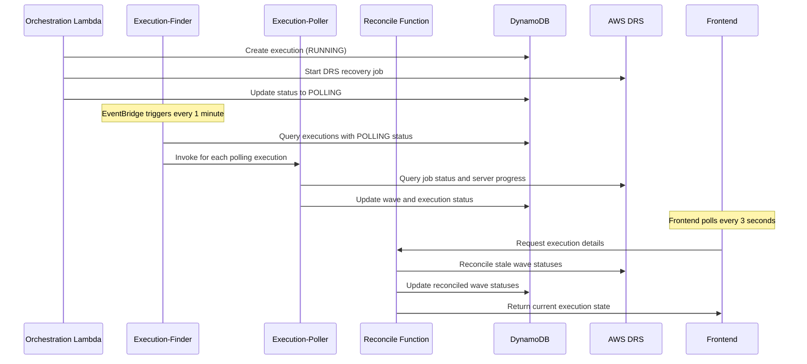

# Design Document

## Overview

This design document outlines the systematic restoration of the AWS DRS Orchestration execution polling system to its functional state from December 2025 - January 6, 2026. The design addresses the root causes identified through comprehensive commit analysis and implements robust solutions to prevent future regressions.

## Architecture

The execution polling system consists of four main components that work together to monitor and update DRS recovery job progress:



## Components and Interfaces

### 1. Orchestration Lambda Enhancement

**File**: `lambda/orchestration-stepfunctions/index.py`

**Current Issue**: Does not update execution status from "RUNNING" to "POLLING" after DRS job creation.

**Enhanced Interface**:
```python
def start_recovery_wave(execution_id: str, wave_config: dict) -> dict:
    """
    Start DRS recovery for a wave and update execution status.
    
    Args:
        execution_id: Unique execution identifier
        wave_config: Wave configuration with servers and settings
        
    Returns:
        dict: DRS job details and updated execution status
    """
    # Create DRS recovery job
    drs_response = drs_client.start_recovery(...)
    
    # CRITICAL: Update execution status to POLLING
    update_execution_status(execution_id, "POLLING")
    
    return {
        "jobId": drs_response["job"]["jobID"],
        "status": "POLLING",
        "participatingServers": drs_response["job"]["participatingServers"]
    }
```

### 2. Reconcile Function Validation and Enhancement

**File**: `lambda/api-handler/index.py`

**Current Status**: The `reconcile_wave_status_with_drs` function exists but may need validation and enhancement to ensure proper functionality.

**Enhanced Interface**:
```python
def reconcile_wave_status_with_drs(wave: dict, region: str, account_id: str) -> dict:
    """
    Reconcile wave status with actual DRS job results.
    
    This function provides backup reconciliation when polling system fails.
    Called every time frontend requests execution details.
    
    Args:
        wave: Wave object from DynamoDB
        region: AWS region for DRS operations
        account_id: Target account ID for cross-account operations
        
    Returns:
        dict: Updated wave object with reconciled status
    """
    job_id = wave.get("JobId")
    wave_status = wave.get("Status", "")
    
    # Only reconcile waves with stale statuses that have JobId
    stale_statuses = ["UNKNOWN", "", "STARTED", "INITIATED", "POLLING", "LAUNCHING", "IN_PROGRESS"]
    
    if not job_id or wave_status not in stale_statuses:
        return wave
    
    try:
        # Get DRS client for target account/region
        drs_client = get_drs_client(region, account_id)
        
        # Query actual DRS job status
        response = drs_client.describe_jobs(filters={"jobIDs": [job_id]})
        
        if not response.get("items"):
            logger.warning(f"DRS job {job_id} not found")
            return wave
        
        drs_job = response["items"][0]
        drs_status = drs_job.get("status")
        participating_servers = drs_job.get("participatingServers", [])
        
        # Reconcile based on actual DRS job status
        if drs_status == "COMPLETED":
            # Check if all servers launched successfully
            all_launched = all(
                server.get("launchStatus") == "LAUNCHED" 
                for server in participating_servers
            )
            
            if all_launched:
                wave["Status"] = "completed"
                wave["EndTime"] = int(time.time())
                logger.info(f"Reconciled wave to completed: {job_id}")
            else:
                wave["Status"] = "failed"
                wave["EndTime"] = int(time.time())
                logger.info(f"Reconciled wave to failed: {job_id}")
                
        elif drs_status == "FAILED":
            wave["Status"] = "failed"
            wave["EndTime"] = int(time.time())
            logger.info(f"Reconciled wave to failed: {job_id}")
            
        # Save updated wave to DynamoDB
        if wave.get("Status") in ["completed", "failed"]:
            save_wave_to_dynamodb(wave)
            
    except Exception as e:
        logger.error(f"Error reconciling wave status for job {job_id}: {e}")
    
    return wave

def get_execution_details(execution_id: str) -> dict:
    """
    Get execution details with automatic wave status reconciliation.
    """
    execution = get_execution_from_dynamodb(execution_id)
    
    # Reconcile each wave status with actual DRS results
    for wave in execution.get("Waves", []):
        wave = reconcile_wave_status_with_drs(
            wave, 
            execution.get("Region"), 
            execution.get("AccountId")
        )
    
    return execution
```

### 3. Execution-Finder Validation

**File**: `lambda/execution-finder/index.py`

**Current Functionality**: Queries for executions with POLLING status and invokes execution-poller.

**Enhanced Interface**:
```python
def lambda_handler(event: dict, context: Any) -> dict:
    """
    Find executions that need polling and trigger execution-poller.
    
    Triggered by EventBridge every 1 minute.
    """
    try:
        # Query StatusIndex GSI for POLLING executions
        response = dynamodb.query(
            IndexName="StatusIndex",
            KeyConditionExpression="Status = :status",
            ExpressionAttributeValues={":status": "POLLING"}
        )
        
        executions = response.get("Items", [])
        logger.info(f"Found {len(executions)} executions in POLLING status")
        
        # Invoke execution-poller for each execution
        for execution in executions:
            execution_id = execution["ExecutionId"]
            
            # Check if execution has timed out (1 year = 31,536,000 seconds)
            start_time = execution.get("StartTime", 0)
            current_time = int(time.time())
            timeout_seconds = 31536000  # 1 year
            
            if current_time - start_time > timeout_seconds:
                logger.warning(f"Execution {execution_id} has timed out")
                update_execution_status(execution_id, "TIMEOUT")
                continue
            
            # Invoke execution-poller
            lambda_client.invoke(
                FunctionName="execution-poller",
                InvocationType="Event",
                Payload=json.dumps({"executionId": execution_id})
            )
            
        return {
            "statusCode": 200,
            "body": json.dumps({
                "message": f"Processed {len(executions)} polling executions"
            })
        }
        
    except Exception as e:
        logger.error(f"Error in execution-finder: {e}")
        return {
            "statusCode": 500,
            "body": json.dumps({"error": str(e)})
        }
```

### 4. Execution-Poller Enhancement

**File**: `lambda/execution-poller/index.py`

**Current Issues**: May have packaging issues causing 502 errors.

**Enhanced Interface**:
```python
def lambda_handler(event: dict, context: Any) -> dict:
    """
    Poll DRS job status and update execution progress.
    
    Args:
        event: Contains executionId to poll
    """
    try:
        execution_id = event["executionId"]
        logger.info(f"Polling execution: {execution_id}")
        
        # Get execution details
        execution = get_execution_from_dynamodb(execution_id)
        if not execution:
            logger.error(f"Execution not found: {execution_id}")
            return {"statusCode": 404, "body": "Execution not found"}
        
        # Process each wave
        updated_waves = []
        for wave in execution.get("Waves", []):
            updated_wave = poll_wave_status(wave, execution)
            updated_waves.append(updated_wave)
        
        # Update execution with new wave statuses
        execution["Waves"] = updated_waves
        
        # Recalculate overall execution status
        execution_status = calculate_execution_status(updated_waves)
        execution["Status"] = execution_status
        
        # Save updated execution
        save_execution_to_dynamodb(execution)
        
        logger.info(f"Updated execution {execution_id} status to {execution_status}")
        
        return {
            "statusCode": 200,
            "body": json.dumps({
                "executionId": execution_id,
                "status": execution_status,
                "wavesUpdated": len(updated_waves)
            })
        }
        
    except Exception as e:
        logger.error(f"Error in execution-poller: {e}")
        return {
            "statusCode": 500,
            "body": json.dumps({"error": str(e)})
        }

def poll_wave_status(wave: dict, execution: dict) -> dict:
    """
    Poll DRS job status for a specific wave.
    """
    job_id = wave.get("JobId")
    if not job_id:
        return wave
    
    try:
        # Get DRS client for target account/region
        drs_client = get_drs_client(execution["Region"], execution["AccountId"])
        
        # Query DRS job status
        response = drs_client.describe_jobs(filters={"jobIDs": [job_id]})
        
        if response.get("items"):
            drs_job = response["items"][0]
            
            # Update wave based on DRS job status
            wave = update_wave_from_drs_job(wave, drs_job)
            
    except Exception as e:
        logger.error(f"Error polling wave {job_id}: {e}")
    
    return wave
```

## Data Models

### Execution Object Schema

```python
{
    "ExecutionId": "string",           # Primary key
    "Status": "string",                # RUNNING, POLLING, COMPLETED, FAILED, CANCELLED, TIMEOUT, PAUSED
    "StartTime": "number",             # Unix timestamp
    "EndTime": "number",               # Unix timestamp (optional)
    "Region": "string",                # AWS region
    "AccountId": "string",             # Target account ID
    "Waves": [                         # Array of wave objects
        {
            "WaveId": "number",        # Wave identifier (0-based)
            "Status": "string",        # STARTED, POLLING, LAUNCHING, completed, failed
            "JobId": "string",         # DRS job ID (optional)
            "StartTime": "number",     # Unix timestamp
            "EndTime": "number",       # Unix timestamp (optional)
            "Servers": [               # Array of server objects
                {
                    "ServerId": "string",      # DRS source server ID
                    "Status": "string",        # Server launch status
                    "RecoveryInstanceId": "string"  # Recovery instance ID (optional)
                }
            ]
        }
    ]
}
```

### DRS Job Response Schema

```python
{
    "jobID": "string",                 # Unique DRS job identifier
    "status": "string",                # PENDING, STARTED, COMPLETED, FAILED
    "participatingServers": [          # Array of participating servers
        {
            "sourceServerID": "string",    # DRS source server ID
            "launchStatus": "string",      # PENDING, LAUNCHED, FAILED
            "recoveryInstanceID": "string" # Recovery instance ID (optional)
        }
    ]
}
```

## Error Handling

### 1. DRS API Error Handling

```python
def handle_drs_error(error: Exception, operation: str) -> dict:
    """
    Handle DRS API errors with appropriate logging and responses.
    """
    if isinstance(error, ClientError):
        error_code = error.response["Error"]["Code"]
        error_message = error.response["Error"]["Message"]
        
        if error_code == "UnauthorizedOperation":
            logger.error(f"DRS permission denied for {operation}: {error_message}")
            return {"error": "DRS_PERMISSION_DENIED", "message": error_message}
        elif error_code == "ThrottlingException":
            logger.warning(f"DRS throttling for {operation}: {error_message}")
            return {"error": "DRS_THROTTLED", "message": error_message}
        else:
            logger.error(f"DRS API error for {operation}: {error_code} - {error_message}")
            return {"error": "DRS_API_ERROR", "message": error_message}
    else:
        logger.error(f"Unexpected error for {operation}: {error}")
        return {"error": "UNEXPECTED_ERROR", "message": str(error)}
```

### 2. Cross-Account Error Handling

```python
def get_drs_client(region: str, account_id: str) -> boto3.client:
    """
    Get DRS client with cross-account role assumption.
    """
    try:
        if account_id != get_current_account_id():
            # Assume cross-account role
            role_arn = f"arn:aws:iam::{account_id}:role/DRSOrchestrationRole"
            sts_client = boto3.client("sts")
            
            response = sts_client.assume_role(
                RoleArn=role_arn,
                RoleSessionName="DRSOrchestration"
            )
            
            credentials = response["Credentials"]
            return boto3.client(
                "drs",
                region_name=region,
                aws_access_key_id=credentials["AccessKeyId"],
                aws_secret_access_key=credentials["SecretAccessKey"],
                aws_session_token=credentials["SessionToken"]
            )
        else:
            return boto3.client("drs", region_name=region)
            
    except Exception as e:
        logger.error(f"Failed to create DRS client for account {account_id}: {e}")
        raise
```

### 3. Comprehensive Error Logging Strategy

**Structured Logging Format**:
```python
import json
from datetime import datetime

def log_execution_event(level: str, component: str, execution_id: str, event_type: str, details: dict):
    """
    Log execution events with structured format for debugging.
    """
    log_entry = {
        "timestamp": datetime.utcnow().isoformat() + "Z",
        "level": level,
        "component": component,
        "execution_id": execution_id,
        "event_type": event_type,
        "details": details
    }
    
    if level == "ERROR":
        logger.error(json.dumps(log_entry))
    elif level == "WARN":
        logger.warning(json.dumps(log_entry))
    else:
        logger.info(json.dumps(log_entry))

# Usage examples for each component
def log_drs_api_failure(execution_id: str, operation: str, error_code: str, error_message: str):
    """Log DRS API failures with detailed context."""
    log_execution_event("ERROR", "DRS_API", execution_id, "API_FAILURE", {
        "operation": operation,
        "error_code": error_code,
        "error_message": error_message,
        "retry_count": getattr(error, 'retry_count', 0)
    })

def log_dynamodb_failure(execution_id: str, table_name: str, operation: str, error: Exception):
    """Log DynamoDB operation failures."""
    log_execution_event("ERROR", "DYNAMODB", execution_id, "DB_FAILURE", {
        "table_name": table_name,
        "operation": operation,
        "error_type": type(error).__name__,
        "error_message": str(error)
    })

def log_lambda_invocation(execution_id: str, function_name: str, success: bool, duration_ms: int):
    """Log Lambda function invocations."""
    log_execution_event("INFO", "LAMBDA", execution_id, "INVOCATION", {
        "function_name": function_name,
        "success": success,
        "duration_ms": duration_ms
    })
```

### 4. Timeout Handling Implementation

```python
def check_execution_timeout(execution: dict) -> bool:
    """
    Check if execution has exceeded timeout period.
    
    Args:
        execution: Execution object from DynamoDB
        
    Returns:
        bool: True if execution has timed out
    """
    start_time = execution.get("StartTime", 0)
    current_time = int(time.time())
    timeout_seconds = 31536000  # 1 year = 31,536,000 seconds
    
    if current_time - start_time > timeout_seconds:
        log_execution_event("WARN", "TIMEOUT", execution["ExecutionId"], "TIMEOUT_DETECTED", {
            "start_time": start_time,
            "current_time": current_time,
            "duration_seconds": current_time - start_time,
            "timeout_threshold": timeout_seconds
        })
        return True
    
    return False

def handle_execution_timeout(execution_id: str) -> dict:
    """
    Handle execution timeout while preserving resume capability.
    """
    try:
        # Update execution status to TIMEOUT
        update_execution_status(execution_id, "TIMEOUT")
        
        # Log timeout event with detailed information
        log_execution_event("WARN", "TIMEOUT", execution_id, "TIMEOUT_APPLIED", {
            "action": "marked_as_timeout",
            "resume_capability": "preserved",
            "note": "DRS jobs may still be active and resumable"
        })
        
        return {"status": "TIMEOUT", "resumable": True}
        
    except Exception as e:
        log_execution_event("ERROR", "TIMEOUT", execution_id, "TIMEOUT_HANDLING_FAILED", {
            "error": str(e)
        })
        raise
```

### 5. Step Functions Integration Error Handling

```python
def handle_step_functions_event(event: dict, execution_id: str) -> dict:
    """
    Handle Step Functions events with proper error handling and logging.
    """
    try:
        event_type = event.get("type", "unknown")
        
        if event_type == "PAUSE":
            # Preserve PAUSED status and prevent recalculation
            update_execution_status(execution_id, "PAUSED")
            log_execution_event("INFO", "STEP_FUNCTIONS", execution_id, "EXECUTION_PAUSED", {
                "waitForTaskToken": True,
                "max_pause_duration": "1 year"
            })
            
        elif event_type == "RESUME":
            # Restore POLLING status and continue monitoring
            update_execution_status(execution_id, "POLLING")
            log_execution_event("INFO", "STEP_FUNCTIONS", execution_id, "EXECUTION_RESUMED", {
                "previous_status": "PAUSED",
                "new_status": "POLLING"
            })
            
        elif event_type == "COMPLETE":
            # Update final execution status
            update_execution_status(execution_id, "COMPLETED")
            log_execution_event("INFO", "STEP_FUNCTIONS", execution_id, "EXECUTION_COMPLETED", {
                "final_status": "COMPLETED"
            })
            
        elif event_type == "FAIL":
            # Mark execution as failed and log details
            update_execution_status(execution_id, "FAILED")
            log_execution_event("ERROR", "STEP_FUNCTIONS", execution_id, "EXECUTION_FAILED", {
                "error_details": event.get("error", "Unknown error"),
                "cause": event.get("cause", "Unknown cause")
            })
            
        return {"statusCode": 200, "body": "Event processed successfully"}
        
    except Exception as e:
        log_execution_event("ERROR", "STEP_FUNCTIONS", execution_id, "EVENT_PROCESSING_FAILED", {
            "event_type": event_type,
            "error": str(e)
        })
        raise
```

### 5. EventBridge Integration Configuration

**EventBridge Rule Configuration**:
```yaml
# CloudFormation template for EventBridge rule
ExecutionFinderScheduleRule:
  Type: AWS::Events::Rule
  Properties:
    Name: !Sub "${ProjectName}-execution-finder-schedule"
    Description: "Triggers execution-finder Lambda every minute"
    ScheduleExpression: "rate(1 minute)"
    State: ENABLED
    Targets:
      - Arn: !GetAtt ExecutionFinderLambda.Arn
        Id: "ExecutionFinderTarget"
        Input: |
          {
            "source": "eventbridge.schedule",
            "trigger": "execution-finder-schedule"
          }
```

**EventBridge Integration Monitoring**:
```python
def lambda_handler(event: dict, context: Any) -> dict:
    """
    Enhanced execution-finder with EventBridge integration monitoring.
    """
    start_time = time.time()
    
    try:
        # Log EventBridge trigger details
        log_execution_event("INFO", "EXECUTION_FINDER", "system", "EVENTBRIDGE_TRIGGER", {
            "trigger_source": event.get("source", "unknown"),
            "trigger_time": int(start_time),
            "lambda_request_id": context.aws_request_id
        })
        
        # Query StatusIndex GSI for POLLING and CANCELLING executions
        response = dynamodb.query(
            IndexName="StatusIndex",
            KeyConditionExpression="Status = :polling_status OR Status = :cancelling_status",
            ExpressionAttributeValues={
                ":polling_status": "POLLING",
                ":cancelling_status": "CANCELLING"
            }
        )
        
        executions = response.get("Items", [])
        processed_count = 0
        timeout_count = 0
        error_count = 0
        
        # Process each execution
        for execution in executions:
            try:
                execution_id = execution["ExecutionId"]
                
                # Check for timeout
                if check_execution_timeout(execution):
                    handle_execution_timeout(execution_id)
                    timeout_count += 1
                    continue
                
                # Invoke execution-poller
                lambda_client.invoke(
                    FunctionName=os.environ["EXECUTION_POLLER_FUNCTION_NAME"],
                    InvocationType="Event",
                    Payload=json.dumps({"executionId": execution_id})
                )
                
                processed_count += 1
                
            except Exception as e:
                error_count += 1
                log_execution_event("ERROR", "EXECUTION_FINDER", execution.get("ExecutionId", "unknown"), "PROCESSING_ERROR", {
                    "error": str(e)
                })
        
        # Log summary statistics
        duration_ms = int((time.time() - start_time) * 1000)
        log_execution_event("INFO", "EXECUTION_FINDER", "system", "PROCESSING_COMPLETE", {
            "total_found": len(executions),
            "processed": processed_count,
            "timeouts": timeout_count,
            "errors": error_count,
            "duration_ms": duration_ms
        })
        
        return {
            "statusCode": 200,
            "body": json.dumps({
                "message": f"Processed {processed_count} executions",
                "statistics": {
                    "total_found": len(executions),
                    "processed": processed_count,
                    "timeouts": timeout_count,
                    "errors": error_count,
                    "duration_ms": duration_ms
                }
            })
        }
        
    except Exception as e:
        duration_ms = int((time.time() - start_time) * 1000)
        log_execution_event("ERROR", "EXECUTION_FINDER", "system", "HANDLER_FAILURE", {
            "error": str(e),
            "duration_ms": duration_ms
        })
        
        return {
            "statusCode": 500,
            "body": json.dumps({"error": str(e)})
        }
```

## Frontend Integration

### Real-Time Polling Strategy

**Frontend Polling Pattern**:
```typescript
// Frontend polls every 3 seconds for active executions
const useExecutionPolling = (executionId: string) => {
  const [execution, setExecution] = useState<Execution | null>(null);
  const [loading, setLoading] = useState(true);
  const [error, setError] = useState<string | null>(null);

  useEffect(() => {
    let intervalId: NodeJS.Timeout;

    const pollExecution = async () => {
      try {
        const response = await apiClient.getExecutionDetails(executionId);
        setExecution(response);
        setError(null);
        
        // Continue polling if execution is active
        const isActive = ['RUNNING', 'POLLING', 'PAUSED'].includes(response.status);
        if (isActive) {
          intervalId = setTimeout(pollExecution, 3000); // 3 second interval
        }
      } catch (err) {
        setError(err.message);
      } finally {
        setLoading(false);
      }
    };

    pollExecution();

    return () => {
      if (intervalId) clearTimeout(intervalId);
    };
  }, [executionId]);

  return { execution, loading, error };
};
```

**API Response Optimization**:
```python
def get_execution_details_optimized(execution_id: str) -> dict:
    """
    Optimized execution details endpoint with automatic reconciliation.
    
    This endpoint is called every 3 seconds by the frontend, so it must:
    1. Return quickly (< 500ms target)
    2. Always return current status via reconciliation
    3. Handle errors gracefully without breaking polling
    """
    try:
        # Get execution from DynamoDB
        execution = get_execution_from_dynamodb(execution_id)
        if not execution:
            return {"error": "Execution not found", "statusCode": 404}
        
        # Only reconcile if execution is in active state
        active_statuses = ["RUNNING", "POLLING", "PAUSED"]
        if execution.get("Status") in active_statuses:
            # Reconcile each wave status with actual DRS results
            for wave in execution.get("Waves", []):
                wave = reconcile_wave_status_with_drs(
                    wave, 
                    execution.get("Region"), 
                    execution.get("AccountId")
                )
        
        # Add real-time metadata for frontend
        execution["_metadata"] = {
            "lastUpdated": int(time.time()),
            "reconciled": True,
            "pollingActive": execution.get("Status") in active_statuses
        }
        
        return execution
        
    except Exception as e:
        # Log error but return partial data to keep frontend functional
        logger.error(f"Error getting execution details for {execution_id}: {e}")
        return {
            "ExecutionId": execution_id,
            "Status": "UNKNOWN",
            "error": "Failed to load execution details",
            "_metadata": {
                "lastUpdated": int(time.time()),
                "reconciled": False,
                "pollingActive": False
            }
        }
```

**Status Display Components**:
```typescript
// Real-time status indicators that update based on reconciled data
const ExecutionStatusBadge: React.FC<{ status: string }> = ({ status }) => {
  const getStatusConfig = (status: string) => {
    switch (status) {
      case 'COMPLETED':
        return { color: 'green', icon: 'check', text: 'Completed' };
      case 'FAILED':
        return { color: 'red', icon: 'close', text: 'Failed' };
      case 'POLLING':
        return { color: 'blue', icon: 'loading', text: 'In Progress' };
      case 'PAUSED':
        return { color: 'grey', icon: 'pause', text: 'Paused' };
      case 'TIMEOUT':
        return { color: 'orange', icon: 'warning', text: 'Timed Out' };
      default:
        return { color: 'grey', icon: 'status-info', text: status };
    }
  };

  const config = getStatusConfig(status);
  
  return (
    <Badge color={config.color}>
      <Icon name={config.icon} /> {config.text}
    </Badge>
  );
};

const WaveProgressIndicator: React.FC<{ waves: Wave[] }> = ({ waves }) => {
  const completedWaves = waves.filter(w => w.Status === 'completed').length;
  const totalWaves = waves.length;
  const progressPercentage = totalWaves > 0 ? (completedWaves / totalWaves) * 100 : 0;

  return (
    <ProgressBar
      value={progressPercentage}
      label={`Wave Progress (${completedWaves}/${totalWaves})`}
      description={`${completedWaves} of ${totalWaves} waves completed`}
      status={progressPercentage === 100 ? 'success' : 'in-progress'}
    />
  );
};
```

## Testing Strategy

### Unit Tests

**Test Coverage Requirements**:
- Reconcile function with various DRS job statuses
- Status transition logic in orchestration Lambda
- Execution-finder query and invocation logic
- Execution-poller DRS integration
- Error handling for all components

**Key Test Cases**:

```python
def test_reconcile_function_completed_job():
    """Test reconcile function with completed DRS job."""
    wave = {
        "WaveId": 0,
        "Status": "STARTED",
        "JobId": "drsjob-12345"
    }
    
    # Mock DRS response with completed job
    mock_drs_response = {
        "items": [{
            "jobID": "drsjob-12345",
            "status": "COMPLETED",
            "participatingServers": [
                {"sourceServerID": "s-12345", "launchStatus": "LAUNCHED"}
            ]
        }]
    }
    
    with patch('boto3.client') as mock_client:
        mock_client.return_value.describe_jobs.return_value = mock_drs_response
        
        updated_wave = reconcile_wave_status_with_drs(wave, "us-east-1", "123456789012")
        
        assert updated_wave["Status"] == "completed"
        assert "EndTime" in updated_wave

def test_status_transition_after_drs_job_creation():
    """Test orchestration Lambda updates status to POLLING."""
    execution_id = "exec-12345"
    
    with patch('boto3.client') as mock_drs:
        mock_drs.return_value.start_recovery.return_value = {
            "job": {"jobID": "drsjob-12345"}
        }
        
        result = start_recovery_wave(execution_id, {})
        
        # Verify status was updated to POLLING
        execution = get_execution_from_dynamodb(execution_id)
        assert execution["Status"] == "POLLING"

def test_execution_finder_timeout_handling():
    """Test execution-finder handles timed out executions."""
    # Create execution that started over 1 year ago
    old_execution = {
        "ExecutionId": "exec-old",
        "Status": "POLLING",
        "StartTime": int(time.time()) - 31536001  # Over 1 year
    }
    
    with patch('dynamodb.query') as mock_query:
        mock_query.return_value = {"Items": [old_execution]}
        
        result = lambda_handler({}, {})
        
        # Verify execution was marked as TIMEOUT
        execution = get_execution_from_dynamodb("exec-old")
        assert execution["Status"] == "TIMEOUT"
```

### Integration Tests

**Test Scenarios**:
1. End-to-end execution flow from orchestration to completion
2. Cross-account DRS operations with role assumption
3. EventBridge trigger to execution-finder integration
4. Frontend polling with reconcile function integration
5. Error recovery and retry scenarios

### Property-Based Tests

**Properties to Test**:
1. **Status Consistency**: For any execution, the overall status should be consistent with wave statuses
2. **Reconciliation Idempotence**: Running reconcile function multiple times should produce the same result
3. **Timeout Handling**: Any execution older than 1 year should be marked as TIMEOUT
4. **Cross-Account Permissions**: All cross-account operations should either succeed or fail gracefully with proper error messages

## Correctness Properties

*A property is a characteristic or behavior that should hold true across all valid executions of a system-essentially, a formal statement about what the system should do. Properties serve as the bridge between human-readable specifications and machine-verifiable correctness guarantees.*

### Property 1: Reconcile Function Invocation
*For any* get_execution_details API request, the reconcile_wave_status_with_drs function should be called for each wave in the execution
**Validates: Requirements 1.1**

### Property 2: Stale Wave Status Detection
*For any* wave with status in ["UNKNOWN", "", "STARTED", "INITIATED", "POLLING", "LAUNCHING", "IN_PROGRESS"] and a valid JobId, the reconcile function should query DRS for actual job status
**Validates: Requirements 1.2, 5.1**

### Property 3: Successful Wave Reconciliation
*For any* DRS job with status "COMPLETED" where all participating servers have launchStatus "LAUNCHED", the reconcile function should update wave status to "completed" and set EndTime
**Validates: Requirements 1.3, 5.3**

### Property 4: Failed Wave Reconciliation
*For any* DRS job with status "FAILED" or with servers that failed to launch, the reconcile function should update wave status to "failed" and set EndTime
**Validates: Requirements 1.4, 5.4**

### Property 5: Status Transition After DRS Job Creation
*For any* successful DRS recovery job creation by orchestration Lambda, the execution status should be updated from "RUNNING" to "POLLING"
**Validates: Requirements 2.1**

### Property 6: Data Persistence Consistency
*For any* wave or execution status update, the changes should be immediately saved to DynamoDB
**Validates: Requirements 1.5, 2.2, 5.5**

### Property 7: Execution Discovery Query
*For any* execution-finder invocation, only executions with status ["POLLING", "CANCELLING"] should be returned from the StatusIndex GSI query
**Validates: Requirements 2.3**

### Property 8: Execution-Poller Invocation
*For any* polling execution found by execution-finder, the execution-poller Lambda should be invoked with the correct execution ID
**Validates: Requirements 2.4, 3.3**

### Property 9: DRS Job Status Polling
*For any* execution-poller invocation, wave and execution statuses should be updated based on actual DRS job results
**Validates: Requirements 2.5**

### Property 10: EventBridge Integration Health
*For any* EventBridge trigger, the execution-finder should execute successfully and log the number of executions found
**Validates: Requirements 3.1, 3.2**

### Property 11: Lambda Execution Health
*For any* execution-poller Lambda invocation, the function should execute without 502 HTTP errors and have access to all required dependencies
**Validates: Requirements 4.1, 4.2**

### Property 12: IAM Permissions Validation
*For any* DRS API call or DynamoDB operation, the system should have proper IAM permissions or return descriptive permission errors
**Validates: Requirements 4.3, 4.4, 6.2**

### Property 13: Cross-Account Role Assumption
*For any* cross-account DRS operation, the system should assume the proper cross-account role using STS
**Validates: Requirements 6.1**

### Property 14: Cross-Account Error Handling
*For any* cross-account operation failure, the system should handle authentication errors gracefully and log detailed error information including account ID and region
**Validates: Requirements 6.3, 6.4, 6.5**

### Property 15: Execution Timeout Calculation
*For any* execution, the timeout should be calculated as current time compared against StartTime plus 31,536,000 seconds (1 year)
**Validates: Requirements 7.1, 7.5**

### Property 16: Timeout Status Handling
*For any* execution that exceeds the timeout period, the execution should be marked as "TIMEOUT" status while preserving resume capability for active DRS jobs
**Validates: Requirements 7.2, 7.3, 7.4**

### Property 17: API Response Consistency
*For any* frontend polling request, the API should return current execution and wave statuses reflecting the most recent reconciliation
**Validates: Requirements 8.1**

### Property 18: Comprehensive Error Logging
*For any* system error (DRS API failures, DynamoDB failures, Lambda failures), detailed error information should be logged including function name, execution ID, error codes, and operation context
**Validates: Requirements 9.1, 9.2, 9.3, 9.4**

### Property 19: PAUSED Status Preservation
*For any* execution in PAUSED status, the status should be preserved and prevent recalculation until explicitly resumed
**Validates: Requirements 10.1**

### Property 20: Step Functions Integration
*For any* Step Functions execution event (resume, complete, fail), the system should update execution status appropriately and log the event details
**Validates: Requirements 10.2, 10.4, 10.5**

## Deployment Strategy

### 1. Phased Rollout

**Phase 1: Validate Existing Components**
- Verify reconcile function exists and is properly integrated in API handler
- Test execution-finder EventBridge integration and Lambda packaging
- Validate execution-poller Lambda deployment and dependencies
- Check orchestration Lambda status transition logic

**Phase 2: Fix Identified Issues**
- Deploy any necessary fixes to Lambda packaging or dependencies
- Update timeout handling logic (1 year = 31,536,000 seconds)
- Enhance error handling and logging throughout the system
- Implement comprehensive cross-account error handling

**Phase 3: Validate End-to-End System**
- Test complete execution flow from orchestration to completion
- Monitor EventBridge triggers and Lambda invocations
- Verify reconcile function works with stuck executions
- Test cross-account scenarios if applicable

**Phase 4: Frontend Integration Validation**
- Verify frontend real-time polling works with reconciled statuses
- Test pause/resume functionality via Step Functions integration
- Validate error handling and user experience
- Confirm all status transitions display correctly

### 2. Rollback Plan

**Immediate Rollback Triggers**:
- Lambda functions fail to deploy or execute properly
- Reconcile function causes performance degradation
- Status transitions break existing functionality
- Polling system creates infinite loops or excessive API calls
- EventBridge integration fails or causes errors

**Rollback Procedure**:
1. Revert Lambda function deployments to previous working versions
2. Disable EventBridge rule if causing issues
3. Monitor system stability and execution status accuracy
4. Investigate root cause and prepare corrected deployment
5. Re-enable components incrementally after fixes

### 3. Monitoring and Validation

**Key Metrics**:
- Execution status accuracy (reconciled vs actual DRS status)
- API response times for execution details (target < 500ms)
- EventBridge trigger success rate (should be 100%)
- Lambda function error rates and timeouts
- DRS API call frequency and throttling incidents
- Cross-account operation success rates

**Success Criteria**:
- All stuck executions show correct status within 5 minutes of deployment
- New executions progress correctly: RUNNING → POLLING → COMPLETED/FAILED
- Frontend shows real-time progress updates without delays
- No increase in API errors or timeouts
- System handles cross-account operations correctly
- EventBridge triggers execution-finder reliably every minute
- Execution-poller processes all polling executions without 502 errors

**Monitoring Dashboard Requirements**:
- Real-time execution status distribution
- Lambda function invocation rates and error rates
- DRS API call patterns and error rates
- Average reconciliation time per execution
- Frontend polling response times