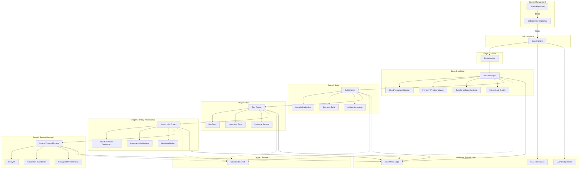

# CI/CD Pipeline Specification

## Introduction

This document specifies the complete CI/CD pipeline architecture for the AWS DRS Orchestration platform using AWS CodeCommit, CodeBuild, and CodePipeline. The pipeline provides automated validation, testing, building, and deployment capabilities with comprehensive quality gates and security controls.

## Pipeline Architecture Overview

### Pipeline Components
- **1 CodeCommit Repository**: Source code management with GitHub mirroring
- **1 CodePipeline**: 6-stage automated deployment pipeline
- **5 CodeBuild Projects**: Specialized build projects for different pipeline stages
- **1 S3 Artifact Bucket**: Pipeline artifact storage and management
- **Integration**: EventBridge, SNS, CloudWatch for monitoring and notifications

### Pipeline Flow Diagram



## CodeCommit Repository Specification

### Repository Configuration
- **Name**: `aws-elasticdrs-orchestrator-dev-repo`
- **Description**: Source code repository for AWS DRS Orchestration platform
- **Default Branch**: `main`
- **Branch Protection**: Enabled for main branch

### GitHub Integration
- **Mirroring**: Automatic synchronization from GitHub repository
- **Webhook**: GitHub webhook triggers CodeCommit updates
- **Authentication**: GitHub personal access token stored in Secrets Manager
- **Frequency**: Real-time mirroring on GitHub push events

### Repository Structure
```
aws-elasticdrs-orchestrator-dev-repo/
├── cfn/                          # CloudFormation templates
├── lambda/                       # Lambda function source code
├── frontend/                     # React application source
├── buildspecs/                   # CodeBuild build specifications
├── tests/                        # Test suites and test data
├── scripts/                      # Deployment and utility scripts
├── docs/                         # Documentation
├── .cfnlintrc.yaml              # CloudFormation linting configuration
├── .flake8                      # Python linting configuration
├── pyproject.toml               # Python project configuration
└── README.md                    # Project documentation
```

### Access Control
- **IAM Roles**: Service roles for CodePipeline and CodeBuild access
- **Permissions**: Read access for pipeline, write access for mirroring
- **Security**: Repository encryption at rest and in transit

## CodePipeline Specification

### Pipeline Configuration
- **Name**: `aws-elasticdrs-orchestrator-dev-pipeline`
- **Service Role**: `aws-elasticdrs-orchestrator-dev-pipeline-role`
- **Artifact Store**: S3 bucket with KMS encryption
- **Trigger**: CodeCommit repository changes on main branch

### Stage Definitions

#### Stage 1: Source
**Purpose**: Retrieve source code from CodeCommit repository

**Actions**:
- **Action Name**: `SourceAction`
- **Action Type**: `AWS::CodeCommit::Source`
- **Configuration**:
  - Repository Name: `aws-elasticdrs-orchestrator-dev-repo`
  - Branch Name: `main`
  - Output Artifacts: `SourceOutput`

**Success Criteria**:
- Source code successfully retrieved from repository
- All files and directories present in artifact
- No corruption or missing files detected

#### Stage 2: Validate
**Purpose**: Validate code quality, syntax, and CloudFormation templates

**Actions**:
- **Action Name**: `ValidateAction`
- **Action Type**: `AWS::CodeBuild::Build`
- **Project**: `aws-elasticdrs-orchestrator-dev-validate`
- **Input Artifacts**: `SourceOutput`
- **Output Artifacts**: `ValidateOutput`

**Validation Checks**:
1. **CloudFormation Template Validation**
   - AWS CLI `validate-template` for all CFN templates
   - cfn-lint validation with `.cfnlintrc.yaml` configuration
   - Template syntax and resource validation

2. **Python Code Quality**
   - PEP 8 compliance with Black formatter (79 character line length)
   - Flake8 linting with project configuration
   - Import sorting with isort
   - Type checking with mypy (if configured)

3. **Frontend Code Quality**
   - TypeScript type checking with tsc
   - ESLint code quality checks
   - React component validation
   - Package.json validation

**Success Criteria**:
- All CloudFormation templates pass validation
- Python code passes PEP 8 compliance checks
- TypeScript code passes type checking
- No critical linting errors detected

#### Stage 3: Build
**Purpose**: Package Lambda functions and build frontend application

**Actions**:
- **Action Name**: `BuildAction`
- **Action Type**: `AWS::CodeBuild::Build`
- **Project**: `aws-elasticdrs-orchestrator-dev-build`
- **Input Artifacts**: `SourceOutput`
- **Output Artifacts**: `BuildOutput`

**Build Processes**:
1. **Lambda Function Packaging**
   - Install Python dependencies to package directory
   - Create deployment packages for all 5 Lambda functions:
     - `api-handler.zip` (index.py + rbac_middleware.py + dependencies)
     - `orchestration-stepfunctions.zip` (orchestration_stepfunctions.py + dependencies)
     - `execution-finder.zip` (poller/execution_finder.py + dependencies)
     - `execution-poller.zip` (poller/execution_poller.py + dependencies)
     - `frontend-builder.zip` (build_and_deploy.py + dependencies)

2. **Frontend Application Build**
   - Install Node.js dependencies with `npm ci --prefer-offline`
   - Build React application with Vite (`npm run build`)
   - Generate optimized production assets
   - Create build artifact with proper structure

**Success Criteria**:
- All 5 Lambda packages created successfully
- Frontend build completes without errors
- All artifacts properly structured for deployment
- Package sizes within Lambda limits

#### Stage 4: Test
**Purpose**: Execute unit tests, integration tests, and generate coverage reports

**Actions**:
- **Action Name**: `TestAction`
- **Action Type**: `AWS::CodeBuild::Build`
- **Project**: `aws-elasticdrs-orchestrator-dev-test`
- **Input Artifacts**: `BuildOutput`
- **Output Artifacts**: `TestOutput`

**Test Execution**:
1. **Python Unit Tests**
   - Execute pytest with coverage reporting
   - Test all Lambda function modules
   - Generate HTML and terminal coverage reports
   - Validate test coverage thresholds

2. **Python Integration Tests**
   - Execute integration test suite
   - Test AWS service integrations with moto mocking
   - Validate end-to-end functionality
   - Test error handling and edge cases

3. **Frontend Tests**
   - Execute Jest unit tests (if configured)
   - Test React components and utilities
   - Validate TypeScript type safety
   - Generate test coverage reports

**Success Criteria**:
- All unit tests pass successfully
- Integration tests validate functionality
- Test coverage meets minimum thresholds (>80%)
- No critical test failures detected

#### Stage 5: Deploy Infrastructure
**Purpose**: Deploy CloudFormation infrastructure and update Lambda code

**Actions**:
- **Action Name**: `DeployInfraAction`
- **Action Type**: `AWS::CodeBuild::Build`
- **Project**: `aws-elasticdrs-orchestrator-dev-deploy-infra`
- **Input Artifacts**: `BuildOutput`
- **Output Artifacts**: `DeployInfraOutput`

**Deployment Process**:
1. **S3 Artifact Upload**
   - Upload CloudFormation templates to deployment bucket
   - Upload Lambda packages to deployment bucket
   - Verify artifact integrity and accessibility

2. **CloudFormation Deployment**
   - Deploy master stack with parameter overrides
   - Monitor stack deployment progress
   - Handle stack updates with change sets
   - Validate deployment success

3. **Lambda Code Updates**
   - Update Lambda function code from S3 packages
   - Verify function updates successful
   - Test Lambda function invocations
   - Validate environment variable configuration

**Success Criteria**:
- All CloudFormation stacks deploy successfully
- Lambda functions updated with new code
- Infrastructure health checks pass
- No deployment errors or rollbacks

#### Stage 6: Deploy Frontend
**Purpose**: Deploy frontend application and configure CloudFront distribution

**Actions**:
- **Action Name**: `DeployFrontendAction`
- **Action Type**: `AWS::CodeBuild::Build`
- **Project**: `aws-elasticdrs-orchestrator-dev-deploy-frontend`
- **Input Artifacts**: `BuildOutput`, `DeployInfraOutput`
- **Output Artifacts**: `DeployFrontendOutput`

**Deployment Process**:
1. **Configuration Generation**
   - Retrieve CloudFormation stack outputs
   - Generate `aws-config.js` with API endpoints and Cognito configuration
   - Validate configuration completeness

2. **S3 Deployment**
   - Sync frontend assets to S3 bucket
   - Apply proper caching headers for assets and HTML
   - Remove old files with `--delete` flag
   - Verify S3 deployment success

3. **CloudFront Invalidation**
   - Create CloudFront invalidation for all paths (`/*`)
   - Monitor invalidation progress
   - Verify cache invalidation completion
   - Test frontend accessibility

**Success Criteria**:
- Frontend configuration generated correctly
- S3 sync completes successfully
- CloudFront invalidation processes
- Frontend loads and functions properly

### Pipeline Monitoring and Notifications

#### CloudWatch Integration
- **Pipeline Metrics**: Execution success/failure rates, duration
- **Stage Metrics**: Individual stage performance and error rates
- **Build Metrics**: Build duration, artifact sizes, test results
- **Custom Metrics**: Deployment frequency, lead time, recovery time

#### SNS Notifications
- **Pipeline Started**: Notification when pipeline execution begins
- **Pipeline Succeeded**: Notification on successful completion
- **Pipeline Failed**: Notification on any stage failure with details
- **Stage Failed**: Immediate notification on individual stage failures

#### EventBridge Integration
- **Pipeline State Changes**: Events for all pipeline state transitions
- **Custom Rules**: Integration with external monitoring systems
- **Automated Responses**: Trigger remediation actions on failures
- **Metrics Collection**: Feed pipeline metrics to monitoring dashboards

## CodeBuild Project Specifications

### Validate Project (`aws-elasticdrs-orchestrator-dev-validate`)

#### Runtime Environment
- **Image**: `aws/codebuild/amazonlinux2-x86_64-standard:5.0`
- **Compute Type**: `BUILD_GENERAL1_SMALL`
- **Runtime Versions**:
  - Python: 3.12
  - Node.js: 22

#### BuildSpec Configuration
```yaml
version: 0.2
phases:
  install:
    runtime-versions:
      python: 3.12
      nodejs: 22
    commands:
      # Install Python validation tools
      - pip install cfn-lint==1.42.0 black==23.7.0 flake8==6.0.0 isort==5.12.0
      - pip install flake8-docstrings flake8-import-order pep8-naming
      
      # Install Node.js tools
      - npm install -g typescript eslint
      
  pre_build:
    commands:
      - echo "Starting validation phase"
      - python --version
      - node --version
      
  build:
    commands:
      # CloudFormation validation
      - echo "Validating CloudFormation templates"
      - for template in cfn/*.yaml; do aws cloudformation validate-template --template-body file://$template; done
      - cfn-lint cfn/*.yaml
      
      # Python code validation
      - echo "Validating Python code quality"
      - black --check --line-length=79 lambda/ scripts/
      - isort --check-only --profile=black lambda/ scripts/
      - flake8 --max-line-length=79 lambda/ scripts/
      
      # Frontend validation
      - echo "Validating frontend code"
      - cd frontend && npm ci --prefer-offline
      - npm run type-check
      - npm run lint
      
  post_build:
    commands:
      - echo "Validation completed successfully"
      
artifacts:
  files:
    - '**/*'
  name: ValidateArtifacts
```

#### IAM Permissions
- CloudFormation template validation
- S3 access for artifact storage
- CloudWatch Logs for build logging

### Build Project (`aws-elasticdrs-orchestrator-dev-build`)

#### Runtime Environment
- **Image**: `aws/codebuild/amazonlinux2-x86_64-standard:5.0`
- **Compute Type**: `BUILD_GENERAL1_MEDIUM`
- **Runtime Versions**:
  - Python: 3.12
  - Node.js: 22

#### BuildSpec Configuration
```yaml
version: 0.2
phases:
  install:
    runtime-versions:
      python: 3.12
      nodejs: 22
      
  pre_build:
    commands:
      - echo "Starting build phase"
      - mkdir -p build/lambda build/frontend
      
  build:
    commands:
      # Lambda function packaging
      - echo "Packaging Lambda functions"
      
      # API Handler
      - cd lambda && zip -r ../build/lambda/api-handler.zip index.py rbac_middleware.py
      - pip install -r requirements.txt -t package/
      - cd package && zip -r ../../build/lambda/api-handler.zip . && cd ..
      
      # Orchestration StepFunctions
      - zip -r ../build/lambda/orchestration-stepfunctions.zip orchestration_stepfunctions.py
      - cd package && zip -r ../../build/lambda/orchestration-stepfunctions.zip . && cd ..
      
      # Execution Finder
      - cd poller && zip -r ../../build/lambda/execution-finder.zip execution_finder.py
      - cd ../package && zip -r ../../build/lambda/execution-finder.zip . && cd ..
      
      # Execution Poller
      - cd poller && zip -r ../../build/lambda/execution-poller.zip execution_poller.py
      - cd ../package && zip -r ../../build/lambda/execution-poller.zip . && cd ..
      
      # Frontend Builder
      - zip -r ../build/lambda/frontend-builder.zip build_and_deploy.py
      - cd package && zip -r ../../build/lambda/frontend-builder.zip . && cd ../..
      
      # Frontend build
      - echo "Building frontend application"
      - cd frontend
      - npm ci --prefer-offline
      - npm run build
      - cp -r dist/* ../build/frontend/
      
  post_build:
    commands:
      - echo "Build completed successfully"
      - ls -la build/lambda/
      - ls -la build/frontend/
      
artifacts:
  files:
    - 'build/**/*'
    - 'cfn/**/*'
    - 'buildspecs/**/*'
  name: BuildArtifacts
```

#### IAM Permissions
- S3 access for artifact storage and dependency downloads
- CloudWatch Logs for build logging

### Test Project (`aws-elasticdrs-orchestrator-dev-test`)

#### Runtime Environment
- **Image**: `aws/codebuild/amazonlinux2-x86_64-standard:5.0`
- **Compute Type**: `BUILD_GENERAL1_MEDIUM`
- **Runtime Versions**:
  - Python: 3.12
  - Node.js: 22

#### BuildSpec Configuration
```yaml
version: 0.2
phases:
  install:
    runtime-versions:
      python: 3.12
      nodejs: 22
    commands:
      # Install testing frameworks
      - pip install pytest>=7.4.0 pytest-cov>=4.1.0 moto>=4.2.0
      - pip install -r lambda/requirements.txt
      
  pre_build:
    commands:
      - echo "Starting test phase"
      
  build:
    commands:
      # Python unit tests
      - echo "Running Python unit tests"
      - if [ -d "tests/python/unit" ]; then
          pytest tests/python/unit/ -v --cov=lambda --cov-report=html --cov-report=term;
        else
          echo "No Python unit tests found, skipping";
        fi
      
      # Python integration tests
      - echo "Running Python integration tests"
      - if [ -d "tests/python/integration" ]; then
          pytest tests/python/integration/ -v;
        else
          echo "No Python integration tests found, skipping";
        fi
      
      # Frontend tests
      - echo "Running frontend tests"
      - if [ -f "frontend/package.json" ] && grep -q "test" frontend/package.json; then
          cd frontend && npm test;
        else
          echo "No frontend tests configured, skipping";
        fi
      
  post_build:
    commands:
      - echo "Test phase completed"
      
artifacts:
  files:
    - 'htmlcov/**/*'
    - 'coverage.xml'
    - 'test-results.xml'
  name: TestArtifacts
```

#### IAM Permissions
- S3 access for artifact storage
- CloudWatch Logs for test logging
- DynamoDB access for integration tests (with moto mocking)

### Deploy Infrastructure Project (`aws-elasticdrs-orchestrator-dev-deploy-infra`)

#### Runtime Environment
- **Image**: `aws/codebuild/amazonlinux2-x86_64-standard:5.0`
- **Compute Type**: `BUILD_GENERAL1_MEDIUM`
- **Runtime Versions**:
  - Python: 3.12

#### Environment Variables
- `PROJECT_NAME`: `aws-elasticdrs-orchestrator`
- `ENVIRONMENT`: `dev`
- `DEPLOYMENT_BUCKET`: `aws-elasticdrs-orchestrator-deployment-dev`

#### BuildSpec Configuration
```yaml
version: 0.2
phases:
  install:
    runtime-versions:
      python: 3.12
      
  pre_build:
    commands:
      - echo "Starting infrastructure deployment"
      - export AWS_PAGER=""
      
  build:
    commands:
      # Upload artifacts to S3
      - echo "Uploading CloudFormation templates"
      - aws s3 sync cfn/ s3://${DEPLOYMENT_BUCKET}/cfn/
      
      - echo "Uploading Lambda packages"
      - aws s3 sync build/lambda/ s3://${DEPLOYMENT_BUCKET}/lambda/
      
      # Deploy CloudFormation stack
      - echo "Deploying CloudFormation infrastructure"
      - |
        if aws cloudformation describe-stacks --stack-name ${PROJECT_NAME}-${ENVIRONMENT} 2>/dev/null; then
          echo "Stack exists, creating change set"
          aws cloudformation create-change-set \
            --stack-name ${PROJECT_NAME}-${ENVIRONMENT} \
            --change-set-name pipeline-update-$(date +%s) \
            --template-url https://s3.amazonaws.com/${DEPLOYMENT_BUCKET}/cfn/master-template.yaml \
            --parameters ParameterKey=ProjectName,ParameterValue=${PROJECT_NAME} \
                        ParameterKey=Environment,ParameterValue=${ENVIRONMENT} \
                        ParameterKey=DeploymentBucketName,ParameterValue=${DEPLOYMENT_BUCKET} \
            --capabilities CAPABILITY_NAMED_IAM
          
          aws cloudformation wait change-set-create-complete \
            --stack-name ${PROJECT_NAME}-${ENVIRONMENT} \
            --change-set-name pipeline-update-$(date +%s)
          
          aws cloudformation execute-change-set \
            --stack-name ${PROJECT_NAME}-${ENVIRONMENT} \
            --change-set-name pipeline-update-$(date +%s)
        else
          echo "Creating new stack"
          aws cloudformation create-stack \
            --stack-name ${PROJECT_NAME}-${ENVIRONMENT} \
            --template-url https://s3.amazonaws.com/${DEPLOYMENT_BUCKET}/cfn/master-template.yaml \
            --parameters ParameterKey=ProjectName,ParameterValue=${PROJECT_NAME} \
                        ParameterKey=Environment,ParameterValue=${ENVIRONMENT} \
                        ParameterKey=DeploymentBucketName,ParameterValue=${DEPLOYMENT_BUCKET} \
            --capabilities CAPABILITY_NAMED_IAM
        fi
      
      - echo "Waiting for stack deployment to complete"
      - aws cloudformation wait stack-update-complete --stack-name ${PROJECT_NAME}-${ENVIRONMENT} || 
        aws cloudformation wait stack-create-complete --stack-name ${PROJECT_NAME}-${ENVIRONMENT}
      
      # Update Lambda function code
      - echo "Updating Lambda function code"
      - |
        for function in api-handler orchestration-stepfunctions execution-finder execution-poller frontend-builder; do
          aws lambda update-function-code \
            --function-name ${PROJECT_NAME}-${ENVIRONMENT}-${function} \
            --s3-bucket ${DEPLOYMENT_BUCKET} \
            --s3-key lambda/${function}.zip
        done
      
  post_build:
    commands:
      - echo "Infrastructure deployment completed"
      - aws cloudformation describe-stacks --stack-name ${PROJECT_NAME}-${ENVIRONMENT} --query 'Stacks[0].Outputs'
      
artifacts:
  files:
    - 'stack-outputs.json'
  name: DeployInfraArtifacts
```

#### IAM Permissions
- CloudFormation full access for stack management
- S3 access for artifact upload and template access
- Lambda function code update permissions
- IAM permissions for role and policy management
- All AWS services used by CloudFormation templates

### Deploy Frontend Project (`aws-elasticdrs-orchestrator-dev-deploy-frontend`)

#### Runtime Environment
- **Image**: `aws/codebuild/amazonlinux2-x86_64-standard:5.0`
- **Compute Type**: `BUILD_GENERAL1_SMALL`
- **Runtime Versions**:
  - Python: 3.12

#### Environment Variables
- `PROJECT_NAME`: `aws-elasticdrs-orchestrator`
- `ENVIRONMENT`: `dev`

#### BuildSpec Configuration
```yaml
version: 0.2
phases:
  install:
    runtime-versions:
      python: 3.12
      
  pre_build:
    commands:
      - echo "Starting frontend deployment"
      - export AWS_PAGER=""
      
  build:
    commands:
      # Get CloudFormation outputs
      - echo "Retrieving CloudFormation outputs"
      - |
        STACK_NAME=${PROJECT_NAME}-${ENVIRONMENT}
        API_ENDPOINT=$(aws cloudformation describe-stacks --stack-name $STACK_NAME --query 'Stacks[0].Outputs[?OutputKey==`ApiGatewayUrl`].OutputValue' --output text)
        USER_POOL_ID=$(aws cloudformation describe-stacks --stack-name $STACK_NAME --query 'Stacks[0].Outputs[?OutputKey==`UserPoolId`].OutputValue' --output text)
        USER_POOL_CLIENT_ID=$(aws cloudformation describe-stacks --stack-name $STACK_NAME --query 'Stacks[0].Outputs[?OutputKey==`UserPoolClientId`].OutputValue' --output text)
        FRONTEND_BUCKET=$(aws cloudformation describe-stacks --stack-name $STACK_NAME --query 'Stacks[0].Outputs[?OutputKey==`FrontendBucketName`].OutputValue' --output text)
        CLOUDFRONT_ID=$(aws cloudformation describe-stacks --stack-name $STACK_NAME --query 'Stacks[0].Outputs[?OutputKey==`CloudFrontDistributionId`].OutputValue' --output text)
        REGION=$(aws configure get region)
      
      # Generate aws-config.js
      - echo "Generating frontend configuration"
      - |
        cat > build/frontend/aws-config.js << EOF
        window.AWS_CONFIG = {
          Auth: {
            Cognito: {
              userPoolId: '$USER_POOL_ID',
              userPoolClientId: '$USER_POOL_CLIENT_ID',
              region: '$REGION'
            }
          },
          API: {
            REST: {
              endpoint: '$API_ENDPOINT',
              region: '$REGION'
            }
          }
        };
        EOF
      
      # Deploy to S3
      - echo "Deploying frontend to S3"
      - |
        aws s3 sync build/frontend/ s3://$FRONTEND_BUCKET/ \
          --delete \
          --cache-control "public, max-age=31536000, immutable" \
          --exclude "*.html" \
          --exclude "aws-config.js"
        
        aws s3 sync build/frontend/ s3://$FRONTEND_BUCKET/ \
          --cache-control "no-cache, no-store, must-revalidate" \
          --include "*.html" \
          --include "aws-config.js"
      
      # Invalidate CloudFront
      - echo "Invalidating CloudFront cache"
      - aws cloudfront create-invalidation --distribution-id $CLOUDFRONT_ID --paths "/*"
      
  post_build:
    commands:
      - echo "Frontend deployment completed"
      - echo "Frontend URL: https://$(aws cloudformation describe-stacks --stack-name ${PROJECT_NAME}-${ENVIRONMENT} --query 'Stacks[0].Outputs[?OutputKey==`CloudFrontUrl`].OutputValue' --output text)"
      
artifacts:
  files:
    - 'deployment-summary.json'
  name: DeployFrontendArtifacts
```

#### IAM Permissions
- CloudFormation read access for stack outputs
- S3 full access to frontend bucket
- CloudFront invalidation permissions
- CloudWatch Logs for deployment logging

## Security and Compliance

### IAM Security Model
- **Least Privilege**: Each CodeBuild project has minimal required permissions
- **Role Separation**: Separate service roles for pipeline and build projects
- **Cross-Account**: Support for cross-account deployments with assume role
- **Audit Trail**: All actions logged in CloudTrail

### Secrets Management
- **GitHub Token**: Stored in AWS Secrets Manager for repository mirroring
- **API Keys**: Secure storage and retrieval in build processes
- **Environment Variables**: Secure parameter passing between stages
- **Encryption**: All artifacts encrypted at rest and in transit

### Code Security
- **Static Analysis**: Security scanning in validation stage
- **Dependency Scanning**: Vulnerability scanning for Python and Node.js dependencies
- **Secret Detection**: Scanning for hardcoded secrets in source code
- **Compliance**: PEP 8 compliance and code quality standards

## Monitoring and Observability

### Pipeline Metrics
- **Execution Frequency**: Number of pipeline executions per day/week
- **Success Rate**: Percentage of successful pipeline executions
- **Duration**: Average and P95 pipeline execution time
- **Stage Performance**: Individual stage success rates and durations

### Build Metrics
- **Build Duration**: Time taken for each build stage
- **Artifact Size**: Size of generated artifacts and packages
- **Test Coverage**: Code coverage percentages and trends
- **Quality Gates**: Pass/fail rates for quality checks

### Alerting
- **Pipeline Failures**: Immediate alerts on pipeline failures
- **Quality Gate Failures**: Alerts on code quality or test failures
- **Performance Degradation**: Alerts on increased build times
- **Security Issues**: Alerts on security scan failures

### Dashboards
- **Pipeline Overview**: Real-time pipeline status and metrics
- **Quality Trends**: Code quality and test coverage trends
- **Performance Metrics**: Build performance and optimization opportunities
- **Security Dashboard**: Security scan results and compliance status

## Disaster Recovery and Business Continuity

### Backup Strategy
- **Source Code**: Multiple repository copies (GitHub + CodeCommit)
- **Artifacts**: S3 versioning and cross-region replication
- **Pipeline Configuration**: Infrastructure as Code in CloudFormation
- **Build History**: CloudWatch Logs retention and archival

### Recovery Procedures
- **Pipeline Restoration**: Redeploy pipeline from CloudFormation templates
- **Build Environment**: Recreate CodeBuild projects from specifications
- **Artifact Recovery**: Restore from S3 backups and versions
- **Configuration Recovery**: Restore from parameter store and secrets manager

### Business Continuity
- **Manual Deployment**: Fallback procedures for manual deployment
- **Alternative Regions**: Multi-region deployment capabilities
- **Rollback Procedures**: Automated and manual rollback options
- **Communication Plan**: Incident response and stakeholder notification

## Performance Optimization

### Build Performance
- **Caching**: Docker layer caching and dependency caching
- **Parallel Execution**: Parallel test execution and build optimization
- **Resource Sizing**: Appropriate compute resources for each build type
- **Artifact Optimization**: Efficient artifact packaging and transfer

### Pipeline Optimization
- **Stage Parallelization**: Parallel execution where dependencies allow
- **Conditional Execution**: Skip stages when changes don't require them
- **Incremental Builds**: Build only changed components when possible
- **Resource Scheduling**: Optimize build scheduling and resource usage

### Cost Optimization
- **Right-Sizing**: Appropriate compute types for each build project
- **Usage Monitoring**: Track build minutes and optimize usage
- **Artifact Lifecycle**: Automatic cleanup of old artifacts
- **Resource Scheduling**: Schedule builds during off-peak hours when possible

## Conclusion

This CI/CD pipeline specification provides a comprehensive, secure, and scalable automation solution for the AWS DRS Orchestration platform. The pipeline ensures code quality, security compliance, and reliable deployments while maintaining high performance and cost efficiency.

The specification supports the complete development lifecycle from code commit to production deployment, with comprehensive monitoring, security controls, and disaster recovery capabilities.