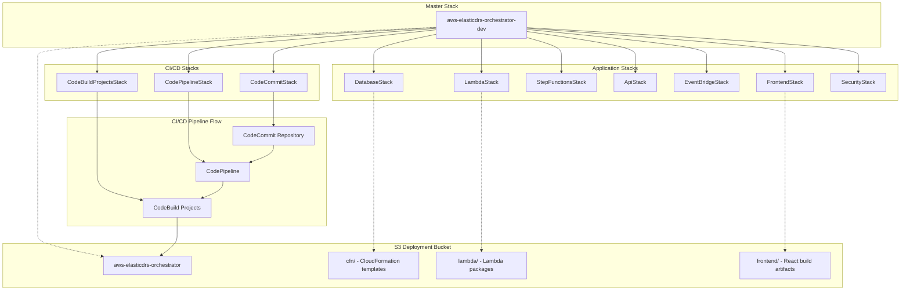

# Fresh Deployment Design Document

## Introduction

This document outlines the design for deploying the complete AWS DRS Orchestration platform to a fresh AWS environment with the project name `aws-elasticdrs-orchestrator` and environment `dev`. The deployment will create a master CloudFormation stack named `aws-elasticdrs-orchestrator-dev` and all associated resources.

## Architecture Overview

The AWS DRS Orchestration platform is a serverless disaster recovery orchestration system built on AWS-native services. The architecture consists of:

### Core Components
- **10 CloudFormation Templates**: 1 master template + 9 nested stacks (including CI/CD)
- **5 Lambda Functions**: Python 3.12 runtime with boto3 and crhelper
- **3 DynamoDB Tables**: protection-groups, recovery-plans, execution-history
- **1 Step Functions State Machine**: Orchestration workflow with waitForTaskToken
- **1 API Gateway**: REST API with 42 endpoints across 12 categories
- **1 Cognito User Pool**: Authentication with JWT tokens
- **1 React Frontend**: CloudScape Design System with S3 + CloudFront hosting
- **1 CodeCommit Repository**: Source code management with GitHub mirroring
- **1 CodePipeline**: 6-stage CI/CD pipeline for automated deployments
- **5 CodeBuild Projects**: Validation, build, test, infrastructure deployment, frontend deployment

### Infrastructure Stack Architecture



## Naming Convention Design

### Resource Naming Pattern
All AWS resources will follow the standardized naming convention:
```
{ProjectName}-{ResourceType}-{Environment}
```

Where:
- **ProjectName**: `aws-elasticdrs-orchestrator`
- **Environment**: `dev`
- **ResourceType**: Specific to each resource (api, lambda, table, etc.)

### Examples
- Master Stack: `aws-elasticdrs-orchestrator-dev`
- API Gateway: `aws-elasticdrs-orchestrator-dev-api`
- Lambda Functions: `aws-elasticdrs-orchestrator-dev-{function-name}`
- DynamoDB Tables: `aws-elasticdrs-orchestrator-dev-{table-name}`
- S3 Buckets: `aws-elasticdrs-orchestrator-{purpose}-{account-id}-dev`

## Deployment Bucket Design

### S3 Bucket Structure
```
s3://aws-elasticdrs-orchestrator/
├── cfn/
│   ├── master-template.yaml
│   ├── database-stack.yaml
│   ├── lambda-stack.yaml
│   ├── step-functions-stack.yaml
│   ├── api-stack-rbac.yaml
│   ├── eventbridge-stack.yaml
│   ├── frontend-stack.yaml
│   ├── security-stack.yaml
│   ├── codecommit-stack.yaml
│   ├── codepipeline-stack.yaml
│   └── codebuild-projects-stack.yaml
├── lambda/
│   ├── api-handler.zip
│   ├── orchestration-engine.zip
│   ├── execution-finder.zip
│   ├── frontend-builder.zip
│   └── cross-account-role-manager.zip
├── frontend/
│   └── build/
│       ├── index.html
│       ├── static/
│       └── aws-config.js
└── buildspecs/
    ├── validate-buildspec.yml
    ├── build-buildspec.yml
    ├── test-buildspec.yml
    ├── deploy-infra-buildspec.yml
    └── deploy-frontend-buildspec.yml
```

### Bucket Configuration
- **Encryption**: AES256 server-side encryption
- **Versioning**: Enabled for rollback capability
- **Public Access**: Blocked (private bucket)
- **Lifecycle**: 90-day retention for old versions

## Infrastructure Component Design

### 1. Database Stack (database-stack.yaml)

**Purpose**: Creates DynamoDB tables for data persistence

**Resources**:
- **ProtectionGroupsTable**: `aws-elasticdrs-orchestrator-dev-protection-groups`
  - Primary Key: `GroupId` (String)
  - GSI: `RegionIndex` on `Region` attribute
  - Billing: On-demand
  
- **RecoveryPlansTable**: `aws-elasticdrs-orchestrator-dev-recovery-plans`
  - Primary Key: `PlanId` (String)
  - GSI: `StatusIndex` on `Status` attribute
  - Billing: On-demand
  
- **ExecutionHistoryTable**: `aws-elasticdrs-orchestrator-dev-execution-history`
  - Primary Key: `ExecutionId` (String)
  - GSI: `PlanIdIndex` on `PlanId` attribute
  - GSI: `TimestampIndex` on `StartTime` attribute
  - Billing: On-demand

**Configuration**:
- Point-in-time recovery enabled
- Encryption at rest with AWS managed keys
- CloudWatch contributor insights enabled

### 2. Lambda Stack (lambda-stack.yaml)

**Purpose**: Deploys serverless compute functions

**Functions**:
1. **API Handler**: `aws-elasticdrs-orchestrator-dev-api-handler`
   - Runtime: Python 3.12
   - Memory: 512 MB
   - Timeout: 30 seconds
   - Environment: DynamoDB table names, region

2. **Orchestration Engine**: `aws-elasticdrs-orchestrator-dev-orchestration-engine`
   - Runtime: Python 3.12
   - Memory: 1024 MB
   - Timeout: 15 minutes
   - Environment: DRS service configuration

3. **Execution Finder**: `aws-elasticdrs-orchestrator-dev-execution-finder`
   - Runtime: Python 3.12
   - Memory: 256 MB
   - Timeout: 5 minutes
   - Environment: Step Functions ARN

4. **Frontend Builder**: `aws-elasticdrs-orchestrator-dev-frontend-builder`
   - Runtime: Python 3.12
   - Memory: 512 MB
   - Timeout: 10 minutes
   - Environment: S3 bucket configuration

5. **Cross Account Role Manager**: `aws-elasticdrs-orchestrator-dev-cross-account-role-manager`
   - Runtime: Python 3.12
   - Memory: 256 MB
   - Timeout: 5 minutes
   - Environment: Secrets Manager ARN

**IAM Roles**:
- Each function has dedicated execution role with least-privilege permissions
- DRS service permissions for orchestration engine
- DynamoDB read/write permissions for API handler
- S3 permissions for frontend builder

### 3. Step Functions Stack (step-functions-stack.yaml)

**Purpose**: Orchestrates wave-based recovery execution

**State Machine**: `aws-elasticdrs-orchestrator-dev-orchestration`
- **Pattern**: Archive pattern with OutputPath (Lambda owns all state)
- **Callback Support**: waitForTaskToken for pause/resume functionality
- **Error Handling**: Retry policies and failure states
- **Timeout**: 1 year maximum for long-running operations

**States**:
1. `InitiateWavePlan` - Initialize recovery plan execution
2. `DetermineWavePlanState` - Check overall plan status
3. `DetermineWaveState` - Check current wave status
4. `WaitForWaveUpdate` - Polling delay between status checks
5. `WaitForResume` - Pause state with callback token
6. `ResumeWavePlan` - Resume after manual approval
7. `UpdateWaveStatus` - Poll DRS job status
8. `PlanCompleted` - Success state
9. `PlanFailed` / `PlanTimeout` - Failure states

### 4. API Stack (api-stack-rbac.yaml)

**Purpose**: Provides REST API with authentication

**API Gateway**: `aws-elasticdrs-orchestrator-dev-api`
- **Type**: REST API
- **Authentication**: Cognito User Pool authorizer
- **CORS**: Enabled for frontend integration
- **Throttling**: 10,000 requests per second burst, 5,000 steady state

**Cognito User Pool**: `aws-elasticdrs-orchestrator-dev-users`
- **Password Policy**: 8+ characters, mixed case, numbers, special characters
- **MFA**: Optional (SMS/TOTP)
- **Email Verification**: Required
- **Token Expiration**: 45 minutes

**Test User Configuration**:
- **Email**: testuser@example.com
- **Password**: TestPassword123!
- **Groups**: AdminGroup, OperatorGroup (for comprehensive API testing)
- **Purpose**: Automated API testing and validation in CI/CD pipeline
- **MFA**: Disabled for automated testing

**RBAC Groups**:
- **AdminGroup**: Full administrative access to all API endpoints
- **OperatorGroup**: DRS operations and monitoring capabilities
- **ViewerGroup**: Read-only access to system resources
- **TestGroup**: Comprehensive testing access (includes Admin + Operator permissions)

**API Endpoints** (42 total across 12 categories):
- Protection Groups: CRUD operations
- Recovery Plans: CRUD operations
- Executions: Start, pause, resume, status
- DRS Integration: Server discovery, job monitoring
- Cross-Account: Role management
- Health Checks: System status

### 5. EventBridge Stack (eventbridge-stack.yaml)

**Purpose**: Scheduled automation and event-driven workflows

**Rules**:
- **Weekly Drill**: Saturday 6 AM UTC for Wave 1 servers
- **Monthly Full Drill**: First day of month (disabled by default)
- **Manual Trigger**: Custom event pattern for API triggers
- **Tag Sync**: Every 4 hours for DRS server tag synchronization

**Configuration**:
- IAM role for EventBridge to invoke Step Functions and Lambda
- Configurable schedules via parameters
- Event filtering by tags and regions

### 6. Frontend Stack (frontend-stack.yaml)

**Purpose**: Hosts React application with global distribution

**S3 Bucket**: `aws-elasticdrs-orchestrator-fe-{account-id}-dev`
- **Website Hosting**: Static website configuration
- **Encryption**: AES256
- **Versioning**: Enabled
- **Public Access**: Blocked (CloudFront only)

**CloudFront Distribution**:
- **Origin**: S3 bucket with Origin Access Control (OAC)
- **Caching**: Optimized for SPA (Single Page Application)
- **Error Pages**: 403/404 redirect to index.html
- **Compression**: Enabled
- **Price Class**: PriceClass_100 (US, Canada, Europe)

**Frontend Builder**:
- Custom resource Lambda function
- Builds React application with production optimizations
- Generates `aws-config.js` with API endpoints and Cognito configuration
- Uploads to S3 and invalidates CloudFront cache

### 7. Security Stack (security-stack.yaml)

**Purpose**: Security controls and compliance features

**AWS WAF**:
- **Web ACL**: `aws-elasticdrs-orchestrator-dev-waf`
- **Rules**: Rate limiting, IP allowlist, AWS managed rule sets
- **Logging**: CloudWatch Logs integration
- **Association**: API Gateway protection

**CloudTrail**:
- **Trail**: `aws-elasticdrs-orchestrator-dev-trail`
- **S3 Bucket**: `aws-elasticdrs-orchestrator-cloudtrail-{account-id}`
- **Events**: Management events, Lambda invocations, data events
- **Insights**: API call rate analysis

**Secrets Manager**:
- **Secret**: `aws-elasticdrs-orchestrator/drs-credentials`
- **Content**: Cross-account role ARNs, API keys, notification endpoints
- **Rotation**: Placeholder for future enhancement

### 8. CodeCommit Stack (codecommit-stack.yaml)

**Purpose**: Source code management and CI/CD artifact storage

**CodeCommit Repository**: `aws-elasticdrs-orchestrator-dev-repo`
- **GitHub Mirroring**: Automatic synchronization from GitHub repository
- **Branch Protection**: Main branch protection rules
- **Access Control**: IAM-based repository access
- **Triggers**: EventBridge integration for pipeline automation

**S3 Artifact Bucket**: `aws-elasticdrs-orchestrator-artifacts-{account-id}-dev`
- **Purpose**: CodePipeline artifact storage
- **Encryption**: AES256 server-side encryption
- **Versioning**: Enabled for artifact history
- **Lifecycle**: 30-day retention for pipeline artifacts

**IAM Roles**:
- **GitHubMirroringRole**: GitHub to CodeCommit synchronization
- **PipelineArtifactRole**: CodePipeline artifact access
- **RepositoryAccessRole**: Developer and service access

### 9. CodePipeline Stack (codepipeline-stack.yaml)

**Purpose**: Automated CI/CD pipeline for deployment automation

**CodePipeline**: `aws-elasticdrs-orchestrator-dev-pipeline`
- **Trigger**: CodeCommit repository changes on main branch
- **Stages**: 6-stage pipeline (Source, Validate, Build, Test, Deploy Infrastructure, Deploy Frontend)
- **Artifacts**: S3-based artifact management between stages
- **Notifications**: SNS integration for pipeline state changes

**SNS Topic Configuration**: `aws-elasticdrs-orchestrator-dev-notifications`
- **Purpose**: CI/CD pipeline notifications and system alerts
- **Subscription**: Email subscription to jocousen@amazon.com
- **Events**: Pipeline started, succeeded, failed, stage failures
- **Message Format**: JSON with pipeline details and CloudWatch logs links

**Pipeline Stages**:
1. **Source Stage**: CodeCommit source action
2. **Validate Stage**: CloudFormation template validation and code quality checks
3. **Build Stage**: Lambda packaging and frontend build
4. **Test Stage**: Unit tests and integration tests
5. **Deploy Infrastructure Stage**: CloudFormation stack deployment
6. **Deploy Frontend Stage**: S3 sync and CloudFront invalidation

**Service Role**: `aws-elasticdrs-orchestrator-dev-pipeline-role`
- **Permissions**: CodeCommit, CodeBuild, CloudFormation, S3, IAM, SNS
- **Cross-Service**: Integration with all AWS services used in pipeline

### 10. CodeBuild Projects Stack (codebuild-projects-stack.yaml)

**Purpose**: Build and deployment automation projects

**Validate Project**: `aws-elasticdrs-orchestrator-dev-validate`
- **Runtime**: Python 3.12, Node.js 22
- **Purpose**: CloudFormation template validation, Python PEP 8 compliance, TypeScript checking
- **BuildSpec**: `buildspecs/validate-buildspec.yml`
- **Timeout**: 10 minutes

**Build Project**: `aws-elasticdrs-orchestrator-dev-build`
- **Runtime**: Python 3.12, Node.js 22
- **Purpose**: Lambda function packaging, React frontend build
- **BuildSpec**: `buildspecs/build-buildspec.yml`
- **Timeout**: 15 minutes

**Test Project**: `aws-elasticdrs-orchestrator-dev-test`
- **Runtime**: Python 3.12, Node.js 22
- **Purpose**: Unit tests, integration tests, coverage reporting
- **BuildSpec**: `buildspecs/test-buildspec.yml`
- **Timeout**: 20 minutes

**Deploy Infrastructure Project**: `aws-elasticdrs-orchestrator-dev-deploy-infra`
- **Runtime**: Python 3.12
- **Purpose**: CloudFormation stack deployment, S3 artifact upload
- **BuildSpec**: `buildspecs/deploy-infra-buildspec.yml`
- **Timeout**: 30 minutes

**Deploy Frontend Project**: `aws-elasticdrs-orchestrator-dev-deploy-frontend`
- **Runtime**: Python 3.12
- **Purpose**: Frontend deployment, CloudFront invalidation
- **BuildSpec**: `buildspecs/deploy-frontend-buildspec.yml`
- **Timeout**: 15 minutes

**IAM Roles**:
- Each CodeBuild project has dedicated service role with least-privilege permissions
- CloudFormation deployment permissions for infrastructure project
- S3 and CloudFront permissions for frontend project

## Parameter Configuration Design

### Master Template Parameters
```yaml
Parameters:
  ProjectName:
    Type: String
    Default: aws-elasticdrs-orchestrator
    Description: Project name for resource naming
    
  Environment:
    Type: String
    Default: dev
    AllowedValues: [dev, test, prod]
    Description: Environment name
    
  DeploymentBucketName:
    Type: String
    Default: aws-elasticdrs-orchestrator
    Description: S3 bucket containing deployment artifacts
    
  BucketSuffix:
    Type: String
    Default: v1
    Description: Unique suffix for resource naming
    
  GitHubRepositoryURL:
    Type: String
    Description: GitHub repository URL for CodeCommit mirroring
    Default: https://github.com/johnjcousens/aws-elasticdrs-orchestrator
    
  AdminEmail:
    Type: String
    Description: Administrator email for CI/CD notifications and alerts
    Default: jocousen@amazon.com
    AllowedPattern: ^[^\s@]+@[^\s@]+\.[^\s@]+$
    
  TestUserEmail:
    Type: String
    Description: Test user email for automated API testing and validation
    Default: testuser@example.com
    AllowedPattern: ^[^\s@]+@[^\s@]+\.[^\s@]+$
    
  TestUserPassword:
    Type: String
    Description: Test user password for automated API testing
    Default: TestPassword123!
    NoEcho: true
    MinLength: 8
    AllowedPattern: ^(?=.*[a-z])(?=.*[A-Z])(?=.*\d)(?=.*[@$!%*?&])[A-Za-z\d@$!%*?&]{8,}$
    ConstraintDescription: Password must contain at least 8 characters with uppercase, lowercase, number, and special character
    
  EnableAutomatedDeployment:
    Type: String
    Default: true
    AllowedValues: [true, false]
    Description: Enable automated CI/CD pipeline deployment
    
  NotificationEmail:
    Type: String
    Description: Email address for CI/CD pipeline notifications and system alerts
    Default: jocousen@amazon.com
    AllowedPattern: ^[^\s@]+@[^\s@]+\.[^\s@]+$
    ConstraintDescription: Must be a valid email address
```

### Environment-Specific Configuration
- **Dev Environment**: Smaller instance sizes, shorter retention periods
- **Resource Tagging**: All resources tagged with Project and Environment
- **Monitoring**: CloudWatch logs with 30-day retention
- **Backup**: Point-in-time recovery for DynamoDB

## Deployment Process Design

### Phase 1: Pre-Deployment Setup
1. **Create S3 Deployment Bucket**
   ```bash
   aws s3 mb s3://aws-elasticdrs-orchestrator
   ```

2. **Upload CloudFormation Templates**
   ```bash
   aws s3 sync cfn/ s3://aws-elasticdrs-orchestrator/cfn/
   ```

3. **Upload BuildSpec Files**
   ```bash
   aws s3 sync buildspecs/ s3://aws-elasticdrs-orchestrator/buildspecs/
   ```

4. **Package and Upload Lambda Functions**
   ```bash
   # For each Lambda function
   cd lambda/{function-name}
   zip -r ../../{function-name}.zip . -x "*.pyc" "__pycache__/*"
   aws s3 cp ../../{function-name}.zip s3://aws-elasticdrs-orchestrator/lambda/
   ```

### Phase 2: Infrastructure Deployment
1. **Deploy Master Stack with CI/CD**
   ```bash
   aws cloudformation create-stack \
     --stack-name aws-elasticdrs-orchestrator-dev \
     --template-url https://s3.amazonaws.com/aws-elasticdrs-orchestrator/cfn/master-template.yaml \
     --parameters ParameterKey=ProjectName,ParameterValue=aws-elasticdrs-orchestrator \
                  ParameterKey=Environment,ParameterValue=dev \
                  ParameterKey=DeploymentBucketName,ParameterValue=aws-elasticdrs-orchestrator \
                  ParameterKey=GitHubRepositoryURL,ParameterValue=https://github.com/johnjcousens/aws-elasticdrs-orchestrator \
                  ParameterKey=AdminEmail,ParameterValue=admin@company.com \
                  ParameterKey=EnableAutomatedDeployment,ParameterValue=true \
     --capabilities CAPABILITY_NAMED_IAM
   ```

2. **Monitor Stack Creation**
   - Database Stack: ~5 minutes
   - Lambda Stack: ~10 minutes
   - Step Functions Stack: ~3 minutes
   - API Stack: ~15 minutes (Cognito User Pool creation)
   - EventBridge Stack: ~2 minutes
   - Frontend Stack: ~20 minutes (CloudFront distribution)
   - Security Stack: ~10 minutes
   - CodeCommit Stack: ~5 minutes
   - CodePipeline Stack: ~8 minutes
   - CodeBuild Projects Stack: ~5 minutes

### Phase 3: CI/CD Pipeline Setup
1. **Initialize CodeCommit Repository**
   ```bash
   # Clone the new CodeCommit repository
   git clone https://git-codecommit.{region}.amazonaws.com/v1/repos/aws-elasticdrs-orchestrator-dev-repo
   
   # Add GitHub as remote and push initial code
   cd aws-elasticdrs-orchestrator-dev-repo
   git remote add github https://github.com/johnjcousens/aws-elasticdrs-orchestrator
   git pull github main
   git push origin main
   ```

2. **Configure GitHub Mirroring**
   - GitHub webhook automatically configured via CloudFormation
   - CodeCommit repository receives updates from GitHub pushes
   - Pipeline triggers on CodeCommit repository changes

3. **Verify Pipeline Execution**
   ```bash
   # Check pipeline status
   aws codepipeline get-pipeline-state --name aws-elasticdrs-orchestrator-dev-pipeline
   
   # Monitor pipeline execution
   aws codepipeline list-pipeline-executions --pipeline-name aws-elasticdrs-orchestrator-dev-pipeline
   ```

### Phase 4: Frontend Deployment (Automated via Pipeline)
1. **Automated Build Process**
   - CodeBuild automatically builds React application
   - Generates production-optimized assets
   - Creates aws-config.js with CloudFormation outputs

2. **Automated Deployment**
   - Uploads frontend assets to S3 bucket
   - Configures proper caching headers
   - Invalidates CloudFront cache

3. **Verification**
   - Pipeline validates deployment success
   - Health checks confirm application functionality

### Phase 5: Validation and Testing
1. **Automated Validation via Pipeline**
   ```bash
   # Pipeline automatically runs:
   # - CloudFormation template validation
   # - Python PEP 8 compliance checks
   # - TypeScript type checking
   # - Unit and integration tests
   ```

2. **Manual Verification**
   ```bash
   # API Gateway Health Check
   curl -X GET https://{api-id}.execute-api.{region}.amazonaws.com/prod/health
   
   # Frontend Accessibility
   # Access CloudFront URL from stack outputs
   ```

3. **CI/CD Pipeline Validation**
   - All 6 pipeline stages complete successfully
   - Build artifacts stored in S3
   - Deployment logs available in CloudWatch

## Security Design

### Authentication and Authorization
- **Cognito User Pool**: JWT-based authentication
- **API Gateway Authorizer**: Validates JWT tokens
- **IAM Roles**: Least-privilege access for Lambda functions
- **Cross-Account Roles**: Secure DRS operations across AWS accounts

### Network Security
- **WAF Protection**: Rate limiting, IP filtering, managed rule sets
- **API Gateway**: HTTPS only, CORS configuration
- **S3 Buckets**: Private with CloudFront OAC access
- **VPC**: Not required (serverless architecture)

### Data Protection
- **Encryption at Rest**: DynamoDB, S3, Secrets Manager
- **Encryption in Transit**: HTTPS/TLS for all communications
- **Secrets Management**: AWS Secrets Manager for credentials
- **Audit Trail**: CloudTrail for all API calls

### Compliance Features
- **CloudTrail**: Comprehensive audit logging
- **CloudWatch**: Monitoring and alerting
- **WAF Logging**: Security event tracking
- **Data Retention**: Configurable retention policies

## Monitoring and Observability Design

### CloudWatch Integration
- **Lambda Logs**: `/aws/lambda/{function-name}`
- **API Gateway Logs**: Execution and access logs
- **Step Functions**: Execution history and metrics
- **DynamoDB**: Performance and throttling metrics

### Alarms and Notifications
- **API Gateway**: 4XX/5XX error rates
- **Lambda**: Error rates and duration
- **DynamoDB**: Throttling and capacity
- **Step Functions**: Execution failures

### Dashboards
- **Operational Dashboard**: Real-time system health
- **Security Dashboard**: WAF blocks, authentication failures
- **Performance Dashboard**: Response times, throughput

## Scalability and Performance Design

### Auto-Scaling Components
- **Lambda Functions**: Automatic concurrency scaling
- **DynamoDB**: On-demand billing with auto-scaling
- **API Gateway**: Built-in throttling and caching
- **CloudFront**: Global edge locations

### Performance Optimizations
- **Lambda**: Optimized memory allocation and timeout settings
- **DynamoDB**: Efficient query patterns with GSIs
- **CloudFront**: Caching strategies for static assets
- **API Gateway**: Response caching for read operations

### Capacity Planning
- **Dev Environment**: Conservative limits for cost optimization
- **Monitoring**: CloudWatch metrics for capacity planning
- **Alerts**: Proactive notifications for capacity issues

## Disaster Recovery Design

### Backup Strategy
- **DynamoDB**: Point-in-time recovery enabled
- **S3**: Versioning and cross-region replication (optional)
- **CloudFormation**: Infrastructure as Code for reproducibility
- **Lambda**: Source code in version control

### Recovery Procedures
- **Infrastructure**: Redeploy from CloudFormation templates
- **Data**: Restore from DynamoDB backups
- **Application**: Redeploy from S3 deployment bucket
- **Configuration**: Parameter store and Secrets Manager

### Business Continuity
- **Multi-AZ**: DynamoDB and Lambda automatically multi-AZ
- **Regional**: Single region deployment (dev environment)
- **Failover**: Manual failover procedures documented
- **Testing**: Regular DR drill execution

## Cost Optimization Design

### Resource Sizing
- **Lambda**: Right-sized memory allocation
- **DynamoDB**: On-demand billing for variable workloads
- **CloudFront**: PriceClass_100 for cost optimization
- **S3**: Lifecycle policies for old versions

### Cost Monitoring
- **Tagging**: Consistent tagging for cost allocation
- **Budgets**: AWS Budgets for cost alerts
- **Usage**: CloudWatch metrics for resource utilization
- **Optimization**: Regular review and rightsizing

## Implementation Considerations

### Prerequisites
- AWS CLI configured with appropriate permissions
- Node.js 18+ for frontend build
- Python 3.12 for Lambda development
- Git for source code management

### Deployment Dependencies
1. S3 deployment bucket must exist before stack creation
2. Lambda packages must be uploaded before stack deployment
3. Frontend build must complete before frontend stack deployment
4. BuildSpec files must be uploaded to S3 before CodeBuild projects deployment
5. All nested stacks deploy in parallel where possible
6. CI/CD stacks must be deployed before pipeline can execute

### Rollback Strategy
- **CloudFormation**: Automatic rollback on failure
- **Lambda**: Previous version retention
- **Frontend**: S3 versioning for quick rollback
- **Database**: Point-in-time recovery for data issues

### Maintenance Windows
- **Lambda Updates**: Zero-downtime deployments
- **API Gateway**: Staged deployments
- **Frontend**: CloudFront cache invalidation
- **Database**: Online schema changes

## Success Criteria

### Functional Requirements
- [ ] All 7 CloudFormation stacks deploy successfully
- [ ] All 5 Lambda functions operational
- [ ] API Gateway responds to health checks
- [ ] Frontend loads and authenticates users
- [ ] DRS integration functional
- [ ] Step Functions executes test workflow

### Non-Functional Requirements
- [ ] API response time < 2 seconds
- [ ] Frontend load time < 5 seconds
- [ ] 99.9% availability target
- [ ] Security controls operational
- [ ] Monitoring and alerting active
- [ ] Cost within budget parameters

### Validation Checklist
- [ ] Master stack status: CREATE_COMPLETE
- [ ] All nested stacks: CREATE_COMPLETE
- [ ] Lambda functions: No errors in logs
- [ ] API Gateway: Health endpoint returns 200
- [ ] Cognito: User registration/login works
- [ ] Frontend: Accessible via CloudFront URL
- [ ] DynamoDB: Tables created with correct schema
- [ ] Step Functions: Test execution completes
- [ ] CloudWatch: Logs and metrics flowing
- [ ] WAF: Rules active and logging

## Risk Mitigation

### Technical Risks
- **CloudFormation Limits**: Use nested stacks to avoid resource limits
- **Lambda Cold Starts**: Provisioned concurrency for critical functions
- **API Gateway Throttling**: Implement client-side retry logic
- **DynamoDB Hot Partitions**: Design efficient partition keys

### Operational Risks
- **Deployment Failures**: Comprehensive testing in dev environment
- **Configuration Drift**: Infrastructure as Code enforcement
- **Access Management**: Least-privilege IAM policies
- **Data Loss**: Regular backups and point-in-time recovery

### Security Risks
- **Unauthorized Access**: Multi-factor authentication and WAF protection
- **Data Breaches**: Encryption at rest and in transit
- **API Abuse**: Rate limiting and monitoring
- **Cross-Account Access**: Secure role assumption patterns

## Correctness Properties

*A property is a characteristic or behavior that should hold true across all valid executions of a system-essentially, a formal statement about what the system should do. Properties serve as the bridge between human-readable specifications and machine-verifiable correctness guarantees.*

Based on the prework analysis of the acceptance criteria, the following correctness properties have been identified to validate the fresh deployment system:

### Property 1: Resource Naming Consistency
*For any* AWS resource created during deployment, the resource name should follow the pattern `{ProjectName}-{ResourceType}-{Environment}` where ProjectName is `aws-elasticdrs-orchestrator` and Environment is `dev`
**Validates: Requirements 1.2, 1.3, 4.2, 5.1, 6.1, 7.1, 8.1, 9.2**

### Property 2: S3 Deployment Bucket Structure Integrity
*For any* artifact uploaded to the deployment bucket, it should be placed in the correct prefix (`cfn/`, `lambda/`, or `frontend/`) and be accessible by CloudFormation during stack deployment
**Validates: Requirements 2.2, 2.3, 2.4**

### Property 3: Parameter Propagation Consistency
*For any* nested CloudFormation stack, all parameters should be consistently propagated from the master stack to maintain naming conventions and environment-specific configurations
**Validates: Requirements 3.1, 3.2, 3.3, 3.4**

### Property 4: Lambda Function Configuration Completeness
*For any* deployed Lambda function, it should have the correct IAM role, environment variables, and be able to access its required AWS services (DynamoDB, DRS, S3)
**Validates: Requirements 4.3, 4.4, 4.5**

### Property 5: API Gateway Integration Functionality
*For any* API endpoint configured in API Gateway, it should be properly integrated with its corresponding Lambda function and return a valid response when invoked with proper authentication
**Validates: Requirements 5.2, 5.3, 5.4, 5.5**

### Property 6: DynamoDB Table Schema Correctness
*For any* DynamoDB table created during deployment, it should have the correct primary key, global secondary indexes, and be accessible by Lambda functions with proper permissions
**Validates: Requirements 6.2, 6.3, 6.5**

### Property 7: Frontend Deployment Completeness
*For any* frontend deployment, the React application should be built successfully, uploaded to S3, served through CloudFront, and the aws-config.js file should contain correct API endpoints and Cognito configuration
**Validates: Requirements 7.2, 7.3, 7.4, 7.5**

### Property 8: Authentication System Integration
*For any* user authentication attempt, the Cognito User Pool should validate credentials according to the configured password policy and issue valid JWT tokens that are accepted by the API Gateway authorizer
**Validates: Requirements 8.2, 8.3, 8.4, 8.5**

### Property 9: CloudFormation Stack Deployment Success
*For any* CloudFormation stack deployment, all stacks should reach CREATE_COMPLETE status without errors and all resources should be created with the correct configurations
**Validates: Requirements 10.1, 10.2, 10.3, 10.4, 10.5**

### Property 10: Environment Configuration Isolation
*For any* resource created in the dev environment, it should be properly tagged with Environment=dev and isolated from other environments through naming conventions and access controls
**Validates: Requirements 11.1, 11.2, 11.3, 11.5**

### Property 11: Deployment Validation Round-Trip
*For any* completed deployment, the system should be able to validate its own functionality by testing API endpoints, Lambda invocations, database access, and frontend loading
**Validates: Requirements 10.2, 10.3, 10.4, 10.5**

### Property 12: Resource Documentation Completeness
*For any* deployed stack, all important outputs (URLs, resource names, ARNs) should be captured and documented for team access and troubleshooting
**Validates: Requirements 12.2, 12.3, 12.5**

## Error Handling

The deployment system implements comprehensive error handling at multiple levels:

### CloudFormation Level
- **Stack Rollback**: Automatic rollback on any resource creation failure
- **Dependency Management**: Proper DependsOn attributes to ensure correct creation order
- **Parameter Validation**: Input validation for all parameters before deployment
- **Resource Limits**: Monitoring of CloudFormation service limits

### Lambda Level
- **Exception Handling**: Comprehensive try-catch blocks with proper error logging
- **Retry Logic**: Exponential backoff for transient AWS service errors
- **Timeout Management**: Appropriate timeout settings for each function
- **Dead Letter Queues**: For failed asynchronous invocations

### API Gateway Level
- **HTTP Status Codes**: Proper status codes for different error conditions
- **Error Response Format**: Consistent error response structure
- **Rate Limiting**: Throttling protection with appropriate error messages
- **CORS Errors**: Proper CORS configuration to prevent browser errors

### Frontend Level
- **Network Errors**: Graceful handling of API connectivity issues
- **Authentication Errors**: Clear error messages for login failures
- **Loading States**: Proper loading indicators during API calls
- **Error Boundaries**: React error boundaries to catch component errors

## Testing Strategy

The fresh deployment system requires both unit testing and property-based testing to ensure correctness:

### Unit Testing
- **CloudFormation Template Validation**: AWS CLI validate-template for syntax
- **Lambda Function Testing**: Individual function testing with mock AWS services
- **API Endpoint Testing**: Specific endpoint testing with known inputs
- **Frontend Component Testing**: React component testing with Jest and React Testing Library

### Property-Based Testing
- **Deployment Property Tests**: Validate universal properties across all deployments
- **Configuration Property Tests**: Test parameter propagation across different configurations
- **Integration Property Tests**: Verify end-to-end functionality across random inputs
- **Security Property Tests**: Validate security controls across different scenarios

**Property Test Configuration**:
- Minimum 100 iterations per property test
- Each property test references its design document property
- Tag format: **Feature: fresh-deployment, Property {number}: {property_text}**

**Testing Framework**: 
- Python: pytest with hypothesis for property-based testing
- JavaScript: Jest with fast-check for property-based testing
- CloudFormation: cfn-lint and AWS CLI validation
- Integration: Custom test scripts with AWS SDK

This design document provides the comprehensive blueprint for deploying the AWS DRS Orchestration platform to a fresh environment with the specified naming conventions and configuration requirements.