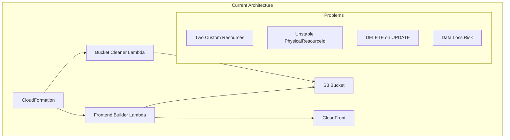
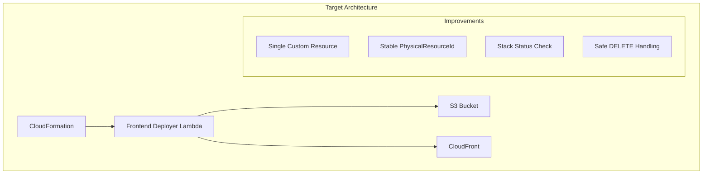
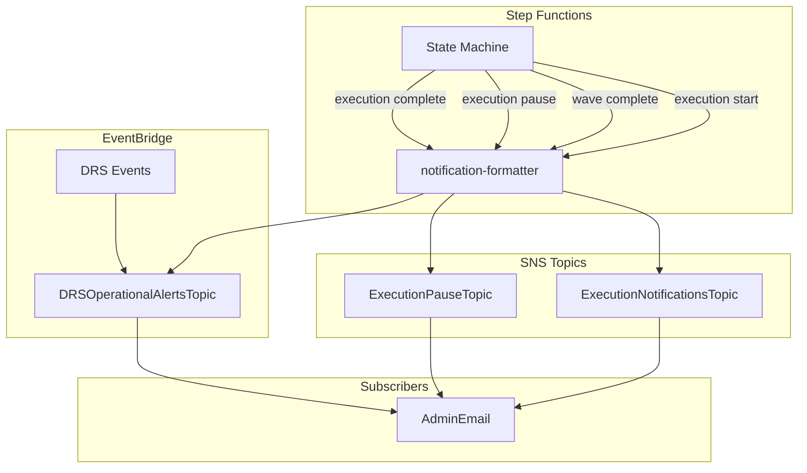

# Design Document

## Overview

This design document describes the technical implementation for hardening the frontend deployment architecture of the DRS Orchestration Platform. The design consolidates frontend deployment and bucket cleanup into a single Lambda function, implements stable resource identity to prevent CloudFormation replacement behavior, and simplifies the notification architecture.

## Architecture

### Current Architecture (Problems)



### Target Architecture (Solution)



### Notification Architecture



## Components

### Component 1: Frontend Deployer Lambda

**Purpose:** Consolidated Lambda function handling frontend deployment (CREATE/UPDATE) and bucket cleanup (DELETE) with stable resource identity.

**File:** `lambda/frontend-deployer/index.py`

**Key Design Decisions:**

1. **Stable PhysicalResourceId**: Use `frontend-deployer-{bucket_name}` as the PhysicalResourceId. This deterministic ID prevents CloudFormation from treating UPDATE operations as resource replacements.

2. **Stack Status Check on DELETE**: Before any bucket cleanup, check the CloudFormation stack status. Only empty the bucket if the stack status contains "DELETE_IN_PROGRESS". Skip cleanup for UPDATE operations, rollbacks, and any other scenario.

3. **Graceful Error Handling**: DELETE operations always return SUCCESS to allow stack deletion to continue, even if cleanup fails.

**Interface:**

```python
# CloudFormation Custom Resource Properties
{
    "BucketName": "string",           # Required: Target S3 bucket
    "DistributionId": "string",       # Required: CloudFront distribution ID
    "SourceBucket": "string",         # Required: Source bucket with frontend code
    "ApiEndpoint": "string",          # Required: API Gateway endpoint
    "UserPoolId": "string",           # Required: Cognito User Pool ID
    "UserPoolClientId": "string",     # Required: Cognito User Pool Client ID
    "IdentityPoolId": "string",       # Optional: Cognito Identity Pool ID
    "Region": "string",               # Required: AWS region
    "BuildTimestamp": "string"        # Optional: Forces redeployment when changed
}
```

**PhysicalResourceId Logic:**

```python
def get_physical_resource_id(bucket_name: str) -> str:
    """Generate stable PhysicalResourceId based on bucket name."""
    return f"frontend-deployer-{bucket_name}"
```

**Stack Status Check Logic:**

```python
def should_empty_bucket(stack_id: str) -> bool:
    """Determine if bucket should be emptied based on stack status."""
    try:
        cfn = boto3.client("cloudformation")
        response = cfn.describe_stacks(StackName=stack_id)
        stack_status = response["Stacks"][0]["StackStatus"]
        
        # Only empty bucket during actual stack deletion
        if "DELETE" in stack_status:
            return True
        
        # Skip cleanup for UPDATE, ROLLBACK, or any other operation
        return False
    except Exception:
        # If we can't check status, skip cleanup to be safe
        return False
```

### Component 2: Simplified frontend-stack.yaml

**Purpose:** CloudFormation template with single custom resource for frontend deployment.

**File:** `cfn/frontend-stack.yaml`

**Key Changes:**

1. **Remove EmptyFrontendBucketResource**: The separate bucket cleaner custom resource is removed.

2. **Remove BucketCleanerFunctionArn Parameter**: No longer needed since frontend-deployer handles cleanup.

3. **Rename FrontendBuilderFunctionArn**: Rename to `FrontendDeployerFunctionArn` for clarity.

4. **Single Custom Resource**: `BuildAndDeployFrontendResource` handles all operations.

**Template Structure:**

```yaml
Parameters:
  # ... existing parameters ...
  FrontendDeployerFunctionArn:  # Renamed from FrontendBuilderFunctionArn
    Type: String
    Description: 'Frontend Deployer Lambda Function ARN'
  # REMOVED: BucketCleanerFunctionArn

Resources:
  FrontendBucket:
    Type: AWS::S3::Bucket
    # ... existing configuration ...

  CloudFrontDistribution:
    Type: AWS::CloudFront::Distribution
    # ... existing configuration ...

  FrontendBucketPolicy:
    Type: AWS::S3::BucketPolicy
    DependsOn: FrontendDeploymentResource  # Updated dependency
    # ... existing configuration ...

  FrontendDeploymentResource:  # Renamed from BuildAndDeployFrontendResource
    Type: Custom::FrontendDeployer
    DependsOn:
      - FrontendBucket
      - CloudFrontDistribution
    Properties:
      ServiceToken: !Ref FrontendDeployerFunctionArn
      BucketName: !Ref FrontendBucket
      DistributionId: !Ref CloudFrontDistribution
      # ... other properties ...

  # REMOVED: EmptyFrontendBucketResource
```

### Component 3: Updated master-template.yaml Parameters

**Purpose:** Simplify parameters by removing unused/dangerous options and consolidating notification configuration.

**Parameters to KEEP:**

| Parameter | Type | Default | Description |
|-----------|------|---------|-------------|
| ProjectName | String | aws-elasticdrs-orchestrator | Project name for resource naming |
| Environment | String | dev | Environment name |
| SourceBucket | String | aws-elasticdrs-orchestrator | S3 bucket for templates and code |
| AdminEmail | String | (required) | Email for all notifications |
| EnableNotifications | String | false | Enable email notifications |
| CrossAccountRoleName | String | '' | Pre-existing role name or empty to create |

**Parameters to REMOVE:**

| Parameter | Reason |
|-----------|--------|
| EnablePipelineNotifications | CodePipeline remnant - replaced by EnableNotifications |
| NotificationEmail | Simplify to just AdminEmail |
| EnableWAF | WAF not implemented |
| EnableSecurityStack | SecurityStack not developed |
| EnableSecretsManager | Unused parameter |
| EnableTerminationProtection | Set via CLI at stack creation |
| EnableTagSync | Hardcode to always enabled |
| ForceRecreation | Dangerous internal migration hack |
| EnableCloudTrail | Integrate by default (not optional) |
| TagSyncIntervalHours | Hardcode to 1 hour (internal detail) |
| ApiDeploymentTimestamp | Internal deployment mechanism (deploy.sh handles) |
| FrontendBuildTimestamp | Internal deployment mechanism (deploy.sh handles) |
| CognitoDomainPrefix | Unused - condition exists but never referenced |

**Hardcoded Internal Values:**

| Setting | Value | Location |
|---------|-------|----------|
| TagSyncIntervalHours | 1 | eventbridge-stack.yaml |
| ApiDeploymentTimestamp | Generated by deploy.sh | deploy.sh script |
| FrontendBuildTimestamp | Generated by deploy.sh | deploy.sh script |

### Component 4: Updated notification-stack.yaml

**Purpose:** Simplify notification architecture with single email recipient and repurposed topics.

**Key Changes:**

1. **Remove NotificationEmail Parameter**: Use only AdminEmail for all notifications.

2. **Rename ApprovalWorkflowTopic**: Rename to `ExecutionPauseTopic` for clarity.

3. **Remove PipelineNotificationsTopic**: CodePipeline remnant (if exists).

4. **Conditional Subscriptions**: Only create email subscriptions when EnableNotifications is true.

**SNS Topics:**

| Topic | Purpose | Subscribers |
|-------|---------|-------------|
| ExecutionNotificationsTopic | Execution start, completion, wave completion | AdminEmail (when enabled) |
| ExecutionPauseTopic | Pause/resume notifications | AdminEmail (when enabled) |
| DRSOperationalAlertsTopic | DRS failure alerts from EventBridge | AdminEmail (always) |

**Template Changes:**

```yaml
Parameters:
  # REMOVED: NotificationEmail
  AdminEmail:
    Type: String
    Description: 'Admin email for all notifications'
  
  EnableNotifications:
    Type: String
    Default: 'false'
    AllowedValues: ['true', 'false']

Conditions:
  EnableNotificationsCondition: !Equals [!Ref EnableNotifications, 'true']
  # REMOVED: HasNotificationEmail

Resources:
  ExecutionNotificationsTopic:
    Type: AWS::SNS::Topic
    # ... existing configuration ...

  ExecutionNotificationsSubscription:
    Type: AWS::SNS::Subscription
    Condition: EnableNotificationsCondition  # Only when enabled
    Properties:
      Protocol: email
      TopicArn: !Ref ExecutionNotificationsTopic
      Endpoint: !Ref AdminEmail

  # REMOVED: ExecutionNotificationsSubscriptionOptional

  ExecutionPauseTopic:  # Renamed from ApprovalWorkflowTopic
    Type: AWS::SNS::Topic
    Properties:
      TopicName: !Sub '${ProjectName}-execution-pause-${Environment}'
      DisplayName: 'DRS Orchestration Execution Pause Notifications'

  ExecutionPauseSubscription:
    Type: AWS::SNS::Subscription
    Condition: EnableNotificationsCondition
    Properties:
      Protocol: email
      TopicArn: !Ref ExecutionPauseTopic
      Endpoint: !Ref AdminEmail

  DRSOperationalAlertsTopic:
    Type: AWS::SNS::Topic
    # ... existing configuration ...

  DRSOperationalAlertsSubscription:
    Type: AWS::SNS::Subscription
    # Always subscribed - critical alerts
    Properties:
      Protocol: email
      TopicArn: !Ref DRSOperationalAlertsTopic
      Endpoint: !Ref AdminEmail
```

### Component 5: Updated notification-formatter Lambda

**Purpose:** Format JSON events into human-readable emails with support for pause notifications.

**File:** `lambda/notification-formatter/index.py`

**Key Changes:**

1. **Rename Condition**: Use `EnableNotifications` condition instead of `EnablePipelineNotifications`.

2. **Update Notification Types**: Support `execution`, `drs_alert`, and `pause` (renamed from `approval`).

3. **Add Pause Notification Handler**: New handler for execution pause events.

**Notification Types:**

| Type | Topic | Trigger |
|------|-------|---------|
| execution | ExecutionNotificationsTopic | Step Functions on start/complete/wave |
| pause | ExecutionPauseTopic | Step Functions on execution pause |
| drs_alert | DRSOperationalAlertsTopic | EventBridge DRS events |

**Pause Notification Format:**

```python
def handle_pause_notification(event: Dict[str, Any]) -> Dict[str, Any]:
    """Handle execution pause notifications."""
    pause_data = event.get("pauseData", {})
    execution_id = pause_data.get("executionId", "Unknown")
    protection_group_name = pause_data.get("protectionGroupName", "Unknown")
    pause_reason = pause_data.get("pauseReason", "Manual pause")
    
    subject = f"⏸️ Execution Paused: {protection_group_name}"
    
    message = f"""
⏸️ AWS DRS Orchestration - Execution Paused

Execution Details:
• Execution ID: {execution_id}
• Protection Group: {protection_group_name}
• Pause Reason: {pause_reason}
• Timestamp: {timestamp}

To Resume:
Use the DRS Orchestration console or API to resume this execution.

Console URL: {console_url}
"""
    
    return send_notification(PAUSE_TOPIC_ARN, subject, message)
```

### Component 6: Updated lambda-stack.yaml

**Purpose:** Define the consolidated frontend-deployer Lambda and update notification-formatter configuration.

**Key Changes:**

1. **Rename Frontend Builder**: Rename to `FrontendDeployer` with updated description.

2. **Remove Bucket Cleaner**: Remove separate bucket cleaner Lambda definition.

3. **Update Notification Formatter**: Use `EnableNotifications` condition.

4. **Update Outputs**: Export `FrontendDeployerFunctionArn` instead of separate ARNs.

**Lambda Definitions:**

```yaml
FrontendDeployerFunction:
  Type: AWS::Lambda::Function
  Properties:
    FunctionName: !Sub '${ProjectName}-frontend-deployer-${Environment}'
    Description: 'Deploys frontend to S3 and handles bucket cleanup on stack deletion'
    Runtime: python3.11
    Handler: index.lambda_handler
    Timeout: 900  # 15 minutes for large deployments
    MemorySize: 1024
    # ... other configuration ...

# REMOVED: BucketCleanerFunction

NotificationFormatterFunction:
  Type: AWS::Lambda::Function
  Condition: EnableNotificationsCondition  # Updated condition name
  Properties:
    FunctionName: !Sub '${ProjectName}-notification-formatter-${Environment}'
    Environment:
      Variables:
        EXECUTION_NOTIFICATIONS_TOPIC_ARN: !Ref ExecutionNotificationsTopicArn
        DRS_ALERTS_TOPIC_ARN: !Ref DRSAlertsTopicArn
        EXECUTION_PAUSE_TOPIC_ARN: !Ref ExecutionPauseTopicArn  # Updated
        # ... other variables ...
```

### Component 7: Security Utilities Updates

**Purpose:** Ensure defensive security validation that blocks attacks without breaking legitimate operations.

**File:** `lambda/shared/security_utils.py`

**Key Principle:** Security utilities should be defensive (block attacks) NOT offensive (sanitize/modify legitimate data).

**validate_file_path Updates:**

```python
def validate_file_path(path: str) -> str:
    """
    Validate file path for security.
    
    ONLY blocks actual path traversal patterns:
    - '..' (parent directory traversal)
    - URL-encoded variants (%2e%2e, %252e%252e)
    
    ALLOWS legitimate paths:
    - Lambda runtime paths (/var/task/frontend)
    - Temporary directories (/tmp)
    - Absolute paths (required for Lambda operations)
    
    Returns the path unchanged if valid.
    Raises InputValidationError if path traversal detected.
    """
    if not path:
        raise InputValidationError("Path cannot be empty")
    
    # Check for path traversal patterns
    traversal_patterns = [
        '..',           # Direct traversal
        '%2e%2e',       # URL encoded
        '%252e%252e',   # Double URL encoded
    ]
    
    path_lower = path.lower()
    for pattern in traversal_patterns:
        if pattern in path_lower:
            log_security_event("path_traversal_blocked", {"path": path})
            raise InputValidationError(f"Path traversal detected: {path}")
    
    return path  # Return unchanged
```

## Data Models

### Frontend Deployer Event Schema

```json
{
  "RequestType": "Create|Update|Delete",
  "ServiceToken": "arn:aws:lambda:...",
  "ResponseURL": "https://cloudformation-custom-resource-response-...",
  "StackId": "arn:aws:cloudformation:...",
  "RequestId": "unique-request-id",
  "ResourceType": "Custom::FrontendDeployer",
  "LogicalResourceId": "FrontendDeploymentResource",
  "PhysicalResourceId": "frontend-deployer-{bucket-name}",
  "ResourceProperties": {
    "BucketName": "project-fe-123456789012-dev",
    "DistributionId": "E1234567890ABC",
    "SourceBucket": "project-deployment-bucket",
    "ApiEndpoint": "https://api.execute-api.us-east-1.amazonaws.com/prod",
    "UserPoolId": "us-east-1_ABC123",
    "UserPoolClientId": "1234567890abcdef",
    "IdentityPoolId": "us-east-1:12345678-1234-1234-1234-123456789012",
    "Region": "us-east-1",
    "BuildTimestamp": "2026-01-18T12:00:00Z"
  }
}
```

### Pause Notification Event Schema

```json
{
  "notificationType": "pause",
  "pauseData": {
    "executionId": "exec-12345678",
    "protectionGroupName": "Web Tier Servers",
    "recoveryPlanName": "Production DR Plan",
    "pauseReason": "Wave 2 requires manual verification",
    "currentWave": 2,
    "totalWaves": 4,
    "pausedAt": "2026-01-18T12:00:00Z",
    "resumeInstructions": "Verify database connectivity before resuming"
  }
}
```

## Error Handling

### Frontend Deployer Error Handling

| Scenario | Action | Response |
|----------|--------|----------|
| CREATE fails | Log error, return FAILED | Stack creation fails |
| UPDATE fails | Log error, return FAILED | Stack update rolls back |
| DELETE fails | Log error, return SUCCESS | Stack deletion continues |
| Bucket doesn't exist on DELETE | Log info, return SUCCESS | Stack deletion continues |
| Stack status check fails | Skip cleanup, return SUCCESS | Stack deletion continues |
| CloudFront invalidation fails | Log warning, return SUCCESS | Deployment succeeds |

### Notification Formatter Error Handling

| Scenario | Action | Response |
|----------|--------|----------|
| SNS publish fails | Log error, raise exception | Step Functions handles retry |
| Invalid notification type | Log error, return 400 | Caller handles error |
| Missing required fields | Use defaults, log warning | Notification sent with defaults |

## Testing Strategy

### Unit Tests

1. **Frontend Deployer Tests:**
   - Test stable PhysicalResourceId generation
   - Test stack status check logic
   - Test DELETE handling for various stack statuses
   - Test configuration injection
   - Test S3 upload with cache headers

2. **Notification Formatter Tests:**
   - Test execution notification formatting
   - Test pause notification formatting
   - Test DRS alert formatting
   - Test error handling for missing fields

### Integration Tests

1. **CloudFormation Integration:**
   - Test CREATE → UPDATE → DELETE lifecycle
   - Test UPDATE with parameter changes
   - Test rollback scenarios
   - Test stack deletion with non-empty bucket

2. **Notification Integration:**
   - Test Step Functions → notification-formatter → SNS flow
   - Test EventBridge → DRS alerts flow
   - Test email delivery (manual verification)

## Migration Plan

### Phase 1: Lambda Updates (No Stack Changes)

1. Update `security_utils.py` with defensive validation
2. Update `frontend-builder/index.py` with stable PhysicalResourceId and safe DELETE handling
3. Update `bucket-cleaner/index.py` with safe DELETE handling
4. Deploy Lambda code updates via `./scripts/deploy.sh dev --lambda-only`

### Phase 2: Notification Stack Updates

1. Update `notification-stack.yaml` with simplified parameters
2. Rename ApprovalWorkflowTopic to ExecutionPauseTopic
3. Update `notification-formatter/index.py` with pause notification support
4. Deploy via `./scripts/deploy.sh dev`

### Phase 3: Frontend Stack Consolidation

1. Create new `frontend-deployer` Lambda (copy of updated frontend-builder)
2. Update `frontend-stack.yaml` to use single custom resource
3. Update `lambda-stack.yaml` to export FrontendDeployerFunctionArn
4. Remove BucketCleanerFunctionArn parameter from frontend-stack.yaml
5. Deploy via `./scripts/deploy.sh dev`

### Phase 4: Master Template Cleanup

1. Remove deprecated parameters from `master-template.yaml`
2. Update parameter references in nested stacks
3. Update deploy.sh script with new parameter names
4. Deploy via `./scripts/deploy.sh dev`

### Phase 5: Cleanup

1. Remove old `bucket-cleaner` Lambda code (after verification)
2. Remove old `frontend-builder` Lambda code (after verification)
3. Update documentation

## Rollback Plan

### If Phase 1 Fails:
- Revert Lambda code changes
- Redeploy previous Lambda versions

### If Phase 2-4 Fails:
- CloudFormation will automatically rollback stack changes
- Frontend deployer's safe DELETE handling prevents data loss during rollback

### Emergency Recovery:
- If stack enters UPDATE_ROLLBACK_FAILED:
  1. Check CloudFormation events for root cause
  2. Fix the issue in code
  3. Use `aws cloudformation continue-update-rollback` with resources to skip
  4. Redeploy with fixed code

## Dependencies

### External Dependencies

| Dependency | Version | Purpose |
|------------|---------|---------|
| crhelper | 2.0.11 | CloudFormation custom resource helper |
| boto3 | 1.34+ | AWS SDK |
| urllib3 | 2.0+ | HTTP client for CloudFormation responses |

### Internal Dependencies

| Component | Depends On |
|-----------|------------|
| frontend-deployer | security_utils, crhelper |
| notification-formatter | boto3 |
| frontend-stack.yaml | lambda-stack.yaml (FrontendDeployerFunctionArn) |
| notification-stack.yaml | master-template.yaml (EnableNotifications) |

## Acceptance Criteria Mapping

| Requirement | Design Component | Acceptance Criteria |
|-------------|------------------|---------------------|
| Req 1: Consolidated Lambda | Component 1 | Single Lambda handles deploy + cleanup |
| Req 2: Stable Resource Identity | Component 1 | PhysicalResourceId = `frontend-deployer-{bucket}` |
| Req 3: Safe Delete Handling | Component 1 | Stack status check before cleanup |
| Req 4: Defensive Security | Component 7 | Only block actual attacks |
| Req 5: Idempotent Deployments | Component 1 | Overwrite existing files |
| Req 6: Graceful Error Recovery | Component 1 | DELETE always returns SUCCESS |
| Req 7: Rollback Safety | Component 1 | Skip cleanup on ROLLBACK status |
| Req 8: Comprehensive Logging | Component 1 | Structured logging with security events |
| Req 9: Configuration Injection | Component 1 | aws-config.json + aws-config.js |
| Req 10: Cache Control Headers | Component 1 | Proper headers per file type |
| Req 11: Custom Resource Response | Component 1 | crhelper handles responses |
| Req 12: Template Simplification | Component 2 | Single custom resource |
| Req 13: Configurable Bucket | Component 2 | ExistingBucketName parameter |
| Req 14: CI/CD Integration | Component 2 | FrontendBuildTimestamp parameter |
| Req 15: Stack Integration | Component 2 | Preserve all outputs |
| Req 16: Parameter Preservation | Component 3 | Document all parameters |
| Req 17: Notifications | Components 4, 5 | EnableNotifications + pause support |
