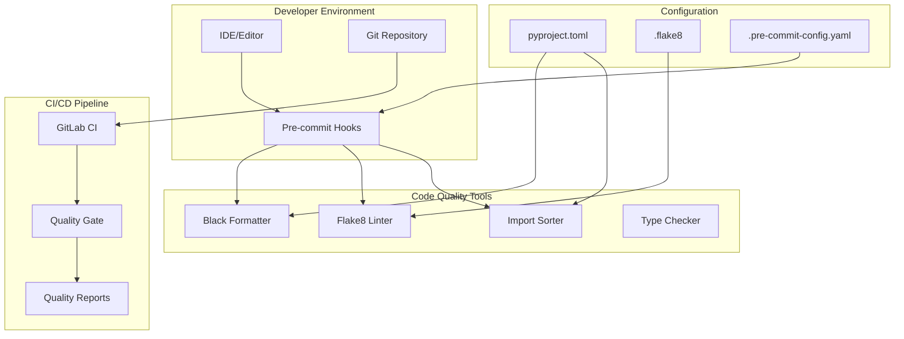

# Design Document: Python Coding Standards Implementation

## Overview

This design document outlines the implementation of Python coding standards based on PEP 8 for the AWS DRS Orchestration project. The solution will provide automated code formatting, linting, and quality checks integrated into the development workflow through pre-commit hooks, CI/CD pipelines, and IDE integration.

The implementation focuses on the project's 5 Python Lambda functions and associated Python code, ensuring consistency, readability, and maintainability across the codebase.

## Architecture

The Python coding standards system follows a multi-layered architecture:



## Components and Interfaces

### 1. Code Formatter (Black)

**Purpose**: Automatically format Python code to comply with PEP 8 standards.

**Key Features**:
- Deterministic formatting (same input always produces same output)
- 88-character line length (slightly longer than PEP 8's 79 for better readability)
- Automatic string quote normalization
- Proper spacing around operators and commas

**Configuration**:
```toml
[tool.black]
line-length = 79  # Strict PEP 8 compliance
target-version = ['py312']
include = '\.pyi?$'
extend-exclude = '''
/(
  # Exclude auto-generated files
  \.eggs
  | \.git
  | \.venv
  | build
  | dist
)/
'''
```

### 2. Linter (Flake8)

**Purpose**: Static code analysis for PEP 8 compliance and code quality issues.

**Key Features**:
- PEP 8 style checking (pycodestyle)
- Logical error detection (pyflakes)
- Cyclomatic complexity analysis (mccabe)
- Extensible plugin system

**Configuration**:
```ini
[flake8]
max-line-length = 79
max-complexity = 10
select = E,W,F,C
ignore = 
    E203,  # Whitespace before ':' (conflicts with Black)
    W503,  # Line break before binary operator (PEP 8 updated)
exclude = 
    .git,
    __pycache__,
    .venv,
    build,
    dist,
    *.egg-info
per-file-ignores =
    __init__.py:F401  # Allow unused imports in __init__.py
```

### 3. Import Sorter (isort)

**Purpose**: Organize and sort Python imports according to PEP 8 guidelines.

**Key Features**:
- Groups imports by type (standard library, third-party, local)
- Alphabetical sorting within groups
- Automatic removal of unused imports
- Black compatibility mode

**Configuration**:
```toml
[tool.isort]
profile = "black"
line_length = 79
multi_line_output = 3
include_trailing_comma = true
force_grid_wrap = 0
use_parentheses = true
ensure_newline_before_comments = true
```

### 4. Pre-commit Framework

**Purpose**: Run code quality checks automatically before commits.

**Configuration**:
```yaml
repos:
  - repo: https://github.com/pre-commit/pre-commit-hooks
    rev: v4.4.0
    hooks:
      - id: trailing-whitespace
      - id: end-of-file-fixer
      - id: check-yaml
      - id: check-added-large-files
      
  - repo: https://github.com/psf/black
    rev: 23.7.0
    hooks:
      - id: black
        language_version: python3.12
        
  - repo: https://github.com/pycqa/isort
    rev: 5.12.0
    hooks:
      - id: isort
      
  - repo: https://github.com/pycqa/flake8
    rev: 6.0.0
    hooks:
      - id: flake8
        additional_dependencies: [flake8-docstrings, flake8-import-order]
```

### 5. CI/CD Integration

**Purpose**: Enforce code quality standards in the deployment pipeline.

**GitLab CI Configuration**:
```yaml
code_quality:
  stage: test
  image: python:3.12-slim
  before_script:
    - pip install black flake8 isort mypy
  script:
    - black --check --diff lambda/
    - flake8 lambda/
    - isort --check-only --diff lambda/
    - mypy lambda/
  artifacts:
    reports:
      codequality: code-quality-report.json
  only:
    - merge_requests
    - main
```

## Data Models

### 1. Configuration Schema

```python
from typing import List, Optional
from pydantic import BaseModel

class BlackConfig(BaseModel):
    line_length: int = 79
    target_version: List[str] = ["py312"]
    include: str = r"\.pyi?$"
    exclude: Optional[str] = None

class Flake8Config(BaseModel):
    max_line_length: int = 79
    max_complexity: int = 10
    select: str = "E,W,F,C"
    ignore: List[str] = ["E203", "W503"]
    exclude: List[str] = [".git", "__pycache__", ".venv"]

class IsortConfig(BaseModel):
    profile: str = "black"
    line_length: int = 79
    multi_line_output: int = 3
    include_trailing_comma: bool = True

class CodingStandardsConfig(BaseModel):
    black: BlackConfig
    flake8: Flake8Config
    isort: IsortConfig
```

### 2. Quality Report Schema

```python
from enum import Enum
from typing import List, Optional
from pydantic import BaseModel

class ViolationType(str, Enum):
    ERROR = "error"
    WARNING = "warning"
    INFO = "info"

class CodeViolation(BaseModel):
    file_path: str
    line_number: int
    column_number: Optional[int]
    violation_type: ViolationType
    rule_code: str
    message: str
    suggested_fix: Optional[str]

class QualityReport(BaseModel):
    timestamp: str
    total_files_checked: int
    total_violations: int
    violations_by_type: dict[ViolationType, int]
    violations: List[CodeViolation]
    compliance_percentage: float
```

## Correctness Properties

*A property is a characteristic or behavior that should hold true across all valid executions of a system—essentially, a formal statement about what the system should do. Properties serve as the bridge between human-readable specifications and machine-verifiable correctness guarantees.*

### Property 1: Indentation Consistency
*For any* Python file processed by the Code_Formatter, all indentation should use exactly 4 spaces per level with no mixed tabs and spaces
**Validates: Requirements 1.1**

### Property 2: Line Length Compliance
*For any* Python file processed by the Code_Formatter, no code line should exceed 79 characters and no docstring line should exceed 72 characters
**Validates: Requirements 1.2**

### Property 3: Operator Spacing Consistency
*For any* Python code processed by the Code_Formatter, operators, commas, and function arguments should have consistent spacing according to PEP 8 rules
**Validates: Requirements 1.3**

### Property 4: Import Organization
*For any* Python file processed by the Code_Formatter, imports should be grouped in the correct order (standard library, third-party, local) with proper spacing
**Validates: Requirements 1.4**

### Property 5: Whitespace Cleanup
*For any* Python file processed by the Code_Formatter, trailing whitespace should be removed and proper blank line spacing should be enforced
**Validates: Requirements 1.5**

### Property 6: Function Naming Validation
*For any* function definition in Python code, the Linter should enforce snake_case naming convention (lowercase with underscores)
**Validates: Requirements 2.1**

### Property 7: Class Naming Validation
*For any* class definition in Python code, the Linter should enforce CapWords (PascalCase) naming convention
**Validates: Requirements 2.2**

### Property 8: Constant Naming Validation
*For any* constant definition in Python code, the Linter should enforce UPPER_CASE naming with underscores
**Validates: Requirements 2.3**

### Property 9: Module Naming Validation
*For any* Python module file, the Linter should enforce lowercase naming with optional underscores
**Validates: Requirements 2.4**

### Property 10: Problematic Variable Name Detection
*For any* single-character variable named 'l', 'O', or 'I', the Linter should flag it as a violation due to visual confusion
**Validates: Requirements 2.5**

### Property 11: Pre-commit Hook Execution
*For any* git commit containing Python code changes, the Pre_Commit_Hook should automatically run PEP 8 validation and prevent commit if violations exist
**Validates: Requirements 4.1**

### Property 12: CI Pipeline Validation
*For any* CI pipeline execution, the Linter should validate all Python files and fail the build when PEP 8 violations are detected
**Validates: Requirements 4.2**

### Property 13: Automatic Code Formatting
*For any* git commit, the Pre_Commit_Hook should automatically format Python code using the Code_Formatter before allowing the commit
**Validates: Requirements 4.3**

### Property 14: Violation Reporting Quality
*For any* PEP 8 violation detected by the Linter, the output should include specific line numbers and actionable fix suggestions
**Validates: Requirements 4.4**

### Property 15: Quality Report Generation
*For any* CI pipeline execution, a code quality report should be generated containing compliance metrics and violation details
**Validates: Requirements 4.5**

### Property 16: Configuration Consistency
*For any* configuration change made to the shared config file, both the Code_Formatter and Linter should apply the same settings consistently
**Validates: Requirements 5.1, 5.2**

### Property 17: Configuration Propagation
*For any* configuration change, the system should apply the new settings to all Python files in the project when tools are executed
**Validates: Requirements 5.3**

### Property 18: Exception Handling Validation
*For any* Python code containing exception handling, the Linter should enforce specific exception types over bare except clauses
**Validates: Requirements 3.2**

### Property 19: Import Cleanliness
*For any* Python file, the Linter should detect and flag unused imports for removal
**Validates: Requirements 3.3**

### Property 20: Docstring Compliance
*For any* public function in Python code, the Linter should validate that docstrings follow PEP 257 conventions
**Validates: Requirements 3.4**

### Property 21: Modern String Formatting
*For any* Python code using string formatting, the Linter should recommend f-string syntax where appropriate over older formatting methods
**Validates: Requirements 3.5**

### Property 22: Test Integration
*For any* test suite execution, PEP 8 validation should be included as part of the testing process
**Validates: Requirements 6.3**

### Property 23: Batch Processing
*For any* batch operation on multiple Python files, the system should process all files consistently and report results for each file
**Validates: Requirements 6.5**

### Property 24: Migration Safety
*For any* legacy code migration, the Code_Formatter should fix PEP 8 violations while preserving the original functionality
**Validates: Requirements 7.1**

### Property 25: Baseline Reporting
*For any* initial linter execution on a codebase, a comprehensive baseline report should be generated showing all current violations
**Validates: Requirements 7.2**

### Property 26: Compliance Metrics Tracking
*For any* series of quality reports over time, the system should provide metrics showing PEP 8 compliance improvement trends
**Validates: Requirements 7.4**

### Property 27: Violation Prioritization
*For any* migration process, critical violations (syntax errors) should be prioritized over style preferences in the fixing order
**Validates: Requirements 7.5**

### Property 28: Educational Error Messages
*For any* PEP 8 violation detected, the Linter should provide educational messages that explain the rule and its rationale
**Validates: Requirements 8.4**

## Error Handling

### 1. Tool Execution Failures

**Black Formatter Failures**:
- **Syntax Errors**: When Black encounters invalid Python syntax, it should exit with error code 1 and provide clear error messages pointing to the problematic line
- **File Access Issues**: Handle permission errors and file locks gracefully with retry mechanisms
- **Configuration Errors**: Validate pyproject.toml configuration and provide helpful error messages for invalid settings

**Flake8 Linter Failures**:
- **Plugin Loading Errors**: Gracefully handle missing or incompatible plugins with fallback to core functionality
- **Configuration Parsing**: Validate .flake8 configuration file and report specific configuration errors
- **Large File Handling**: Implement timeouts and memory limits for processing very large Python files

**Pre-commit Hook Failures**:
- **Tool Installation**: Automatically install missing tools or provide clear installation instructions
- **Network Issues**: Handle network failures when downloading tools with appropriate retry logic
- **Partial Failures**: Allow commits to proceed with warnings when non-critical tools fail

### 2. CI/CD Pipeline Error Handling

**Build Failure Recovery**:
```yaml
code_quality:
  script:
    - black --check --diff lambda/ || echo "Black formatting issues found"
    - flake8 lambda/ --format=json --output-file=flake8-report.json || true
    - isort --check-only --diff lambda/ || echo "Import sorting issues found"
  after_script:
    - python scripts/generate_quality_report.py
  artifacts:
    when: always
    reports:
      codequality: code-quality-report.json
    paths:
      - flake8-report.json
```

**Error Categorization**:
- **Blocking Errors**: Syntax errors, critical PEP 8 violations that prevent deployment
- **Warning Errors**: Style violations that should be fixed but don't block deployment
- **Info Messages**: Suggestions for improvement that don't require immediate action

### 3. Configuration Error Handling

**Invalid Configuration Detection**:
```python
def validate_config(config_path: str) -> List[str]:
    """Validate configuration file and return list of errors."""
    errors = []
    
    try:
        with open(config_path, 'r') as f:
            config = toml.load(f)
    except toml.TomlDecodeError as e:
        errors.append(f"Invalid TOML syntax: {e}")
        return errors
    
    # Validate Black configuration
    if 'tool' in config and 'black' in config['tool']:
        black_config = config['tool']['black']
        if 'line-length' in black_config:
            if not isinstance(black_config['line-length'], int) or black_config['line-length'] < 1:
                errors.append("Black line-length must be a positive integer")
    
    return errors
```

### 4. Legacy Code Migration Error Handling

**Safe Migration Process**:
1. **Backup Creation**: Automatically create backups before applying formatting changes
2. **Incremental Processing**: Process files in small batches to isolate failures
3. **Rollback Capability**: Provide mechanism to revert changes if issues are detected
4. **Validation Testing**: Run existing tests after formatting to ensure functionality is preserved

## Testing Strategy

### 1. Unit Testing

**Tool Configuration Testing**:
```python
import pytest
from pathlib import Path
from python_standards.config import load_config, validate_config

class TestConfigurationLoading:
    def test_load_valid_config(self):
        """Test loading a valid configuration file."""
        config = load_config("tests/fixtures/valid_pyproject.toml")
        assert config.black.line_length == 79
        assert config.flake8.max_complexity == 10
    
    def test_invalid_config_raises_error(self):
        """Test that invalid configuration raises appropriate error."""
        with pytest.raises(ConfigurationError):
            load_config("tests/fixtures/invalid_pyproject.toml")
    
    def test_missing_config_uses_defaults(self):
        """Test that missing configuration uses sensible defaults."""
        config = load_config("nonexistent.toml")
        assert config.black.line_length == 79
        assert config.flake8.max_line_length == 79
```

**Code Formatting Testing**:
```python
class TestCodeFormatting:
    def test_indentation_correction(self):
        """Test that incorrect indentation is fixed."""
        input_code = "def func():\n  return True"  # 2 spaces
        expected = "def func():\n    return True"  # 4 spaces
        result = format_code(input_code)
        assert result == expected
    
    def test_line_length_wrapping(self):
        """Test that long lines are properly wrapped."""
        input_code = "very_long_function_name_that_exceeds_limit(arg1, arg2, arg3, arg4, arg5)"
        result = format_code(input_code)
        lines = result.split('\n')
        assert all(len(line) <= 79 for line in lines)
    
    def test_import_sorting(self):
        """Test that imports are sorted correctly."""
        input_code = """import os
import boto3
import sys"""
        result = format_code(input_code)
        lines = result.strip().split('\n')
        assert lines == ["import os", "import sys", "", "import boto3"]
```

### 2. Integration Testing

**Pre-commit Hook Testing**:
```python
import subprocess
import tempfile
from pathlib import Path

class TestPreCommitIntegration:
    def test_pre_commit_blocks_bad_code(self):
        """Test that pre-commit hook prevents committing non-compliant code."""
        with tempfile.TemporaryDirectory() as tmpdir:
            repo_path = Path(tmpdir)
            
            # Initialize git repo and install pre-commit
            subprocess.run(["git", "init"], cwd=repo_path)
            subprocess.run(["pre-commit", "install"], cwd=repo_path)
            
            # Create non-compliant Python file
            bad_file = repo_path / "bad_code.py"
            bad_file.write_text("def func( ):\n  return True")  # Bad spacing and indentation
            
            # Attempt to commit
            subprocess.run(["git", "add", "bad_code.py"], cwd=repo_path)
            result = subprocess.run(["git", "commit", "-m", "test"], cwd=repo_path, capture_output=True)
            
            # Should fail due to pre-commit hook
            assert result.returncode != 0
            assert "black" in result.stdout.decode() or "flake8" in result.stdout.decode()
    
    def test_pre_commit_allows_good_code(self):
        """Test that pre-commit hook allows compliant code."""
        with tempfile.TemporaryDirectory() as tmpdir:
            repo_path = Path(tmpdir)
            
            # Initialize git repo and install pre-commit
            subprocess.run(["git", "init"], cwd=repo_path)
            subprocess.run(["pre-commit", "install"], cwd=repo_path)
            
            # Create compliant Python file
            good_file = repo_path / "good_code.py"
            good_file.write_text("def func():\n    return True\n")
            
            # Attempt to commit
            subprocess.run(["git", "add", "good_code.py"], cwd=repo_path)
            result = subprocess.run(["git", "commit", "-m", "test"], cwd=repo_path, capture_output=True)
            
            # Should succeed
            assert result.returncode == 0
```

### 3. End-to-End Testing

**CI/CD Pipeline Testing**:
```python
class TestCIPipelineIntegration:
    def test_pipeline_fails_on_violations(self):
        """Test that CI pipeline fails when PEP 8 violations are present."""
        # This would be implemented as a GitLab CI test job
        # that creates a test branch with violations and verifies pipeline failure
        pass
    
    def test_quality_report_generation(self):
        """Test that quality reports are generated correctly."""
        # Verify that code quality artifacts are created
        # and contain expected violation information
        pass
```

### 4. Performance Testing

**Large Codebase Testing**:
```python
class TestPerformance:
    def test_large_file_processing(self):
        """Test processing of large Python files."""
        # Generate large Python file (10,000+ lines)
        large_code = generate_large_python_file(10000)
        
        start_time = time.time()
        result = format_code(large_code)
        end_time = time.time()
        
        # Should complete within reasonable time (< 30 seconds)
        assert end_time - start_time < 30
        assert result is not None
    
    def test_batch_processing_performance(self):
        """Test batch processing of multiple files."""
        # Create 100 Python files
        files = [generate_python_file() for _ in range(100)]
        
        start_time = time.time()
        results = batch_format_files(files)
        end_time = time.time()
        
        # Should process all files efficiently
        assert len(results) == 100
        assert end_time - start_time < 60  # 1 minute for 100 files
```

### 5. Regression Testing

**Lambda Function Compatibility**:
```python
class TestLambdaCompatibility:
    def test_existing_lambda_functions(self):
        """Test that formatting doesn't break existing Lambda functions."""
        lambda_functions = [
            "lambda/protection_groups.py",
            "lambda/recovery_plans.py", 
            "lambda/executions.py",
            "lambda/drs_integration.py",
            "lambda/step_functions_integration.py"
        ]
        
        for func_path in lambda_functions:
            # Read original code
            with open(func_path, 'r') as f:
                original_code = f.read()
            
            # Format code
            formatted_code = format_code(original_code)
            
            # Verify syntax is still valid
            try:
                compile(formatted_code, func_path, 'exec')
            except SyntaxError as e:
                pytest.fail(f"Formatting broke syntax in {func_path}: {e}")
            
            # Verify imports still work
            assert validate_imports(formatted_code)
```

### 6. Test Data and Fixtures

**Test Code Samples**:
```python
# tests/fixtures/code_samples.py

VALID_PEP8_CODE = '''
"""Module docstring following PEP 257."""

import os
import sys
from typing import List, Optional

import boto3
import requests

from mymodule import custom_function


class MyClass:
    """Class docstring."""
    
    CONSTANT_VALUE = "test"
    
    def __init__(self, name: str) -> None:
        """Initialize instance."""
        self.name = name
    
    def process_data(self, data: List[str]) -> Optional[str]:
        """Process data and return result."""
        if not data:
            return None
        
        result = []
        for item in data:
            if len(item) > 10:
                result.append(item.upper())
        
        return " ".join(result)


def main() -> None:
    """Main function."""
    instance = MyClass("test")
    result = instance.process_data(["hello", "world"])
    print(f"Result: {result}")


if __name__ == "__main__":
    main()
'''

INVALID_PEP8_CODE = '''
import sys,os
import boto3

from mymodule import custom_function
import requests

class myClass:
  def __init__(self,name):
    self.name=name
  
  def processData(self,data):
    if not data:return None
    result=[]
    for item in data:
      if len(item)>10:
        result.append(item.upper())
    return " ".join(result)

def main():
  instance=myClass("test")
  result=instance.processData(["hello","world"])
  print("Result: "+str(result))

if __name__=="__main__":
  main()
'''
```

This comprehensive testing strategy ensures that the Python coding standards implementation is robust, reliable, and maintains code quality while preserving functionality.
