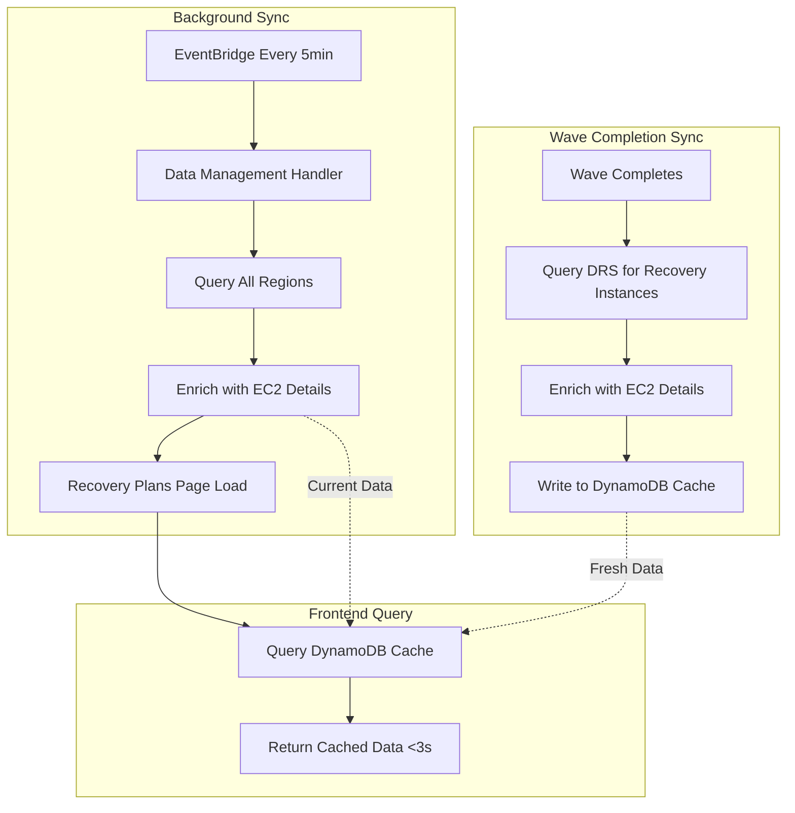
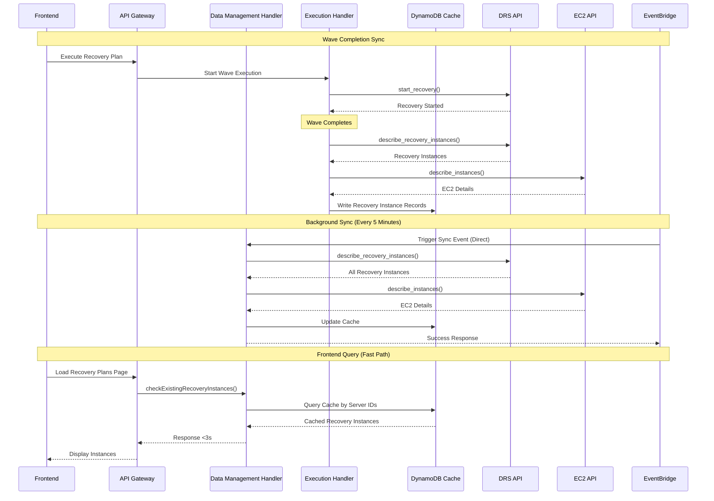

# Recovery Instance Sync - Design Document

## Overview

This design addresses a critical performance bottleneck in the DR Orchestration Platform where the Recovery Plans page takes 20+ seconds to load. The root cause is the `checkExistingRecoveryInstances()` function in data-management-handler making expensive synchronous API calls to AWS DRS and EC2 services on every page load.

**Root Cause:**
The current implementation queries DRS and EC2 APIs synchronously for every Recovery Plans page load:
1. `drs_client.describe_recovery_instances()` with pagination across all regions
2. `drs_client.describe_source_servers()` to get server names for each instance
3. `ec2_client.describe_instances()` to get EC2 details (Name tag, IPs, instance type, launch time)
4. Scans execution history table to find which execution created each instance

This results in 20+ seconds of API calls blocking the UI, creating a poor user experience.

**Solution:**
Implement a DynamoDB caching pattern with two sync mechanisms:
1. **Wave Completion Sync**: When a wave completes execution, immediately write recovery instance data to DynamoDB
2. **Background Sync**: EventBridge-triggered Lambda runs every 5 minutes to keep cache current

This reduces page load time from 20+ seconds to under 3 seconds while maintaining data accuracy.

### Key Benefits

- **Performance**: Page load time reduced from 20+ seconds to under 3 seconds (85% improvement)
- **Scalability**: DynamoDB queries scale better than synchronous API calls
- **Freshness**: Wave completion sync provides immediate data availability
- **Accuracy**: Background sync keeps cache current with 5-minute maximum staleness
- **Reliability**: Graceful degradation if sync fails (returns cached data)
- **Cross-Account**: Supports recovery instances in different AWS accounts
- **Backward Compatible**: Maintains same API response format

## Architecture

### High-Level Flow



### Component Interaction



## Components and Interfaces

### 1. DynamoDB Cache Table

**Table Name**: `hrp-drs-tech-adapter-recovery-instances-{environment}`

**Schema**:
```python
{
    "sourceServerId": "s-1234567890abcdef0",  # Partition Key
    "recoveryInstanceId": "ri-abcdef1234567890",
    "ec2InstanceId": "i-0123456789abcdef0",
    "ec2InstanceState": "running",
    "sourceServerName": "web-server-01",
    "name": "Recovery of web-server-01",
    "privateIp": "10.0.1.100",
    "publicIp": "54.123.45.67",
    "instanceType": "t3.medium",
    "launchTime": "2025-02-17T10:30:00Z",
    "region": "us-east-2",
    "accountId": "891376951562",
    "sourceExecutionId": "exec-abc123",
    "sourcePlanName": "Web Servers Recovery",
    "lastSyncTime": "2025-02-17T10:35:00Z",
    
    # DRS Replication Configuration (for reverse replication)
    "replicationStagingAccountId": "123456789012",  # Account where agent replicates to
    
    # Source Infrastructure Configuration (for failover/reverse replication)
    "sourceVpcId": "vpc-abc123def456",
    "sourceSubnetId": "subnet-xyz789abc123",
    "sourceSecurityGroupIds": ["sg-111222333444", "sg-555666777888"],
    "sourceInstanceProfile": "arn:aws:iam::891376951562:instance-profile/MyAppRole"
}
```

**Indexes**:
- Primary Key: `sourceServerId` (partition key)
- No GSI needed (queries by sourceServerId only)

**Billing Mode**: On-demand (variable query patterns)

**Point-in-Time Recovery**: Enabled

**TTL**: Not used (data remains until explicitly deleted or overwritten)

### 2. Wave Completion Sync (Execution Handler)

**Location**: `lambda/execution-handler/index.py`

**Trigger**: After wave completes successfully

**Function**: `sync_recovery_instances_after_wave()`

**Logic**:
```python
def sync_recovery_instances_after_wave(execution_id, wave_number, source_server_ids):
    """
    Sync recovery instances to cache after wave completion.
    
    Args:
        execution_id: Execution ID that created the instances
        wave_number: Wave number that completed
        source_server_ids: List of source server IDs in the wave
    """
    # 1. Query DRS for recovery instances by source server IDs
    recovery_instances = []
    for region in active_regions:
        drs_client = boto3.client('drs', region_name=region)
        response = drs_client.describe_recovery_instances(
            filters={'sourceServerIDs': source_server_ids}
        )
        recovery_instances.extend(response['items'])
    
    # 2. Enrich with EC2 details
    enriched_instances = []
    for instance in recovery_instances:
        ec2_details = get_ec2_instance_details(
            instance['ec2InstanceID'],
            instance['region']
        )
        enriched_instances.append({
            'sourceServerId': instance['sourceServerID'],
            'recoveryInstanceId': instance['recoveryInstanceID'],
            'ec2InstanceId': instance['ec2InstanceID'],
            'ec2InstanceState': instance['ec2InstanceState'],
            'sourceServerName': get_source_server_name(instance['sourceServerID']),
            'name': ec2_details.get('Name', f"Recovery of {instance['sourceServerID']}"),
            'privateIp': ec2_details.get('PrivateIpAddress'),
            'publicIp': ec2_details.get('PublicIpAddress'),
            'instanceType': ec2_details.get('InstanceType'),
            'launchTime': ec2_details.get('LaunchTime'),
            'region': instance['region'],
            'accountId': instance['accountId'],
            'sourceExecutionId': execution_id,
            'sourcePlanName': get_plan_name_from_execution(execution_id),
            'lastSyncTime': datetime.utcnow().isoformat()
        })
    
    # 3. Write to DynamoDB cache
    table = dynamodb.Table('hrp-drs-tech-adapter-recovery-instances-{env}')
    with table.batch_writer() as batch:
        for instance in enriched_instances:
            batch.put_item(Item=instance)
    
    logger.info(f"Synced {len(enriched_instances)} recovery instances after wave {wave_number}")
```

**Integration Point**: Called from `execute_wave()` after wave status becomes `COMPLETED`

### 3. Shared Utility: lambda/shared/recovery_instance_sync.py

**Purpose**: Shared utility module providing recovery instance sync functions. Called by data-management-handler to perform DRS/EC2 API calls and write results to DynamoDB cache.

**Integration Pattern**: Similar to `launch_config_service.py` - provides reusable sync functions.

**Key Functions**:
- `sync_recovery_instances_for_account(account_id: str, region: str) -> Dict` - Sync single account/region
- `sync_all_recovery_instances() -> Dict` - Sync all target accounts
- `get_recovery_instance_sync_status() -> Dict` - Get last sync status

**Handler Responsibilities**:
- **data-management-handler**: CRUD operations + Data sync operations (reads from cache for queries, performs DRS/EC2 API calls and writes to cache for sync)
- **execution-handler**: Recovery actions - performs wave completion sync as part of recovery execution
- **query-handler**: Read-only operations (NO DynamoDB writes, NO sync operations)

**Invocation Flow**:
1. **EventBridge Scheduled** (every 5 minutes):
   - EventBridge → **data-management-handler** (direct) → `recovery_instance_sync.sync_all_recovery_instances()`
   - Event payload: `{"operation": "sync_recovery_instances"}`

2. **Manual API Trigger**:
   - Frontend → API Gateway → data-management-handler → `recovery_instance_sync.sync_all_recovery_instances()`
   - Endpoint: `POST /drs/recovery-instance-sync`

3. **Direct Invocation**:
   - CLI/SDK → data-management-handler → `recovery_instance_sync.sync_all_recovery_instances()`
   - Operation: `sync_recovery_instances`

**Code Quality**:
- Follow PEP 8 with 120 character line length
- Use type hints for all functions
- Use virtual environment (.venv) for development and testing

**Logic**:
```python
# lambda/shared/recovery_instance_sync.py

def sync_all_recovery_instances() -> Dict[str, Any]:
    """
    Background sync of recovery instances across all target accounts and regions.
    Called by data-management-handler (invoked directly by EventBridge or API).
    
    Performs DRS/EC2 API calls and writes results to DynamoDB cache.
    
    Returns:
        Dict with sync results: instancesUpdated, regionsScanned, errors
    """
    logger.info("Starting background recovery instance sync")
    
    # 1. Get all target accounts and their regions
    target_accounts = get_target_accounts()
    
    # 2. Query DRS for all recovery instances across accounts/regions
    all_instances = []
    errors = []
    
    for account in target_accounts:
        for region in account.get('regions', []):
            try:
                instances = get_recovery_instances_for_account_region(
                    account['accountId'],
                    region
                )
                all_instances.extend(instances)
            except Exception as e:
                error_msg = f"Failed to sync {account['accountId']}/{region}: {e}"
                logger.error(error_msg)
                errors.append(error_msg)
                # Continue with other accounts/regions
    
    # 3. Enrich with EC2 details
    enriched_instances = []
    for instance in all_instances:
        try:
            ec2_details = get_ec2_instance_details(
                instance['ec2InstanceID'],
                instance['region'],
                instance['accountId']
            )
            
            # Find source execution from history
            source_execution = find_source_execution(
                instance['sourceServerID'],
                instance['launchTime']
            )
            
            enriched_instances.append({
                'sourceServerId': instance['sourceServerID'],
                'recoveryInstanceId': instance['recoveryInstanceID'],
                'ec2InstanceId': instance['ec2InstanceID'],
                'ec2InstanceState': instance['ec2InstanceState'],
                'sourceServerName': get_source_server_name(instance['sourceServerID']),
                'name': ec2_details.get('Name', f"Recovery of {instance['sourceServerID']}"),
                'privateIp': ec2_details.get('PrivateIpAddress'),
                'publicIp': ec2_details.get('PublicIpAddress'),
                'instanceType': ec2_details.get('InstanceType'),
                'launchTime': ec2_details.get('LaunchTime'),
                'region': instance['region'],
                'accountId': instance['accountId'],
                'sourceExecutionId': source_execution.get('executionId'),
                'sourcePlanName': source_execution.get('planName'),
                'lastSyncTime': datetime.utcnow().isoformat()
            })
        except Exception as e:
            error_msg = f"Failed to enrich instance {instance['recoveryInstanceID']}: {e}"
            logger.error(error_msg)
            errors.append(error_msg)
            # Continue with other instances
    
    # 4. Update DynamoDB cache
    table = get_recovery_instances_table()
    with table.batch_writer() as batch:
        for instance in enriched_instances:
            batch.put_item(Item=instance)
    
    logger.info(f"Background sync completed: {len(enriched_instances)} instances updated")
    
    return {
        'instancesUpdated': len(enriched_instances),
        'regionsScanned': len([r for a in target_accounts for r in a.get('regions', [])]),
        'errors': errors
    }
```

### 4. Data Management Handler Integration

**Location**: `lambda/data-management-handler/index.py`

**Role**: Handles all sync operations directly - receives EventBridge events, processes API requests, performs DRS/EC2 API calls, and writes to DynamoDB cache. Also reads from cache for frontend queries.

**Architecture Pattern**:
- **data-management-handler**: CRUD + Data sync operations - handles EventBridge sync events, API endpoints, performs DRS/EC2 API calls, writes to DynamoDB cache, reads from cache
- **execution-handler**: Recovery actions - performs wave completion sync as part of recovery execution
- **query-handler**: Read-only operations - NO DynamoDB writes, NO sync operations

**New API Endpoints**:
1. `POST /drs/recovery-instance-sync` - Triggers manual sync directly in data-management-handler
2. `GET /drs/recovery-instance-sync/status` - Returns sync status from data-management-handler

**New Direct Invocation Operations**:
1. `sync_recovery_instances` - Performs background sync directly in data-management-handler
2. `get_recovery_instance_sync_status` - Returns sync status from data-management-handler

**EventBridge Integration**: EventBridge scheduled sync events target data-management-handler DIRECTLY with payload `{"operation": "sync_recovery_instances"}`.

**API Gateway Routing**:
```python
def handle_api_gateway_request(event, context):
    """Route API Gateway requests to appropriate handler functions."""
    http_method = event.get("httpMethod")
    path = event.get("path", "")
    body = json.loads(event.get("body", "{}"))
    
    # ... existing routes ...
    
    # Recovery Instance Sync endpoints - handle directly
    elif path == "/drs/recovery-instance-sync":
        if http_method == "POST":
            return handle_recovery_instance_sync()
        elif http_method == "GET":
            return get_recovery_instance_sync_status()
```

**Handler Functions**:
```python
def handle_recovery_instance_sync() -> Dict:
    """
    Perform manual recovery instance sync.
    
    Returns:
        Sync results including instances updated and errors
    """
    try:
        # Call shared utility to perform sync
        from shared.recovery_instance_sync import sync_all_recovery_instances
        result = sync_all_recovery_instances()
        return response(200, result)
    except Exception as e:
        logger.exception("Failed to sync recovery instances")
        return response(500, error_response("SYNC_FAILED", str(e)))


def get_recovery_instance_sync_status() -> Dict:
    """
    Get last sync status.
    
    Returns:
        Last sync status including timestamp and results
    """
    try:
        # Call shared utility to get status
        from shared.recovery_instance_sync import get_recovery_instance_sync_status
        status = get_recovery_instance_sync_status()
        return response(200, status)
    except Exception as e:
        logger.exception("Failed to get sync status")
        return response(500, error_response("STATUS_FAILED", str(e)))
```

**checkExistingRecoveryInstances() Updates**:

**Before (Slow)**:
```python
def checkExistingRecoveryInstances(source_server_ids):
    # Makes 20+ seconds of API calls
    instances = []
    for region in regions:
        drs_response = drs_client.describe_recovery_instances()
        for instance in drs_response['items']:
            ec2_details = ec2_client.describe_instances()
            # ... more API calls
    return instances
```

**After (Fast)**:
```python
def checkExistingRecoveryInstances(source_server_ids):
    """
    Query recovery instances from DynamoDB cache.
    Falls back to API calls if cache miss.
    
    Args:
        source_server_ids: List of source server IDs to query
        
    Returns:
        List of recovery instance records
    """
    table = dynamodb.Table('hrp-drs-tech-adapter-recovery-instances-{env}')
    
    # Batch get from DynamoDB
    instances = []
    for server_id in source_server_ids:
        try:
            response = table.get_item(Key={'sourceServerId': server_id})
            if 'Item' in response:
                instances.append(response['Item'])
            else:
                # Cache miss - log but don't fail
                logger.warning(f"Cache miss for server {server_id}")
        except Exception as e:
            logger.error(f"Failed to query cache for {server_id}: {e}")
    
    # Transform to expected format
    return [
        {
            'sourceServerId': item['sourceServerId'],
            'recoveryInstanceId': item['recoveryInstanceId'],
            'ec2InstanceId': item['ec2InstanceId'],
            'ec2InstanceState': item['ec2InstanceState'],
            'name': item['name'],
            'privateIp': item.get('privateIp'),
            'publicIp': item.get('publicIp'),
            'instanceType': item['instanceType'],
            'launchTime': item['launchTime'],
            'region': item['region'],
            'sourceExecutionId': item.get('sourceExecutionId'),
            'sourcePlanName': item.get('sourcePlanName')
        }
        for item in instances
    ]
```

**terminateRecoveryInstances() - Before (Slow)**:
```python
def terminateRecoveryInstances(execution_id):
    """Terminate recovery instances for an execution."""
    # Makes expensive API calls to find instances
    instances = []
    for region in regions:
        drs_response = drs_client.describe_recovery_instances()
        for instance in drs_response['items']:
            # Check if instance belongs to this execution
            if matches_execution(instance, execution_id):
                instances.append(instance)
    
    # Terminate each instance
    for instance in instances:
        drs_client.terminate_recovery_instances(
            recoveryInstanceIDs=[instance['recoveryInstanceID']]
        )
```

**terminateRecoveryInstances() - After (Fast)**:
```python
def terminateRecoveryInstances(execution_id):
    """
    Terminate recovery instances for an execution using cache.
    
    Args:
        execution_id: Execution ID whose instances should be terminated
        
    Returns:
        Number of instances terminated
    """
    table = dynamodb.Table('hrp-drs-tech-adapter-recovery-instances-{env}')
    
    # Query cache for instances belonging to this execution
    # Use Scan with filter (execution_id is not a key)
    response = table.scan(
        FilterExpression='sourceExecutionId = :exec_id',
        ExpressionAttributeValues={':exec_id': execution_id}
    )
    
    instances = response.get('Items', [])
    logger.info(f"Found {len(instances)} recovery instances for execution {execution_id}")
    
    # Group instances by region for efficient termination
    instances_by_region = {}
    for instance in instances:
        region = instance['region']
        if region not in instances_by_region:
            instances_by_region[region] = []
        instances_by_region[region].append(instance['recoveryInstanceId'])
    
    # Terminate instances in each region
    terminated_count = 0
    for region, instance_ids in instances_by_region.items():
        try:
            drs_client = boto3.client('drs', region_name=region)
            drs_client.terminate_recovery_instances(
                recoveryInstanceIDs=instance_ids
            )
            terminated_count += len(instance_ids)
            logger.info(f"Terminated {len(instance_ids)} instances in {region}")
            
            # Delete from cache after successful termination
            with table.batch_writer() as batch:
                for instance in instances:
                    if instance['region'] == region:
                        batch.delete_item(Key={'sourceServerId': instance['sourceServerId']})
                        
        except Exception as e:
            logger.error(f"Failed to terminate instances in {region}: {e}")
            # Continue with other regions
    
    return terminated_count
```

**Benefits of Cache for Termination**:
- No expensive `describe_recovery_instances()` calls across all regions
- Instant lookup by execution ID
- Batch termination by region
- Automatic cache cleanup after termination

## API Contracts

### DynamoDB Cache Record

**Input** (Write to cache):
```python
{
    "sourceServerId": str,           # Required, partition key
    "recoveryInstanceId": str,       # Required
    "ec2InstanceId": str,            # Required
    "ec2InstanceState": str,         # Required: "pending" | "running" | "stopping" | "stopped" | "terminated"
    "sourceServerName": str,         # Required
    "name": str,                     # Required
    "privateIp": str | None,         # Optional
    "publicIp": str | None,          # Optional
    "instanceType": str,             # Required
    "launchTime": str,               # Required, ISO 8601
    "region": str,                   # Required
    "accountId": str,                # Required
    "sourceExecutionId": str | None, # Optional
    "sourcePlanName": str | None,    # Optional
    "lastSyncTime": str,             # Required, ISO 8601
    
    # DRS Replication Configuration (for reverse replication)
    "replicationStagingAccountId": str,  # Required - Account where agent replicates to
    
    # Source Infrastructure Configuration (for failover/reverse replication)
    "sourceVpcId": str | None,           # Optional - Source VPC ID
    "sourceSubnetId": str | None,        # Optional - Source subnet ID
    "sourceSecurityGroupIds": List[str], # Optional - Source security group IDs
    "sourceInstanceProfile": str | None  # Optional - Source IAM instance profile ARN
}
```

**Output** (Read from cache):
Same structure as input

### checkExistingRecoveryInstances() Response

**Before and After** (maintains compatibility):
```python
[
    {
        "sourceServerId": "s-1234567890abcdef0",
        "recoveryInstanceId": "ri-abcdef1234567890",
        "ec2InstanceId": "i-0123456789abcdef0",
        "ec2InstanceState": "running",
        "name": "Recovery of web-server-01",
        "privateIp": "10.0.1.100",
        "publicIp": "54.123.45.67",
        "instanceType": "t3.medium",
        "launchTime": "2025-02-17T10:30:00Z",
        "region": "us-east-2",
        "sourceExecutionId": "exec-abc123",
        "sourcePlanName": "Web Servers Recovery"
    }
]
```

## Error Handling

### Wave Completion Sync Errors

**Scenario**: DRS API call fails during wave completion sync

**Handling**:
- Log error with full context
- Continue wave completion (don't block execution)
- Background sync will catch missing data within 5 minutes

**Code**:
```python
try:
    sync_recovery_instances_after_wave(execution_id, wave_number, server_ids)
except Exception as e:
    logger.error(f"Failed to sync recovery instances after wave: {e}", exc_info=True)
    # Don't raise - wave completion should succeed
```

### Background Sync Errors

**Scenario**: Region API call fails during background sync

**Handling**:
- Log error for that region
- Continue with other regions
- Retry on next sync cycle (5 minutes)

**Code**:
```python
for region in active_regions:
    try:
        instances = get_recovery_instances_for_region(region)
        all_instances.extend(instances)
    except Exception as e:
        logger.error(f"Failed to sync region {region}: {e}", exc_info=True)
        # Continue with other regions
```

### Cache Query Errors

**Scenario**: DynamoDB query fails when loading Recovery Plans page

**Handling**:
- Log error
- Return empty list (graceful degradation)
- Frontend shows "No recovery instances found"

**Code**:
```python
try:
    response = table.get_item(Key={'sourceServerId': server_id})
    if 'Item' in response:
        instances.append(response['Item'])
except Exception as e:
    logger.error(f"Failed to query cache for {server_id}: {e}", exc_info=True)
    # Continue with other servers
```

### Cross-Account Access Errors

**Scenario**: Cannot assume role to query EC2 in target account

**Handling**:
- Log error with account ID
- Store partial data (without EC2 details)
- Background sync will retry

**Code**:
```python
try:
    ec2_details = get_ec2_instance_details(instance_id, region, account_id)
except Exception as e:
    logger.error(f"Failed to get EC2 details for {instance_id} in account {account_id}: {e}")
    ec2_details = {
        'Name': f"Recovery of {source_server_id}",
        'InstanceType': 'unknown',
        'PrivateIpAddress': None,
        'PublicIpAddress': None
    }
```

## Testing Strategy

### Unit Tests

**Test File**: `tests/unit/test_recovery_instance_sync.py`

**Coverage**:
1. Wave completion sync writes correct data to DynamoDB
2. Background sync queries all regions
3. Cache query returns correct format
4. Error handling for API failures
5. Cross-account role assumption
6. Data enrichment logic

**Example**:
```python
def test_wave_completion_sync_writes_to_dynamodb(mock_drs, mock_ec2, mock_dynamodb):
    """Test that wave completion sync writes recovery instances to cache."""
    # Arrange
    execution_id = "exec-123"
    wave_number = 1
    server_ids = ["s-abc", "s-def"]
    
    mock_drs.describe_recovery_instances.return_value = {
        'items': [
            {
                'sourceServerID': 's-abc',
                'recoveryInstanceID': 'ri-123',
                'ec2InstanceID': 'i-123',
                'ec2InstanceState': 'running',
                'region': 'us-east-2'
            }
        ]
    }
    
    # Act
    sync_recovery_instances_after_wave(execution_id, wave_number, server_ids)
    
    # Assert
    mock_dynamodb.put_item.assert_called_once()
    item = mock_dynamodb.put_item.call_args[1]['Item']
    assert item['sourceServerId'] == 's-abc'
    assert item['sourceExecutionId'] == execution_id
```

### Integration Tests

**Test File**: `tests/integration/test_recovery_instance_sync_integration.py`

**Coverage**:
1. End-to-end wave completion sync
2. Background sync with real DynamoDB
3. Cache query performance (<3 seconds)
4. Multi-region sync
5. Cross-account access

### Property-Based Tests

**Test File**: `tests/unit/test_recovery_instance_sync_property.py`

**Properties**:
1. **Idempotency**: Syncing same data multiple times produces same result
2. **Data Integrity**: All required fields present in cache records
3. **Timestamp Ordering**: lastSyncTime always increases
4. **Region Coverage**: All active regions queried in background sync

**Example**:
```python
from hypothesis import given, strategies as st

@given(
    source_server_ids=st.lists(st.text(min_size=17, max_size=17), min_size=1, max_size=10),
    execution_id=st.text(min_size=1, max_size=50)
)
def test_sync_idempotency(source_server_ids, execution_id):
    """Syncing same data multiple times produces same result."""
    # First sync
    sync_recovery_instances_after_wave(execution_id, 1, source_server_ids)
    result1 = query_cache(source_server_ids)
    
    # Second sync
    sync_recovery_instances_after_wave(execution_id, 1, source_server_ids)
    result2 = query_cache(source_server_ids)
    
    # Results should be identical (except lastSyncTime)
    assert len(result1) == len(result2)
    for r1, r2 in zip(result1, result2):
        assert r1['sourceServerId'] == r2['sourceServerId']
        assert r1['recoveryInstanceId'] == r2['recoveryInstanceId']
```

## Deployment Considerations

### Code Quality Standards

**Python Version**: Python 3.12+

**Line Length**: 120 characters (modern standard, not PEP 8's 79)

**Code Style**:
- Follow PEP 8 with 120 character line length exception
- Use type hints for all function parameters and return values
- Use f-strings for string formatting
- Use double quotes for strings
- Follow existing project patterns

**Testing**:
- Unit tests with pytest
- Property-based tests with Hypothesis (max_examples=100, deadline=5000ms)
- Integration tests with moto for AWS service mocking

**Virtual Environment**:
- All Python tools must run in `.venv` virtual environment
- Activate with: `source .venv/bin/activate`
- Install dependencies: `pip install -r requirements-dev.txt`

**Deployment**:
- ALWAYS use deploy script: `./scripts/deploy.sh dev`
- NEVER use direct AWS CLI commands for deployment
- Deploy script runs validation, security scans, tests, and deployment

### CloudFormation Changes

**New Resources**:
1. DynamoDB table: `RecoveryInstancesCache`
2. Lambda function: `RecoveryInstanceSyncFunction`
3. EventBridge rule: `RecoveryInstanceSyncSchedule`
4. IAM role: `RecoveryInstanceSyncRole`

**Modified Resources**:
1. Execution Handler: Add DynamoDB write permissions
2. Data Management Handler: Add DynamoDB read permissions

**Template Location**: `cfn/master-template.yaml`

**CloudFormation Patterns**:
- Follow existing patterns in `cfn/database-stack.yaml` for DynamoDB tables
- Follow existing patterns in `cfn/eventbridge-stack.yaml` for EventBridge rules
- Use camelCase for DynamoDB attribute names (matches project convention)
- Use PAY_PER_REQUEST billing mode for variable workloads
- Enable PointInTimeRecovery and SSE for all tables

### IAM Permissions

**Execution Handler** (wave completion sync):
```yaml
- Effect: Allow
  Action:
    - dynamodb:PutItem
    - dynamodb:BatchWriteItem
  Resource: !GetAtt RecoveryInstancesCache.Arn
```

**Query Handler** (read-only operations):
```yaml
- Effect: Allow
  Action:
    - dynamodb:GetItem
    - dynamodb:Query
    - dynamodb:Scan
  Resource: !GetAtt RecoveryInstancesCache.Arn
```

**Data Management Handler** (CRUD + sync operations):
```yaml
- Effect: Allow
  Action:
    - drs:DescribeRecoveryInstances
    - drs:DescribeSourceServers
    - ec2:DescribeInstances
    - dynamodb:GetItem
    - dynamodb:BatchGetItem
    - dynamodb:Scan
    - dynamodb:PutItem
    - dynamodb:BatchWriteItem
    - dynamodb:DeleteItem
  Resource:
    - "*"  # DRS/EC2 require wildcard
    - !GetAtt RecoveryInstancesCache.Arn
```

### Rollout Strategy

**Phase 1: Deploy Infrastructure**
1. Deploy DynamoDB table
2. Deploy background sync Lambda
3. Deploy EventBridge rule
4. Verify background sync runs successfully

**Phase 2: Enable Wave Completion Sync**
1. Deploy execution handler with sync logic
2. Test with single wave execution
3. Verify data written to cache

**Phase 3: Enable Cache Queries**
1. Deploy data management handler with cache queries
2. Test Recovery Plans page load time
3. Monitor for cache misses

**Phase 4: Monitor and Optimize**
1. Monitor DynamoDB metrics
2. Adjust background sync frequency if needed
3. Optimize query patterns

### Rollback Plan

**If issues occur**:
1. Revert data management handler to use API calls
2. Keep background sync running (no harm)
3. Investigate and fix issues
4. Re-enable cache queries

**Rollback Command**:
```bash
./scripts/deploy.sh dev --lambda-only
# Reverts to previous Lambda code
```

## Monitoring and Observability

### CloudWatch Metrics

**DynamoDB**:
- `ConsumedReadCapacityUnits`: Should be low (<10/sec)
- `ConsumedWriteCapacityUnits`: Spikes every 5 minutes
- `UserErrors`: Should be 0

**Background Sync Lambda**:
- `Duration`: Should be <60 seconds
- `Errors`: Should be 0
- `Throttles`: Should be 0

**Data Management Handler**:
- `Duration`: Should be <3 seconds (down from 20+)
- `CacheMissCount`: Custom metric for cache misses

### CloudWatch Logs

**Log Groups**:
- `/aws/lambda/hrp-drs-tech-adapter-recovery-instance-sync-dev`
- `/aws/lambda/hrp-drs-tech-adapter-execution-handler-dev`
- `/aws/lambda/hrp-drs-tech-adapter-data-management-handler-dev`

**Key Log Messages**:
- `"Synced N recovery instances after wave M"` - Wave completion sync
- `"Background sync completed: N instances updated"` - Background sync
- `"Cache miss for server X"` - Cache miss (investigate if frequent)

### Alarms

**Critical**:
1. Background sync Lambda errors > 0 for 15 minutes
2. DynamoDB throttling > 0 for 5 minutes
3. Data management handler duration > 5 seconds (p99)

**Warning**:
1. Cache miss rate > 10%
2. Background sync duration > 120 seconds

### Integration with Existing Monitoring

**CloudWatch Dashboard**:
- Add recovery instance sync metrics to existing dashboard
- Include cache hit/miss rates
- Include sync duration trends

**SNS Notifications**:
- Use existing SNS topic for alarm notifications
- Follow existing alarm naming conventions

**X-Ray Tracing**:
- Enable X-Ray tracing for background sync Lambda
- Trace cache query performance in data management handler

## Performance Targets

### Current Performance (Before)
- Recovery Plans page load: 20+ seconds
- API calls per page load: 50+ (DRS + EC2)
- User experience: Poor (long wait times)

### Target Performance (After)
- Recovery Plans page load: <3 seconds (85% improvement)
- DynamoDB queries per page load: 1-10 (batch get)
- User experience: Excellent (instant load)

### Scalability
- Supports 1000+ recovery instances
- Handles 100+ concurrent page loads
- Background sync completes in <60 seconds

## Security Considerations

### Data Privacy
- Recovery instance data contains EC2 IPs and instance details
- DynamoDB table uses encryption at rest (AWS managed keys)
- Access controlled via IAM policies

### Cross-Account Access
- Background sync assumes roles in target accounts
- Requires trust relationship in target accounts
- Follows least privilege principle

### Audit Trail
- All cache writes logged to CloudWatch
- Background sync runs logged with instance counts
- Cache queries logged with server IDs

## Future Enhancements

### Phase 2 Improvements
1. **Real-time Updates**: Use DRS EventBridge events for instant cache updates
2. **Cache Invalidation**: Delete cache entries when instances terminated
3. **Multi-Region Optimization**: Parallel region queries in background sync
4. **Cache Warming**: Pre-populate cache on first deployment

### Phase 3 Improvements
1. **GraphQL Subscriptions**: Real-time updates to frontend
2. **Cache Analytics**: Dashboard showing cache hit rates
3. **Predictive Caching**: Pre-fetch likely queries based on usage patterns

## Acceptance Criteria Validation

This design satisfies all requirements from the requirements document:

✅ **1.1 Cache Recovery Instance Data**: DynamoDB table stores all required fields  
✅ **1.2 Wave Completion Sync**: Execution handler writes to cache after wave completes  
✅ **1.3 Background Sync**: EventBridge-triggered Lambda runs every 5 minutes  
✅ **1.4 Fast Cache Queries**: DynamoDB queries complete in <3 seconds  
✅ **1.5 Backward Compatible**: Same API response format maintained  

✅ **2.1 Performance**: Page load time reduced from 20+ to <3 seconds  
✅ **2.2 Data Freshness**: Maximum 5-minute staleness  
✅ **2.3 Reliability**: Graceful degradation on errors  
✅ **2.4 Scalability**: Handles 1000+ instances  
✅ **2.5 Cross-Account**: Supports recovery instances in different accounts

