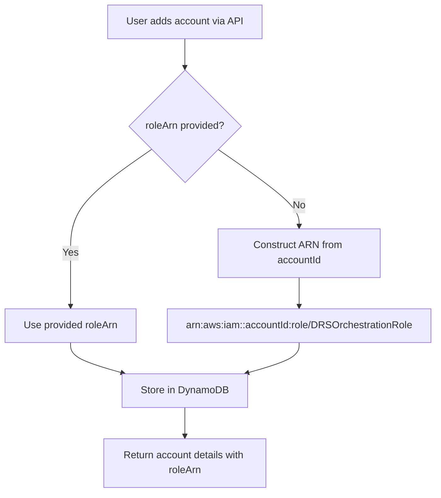
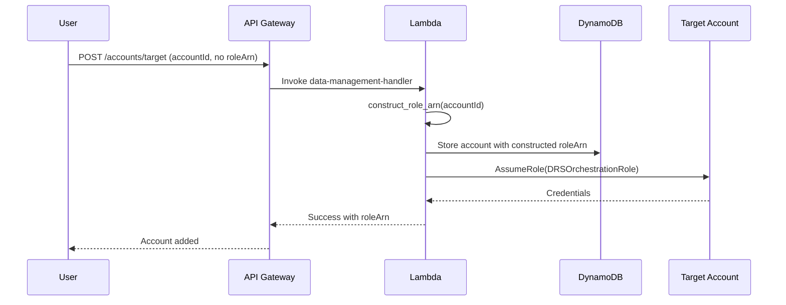

# Design Document: Standardized Cross-Account Role Naming

## Overview

This feature simplifies cross-account role management by standardizing the IAM role name to `DRSOrchestrationRole` across all target and staging accounts. The system will automatically construct role ARNs based on account IDs, eliminating the need for users to manually copy and paste role ARNs when adding accounts.

**Key Changes:**
- Hardcode role name to `DRSOrchestrationRole` in `cfn/cross-account-role-stack.yaml`
- Make `roleArn` optional in API requests for adding accounts
- Auto-construct ARN pattern: `arn:aws:iam::{account-id}:role/DRSOrchestrationRole`
- Maintain backward compatibility for accounts with explicit role ARNs

**Benefits:**
- Reduced friction when adding accounts (no manual ARN copying)
- Predictable role naming across all accounts
- Simplified deployment process
- Maintains backward compatibility

## Architecture

### High-Level Flow



### Component Interaction



## Components and Interfaces

### 1. CloudFormation Templates

#### Cross-Account Role Stack (`cfn/cross-account-role-stack.yaml`)

**Changes:**
- Remove `Environment` parameter (no longer needed)
- Hardcode role name to `DRSOrchestrationRole`
- Update role description
- Keep all permissions unchanged

**Before:**
```yaml
Parameters:
  Environment:
    Type: String
    Description: Environment name

Resources:
  DRSOrchestrationRole:
    Type: AWS::IAM::Role
    Properties:
      RoleName: !Sub "DRSOrchestrationRole-${Environment}"
```

**After:**
```yaml
# No Environment parameter needed

Resources:
  DRSOrchestrationRole:
    Type: AWS::IAM::Role
    Properties:
      RoleName: DRSOrchestrationRole  # Hardcoded, no suffix
      Description: "Standardized cross-account role for DRS Orchestration Platform"
```

**Outputs:**
```yaml
Outputs:
  RoleArn:
    Description: ARN of the DRS Orchestration cross-account role
    Value: !GetAtt DRSOrchestrationRole.Arn
    Export:
      Name: DRSOrchestrationRoleArn
```

#### Master Template (`cfn/master-template.yaml`)

**Changes:**
- Update STS AssumeRole resource pattern
- Add documentation comments
- Update orchestration role's AssumeRole policy

**AssumeRole Policy Update:**
```yaml
OrchestrationRole:
  Type: AWS::IAM::Role
  Properties:
    AssumeRolePolicyDocument:
      Statement:
        - Effect: Allow
          Principal:
            Service: lambda.amazonaws.com
          Action: sts:AssumeRole
    Policies:
      - PolicyName: AssumeTargetAccountRoles
        PolicyDocument:
          Statement:
            - Effect: Allow
              Action: sts:AssumeRole
              Resource: "arn:aws:iam::*:role/DRSOrchestrationRole"  # Standardized pattern
```

### 2. Lambda Functions

#### Data Management Handler (`lambda/data-management-handler/index.py`)

**New Helper Function:**
```python
def construct_role_arn(account_id: str) -> str:
    """
    Construct standardized role ARN from account ID.
    
    Args:
        account_id: 12-digit AWS account ID
        
    Returns:
        Role ARN in format: arn:aws:iam::{account_id}:role/DRSOrchestrationRole
        
    Raises:
        ValueError: If account_id is not 12 digits
    """
    if not account_id or len(account_id) != 12 or not account_id.isdigit():
        raise ValueError(f"Invalid account ID: {account_id}. Must be 12 digits.")
    
    return f"arn:aws:iam::{account_id}:role/DRSOrchestrationRole"
```

**Updated Add Target Account:**
```python
def handle_add_target_account(event: Dict[str, Any]) -> Dict[str, Any]:
    """Add a new target account."""
    body = json.loads(event['body'])
    
    account_id = body['accountId']
    account_name = body['accountName']
    external_id = body['externalId']
    
    # Construct role ARN if not provided (new behavior)
    role_arn = body.get('roleArn')
    if not role_arn:
        role_arn = construct_role_arn(account_id)
        logger.info(f"Constructed role ARN: {role_arn}")
    else:
        logger.info(f"Using provided role ARN: {role_arn}")
    
    # Validate role by attempting to assume it
    validate_cross_account_role(role_arn, external_id)
    
    # Store in DynamoDB
    item = {
        'accountId': account_id,
        'accountName': account_name,
        'roleArn': role_arn,  # Store constructed or provided ARN
        'externalId': external_id,
        'createdAt': datetime.utcnow().isoformat(),
        'updatedAt': datetime.utcnow().isoformat()
    }
    
    table.put_item(Item=item)
    
    return {
        'statusCode': 200,
        'body': json.dumps({
            'message': 'Target account added successfully',
            'account': item
        })
    }
```

**Updated Add Staging Account:**
```python
def handle_add_staging_account(event: Dict[str, Any]) -> Dict[str, Any]:
    """Add a new staging account."""
    body = json.loads(event['body'])
    
    account_id = body['accountId']
    account_name = body['accountName']
    external_id = body['externalId']
    
    # Construct role ARN if not provided (new behavior)
    role_arn = body.get('roleArn')
    if not role_arn:
        role_arn = construct_role_arn(account_id)
        logger.info(f"Constructed role ARN: {role_arn}")
    else:
        logger.info(f"Using provided role ARN: {role_arn}")
    
    # Validate role by attempting to assume it
    validate_cross_account_role(role_arn, external_id)
    
    # Store in DynamoDB
    item = {
        'accountId': account_id,
        'accountName': account_name,
        'roleArn': role_arn,  # Store constructed or provided ARN
        'externalId': external_id,
        'createdAt': datetime.utcnow().isoformat(),
        'updatedAt': datetime.utcnow().isoformat()
    }
    
    staging_table.put_item(Item=item)
    
    return {
        'statusCode': 200,
        'body': json.dumps({
            'message': 'Staging account added successfully',
            'account': item
        })
    }
```

#### Query Handler (`lambda/query-handler/index.py`)

**Updated Capacity Query:**
```python
def query_target_account_capacity(account_id: str) -> Dict[str, Any]:
    """Query DRS capacity in target account."""
    # Get account from DynamoDB
    response = table.get_item(Key={'accountId': account_id})
    
    if 'Item' not in response:
        raise ValueError(f"Account {account_id} not found")
    
    account = response['Item']
    
    # Get role ARN (construct if not present for backward compatibility)
    role_arn = account.get('roleArn')
    if not role_arn:
        role_arn = construct_role_arn(account_id)
        logger.info(f"Constructed role ARN for query: {role_arn}")
    
    external_id = account['externalId']
    
    # Assume role and query DRS
    credentials = assume_cross_account_role(role_arn, external_id)
    drs_client = boto3.client('drs', **credentials)
    
    # Query source servers
    source_servers = drs_client.describe_source_servers()
    
    return {
        'accountId': account_id,
        'accountName': account['accountName'],
        'sourceServerCount': len(source_servers['items']),
        'sourceServers': source_servers['items']
    }
```

#### Orchestration Step Functions (`lambda/orchestration-stepfunctions/index.py`)

**Updated Cross-Account Operations:**
```python
def assume_target_account_role(account_id: str, external_id: str) -> Dict[str, Any]:
    """Assume role in target account for DRS operations."""
    # Get account from DynamoDB
    response = table.get_item(Key={'accountId': account_id})
    
    if 'Item' not in response:
        raise ValueError(f"Account {account_id} not found")
    
    account = response['Item']
    
    # Get role ARN (construct if not present)
    role_arn = account.get('roleArn')
    if not role_arn:
        role_arn = construct_role_arn(account_id)
        logger.info(f"Constructed role ARN for orchestration: {role_arn}")
    
    # Assume role
    sts_client = boto3.client('sts')
    response = sts_client.assume_role(
        RoleArn=role_arn,
        RoleSessionName='DRSOrchestration',
        ExternalId=external_id,
        DurationSeconds=3600
    )
    
    return {
        'aws_access_key_id': response['Credentials']['AccessKeyId'],
        'aws_secret_access_key': response['Credentials']['SecretAccessKey'],
        'aws_session_token': response['Credentials']['SessionToken']
    }
```

### 3. Shared Utilities

#### Account Utilities (`lambda/shared/account_utils.py`)

**New Module:**
```python
"""
Shared utilities for cross-account operations.
"""
import re
from typing import Optional

# Standardized role name across all accounts
STANDARD_ROLE_NAME = "DRSOrchestrationRole"

# Account ID validation pattern (12 digits)
ACCOUNT_ID_PATTERN = re.compile(r'^\d{12}$')


def construct_role_arn(account_id: str) -> str:
    """
    Construct standardized role ARN from account ID.
    
    Args:
        account_id: 12-digit AWS account ID
        
    Returns:
        Role ARN in format: arn:aws:iam::{account_id}:role/DRSOrchestrationRole
        
    Raises:
        ValueError: If account_id is not 12 digits
    """
    if not validate_account_id(account_id):
        raise ValueError(
            f"Invalid account ID: {account_id}. Must be exactly 12 digits."
        )
    
    return f"arn:aws:iam::{account_id}:role/{STANDARD_ROLE_NAME}"


def validate_account_id(account_id: str) -> bool:
    """
    Validate AWS account ID format.
    
    Args:
        account_id: Account ID to validate
        
    Returns:
        True if valid, False otherwise
    """
    if not account_id:
        return False
    
    return ACCOUNT_ID_PATTERN.match(account_id) is not None


def extract_account_id_from_arn(role_arn: str) -> Optional[str]:
    """
    Extract account ID from role ARN.
    
    Args:
        role_arn: IAM role ARN
        
    Returns:
        12-digit account ID, or None if extraction fails
    """
    # ARN format: arn:aws:iam::123456789012:role/RoleName
    match = re.match(r'arn:aws:iam::(\d{12}):role/', role_arn)
    if match:
        return match.group(1)
    return None


def get_role_arn(account_id: str, explicit_arn: Optional[str] = None) -> str:
    """
    Get role ARN for account, using explicit ARN if provided or constructing it.
    
    Args:
        account_id: 12-digit AWS account ID
        explicit_arn: Optional explicit role ARN (for backward compatibility)
        
    Returns:
        Role ARN (explicit or constructed)
        
    Raises:
        ValueError: If account_id is invalid
    """
    if explicit_arn:
        return explicit_arn
    
    return construct_role_arn(account_id)
```

## Data Models

### DynamoDB Schema

**Target Accounts Table:**
```python
{
    'accountId': str,        # Partition key, 12-digit account ID
    'accountName': str,      # Human-readable name
    'roleArn': str,          # IAM role ARN (constructed or explicit)
    'externalId': str,       # External ID for AssumeRole
    'createdAt': str,        # ISO 8601 timestamp
    'updatedAt': str         # ISO 8601 timestamp
}
```

**Staging Accounts Table:**
```python
{
    'accountId': str,        # Partition key, 12-digit account ID
    'accountName': str,      # Human-readable name
    'roleArn': str,          # IAM role ARN (constructed or explicit)
    'externalId': str,       # External ID for AssumeRole
    'createdAt': str,        # ISO 8601 timestamp
    'updatedAt': str         # ISO 8601 timestamp
}
```

**Key Changes:**
- `roleArn` is always stored (either constructed or provided)
- No schema changes required (backward compatible)
- Existing records with explicit ARNs remain unchanged

### API Request/Response Models

**Add Target Account Request:**
```json
{
  "accountId": "123456789012",
  "accountName": "Production Account",
  "externalId": "unique-external-id",
  "roleArn": "arn:aws:iam::123456789012:role/CustomRole"  // Optional
}
```

**Add Target Account Response:**
```json
{
  "message": "Target account added successfully",
  "account": {
    "accountId": "123456789012",
    "accountName": "Production Account",
    "roleArn": "arn:aws:iam::123456789012:role/DRSOrchestrationRole",
    "externalId": "unique-external-id",
    "createdAt": "2025-01-15T10:30:00Z",
    "updatedAt": "2025-01-15T10:30:00Z"
  }
}
```


## Correctness Properties

*A property is a characteristic or behavior that should hold true across all valid executions of a system—essentially, a formal statement about what the system should do. Properties serve as the bridge between human-readable specifications and machine-verifiable correctness guarantees.*

### Property 1: ARN Construction Follows Standardized Pattern

*For any* valid 12-digit AWS account ID, when constructing a role ARN without an explicit roleArn provided, the constructed ARN must match the pattern `arn:aws:iam::{account-id}:role/DRSOrchestrationRole`

**Validates: Requirements 1.2, 2.2, 4.2**

**Rationale:** This is the core property of the feature. The ARN construction must be deterministic and follow the exact pattern for all valid account IDs. This property ensures consistency across target accounts, staging accounts, and all cross-account operations.

### Property 2: Explicit ARN Takes Precedence

*For any* account (target or staging) with an explicitly provided roleArn, the system must use that exact ARN value and never overwrite it with a constructed ARN, even during updates

**Validates: Requirements 1.3, 2.3, 5.1, 5.2**

**Rationale:** This property ensures backward compatibility. Existing accounts with custom role names must continue to work without changes. The system must respect explicit ARN values and preserve them across all operations.

### Property 3: Account Addition Round-Trip

*For any* account (target or staging) added to the system, retrieving that account from DynamoDB must return the same roleArn that was stored (whether constructed or explicit)

**Validates: Requirements 1.4, 2.4**

**Rationale:** This is a persistence round-trip property. What goes into DynamoDB must come back out unchanged. This ensures data integrity and that the ARN (constructed or explicit) is correctly persisted and retrievable.

### Property 4: API Responses Include Role ARN

*For any* successful account addition operation (target or staging), the API response must include a roleArn field with a non-empty value

**Validates: Requirements 1.5, 2.5**

**Rationale:** This property ensures API response completeness. Users must always receive the role ARN in the response, whether it was constructed or provided explicitly. This provides immediate feedback and confirmation.

### Property 5: Optional Role ARN Field Acceptance

*For any* valid account data (target or staging), the API must accept requests both with and without the roleArn field, and both must result in successful account creation

**Validates: Requirements 1.1, 2.1**

**Rationale:** This property ensures the API correctly handles optional fields. The roleArn field must be truly optional, not just documented as optional. Both request formats must be valid.

### Property 6: Validation Accepts All Valid ARN Formats

*For any* valid IAM role ARN format (standardized or custom), the validation logic must accept it and allow cross-account operations

**Validates: Requirements 5.3**

**Rationale:** This property ensures the system doesn't artificially restrict ARN formats. Any valid IAM role ARN should be acceptable, whether it follows the standardized pattern or uses a custom role name.

### Property 7: Account ID Extraction is Inverse of Construction

*For any* valid 12-digit account ID, extracting the account ID from a constructed ARN must return the original account ID (round-trip property)

**Validates: Requirements 1.2, 2.2** (indirectly validates correctness of construction)

**Rationale:** This is a mathematical inverse property. If `construct_role_arn(id)` produces an ARN, then `extract_account_id_from_arn(arn)` must return `id`. This validates the correctness of both construction and extraction logic.

## Error Handling

### Invalid Account ID Format

**Error:** Account ID is not exactly 12 digits
```python
{
    "statusCode": 400,
    "body": {
        "error": "InvalidAccountId",
        "message": "Account ID must be exactly 12 digits. Received: {account_id}"
    }
}
```

**Handling:**
- Validate account ID format before constructing ARN
- Return clear error message with the invalid value
- Log validation failure for monitoring

### Role Assumption Failure

**Error:** Cannot assume role in target account
```python
{
    "statusCode": 403,
    "body": {
        "error": "RoleAssumptionFailed",
        "message": "Failed to assume role {role_arn}. Verify the role exists and trust policy is configured correctly.",
        "details": {
            "roleArn": "arn:aws:iam::123456789012:role/DRSOrchestrationRole",
            "externalId": "provided-external-id"
        }
    }
}
```

**Handling:**
- Attempt role assumption during account addition (validation)
- Catch STS AssumeRole errors
- Return detailed error with role ARN and external ID
- Log failure with full error details

### Account Already Exists

**Error:** Account ID already registered
```python
{
    "statusCode": 409,
    "body": {
        "error": "AccountAlreadyExists",
        "message": "Account {account_id} is already registered",
        "existingAccount": {
            "accountId": "123456789012",
            "accountName": "Existing Name",
            "roleArn": "arn:aws:iam::123456789012:role/DRSOrchestrationRole"
        }
    }
}
```

**Handling:**
- Check for existing account before insertion
- Return existing account details
- Suggest using update endpoint instead

### DynamoDB Operation Failure

**Error:** Failed to store account in DynamoDB
```python
{
    "statusCode": 500,
    "body": {
        "error": "DatabaseError",
        "message": "Failed to store account. Please try again."
    }
}
```

**Handling:**
- Catch DynamoDB exceptions
- Log full error details (not exposed to user)
- Return generic error message
- Implement retry logic for transient failures

### Missing External ID

**Error:** External ID not provided
```python
{
    "statusCode": 400,
    "body": {
        "error": "MissingExternalId",
        "message": "External ID is required for cross-account role assumption"
    }
}
```

**Handling:**
- Validate required fields before processing
- Return clear error message
- Document external ID requirement in API docs

## Testing Strategy

### Dual Testing Approach

This feature requires both **unit tests** and **property-based tests** for comprehensive coverage:

- **Unit tests**: Verify specific examples, edge cases, and error conditions
- **Property tests**: Verify universal properties across all inputs

Both are complementary and necessary. Unit tests catch concrete bugs, while property tests verify general correctness.

### Unit Tests

**Focus Areas:**
- Specific examples demonstrating correct behavior
- Edge cases (empty strings, special characters, boundary values)
- Error conditions (invalid account IDs, missing fields)
- Integration points between components

**Example Unit Tests:**

```python
def test_construct_role_arn_valid_account_id():
    """Test ARN construction with valid account ID."""
    account_id = "123456789012"
    expected = "arn:aws:iam::123456789012:role/DRSOrchestrationRole"
    assert construct_role_arn(account_id) == expected

def test_construct_role_arn_invalid_account_id():
    """Test ARN construction with invalid account ID."""
    with pytest.raises(ValueError, match="Invalid account ID"):
        construct_role_arn("12345")  # Too short

def test_add_target_account_without_role_arn():
    """Test adding target account without explicit roleArn."""
    event = {
        'body': json.dumps({
            'accountId': '123456789012',
            'accountName': 'Test Account',
            'externalId': 'test-external-id'
        })
    }
    response = handle_add_target_account(event)
    body = json.loads(response['body'])
    
    assert response['statusCode'] == 200
    assert body['account']['roleArn'] == 'arn:aws:iam::123456789012:role/DRSOrchestrationRole'

def test_add_target_account_with_explicit_role_arn():
    """Test adding target account with explicit roleArn (backward compatibility)."""
    custom_arn = 'arn:aws:iam::123456789012:role/CustomRole'
    event = {
        'body': json.dumps({
            'accountId': '123456789012',
            'accountName': 'Test Account',
            'externalId': 'test-external-id',
            'roleArn': custom_arn
        })
    }
    response = handle_add_target_account(event)
    body = json.loads(response['body'])
    
    assert response['statusCode'] == 200
    assert body['account']['roleArn'] == custom_arn  # Uses explicit ARN

def test_extract_account_id_from_arn():
    """Test extracting account ID from ARN."""
    arn = "arn:aws:iam::123456789012:role/DRSOrchestrationRole"
    assert extract_account_id_from_arn(arn) == "123456789012"

def test_extract_account_id_from_invalid_arn():
    """Test extracting account ID from invalid ARN."""
    assert extract_account_id_from_arn("invalid-arn") is None
```

### Property-Based Tests

**Configuration:**
- Minimum 100 iterations per property test
- Use `pytest-hypothesis` for Python property-based testing
- Tag each test with feature name and property number

**Property Test Examples:**

```python
from hypothesis import given, strategies as st

# Strategy for valid AWS account IDs (12 digits)
account_id_strategy = st.text(
    alphabet='0123456789',
    min_size=12,
    max_size=12
)

@given(account_id=account_id_strategy)
def test_property_arn_construction_pattern(account_id):
    """
    Property 1: ARN construction follows standardized pattern.
    
    Feature: standardized-cross-account-role-naming
    Property 1: For any valid 12-digit AWS account ID, constructed ARN 
                must match pattern arn:aws:iam::{account-id}:role/DRSOrchestrationRole
    """
    arn = construct_role_arn(account_id)
    
    # Verify pattern
    expected = f"arn:aws:iam::{account_id}:role/DRSOrchestrationRole"
    assert arn == expected
    
    # Verify structure
    assert arn.startswith("arn:aws:iam::")
    assert arn.endswith(":role/DRSOrchestrationRole")
    assert account_id in arn

@given(
    account_id=account_id_strategy,
    explicit_arn=st.text(min_size=20, max_size=100)
)
def test_property_explicit_arn_precedence(account_id, explicit_arn):
    """
    Property 2: Explicit ARN takes precedence.
    
    Feature: standardized-cross-account-role-naming
    Property 2: For any account with explicitly provided roleArn, 
                system must use that exact ARN value
    """
    # Simulate adding account with explicit ARN
    result_arn = get_role_arn(account_id, explicit_arn=explicit_arn)
    
    # Explicit ARN must be used, not constructed
    assert result_arn == explicit_arn
    assert result_arn != construct_role_arn(account_id)

@given(account_id=account_id_strategy)
def test_property_account_id_extraction_inverse(account_id):
    """
    Property 7: Account ID extraction is inverse of construction.
    
    Feature: standardized-cross-account-role-naming
    Property 7: For any valid account ID, extracting from constructed ARN 
                must return original account ID (round-trip)
    """
    # Construct ARN
    arn = construct_role_arn(account_id)
    
    # Extract account ID
    extracted_id = extract_account_id_from_arn(arn)
    
    # Must match original
    assert extracted_id == account_id

@given(
    account_id=account_id_strategy,
    account_name=st.text(min_size=1, max_size=100),
    external_id=st.text(min_size=10, max_size=50)
)
def test_property_api_response_includes_role_arn(account_id, account_name, external_id):
    """
    Property 4: API responses include role ARN.
    
    Feature: standardized-cross-account-role-naming
    Property 4: For any successful account addition, API response 
                must include roleArn field with non-empty value
    """
    # Mock event
    event = {
        'body': json.dumps({
            'accountId': account_id,
            'accountName': account_name,
            'externalId': external_id
        })
    }
    
    # Add account (mocked)
    response = handle_add_target_account(event)
    body = json.loads(response['body'])
    
    # Response must include roleArn
    assert 'account' in body
    assert 'roleArn' in body['account']
    assert body['account']['roleArn']  # Non-empty
    assert len(body['account']['roleArn']) > 0

@given(
    account_id=account_id_strategy,
    account_name=st.text(min_size=1, max_size=100),
    external_id=st.text(min_size=10, max_size=50),
    include_role_arn=st.booleans()
)
def test_property_optional_role_arn_acceptance(
    account_id, account_name, external_id, include_role_arn
):
    """
    Property 5: Optional roleArn field acceptance.
    
    Feature: standardized-cross-account-role-naming
    Property 5: For any valid account data, API must accept requests 
                both with and without roleArn field
    """
    # Build request body
    body_data = {
        'accountId': account_id,
        'accountName': account_name,
        'externalId': external_id
    }
    
    if include_role_arn:
        body_data['roleArn'] = f"arn:aws:iam::{account_id}:role/CustomRole"
    
    event = {'body': json.dumps(body_data)}
    
    # Both should succeed
    response = handle_add_target_account(event)
    assert response['statusCode'] == 200
```

### Integration Tests

**Test Scenarios:**
1. Deploy cross-account role stack in test account
2. Add target account without roleArn via API
3. Verify role assumption works
4. Query DRS capacity using constructed ARN
5. Add staging account without roleArn
6. Verify orchestration operations work
7. Add account with explicit roleArn (backward compatibility)
8. Verify explicit ARN is used for operations

### CloudFormation Template Tests

**Validation Tests:**
```bash
# Validate cross-account role template
cfn-lint cfn/cross-account-role-stack.yaml

# Validate master template
cfn-lint cfn/master-template.yaml

# Check for hardcoded role name
grep -q "RoleName: DRSOrchestrationRole" cfn/cross-account-role-stack.yaml

# Check for no Environment parameter
! grep -q "Environment:" cfn/cross-account-role-stack.yaml
```

**Deployment Tests:**
```bash
# Deploy cross-account role stack (dry-run)
aws cloudformation validate-template \
  --template-body file://cfn/cross-account-role-stack.yaml

# Verify outputs include RoleArn
aws cloudformation describe-stacks \
  --stack-name test-cross-account-role \
  --query 'Stacks[0].Outputs[?OutputKey==`RoleArn`].OutputValue' \
  --output text
```

### Test Coverage Goals

- **Unit test coverage**: >90% for Lambda functions
- **Property test coverage**: All 7 properties implemented
- **Integration test coverage**: All user stories validated end-to-end
- **CloudFormation validation**: All templates pass cfn-lint and cfn_nag

### Test Execution

```bash
# Run unit tests
pytest tests/unit/ -v

# Run property-based tests (100 iterations minimum)
pytest tests/property/ -v --hypothesis-show-statistics

# Run integration tests
pytest tests/integration/ -v

# Run all tests with coverage
pytest --cov=lambda --cov-report=html --cov-report=term

# Validate CloudFormation templates
cfn-lint cfn/*.yaml
cfn_nag_scan --input-path cfn/
```

## Backward Compatibility Strategy

### Existing Accounts

**No Changes Required:**
- Accounts with explicit `roleArn` values continue to work
- No data migration needed
- No API changes for existing integrations

**Behavior:**
```python
# Existing account in DynamoDB
{
    'accountId': '123456789012',
    'accountName': 'Legacy Account',
    'roleArn': 'arn:aws:iam::123456789012:role/CustomRole-dev',  # Explicit
    'externalId': 'legacy-external-id'
}

# System uses explicit roleArn for all operations
# No construction happens
# No updates to roleArn field
```

### New Accounts

**Simplified Workflow:**
```python
# New account without roleArn
{
    'accountId': '987654321098',
    'accountName': 'New Account',
    'externalId': 'new-external-id'
    # No roleArn provided
}

# System constructs roleArn automatically
# Stored in DynamoDB as:
{
    'accountId': '987654321098',
    'accountName': 'New Account',
    'roleArn': 'arn:aws:iam::987654321098:role/DRSOrchestrationRole',  # Constructed
    'externalId': 'new-external-id'
}
```

### Migration Path

**Optional Migration for Existing Accounts:**

1. **Deploy new cross-account role stack** in target account:
   ```bash
   aws cloudformation deploy \
     --template-file cfn/cross-account-role-stack.yaml \
     --stack-name drs-orchestration-role \
     --capabilities CAPABILITY_NAMED_IAM
   ```

2. **Update account configuration** via API:
   ```bash
   curl -X PUT https://api.example.com/accounts/target/123456789012 \
     -H "Authorization: Bearer $TOKEN" \
     -d '{
       "roleArn": "arn:aws:iam::123456789012:role/DRSOrchestrationRole"
     }'
   ```

3. **Delete old role** (optional):
   ```bash
   aws iam delete-role --role-name DRSOrchestrationRole-dev
   ```

**Migration is optional** - existing accounts work without changes.

## Security Considerations

### External ID Requirement

**Unchanged:**
- External ID remains required for all cross-account role assumptions
- Provides protection against confused deputy problem
- Must be unique per account

### Role Trust Policy

**Cross-Account Role Trust Policy:**
```json
{
  "Version": "2012-10-17",
  "Statement": [
    {
      "Effect": "Allow",
      "Principal": {
        "AWS": "arn:aws:iam::ORCHESTRATION_ACCOUNT_ID:role/OrchestrationRole"
      },
      "Action": "sts:AssumeRole",
      "Condition": {
        "StringEquals": {
          "sts:ExternalId": "UNIQUE_EXTERNAL_ID"
        }
      }
    }
  ]
}
```

### Orchestration Role Policy

**Updated AssumeRole Policy:**
```json
{
  "Version": "2012-10-17",
  "Statement": [
    {
      "Effect": "Allow",
      "Action": "sts:AssumeRole",
      "Resource": "arn:aws:iam::*:role/DRSOrchestrationRole"
    }
  ]
}
```

**Security Benefits:**
- Restricts role assumption to specific role name
- Prevents assuming arbitrary roles in target accounts
- Maintains least privilege principle

### Validation

**Role Validation During Account Addition:**
1. Attempt to assume role with provided external ID
2. Verify role has necessary DRS permissions
3. Fail account addition if validation fails

**Benefits:**
- Catches configuration errors early
- Prevents adding accounts with invalid roles
- Provides immediate feedback to users

## Performance Considerations

### ARN Construction

**Performance Impact:**
- String concatenation: O(1) time complexity
- No external API calls
- Negligible overhead (<1ms)

**Comparison:**
```python
# Before: Manual ARN entry (user time)
# User copies ARN from CloudFormation: ~30 seconds

# After: Automatic ARN construction (system time)
# System constructs ARN: <1 millisecond
```

### DynamoDB Operations

**No Change:**
- Same number of read/write operations
- Same item size (roleArn stored either way)
- No performance impact

### Lambda Execution

**Minimal Impact:**
- ARN construction adds <1ms to execution time
- No additional AWS API calls
- Cold start time unchanged

## Deployment Plan

### Phase 1: Update CloudFormation Templates

1. Update `cfn/cross-account-role-stack.yaml`
   - Remove Environment parameter
   - Hardcode role name to `DRSOrchestrationRole`
   - Update outputs

2. Update `cfn/master-template.yaml`
   - Update AssumeRole resource pattern
   - Add documentation comments

3. Validate templates:
   ```bash
   cfn-lint cfn/*.yaml
   cfn_nag_scan --input-path cfn/
   ```

### Phase 2: Update Lambda Functions

1. Create `lambda/shared/account_utils.py`
   - Implement `construct_role_arn()`
   - Implement `validate_account_id()`
   - Implement `extract_account_id_from_arn()`

2. Update `lambda/data-management-handler/index.py`
   - Update `handle_add_target_account()`
   - Update `handle_add_staging_account()`
   - Add ARN construction logic

3. Update `lambda/query-handler/index.py`
   - Update capacity query logic
   - Add ARN construction fallback

4. Update `lambda/orchestration-stepfunctions/index.py`
   - Update cross-account role assumption
   - Add ARN construction fallback

### Phase 3: Testing

1. Run unit tests
2. Run property-based tests
3. Run integration tests
4. Validate CloudFormation templates
5. Deploy to dev environment
6. Manual testing in dev

### Phase 4: Documentation

1. Update `docs/guides/DRS_CROSS_ACCOUNT_SETUP_VERIFICATION.md`
2. Update `docs/reference/DRS_CROSS_ACCOUNT_REFERENCE.md`
3. Update `README.md`
4. Update API documentation

### Phase 5: Deployment

1. Deploy to test environment
2. Verify existing accounts work
3. Test adding new accounts
4. Deploy to staging
5. Deploy to production

## Rollback Plan

**If Issues Arise:**

1. **Revert Lambda functions** to previous version:
   ```bash
   aws lambda update-function-code \
     --function-name data-management-handler \
     --s3-bucket deployment-bucket \
     --s3-key lambda/data-management-handler-previous.zip
   ```

2. **Revert CloudFormation templates** (if deployed):
   ```bash
   aws cloudformation update-stack \
     --stack-name hrp-drs-tech-adapter-dev \
     --template-url s3://deployment-bucket/cfn/master-template-previous.yaml
   ```

3. **No data migration needed** - existing data remains valid

**Rollback is safe** because:
- Backward compatibility maintained
- No breaking changes to data model
- Explicit roleArn values preserved

