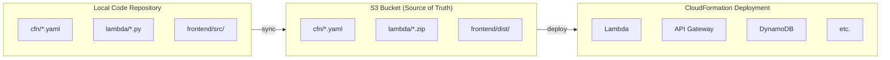
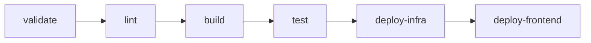

# CI/CD and Deployment Guide

## Deployment Architecture

This solution uses a **GitOps-style deployment model** where an S3 bucket serves as the source of truth for all deployable artifacts. CloudFormation deploys from S3, ensuring reproducible deployments.



## S3 Deployment Bucket Structure

```
s3://{deployment-bucket}/
├── cfn/                          # CloudFormation templates (7 total)
│   ├── master-template.yaml      # Root orchestrator
│   ├── database-stack.yaml       # 3 DynamoDB tables
│   ├── lambda-stack.yaml         # 5 Lambda functions
│   ├── api-stack.yaml            # API Gateway + Cognito
│   ├── step-functions-stack.yaml # Step Functions state machine
│   ├── security-stack.yaml       # Optional WAF + CloudTrail
│   └── frontend-stack.yaml       # S3 + CloudFront
├── lambda/                       # Lambda deployment packages (5 functions)
│   ├── api-handler.zip
│   ├── orchestration-stepfunctions.zip
│   ├── execution-finder.zip
│   ├── execution-poller.zip
│   └── frontend-builder.zip
├── frontend/                     # Frontend build artifacts
│   └── dist/
│       ├── index.html
│       ├── assets/
│       └── aws-config.json
├── scripts/                      # Deployment and automation scripts
├── ssm-documents/                # SSM automation documents
└── docs/                         # Documentation (synced for reference)
```

## Current Process

**Primary Tool**: `./scripts/sync-to-deployment-bucket.sh`

**Daily Workflow**:
1. Make code changes
2. `./scripts/sync-to-deployment-bucket.sh` (sync to S3)
3. `./scripts/sync-to-deployment-bucket.sh --update-lambda-code` (fast ~5s)
4. `./scripts/sync-to-deployment-bucket.sh --deploy-cfn` (full deployment 5-10min)

**Advanced Options**:
- `--dry-run` - Preview changes without executing
- `--profile PROFILE` - Use specific AWS profile
- `--update-lambda-api-handler` - Update specific Lambda function
- `--update-frontend-config` - Update frontend configuration only
- `--cleanup-orphans` - Remove unused S3 objects

**GitLab CI/CD**: Automated pipeline for main/dev branches, manual production

## Deployment Workflow

### Initial Setup

1. **Create S3 Deployment Bucket**
```bash
aws s3 mb s3://{deployment-bucket} --region {region}
aws s3api put-bucket-versioning \
  --bucket {deployment-bucket} \
  --versioning-configuration Status=Enabled
```

2. **Sync Initial Artifacts**
```bash
# Sync CloudFormation templates
aws s3 sync cfn/ s3://{deployment-bucket}/cfn/ --delete

# Package and sync Lambda functions
cd lambda
zip -r api-handler.zip index.py requirements.txt package/
aws s3 cp api-handler.zip s3://{deployment-bucket}/lambda/

# Build and sync frontend
cd frontend
npm run build
aws s3 sync dist/ s3://{deployment-bucket}/frontend/dist/
```

3. **Deploy CloudFormation Stack**
```bash
aws cloudformation deploy \
  --template-url https://{deployment-bucket}.s3.{region}.amazonaws.com/cfn/master-template.yaml \
  --stack-name drs-orchestration-{env} \
  --parameter-overrides \
    ProjectName=drs-orchestration \
    Environment={env} \
    SourceBucket={deployment-bucket} \
    AdminEmail={admin-email} \
  --capabilities CAPABILITY_IAM CAPABILITY_NAMED_IAM \
  --region {region}
```

### Code Change Workflow

For **every** code change, follow this workflow:

#### Step 1: Make Code Changes
```bash
# Edit Lambda code
vim lambda/index.py

# Edit frontend code
vim frontend/src/components/MyComponent.tsx

# Edit CloudFormation templates
vim cfn/lambda-stack.yaml
```

#### Step 2: Sync to S3 (REQUIRED)
```bash
# Sync all artifacts to S3
./scripts/sync-to-deployment-bucket.sh
```

Or manually:
```bash
# Sync CloudFormation templates
aws s3 sync cfn/ s3://{deployment-bucket}/cfn/ --delete

# Package and sync Lambda (if changed)
cd lambda
zip -r api-handler.zip index.py package/
aws s3 cp api-handler.zip s3://{deployment-bucket}/lambda/

# Build and sync frontend (if changed)
cd frontend
npm run build
aws s3 sync dist/ s3://{deployment-bucket}/frontend/dist/ --exclude "aws-config.json"
```

#### Step 3: Deploy Changes

**For Lambda code changes:**
```bash
# Update Lambda function code directly (fastest for development)
aws lambda update-function-code \
  --function-name drs-orchestration-api-handler-{env} \
  --s3-bucket {deployment-bucket} \
  --s3-key lambda/api-handler.zip \
  --region {region}
```

**For CloudFormation changes:**
```bash
aws cloudformation deploy \
  --template-url https://{deployment-bucket}.s3.{region}.amazonaws.com/cfn/master-template.yaml \
  --stack-name drs-orchestration-{env} \
  --parameter-overrides \
    ProjectName=drs-orchestration \
    Environment={env} \
    SourceBucket={deployment-bucket} \
    AdminEmail={admin-email} \
  --capabilities CAPABILITY_IAM CAPABILITY_NAMED_IAM \
  --region {region}
```

**For frontend changes:**
```bash
# Get stack outputs
BUCKET=$(aws cloudformation describe-stacks --stack-name drs-orchestration-{env} \
  --query 'Stacks[0].Outputs[?OutputKey==`FrontendBucketName`].OutputValue' --output text)
DIST_ID=$(aws cloudformation describe-stacks --stack-name drs-orchestration-{env} \
  --query 'Stacks[0].Outputs[?OutputKey==`CloudFrontDistributionId`].OutputValue' --output text)

# Sync to frontend bucket (preserve aws-config.json)
aws s3 sync frontend/dist/ s3://$BUCKET/ --delete --exclude "aws-config.json"

# Invalidate CloudFront cache
aws cloudfront create-invalidation --distribution-id $DIST_ID --paths "/*"
```

#### Step 4: Verify Deployment
```bash
# Check S3 timestamps
AWS_PAGER="" aws s3 ls s3://{deployment-bucket}/lambda/ --region {region}
AWS_PAGER="" aws s3 ls s3://{deployment-bucket}/cfn/ --region {region}

# Verify Lambda was updated
AWS_PAGER="" aws lambda get-function \
  --function-name drs-orchestration-api-handler-{env} \
  --query 'Configuration.LastModified' \
  --region {region}
```

## Lambda Deployment Script

Create an automated deployment script for Lambda functions:

```python
# lambda/deploy_lambda.py
import argparse
import boto3
import subprocess
import os
import zipfile

def package_lambda(function_name):
    """Package Lambda function with dependencies"""
    zip_file = f"{function_name}.zip"
    
    with zipfile.ZipFile(zip_file, 'w', zipfile.ZIP_DEFLATED) as zf:
        # Add Python files
        for py_file in ['index.py']:
            if os.path.exists(py_file):
                zf.write(py_file)
        
        # Add dependencies from package/
        for root, dirs, files in os.walk('package'):
            for file in files:
                file_path = os.path.join(root, file)
                arc_name = os.path.relpath(file_path, 'package')
                zf.write(file_path, arc_name)
    
    return zip_file

def upload_to_s3(zip_file, bucket, key):
    """Upload package to S3"""
    s3 = boto3.client('s3')
    s3.upload_file(zip_file, bucket, key)
    print(f"Uploaded {zip_file} to s3://{bucket}/{key}")

def update_lambda(function_name, bucket, key, region):
    """Update Lambda function code"""
    lambda_client = boto3.client('lambda', region_name=region)
    lambda_client.update_function_code(
        FunctionName=function_name,
        S3Bucket=bucket,
        S3Key=key
    )
    print(f"Updated Lambda function: {function_name}")

def main():
    parser = argparse.ArgumentParser()
    parser.add_argument('--direct', action='store_true', help='Direct Lambda update')
    parser.add_argument('--s3-only', action='store_true', help='Upload to S3 only')
    parser.add_argument('--full', action='store_true', help='S3 upload + Lambda update')
    parser.add_argument('--function-name', required=True)
    parser.add_argument('--bucket', default='aws-drs-orchestration')
    parser.add_argument('--region', default='us-east-1')
    args = parser.parse_args()

    zip_file = package_lambda('api-handler')
    s3_key = f"lambda/{zip_file}"

    if args.s3_only or args.full:
        upload_to_s3(zip_file, args.bucket, s3_key)

    if args.direct or args.full:
        update_lambda(args.function_name, args.bucket, s3_key, args.region)

if __name__ == '__main__':
    main()
```

## Sync Script

The actual sync script (`./scripts/sync-to-deployment-bucket.sh`) provides comprehensive deployment capabilities:

### Available Arguments

```bash
# Basic operations
./scripts/sync-to-deployment-bucket.sh                    # Sync all to S3
./scripts/sync-to-deployment-bucket.sh --deploy-cfn       # Deploy CloudFormation
./scripts/sync-to-deployment-bucket.sh --update-lambda-code  # Update all Lambda functions

# Advanced operations
./scripts/sync-to-deployment-bucket.sh --dry-run          # Preview changes
./scripts/sync-to-deployment-bucket.sh --profile prod     # Use specific AWS profile
./scripts/sync-to-deployment-bucket.sh --cleanup-orphans  # Remove unused S3 objects

# Individual Lambda updates (faster for development)
./scripts/sync-to-deployment-bucket.sh --update-lambda-api-handler
./scripts/sync-to-deployment-bucket.sh --update-lambda-orchestration
./scripts/sync-to-deployment-bucket.sh --update-lambda-execution-finder
./scripts/sync-to-deployment-bucket.sh --update-lambda-execution-poller
./scripts/sync-to-deployment-bucket.sh --update-lambda-frontend-builder

# Frontend operations
./scripts/sync-to-deployment-bucket.sh --build-frontend   # Build frontend first
./scripts/sync-to-deployment-bucket.sh --deploy-frontend  # Deploy to CloudFront
./scripts/sync-to-deployment-bucket.sh --update-frontend-config  # Update config only
```

### Key Features

- **AWS Profile Support**: Use `--profile` for different AWS accounts/environments
- **Dry Run Mode**: Preview all changes with `--dry-run` before execution
- **Individual Lambda Updates**: Update specific functions for faster development cycles
- **Git Integration**: Automatically tags deployments with git commit hash
- **Comprehensive Validation**: Checks stack status, validates parameters, handles errors
- **Progress Reporting**: Detailed output with timing and status indicators
- **Orphan Cleanup**: Removes unused S3 objects to keep bucket clean

## Makefile

Create a Makefile for common operations:

```makefile
# Makefile

BUCKET ?= aws-drs-orchestration
REGION ?= us-east-1
STACK_NAME ?= drs-orchestration-test
ENV ?= test

.PHONY: validate lint sync deploy deploy-lambda deploy-frontend

# Validate CloudFormation templates
validate:
	@echo "Validating CloudFormation templates..."
	@for template in cfn/*.yaml; do \
		echo "Validating $$template..."; \
		aws cloudformation validate-template --template-body file://$$template --region $(REGION); \
	done

# Lint CloudFormation templates
lint:
	@echo "Linting CloudFormation templates..."
	cfn-lint cfn/*.yaml

# Sync all artifacts to S3
sync:
	./scripts/sync-to-deployment-bucket.sh

# Deploy CloudFormation stack
deploy:
	./scripts/sync-to-deployment-bucket.sh --deploy-cfn

# Deploy Lambda code only
deploy-lambda:
	./scripts/sync-to-deployment-bucket.sh --update-lambda-code

# Build and deploy frontend
deploy-frontend:
	./scripts/sync-to-deployment-bucket.sh --build-frontend --deploy-frontend

# Full deployment (sync + deploy all)
deploy-all: sync
	./scripts/sync-to-deployment-bucket.sh --update-lambda-code --deploy-frontend

# Create Cognito test user
create-test-user:
	./scripts/create-test-user.sh

# Run E2E tests
test:
	cd tests/playwright && npx playwright test

# Clean build artifacts
clean:
	rm -rf frontend/dist
	rm -rf lambda/*.zip
	rm -rf tests/playwright/test-results
```

## GitLab CI/CD Pipeline

Current pipeline: 6-stage comprehensive deployment with ECR Public images.

**Pipeline Flow**:


**Key Features**:
- ECR Public images (avoids Docker Hub rate limits)
- Individual Lambda packaging (5 functions)
- Frontend deployment with CloudFormation integration
- AWS credential configuration with session token support

**Current Status**: MVP drill only prototype with automated deployment to test environment and manual production deployment.

**Lambda Packages Built**:
- api-handler.zip (index.py)
- orchestration-stepfunctions.zip (orchestration_stepfunctions.py)
- execution-finder.zip (poller/execution_finder.py)
- execution-poller.zip (poller/execution_poller.py)
- frontend-builder.zip (build_and_deploy.py)

**Individual Lambda Updates**: The sync script supports updating individual Lambda functions for faster development cycles, avoiding full stack deployments when only specific functions change.

**Test Jobs**: Currently disabled until tests/ directory is committed to git.

## Deployment Checklist

Before completing any code change session:

- [ ] Code changes made and tested locally
- [ ] CloudFormation templates updated (if infrastructure changed)
- [ ] Synced to S3: `./scripts/sync-to-deployment-bucket.sh`
- [ ] Deployed via script (not manual)
- [ ] Verified S3 has latest artifacts
- [ ] Tested deployment works
- [ ] Committed changes to git

## Rollback Procedure

If a deployment fails:

```bash
# 1. Identify the last working version
AWS_PAGER="" aws s3api list-object-versions \
  --bucket {deployment-bucket} \
  --prefix lambda/api-handler.zip \
  --query 'Versions[0:5].[VersionId,LastModified]'

# 2. Restore previous Lambda version
aws lambda update-function-code \
  --function-name drs-orchestration-api-handler-{env} \
  --s3-bucket {deployment-bucket} \
  --s3-key lambda/api-handler.zip \
  --s3-object-version {previous-version-id}

# 3. Or rollback CloudFormation
aws cloudformation rollback-stack \
  --stack-name drs-orchestration-{env}
```

## Best Practices

1. **Always sync before deploy**: Never deploy directly from local files
2. **Use S3 versioning**: Enables rollback to previous versions
3. **Tag deployments**: Use git commit hash as S3 object metadata
4. **Validate before deploy**: Run `make validate lint` before deploying
5. **Test in dev first**: Deploy to dev environment before production
6. **Monitor deployments**: Watch CloudFormation events during deployment
7. **Keep artifacts in sync**: Local code, S3 artifacts, and deployed resources should match
8. **Use ECR Public**: Avoids Docker Hub rate limits in CI/CD
9. **Enable quality gates**: Uncomment test jobs when tests/ is committed
