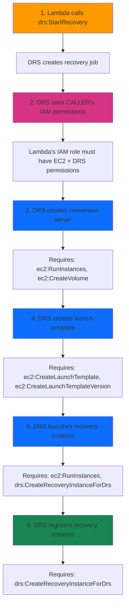

# Debugging Guide

## CRITICAL: Disable Pagers for All Commands

**ALWAYS use `--no-pager` for git commands and `AWS_PAGER=""` for AWS CLI commands.**
Interactive pagers will hang the terminal and cause connection loss.

### Git Commands - ALWAYS use --no-pager
```bash
# REQUIRED: Always prefix git commands with --no-pager
git --no-pager status
git --no-pager log -10
git --no-pager diff HEAD~1
git --no-pager show HEAD
git --no-pager branch -a
git --no-pager commit -m "message"
```

### AWS CLI - ALWAYS use AWS_PAGER=""
```bash
# Set globally or per-command
AWS_PAGER="" aws drs describe-jobs --filters jobIDs=drsjob-xxx --region us-east-1
```

### General Patterns
```bash
# Limit output with head/tail
command | head -50
command | tail -100

# Redirect large output to file
command > output.txt
```

#### General Patterns
```bash
# Limit output with head/tail
command | head -50
command | tail -100

# Redirect large output to file
command > output.txt

# Use cat instead of less
cat file.txt
```

## DRS Integration Debugging

### Understanding DRS Recovery Flow

When Lambda calls `drs:StartRecovery`, the following happens:



### Required IAM Permissions

The Lambda execution role must have comprehensive permissions:

```yaml
# DRS Permissions
- drs:DescribeSourceServers
- drs:StartRecovery
- drs:DescribeJobs
- drs:DescribeJobLogItems
- drs:DescribeRecoveryInstances
- drs:CreateRecoveryInstanceForDrs  # CRITICAL - often missing

# EC2 Permissions (required by DRS during recovery)
- ec2:DescribeInstances
- ec2:DescribeInstanceStatus
- ec2:DescribeInstanceTypes
- ec2:DescribeInstanceTypeOfferings
- ec2:DescribeAccountAttributes
- ec2:DescribeLaunchTemplates
- ec2:DescribeLaunchTemplateVersions
- ec2:DescribeAvailabilityZones
- ec2:DescribeNetworkInterfaces
- ec2:DescribeVolumes
- ec2:DescribeVolumeAttribute
- ec2:GetEbsDefaultKmsKeyId
- ec2:GetEbsEncryptionByDefault

# EC2 Write Permissions
- ec2:RunInstances
- ec2:StartInstances
- ec2:StopInstances
- ec2:TerminateInstances
- ec2:CreateVolume
- ec2:AttachVolume
- ec2:DetachVolume
- ec2:DeleteVolume
- ec2:ModifyVolume
- ec2:CreateLaunchTemplate
- ec2:CreateLaunchTemplateVersion
- ec2:ModifyLaunchTemplate
- ec2:DeleteLaunchTemplate
- ec2:CreateNetworkInterface
- ec2:DeleteNetworkInterface
- ec2:ModifyNetworkInterfaceAttribute
- ec2:CreateTags
```

### Common DRS Errors and Solutions

#### Error: UnauthorizedOperation on CreateLaunchTemplateVersion
```
UnauthorizedOperation when calling CreateLaunchTemplateVersion operation
```

**Cause**: Lambda IAM role missing EC2 launch template permissions.

**Solution**: Add to Lambda IAM role:
```yaml
- ec2:CreateLaunchTemplate
- ec2:CreateLaunchTemplateVersion
- ec2:ModifyLaunchTemplate
- ec2:DeleteLaunchTemplate
- ec2:DeleteLaunchTemplateVersions
```

#### Error: AccessDeniedException on CreateRecoveryInstanceForDrs
```
AccessDeniedException when calling CreateRecoveryInstanceForDrs operation
```

**Cause**: Lambda IAM role missing DRS permission to register recovery instances.

**Solution**: Add to Lambda IAM role:
```yaml
- drs:CreateRecoveryInstanceForDrs
```

#### Error: LAUNCH_FAILED with No Recovery Instances
**Symptom**: DRS job shows LAUNCH_START then LAUNCH_FAILED, no recovery instances created.

**Debugging Steps**:
```bash
# 1. Get job details
AWS_PAGER="" aws drs describe-jobs \
  --filters jobIDs=drsjob-xxx \
  --region us-east-1

# 2. Get job log items for specific errors
AWS_PAGER="" aws drs describe-job-log-items \
  --job-id drsjob-xxx \
  --region us-east-1

# 3. Check CloudTrail for EC2 API failures
AWS_PAGER="" aws cloudtrail lookup-events \
  --lookup-attributes AttributeKey=EventName,AttributeValue=RunInstances \
  --start-time $(date -u -v-1H +%Y-%m-%dT%H:%M:%SZ) \
  --region us-east-1
```

### Debugging Workflow

When DRS recovery fails through Lambda:

#### Step 1: Check Job Status
```bash
AWS_PAGER="" aws drs describe-jobs \
  --filters jobIDs=drsjob-xxx \
  --query 'items[0].{status:status,participatingServers:participatingServers}' \
  --region us-east-1
```

#### Step 2: Check Job Logs
```bash
AWS_PAGER="" aws drs describe-job-log-items \
  --job-id drsjob-xxx \
  --query 'items[?event==`LAUNCH_FAILED`]' \
  --region us-east-1
```

#### Step 3: Check CloudWatch Logs
```bash
# Get Lambda log group
LOG_GROUP="/aws/lambda/drs-orchestration-api-handler-{env}"

# Get recent log streams
AWS_PAGER="" aws logs describe-log-streams \
  --log-group-name $LOG_GROUP \
  --order-by LastEventTime \
  --descending \
  --limit 5 \
  --region us-east-1

# Get log events
AWS_PAGER="" aws logs get-log-events \
  --log-group-name $LOG_GROUP \
  --log-stream-name "{stream-name}" \
  --limit 100 \
  --region us-east-1
```

#### Step 4: Check CloudTrail
```bash
# Look for EC2 API failures
AWS_PAGER="" aws cloudtrail lookup-events \
  --lookup-attributes AttributeKey=EventSource,AttributeValue=ec2.amazonaws.com \
  --start-time $(date -u -v-1H +%Y-%m-%dT%H:%M:%SZ) \
  --query 'Events[?contains(CloudTrailEvent, `errorCode`)].CloudTrailEvent' \
  --region us-east-1
```

#### Step 5: Verify IAM Permissions
```bash
# Get Lambda execution role
ROLE_ARN=$(aws lambda get-function \
  --function-name drs-orchestration-api-handler-{env} \
  --query 'Configuration.Role' \
  --output text \
  --region us-east-1)

ROLE_NAME=$(echo $ROLE_ARN | cut -d'/' -f2)

# List attached policies
AWS_PAGER="" aws iam list-attached-role-policies \
  --role-name $ROLE_NAME

# List inline policies
AWS_PAGER="" aws iam list-role-policies \
  --role-name $ROLE_NAME

# Get specific policy
AWS_PAGER="" aws iam get-role-policy \
  --role-name $ROLE_NAME \
  --policy-name EC2Access
```

## API Debugging

### API Gateway Errors

#### 401 Unauthorized
**Cause**: Invalid or expired Cognito token.

**Solution**:
```bash
# Get new token
TOKEN=$(aws cognito-idp initiate-auth \
  --client-id {client-id} \
  --auth-flow USER_PASSWORD_AUTH \
  --auth-parameters USERNAME={email},PASSWORD={password} \
  --query 'AuthenticationResult.IdToken' \
  --output text)

# Test API
curl -H "Authorization: Bearer $TOKEN" \
  https://{api-id}.execute-api.{region}.amazonaws.com/{stage}/protection-groups
```

#### 403 Forbidden
**Cause**: Cognito authorizer rejecting token or missing permissions.

**Debugging**:
```bash
# Decode JWT token (base64)
echo $TOKEN | cut -d'.' -f2 | base64 -d 2>/dev/null | jq .

# Check token expiration
echo $TOKEN | cut -d'.' -f2 | base64 -d 2>/dev/null | jq '.exp | todate'
```

#### 500 Internal Server Error
**Cause**: Lambda execution error.

**Debugging**:
```bash
# Check Lambda logs
AWS_PAGER="" aws logs tail /aws/lambda/drs-orchestration-api-handler-{env} \
  --since 5m \
  --region us-east-1
```

### Lambda Debugging

#### Check Lambda Configuration
```bash
AWS_PAGER="" aws lambda get-function-configuration \
  --function-name drs-orchestration-api-handler-{env} \
  --query '{Runtime:Runtime,MemorySize:MemorySize,Timeout:Timeout,Environment:Environment.Variables}' \
  --region us-east-1
```

#### Test Lambda Directly
```bash
# Create test event
cat > /tmp/test-event.json << 'EOF'
{
  "httpMethod": "GET",
  "path": "/protection-groups",
  "headers": {
    "Authorization": "Bearer xxx"
  },
  "queryStringParameters": null,
  "body": null
}
EOF

# Invoke Lambda
AWS_PAGER="" aws lambda invoke \
  --function-name drs-orchestration-api-handler-{env} \
  --payload file:///tmp/test-event.json \
  --cli-binary-format raw-in-base64-out \
  /tmp/response.json \
  --region us-east-1

cat /tmp/response.json | jq .
```

## DynamoDB Debugging

### Query Tables Directly
```bash
# Scan Protection Groups
AWS_PAGER="" aws dynamodb scan \
  --table-name protection-groups-{env} \
  --region us-east-1

# Query specific item
AWS_PAGER="" aws dynamodb get-item \
  --table-name protection-groups-{env} \
  --key '{"GroupId": {"S": "xxx"}}' \
  --region us-east-1

# Query executions by status (using GSI)
AWS_PAGER="" aws dynamodb query \
  --table-name execution-history-{env} \
  --index-name StatusIndex \
  --key-condition-expression "#s = :status" \
  --expression-attribute-names '{"#s": "Status"}' \
  --expression-attribute-values '{":status": {"S": "PENDING"}}' \
  --region us-east-1
```

## Step Functions Debugging

### Check Execution Status
```bash
# List recent executions
AWS_PAGER="" aws stepfunctions list-executions \
  --state-machine-arn arn:aws:states:{region}:{account}:stateMachine:xxx \
  --status-filter FAILED \
  --max-results 10 \
  --region us-east-1

# Get execution details
AWS_PAGER="" aws stepfunctions describe-execution \
  --execution-arn arn:aws:states:{region}:{account}:execution:xxx:yyy \
  --region us-east-1

# Get execution history
AWS_PAGER="" aws stepfunctions get-execution-history \
  --execution-arn arn:aws:states:{region}:{account}:execution:xxx:yyy \
  --region us-east-1
```

## Frontend Debugging

### Check Browser Console
Common issues:
- CORS errors: Check API Gateway CORS configuration
- 401 errors: Check Cognito token refresh
- Network errors: Check API endpoint URL

### Check CloudFront
```bash
# Get distribution status
AWS_PAGER="" aws cloudfront get-distribution \
  --id {distribution-id} \
  --query 'Distribution.{Status:Status,DomainName:DomainName}' \
  --region us-east-1

# Check for recent invalidations
AWS_PAGER="" aws cloudfront list-invalidations \
  --distribution-id {distribution-id} \
  --region us-east-1
```

### Check S3 Frontend Bucket
```bash
# List files
AWS_PAGER="" aws s3 ls s3://{frontend-bucket}/ --recursive

# Check aws-config.json
AWS_PAGER="" aws s3 cp s3://{frontend-bucket}/aws-config.json - | jq .
```

## Performance Debugging

### Lambda Cold Starts
```bash
# Check Lambda metrics
AWS_PAGER="" aws cloudwatch get-metric-statistics \
  --namespace AWS/Lambda \
  --metric-name Duration \
  --dimensions Name=FunctionName,Value=drs-orchestration-api-handler-{env} \
  --start-time $(date -u -v-1H +%Y-%m-%dT%H:%M:%SZ) \
  --end-time $(date -u +%Y-%m-%dT%H:%M:%SZ) \
  --period 300 \
  --statistics Average Maximum \
  --region us-east-1
```

### DynamoDB Performance
```bash
# Check consumed capacity
AWS_PAGER="" aws cloudwatch get-metric-statistics \
  --namespace AWS/DynamoDB \
  --metric-name ConsumedReadCapacityUnits \
  --dimensions Name=TableName,Value=protection-groups-{env} \
  --start-time $(date -u -v-1H +%Y-%m-%dT%H:%M:%SZ) \
  --end-time $(date -u +%Y-%m-%dT%H:%M:%SZ) \
  --period 300 \
  --statistics Sum \
  --region us-east-1
```

## Useful Debugging Commands

### Quick Health Check
```bash
#!/bin/bash
# scripts/health-check.sh

REGION=${1:-us-east-1}
ENV=${2:-test}

echo "=== Health Check ==="

# Check Lambda
echo "Lambda:"
AWS_PAGER="" aws lambda get-function \
  --function-name drs-orchestration-api-handler-$ENV \
  --query 'Configuration.{State:State,LastModified:LastModified}' \
  --region $REGION

# Check API Gateway
echo "API Gateway:"
API_ID=$(aws apigateway get-rest-apis \
  --query "items[?name=='drs-orchestration-api-$ENV'].id" \
  --output text --region $REGION)
echo "API ID: $API_ID"

# Check DynamoDB tables
echo "DynamoDB Tables:"
for table in protection-groups recovery-plans execution-history; do
  AWS_PAGER="" aws dynamodb describe-table \
    --table-name $table-$ENV \
    --query 'Table.{Name:TableName,Status:TableStatus,ItemCount:ItemCount}' \
    --region $REGION 2>/dev/null || echo "$table-$ENV: NOT FOUND"
done

# Check CloudFront
echo "CloudFront:"
AWS_PAGER="" aws cloudformation describe-stacks \
  --stack-name drs-orchestration-$ENV \
  --query 'Stacks[0].Outputs[?OutputKey==`CloudFrontUrl`].OutputValue' \
  --output text --region $REGION

echo "=== Health Check Complete ==="
```
