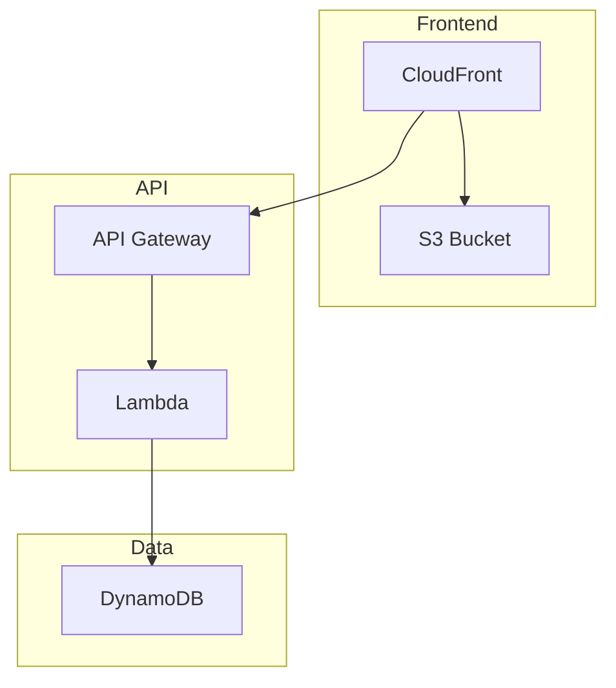
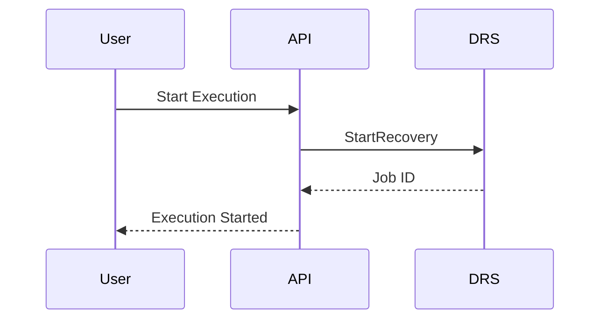
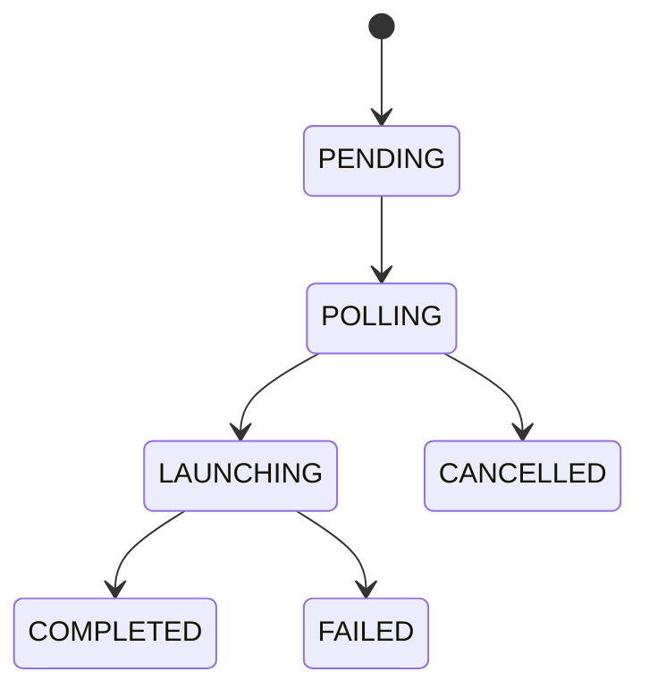

# Diagram Preferences

## Mermaid Over ASCII

When creating diagrams in documentation or code comments, always prefer Mermaid markdown diagrams over ASCII art diagrams.

### Why Mermaid?

- **Maintainable**: Easy to update without manual alignment
- **Readable**: Clean syntax that's easy to understand
- **Portable**: Renders in GitHub, GitLab, VS Code, and most markdown viewers
- **Accessible**: Better screen reader support than ASCII art
- **Version Control**: Meaningful diffs when diagrams change

### Diagram Types

Use appropriate Mermaid diagram types:

| Use Case | Mermaid Type |
|----------|--------------|
| Workflows, processes | `flowchart` or `graph` |
| Sequences, API calls | `sequenceDiagram` |
| State transitions | `stateDiagram-v2` |
| Class relationships | `classDiagram` |
| Entity relationships | `erDiagram` |
| Timelines | `gantt` |
| Architecture | `flowchart` with subgraphs |

### Examples

**Architecture Diagram:**

**Sequence Diagram:**

**State Diagram:**

### When ASCII is Acceptable

ASCII diagrams may be used only when:
- Inline in code comments where Mermaid won't render
- Terminal output or CLI help text
- Legacy documentation being incrementally updated
