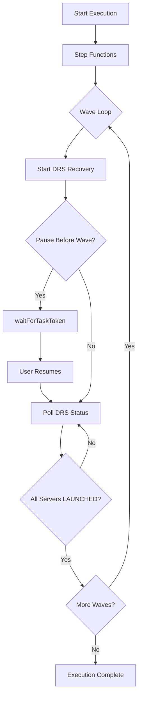
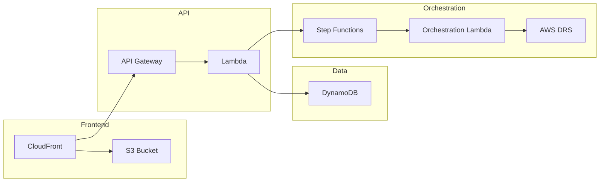

# Project Structure

## Directory Organization

```text
AWS-DRS-Orchestration/
├── cfn/                          # CloudFormation Infrastructure as Code
├── frontend/                     # React + CloudScape UI application
├── lambda/                       # Python Lambda functions
├── scripts/                      # Deployment and automation scripts
├── tests/                        # Python unit/integration and Playwright E2E tests
├── docs/                         # Comprehensive documentation
├── ssm-documents/                # SSM automation documents (Phase 2)
├── archive/                      # Historical artifacts and reference implementations
└── .kiro/steering/               # Kiro steering rules and project guidance
```

## Core Components

### CloudFormation Templates (`cfn/`)

Modular nested stack architecture for infrastructure deployment:

- **master-template.yaml**: Root orchestrator, parameter propagation, stack outputs
- **database-stack.yaml**: 3 DynamoDB tables (protection-groups, recovery-plans, execution-history)
- **lambda-stack.yaml**: 5 Lambda functions with IAM roles and permissions
- **api-stack.yaml**: API Gateway, Cognito User Pool, authorizer configuration
- **step-functions-stack.yaml**: Step Functions orchestration state machine with waitForTaskToken
- **frontend-stack.yaml**: S3 static hosting, CloudFront CDN distribution
- **security-stack.yaml**: Optional WAF and CloudTrail audit logging

### Frontend Application (`frontend/`)

React + TypeScript + CloudScape Design System:

```text
frontend/
├── src/
│   ├── components/          # 33 components
│   │   ├── cloudscape/      # CloudScape wrapper components
│   │   │   ├── AppLayout.tsx
│   │   │   └── ContentLayout.tsx
│   │   ├── ProtectionGroupDialog.tsx
│   │   ├── RecoveryPlanDialog.tsx
│   │   ├── ConfirmDialog.tsx
│   │   ├── ServerSelector.tsx
│   │   ├── ServerDiscoveryPanel.tsx
│   │   ├── ServerListItem.tsx
│   │   ├── ServerInfoPanel.tsx
│   │   ├── RegionSelector.tsx
│   │   ├── WaveConfigEditor.tsx
│   │   ├── StatusBadge.tsx
│   │   ├── WaveProgress.tsx
│   │   ├── DateTimeDisplay.tsx
│   │   ├── DRSQuotaStatus.tsx
│   │   ├── ExecutionDetails.tsx
│   │   ├── InvocationSourceBadge.tsx
│   │   ├── JobEventsTimeline.tsx
│   │   ├── LaunchConfigSection.tsx
│   │   ├── TagsEditor.tsx
│   │   ├── DiskSettingsEditor.tsx
│   │   ├── ReplicationSettingsEditor.tsx
│   │   ├── PostLaunchSettingsEditor.tsx
│   │   ├── PitPolicyEditor.tsx
│   │   ├── ErrorBoundary.tsx
│   │   ├── ErrorFallback.tsx
│   │   ├── ErrorState.tsx
│   │   ├── LoadingState.tsx
│   │   ├── CardSkeleton.tsx
│   │   ├── DataTableSkeleton.tsx
│   │   ├── PageTransition.tsx
│   │   └── ProtectedRoute.tsx
│   ├── pages/               # 9 page components
│   │   ├── LoginPage.tsx
│   │   ├── Dashboard.tsx
│   │   ├── GettingStartedPage.tsx
│   │   ├── ProtectionGroupsPage.tsx
│   │   ├── RecoveryPlansPage.tsx
│   │   ├── ExecutionsPage.tsx
│   │   ├── ExecutionDetailsPage.tsx
│   │   ├── ServerDetailsPage.tsx
│   │   └── QuotasPage.tsx
│   ├── services/            # API client and authentication services
│   ├── contexts/            # React contexts (Auth, API, Notification)
│   ├── types/               # TypeScript type definitions
│   ├── theme/               # CloudScape theme customization
│   └── App.tsx              # Main application component with routing
├── public/                  # Static assets and aws-config.json
├── vite.config.ts           # Vite build configuration
└── package.json             # Dependencies and build scripts
```

**Key Technologies**:

- React 19.1.1 with TypeScript 5.9.3
- CloudScape Design System 3.0.1148
- AWS Amplify 6.15.8 for authentication
- React Router 7.9.5 for navigation
- Vite 7.1.7 for build tooling
- react-hot-toast 2.6.0 for notifications
- date-fns 4.1.0 for date formatting


### Lambda Functions (`lambda/`)

Python 3.12 serverless compute:

**Active Functions (5 deployed):**

- **index.py** → `api-handler`: REST API endpoints for protection groups, recovery plans, executions, DRS integration, terminate recovery instances
- **orchestration_stepfunctions.py** → `orchestration-stepfunctions`: Step Functions orchestration engine with wave execution, pause/resume via waitForTaskToken
- **build_and_deploy.py** → `frontend-builder`: CloudFormation custom resource for frontend deployment
- **poller/execution_finder.py** → `execution-finder`: Queries StatusIndex GSI for executions in POLLING status (EventBridge scheduled)
- **poller/execution_poller.py** → `execution-poller`: Polls DRS job status and updates execution wave states

**Dependencies**: crhelper==2.0.11 (boto3 provided by Lambda runtime)

### Scripts (`scripts/`)

Automation and deployment utilities:

- **sync-to-deployment-bucket.sh**: Primary deployment script - syncs code to S3 and deploys via CloudFormation
- **deploy-and-sync-all.sh**: Complete deployment workflow
- **validate-templates.sh**: CloudFormation template validation
- **create-test-user.sh**: Cognito user creation for testing
- **execute_drill.py**: Manual drill execution for testing
- **monitor_drill.py**: Real-time drill monitoring
- **cleanup_stuck_drs_jobs.py**: DRS job cleanup utility

### Tests (`tests/`)

Comprehensive testing infrastructure:

```text
tests/
├── python/
│   ├── unit/                # Unit tests for Lambda functions
│   ├── integration/         # Integration tests with AWS services
│   ├── e2e/                 # End-to-end API tests
│   ├── fixtures/            # Test data and mocks
│   └── conftest.py          # Pytest configuration
└── playwright/
    ├── page-objects/        # Page object models
    ├── smoke-tests.spec.ts  # Critical path tests
    └── playwright.config.ts # Playwright configuration
```


## Architectural Patterns

> **Visual Reference**: See [docs/architecture/AWS-DRS-Orchestration-Architecture.png](docs/architecture/AWS-DRS-Orchestration-Architecture.png) for the complete architecture diagram ([source .drawio](docs/architecture/AWS-DRS-Orchestration-Architecture.drawio))

### Nested Stack Architecture

- Master template orchestrates 6 nested stacks (database, lambda, api, step-functions, security, frontend)
- Parameter propagation from master to child stacks
- Modular design enables independent stack updates
- Outputs aggregated at master level for easy access

### API-First Design

- REST API via API Gateway with Cognito JWT authentication
- Lambda functions handle all business logic
- DynamoDB for data persistence with single-table design per entity
- Step Functions for long-running orchestration workflows

### Event-Driven Orchestration



### Frontend Architecture

- Single-page application with client-side routing
- CloudScape components for consistent AWS UI/UX
- Amplify Auth for Cognito integration with 45-minute auto-logout
- Axios for API communication with JWT token injection
- 3-second polling intervals for active execution monitoring


## Data Flow



1. **User Request** → CloudFront → S3 (static frontend)
2. **API Call** → API Gateway → Cognito (auth) → Lambda (business logic)
3. **Execution Start** → Lambda → Step Functions → Orchestration Lambda
4. **DRS Integration** → Orchestration Lambda → AWS DRS API → EC2 Recovery Instances
5. **Status Updates** → DynamoDB → Poller Lambda → API Gateway → Frontend

## Deployment Bucket Structure

S3 bucket `aws-drs-orchestration` contains deployment artifacts:

```text
s3://aws-drs-orchestration/
├── cfn/                     # CloudFormation templates (7 total)
│   ├── master-template.yaml      # Root orchestrator
│   ├── database-stack.yaml       # 3 DynamoDB tables
│   ├── lambda-stack.yaml         # 5 Lambda functions
│   ├── api-stack.yaml            # API Gateway + Cognito
│   ├── step-functions-stack.yaml # Step Functions state machine
│   ├── security-stack.yaml       # Optional WAF + CloudTrail
│   └── frontend-stack.yaml       # S3 + CloudFront
├── lambda/                  # Lambda deployment packages (5 functions)
│   ├── api-handler.zip
│   ├── orchestration-stepfunctions.zip
│   ├── execution-finder.zip
│   ├── execution-poller.zip
│   └── frontend-builder.zip
└── frontend/                # Frontend build artifacts
    ├── index.html
    ├── assets/
    └── aws-config.json
```

## Key Relationships

- **Protection Groups** contain DRS source servers organized logically
- **Recovery Plans** reference Protection Groups per wave and define wave execution order
- **Executions** instantiate Recovery Plans with drill/recovery mode
- **Step Functions** orchestrate wave-by-wave execution with pause/resume capability
- **DynamoDB Tables** store all entities with execution history for audit trails
