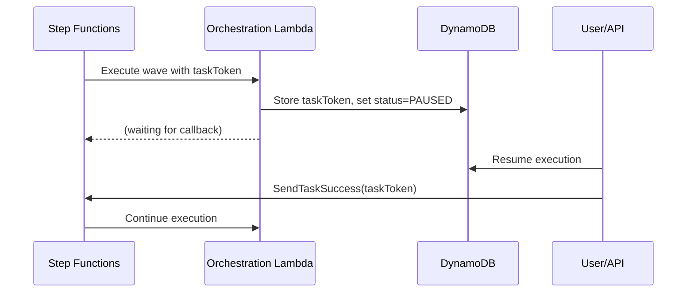

# Technology Stack

## Programming Languages

### Frontend

- **TypeScript 5.9.3**: Strict type checking for React components
- **JavaScript (ES6+)**: Build scripts and configuration files

### Backend

- **Python 3.12**: Lambda functions and orchestration logic
- **Bash**: Deployment and automation scripts

### Infrastructure

- **YAML**: CloudFormation templates and configuration files

## Core Technologies

### Frontend Stack

| Package | Version | Purpose |
|---------|---------|---------|
| React | 19.1.1 | UI framework with hooks and functional components |
| CloudScape Design System | 3.0.1148 | AWS-native UI component library |
| @cloudscape-design/collection-hooks | 1.0.78 | Table state management |
| Vite | 7.1.7 | Fast build tool and development server |
| React Router | 7.9.5 | Client-side routing and navigation |
| AWS Amplify | 6.15.8 | Authentication and AWS service integration |
| Axios | 1.13.2 | HTTP client for API communication |
| react-hot-toast | 2.6.0 | Toast notifications |
| date-fns | 4.1.0 | Date formatting and manipulation |
| TypeScript | 5.9.3 | Type checking |
| ESLint | 9.36.0 | Code quality and linting |


### Backend Stack

- **AWS Lambda**: Serverless compute (Python 3.12 runtime)
- **boto3**: AWS SDK for Python (provided by Lambda runtime)
- **crhelper 2.0.11**: CloudFormation custom resource helper

### AWS Services

| Service | Purpose |
|---------|---------|
| API Gateway | REST API with Cognito authorizer |
| Cognito | User authentication with 45-minute session timeout |
| Step Functions | Orchestration state machine with waitForTaskToken |
| DynamoDB | NoSQL database for protection groups, recovery plans, execution history |
| S3 | Static website hosting and deployment artifact storage |
| CloudFront | CDN for global frontend distribution |
| CloudFormation | Infrastructure as Code deployment |
| IAM | Least-privilege access control |
| CloudWatch Logs | Centralized logging and monitoring |
| EventBridge | Scheduled execution polling (1-minute intervals) |
| AWS DRS | Elastic Disaster Recovery service integration |

### Testing Stack

- **Pytest**: Python unit and integration testing
- **Playwright**: End-to-end browser automation testing
- **Coverage.py**: Python code coverage analysis
- **Hypothesis**: Property-based testing for Python

## Build Systems

### Frontend Build

```bash
# Development server with hot reload
npm run dev

# Production build (TypeScript compilation + Vite bundling)
npm run build

# Type checking without emitting files
npm run type-check

# ESLint code quality checks
npm run lint
```

**Build Output**: `frontend/dist/` directory with optimized static assets


### Lambda Packaging

```bash
# Package individual Lambda function
cd lambda
zip -r api-handler.zip index.py

# Package with dependencies
pip install -r requirements.txt -t package/
cd package && zip -r ../deployment-package.zip . && cd ..
zip -g deployment-package.zip index.py
```

**Build Output**: ZIP files in `lambda/` directory

### CloudFormation Validation

```bash
# AWS native validation
make validate

# cfn-lint validation
make lint

# Complete validation pipeline
make all
```

## Development Commands

### Local Development

#### Frontend Development

```bash
cd frontend
npm install                    # Install dependencies
npm run dev                    # Start dev server (http://localhost:5173)
npm run build                  # Production build
npm run preview                # Preview production build
```

#### Lambda Testing

```bash
cd tests/python
pip install -r requirements.txt
pytest unit/                   # Run unit tests
pytest integration/            # Run integration tests
pytest --cov=lambda            # Run with coverage
```

#### E2E Testing

```bash
cd tests/playwright
npm install
npx playwright test            # Run all tests
npx playwright test --ui       # Interactive UI mode
npx playwright show-report     # View test report
```

### Deployment Commands

#### Primary Deployment Workflow

```bash
# Sync everything to S3 deployment bucket
./scripts/sync-to-deployment-bucket.sh

# Sync and deploy CloudFormation
./scripts/sync-to-deployment-bucket.sh --deploy-cfn

# Fast Lambda code update (no CloudFormation)
./scripts/sync-to-deployment-bucket.sh --update-lambda-code

# Build and deploy frontend
./scripts/sync-to-deployment-bucket.sh --build-frontend --deploy-frontend

# Dry run (preview changes)
./scripts/sync-to-deployment-bucket.sh --dry-run
```


#### CloudFormation Deployment

```bash
# Deploy from S3 artifacts
aws cloudformation deploy \
  --template-url https://aws-drs-orchestration.s3.us-east-1.amazonaws.com/cfn/master-template.yaml \
  --stack-name drs-orchestration-dev \
  --parameter-overrides \
    ProjectName=drs-orchestration \
    Environment=dev \
    SourceBucket=aws-drs-orchestration \
    AdminEmail=admin@example.com \
  --capabilities CAPABILITY_IAM CAPABILITY_NAMED_IAM \
  --region us-east-1

# Validate templates
./scripts/validate-templates.sh

# Check stack status
aws cloudformation describe-stacks \
  --stack-name drs-orchestration-dev \
  --region us-east-1
```

#### Direct Lambda Deployment (Development Only)

```bash
cd lambda
python3 deploy_lambda.py --direct \
  --function-name drs-orchestration-api-handler-prod \
  --region us-east-1
```

### Testing Commands

#### Python Tests

```bash
cd tests/python

# Unit tests
pytest unit/ -v

# Integration tests (requires AWS credentials)
pytest integration/ -v

# E2E tests
pytest e2e/ -v

# Coverage report
pytest --cov=lambda --cov-report=html

# Specific test file
pytest unit/test_recovery_plan_delete.py -v
```

#### Playwright Tests

```bash
cd tests/playwright

# Run all tests
npx playwright test

# Run specific test
npx playwright test smoke-tests.spec.ts

# Debug mode
npx playwright test --debug

# Headed mode (see browser)
npx playwright test --headed

# Generate test report
npx playwright show-report
```


### Utility Commands

#### Makefile Targets

```bash
make help                      # Show all available targets
make install                   # Install validation tools
make validate                  # Validate CloudFormation templates
make lint                      # Run cfn-lint
make sync-s3                   # Sync to S3 deployment bucket
make sync-s3-dry-run          # Preview S3 sync
make enable-auto-sync         # Enable auto-sync after git push
make disable-auto-sync        # Disable auto-sync
```

#### DRS Operations

```bash
# Execute drill
python3 scripts/execute_drill.py

# Monitor drill execution
python3 scripts/monitor_drill.py

# Check drill status
python3 scripts/check_drill_status.py

# Cleanup stuck DRS jobs
python3 scripts/cleanup_stuck_drs_jobs.py
```

#### Cognito User Management

```bash
# Create test user
./scripts/create-test-user.sh

# Manual user creation
aws cognito-idp admin-create-user \
  --user-pool-id us-east-1_xxxxx \
  --username admin@example.com \
  --user-attributes Name=email,Value=admin@example.com \
  --temporary-password "TempPass123!"
```

## Dependencies

### Frontend Dependencies

```json
{
  "dependencies": {
    "@cloudscape-design/components": "^3.0.1148",
    "@cloudscape-design/collection-hooks": "^1.0.78",
    "aws-amplify": "^6.15.8",
    "axios": "^1.13.2",
    "react": "^19.1.1",
    "react-dom": "^19.1.1",
    "react-hot-toast": "^2.6.0",
    "react-router-dom": "^7.9.5",
    "date-fns": "^4.1.0"
  },
  "devDependencies": {
    "typescript": "~5.9.3",
    "vite": "^7.1.7",
    "eslint": "^9.36.0",
    "@types/react": "^19.0.1",
    "@types/react-dom": "^19.0.1"
  }
}
```


### Lambda Dependencies

```txt
crhelper==2.0.11
# boto3 provided by Lambda runtime
```

### Python Test Dependencies

```txt
pytest>=7.4.0
pytest-cov>=4.1.0
pytest-asyncio>=0.21.0
boto3>=1.28.0
moto>=4.1.0
hypothesis>=6.82.0
```

## Environment Configuration

### Frontend Environment Variables

```bash
VITE_API_ENDPOINT=https://api-endpoint.execute-api.us-east-1.amazonaws.com/prod
VITE_COGNITO_REGION=us-east-1
VITE_COGNITO_USER_POOL_ID=us-east-1_xxxxx
VITE_COGNITO_CLIENT_ID=xxxxxxxxxxxxxxxxxxxxxxxxxx
```

### Deployment Environment Files

- `.env.dev`: Development environment configuration
- `.env.qa`: QA environment configuration
- `.env.test`: Test environment configuration
- `.env.deployment`: Deployment bucket configuration

## Version Control

- **Git**: Version control with feature branch workflow
- **GitLab CI/CD**: Automated pipeline (`.gitlab-ci.yml`)
- **Pre-commit Hooks**: CloudFormation validation before commit

## CI/CD Pipeline Stages

1. **Validate**: CloudFormation template validation, TypeScript type checking
2. **Lint**: Python (flake8), Frontend (ESLint)
3. **Build**: Lambda packaging, Frontend build
4. **Test**: Python unit tests, Playwright E2E tests
5. **Deploy Infrastructure**: S3 artifact upload, CloudFormation deployment
6. **Deploy Frontend**: S3 sync, CloudFront invalidation

## Key Implementation Patterns

### Pause/Resume Execution

Uses Step Functions `waitForTaskToken` callback pattern:



### Real-Time Polling

- Frontend polls every 3 seconds for active executions
- EventBridge triggers execution-finder every 1 minute
- DRS job status polled until LAUNCHED or FAILED
