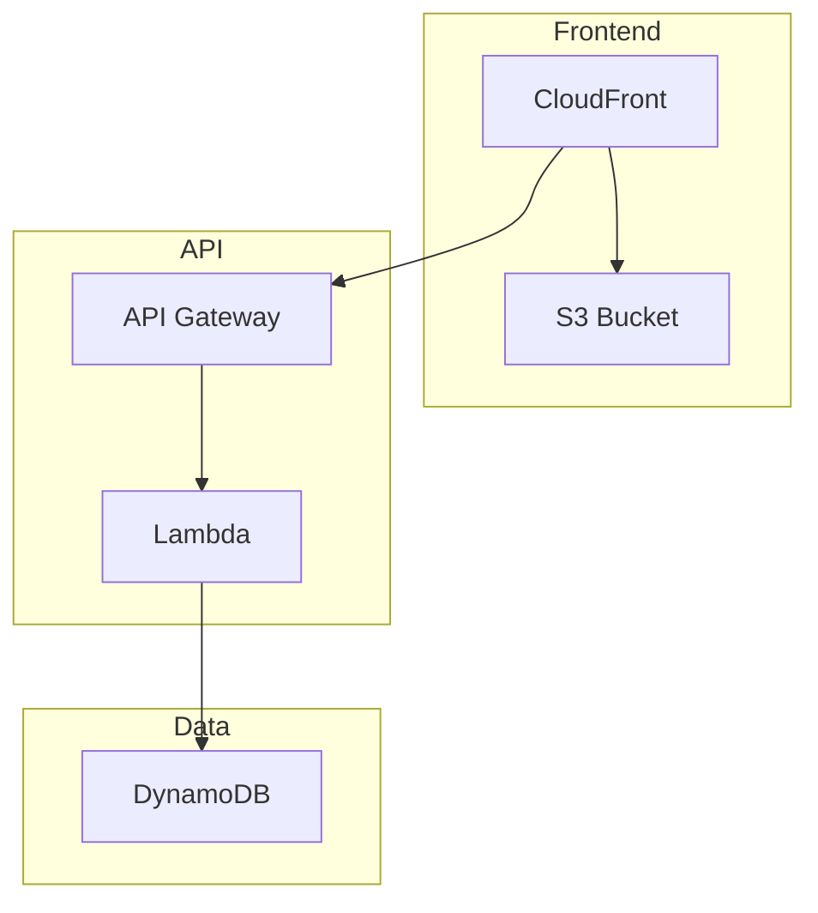
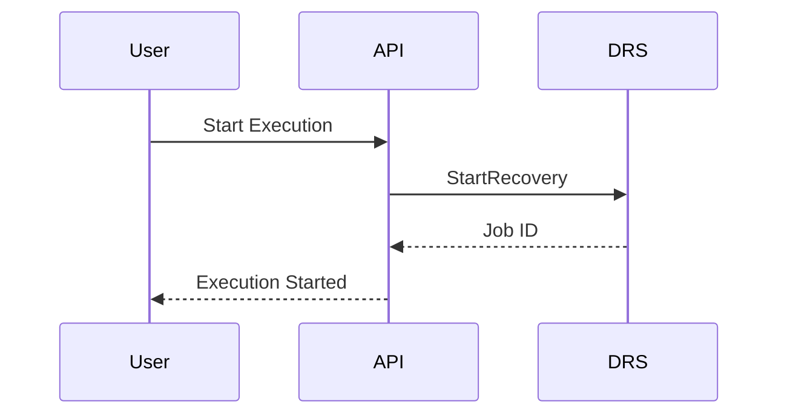
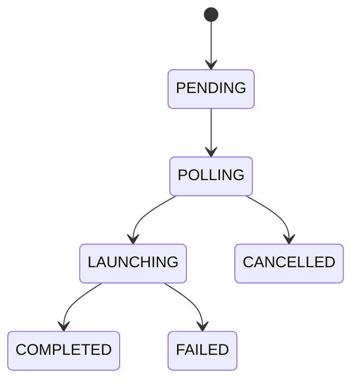

# Technical Standards

## Diagram Preferences

### Mermaid Over ASCII

When creating diagrams in documentation or code comments, always prefer Mermaid markdown diagrams over ASCII art diagrams.

#### Why Mermaid?

- **Maintainable**: Easy to update without manual alignment
- **Readable**: Clean syntax that's easy to understand
- **Portable**: Renders in GitHub, GitLab, VS Code, and most markdown viewers
- **Accessible**: Better screen reader support than ASCII art
- **Version Control**: Meaningful diffs when diagrams change

#### Diagram Types

Use appropriate Mermaid diagram types:

| Use Case | Mermaid Type |
|----------|--------------|
| Workflows, processes | `flowchart` or `graph` |
| Sequences, API calls | `sequenceDiagram` |
| State transitions | `stateDiagram-v2` |
| Class relationships | `classDiagram` |
| Entity relationships | `erDiagram` |
| Timelines | `gantt` |
| Architecture | `flowchart` with subgraphs |

#### Examples

**Architecture Diagram:**


**Sequence Diagram:**


**State Diagram:**


#### When ASCII is Acceptable

ASCII diagrams may be used only when:
- Inline in code comments where Mermaid won't render
- Terminal output or CLI help text
- Legacy documentation being incrementally updated

## AWS Diagram Icon Standards

### AWS 2025 (AWS4) Icon Set

When creating AWS architecture diagrams using draw.io or the aws-diagram-mcp, always use the AWS4 2025 icon format.

#### Icon Style Format

All AWS service icons must use this style pattern:
```
sketch=0;outlineConnect=0;fontColor=#232F3E;fillColor=<SERVICE_COLOR>;strokeColor=#ffffff;dashed=0;verticalLabelPosition=bottom;verticalAlign=top;align=center;html=1;fontSize=11;fontStyle=0;aspect=fixed;shape=mxgraph.aws4.resourceIcon;resIcon=mxgraph.aws4.<service_name>;
```

#### Official AWS Service Colors (2025)

| Category | Color | Services |
|----------|-------|----------|
| Compute | #ED7100 | lambda, ec2, ecs, eks, fargate, batch |
| Storage | #7AA116 | s3, efs, fsx, elastic_block_store, elastic_disaster_recovery |
| Database | #C925D1 | dynamodb, rds, aurora, redshift, elasticache |
| Networking | #8C4FFF | vpc, cloudfront, route53, api_gateway_endpoint, elastic_load_balancing |
| App Integration | #E7157B | api_gateway, step_functions, eventbridge, sns, sqs, cloudwatch, cloudtrail, cloudformation, systems_manager |
| Security | #DD344C | cognito, iam, waf, shield, secrets_manager, kms |

#### Common Service Icon Names

| Service | resIcon Value |
|---------|---------------|
| Lambda | mxgraph.aws4.lambda |
| S3 | mxgraph.aws4.s3 |
| DynamoDB | mxgraph.aws4.dynamodb |
| API Gateway | mxgraph.aws4.api_gateway |
| CloudFront | mxgraph.aws4.cloudfront |
| Cognito | mxgraph.aws4.cognito |
| Step Functions | mxgraph.aws4.step_functions |
| EventBridge | mxgraph.aws4.eventbridge |
| CloudWatch | mxgraph.aws4.cloudwatch |
| CloudTrail | mxgraph.aws4.cloudtrail |
| CloudFormation | mxgraph.aws4.cloudformation |
| IAM | mxgraph.aws4.iam |
| WAF | mxgraph.aws4.waf |
| SNS | mxgraph.aws4.sns |
| SQS | mxgraph.aws4.sqs |
| EC2 | mxgraph.aws4.ec2 |
| ECS | mxgraph.aws4.ecs |
| EKS | mxgraph.aws4.eks |
| RDS | mxgraph.aws4.rds |
| Aurora | mxgraph.aws4.aurora |
| ElastiCache | mxgraph.aws4.elasticache |
| VPC | mxgraph.aws4.vpc |
| Route 53 | mxgraph.aws4.route_53 |
| Systems Manager | mxgraph.aws4.systems_manager |
| Secrets Manager | mxgraph.aws4.secrets_manager |
| KMS | mxgraph.aws4.kms |
| EBS | mxgraph.aws4.elastic_block_store |
| DRS | mxgraph.aws4.elastic_disaster_recovery |

#### Example Icon Cell

```xml
<mxCell id="lambda-function" value="My Lambda" style="sketch=0;outlineConnect=0;fontColor=#232F3E;fillColor=#ED7100;strokeColor=#ffffff;dashed=0;verticalLabelPosition=bottom;verticalAlign=top;align=center;html=1;fontSize=11;fontStyle=0;aspect=fixed;shape=mxgraph.aws4.resourceIcon;resIcon=mxgraph.aws4.lambda;" parent="1" vertex="1">
  <mxGeometry x="100" y="100" width="78" height="78" as="geometry" />
</mxCell>
```

#### Do NOT Use

- Old rounded rectangle boxes with solid colors
- Generic shapes without AWS4 icons
- Outdated AWS3 icon format
- Custom non-standard colors

## Code Documentation Standards

### Inline Comments

Use clear, concise comments that explain the "why" not the "what":

```python
# Good: Explains why
# Wait for DRS job to reach LAUNCHED status before proceeding to next wave
while job_status != 'LAUNCHED':
    time.sleep(30)
    job_status = get_drs_job_status(job_id)

# Bad: Explains what (obvious from code)
# Check if job status equals LAUNCHED
if job_status == 'LAUNCHED':
```

### Function Documentation

Use consistent docstring format:

```python
def start_recovery_execution(recovery_plan_id: str, execution_type: str) -> dict:
    """
    Start a new recovery execution for the specified recovery plan.
    
    Args:
        recovery_plan_id: Unique identifier for the recovery plan
        execution_type: Either 'DRILL' or 'RECOVERY'
    
    Returns:
        dict: Execution details including execution_id and status
        
    Raises:
        ValidationError: If recovery plan doesn't exist or is invalid
        DRSServiceError: If DRS service limits are exceeded
    """
```

### TypeScript Interface Documentation

```typescript
/**
 * Protection Group configuration for organizing DRS source servers
 */
interface ProtectionGroup {
  /** Unique identifier for the protection group */
  groupId: string;
  
  /** Human-readable name for the protection group */
  name: string;
  
  /** AWS region where DRS source servers are located */
  region: string;
  
  /** List of DRS source server IDs in this group */
  serverIds: string[];
  
  /** Creation timestamp in ISO 8601 format */
  createdAt: string;
  
  /** Last modification timestamp in ISO 8601 format */
  updatedAt: string;
}
```

## API Documentation Standards

### REST API Endpoint Documentation

```markdown
## POST /api/v1/protection-groups

Create a new protection group.

### Request Body

```json
{
  "name": "Web Tier Servers",
  "region": "us-east-1",
  "serverIds": ["s-1234567890abcdef0", "s-0987654321fedcba0"]
}
```

### Response

**Success (201 Created):**
```json
{
  "groupId": "pg-abc123def456",
  "name": "Web Tier Servers",
  "region": "us-east-1",
  "serverIds": ["s-1234567890abcdef0", "s-0987654321fedcba0"],
  "createdAt": "2025-01-01T12:00:00Z",
  "updatedAt": "2025-01-01T12:00:00Z"
}
```

**Error (400 Bad Request):**
```json
{
  "error": "ValidationError",
  "message": "Server s-1234567890abcdef0 is already assigned to another protection group",
  "details": {
    "conflictingGroup": "pg-xyz789abc123",
    "conflictingGroupName": "Database Tier Servers"
  }
}
```

### Error Codes

| Code | Description |
|------|-------------|
| 400 | Bad Request - Invalid input parameters |
| 401 | Unauthorized - Invalid or missing authentication |
| 403 | Forbidden - Insufficient permissions |
| 404 | Not Found - Resource doesn't exist |
| 409 | Conflict - Resource already exists or conflicts |
| 429 | Too Many Requests - Rate limit exceeded |
| 500 | Internal Server Error - Unexpected server error |
```

## Configuration File Standards

### YAML Configuration

Use consistent formatting and comments:

```yaml
# CloudFormation template for DRS Orchestration API Gateway
AWSTemplateFormatVersion: '2010-09-09'
Description: 'API Gateway with Cognito authentication for DRS Orchestration'

Parameters:
  ProjectName:
    Type: String
    Description: Name of the project for resource naming
    Default: aws-drs-orchestrator
    
  Environment:
    Type: String
    Description: Environment name (dev, test, prod)
    AllowedValues: [dev, test, prod]
    Default: test

Resources:
  # API Gateway REST API
  RestApi:
    Type: AWS::ApiGateway::RestApi
    Properties:
      Name: !Sub '${ProjectName}-api-${Environment}'
      Description: 'REST API for DRS Orchestration with Cognito authentication'
      EndpointConfiguration:
        Types: [REGIONAL]
      
  # Cognito User Pool for authentication
  UserPool:
    Type: AWS::Cognito::UserPool
    Properties:
      UserPoolName: !Sub '${ProjectName}-users-${Environment}'
      # Auto-verified attributes
      AutoVerifiedAttributes: [email]
      # Password policy
      Policies:
        PasswordPolicy:
          MinimumLength: 8
          RequireUppercase: true
          RequireLowercase: true
          RequireNumbers: true
          RequireSymbols: false
```

### JSON Configuration

```json
{
  "name": "aws-drs-orchestration-frontend",
  "version": "1.0.0",
  "description": "React frontend for AWS DRS Orchestration",
  "scripts": {
    "dev": "vite --host 0.0.0.0 --port 5173",
    "build": "tsc && vite build",
    "preview": "vite preview",
    "type-check": "tsc --noEmit",
    "lint": "eslint src --ext ts,tsx --report-unused-disable-directives --max-warnings 0"
  },
  "dependencies": {
    "@cloudscape-design/components": "^3.0.1148",
    "@cloudscape-design/collection-hooks": "^1.0.78",
    "aws-amplify": "^6.15.8",
    "react": "^19.1.1",
    "react-dom": "^19.1.1",
    "react-router-dom": "^7.9.5"
  }
}
```

## Version Control Standards

### Commit Message Format

Use conventional commit format:

```
<type>(<scope>): <description>

[optional body]

[optional footer(s)]
```

**Types:**
- `feat`: New feature
- `fix`: Bug fix
- `docs`: Documentation changes
- `style`: Code style changes (formatting, etc.)
- `refactor`: Code refactoring
- `test`: Adding or updating tests
- `chore`: Maintenance tasks

**Examples:**
```
feat(api): add protection group conflict detection

Add validation to prevent servers from being assigned to multiple 
protection groups simultaneously. Returns 409 Conflict with details
about the conflicting group.

Closes #123
```

```
fix(frontend): resolve CloudScape table pagination issue

Table pagination was not working correctly with filtered results.
Updated useCollection hook configuration to properly handle
pagination state with active filters.

Fixes #456
```

### Branch Naming

Use descriptive branch names:

```
feature/protection-group-validation
bugfix/table-pagination-issue
hotfix/critical-drs-api-error
docs/api-reference-update
```

## Testing Standards

### Unit Test Structure

```python
import pytest
from unittest.mock import Mock, patch
from lambda.index import handle_protection_groups

class TestProtectionGroups:
    """Test suite for protection group operations."""
    
    def test_create_protection_group_success(self):
        """Test successful protection group creation."""
        # Arrange
        event = {
            'httpMethod': 'POST',
            'body': json.dumps({
                'name': 'Test Group',
                'region': 'us-east-1',
                'serverIds': ['s-123456789']
            })
        }
        
        # Act
        with patch('lambda.index.dynamodb') as mock_db:
            mock_db.put_item.return_value = {}
            response = handle_protection_groups(event, {})
        
        # Assert
        assert response['statusCode'] == 201
        body = json.loads(response['body'])
        assert body['name'] == 'Test Group'
        assert 'groupId' in body
    
    def test_create_protection_group_server_conflict(self):
        """Test protection group creation with server already assigned."""
        # Arrange
        event = {
            'httpMethod': 'POST',
            'body': json.dumps({
                'name': 'Test Group',
                'region': 'us-east-1',
                'serverIds': ['s-123456789']
            })
        }
        
        # Act
        with patch('lambda.index.check_server_conflicts') as mock_check:
            mock_check.return_value = ['s-123456789']
            response = handle_protection_groups(event, {})
        
        # Assert
        assert response['statusCode'] == 409
        body = json.loads(response['body'])
        assert body['error'] == 'ServerConflictError'
```

### Integration Test Structure

```python
import boto3
import pytest
from moto import mock_dynamodb, mock_apigateway

@mock_dynamodb
@mock_apigateway
class TestProtectionGroupsIntegration:
    """Integration tests for protection group API."""
    
    def setup_method(self):
        """Set up test environment."""
        self.dynamodb = boto3.resource('dynamodb', region_name='us-east-1')
        
        # Create test table
        self.table = self.dynamodb.create_table(
            TableName='protection-groups-test',
            KeySchema=[{'AttributeName': 'GroupId', 'KeyType': 'HASH'}],
            AttributeDefinitions=[{'AttributeName': 'GroupId', 'AttributeType': 'S'}],
            BillingMode='PAY_PER_REQUEST'
        )
    
    def test_full_protection_group_lifecycle(self):
        """Test complete CRUD operations for protection groups."""
        # Create
        create_response = self.api_client.post('/protection-groups', json={
            'name': 'Integration Test Group',
            'region': 'us-east-1',
            'serverIds': ['s-integration-test']
        })
        assert create_response.status_code == 201
        
        group_id = create_response.json()['groupId']
        
        # Read
        get_response = self.api_client.get(f'/protection-groups/{group_id}')
        assert get_response.status_code == 200
        
        # Update
        update_response = self.api_client.put(f'/protection-groups/{group_id}', json={
            'name': 'Updated Integration Test Group'
        })
        assert update_response.status_code == 200
        
        # Delete
        delete_response = self.api_client.delete(f'/protection-groups/{group_id}')
        assert delete_response.status_code == 204
```

## Error Handling Standards

### Python Exception Handling

```python
class DRSOrchestrationError(Exception):
    """Base exception for DRS Orchestration errors."""
    pass

class ValidationError(DRSOrchestrationError):
    """Raised when input validation fails."""
    pass

class ServerConflictError(DRSOrchestrationError):
    """Raised when server is already assigned to another protection group."""
    
    def __init__(self, server_id: str, conflicting_group: str):
        self.server_id = server_id
        self.conflicting_group = conflicting_group
        super().__init__(f"Server {server_id} already assigned to group {conflicting_group}")

def create_protection_group(data: dict) -> dict:
    """Create a new protection group with proper error handling."""
    try:
        # Validate input
        if not data.get('name'):
            raise ValidationError("Protection group name is required")
        
        # Check for server conflicts
        conflicts = check_server_conflicts(data['serverIds'])
        if conflicts:
            raise ServerConflictError(conflicts[0]['serverId'], conflicts[0]['groupId'])
        
        # Create protection group
        return create_group_in_dynamodb(data)
        
    except ValidationError as e:
        logger.error(f"Validation error: {e}")
        raise
    except ServerConflictError as e:
        logger.error(f"Server conflict: {e}")
        raise
    except Exception as e:
        logger.error(f"Unexpected error creating protection group: {e}")
        raise DRSOrchestrationError("Failed to create protection group") from e
```

### TypeScript Error Handling

```typescript
// Custom error types
export class APIError extends Error {
  constructor(
    message: string,
    public statusCode: number,
    public errorCode?: string
  ) {
    super(message);
    this.name = 'APIError';
  }
}

export class ValidationError extends APIError {
  constructor(message: string, public field?: string) {
    super(message, 400, 'VALIDATION_ERROR');
    this.name = 'ValidationError';
  }
}

// API client with error handling
export class APIClient {
  async createProtectionGroup(data: CreateProtectionGroupRequest): Promise<ProtectionGroup> {
    try {
      const response = await fetch('/api/v1/protection-groups', {
        method: 'POST',
        headers: {
          'Content-Type': 'application/json',
          'Authorization': `Bearer ${this.getToken()}`
        },
        body: JSON.stringify(data)
      });

      if (!response.ok) {
        const errorData = await response.json();
        
        switch (response.status) {
          case 400:
            throw new ValidationError(errorData.message, errorData.field);
          case 409:
            throw new APIError(errorData.message, 409, 'CONFLICT');
          default:
            throw new APIError(
              errorData.message || 'An unexpected error occurred',
              response.status,
              errorData.errorCode
            );
        }
      }

      return await response.json();
    } catch (error) {
      if (error instanceof APIError) {
        throw error;
      }
      
      // Network or other unexpected errors
      throw new APIError('Network error or server unavailable', 500);
    }
  }
}
```

## Logging Standards

### Structured Logging

```python
import logging
import json
from datetime import datetime

# Configure structured logging
logging.basicConfig(
    level=logging.INFO,
    format='%(message)s'
)

logger = logging.getLogger(__name__)

def log_structured(level: str, message: str, **kwargs):
    """Log structured JSON messages."""
    log_entry = {
        'timestamp': datetime.utcnow().isoformat() + 'Z',
        'level': level,
        'message': message,
        'service': 'drs-orchestration',
        **kwargs
    }
    
    if level == 'ERROR':
        logger.error(json.dumps(log_entry))
    elif level == 'WARN':
        logger.warning(json.dumps(log_entry))
    else:
        logger.info(json.dumps(log_entry))

# Usage examples
log_structured('INFO', 'Protection group created', 
               group_id='pg-123', name='Web Servers', region='us-east-1')

log_structured('ERROR', 'DRS API call failed', 
               error='UnauthorizedOperation', job_id='drsjob-456', 
               region='us-east-1', retry_count=3)

log_structured('WARN', 'DRS service quota approaching limit',
               current_servers=280, limit=300, region='us-east-1')
```

### CloudWatch Logs Integration

```python
import boto3
from datetime import datetime

class CloudWatchLogger:
    """Custom logger for CloudWatch integration."""
    
    def __init__(self, log_group: str, log_stream: str):
        self.client = boto3.client('logs')
        self.log_group = log_group
        self.log_stream = log_stream
        self.sequence_token = None
    
    def log_execution_event(self, execution_id: str, event_type: str, details: dict):
        """Log execution events for monitoring and debugging."""
        message = {
            'timestamp': datetime.utcnow().isoformat() + 'Z',
            'execution_id': execution_id,
            'event_type': event_type,
            'details': details
        }
        
        self._send_log(json.dumps(message))
    
    def _send_log(self, message: str):
        """Send log message to CloudWatch."""
        try:
            params = {
                'logGroupName': self.log_group,
                'logStreamName': self.log_stream,
                'logEvents': [{
                    'timestamp': int(datetime.utcnow().timestamp() * 1000),
                    'message': message
                }]
            }
            
            if self.sequence_token:
                params['sequenceToken'] = self.sequence_token
            
            response = self.client.put_log_events(**params)
            self.sequence_token = response.get('nextSequenceToken')
            
        except Exception as e:
            # Fallback to standard logging if CloudWatch fails
            logger.error(f"Failed to send log to CloudWatch: {e}")
            logger.info(message)
```

## Security Standards

### Input Validation

```python
import re
from typing import List, Optional

def validate_protection_group_name(name: str) -> bool:
    """Validate protection group name format."""
    if not name or len(name) < 3 or len(name) > 50:
        return False
    
    # Allow alphanumeric, spaces, hyphens, underscores
    pattern = r'^[a-zA-Z0-9\s\-_]+$'
    return bool(re.match(pattern, name))

def validate_aws_region(region: str) -> bool:
    """Validate AWS region format."""
    # Standard AWS region pattern
    pattern = r'^[a-z]{2}-[a-z]+-\d{1}$|^us-gov-[a-z]+-\d{1}$'
    return bool(re.match(pattern, region))

def validate_drs_server_id(server_id: str) -> bool:
    """Validate DRS source server ID format."""
    # DRS server IDs start with 's-' followed by 17 hexadecimal characters
    pattern = r'^s-[a-f0-9]{17}$'
    return bool(re.match(pattern, server_id))

def sanitize_input(data: dict) -> dict:
    """Sanitize input data to prevent injection attacks."""
    sanitized = {}
    
    for key, value in data.items():
        if isinstance(value, str):
            # Remove potentially dangerous characters
            sanitized[key] = re.sub(r'[<>"\';\\]', '', value.strip())
        elif isinstance(value, list):
            sanitized[key] = [
                re.sub(r'[<>"\';\\]', '', str(item).strip()) 
                for item in value
            ]
        else:
            sanitized[key] = value
    
    return sanitized
```

### Authentication and Authorization

```typescript
// JWT token validation
export class AuthService {
  private static readonly TOKEN_KEY = 'drs_orchestration_token';
  
  static isTokenValid(token: string): boolean {
    try {
      const payload = JSON.parse(atob(token.split('.')[1]));
      const now = Math.floor(Date.now() / 1000);
      
      // Check expiration
      if (payload.exp && payload.exp < now) {
        return false;
      }
      
      // Check required claims
      if (!payload.sub || !payload.email) {
        return false;
      }
      
      return true;
    } catch (error) {
      return false;
    }
  }
  
  static getTokenClaims(token: string): any {
    try {
      return JSON.parse(atob(token.split('.')[1]));
    } catch (error) {
      return null;
    }
  }
  
  static hasPermission(token: string, requiredPermission: string): boolean {
    const claims = this.getTokenClaims(token);
    if (!claims || !claims.permissions) {
      return false;
    }
    
    return claims.permissions.includes(requiredPermission);
  }
}

// Protected route component
export const ProtectedRoute: React.FC<{ 
  children: React.ReactNode;
  requiredPermission?: string;
}> = ({ children, requiredPermission }) => {
  const { user, isAuthenticated } = useAuth();
  
  if (!isAuthenticated) {
    return <Navigate to="/login" replace />;
  }
  
  if (requiredPermission && !AuthService.hasPermission(user.token, requiredPermission)) {
    return (
      <Alert type="error" header="Access Denied">
        You don't have permission to access this resource.
      </Alert>
    );
  }
  
  return <>{children}</>;
};
```

## Performance Standards

### Database Query Optimization

```python
# Efficient DynamoDB queries
def get_protection_groups_by_region(region: str, limit: int = 50) -> List[dict]:
    """Get protection groups for a specific region with pagination."""
    try:
        response = dynamodb.query(
            TableName='protection-groups',
            IndexName='RegionIndex',  # Use GSI for efficient querying
            KeyConditionExpression='#region = :region',
            ExpressionAttributeNames={'#region': 'Region'},
            ExpressionAttributeValues={':region': region},
            Limit=limit,
            ScanIndexForward=True  # Sort by sort key ascending
        )
        
        return response.get('Items', [])
    except Exception as e:
        logger.error(f"Failed to query protection groups by region: {e}")
        raise

# Batch operations for better performance
def batch_get_server_details(server_ids: List[str]) -> List[dict]:
    """Get multiple server details in a single batch operation."""
    if not server_ids:
        return []
    
    # DynamoDB batch_get_item supports up to 100 items
    batch_size = 100
    all_servers = []
    
    for i in range(0, len(server_ids), batch_size):
        batch = server_ids[i:i + batch_size]
        
        request_items = {
            'drs-source-servers': {
                'Keys': [{'ServerId': {'S': server_id}} for server_id in batch]
            }
        }
        
        try:
            response = dynamodb.batch_get_item(RequestItems=request_items)
            servers = response.get('Responses', {}).get('drs-source-servers', [])
            all_servers.extend(servers)
        except Exception as e:
            logger.error(f"Batch get failed for servers {batch}: {e}")
            # Continue with remaining batches
    
    return all_servers
```

### Frontend Performance

```typescript
// React performance optimizations
import { memo, useCallback, useMemo } from 'react';

// Memoize expensive components
export const ProtectionGroupTable = memo<{
  groups: ProtectionGroup[];
  onEdit: (group: ProtectionGroup) => void;
  onDelete: (groupId: string) => void;
}>(({ groups, onEdit, onDelete }) => {
  // Memoize column definitions to prevent re-renders
  const columnDefinitions = useMemo(() => [
    {
      id: 'name',
      header: 'Name',
      cell: (item: ProtectionGroup) => item.name,
      sortingField: 'name',
    },
    {
      id: 'region',
      header: 'Region',
      cell: (item: ProtectionGroup) => item.region,
      sortingField: 'region',
    },
    {
      id: 'serverCount',
      header: 'Servers',
      cell: (item: ProtectionGroup) => item.serverIds.length,
    },
    {
      id: 'actions',
      header: 'Actions',
      cell: (item: ProtectionGroup) => (
        <SpaceBetween direction="horizontal" size="xs">
          <Button 
            variant="icon" 
            iconName="edit" 
            onClick={() => onEdit(item)}
            ariaLabel={`Edit ${item.name}`}
          />
          <Button 
            variant="icon" 
            iconName="remove" 
            onClick={() => onDelete(item.groupId)}
            ariaLabel={`Delete ${item.name}`}
          />
        </SpaceBetween>
      ),
    },
  ], [onEdit, onDelete]);

  // Memoize event handlers to prevent child re-renders
  const handleEdit = useCallback((group: ProtectionGroup) => {
    onEdit(group);
  }, [onEdit]);

  const handleDelete = useCallback((groupId: string) => {
    onDelete(groupId);
  }, [onDelete]);

  return (
    <Table
      columnDefinitions={columnDefinitions}
      items={groups}
      loading={false}
      loadingText="Loading protection groups..."
      empty={
        <Box textAlign="center" color="inherit">
          <b>No protection groups</b>
          <Box padding={{ bottom: 's' }} variant="p" color="inherit">
            No protection groups to display.
          </Box>
        </Box>
      }
    />
  );
});

// Custom hook for API data with caching
export const useProtectionGroups = () => {
  const [groups, setGroups] = useState<ProtectionGroup[]>([]);
  const [loading, setLoading] = useState(true);
  const [error, setError] = useState<string | null>(null);

  // Cache API responses to avoid unnecessary requests
  const fetchGroups = useCallback(async () => {
    const cacheKey = 'protection-groups';
    const cached = sessionStorage.getItem(cacheKey);
    
    if (cached) {
      const { data, timestamp } = JSON.parse(cached);
      // Use cached data if less than 5 minutes old
      if (Date.now() - timestamp < 5 * 60 * 1000) {
        setGroups(data);
        setLoading(false);
        return;
      }
    }

    try {
      setLoading(true);
      const response = await apiClient.getProtectionGroups();
      setGroups(response);
      setError(null);
      
      // Cache the response
      sessionStorage.setItem(cacheKey, JSON.stringify({
        data: response,
        timestamp: Date.now()
      }));
    } catch (err) {
      setError(err instanceof Error ? err.message : 'Failed to fetch protection groups');
    } finally {
      setLoading(false);
    }
  }, []);

  useEffect(() => {
    fetchGroups();
  }, [fetchGroups]);

  return { groups, loading, error, refetch: fetchGroups };
};
```

This completes the technical standards consolidation. The file covers diagram preferences (Mermaid over ASCII), AWS diagram icon standards (AWS4 2025 format), code documentation, API documentation, configuration files, version control, testing, error handling, logging, security, and performance standards.