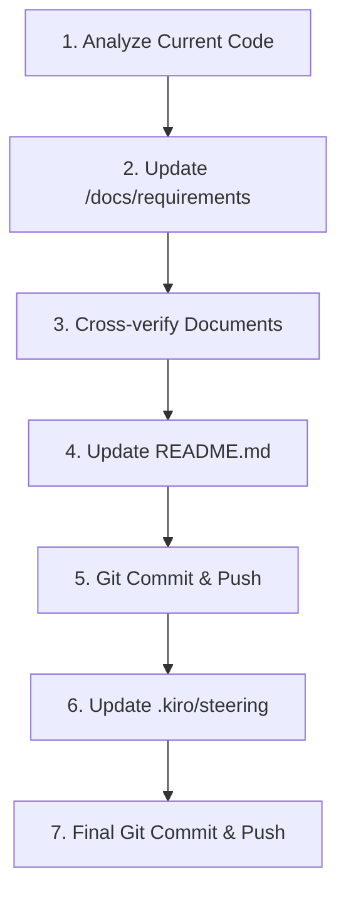

# Update Requirements Documents Workflow

## Trigger Phrases

When user says any of these, execute this workflow:
- "update requirements documents"
- "sync requirements"
- "update docs/requirements"
- "refresh requirements docs"
- "align docs"
- "update docs"
- "docs update"
- "requirements update"
- "update steering docs"
- "steering docs update"
- "sync docs"

## Workflow Overview



## CRITICAL RULES

1. **NEVER open files in editor** - Use fsWrite/strReplace only
2. **MINIMIZE terminal output** - Suppress verbose command output
3. **MINIMIZE chat responses** - Work silently, report only at end
4. **Write as if from scratch** - Documents should read as complete blueprints for building the full solution
5. **Include all features** - All features documented as standard requirements

## Step 1: Analyze Current Code

Silently gather current state:

```
frontend/src/components/     → Count and list all components
frontend/src/pages/          → Count and list all pages
frontend/package.json        → Get exact versions
lambda/                      → List all Lambda functions
cfn/                         → List all CloudFormation templates
.gitlab-ci.yml               → Current CI/CD stages
```

## Step 2: Update /docs/requirements (Source of Truth)

Update these three documents to reflect the complete system specification:

### PRODUCT_REQUIREMENTS_DOCUMENT.md
- Features and capabilities
- Success metrics
- User stories

### SOFTWARE_REQUIREMENTS_SPECIFICATION.md
- Functional requirements
- API contracts (all endpoints)
- Data models (DynamoDB schemas)
- Validation rules
- Component counts must match actual code

### UX_UI_DESIGN_SPECIFICATIONS.md
- Component inventory (all components)
- **Wireframes must match current .tsx files**
- Page specifications
- Visual design system
- All component props interfaces

## Step 3: Cross-Verify Documents

Verify consistency across all three requirements docs:

| Item | PRD | SRS | UX Specs |
|------|-----|-----|----------|
| Component count | ✓ | ✓ | ✓ |
| Lambda functions | ✓ | ✓ | - |
| API endpoints | ✓ | ✓ | - |
| DynamoDB tables | ✓ | ✓ | - |
| Technology versions | ✓ | ✓ | ✓ |
| DRS regions | ✓ | ✓ | ✓ |

## Step 4: Update README.md

Sync README with requirements:
- Technology versions
- Component counts
- Feature list
- Quick start guide
- Architecture overview

## Step 5: First Git Commit & Push

```bash
# Create commit message file (avoid long -m arguments)
# Use fsWrite to create .git_commit_msg.txt

git add docs/requirements/ README.md
git --no-pager commit -F .git_commit_msg.txt
git --no-pager push origin HEAD
rm .git_commit_msg.txt
```

Commit message format:
```
docs: Update requirements documents to reflect current implementation

- Updated PRODUCT_REQUIREMENTS_DOCUMENT.md
- Updated SOFTWARE_REQUIREMENTS_SPECIFICATION.md  
- Updated UX_UI_DESIGN_SPECIFICATIONS.md
- Synced README.md with requirements

Changes:
- [list specific changes]
```

## Step 6: Update .kiro/steering Documents

Align steering files with updated requirements:

| Steering File | Sync With |
|---------------|-----------|
| product.md | PRD |
| structure.md | SRS, actual code structure |
| tech.md | package.json, SRS |
| cicd.md | .gitlab-ci.yml |
| cloudscape-component-reference.md | UX Specs |
| debugging-rules.md | SRS (IAM permissions) |

## Step 7: Final Git Commit & Push

```bash
# Use fsWrite to create .git_commit_msg.txt

git add .kiro/steering/
git --no-pager commit -F .git_commit_msg.txt
git --no-pager push origin HEAD
rm .git_commit_msg.txt
```

Commit message format:
```
chore: Align steering documents with updated requirements

- Synced product.md with PRD
- Synced structure.md with SRS
- Synced tech.md with package.json
- Synced cloudscape-component-reference.md with UX specs

All steering files now aligned with /docs/requirements
```

## Verification Checklist

Before completing, verify:

- [ ] All component counts match across docs and code
- [ ] All technology versions match package.json
- [ ] All Lambda functions documented
- [ ] All API endpoints documented
- [ ] All DynamoDB tables documented
- [ ] Wireframes match current .tsx implementations
- [ ] README reflects current state
- [ ] Both git commits pushed successfully

## Output Format

At completion, provide ONLY:

```
✅ Requirements Update Complete

Commits:
- [commit-hash-1]: docs: Update requirements documents
- [commit-hash-2]: chore: Align steering documents

Summary:
- X components
- X Lambda functions
- X CloudFormation templates
- X API endpoints
```

## Error Handling

If git push fails:
1. Check for uncommitted changes: `git --no-pager status`
2. Check remote: `git --no-pager remote -v`
3. Report error and stop

If file write fails:
1. Report which file failed
2. Continue with remaining files
3. Note incomplete files in summary
