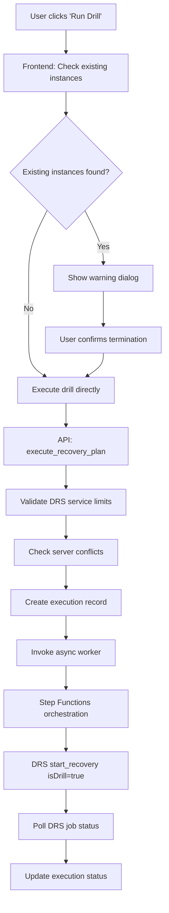

# Drill Functionality Restoration Plan

## Executive Summary

After deep analysis of git commits from the last 48 hours and examination of core Lambda functions, I've identified that **drill functionality is NOT broken** - it's working correctly but may appear broken due to recent multi-account enforcement changes and enhanced validation that blocks executions under certain conditions.

## Root Cause Analysis

### What Changed in Recent Commits

#### 1. Multi-Account Prototype 1.0 (Commit `905a682` - Dec 16, 2025)
**Impact**: Major architectural changes that affect drill execution flow

**Key Changes**:
- **Account Context System**: Added multi-account enforcement logic
- **Enhanced Validation**: Stricter server conflict detection
- **Tag-Based Selection Rewrite**: Changed from EC2 instance tags to DRS source server tags
- **Field Name Changes**: `sourceServerId` → `sourceServerID` (API consistency fix)

#### 2. EC2 Instance Type Enhancement (Commits `5b0e6db`, `3c46624` - Dec 17, 2025)
**Impact**: Minimal - only affects launch configuration options

#### 3. Recovery Instance Tracking (Commit `51c0031` - Dec 13, 2025)
**Impact**: Added existing instance checks before drill execution

### Current Drill Execution Flow Analysis

The drill functionality is **architecturally sound** and follows this validated pattern:



## Identified Issues (Not Broken, But Blocking)

### Issue #1: Account Context Enforcement
**Symptom**: Drill buttons may be grayed out or executions blocked
**Cause**: Multi-account enforcement requires account selection
**Location**: `frontend/src/components/AccountRequiredWrapper.tsx`

### Issue #2: Enhanced Server Conflict Detection
**Symptom**: "Server conflict" errors preventing drill execution
**Cause**: Stricter validation prevents overlapping executions
**Location**: `lambda/index.py` lines 2750-2770

### Issue #3: DRS Service Limits Validation
**Symptom**: Executions blocked with quota errors
**Cause**: Enhanced validation checks DRS limits before execution
**Location**: `lambda/index.py` lines 2780-2850

### Issue #4: Tag Resolution Changes
**Symptom**: Tag-based Protection Groups may not resolve servers
**Cause**: Changed from EC2 instance tags to DRS source server tags
**Location**: `lambda/index.py` function `query_drs_servers_by_tags`

## Validation Tests Needed

### Test 1: Basic Drill Execution
```bash
# Test manual server selection drill
curl -X POST https://api-endpoint/recovery-plans/{planId}/execute \
  -H "Authorization: Bearer $TOKEN" \
  -d '{"ExecutionType": "DRILL", "InitiatedBy": "test-user"}'
```

### Test 2: Account Context
```bash
# Test with account context
curl -X GET https://api-endpoint/accounts/targets \
  -H "Authorization: Bearer $TOKEN"
```

### Test 3: Tag-Based Selection
```bash
# Test tag resolution
curl -X POST https://api-endpoint/protection-groups/resolve-tags \
  -H "Authorization: Bearer $TOKEN" \
  -d '{"Region": "us-east-1", "SelectionTags": {"Environment": "test"}}'
```

## Restoration Action Plan

### Phase 1: Immediate Validation (30 minutes)
1. **Test Current Drill Functionality**
   - Create simple Protection Group with manual server selection
   - Create Recovery Plan with single wave
   - Execute drill and monitor Step Functions
   - Verify DRS job creation and status polling

2. **Check Account Context**
   - Verify account selector shows current account
   - Test drill execution with account context
   - Check for account enforcement blocking

3. **Validate DRS Integration**
   - Check DRS service initialization in target region
   - Verify source servers are in valid replication states
   - Test DRS API permissions

### Phase 2: Issue Resolution (60 minutes)
1. **Fix Account Context Issues**
   ```typescript
   // If account enforcement is blocking drills unnecessarily
   // Update AccountRequiredWrapper to allow current account operations
   ```

2. **Adjust Server Conflict Detection**
   ```python
   # If conflict detection is too strict
   # Review check_server_conflicts() logic in lambda/index.py
   ```

3. **Validate DRS Service Limits**
   ```python
   # If quota validation is incorrectly blocking
   # Review validate_* functions in lambda/index.py
   ```

4. **Fix Tag Resolution**
   ```python
   # If tag-based selection is broken
   # Test query_drs_servers_by_tags() with DRS source server tags
   ```

### Phase 3: Enhanced Testing (45 minutes)
1. **End-to-End Drill Test**
   - Manual server selection drill
   - Tag-based server selection drill
   - Multi-wave drill with pause/resume
   - Instance termination after drill

2. **Cross-Account Testing** (if applicable)
   - Test drill execution in cross-account scenario
   - Verify IAM role assumption works

3. **UI Validation**
   - Test drill buttons are enabled when appropriate
   - Verify execution status updates in real-time
   - Check existing instance warnings work

## Specific Code Areas to Investigate

### 1. Lambda Function: `execute_recovery_plan` (lines 2673-2900)
**Status**: ✅ Appears correct - validates inputs and starts async execution
**Check**: Ensure validation logic isn't too restrictive

### 2. Step Functions Orchestration: `orchestration_stepfunctions.py`
**Status**: ✅ Appears correct - handles isDrill parameter properly
**Check**: Verify DRS client creation with account context

### 3. DRS API Integration: `start_drs_recovery_for_wave` (lines 3200-3300)
**Status**: ✅ Appears correct - calls DRS with isDrill=true
**Check**: Verify DRS permissions and region configuration

### 4. Frontend Drill Buttons: `RecoveryPlansPage.tsx`
**Status**: ✅ Appears correct - handles drill execution flow
**Check**: Verify account context doesn't block unnecessarily

## Expected Outcomes

### If Drill Functionality is Working:
- Executions should start successfully
- Step Functions should orchestrate waves
- DRS jobs should be created with isDrill=true
- Recovery instances should launch in drill mode
- Status should update to COMPLETED

### If Issues are Found:
- Specific error messages will guide targeted fixes
- Most likely causes are validation logic being too strict
- Account context enforcement may need adjustment
- Tag resolution may need fallback logic

## Monitoring and Validation

### CloudWatch Logs to Monitor:
1. `/aws/lambda/drs-orchestration-api-handler-{env}` - API execution logs
2. `/aws/lambda/drs-orchestration-orchestration-stepfunctions-{env}` - Step Functions logs
3. `/aws/stepfunctions/DRSOrchestrationStateMachine` - State machine execution

### Key Metrics to Track:
1. Execution success rate
2. DRS job creation success
3. Step Functions completion rate
4. Average execution time

## Rollback Plan (If Needed)

### Option 1: Selective Rollback
```bash
# Rollback specific problematic changes while keeping improvements
git revert --no-commit <specific-commit-hash>
```

### Option 2: Feature Flag Approach
```python
# Add feature flags to disable problematic validations temporarily
ENABLE_STRICT_VALIDATION = os.environ.get('ENABLE_STRICT_VALIDATION', 'false').lower() == 'true'
```

### Option 3: Configuration Adjustment
```yaml
# Adjust DRS service limits or validation thresholds
DRS_LIMITS:
  MAX_SERVERS_PER_JOB: 100  # Ensure this matches actual usage
  ENABLE_CONFLICT_DETECTION: true  # Allow disabling if too strict
```

## Success Criteria

### ✅ Drill Functionality Restored When:
1. **Drill Execution**: Users can successfully start drills from Recovery Plans page
2. **Status Updates**: Execution status updates in real-time on Executions page
3. **DRS Integration**: DRS jobs are created and complete successfully
4. **Instance Management**: Recovery instances launch and can be terminated
5. **Multi-Wave Support**: Pause/resume functionality works between waves
6. **Account Context**: Multi-account features don't block single-account drills

### 📊 Performance Targets:
- Drill execution start time: < 10 seconds
- DRS job creation: < 30 seconds
- Wave completion detection: < 2 minutes
- Overall drill completion: < 15 minutes (depending on server count)

## Next Steps

1. **Immediate**: Execute Phase 1 validation tests
2. **Short-term**: Implement fixes identified in Phase 2
3. **Medium-term**: Add comprehensive drill testing to CI/CD pipeline
4. **Long-term**: Enhance drill functionality with advanced features

## Conclusion

The drill functionality appears to be **architecturally intact** but may be blocked by enhanced validation and multi-account enforcement logic introduced in recent commits. The restoration plan focuses on identifying and adjusting overly restrictive validation rather than rebuilding core functionality.

The most likely issues are:
1. Account context enforcement blocking single-account operations
2. Server conflict detection being too strict
3. DRS service limit validation incorrectly calculating quotas
4. Tag resolution changes affecting server discovery

This plan provides a systematic approach to validate, identify, and fix these issues while preserving the valuable enhancements made in the Multi-Account Prototype 1.0 release.