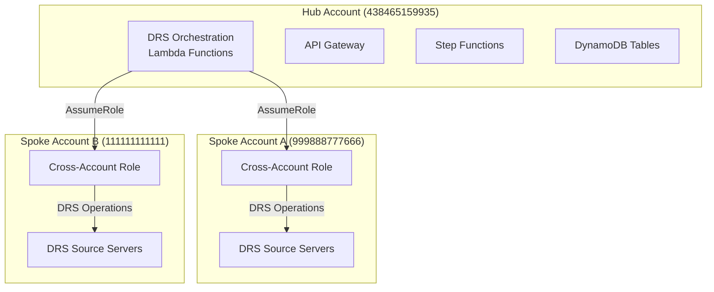

# Multi-Account Hub and Spoke Setup Guide

## Architecture Overview

The DRS Orchestration solution uses a **hub and spoke** architecture:

- **Hub Account**: Where the main DRS Orchestration solution is deployed
- **Spoke Accounts**: Target accounts containing DRS source servers to be orchestrated



## Prerequisites

1. **Hub Account**: DRS Orchestration solution already deployed
2. **Spoke Accounts**: AWS accounts with DRS source servers
3. **Permissions**: Administrative access to both hub and spoke accounts
4. **AWS CLI**: Configured with appropriate credentials

## Step 1: Deploy Cross-Account Role in Spoke Accounts

For each spoke account, deploy the cross-account role:

### Option A: AWS CLI Deployment

```bash
# Set variables
HUB_ACCOUNT_ID="438465159935"
SPOKE_ACCOUNT_ID="999888777666"  # Replace with actual spoke account
ENVIRONMENT="test"  # or dev, qa, prod
REGION="us-east-1"

# Deploy cross-account role in spoke account
aws cloudformation deploy \
  --template-file cfn/cross-account-role-stack.yaml \
  --stack-name drs-orchestration-cross-account-role-${ENVIRONMENT} \
  --parameter-overrides \
    SourceAccountNumber=${HUB_ACCOUNT_ID} \
    Environment=${ENVIRONMENT} \
    ProjectName=drs-orchestration \
  --capabilities CAPABILITY_NAMED_IAM \
  --region ${REGION} \
  --profile spoke-account-profile  # Use appropriate AWS profile
```

### Option B: AWS Console Deployment

1. Log into the **spoke account** AWS Console
2. Navigate to CloudFormation
3. Create new stack with `cfn/cross-account-role-stack.yaml`
4. Parameters:
   - **SourceAccountNumber**: `438465159935` (hub account)
   - **Environment**: `test` (or your environment)
   - **ProjectName**: `drs-orchestration`
5. Check "I acknowledge that AWS CloudFormation might create IAM resources"
6. Deploy the stack

### Verify Role Creation

```bash
# Get the role ARN (run in spoke account)
aws cloudformation describe-stacks \
  --stack-name drs-orchestration-cross-account-role-${ENVIRONMENT} \
  --query 'Stacks[0].Outputs[?OutputKey==`CrossAccountRoleArn`].OutputValue' \
  --output text \
  --region ${REGION}

# Expected output:
# arn:aws:iam::999888777666:role/drs-orchestration-cross-account-role-test
```

## Step 2: Register Spoke Account in Hub

Register the spoke account in the hub account's DRS Orchestration system:

### Option A: API Registration

```bash
# Set variables
HUB_API_ENDPOINT="https://your-api-id.execute-api.us-east-1.amazonaws.com/prod"
COGNITO_TOKEN="your-jwt-token"  # Get from login
SPOKE_ACCOUNT_ID="999888777666"
CROSS_ACCOUNT_ROLE_ARN="arn:aws:iam::999888777666:role/drs-orchestration-cross-account-role-test"

# Register spoke account
curl -X POST "${HUB_API_ENDPOINT}/accounts" \
  -H "Authorization: Bearer ${COGNITO_TOKEN}" \
  -H "Content-Type: application/json" \
  -d '{
    "AccountId": "'${SPOKE_ACCOUNT_ID}'",
    "AccountName": "Production Workloads Account",
    "CrossAccountRoleArn": "'${CROSS_ACCOUNT_ROLE_ARN}'",
    "Regions": ["us-east-1", "us-west-2"]
  }'
```

### Option B: Direct DynamoDB Registration

```bash
# Register in DynamoDB (run in hub account)
aws dynamodb put-item \
  --table-name accounts-${ENVIRONMENT} \
  --item '{
    "AccountId": {"S": "'${SPOKE_ACCOUNT_ID}'"},
    "AccountName": {"S": "Production Workloads Account"},
    "CrossAccountRoleArn": {"S": "'${CROSS_ACCOUNT_ROLE_ARN}'"},
    "Regions": {"SS": ["us-east-1", "us-west-2"]},
    "RegisteredAt": {"S": "'$(date -u +%Y-%m-%dT%H:%M:%SZ)'"},
    "Status": {"S": "ACTIVE"}
  }' \
  --region ${REGION}
```

## Step 3: Test Cross-Account Access

Test that the hub account can assume the spoke account role:

```bash
# Test role assumption (run in hub account)
aws sts assume-role \
  --role-arn "arn:aws:iam::${SPOKE_ACCOUNT_ID}:role/drs-orchestration-cross-account-role-${ENVIRONMENT}" \
  --role-session-name "test-cross-account-access" \
  --external-id "drs-orchestration-${ENVIRONMENT}-${SPOKE_ACCOUNT_ID}"

# If successful, you'll get temporary credentials
```

## Step 4: Create Cross-Account Protection Groups

Create protection groups that reference servers in the spoke account:

### Method 1: Account ID in Protection Group Name

```json
{
  "GroupId": "pg-prod-web-servers-999888777666",
  "GroupName": "Production Web Servers",
  "Region": "us-east-1",
  "AccountId": "999888777666",
  "Servers": ["i-1234567890abcdef0", "i-0987654321fedcba0"]
}
```

### Method 2: Explicit Account ID Field

```json
{
  "GroupId": "pg-prod-web-servers",
  "GroupName": "Production Web Servers", 
  "Region": "us-east-1",
  "AccountId": "999888777666",
  "Servers": ["i-1234567890abcdef0", "i-0987654321fedcba0"]
}
```

## Step 5: Create Cross-Account Recovery Plans

Create recovery plans that use cross-account protection groups:

```json
{
  "PlanId": "rp-prod-dr-test",
  "PlanName": "Production DR Test",
  "Waves": [
    {
      "WaveNumber": 1,
      "ProtectionGroupId": "pg-prod-database-999888777666",
      "PauseBeforeWave": false
    },
    {
      "WaveNumber": 2, 
      "ProtectionGroupId": "pg-prod-web-servers-999888777666",
      "PauseBeforeWave": true
    }
  ]
}
```

## Security Considerations

### External ID

The cross-account role uses an External ID for additional security:
- Format: `drs-orchestration-{environment}-{spoke-account-id}`
- Example: `drs-orchestration-test-999888777666`

### Least Privilege

The cross-account role includes only the minimum permissions needed for DRS operations:
- DRS service operations
- EC2 operations required by DRS
- IAM PassRole for instance profiles
- SSM for post-launch automation

### Trust Relationship

The role can only be assumed by the specific orchestration role in the hub account:
```json
{
  "Principal": {
    "AWS": "arn:aws:iam::438465159935:role/drs-orchestration-orchestration-role-test"
  },
  "Condition": {
    "StringEquals": {
      "sts:ExternalId": "drs-orchestration-test-999888777666"
    }
  }
}
```

## Troubleshooting

### Common Issues

1. **Role Assumption Fails**
   - Check External ID matches pattern
   - Verify hub account role name is correct
   - Ensure spoke account role exists

2. **DRS Operations Fail**
   - Verify DRS permissions in cross-account role
   - Check EC2 permissions for DRS operations
   - Ensure source servers exist in spoke account

3. **Protection Group Creation Fails**
   - Verify account ID format (12 digits)
   - Check server IDs exist in spoke account
   - Ensure cross-account role is registered

### Validation Commands

```bash
# List registered accounts
aws dynamodb scan \
  --table-name accounts-${ENVIRONMENT} \
  --region ${REGION}

# Test DRS access in spoke account
aws drs describe-source-servers \
  --region ${REGION} \
  --profile spoke-account-profile

# Verify cross-account role permissions
aws iam simulate-principal-policy \
  --policy-source-arn "arn:aws:iam::${SPOKE_ACCOUNT_ID}:role/drs-orchestration-cross-account-role-${ENVIRONMENT}" \
  --action-names "drs:DescribeSourceServers" "drs:StartRecovery" \
  --region ${REGION}
```

## Automation Script

For multiple spoke accounts, use the automation script:

```bash
# Create deployment script
cat > deploy-cross-account-roles.sh << 'EOF'
#!/bin/bash
set -e

HUB_ACCOUNT_ID="438465159935"
ENVIRONMENT="test"
REGION="us-east-1"

# Array of spoke accounts
SPOKE_ACCOUNTS=(
  "999888777666:Production Workloads"
  "111111111111:Development Environment"
  "222222222222:Staging Environment"
)

for account_info in "${SPOKE_ACCOUNTS[@]}"; do
  ACCOUNT_ID=$(echo $account_info | cut -d':' -f1)
  ACCOUNT_NAME=$(echo $account_info | cut -d':' -f2)
  
  echo "Deploying cross-account role for $ACCOUNT_ID ($ACCOUNT_NAME)..."
  
  # Deploy role (assumes AWS profiles named spoke-$ACCOUNT_ID)
  aws cloudformation deploy \
    --template-file cfn/cross-account-role-stack.yaml \
    --stack-name drs-orchestration-cross-account-role-${ENVIRONMENT} \
    --parameter-overrides \
      SourceAccountNumber=${HUB_ACCOUNT_ID} \
      Environment=${ENVIRONMENT} \
      ProjectName=drs-orchestration \
    --capabilities CAPABILITY_NAMED_IAM \
    --region ${REGION} \
    --profile spoke-${ACCOUNT_ID}
  
  # Get role ARN
  ROLE_ARN=$(aws cloudformation describe-stacks \
    --stack-name drs-orchestration-cross-account-role-${ENVIRONMENT} \
    --query 'Stacks[0].Outputs[?OutputKey==`CrossAccountRoleArn`].OutputValue' \
    --output text \
    --region ${REGION} \
    --profile spoke-${ACCOUNT_ID})
  
  echo "Role ARN: $ROLE_ARN"
  
  # Register in hub account
  aws dynamodb put-item \
    --table-name accounts-${ENVIRONMENT} \
    --item '{
      "AccountId": {"S": "'${ACCOUNT_ID}'"},
      "AccountName": {"S": "'${ACCOUNT_NAME}'"},
      "CrossAccountRoleArn": {"S": "'${ROLE_ARN}'"},
      "Regions": {"SS": ["us-east-1", "us-west-2"]},
      "RegisteredAt": {"S": "'$(date -u +%Y-%m-%dT%H:%M:%SZ)'"},
      "Status": {"S": "ACTIVE"}
    }' \
    --region ${REGION}
  
  echo "Registered account $ACCOUNT_ID in hub account"
  echo "---"
done

echo "All cross-account roles deployed and registered!"
EOF

chmod +x deploy-cross-account-roles.sh
```

## Next Steps

1. Deploy cross-account roles in all spoke accounts
2. Register spoke accounts in hub account
3. Create cross-account protection groups
4. Test cross-account recovery plans
5. Monitor cross-account operations in CloudWatch

The multi-account architecture is now ready for production use!