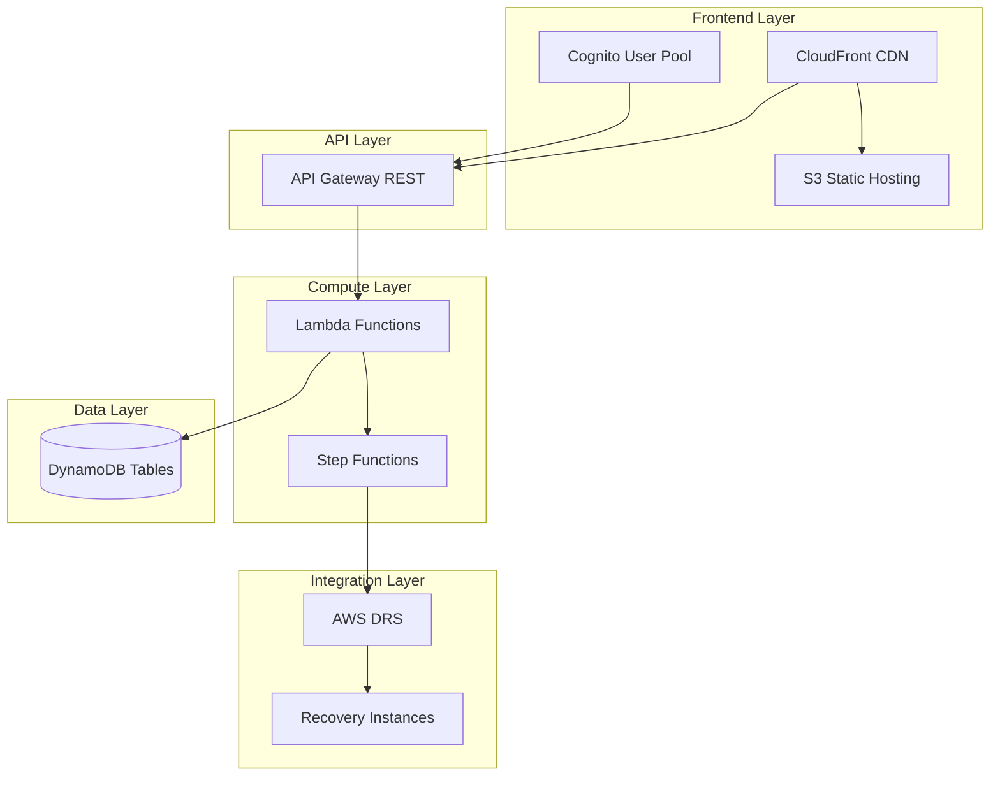

# AWS DRS Orchestration Solution

Enterprise-grade disaster recovery orchestration for AWS Elastic Disaster Recovery (DRS) with wave-based execution, automated health checks, and VMware SRM-like capabilities.

[](https://aws.amazon.com/disaster-recovery/)
[](cfn/)
[](frontend/)
[](lambda/)

## Overview

AWS DRS Orchestration enables organizations to orchestrate complex multi-tier application recovery with wave-based execution, dependency management, and automated health checks—delivering VMware Site Recovery Manager (SRM) parity using AWS-native serverless services.

### Key Capabilities

- **Cost-Effective**: $12-40/month operational cost with pay-per-use serverless pricing
- **Unlimited Waves**: Flexible wave-based orchestration with no artificial constraints
- **Platform Agnostic**: Supports any source platform (VMware, physical servers, cloud)
- **Sub-Second RPO**: Leverages AWS DRS continuous replication capabilities
- **Fully Serverless**: No infrastructure to manage, scales automatically

## Key Features

### Protection Groups
- **Automatic Server Discovery**: Real-time DRS source server discovery across 13 AWS regions
- **Visual Server Selection**: Intuitive interface with assignment status indicators
- **Conflict Prevention**: Single server per group constraint prevents recovery conflicts
- **Real-Time Search**: Filter servers by hostname, Server ID, or Protection Group name

### Recovery Plans
- **Wave-Based Orchestration**: Define multi-wave recovery sequences with unlimited flexibility
- **Dependency Management**: Automatic wave dependency handling with circular dependency detection
- **Drill Mode**: Test recovery procedures without impacting production
- **Automation Hooks**: Pre-wave and post-wave actions for validation and health checks

### Execution Monitoring
- **Real-Time Dashboard**: Live execution progress with wave-level status tracking
- **Execution History**: Complete audit trail of all recovery executions
- **CloudWatch Integration**: Deep-link to CloudWatch Logs for troubleshooting

## Architecture



### Technology Stack

| Layer | Technology |
|-------|------------|
| Frontend | React 19.1, TypeScript 5.9, CloudScape Design System 3.0 |
| API | Amazon API Gateway (REST), Amazon Cognito |
| Compute | AWS Lambda (Python 3.12), AWS Step Functions |
| Database | Amazon DynamoDB (3 tables with GSI) |
| Hosting | Amazon S3, Amazon CloudFront |
| DR Service | AWS Elastic Disaster Recovery (DRS) |

## Quick Start

### Prerequisites

- AWS Account with DRS configured and source servers replicating
- AWS CLI v2 configured with appropriate permissions
- S3 bucket for deployment artifacts

### Deploy with CloudFormation

```bash
# Deploy the complete solution
aws cloudformation deploy \
  --template-url https://your-bucket.s3.us-east-1.amazonaws.com/cfn/master-template.yaml \
  --stack-name drs-orchestration \
  --parameter-overrides \
    ProjectName=drs-orchestration \
    Environment=prod \
    SourceBucket=your-bucket \
    AdminEmail=admin@yourcompany.com \
  --capabilities CAPABILITY_IAM CAPABILITY_NAMED_IAM \
  --region us-east-1
```

Deployment takes approximately 20-30 minutes.

### Get Stack Outputs

```bash
aws cloudformation describe-stacks \
  --stack-name drs-orchestration \
  --query 'Stacks[0].Outputs' \
  --output table
```

| Output | Description |
|--------|-------------|
| CloudFrontURL | Frontend application URL |
| ApiEndpoint | REST API endpoint |
| UserPoolId | Cognito User Pool ID |
| UserPoolClientId | Cognito App Client ID |

### Create Admin User

```bash
USER_POOL_ID=$(aws cloudformation describe-stacks \
  --stack-name drs-orchestration \
  --query 'Stacks[0].Outputs[?OutputKey==`UserPoolId`].OutputValue' \
  --output text)

aws cognito-idp admin-create-user \
  --user-pool-id $USER_POOL_ID \
  --username admin@yourcompany.com \
  --user-attributes Name=email,Value=admin@yourcompany.com Name=email_verified,Value=true \
  --temporary-password "TempPass123!" \
  --message-action SUPPRESS

aws cognito-idp admin-set-user-password \
  --user-pool-id $USER_POOL_ID \
  --username admin@yourcompany.com \
  --password "YourSecurePassword123!" \
  --permanent
```

## Usage Guide

### Creating a Protection Group

1. Navigate to **Protection Groups** in the sidebar
2. Click **Create Protection Group**
3. Enter a unique name and select the AWS region
4. Select source servers from the discovery list (green = available, red = assigned)
5. Click **Create**

### Creating a Recovery Plan

1. Navigate to **Recovery Plans** in the sidebar
2. Click **Create Recovery Plan**
3. Enter plan name and configure waves:

| Wave | Tier | Protection Groups | Depends On |
|------|------|-------------------|------------|
| 1 | Database | DB-Primary, DB-Secondary | - |
| 2 | Application | App-Servers | Wave 1 |
| 3 | Web | Web-Servers | Wave 2 |

4. Configure optional pre/post-wave automation
5. Click **Create**

### Executing a Recovery

1. Navigate to **Recovery Plans**
2. Select a plan and click **Execute**
3. Choose execution type:
   - **Drill**: Test recovery without production impact
   - **Recovery**: Full disaster recovery execution
4. Monitor progress in **Executions** page

## API Reference

### Authentication

All API requests require a valid Cognito JWT token:

```bash
curl -H "Authorization: Bearer $TOKEN" \
  https://api-endpoint/prod/protection-groups
```

### Endpoints

#### Protection Groups

| Method | Endpoint | Description |
|--------|----------|-------------|
| GET | `/protection-groups` | List all protection groups |
| POST | `/protection-groups` | Create protection group |
| GET | `/protection-groups/{id}` | Get protection group details |
| PUT | `/protection-groups/{id}` | Update protection group |
| DELETE | `/protection-groups/{id}` | Delete protection group |

#### Recovery Plans

| Method | Endpoint | Description |
|--------|----------|-------------|
| GET | `/recovery-plans` | List all recovery plans |
| POST | `/recovery-plans` | Create recovery plan |
| GET | `/recovery-plans/{id}` | Get recovery plan details |
| PUT | `/recovery-plans/{id}` | Update recovery plan |
| DELETE | `/recovery-plans/{id}` | Delete recovery plan |

#### Executions

| Method | Endpoint | Description |
|--------|----------|-------------|
| GET | `/executions` | List execution history |
| POST | `/executions` | Start new execution |
| GET | `/executions/{id}` | Get execution details |

#### DRS Integration

| Method | Endpoint | Description |
|--------|----------|-------------|
| GET | `/drs/source-servers?region={region}` | Discover DRS source servers |

## Infrastructure

### CloudFormation Stacks

The solution uses a modular nested stack architecture for maintainability:

| Stack | Purpose | Key Resources |
|-------|---------|---------------|
| `master-template.yaml` | Root orchestrator | Parameter propagation, outputs |
| `database-stack.yaml` | Data persistence | 3 DynamoDB tables with encryption |
| `lambda-stack.yaml` | Compute layer | 6 Lambda functions, IAM roles |
| `api-stack.yaml` | API & Auth | API Gateway, Cognito, Step Functions |
| `security-stack.yaml` | Security (optional) | WAF, CloudTrail |
| `frontend-stack.yaml` | Frontend hosting | S3, CloudFront |

### DynamoDB Tables

| Table | Purpose | Key Schema |
|-------|---------|------------|
| `protection-groups-{env}` | Server groupings | `GroupId` (PK) |
| `recovery-plans-{env}` | Wave configurations | `PlanId` (PK) |
| `execution-history-{env}` | Audit trail | `ExecutionId` (PK), `PlanId` (SK) |

## Cost Estimate

| Component | Monthly Cost (Est.) |
|-----------|---------------------|
| Lambda | $1-5 |
| API Gateway | $3-10 |
| DynamoDB | $1-5 |
| CloudFront | $1-5 |
| S3 | <$1 |
| Step Functions | $1-5 |
| Cognito | Free tier |
| **Total** | **$12-40/month** |

*Costs vary based on usage. DRS replication costs are separate and depend on protected server count.*

## Security

- **Encryption at Rest**: All data encrypted (DynamoDB, S3)
- **Encryption in Transit**: HTTPS enforced via CloudFront
- **Authentication**: Cognito JWT token-based authentication
- **Authorization**: IAM least-privilege policies
- **Optional**: WAF protection and CloudTrail audit logging

## Development

### Frontend Development

```bash
cd frontend
npm install
npm run dev      # Development server at localhost:5173
npm run build    # Production build
npm run lint     # ESLint validation
```

### Lambda Development

```bash
cd lambda
pip install -r requirements.txt

# Deploy directly (development)
python3 deploy_lambda.py --direct \
  --function-name drs-orchestration-api-handler-prod \
  --region us-east-1
```

### Validate CloudFormation

```bash
make validate    # AWS validate-template
make lint        # cfn-lint validation
```

## Troubleshooting

### Common Issues

| Issue | Cause | Solution |
|-------|-------|----------|
| `PG_NAME_EXISTS` | Duplicate protection group name | Use a unique name |
| `INVALID_SERVER_IDS` | Server IDs not found in DRS | Verify servers with `aws drs describe-source-servers` |
| `CIRCULAR_DEPENDENCY` | Wave dependencies form a loop | Review and fix dependency chain |
| `EXECUTION_IN_PROGRESS` | Plan already executing | Wait for completion or cancel |

### DRS Recovery Failures

If recovery jobs fail with `UnauthorizedOperation` errors, verify the OrchestrationRole has required EC2 and DRS permissions. See [DRS IAM Analysis](docs/reference/DRS_COMPLETE_IAM_ANALYSIS.md) for complete permission requirements.

## Documentation

### Quick Links

| Document | Description |
|----------|-------------|
| [Product Requirements](docs/requirements/PRODUCT_REQUIREMENTS_DOCUMENT.md) | Complete PRD with features and specifications |
| [Deployment Guide](docs/guides/DEPLOYMENT_AND_OPERATIONS_GUIDE.md) | Step-by-step deployment instructions |
| [Architecture Design](docs/architecture/ARCHITECTURAL_DESIGN_DOCUMENT.md) | System architecture and design decisions |
| [API Reference](docs/guides/AWS_DRS_API_REFERENCE.md) | DRS API integration patterns |
| [Testing Guide](docs/guides/TESTING_AND_QUALITY_ASSURANCE.md) | Testing procedures and quality assurance |

### Documentation Index

See [Appendix: Complete Documentation Index](#appendix-complete-documentation-index) for full documentation catalog with detailed descriptions.

## Contributing

1. Fork the repository
2. Create a feature branch (`git checkout -b feature/amazing-feature`)
3. Commit changes (`git commit -m 'Add amazing feature'`)
4. Push to branch (`git push origin feature/amazing-feature`)
5. Open a Pull Request

---

## Appendix: Complete Documentation Index

### Requirements & Planning

| Document | Description |
|----------|-------------|
| [Product Requirements Document](docs/requirements/PRODUCT_REQUIREMENTS_DOCUMENT.md) | Complete PRD with problem statement, features, technical specs, and success metrics |

### Architecture & Design

| Document | Description |
|----------|-------------|
| [Architecture Diagrams](docs/architecture/ARCHITECTURE_DIAGRAMS.md) | **Visual reference** - Complete mermaid diagrams for all components and flows |
| [Architectural Design Document](docs/architecture/ARCHITECTURAL_DESIGN_DOCUMENT.md) | System architecture, component design, and technology decisions |
| [Step Functions Analysis](docs/architecture/STEP_FUNCTIONS_ANALYSIS.md) | Orchestration engine design and state machine patterns |
| [DRS Coordination Patterns](docs/architecture/DRS_STEP_FUNCTIONS_COORDINATION_ANALYSIS.md) | Wave-based execution and DRS job coordination |
| [AWS Services Deep Dive](docs/architecture/AWS_SERVICES_ARCHITECTURE_DEEP_DIVE.md) | Detailed analysis of AWS services used in the solution |

### Core Reference Documents

| Document | Description |
|----------|-------------|
| [Product Overview](.kiro/steering/product.md) | **Core reference** - Business problem, solution overview, features, and success metrics |
| [Project Structure](.kiro/steering/structure.md) | **Core reference** - Repository organization, component architecture, and data flows |
| [Technology Stack](.kiro/steering/tech.md) | **Core reference** - Complete technology stack, AWS services, and development commands |

### Deployment & Operations

| Document | Description |
|----------|-------------|
| [Deployment and Operations Guide](docs/guides/DEPLOYMENT_AND_OPERATIONS_GUIDE.md) | Complete deployment procedures, configuration, and operations |
| [Deployment Recovery Guide](docs/guides/DEPLOYMENT_RECOVERY_GUIDE.md) | **CRITICAL** - How to redeploy from scratch using S3 artifacts |
| [Deployment Success Summary](docs/guides/DEPLOYMENT_SUCCESS_SUMMARY.md) | Latest deployment verification and test results |
| [CI/CD Pipeline Guide](docs/guides/CICD_PIPELINE_GUIDE.md) | GitLab CI/CD setup and automation workflows |
| [S3 Sync Automation](docs/guides/S3_SYNC_AUTOMATION.md) | Automated deployment bucket synchronization |

### API & Integration

| Document | Description |
|----------|-------------|
| [AWS DRS API Reference](docs/guides/AWS_DRS_API_REFERENCE.md) | DRS API integration patterns and best practices |
| [DRS Complete IAM Analysis](docs/reference/DRS_COMPLETE_IAM_ANALYSIS.md) | **CRITICAL** - Complete IAM permission requirements for DRS operations |
| [DRS Service Role Policy Analysis](docs/reference/AWS_DRS_SERVICE_ROLE_POLICY_ANALYSIS.md) | Analysis of DRS service-linked role permissions |
| [VMware SRM API Summary](docs/reference/VMware_SRM_REST_API_Summary.md) | VMware Site Recovery Manager API reference |
| [Azure Site Recovery Analysis](docs/reference/AZURE_SITE_RECOVERY_RESEARCH_AND_API_ANALYSIS.md) | Azure Site Recovery competitive analysis |
| [Zerto DR Analysis](docs/reference/ZERTO_RESEARCH_AND_API_ANALYSIS.md) | Zerto disaster recovery competitive analysis |

### Testing & Quality

| Document | Description |
|----------|-------------|
| [Testing and Quality Assurance](docs/guides/TESTING_AND_QUALITY_ASSURANCE.md) | Comprehensive testing strategy, test cases, and QA procedures |

### Troubleshooting

| Document | Description |
|----------|-------------|
| [DRS Drill Failure Analysis](docs/troubleshooting/DRS_DRILL_FAILURE_ANALYSIS.md) | Common drill failure patterns and resolution steps |
| [IAM Permission Troubleshooting](docs/troubleshooting/IAM_ROLE_ANALYSIS_DRS_PERMISSIONS.md) | **CRITICAL** - IAM permission requirements for DRS operations |
| [CloudFormation Deployment Issues](docs/troubleshooting/CLOUDFORMATION_DEPLOYMENT_ISSUES.md) | Common CloudFormation deployment problems and solutions |

### Critical Discoveries

**DRS IAM Permission Model**: When Lambda calls `drs:StartRecovery`, DRS uses the **calling role's IAM permissions** (not its service-linked role) to perform EC2 operations. The OrchestrationRole must have comprehensive EC2 permissions including:
- `ec2:CreateLaunchTemplate`
- `ec2:CreateLaunchTemplateVersion`
- `ec2:ModifyLaunchTemplate`
- `ec2:StartInstances`
- `ec2:RunInstances`
- `ec2:CreateVolume`
- `ec2:AttachVolume`

See [IAM Permission Troubleshooting](docs/troubleshooting/IAM_ROLE_ANALYSIS_DRS_PERMISSIONS.md) for complete details.

### Project Status

| Document | Description |
|----------|-------------|
| [Project Status](docs/PROJECT_STATUS.md) | Current project status, milestones, and roadmap |

---

## License

This project is licensed under the MIT License - see the [LICENSE](LICENSE) file for details.

---

Built for enterprise disaster recovery on AWS
