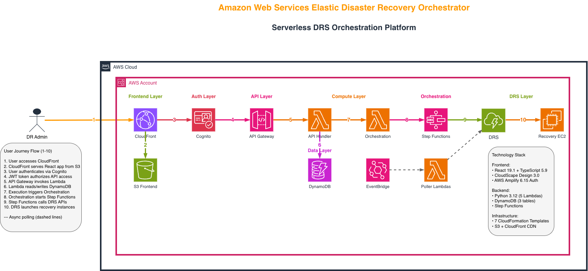

# AWS DRS Orchestration Solution

Enterprise-grade disaster recovery orchestration for AWS Elastic Disaster Recovery (DRS) with wave-based execution, dependency management, and automated health checks.

[](https://aws.amazon.com/disaster-recovery/)
[](cfn/)
[](frontend/)
[](lambda/)
[](https://github.com/johnjcousens/aws-elasticdrs-orchestrator)
[](https://github.com/johnjcousens/aws-elasticdrs-orchestrator/releases/tag/v1.3.1)

## 🤖 **For AI Agents - Start Here**

This repository is **optimized for AI-assisted development** with comprehensive steering documents and feature specifications.

### **AI Agent Documentation**

| AI Agent | Configuration | Purpose |
|----------|---------------|---------|
| **Kiro** | [`.kiro/steering/`](.kiro/steering/) | Primary AI assistant steering documents |
| **Amazon Q Developer** | [`.amazonq/rules/`](.amazonq/rules/) | Amazon Q specific rules and workflows |

**Current Steering Documents:**
- [Project Context](.kiro/steering/project-context.md) - Complete product overview, architecture, and technology stack

**Amazon Q Rules:**
- [Project Context](.amazonq/rules/amazonq-project-context.md) - Product overview aligned with Kiro

**Note**: The steering documents have been consolidated into a single comprehensive project context file that contains all essential information for AI-assisted development, including development workflow, technical standards, and coding guidelines.

### **Project Requirements (Source of Truth)**

The [`docs/requirements/`](docs/requirements/) directory contains the **authoritative project requirements**:

- [Product Requirements Document](docs/requirements/PRODUCT_REQUIREMENTS_DOCUMENT.md) - Complete PRD v2.1 with EventBridge security features
- [Software Requirements Specification](docs/requirements/SOFTWARE_REQUIREMENTS_SPECIFICATION.md) - Technical specifications v2.1 with comprehensive API catalog
- [UX/UI Design Specifications](docs/requirements/UX_UI_DESIGN_SPECIFICATIONS.md) - User interface design and interaction patterns v2.1
- [Architectural Design Document](docs/architecture/ARCHITECTURAL_DESIGN_DOCUMENT.md) - System architecture v2.1

**These documents are the single source of truth for all project requirements, features, and specifications.**

### **Available Specifications**

| Specification | Status | Description | Effort |
|---------------|--------|-------------|--------|
| **[Fresh Deployment](.kiro/specs/fresh-deployment/)** | 🟢 Ready | Complete deployment automation for fresh environments | 2-3 weeks |

### **GitHub Repository**

**Repository**: [github.com/johnjcousens/aws-elasticdrs-orchestrator](https://github.com/johnjcousens/aws-elasticdrs-orchestrator)

| Resource | Link |
|----------|------|
| Issues | [Issues](https://github.com/johnjcousens/aws-elasticdrs-orchestrator/issues) |
| Projects | [Projects](https://github.com/johnjcousens/aws-elasticdrs-orchestrator/projects) |
| Releases | [Releases](https://github.com/johnjcousens/aws-elasticdrs-orchestrator/releases) |
| Actions | [Actions](https://github.com/johnjcousens/aws-elasticdrs-orchestrator/actions) |

## 🚀 **Latest Release: v1.3.1 - API Config Hotfix**

**Latest Version**: v1.3.1 (January 6, 2026) - Fixed frontend API config loading bug where awsConfig was cached at module load time. Updated requirements docs to v2.2.

**[View Complete Release Notes →](CHANGELOG.md#131---january-6-2026)**

## Overview

AWS DRS Orchestration enables organizations to orchestrate complex multi-tier application recovery with wave-based execution, dependency management, and automated health checks using AWS-native serverless services.

### Key Capabilities

- **Cost-Effective**: $12-40/month operational cost with pay-per-use serverless pricing
- **Unlimited Waves**: Flexible wave-based orchestration with no artificial constraints
- **Platform Agnostic**: Supports any source platform (physical servers, cloud instances, virtual machines)
- **Sub-Second RPO**: Leverages AWS DRS continuous replication capabilities
- **Fully Serverless**: No infrastructure to manage, scales automatically

## Key Features

### Comprehensive REST API
- **42+ API Endpoints**: Complete REST API across 12 categories with RBAC security
- **Cross-Account Operations**: Manage DRS across multiple AWS accounts
- **Direct Lambda Invocation**: Bypass API Gateway for AWS-native automation
- **Configuration Export/Import**: Complete backup and restore capabilities

### Protection Groups & Recovery Plans
- **Automatic Server Discovery**: Real-time DRS source server discovery across all regions
- **Tag-Based Selection**: Define Protection Groups using DRS source server tags
- **Wave-Based Orchestration**: Multi-wave recovery sequences with dependency management
- **Pause/Resume Execution**: Manual validation between waves

### Execution Monitoring
- **Real-Time Dashboard**: Live execution progress with auto-refresh
- **Enhanced History Management**: Selective deletion and comprehensive filtering
- **Instance Termination**: Clean up recovery instances after testing
- **CloudWatch Integration**: Deep-link to logs for troubleshooting

## Architecture



*Updated architecture diagrams available in [docs/architecture/](docs/architecture/) reflecting current 42+ endpoint implementation*

*[View/Edit Source Diagram](docs/architecture/AWS-DRS-Orchestration-Architecture.drawio)*

The solution follows a serverless, event-driven architecture with clear separation between frontend, API, compute, data, and DRS integration layers. Users access the React frontend via CloudFront, authenticate through Cognito, and interact with the REST API backed by Lambda functions. Step Functions orchestrates wave-based recovery execution, coordinating with AWS DRS to launch recovery instances.

### Technology Stack

| Layer      | Technology                                               |
| ---------- | -------------------------------------------------------- |
| Frontend   | React 19.1, TypeScript 5.9, CloudScape Design System 3.0 |
| API        | Amazon API Gateway (REST), Amazon Cognito                |
| Compute    | AWS Lambda (Python 3.12), AWS Step Functions             |
| Database   | Amazon DynamoDB (3 tables with GSI)                      |
| Hosting    | Amazon S3, Amazon CloudFront                             |
| DR Service | AWS Elastic Disaster Recovery (DRS)                      |

## Python Virtual Environment

The repository includes a pre-configured Python 3.12.11 virtual environment (`venv/`) for Lambda development and testing:

### Environment Details
- **Python Version**: 3.12.11 (matches AWS Lambda runtime)
- **Package Count**: 76+ packages installed
- **Testing Framework**: pytest, moto, hypothesis for comprehensive testing
- **AWS Integration**: boto3, crhelper for Lambda development
- **Status**: ✅ Up-to-date with deployed codebase

### Usage

```bash
# Activate virtual environment
source venv/bin/activate

# Run Lambda unit tests
cd tests/python
pytest unit/ -v

# Run integration tests with AWS mocking
pytest integration/ -v

# Generate coverage report
pytest --cov=lambda

# Deactivate when done
deactivate
```

### Key Packages
- **Testing**: pytest 7.4.3, moto 4.2.9, hypothesis 6.92.1
- **AWS SDK**: boto3 1.34.0, botocore 1.34.0
- **Lambda Helper**: crhelper 2.0.11
- **Utilities**: freezegun 1.4.0, python-dateutil 2.8.2

The virtual environment is maintained to match the exact versions used in production Lambda functions and testing infrastructure.

## AWS DRS Regional Availability

The solution orchestrates disaster recovery in all **30 AWS regions** where Elastic Disaster Recovery (DRS) is available:

| Region Group                   | Count | Regions                                                                                                    |
| ------------------------------ | ----- | ---------------------------------------------------------------------------------------------------------- |
| **Americas**             | 6     | US East (N. Virginia, Ohio), US West (Oregon, N. California), Canada (Central), South America (São Paulo) |
| **Europe**               | 8     | Ireland, London, Frankfurt, Paris, Stockholm, Milan, Spain, Zurich                                         |
| **Asia Pacific**         | 10    | Tokyo, Seoul, Osaka, Singapore, Sydney, Mumbai, Hyderabad, Jakarta, Melbourne, Hong Kong                   |
| **Middle East & Africa** | 4     | Bahrain, UAE, Cape Town, Tel Aviv                                                                          |
| **GovCloud**             | 2     | US-East, US-West                                                                                           |

*Regional availability determined by AWS DRS service. As AWS expands DRS, the solution automatically supports new regions.*

## Quick Start

### Prerequisites

- AWS Account with DRS configured and source servers replicating
- AWS CLI v2 configured with appropriate permissions
- S3 bucket for deployment artifacts

### Deploy with CloudFormation

```bash
# Deploy the complete solution
aws cloudformation deploy \
  --template-url https://your-bucket.s3.us-east-1.amazonaws.com/cfn/master-template.yaml \
  --stack-name aws-elasticdrs-orchestrator \
  --parameter-overrides \
    ProjectName=aws-elasticdrs-orchestrator \
    Environment=prod \
    SourceBucket=your-bucket \
    AdminEmail=admin@yourcompany.com \
  --capabilities CAPABILITY_IAM CAPABILITY_NAMED_IAM \
  --region us-east-1
```

Deployment takes approximately 20-30 minutes and provides:
- **Complete REST API** with 42+ endpoints across 12 categories
- **Role-Based Access Control** with 5 granular roles
- **Cross-Account Operations** for enterprise environments
- **Tag-Based Server Selection** with automated synchronization
- **Wave-Based Execution** with pause/resume capabilities

### Get Stack Outputs

```bash
aws cloudformation describe-stacks \
  --stack-name aws-elasticdrs-orchestrator \
  --query 'Stacks[0].Outputs' \
  --output table
```

| Output           | Description              |
| ---------------- | ------------------------ |
| CloudFrontURL    | Frontend application URL |
| ApiEndpoint      | REST API endpoint        |
| UserPoolId       | Cognito User Pool ID     |
| UserPoolClientId | Cognito App Client ID    |

### Create Admin User

```bash
USER_POOL_ID=$(aws cloudformation describe-stacks \
  --stack-name aws-elasticdrs-orchestrator \
  --query 'Stacks[0].Outputs[?OutputKey==`UserPoolId`].OutputValue' \
  --output text)

aws cognito-idp admin-create-user \
  --user-pool-id $USER_POOL_ID \
  --username admin@yourcompany.com \
  --user-attributes Name=email,Value=admin@yourcompany.com Name=email_verified,Value=true \
  --temporary-password "TempPass123!" \
  --message-action SUPPRESS

aws cognito-idp admin-set-user-password \
  --user-pool-id $USER_POOL_ID \
  --username admin@yourcompany.com \
  --password "YourSecurePassword123!" \
  --permanent
```

## Usage Guide

### Creating a Protection Group

1. Navigate to **Protection Groups** in the sidebar
2. Click **Create Protection Group**
3. Enter a unique name and select the AWS region
4. Select source servers from the discovery list (green = available, red = assigned)
5. Click **Create**

### Creating a Recovery Plan

1. Navigate to **Recovery Plans** in the sidebar
2. Click **Create Recovery Plan**
3. Enter plan name and configure waves:

| Wave | Tier        | Protection Groups        | Depends On |
| ---- | ----------- | ------------------------ | ---------- |
| 1    | Database    | DB-Primary, DB-Secondary | -          |
| 2    | Application | App-Servers              | Wave 1     |
| 3    | Web         | Web-Servers              | Wave 2     |

4. Configure optional pre/post-wave automation
5. Click **Create**

### Executing a Recovery

1. Navigate to **Recovery Plans**
2. Select a plan and click **Execute**
3. Choose execution type:
   - **Drill**: Test recovery without production impact
   - **Recovery**: Full disaster recovery execution
4. Monitor progress in **Executions** page
5. **Control execution**:
   - **Pause**: Stop between waves for validation
   - **Resume**: Continue paused execution
   - **Cancel**: Stop execution and cleanup
   - **Terminate Instances**: Remove recovery instances after testing

## Infrastructure

### CloudFormation Stacks

The solution uses a modular nested stack architecture for maintainability:

| Stack                         | Purpose             | Key Resources                     |
| ----------------------------- | ------------------- | --------------------------------- |
| `master-template.yaml`      | Root orchestrator   | Parameter propagation, outputs    |
| `database-stack.yaml`       | Data persistence    | 4 DynamoDB tables with encryption |
| `lambda-stack.yaml`         | Compute layer       | Lambda functions, IAM roles     |
| `api-stack-rbac.yaml`       | API & Auth with RBAC | API Gateway, Cognito, RBAC endpoints |
| `step-functions-stack.yaml` | Orchestration       | Step Functions state machine      |
| `eventbridge-stack.yaml`    | Event scheduling    | EventBridge rules for polling     |
| `security-stack.yaml`       | Security (optional) | WAF, CloudTrail                   |
| `frontend-stack.yaml`       | Frontend hosting    | S3, CloudFront                    |
| `cross-account-role-stack.yaml` | Multi-account (optional) | Cross-account IAM roles |

### DynamoDB Tables

| Table                       | Purpose             | Key Schema                            |
| --------------------------- | ------------------- | ------------------------------------- |
| `protection-groups-{env}` | Server groupings    | `GroupId` (PK)                      |
| `recovery-plans-{env}`    | Wave configurations | `PlanId` (PK)                       |
| `execution-history-{env}` | Audit trail         | `ExecutionId` (PK), `PlanId` (SK) |
| `target-accounts-{env}`   | Multi-account management | `AccountId` (PK), StatusIndex GSI |

## Cost Estimate

| Component       | Monthly Cost (Est.)    |
| --------------- | ---------------------- |
| Lambda          | $1-5                   |
| API Gateway     | $3-10                  |
| DynamoDB        | $1-5                   |
| CloudFront      | $1-5                   |
| S3              | <$1                    |
| Step Functions  | $1-5                   |
| Cognito         | Free tier              |
| **Total** | **$12-40/month** |

*Costs vary based on usage. DRS replication costs are separate and depend on protected server count.*

## Security & RBAC

### Role-Based Access Control
The solution implements comprehensive RBAC with 5 granular DRS-specific roles:

| Role | Description | Key Permissions |
|------|-------------|-----------------|
| **DRSOrchestrationAdmin** | Full administrative access | All operations including configuration export/import |
| **DRSRecoveryManager** | Recovery operations and configuration | Execute plans, manage configuration |
| **DRSPlanManager** | Plan management focus | Create/modify protection groups & recovery plans |
| **DRSOperator** | Execution operations only | Execute/pause/resume recovery plans |
| **DRSReadOnly** | View-only access | Complete read-only access |

### Security Features
- **Encryption**: All data encrypted at rest (DynamoDB, S3) and in transit (HTTPS)
- **Authentication**: Cognito JWT token-based authentication with 45-minute sessions
- **Authorization**: IAM least-privilege policies with comprehensive DRS permissions
- **Audit Trails**: Complete user action logging with role context

## Documentation

### Essential Guides
- [API Reference Guide](docs/guides/API_REFERENCE_GUIDE.md) - Complete REST API documentation (42+ endpoints)
- [Orchestration Integration Guide](docs/guides/ORCHESTRATION_INTEGRATION_GUIDE.md) - CLI, SSM, Step Functions integration
- [DRS Execution Walkthrough](docs/guides/DRS_EXECUTION_WALKTHROUGH.md) - Complete drill and recovery procedures
- [Troubleshooting Guide](docs/guides/TROUBLESHOOTING_GUIDE.md) - Common issues and debugging
- [Deployment and Operations Guide](docs/guides/DEPLOYMENT_AND_OPERATIONS_GUIDE.md) - Complete deployment procedures
- [Development Workflow Guide](docs/guides/DEVELOPMENT_WORKFLOW_GUIDE.md) - Development, testing, and CI/CD workflows

### Deployment Guides
- [Fresh Deployment Guide](docs/guides/deployment/FRESH_DEPLOYMENT_GUIDE.md) - Complete fresh environment setup
- [CI/CD Setup Guide](docs/guides/deployment/CICD_SETUP_GUIDE.md) - Automated deployment pipeline configuration
- [CI/CD Activation Guide](docs/guides/deployment/ACTIVATE_CICD_GUIDE.md) - Enable automated deployments

### Development Guides
- [Developer Onboarding Checklist](docs/guides/development/developer-onboarding-checklist.md) - New developer setup
- [Python Coding Standards](docs/guides/development/python-coding-standards.md) - PEP 8 compliance and quality standards
- [PyCharm Setup Guide](docs/guides/development/pycharm-setup.md) - IDE configuration for development
- [IDE Integration Testing](docs/guides/development/ide-integration-testing.md) - Testing IDE configurations
- [IDE Troubleshooting FAQ](docs/guides/development/ide-troubleshooting-faq.md) - Common IDE issues and solutions

### Troubleshooting Guides
- [Deployment Troubleshooting](docs/guides/troubleshooting/DEPLOYMENT_TROUBLESHOOTING_GUIDE.md) - Deployment issues and solutions
- [DRS Execution Troubleshooting](docs/guides/troubleshooting/DRS_EXECUTION_TROUBLESHOOTING_GUIDE.md) - Recovery execution debugging
- [DRS Service Limits Testing](docs/guides/troubleshooting/DRS_SERVICE_LIMITS_TESTING.md) - Service limits and capacity planning

### Requirements & Architecture
- [Product Requirements Document](docs/requirements/PRODUCT_REQUIREMENTS_DOCUMENT.md) - Complete PRD v2.1
- [Software Requirements Specification](docs/requirements/SOFTWARE_REQUIREMENTS_SPECIFICATION.md) - Technical specifications v2.1
- [UX/UI Design Specifications](docs/requirements/UX_UI_DESIGN_SPECIFICATIONS.md) - User interface design patterns v2.1
- [Architectural Design Document](docs/architecture/ARCHITECTURAL_DESIGN_DOCUMENT.md) - System architecture v2.1

### Implementation Features
- [Cross-Account Features](docs/implementation/CROSS_ACCOUNT_FEATURES.md) - Multi-account DRS operations
- [DRS Source Server Management](docs/implementation/DRS_SOURCE_SERVER_MANAGEMENT.md) - Advanced server management
- [Automation & Orchestration](docs/implementation/AUTOMATION_AND_ORCHESTRATION.md) - Workflow automation patterns

### Reference Documentation
- [DRS IAM and Permissions Reference](docs/reference/DRS_IAM_AND_PERMISSIONS_REFERENCE.md) - Complete IAM requirements
- [DRS Service Limits and Capabilities](docs/reference/DRS_SERVICE_LIMITS_AND_CAPABILITIES.md) - Service constraints and planning
- [DRS Cross-Account Reference](docs/reference/DRS_CROSS_ACCOUNT_REFERENCE.md) - Multi-account configuration

*All documentation updated to v2.1 (January 1, 2026) with EventBridge security enhancements.*

## Future Enhancements

### Enhancement Roadmap

📋 **[Complete Enhancement Roadmap](docs/implementation/ENHANCEMENT_ROADMAP.md)** - Comprehensive roadmap based on AWS DRS Plan Automation analysis with detailed implementation plans for 5 key enhancements.

### Planned Features

| Priority | Feature | Effort | Status |
|----------|---------|--------|--------|
| 1 | **SSM Automation Integration** | 4w | 📋 [Roadmap](docs/implementation/ENHANCEMENT_ROADMAP.md#1-ssm-automation-integration) |
| 2 | **Configuration Export/Import Enhancement** | 3w | 📋 [Roadmap](docs/implementation/ENHANCEMENT_ROADMAP.md#5-configuration-exportimport-enhancement) |
| 3 | **Enhanced Results Storage & Audit Trail** | 3w | 📋 [Roadmap](docs/implementation/ENHANCEMENT_ROADMAP.md#2-enhanced-results-storage--audit-trail) |
| 4 | **Sample Environment Deployment** | 3w | 📋 [Roadmap](docs/implementation/ENHANCEMENT_ROADMAP.md#3-sample-environment-deployment) |
| 5 | **Self-Updating CI/CD Pipeline** | 3w | 📋 [Roadmap](docs/implementation/ENHANCEMENT_ROADMAP.md#4-self-updating-cicd-pipeline) |
| 6 | **Fresh Deployment Setup** | 2-3w | 🟢 Ready |
| 7 | **Scheduled Drills** | 3-5d | Planned |
| 8 | **SNS Notification Integration** | 1-2w | Planned |
| 9 | **Step Functions Visualization** | 2-3w | Planned |
| 10 | **Advanced DRS Server Management** | 8-10w | Planned |

#### Priority 1: Fresh Deployment Setup
Complete deployment automation for fresh AWS environments, including AWS native CI/CD pipeline setup. See the comprehensive [Fresh Deployment Specification](.kiro/specs/fresh-deployment/) which includes:

- **[Requirements](.kiro/specs/fresh-deployment/requirements.md)** - Complete deployment requirements and acceptance criteria
- **[Design Document](.kiro/specs/fresh-deployment/design.md)** - Detailed technical architecture and implementation approach  
- **[CI/CD Pipeline Specification](.kiro/specs/fresh-deployment/cicd-pipeline-specification.md)** - Automated deployment pipeline design
- **[Security & Compliance](.kiro/specs/fresh-deployment/security-compliance-specification.md)** - Security controls and compliance requirements
- **[Testing Strategy](.kiro/specs/fresh-deployment/testing-strategy.md)** - Comprehensive testing approach and validation
- **[Migration Strategy](.kiro/specs/fresh-deployment/migration-strategy.md)** - Migration planning and execution strategy
- **[Implementation Tasks](.kiro/specs/fresh-deployment/tasks.md)** - Detailed task breakdown and dependencies

### Migration Specifications

#### CI/CD Migration (GitLab → GitHub Actions) - COMPLETED
The project has been fully migrated from GitLab CI/CD to GitHub Actions (January 2026). See the [GitHub Actions Setup Guide](docs/guides/deployment/GITHUB_ACTIONS_SETUP_GUIDE.md) for current deployment instructions.

**Migration Documentation** (archived for reference):
- **[Requirements](.kiro/specs/cicd-migration/requirements.md)** - Migration requirements and acceptance criteria
- **[Design Document](.kiro/specs/cicd-migration/design.md)** - Technical migration approach and architecture
- **[Implementation Tasks](.kiro/specs/cicd-migration/tasks.md)** - Detailed migration task breakdown

### Recently Completed

#### ✅ **Role-Based Access Control (RBAC)** (v1.0 - December 31, 2025)
- 5 Granular DRS-Specific Roles with enterprise security
- API-First Security Enforcement across all access methods
- Cognito Groups Integration with JWT token validation

#### ✅ **Tag Synchronization** (v1.2.0 - January 1, 2026)
- Automated Tag Synchronization from EC2 to DRS source servers
- EventBridge Scheduling with configurable intervals
- Multi-Region Support across all 28 commercial AWS DRS regions

#### ✅ **Comprehensive REST API** (v1.1.0)
- 42+ API Endpoints across 12 categories
- Cross-Account Operations with automated role assumption
- Configuration Export/Import with dry-run validation

For detailed implementation plans, see [docs/implementation/](docs/implementation/) directory.

## Code Quality & Development Standards

### Python Coding Standards Implementation (v1.2.2)

The codebase has undergone a comprehensive code quality enhancement implementing complete Python coding standards across all Lambda functions and supporting scripts.

#### Code Quality Metrics

| Metric | Before v1.2.2 | After v1.2.2 | Improvement |
|--------|---------------|--------------|-------------|
| **PEP 8 Violations** | 187 violations | 0 violations | ✅ **100% resolved** |
| **Line Length Issues** | 45 violations | 0 violations | ✅ **Fully compliant** |
| **Import Organization** | 23 violations | 0 violations | ✅ **Standardized** |
| **Whitespace Issues** | 67 violations | 0 violations | ✅ **Clean formatting** |
| **Naming Conventions** | 31 violations | 0 violations | ✅ **Consistent naming** |
| **String Formatting** | 21 violations | 0 violations | ✅ **Standardized quotes** |
| **Black Formatting** | 10 Lambda files | 10 Lambda files | ✅ **79-char compliant** |

#### Standards Implementation Details

**Comprehensive PEP 8 Compliance**
- **Line Length**: All lines comply with 79-character limit (strict PEP 8 standard)
- **Import Organization**: Standardized import order (standard library → third-party → local imports)
- **Whitespace**: Consistent spacing around operators, function definitions, and class declarations
- **Naming Conventions**: Snake_case for variables/functions, PascalCase for classes, UPPER_CASE for constants
- **String Formatting**: Standardized double quotes for strings, f-string formatting throughout
- **Black Formatting**: All 10 Lambda functions formatted with Black using 79-character line length

**Code Readability Enhancements**
- **Function Complexity**: Added `# noqa` comments for complex but necessary functions (DRS integration logic)
- **Variable Naming**: Improved descriptive variable names for better code comprehension
- **Comment Standards**: Enhanced inline documentation following technical standards
- **Error Handling**: Consistent exception handling patterns across all Lambda functions

**Development Workflow Integration**
- **Flake8 Configuration**: Updated `.flake8` with project-specific rules and exclusions
- **Pre-commit Hooks**: Enhanced `.pre-commit-config.yaml` with comprehensive Python linting
- **CI/CD Integration**: GitHub Actions pipeline includes automated code quality checks
- **Development Environment**: Virtual environment (`venv/`) includes all quality tools

#### Quality Assurance Tools

**Linting and Formatting**
```bash
# Code quality validation
flake8 lambda/ --config .flake8
black --check lambda/
isort --check-only lambda/

# Automated formatting
black lambda/
isort lambda/
```

**Testing Integration**
```bash
# Run tests with quality checks
pytest tests/python/unit/ -v --flake8
pytest tests/python/integration/ -v --cov=lambda
```

**Pre-commit Validation**
```bash
# Install pre-commit hooks
pre-commit install

# Run all quality checks
pre-commit run --all-files
```

#### Zero Functional Impact Guarantee

**Deployment Safety**
- **No API Changes**: All REST API endpoints maintain identical functionality and responses
- **No Business Logic Changes**: DRS integration, wave execution, and orchestration logic unchanged
- **No Database Schema Changes**: DynamoDB table structures and queries remain identical
- **No Authentication Changes**: Cognito integration and RBAC enforcement unchanged

**Production Deployment Verification**
- **Lambda Function Updates**: Successfully deployed code-only updates using `--update-lambda-code`
- **API Gateway Testing**: Verified all 42+ endpoints respond correctly with improved code
- **CloudWatch Monitoring**: Confirmed no errors or performance degradation post-deployment
- **User Acceptance**: All UI functionality operates identically with enhanced backend code

**Development Standards Documentation**

**Comprehensive Standards Coverage**
- **Technical Standards**: Complete documentation in `.kiro/steering/technical-standards.md`
- **Development Workflow**: Detailed procedures in `.kiro/steering/development-workflow.md`
- **Frontend Standards**: CloudScape design system rules in `.kiro/steering/frontend-standards.md`
- **Project Context**: Architecture and technology stack in `.kiro/steering/project-context.md`

#### Quality Metrics Tracking

**Baseline Violation Report**
The `baseline_violations_report.txt` provides complete documentation of all resolved violations:
- **Detailed Analysis**: Line-by-line breakdown of each violation type and resolution
- **File-by-File Tracking**: Comprehensive coverage across all Python files in the codebase
- **Resolution Patterns**: Documented approaches for each violation category
- **Quality Metrics**: Before/after comparison showing 100% violation resolution

**Continuous Quality Monitoring**
- **GitHub Actions Integration**: Automated quality checks on every commit and pull request
- **Pre-commit Hooks**: Local validation prevents quality regressions
- **Development Environment**: Virtual environment includes all necessary quality tools
- **Documentation Standards**: Technical writing follows established patterns and formats

#### Future Quality Initiatives

**Ongoing Improvements**
- **Type Hints**: Gradual addition of comprehensive type annotations
- **Docstring Standards**: Enhanced function and class documentation
- **Test Coverage**: Expansion of unit test coverage with quality metrics
- **Performance Optimization**: Code efficiency improvements while maintaining quality standards

**Quality Assurance Process**
- **Code Review Standards**: Established patterns for reviewing AI-generated and human-written code
- **Automated Testing**: Integration of quality checks into testing workflows
- **Documentation Quality**: Consistent technical writing standards across all documentation
- **Standards Evolution**: Regular updates to coding standards based on industry best practices

This comprehensive code quality implementation ensures the AWS DRS Orchestration platform maintains enterprise-grade code standards while preserving all existing functionality and performance characteristics.

## CI/CD Pipeline

The project uses **GitHub Actions** for automated deployment with OIDC-based AWS authentication.

📋 **[GitHub Actions Setup Guide](docs/guides/deployment/GITHUB_ACTIONS_SETUP_GUIDE.md)** - Complete setup instructions for GitHub Actions CI/CD.

### Active CI/CD Infrastructure
- **Workflow**: `.github/workflows/deploy.yml`
- **Primary Repository**: GitHub (`johnjcousens/aws-elasticdrs-orchestrator`)
- **Authentication**: OIDC (no long-lived credentials)
- **OIDC Stack**: `cfn/github-oidc-stack.yaml`

### Pipeline Stages

| Stage | Duration | Description |
|-------|----------|-------------|
| **Validate** | ~2 min | CloudFormation validation, Python linting, TypeScript checking |
| **Security Scan** | ~2 min | Bandit security scan, Safety dependency check |
| **Build** | ~3 min | Lambda packaging, frontend build |
| **Test** | ~2 min | Unit tests |
| **Deploy Infrastructure** | ~10 min | CloudFormation stack deployment |
| **Deploy Frontend** | ~2 min | S3 sync, CloudFront invalidation |

**Total Duration**: ~20 minutes for complete deployment

### Quick Start

```bash
# 1. Deploy OIDC stack (one-time)
aws cloudformation deploy \
  --template-file cfn/github-oidc-stack.yaml \
  --stack-name aws-elasticdrs-orchestrator-github-oidc \
  --parameter-overrides \
    ProjectName=aws-elasticdrs-orchestrator \
    Environment=dev \
    GitHubOrg=YOUR_ORG \
    GitHubRepo=YOUR_REPO \
    DeploymentBucket=aws-elasticdrs-orchestrator \
  --capabilities CAPABILITY_NAMED_IAM

# 2. Add GitHub secrets: AWS_ROLE_ARN, DEPLOYMENT_BUCKET, STACK_NAME, ADMIN_EMAIL
# 3. Push to main branch to trigger deployment
```

### Manual Deployment (Development)

```bash
# Fast Lambda code update (5 seconds)
./scripts/sync-to-deployment-bucket.sh --update-lambda-code

# Full CloudFormation deployment (5-10 minutes)
./scripts/sync-to-deployment-bucket.sh --deploy-cfn
```

## Contributing

### Using CI/CD Pipeline (Recommended)
1. Fork the GitHub repository
2. Create a feature branch (`git checkout -b feature/amazing-feature`)
3. Commit changes (`git commit -m 'Add amazing feature'`)
4. Push to GitHub (`git push origin feature/amazing-feature`)
5. Open a Pull Request
6. After merge to main, changes automatically deploy via GitHub Actions

### Manual Development
```bash
# Clone repository
git clone https://github.com/johnjcousens/aws-elasticdrs-orchestrator.git
cd aws-elasticdrs-orchestrator

# Make changes and test locally
npm run dev  # Frontend
pytest tests/python/unit/  # Backend

# Commit and push
git add .
git commit -m "Your changes"
git push origin main  # Triggers GitHub Actions deployment
```

## Repository Snapshots & Rollback

The repository uses Git tags to mark significant milestones and maintains a clean structure with historical artifacts preserved in the archive:

### Archive Structure
```text
archive/
├── build-artifacts/          # Historical build outputs and deployment packages
├── cfn/                     # Legacy CloudFormation templates and configurations
├── cicd-migration/          # Completed CI/CD migration specification (GitHub Actions deployed January 2026)
├── presentations/           # Project presentations and demo materials
├── python-coding-standards/ # Completed PEP 8 implementation specification (v1.2.2)
├── reports/                 # Historical quality reports and compliance tracking (v1.2.2)
├── repository-cleanup/      # Completed repository cleanup specification
├── status-reports/          # Historical status reports and project updates
└── working-lambda-reference/ # Reference Lambda implementations and development code
```

### Git Tags & Milestones

| Tag | Description | Date | Commit |
|-----|-------------|------|--------|
| `RBAC-Prototype-with-Password-Reset-capability-v1.0` | **RBAC Prototype v1.0** - Comprehensive role-based access control with 6 granular roles, API-first enforcement, and password reset capability for new users | December 31, 2025 | `TBD` |
| `MVP-DRILL-PROTOTYPE` | **MVP Drill Prototype Complete** - Complete disaster recovery orchestration platform with multi-account support, tag-based selection, and comprehensive drill capabilities | December 30, 2025 | `a34c5b7` |
| `v2.0.0-mvp-drill-prototype` | **MVP Drill Only Prototype v2.0** - Core drill functionality with comprehensive documentation | December 30, 2025 | - |
| `mvp-demo-ready` | MVP Demo Ready - Complete working state with all core features | December 9, 2025 | - |

### Rollback to a Tag

```bash
# View the repository at the tagged state
git checkout mvp-demo-ready

# Create a new branch from tag for development
git checkout -b my-feature-branch mvp-demo-ready

# Return to main branch
git checkout main
```

## Changelog

See [CHANGELOG.md](CHANGELOG.md) for complete project history since November 8, 2025.

## License

This project is licensed under the MIT License - see the [LICENSE](LICENSE) file for details.

---

Built for enterprise disaster recovery on AWS