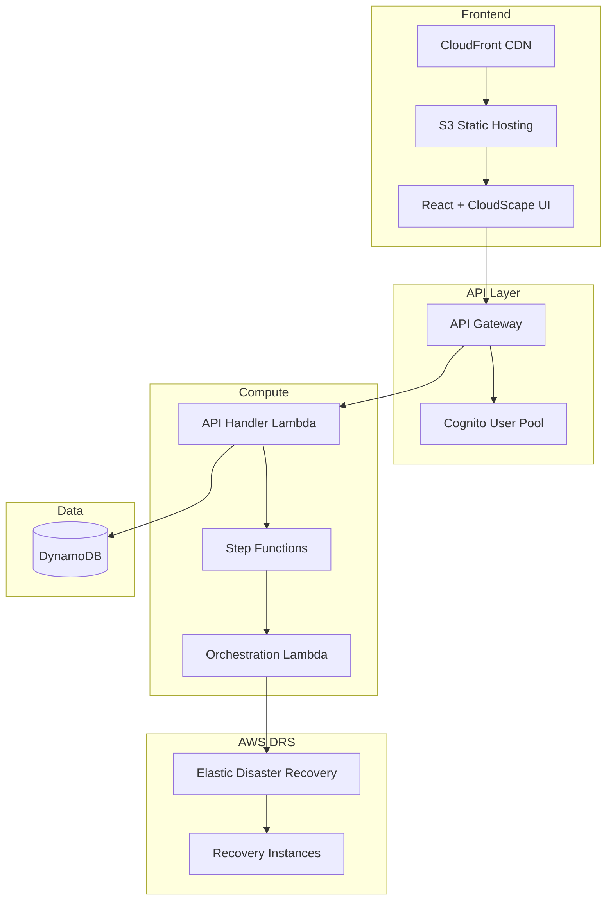
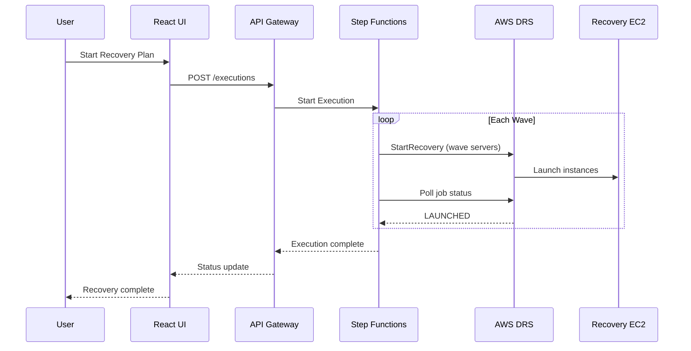
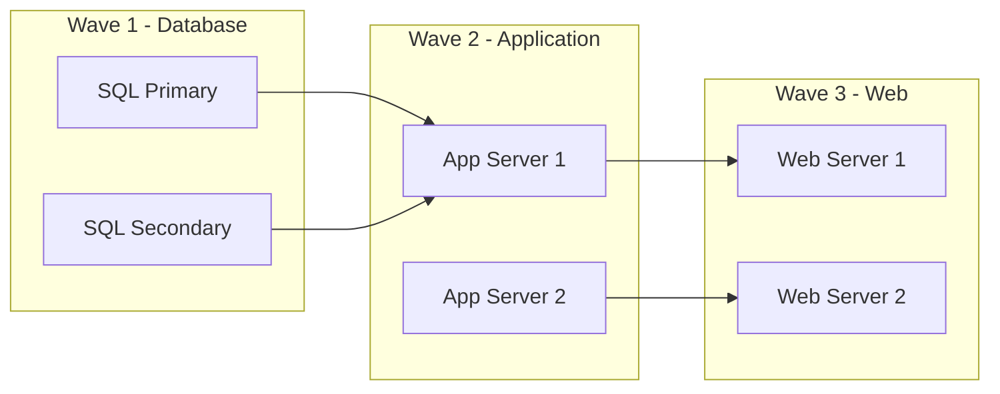

# AWS DRS Orchestration Solution

A serverless disaster recovery orchestration platform providing VMware Site Recovery Manager (SRM) capabilities for AWS Elastic Disaster Recovery (DRS).

[](LICENSE)
[](https://aws.amazon.com/disaster-recovery/)
[](cfn/)

## Overview

AWS DRS Orchestration enables enterprise organizations to orchestrate complex multi-tier application recovery with wave-based execution, dependency management, and automated health checks. It provides a familiar VMware SRM-like experience while leveraging AWS-native services.

### Key Capabilities

- **Protection Groups**: Organize DRS source servers into logical groups with automatic discovery
- **Recovery Plans**: Define wave-based recovery sequences with dependencies
- **Drill Mode**: Test recovery procedures without impacting production
- **Real-Time Monitoring**: Track execution progress with detailed status updates
- **API-First**: Complete REST API for DevOps integration and automation

## Architecture



### Recovery Execution Flow



## Quick Start

### Prerequisites

- AWS Account with DRS configured
- AWS CLI configured with appropriate permissions
- Node.js 18+ (for frontend development)
- Python 3.12+ (for Lambda development)

### Deploy with CloudFormation

```bash
aws cloudformation deploy \
  --template-url https://your-bucket.s3.region.amazonaws.com/cfn/master-template.yaml \
  --stack-name drs-orchestration \
  --parameter-overrides \
    ProjectName=drs-orchestration \
    Environment=prod \
    SourceBucket=your-bucket \
    AdminEmail=admin@example.com \
  --capabilities CAPABILITY_IAM CAPABILITY_NAMED_IAM \
  --region us-east-1
```

Deployment takes approximately 20-30 minutes.

### Stack Outputs

After deployment, retrieve your endpoints:

```bash
aws cloudformation describe-stacks \
  --stack-name drs-orchestration \
  --query 'Stacks[0].Outputs' \
  --output table
```

| Output | Description |
|--------|-------------|
| CloudFrontURL | Frontend application URL |
| ApiEndpoint | REST API endpoint |
| UserPoolId | Cognito User Pool ID |
| UserPoolClientId | Cognito App Client ID |

## Features

### Protection Groups

Organize your DRS source servers into logical groups for coordinated recovery.

- Automatic server discovery by AWS region
- Visual server selection with assignment tracking
- Single server per group constraint (prevents conflicts)
- Real-time search and filtering

### Recovery Plans

Define multi-wave recovery sequences with explicit dependencies.



- Unlimited waves (vs VMware SRM's 5 fixed priorities)
- Pre/post-wave automation actions via SSM
- Dependency validation and circular dependency detection

### Execution Types

| Type | Description | Use Case |
|------|-------------|----------|
| **Drill** | Test recovery without production impact | Regular DR testing |
| **Recovery** | Full disaster recovery execution | Actual DR event |

## API Reference

### Authentication

All API requests require a valid Cognito JWT token:

```bash
curl -H "Authorization: Bearer $TOKEN" \
  https://api-endpoint/prod/protection-groups
```

### Endpoints

#### Protection Groups

| Method | Endpoint | Description |
|--------|----------|-------------|
| GET | `/protection-groups` | List all protection groups |
| POST | `/protection-groups` | Create protection group |
| GET | `/protection-groups/{id}` | Get protection group |
| PUT | `/protection-groups/{id}` | Update protection group |
| DELETE | `/protection-groups/{id}` | Delete protection group |

#### Recovery Plans

| Method | Endpoint | Description |
|--------|----------|-------------|
| GET | `/recovery-plans` | List all recovery plans |
| POST | `/recovery-plans` | Create recovery plan |
| GET | `/recovery-plans/{id}` | Get recovery plan |
| PUT | `/recovery-plans/{id}` | Update recovery plan |
| DELETE | `/recovery-plans/{id}` | Delete recovery plan |

#### Executions

| Method | Endpoint | Description |
|--------|----------|-------------|
| GET | `/executions` | List execution history |
| POST | `/executions` | Start new execution |
| GET | `/executions/{id}` | Get execution details |

#### DRS Integration

| Method | Endpoint | Description |
|--------|----------|-------------|
| GET | `/drs/source-servers?region={region}` | Discover DRS servers |

## Infrastructure

### CloudFormation Stacks

The solution uses a modular nested stack architecture:

| Stack | Purpose | Resources |
|-------|---------|-----------|
| `master-template.yaml` | Root orchestrator | Parameter propagation, outputs |
| `database-stack.yaml` | Data persistence | 3 DynamoDB tables |
| `lambda-stack.yaml` | Compute | 4 Lambda functions, IAM roles |
| `api-stack.yaml` | API & Auth | API Gateway, Cognito, Step Functions |
| `security-stack.yaml` | Security (optional) | WAF, CloudTrail |
| `frontend-stack.yaml` | Frontend hosting | S3, CloudFront |

### DynamoDB Tables

| Table | Purpose | Key Schema |
|-------|---------|------------|
| `protection-groups-{env}` | Server groupings | `GroupId` (PK) |
| `recovery-plans-{env}` | Wave configurations | `PlanId` (PK) |
| `execution-history-{env}` | Audit trail | `ExecutionId` (PK), `PlanId` (SK) |

## Development

### Frontend

```bash
cd frontend
npm install
npm run dev      # Development server
npm run build    # Production build
```

### Lambda

```bash
cd lambda
pip install -r requirements.txt

# Deploy directly (development)
python3 deploy_lambda.py --direct \
  --function-name drs-orchestration-api-handler-prod \
  --region us-east-1
```

### Validate CloudFormation

```bash
make validate    # AWS validate-template
make lint        # cfn-lint validation
```

## Documentation

| Document | Description |
|----------|-------------|
| [Deployment Guide](docs/guides/DEPLOYMENT_AND_OPERATIONS_GUIDE.md) | Complete deployment instructions |
| [Architecture Design](docs/architecture/ARCHITECTURAL_DESIGN_DOCUMENT.md) | System architecture details |
| [API Reference](docs/guides/AWS_DRS_API_REFERENCE.md) | DRS API integration guide |
| [Testing Guide](docs/guides/TESTING_AND_QUALITY_ASSURANCE.md) | Testing procedures |

## Cost Estimate

| Component | Monthly Cost (Est.) |
|-----------|---------------------|
| Lambda | $1-5 |
| API Gateway | $3-10 |
| DynamoDB | $1-5 |
| CloudFront | $1-5 |
| S3 | <$1 |
| Step Functions | $1-5 |
| Cognito | Free tier |
| **Total** | **$10-30/month** |

*Costs vary based on usage. DRS replication costs are separate.*

## Security

- All data encrypted at rest (DynamoDB, S3)
- HTTPS enforced via CloudFront
- Cognito JWT authentication
- IAM least-privilege policies
- Optional WAF protection
- Optional CloudTrail audit logging

## Contributing

1. Fork the repository
2. Create a feature branch (`git checkout -b feature/amazing-feature`)
3. Commit changes (`git commit -m 'Add amazing feature'`)
4. Push to branch (`git push origin feature/amazing-feature`)
5. Open a Pull Request

## License

This project is licensed under the MIT License - see the [LICENSE](LICENSE) file for details.

## Support

- [Issues](../../issues) - Report bugs or request features
- [Discussions](../../discussions) - Ask questions and share ideas

---

Built with ❤️ for AWS Disaster Recovery
