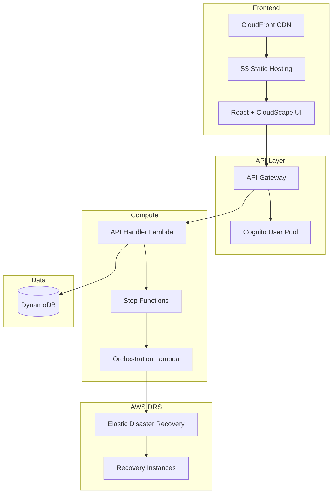
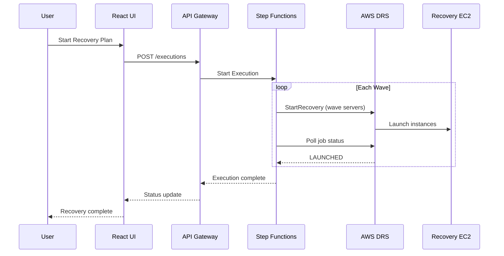

# AWS DRS Orchestration Solution

A serverless disaster recovery orchestration platform for AWS Elastic Disaster Recovery (DRS) with wave-based execution and enterprise-grade automation.

[](LICENSE)
[](https://aws.amazon.com/disaster-recovery/)
[](cfn/)

## Overview

AWS DRS Orchestration enables enterprise organizations to orchestrate complex multi-tier application recovery with wave-based execution, dependency management, and automated health checks using AWS-native services.

### Key Capabilities

- **Protection Groups**: Organize DRS source servers into logical groups with automatic discovery
- **Recovery Plans**: Define wave-based recovery sequences with dependencies
- **Drill Mode**: Test recovery procedures without impacting production
- **Real-Time Monitoring**: Track execution progress with detailed status updates
- **API-First**: Complete REST API for DevOps integration and automation

## Architecture



### Recovery Execution Flow



## Quick Start

### Prerequisites

- AWS Account with DRS configured
- AWS CLI configured with appropriate permissions
- Node.js 18+ (for frontend development)
- Python 3.12+ (for Lambda development)

### Deploy with CloudFormation

```bash
aws cloudformation deploy \
  --template-url https://your-bucket.s3.region.amazonaws.com/cfn/master-template.yaml \
  --stack-name drs-orchestration \
  --parameter-overrides \
    ProjectName=drs-orchestration \
    Environment=prod \
    SourceBucket=your-bucket \
    AdminEmail=admin@example.com \
  --capabilities CAPABILITY_IAM CAPABILITY_NAMED_IAM \
  --region us-east-1
```

Deployment takes approximately 20-30 minutes.

### Stack Outputs

After deployment, retrieve your endpoints:

```bash
aws cloudformation describe-stacks \
  --stack-name drs-orchestration \
  --query 'Stacks[0].Outputs' \
  --output table
```

| Output | Description |
|--------|-------------|
| CloudFrontURL | Frontend application URL |
| ApiEndpoint | REST API endpoint |
| UserPoolId | Cognito User Pool ID |
| UserPoolClientId | Cognito App Client ID |

## Features

### Protection Groups

Organize your DRS source servers into logical groups for coordinated recovery.

- Automatic server discovery by AWS region
- Visual server selection with assignment tracking
- Single server per group constraint (prevents conflicts)
- Real-time search and filtering

### Recovery Plans

Define multi-wave recovery sequences with explicit dependencies.

**Wave Execution Example:**

| Wave | Tier | Servers | Depends On |
|------|------|---------|------------|
| 1 | Database | SQL Primary, SQL Secondary | - |
| 2 | Application | App Server 1, App Server 2 | Wave 1 |
| 3 | Web | Web Server 1, Web Server 2 | Wave 2 |

- Unlimited waves with flexible priority ordering
- Pre/post-wave automation actions via SSM
- Dependency validation and circular dependency detection

### Execution Types

| Type | Description | Use Case |
|------|-------------|----------|
| **Drill** | Test recovery without production impact | Regular DR testing |
| **Recovery** | Full disaster recovery execution | Actual DR event |

## API Reference

### Authentication

All API requests require a valid Cognito JWT token:

```bash
curl -H "Authorization: Bearer $TOKEN" \
  https://api-endpoint/prod/protection-groups
```

### Endpoints

#### Protection Groups

| Method | Endpoint | Description |
|--------|----------|-------------|
| GET | `/protection-groups` | List all protection groups |
| POST | `/protection-groups` | Create protection group |
| GET | `/protection-groups/{id}` | Get protection group |
| PUT | `/protection-groups/{id}` | Update protection group |
| DELETE | `/protection-groups/{id}` | Delete protection group |

#### Recovery Plans

| Method | Endpoint | Description |
|--------|----------|-------------|
| GET | `/recovery-plans` | List all recovery plans |
| POST | `/recovery-plans` | Create recovery plan |
| GET | `/recovery-plans/{id}` | Get recovery plan |
| PUT | `/recovery-plans/{id}` | Update recovery plan |
| DELETE | `/recovery-plans/{id}` | Delete recovery plan |

#### Executions

| Method | Endpoint | Description |
|--------|----------|-------------|
| GET | `/executions` | List execution history |
| POST | `/executions` | Start new execution |
| GET | `/executions/{id}` | Get execution details |

#### DRS Integration

| Method | Endpoint | Description |
|--------|----------|-------------|
| GET | `/drs/source-servers?region={region}` | Discover DRS servers |

## Infrastructure

### CloudFormation Stacks

The solution uses a modular nested stack architecture:

| Stack | Purpose | Resources |
|-------|---------|-----------|
| `master-template.yaml` | Root orchestrator | Parameter propagation, outputs |
| `database-stack.yaml` | Data persistence | 3 DynamoDB tables |
| `lambda-stack.yaml` | Compute | 4 Lambda functions, IAM roles |
| `api-stack.yaml` | API & Auth | API Gateway, Cognito, Step Functions |
| `security-stack.yaml` | Security (optional) | WAF, CloudTrail |
| `frontend-stack.yaml` | Frontend hosting | S3, CloudFront |

### DynamoDB Tables

| Table | Purpose | Key Schema |
|-------|---------|------------|
| `protection-groups-{env}` | Server groupings | `GroupId` (PK) |
| `recovery-plans-{env}` | Wave configurations | `PlanId` (PK) |
| `execution-history-{env}` | Audit trail | `ExecutionId` (PK), `PlanId` (SK) |

## Development

### Frontend

```bash
cd frontend
npm install
npm run dev      # Development server
npm run build    # Production build
```

### Lambda

```bash
cd lambda
pip install -r requirements.txt

# Deploy directly (development)
python3 deploy_lambda.py --direct \
  --function-name drs-orchestration-api-handler-prod \
  --region us-east-1
```

### Validate CloudFormation

```bash
make validate    # AWS validate-template
make lint        # cfn-lint validation
```

## Post-Deployment Setup

After CloudFormation deployment completes, follow these steps to configure the application:

### 1. Create Admin User

```bash
# Get Cognito User Pool ID from stack outputs
USER_POOL_ID=$(aws cloudformation describe-stacks \
  --stack-name drs-orchestration \
  --query 'Stacks[0].Outputs[?OutputKey==`UserPoolId`].OutputValue' \
  --output text)

# Create admin user
aws cognito-idp admin-create-user \
  --user-pool-id $USER_POOL_ID \
  --username admin@example.com \
  --user-attributes Name=email,Value=admin@example.com Name=email_verified,Value=true \
  --temporary-password "TempPass123!" \
  --message-action SUPPRESS

# Set permanent password
aws cognito-idp admin-set-user-password \
  --user-pool-id $USER_POOL_ID \
  --username admin@example.com \
  --password "YourSecurePassword123!" \
  --permanent
```

### 2. Configure DRS Source Servers

Ensure your DRS source servers are configured and replicating:

```bash
# List DRS source servers
aws drs describe-source-servers --region us-east-1

# Verify replication status (should be "HEALTHY")
aws drs describe-source-servers \
  --filters name=lifeCycleState,values=READY_FOR_TEST,READY_FOR_CUTOVER \
  --region us-east-1
```

### 3. Access the Application

```bash
# Get CloudFront URL
aws cloudformation describe-stacks \
  --stack-name drs-orchestration \
  --query 'Stacks[0].Outputs[?OutputKey==`CloudFrontUrl`].OutputValue' \
  --output text
```

## GitLab CI/CD Integration

The repository includes a complete GitLab CI/CD pipeline (`.gitlab-ci.yml`) for automated deployment.

### Pipeline Stages

| Stage | Jobs | Description |
|-------|------|-------------|
| validate | `validate:cloudformation`, `validate:frontend-types` | Template validation, TypeScript checks |
| lint | `lint:python`, `lint:frontend` | Code quality checks |
| build | `build:lambda`, `build:frontend` | Package Lambda, build React app |
| test | `test:python-unit`, `test:playwright` | Unit and E2E tests |
| deploy-infra | `deploy:upload-artifacts`, `deploy:cloudformation` | S3 upload, stack deployment |
| deploy-frontend | `deploy:frontend` | S3 sync, CloudFront invalidation |

### Required CI/CD Variables

Configure these variables in GitLab Settings → CI/CD → Variables:

| Variable | Description | Protected |
|----------|-------------|-----------|
| `AWS_ACCESS_KEY_ID` | AWS access key for deployment | Yes |
| `AWS_SECRET_ACCESS_KEY` | AWS secret key for deployment | Yes |
| `AWS_DEFAULT_REGION` | Target AWS region (e.g., `us-east-1`) | No |
| `ADMIN_EMAIL` | Admin email for Cognito notifications | No |
| `DEPLOYMENT_BUCKET` | S3 bucket for artifacts | No |

### Pipeline Triggers

- **Automatic**: Runs on push to `main` or `dev/*` branches
- **Manual**: Production deployment requires manual approval

### Frontend Development Workflow

```bash
# 1. Clone repository
git clone <repository-url>
cd AWS-DRS-Orchestration

# 2. Install frontend dependencies
cd frontend
npm install

# 3. Create local environment config
cat > .env.local <<EOF
VITE_API_ENDPOINT=https://your-api-endpoint.execute-api.us-east-1.amazonaws.com/prod
VITE_COGNITO_REGION=us-east-1
VITE_COGNITO_USER_POOL_ID=us-east-1_xxxxx
VITE_COGNITO_CLIENT_ID=xxxxxxxxxxxxxxxxxxxxxxxxxx
EOF

# 4. Start development server
npm run dev

# 5. Make changes and commit
git add .
git commit -m "feat: Add new feature"
git push origin main  # Triggers CI/CD pipeline
```

### Manual Frontend Deployment

If you need to deploy frontend changes without the full pipeline:

```bash
# Build frontend
cd frontend
npm run build

# Get stack outputs
BUCKET=$(aws cloudformation describe-stacks --stack-name drs-orchestration \
  --query 'Stacks[0].Outputs[?OutputKey==`FrontendBucketName`].OutputValue' --output text)
DIST_ID=$(aws cloudformation describe-stacks --stack-name drs-orchestration \
  --query 'Stacks[0].Outputs[?OutputKey==`CloudFrontDistributionId`].OutputValue' --output text)

# Deploy (preserve aws-config.js)
aws s3 sync dist/ s3://$BUCKET/ --delete --exclude "aws-config.js"

# Invalidate cache
aws cloudfront create-invalidation --distribution-id $DIST_ID --paths "/*"
```

## Documentation

| Document | Description |
|----------|-------------|
| [Deployment Guide](docs/guides/DEPLOYMENT_AND_OPERATIONS_GUIDE.md) | Complete deployment instructions |
| [Architecture Design](docs/architecture/ARCHITECTURAL_DESIGN_DOCUMENT.md) | System architecture details |
| [API Reference](docs/guides/AWS_DRS_API_REFERENCE.md) | DRS API integration guide |
| [Testing Guide](docs/guides/TESTING_AND_QUALITY_ASSURANCE.md) | Testing procedures |

## Cost Estimate

| Component | Monthly Cost (Est.) |
|-----------|---------------------|
| Lambda | $1-5 |
| API Gateway | $3-10 |
| DynamoDB | $1-5 |
| CloudFront | $1-5 |
| S3 | <$1 |
| Step Functions | $1-5 |
| Cognito | Free tier |
| **Total** | **$10-30/month** |

*Costs vary based on usage. DRS replication costs are separate.*

## Security

- All data encrypted at rest (DynamoDB, S3)
- HTTPS enforced via CloudFront
- Cognito JWT authentication
- IAM least-privilege policies
- Optional WAF protection
- Optional CloudTrail audit logging

## Contributing

1. Fork the repository
2. Create a feature branch (`git checkout -b feature/amazing-feature`)
3. Commit changes (`git commit -m 'Add amazing feature'`)
4. Push to branch (`git push origin feature/amazing-feature`)
5. Open a Pull Request

## License

This project is licensed under the MIT License - see the [LICENSE](LICENSE) file for details.

## Support

- [Issues](../../issues) - Report bugs or request features
- [Discussions](../../discussions) - Ask questions and share ideas

---

Built with ❤️ for AWS Disaster Recovery
