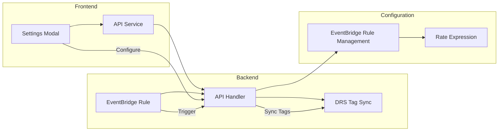

# Scheduled Tag Sync Implementation Summary

## Overview

Successfully implemented scheduled tag synchronization feature for the AWS DRS Orchestration solution. This allows users to configure automatic synchronization of EC2 instance tags to DRS source servers on a configurable schedule (1-24 hours), while maintaining the existing manual tag sync functionality.

## Implementation Details

### Backend Changes

#### 1. CloudFormation Templates

**cfn/eventbridge-stack.yaml**
- Added tag sync parameters: `EnableTagSync`, `TagSyncIntervalHours`, `ApiHandlerFunctionArn`
- Added `TagSyncScheduleRule` EventBridge rule with configurable rate expression
- Added IAM permissions for EventBridge to invoke Lambda
- Added `TagSyncSchedulePermission` for Lambda invocation
- Default: enabled with 4-hour interval

**cfn/master-template.yaml**
- Added tag sync parameters with defaults (EnableTagSync=true, TagSyncIntervalHours=4)
- Added EventBridge stack to Resources section with proper dependencies
- Added EventBridge stack outputs

**cfn/lambda-stack.yaml**
- Added PROJECT_NAME and ENVIRONMENT variables to API Handler Lambda
- Added EventBridge permissions to API Handler IAM role for rule management

#### 2. Lambda Functions

**lambda/index.py**
- Added `/config/tag-sync` GET endpoint to retrieve current settings
- Added `/config/tag-sync` PUT endpoint to update settings
- Added `get_tag_sync_settings()` function with EventBridge rule parsing
- Added `update_tag_sync_settings()` function with rule enable/disable/update
- Added `parse_schedule_expression()` helper function
- Added `handle_eventbridge_tag_sync()` for EventBridge-triggered sync
- Updated routing to handle EventBridge vs manual tag sync requests

### Frontend Changes

#### 1. New Components

**frontend/src/components/TagSyncConfigPanel.tsx**
- Complete configuration interface for scheduled tag sync
- Toggle for enable/disable scheduled sync
- Dropdown for interval selection (1-24 hours)
- Real-time status display with current settings
- Form validation and error handling
- Integration with existing manual sync functionality

#### 2. Updated Components

**frontend/src/components/SettingsModal.tsx**
- Added "Tag Sync" tab to settings modal
- Integrated TagSyncConfigPanel component

#### 3. API Service

**frontend/src/services/api.ts**
- Added `getTagSyncSettings()` method
- Added `updateTagSyncSettings()` method
- Added methods to export list for convenience imports

## Key Features

### 1. Configurable Scheduling
- Default 4-hour interval, configurable 1-24 hours
- Uses EventBridge rate expressions: `rate(X hours)`
- Real-time schedule updates without redeployment

### 2. Dual Operation Modes
- **Scheduled**: Automatic sync via EventBridge trigger
- **Manual**: Existing "Sync Tags" button functionality preserved
- Both modes use the same underlying tag sync logic

### 3. User Interface
- Intuitive settings panel in main Settings modal
- Real-time status indicators (Active/Inactive)
- Current schedule expression display
- EventBridge rule name visibility
- Last modified timestamp

### 4. Error Handling
- Graceful handling when EventBridge rule doesn't exist
- Clear error messages for configuration issues
- Validation for interval ranges (1-24 hours)
- Optimistic locking for concurrent updates

### 5. Security & Permissions
- Least-privilege IAM permissions for EventBridge access
- Scoped to specific tag sync rule only
- Maintains existing RBAC for manual tag sync

## Deployment Instructions

### 1. Deploy CloudFormation Updates
```bash
# Sync updated templates to S3
./scripts/sync-to-deployment-bucket.sh

# Deploy CloudFormation with tag sync enabled
./scripts/sync-to-deployment-bucket.sh --deploy-cfn
```

### 2. Deploy Lambda Updates
```bash
# Update Lambda function code
./scripts/sync-to-deployment-bucket.sh --update-lambda-code
```

### 3. Deploy Frontend Updates
```bash
# Build and deploy frontend
./scripts/sync-to-deployment-bucket.sh --build-frontend --deploy-frontend
```

### 4. Verify Deployment
```bash
# Check EventBridge rule creation
aws events describe-rule --name drs-orchestration-tag-sync-schedule-{env} --region {region}

# Check Lambda environment variables
aws lambda get-function-configuration --function-name drs-orchestration-api-handler-{env} --region {region}

# Test API endpoints
curl -H "Authorization: Bearer {token}" https://{api-endpoint}/config/tag-sync
```

## Usage Instructions

### 1. Access Settings
1. Open the DRS Orchestration web application
2. Click the Settings gear icon in the top navigation
3. Select the "Tag Sync" tab

### 2. Configure Scheduled Sync
1. Toggle "Scheduled Sync" to enabled
2. Select desired interval (1-24 hours)
3. Click "Save Changes"
4. Verify "Current Status" shows "Active"

### 3. Manual Sync (Unchanged)
- Existing "Sync Tags" buttons continue to work
- Manual sync operates independently of scheduled sync
- Both use the same underlying synchronization logic

## Technical Architecture



## Monitoring & Troubleshooting

### 1. EventBridge Rule Status
- Check rule state: `aws events describe-rule --name {rule-name}`
- View rule targets: `aws events list-targets-by-rule --rule {rule-name}`

### 2. Lambda Logs
- CloudWatch log group: `/aws/lambda/drs-orchestration-api-handler-{env}`
- Search for "EventBridge-triggered tag sync" for scheduled executions
- Search for "Tag sync triggered by EventBridge" for execution details

### 3. Common Issues
- **Rule not found**: Redeploy CloudFormation with EnableTagSync=true
- **Permission denied**: Check Lambda IAM role has EventBridge permissions
- **Schedule not updating**: Verify API calls are successful and rule exists

## Future Enhancements

### 1. Advanced Scheduling
- Support for cron expressions (specific times/days)
- Multiple sync schedules for different regions
- Pause/resume scheduling without disabling

### 2. Monitoring & Alerting
- CloudWatch metrics for sync success/failure rates
- SNS notifications for sync failures
- Dashboard for sync execution history

### 3. Selective Sync
- Filter by specific tags or server groups
- Region-specific sync schedules
- Account-specific sync configurations

## Testing

### 1. Unit Tests
- Test EventBridge rule parsing logic
- Test schedule expression validation
- Test API endpoint error handling

### 2. Integration Tests
- Test EventBridge rule creation/update
- Test Lambda invocation from EventBridge
- Test tag sync execution flow

### 3. End-to-End Tests
- Test complete configuration workflow
- Test scheduled sync execution
- Test manual sync alongside scheduled sync

## Conclusion

The scheduled tag sync feature is now fully implemented and ready for deployment. It provides a seamless way to keep DRS source server tags synchronized with EC2 instances automatically, while preserving all existing manual sync functionality. The implementation follows AWS best practices for serverless architecture and provides a user-friendly configuration interface.