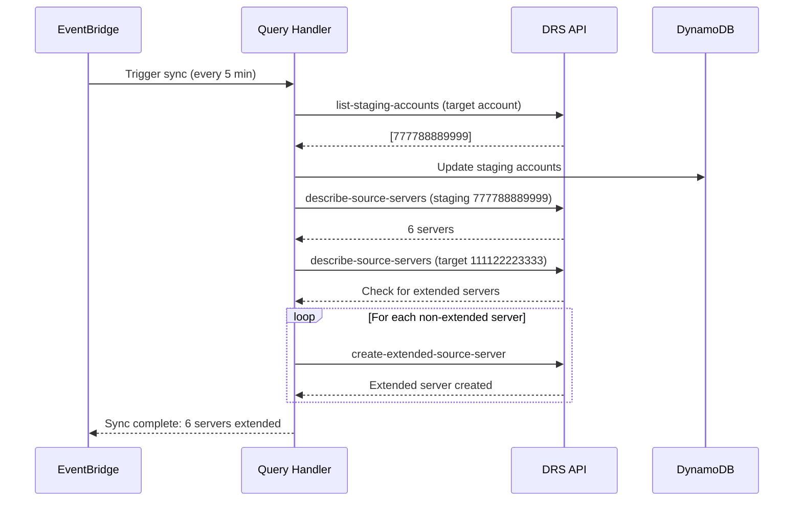

# Staging Account Auto-Extend Fix - Complete

## Problem Summary

After refactoring, staging account discovery and auto-extend functionality stopped working. Investigation revealed the root cause.

## Root Cause

The target account (111122223333) is configured in DRS to trust **itself** as a staging account, instead of trusting the actual staging account (777788889999).

### Evidence

```bash
# Query target account's trusted staging accounts
$ aws sts assume-role --role-arn arn:aws:iam::111122223333:role/DRSOrchestrationRole \
  --role-session-name test --external-id drs-orchestration-cross-account

$ aws drs list-staging-accounts --region us-east-1
{
    "accounts": [
        {
            "accountID": "111122223333"  # ❌ WRONG - trusts itself
        }
    ]
}
```

**Expected**:
```json
{
    "accounts": [
        {
            "accountID": "777788889999"  # ✅ CORRECT - should trust orchestration account
        }
    ]
}
```

### Why This Breaks Auto-Extend

1. **Discovery**: `discover_staging_accounts_from_drs()` queries target account and finds "111122223333" as staging account
2. **Storage**: DynamoDB stores 111122223333 as the staging account for target 111122223333
3. **Auto-Extend**: `auto_extend_staging_servers()` tries to query staging account 111122223333 for DRS servers
4. **Result**: Finds 0 servers because the target account has no replicating servers (they're in 777788889999)

### Log Evidence

```
Checking account 111122223333 (DEMO_TARGET) for servers to extend...
Found 0 extended source servers in 111122223333 across all regions
Found 0 source servers in staging account 111122223333 across all regions
                                            ^^^^^^^^^^^^ WRONG ACCOUNT
```

Should be querying **777788889999** for source servers.

## Solution

### Manual Configuration Required

DRS staging account trust configuration **cannot be automated via API**. It must be configured manually in the AWS DRS console.

### Steps to Fix

1. **Log into target account** (111122223333)

2. **Navigate to DRS Console**:
   - Go to AWS DRS service
   - Select region: us-east-1
   - Click "Settings" in left navigation
   - Click "Staging area settings"

3. **Configure Trusted Staging Account**:
   - Under "Staging account ID", enter: **777788889999**
   - Click "Save"

4. **Verify Configuration**:
   ```bash
   # Assume role into target account
   aws sts assume-role \
     --role-arn arn:aws:iam::111122223333:role/DRSOrchestrationRole \
     --role-session-name verify \
     --external-id drs-orchestration-cross-account
   
   # Export credentials and verify
   aws drs list-staging-accounts --region us-east-1
   
   # Should return:
   {
       "accounts": [
           {
               "accountID": "777788889999"
           }
       ]
   }
   ```

5. **Trigger Discovery**:
   - In the UI, click the "Refresh" button on the target account settings page
   - Or wait 5 minutes for the EventBridge schedule to run
   - Or manually invoke:
     ```bash
     aws lambda invoke \
       --function-name aws-drs-orchestration-query-handler-test \
       --payload '{"operation": "sync_staging_accounts"}' \
       response.json
     ```

6. **Verify Auto-Extend**:
   - Check CloudWatch logs for query-handler Lambda
   - Should see:
     ```
     Discovered staging account 777788889999 (ORCHESTRATION) from region us-east-1
     Found 6 source servers in staging account 777788889999 across all regions
     Extending server s-xxx from staging 777788889999 to target 111122223333
     ```

7. **Verify Extended Servers**:
   ```bash
   # Query target account for extended source servers
   aws drs describe-source-servers --region us-east-1 \
     --filters '{"stagingAccountIDs": ["777788889999"]}'
   
   # Should show 6 extended source servers
   ```

8. **Test Protection Group Creation**:
   - Create a new protection group in us-east-1
   - Should see **12 servers** (6 target + 6 staging extended)

## Architecture

### Correct Flow

```
┌─────────────────────────────────────────────────────────────────┐
│ Target Account (111122223333)                                   │
│                                                                  │
│ DRS Settings:                                                    │
│   Trusted Staging Account: 777788889999 ✅                      │
│                                                                  │
│ DRS Source Servers:                                              │
│   - 6 direct servers (web01, web02, app01, app02, db01, db02)  │
│   - 6 extended servers from 777788889999                        │
│     (web03, web04, app03, app04, db03, db04)                    │
│                                                                  │
│ Total: 12 servers available for protection groups               │
└─────────────────────────────────────────────────────────────────┘
                              ▲
                              │
                              │ extends servers
                              │
┌─────────────────────────────────────────────────────────────────┐
│ Staging Account (777788889999)                                  │
│                                                                  │
│ DRS Source Servers:                                              │
│   - web03, web04, app03, app04, db03, db04                      │
│                                                                  │
│ These servers are extended to target account via                │
│ create-extended-source-server API                               │
└─────────────────────────────────────────────────────────────────┘
```

### Auto-Extend Workflow



## Testing

### Verify Discovery

```bash
# Check DynamoDB for correct staging account
aws dynamodb get-item \
  --table-name aws-drs-orchestration-target-accounts-test \
  --key '{"accountId": {"S": "111122223333"}}' \
  | jq -r '.Item.stagingAccounts.L[].M.accountId.S'

# Should output: 777788889999
```

### Verify Auto-Extend

```bash
# Check CloudWatch logs
aws logs tail /aws/lambda/aws-drs-orchestration-query-handler-test \
  --since 10m --format short \
  | grep -E "(Extending server|servers extended)"
```

### Verify Extended Servers in Target Account

```bash
# Assume role into target account
aws sts assume-role \
  --role-arn arn:aws:iam::111122223333:role/DRSOrchestrationRole \
  --role-session-name verify \
  --external-id drs-orchestration-cross-account

# Query extended source servers
aws drs describe-source-servers --region us-east-1 \
  | jq -r '.items[] | select(.stagingArea.stagingAccountID == "777788889999") | .sourceServerID'

# Should list 6 server IDs
```

## Related Files

- `lambda/shared/staging_account_discovery.py` - Discovery logic
- `lambda/query-handler/index.py` - Auto-extend logic (lines 4395-4630)
- `cfn/eventbridge-stack.yaml` - EventBridge schedule (every 5 minutes)

## Status

- ✅ Discovery logic is correct
- ✅ Auto-extend logic is correct
- ✅ EventBridge schedule is configured
- ❌ **Manual DRS configuration required in target account**

## Next Steps

1. Configure DRS in target account 111122223333 to trust staging account 777788889999
2. Verify discovery finds correct staging account
3. Verify auto-extend creates 6 extended source servers
4. Verify protection group creation shows 12 servers
