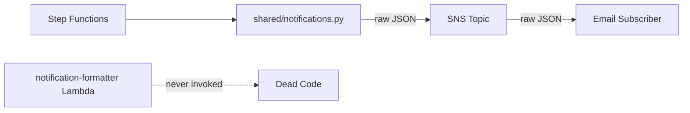

# Design Document: Notification Formatter Consolidation

## Overview

This design consolidates the HTML email formatting functions from the standalone `notification-formatter` Lambda into `lambda/shared/notifications.py`. The key change is wiring `publish_recovery_plan_notification` to call `format_notification_message` before publishing, so SNS email subscribers receive formatted HTML instead of raw JSON. After the move, the standalone Lambda is archived and removed from CloudFormation and the deploy pipeline.

The formatter functions are pure Python (string formatting only, no external dependencies), making the move straightforward — copy the functions, update the publish function, update imports in tests, and remove the infrastructure.

## Architecture

### Current Flow (Broken)



### Target Flow (Fixed)


The notification-formatter Lambda, its IAM role, and its CloudFormation resources are removed entirely. The `archive/code/notification-formatter/` directory preserves the original code for reference.

## Components and Interfaces

### Modified: `lambda/shared/notifications.py`

**New functions added** (moved from `lambda/notification-formatter/index.py`):

| Function | Signature | Purpose |
|---|---|---|
| `_get_base_email_styles` | `() -> str` | Shared inline CSS for HTML email templates |
| `_build_info_box` | `(details: Dict[str, Any]) -> str` | Common info box HTML with execution details |
| `_build_console_link` | `(details: Dict[str, Any]) -> str` | Console link HTML section |
| `_wrap_html_email` | `(title: str, body_content: str, details: Dict[str, Any]) -> str` | Wraps content in full HTML email template |
| `format_start_notification` | `(details: Dict[str, Any]) -> str` | HTML for execution start events |
| `format_complete_notification` | `(details: Dict[str, Any]) -> str` | HTML for execution completion events |
| `format_failure_notification` | `(details: Dict[str, Any]) -> str` | HTML for execution failure events |
| `format_pause_notification` | `(details: Dict[str, Any]) -> str` | HTML for pause events with action buttons |
| `format_notification_message` | `(event_type: str, details: Dict[str, Any]) -> Dict[str, Any]` | Routes to appropriate formatter by event type |

**Modified function**: `publish_recovery_plan_notification`

Current behavior:
```python
sns.publish(
    TopicArn=EXECUTION_TOPIC_ARN,
    Message=json.dumps(details),
    Subject=subject,
    MessageAttributes={...},
)
```

New behavior:
```python
formatted = format_notification_message(event_type, details)
message_body = json.dumps({
    "default": formatted["default"],
    "email": formatted["email"],
})
sns.publish(
    TopicArn=EXECUTION_TOPIC_ARN,
    Message=message_body,
    Subject=subject,
    MessageStructure="json",
    MessageAttributes={...},
)
```

The `MessageStructure="json"` parameter tells SNS to parse the message body as a JSON object with protocol-specific keys. The `"email"` key delivers HTML to email subscribers; the `"default"` key is the fallback for other protocols (SMS, HTTP, etc.).

### Removed: `lambda/notification-formatter/index.py`

The entire Lambda handler (`lambda_handler`, `handle_execution_notification`, `handle_drs_alert_notification`, `handle_pause_notification`) and the plain-text formatters (`format_execution_message`, `format_drs_alert_message`, `format_pause_message`) are not moved — they were Lambda-specific entry points that are no longer needed. Only the HTML formatting functions listed above are moved.

### Removed Infrastructure

| Resource | File | Type |
|---|---|---|
| `NotificationFormatterFunction` | `cfn/lambda-stack.yaml` | `AWS::Lambda::Function` |
| `NotificationFormatterFunctionArn` output | `cfn/lambda-stack.yaml` | Output/Export |
| `NotificationFormatterFunctionName` output | `cfn/lambda-stack.yaml` | Output/Export |
| `NotificationFormatterRole` | `cfn/notification-stack.yaml` | `AWS::IAM::Role` |
| `NotificationFormatterRoleArn` output | `cfn/notification-stack.yaml` | Output/Export |
| `("notification-formatter", False)` | `package_lambda.py` | Lambda packaging entry |
| `"notification-formatter"` | `scripts/deploy.sh` | Lambda update list entries (2 occurrences) |

## Data Models

No new data models are introduced. The existing `details: Dict[str, Any]` dictionary passed to `publish_recovery_plan_notification` already contains all fields needed by the formatters (`planName`, `executionId`, `accountId`, `timestamp`, `consoleLink`, `waveCount`, `executionType`, `duration`, `wavesCompleted`, `errorMessage`, `failedWave`, `pauseReason`, `resumeUrl`, `cancelUrl`).

The SNS message body changes from a flat JSON string to a protocol-structured JSON object:

```json
{
    "default": "DR Execution Started: Production DR Plan",
    "email": "<!DOCTYPE html>..."
}
```


## Correctness Properties

*A property is a characteristic or behavior that should hold true across all valid executions of a system — essentially, a formal statement about what the system should do. Properties serve as the bridge between human-readable specifications and machine-verifiable correctness guarantees.*

### Property 1: Formatter output contains required fields

*For any* valid details dictionary containing `planName` and `executionId`, and *for any* event type in `{"start", "complete", "fail", "pause"}`, calling `format_notification_message(event_type, details)` SHALL return a dict with a `"default"` key containing the plan name as a plain-text string, and an `"email"` key containing a well-formed HTML string that includes the plan name, execution ID, and the `<!DOCTYPE html>` declaration.

**Validates: Requirements 1.1**

### Property 2: SNS publish uses structured HTML messages

*For any* valid `event_type` in `{"start", "complete", "fail", "pause"}` and *for any* valid `details` dictionary, when `publish_recovery_plan_notification` is called, the SNS `publish` call SHALL include `MessageStructure="json"` and the `Message` parameter SHALL be a JSON string containing a `"default"` key with plain text and an `"email"` key with HTML content produced by `format_notification_message`.

**Validates: Requirements 2.1, 2.2**

## Error Handling

### Formatter Exception Fallback

If `format_notification_message` raises an unexpected exception inside `publish_recovery_plan_notification`, the function catches the error, logs it, and falls back to publishing `json.dumps(details)` as a plain message (no `MessageStructure="json"`). This ensures notifications are never silently lost even if the HTML formatting code has a bug.

```python
try:
    formatted = format_notification_message(event_type, details)
    message_body = json.dumps({
        "default": formatted["default"],
        "email": formatted["email"],
    })
    message_structure = "json"
except Exception as fmt_exc:
    logger.error(
        "Failed to format notification for %s: %s",
        event_type,
        fmt_exc,
    )
    message_body = json.dumps(details)
    message_structure = None
```

### SNS Publish Failure

The existing error handling in `publish_recovery_plan_notification` already catches SNS publish exceptions, logs them, and returns without raising. This behavior is preserved — notification failures never block DR execution.

### Missing Topic ARN

The existing early-return guard (`if not EXECUTION_TOPIC_ARN`) is preserved unchanged.

## Testing Strategy

### Property-Based Testing

Use `hypothesis` (already in `requirements-dev.txt`) for property-based tests. Each property test runs a minimum of 100 iterations.

**Library**: `hypothesis`
**Configuration**: `@settings(max_examples=100)`

Property tests to implement:

1. **Feature: notification-formatter-consolidation, Property 1: Formatter output contains required fields** — Generate random details dicts with `planName` and `executionId`, random event types from the valid set, and verify the output structure and content.

2. **Feature: notification-formatter-consolidation, Property 2: SNS publish uses structured HTML messages** — Mock SNS, generate random valid event types and details dicts, call `publish_recovery_plan_notification`, and verify the mock was called with `MessageStructure="json"` and a properly structured message body.

### Unit Testing

Existing tests in `tests/unit/test_notification_formatter_html.py` cover:
- Each HTML template contains required fields (plan name, execution ID, timestamp)
- Pause notification contains resume and cancel action URLs
- HTML output is well-formed (contains `<!DOCTYPE html>`, `<html>`, `</html>`)
- `format_notification_message` routes to correct formatter by event type
- Unknown event type returns fallback

Additional unit tests needed:
- `publish_recovery_plan_notification` publishes with `MessageStructure="json"` (mock SNS)
- Formatter exception fallback publishes raw JSON
- Unrecognized event type fallback produces plain-text message

### Test Migration

The existing test file imports via `import_module("notification-formatter.index")`. This import path changes to import directly from `lambda.shared.notifications`. All existing test assertions remain unchanged — only the import source changes.
