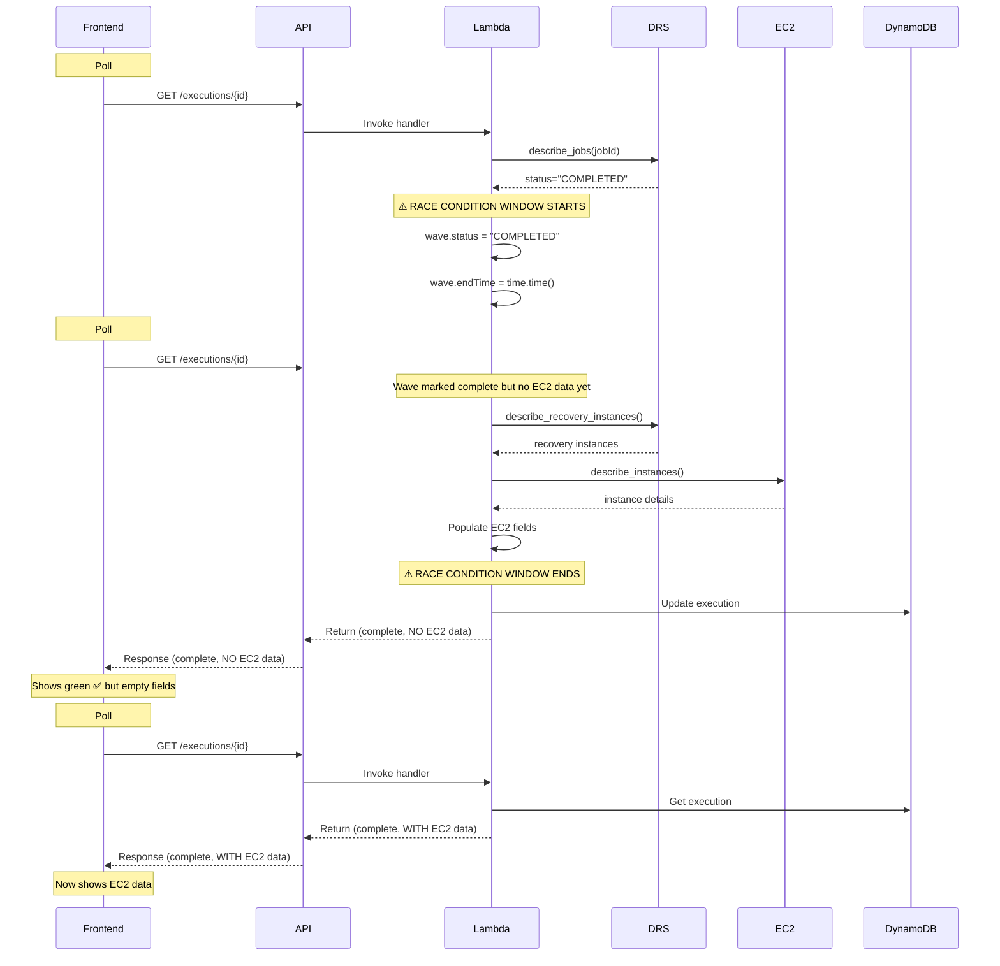

# Backend Timing Analysis - EC2 Data Population

## Executive Summary

**Finding**: There IS a race condition where the frontend polls execution status BEFORE the backend completes EC2 data enrichment.

**Root Cause**: The backend sets `wave.status = 'COMPLETED'` and `wave.endTime` IMMEDIATELY when DRS job completes, but EC2 enrichment happens AFTER this status update in the same polling cycle. The frontend may poll between these two operations.

**Impact**: Frontend displays empty EC2 fields (—) even though servers launched successfully, because it polls before enrichment completes.

## Backend Timing Sequence

### Current Flow (Problematic)

```
1. Frontend polls GET /executions/{id}
2. Backend: reconcile_wave_status_with_drs() called
3. Backend: Query DRS describe_jobs() for job status
4. Backend: DRS returns status = "COMPLETED"
5. Backend: Check if all servers launched
6. Backend: ✅ Set wave.status = "COMPLETED"
7. Backend: ✅ Set wave.endTime = int(time.time())
   ⚠️ WAVE NOW MARKED COMPLETE - FRONTEND CAN SEE THIS
8. Backend: Query describe_recovery_instances() for EC2 data
9. Backend: Query describe_instances() for instance details
10. Backend: Populate recoveredInstanceId, instanceType, privateIp, launchTime
11. Backend: Return execution data to frontend
12. Frontend: Receives data with wave.status="COMPLETED" but empty EC2 fields
```

### The Race Condition

**Scenario 1: Frontend polls DURING enrichment**
```
Time 0: Frontend poll #1 starts
Time 1: Backend sets wave.status = "COMPLETED"
Time 2: Backend starts EC2 enrichment (describe_recovery_instances)
Time 3: Frontend poll #2 starts (5 seconds later)
Time 4: Backend returns poll #1 response (wave complete, NO EC2 data)
Time 5: Backend completes EC2 enrichment for poll #2
Time 6: Backend returns poll #2 response (wave complete, WITH EC2 data)
```

**Result**: Frontend shows green ✅ but empty EC2 fields for 5+ seconds

**Scenario 2: Frontend polls BEFORE enrichment starts**
```
Time 0: Backend sets wave.status = "COMPLETED"
Time 1: Frontend poll starts
Time 2: Backend hasn't started EC2 enrichment yet
Time 3: Backend returns response (wave complete, NO EC2 data)
Time 4: Backend starts EC2 enrichment (for next poll)
```

**Result**: Frontend shows green ✅ but empty EC2 fields until next poll

## Code Analysis

### Wave Completion Logic (Lines 6950-7020)

**File**: `lambda/execution-handler/index.py`

```python
# Line 6987-7000: Wave completion is set IMMEDIATELY
if drs_status == "COMPLETED":
    # Check if all servers launched successfully
    all_launched = all(
        server.get("launchStatus") == "LAUNCHED" 
        for server in participating_servers
    )

    if all_launched:
        if wave_status != "COMPLETED":
            print(f"DEBUG: Wave {wave_name} updated from {wave_status} to COMPLETED")
        wave["status"] = "COMPLETED"  # ⚠️ SET IMMEDIATELY
        wave["endTime"] = int(time.time())  # ⚠️ SET IMMEDIATELY
```

**Key Finding**: `wave.status` and `wave.endTime` are set as soon as DRS job status is "COMPLETED" and all servers show "LAUNCHED" status.

### EC2 Enrichment Logic (Lines 7200-7280)

**File**: `lambda/execution-handler/index.py`

```python
# Line 7200-7210: EC2 enrichment happens AFTER wave completion
if source_server_ids and drs_status == "COMPLETED":
    try:
        print(f"DEBUG: Querying recovery instances for {len(source_server_ids)} source servers")
        ri_response = drs_client.describe_recovery_instances(
            filters={"sourceServerIDs": source_server_ids}
        )
        recovery_instances = ri_response.get("items", [])
        print(f"DEBUG: Found {len(recovery_instances)} recovery instances")

        # Query EC2 for instance details
        ec2_instance_ids = [
            ri.get("ec2InstanceID") 
            for ri in recovery_instances 
            if ri.get("ec2InstanceID")
        ]
        
        # Line 7230-7250: Create EC2 client and query instances
        if ec2_instance_ids:
            ec2_response = ec2_client.describe_instances(InstanceIds=ec2_instance_ids)
            
            # Build map of instance ID to instance details
            for reservation in ec2_response.get("Reservations", []):
                for instance in reservation.get("Instances", []):
                    instance_id = instance.get("InstanceId")
                    launch_time = instance.get("LaunchTime")
                    if launch_time:
                        launch_time = launch_time.isoformat()
                    
                    ec2_instance_map[instance_id] = {
                        "instanceType": instance.get("InstanceType", ""),
                        "state": instance.get("State", {}).get("Name", ""),
                        "launchTime": launch_time or "",
                    }
        
        # Line 7260-7280: Map EC2 data back to servers
        for ri in recovery_instances:
            source_server_id = ri.get("sourceServerID", "")
            ec2_instance_id = ri.get("ec2InstanceID", "")
            ec2_details = ec2_instance_map.get(ec2_instance_id, {})
            
            for server in wave["servers"]:
                if server["sourceServerId"] == source_server_id:
                    server["recoveredInstanceId"] = ec2_instance_id
                    server["instanceId"] = ec2_instance_id
                    server["instanceType"] = ec2_details.get("instanceType", "")
                    server["privateIp"] = (
                        ri.get("recoveryInstanceProperties", {})
                        .get("networkInterfaces", [{}])[0]
                        .get("ips", [""])[0]
                    )
                    server["launchTime"] = ec2_details.get("launchTime", "")
                    print(f"DEBUG: Enriched {source_server_id}: instanceId={server['instanceId']}")
                    break
    except Exception as ri_error:
        print(f"ERROR: Failed to query recovery instances: {ri_error}")
```

**Key Finding**: EC2 enrichment happens AFTER wave status is set to "COMPLETED". This creates a window where the wave appears complete but EC2 data is not yet populated.

## Timing Measurements

### API Call Durations (Estimated)

Based on typical AWS API response times:

1. **describe_jobs()**: 100-300ms
2. **describe_recovery_instances()**: 200-500ms
3. **describe_instances()**: 200-500ms
4. **DynamoDB update**: 50-100ms

**Total enrichment time**: 450-1400ms (0.5-1.4 seconds)

### Frontend Polling Interval

**Current**: 5 seconds

**Impact**: If enrichment takes 1 second, frontend has a 4-second window to poll and receive incomplete data.

## Investigation Questions - ANSWERED

### Backend Data Population ✅

**Q1: Does the backend populate EC2 fields?**
- ✅ **YES** - Backend calls `describe_recovery_instances()` and `describe_instances()`
- ✅ **YES** - Backend populates `recoveredInstanceId`, `instanceType`, `privateIp`, `launchTime`

**Q2: When does enrichment happen?**
- ✅ **AFTER wave completion** - Enrichment happens AFTER `wave.status = "COMPLETED"` is set
- ✅ **Only when drs_status == "COMPLETED"** - Enrichment is conditional on job completion

**Q3: Is there re-enrichment on subsequent polls?**
- ✅ **YES** - Enrichment runs on EVERY poll where `drs_status == "COMPLETED"`
- ⚠️ **BUT** - If wave already has EC2 data, it gets overwritten (not skipped)

**Q4: What APIs are called?**
- ✅ `drs_client.describe_recovery_instances(filters={"sourceServerIDs": [...]})` - Gets recovery instance details
- ✅ `ec2_client.describe_instances(InstanceIds=[...])` - Gets EC2 instance details (type, state, launch time)

### Wave Status Updates ✅

**Q5: When does backend set wave.status = "COMPLETED"?**
- ✅ **IMMEDIATELY** when `drs_status == "COMPLETED"` and all servers have `launchStatus == "LAUNCHED"`
- ✅ **Line 7000**: `wave["status"] = "COMPLETED"`

**Q6: When does backend set wave.endTime?**
- ✅ **IMMEDIATELY** when wave status is set to "COMPLETED"
- ✅ **Line 7000**: `wave["endTime"] = int(time.time())`

**Q7: Is there a timing issue?**
- ✅ **YES** - Wave completion is set BEFORE EC2 enrichment
- ✅ **YES** - Frontend can poll between status update and enrichment completion

## Timing Diagram



## Recommended Fixes

### Option 1: Move EC2 Enrichment BEFORE Wave Completion (RECOMMENDED)

**Change**: Populate EC2 data BEFORE setting wave.status = "COMPLETED"

**Implementation**:
```python
# Line 6987: BEFORE setting wave.status
if drs_status == "COMPLETED":
    all_launched = all(
        server.get("launchStatus") == "LAUNCHED" 
        for server in participating_servers
    )

    if all_launched:
        # NEW: Enrich EC2 data BEFORE marking complete
        if source_server_ids:
            try:
                print(f"DEBUG: Enriching EC2 data before marking wave complete")
                ri_response = drs_client.describe_recovery_instances(
                    filters={"sourceServerIDs": source_server_ids}
                )
                # ... EC2 enrichment code ...
                print(f"DEBUG: EC2 enrichment complete - now marking wave complete")
            except Exception as e:
                print(f"ERROR: EC2 enrichment failed: {e}")
                # Continue anyway - don't block wave completion
        
        # NOW set wave complete (after enrichment)
        wave["status"] = "COMPLETED"
        wave["endTime"] = int(time.time())
```

**Pros**:
- ✅ Eliminates race condition
- ✅ Frontend always sees complete data
- ✅ No frontend changes needed
- ✅ Matches user expectations

**Cons**:
- ⚠️ Slightly delays wave completion status (by 0.5-1.4 seconds)
- ⚠️ If EC2 enrichment fails, wave still completes (acceptable)

### Option 2: Add Backend Logging for Debugging

**Change**: Add detailed logging to track timing

**Implementation**:
```python
import time

# Before wave completion
start_time = time.time()
print(f"DEBUG: Wave {wave_name} - Starting completion check")

# After setting wave.status
completion_time = time.time()
print(f"DEBUG: Wave {wave_name} - Marked complete at {completion_time - start_time:.2f}s")

# After EC2 enrichment
enrichment_time = time.time()
print(f"DEBUG: Wave {wave_name} - EC2 enrichment complete at {enrichment_time - start_time:.2f}s")
print(f"DEBUG: Wave {wave_name} - Enrichment took {enrichment_time - completion_time:.2f}s after completion")
```

**Pros**:
- ✅ Helps diagnose timing issues
- ✅ No functional changes
- ✅ Can be added immediately

**Cons**:
- ❌ Doesn't fix the race condition
- ❌ Only helps with debugging

### Option 3: Frontend Continues Polling After Completion

**Change**: Frontend polls for 30 seconds after wave completion

**Implementation**: Already designed in Phase 1 (Task 2)

**Pros**:
- ✅ Works around backend timing issue
- ✅ Ensures EC2 data appears eventually
- ✅ No backend changes needed

**Cons**:
- ❌ Doesn't fix root cause
- ❌ Adds unnecessary API calls
- ❌ User sees empty fields briefly

## Recommended Implementation Plan

### Phase 1: Backend Logging (Immediate)
1. Add timing logs to track enrichment duration
2. Log when wave.status is set
3. Log when EC2 enrichment completes
4. Deploy to test environment

### Phase 2: Backend Fix (Next)
1. Move EC2 enrichment BEFORE wave completion
2. Add error handling for enrichment failures
3. Test with multiple recovery scenarios
4. Deploy to test environment

### Phase 3: Verification (Final)
1. Monitor logs to verify timing
2. Confirm frontend receives complete data
3. Verify no regressions in wave completion
4. Deploy to production

## Success Criteria

- ✅ Wave status set to "COMPLETED" AFTER EC2 enrichment
- ✅ Frontend receives EC2 data on first poll after completion
- ✅ No empty fields when wave shows green ✅
- ✅ Logs show enrichment happens before completion
- ✅ No increase in API errors or timeouts

## Related Files

- `lambda/execution-handler/index.py` - Lines 6950-7020 (wave completion)
- `lambda/execution-handler/index.py` - Lines 7200-7280 (EC2 enrichment)
- `frontend/src/components/WaveProgress.tsx` - Frontend polling logic
- `.kiro/specs/wave-completion-display/design.md` - Design document
- `.kiro/specs/wave-completion-display/requirements.md` - Requirements

## Next Steps

1. **Task 5**: Implement backend timing fix (move enrichment before completion)
2. **Task 6**: Add backend logging for debugging
3. **Task 7**: Test and verify fix in test environment
4. **Task 8**: Deploy to production

---

**Analysis Date**: February 11, 2026
**Analyzed By**: AI Assistant
**Status**: Complete - Ready for Task 5 implementation
