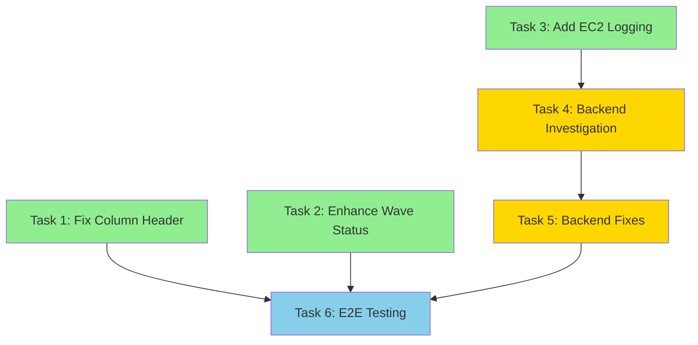

# Wave Completion Display - Tasks

## Overview

This task list implements fixes for three issues in the WaveProgress component:
1. Wave status not updating to green when complete
2. Missing EC2 instance information in server table
3. Misleading "Server ID" column header

## Implementation Phases

### Phase 1: Frontend Quick Fixes (Tasks 1-3)
Immediate improvements to wave status detection and column labeling.

### Phase 2: Backend Timing Investigation (Task 4)
✅ **VERIFIED**: Backend DOES populate EC2 data via DRS/EC2 APIs. Focus on timing issue where frontend polls before enrichment completes.

### Phase 3: Comprehensive Fix (Tasks 5-6)
Implement backend timing improvements and improve error handling based on investigation findings.

---

## Tasks

- [x] 1. Fix Server Column Header Label

**Requirement**: US-3 - Clear Column Headers

**Description**: Change the "Server ID" column header to "Server Name" to accurately reflect the displayed content (server Name tags).

**Files to Modify**:
- `frontend/src/components/WaveProgress.tsx` (line ~850-900 in serverColumnDefinitions array)

**Specific Implementation**:

1. **Locate the column definition** in the `serverColumnDefinitions` array:
```typescript
// Find this column definition (around line 850-900)
{
  id: 'serverId',
  header: 'Server ID',  // ← CHANGE THIS LINE
  cell: (server: ServerExecution) => (
    <div className={styles.serverName}>
      {server.serverName || server.hostname || server.serverId}
    </div>
  ),
  sortingField: 'serverName',
}
```

2. **Make the change**:
```typescript
{
  id: 'serverId',
  header: 'Server Name',  // ← CHANGED
  cell: (server: ServerExecution) => (
    <div className={styles.serverName}>
      {server.serverName || server.hostname || server.serverId}
    </div>
  ),
  sortingField: 'serverName',
}
```

**Acceptance Criteria**:
- [ ] Column header displays "Server Name"
- [ ] Column still displays server names (serverName || hostname || serverId)
- [ ] No visual regressions in table layout
- [ ] Column sorting still works correctly

**Testing**:
```bash
# Build frontend
cd frontend
npm run build

# Deploy
cd ..
./scripts/deploy.sh test --frontend-only

# Manual test: View recovery execution and verify column header
```

**Estimated Effort**: 5 minutes

---

- [x] 2. Enhance Wave Completion Detection Logic

**Requirement**: US-1 - Wave Completion Status

**Description**: Improve the `getEffectiveWaveStatus()` function to better detect when waves are complete by checking multiple signals: endTime, server launch status, and job logs.

**Files to Modify**:
- `frontend/src/components/WaveProgress.tsx` (function `getEffectiveWaveStatus` around line 200-300)

**Specific Implementation Steps**:

**Step 1**: Locate the `getEffectiveWaveStatus()` function and find the section after the explicit status check.

**Step 2**: Add endTime check (insert after line checking `wave.status` for 'completed'/'failed'/'cancelled'):
```typescript
// NEW: Check if wave has endTime (authoritative completion signal)
if (wave.endTime) {
  console.log(`[WaveProgress] Wave ${wave.waveNumber} has endTime: ${new Date(wave.endTime).toISOString()}`);
  
  // Verify all servers are in terminal state
  const allServersTerminal = wave.serverExecutions.every(
    server => ['LAUNCHED', 'FAILED', 'TERMINATED'].includes(server.launchStatus || '')
  );
  
  if (allServersTerminal) {
    // Check if any failed
    const anyFailed = wave.serverExecutions.some(
      server => server.launchStatus === 'FAILED' || server.status === 'failed'
    );
    
    const status = anyFailed ? 'failed' : 'completed';
    console.log(`[WaveProgress] Wave ${wave.waveNumber} completed with status: ${status}`);
    return status;
  }
}
```

**Step 3**: Update the "all servers launched" check to add logging:
```typescript
// Find this existing check and add logging:
const allServersLaunched = wave.serverExecutions.every(
  server => server.launchStatus === 'LAUNCHED'
);
if (allServersLaunched && wave.serverExecutions.length > 0) {
  console.log(`[WaveProgress] Wave ${wave.waveNumber} - all ${wave.serverExecutions.length} servers launched`);
  return 'completed';
}
```

**Step 4**: Update the failure check to add logging:
```typescript
// Find this existing check and add logging:
const anyServerFailed = wave.serverExecutions.some(
  server => server.launchStatus === 'FAILED' || server.status === 'failed'
);
if (anyServerFailed) {
  console.log(`[WaveProgress] Wave ${wave.waveNumber} has failed servers`);
  return 'failed';
}
```

**Step 5**: Enhance job logs section to check for JOB_END event:
```typescript
// Find the job logs section and update it:
if (wave.jobId && jobLogs[wave.jobId]) {
  const logs = jobLogs[wave.jobId];
  
  // NEW: Check for JOB_END event (authoritative completion)
  const jobEndEvents = logs.filter(log => log.event === 'JOB_END');
  if (jobEndEvents.length > 0) {
    console.log(`[WaveProgress] Wave ${wave.waveNumber} has JOB_END event in logs`);
    return 'completed';
  }
  
  // Existing LAUNCH_END check with added logging:
  const launchEndEvents = logs.filter(log => log.event === 'LAUNCH_END');
  if (launchEndEvents.length === wave.serverExecutions.length && wave.serverExecutions.length > 0) {
    console.log(`[WaveProgress] Wave ${wave.waveNumber} has LAUNCH_END for all ${wave.serverExecutions.length} servers`);
    return 'completed';
  }
}
```

**Step 6**: Update in-progress check to include 'LAUNCHING':
```typescript
// Find this check and update the array:
const anyServerInProgress = wave.serverExecutions.some(
  server => ['PENDING', 'IN_PROGRESS', 'LAUNCHING'].includes(server.launchStatus || '')
);
if (anyServerInProgress) {
  return 'in_progress';
}
```

**Step 7**: Add logging to the fallback status mapping:
```typescript
// At the end of the function, add logging:
const mappedStatus = mapWaveStatus(wave.status);
console.log(`[WaveProgress] Wave ${wave.waveNumber} mapped status: ${mappedStatus} (from ${wave.status})`);
return mappedStatus;
```

**Acceptance Criteria**:
- [ ] Wave status updates to green ✅ when `endTime` is set and all servers are terminal
- [ ] Wave status updates to green ✅ when job logs show JOB_END event
- [ ] Wave status updates to green ✅ when all servers have LAUNCHED status
- [ ] Console logs show which condition triggered completion
- [ ] Failed servers still cause wave to show failed status
- [ ] In-progress servers keep wave in in-progress state
- [ ] No regressions in existing wave status logic

**Testing**:
```bash
# Build and deploy
cd frontend
npm run build
cd ..
./scripts/deploy.sh test --frontend-only

# Manual test scenarios:
# 1. Start recovery and wait for completion
# 2. Open browser console (F12)
# 3. Verify wave status turns green when complete
# 4. Check console logs show completion detection
# 5. Test with single-wave and multi-wave plans
```

**Estimated Effort**: 30 minutes

---

- [x] 3. Add EC2 Data Availability Logging

**Requirement**: US-2 - Server EC2 Information Display (diagnostic)

**Description**: Add logging to track which servers have EC2 data and which don't, to help diagnose the root cause of missing instance information.

**Files to Modify**:
- `frontend/src/components/WaveProgress.tsx` (around line 600-800 where server table is rendered)

**Specific Implementation Steps**:

**Step 1**: Add a logging helper function before the component's render logic (around line 600):
```typescript
/**
 * Log EC2 data availability for debugging
 */
const logEC2DataAvailability = (wave: WaveExecution) => {
  const serversWithEC2Data = wave.serverExecutions.filter(
    s => s.recoveredInstanceId && s.instanceType && s.privateIp
  );
  const serversWithoutEC2Data = wave.serverExecutions.filter(
    s => !s.recoveredInstanceId || !s.instanceType || !s.privateIp
  );
  
  if (serversWithoutEC2Data.length > 0) {
    console.log(
      `[WaveProgress] Wave ${wave.waveNumber} - ${serversWithoutEC2Data.length}/${wave.serverExecutions.length} servers missing EC2 data`
    );
    console.log('[WaveProgress] Servers missing EC2 data:', 
      serversWithoutEC2Data.map(s => ({
        serverId: s.serverId,
        serverName: s.serverName,
        launchStatus: s.launchStatus,
        hasInstanceId: !!s.recoveredInstanceId,
        hasInstanceType: !!s.instanceType,
        hasPrivateIp: !!s.privateIp,
        hasLaunchTime: !!(s.launchTime || s.startTime),
      }))
    );
  } else if (wave.serverExecutions.length > 0) {
    console.log(
      `[WaveProgress] Wave ${wave.waveNumber} - all ${wave.serverExecutions.length} servers have EC2 data`
    );
  }
};
```

**Step 2**: Find where the server table is rendered and call the logging function:
```typescript
// In the wave rendering section, before returning the Table component:
const renderServerTable = (wave: WaveExecution) => {
  // Add logging call
  logEC2DataAvailability(wave);
  
  return (
    <Table
      columnDefinitions={serverColumnDefinitions}
      items={wave.serverExecutions}
      // ... rest of table props
    />
  );
};
```

**Step 3**: Enhance the Instance ID cell renderer to add warning logs (find the column definition for recoveredInstanceId):
```typescript
// In serverColumnDefinitions array, find the Instance ID column and update the cell renderer:
{
  id: 'instanceId',
  header: 'Instance ID',
  cell: (server: ServerExecution) => {
    if (!server.recoveredInstanceId) {
      // Check if server is still launching
      if (server.launchStatus === 'PENDING' || server.launchStatus === 'IN_PROGRESS') {
        return <StatusIndicator type="loading">Launching...</StatusIndicator>;
      }
      
      // Check if server failed
      if (server.launchStatus === 'FAILED') {
        return <StatusIndicator type="error">Launch failed</StatusIndicator>;
      }
      
      // Data should be available but isn't - log warning
      console.warn(
        `[WaveProgress] Server ${server.serverId} (${server.serverName}) launched but missing instance ID`
      );
      return <span title="Instance ID not available">—</span>;
    }
    
    // Show instance ID with AWS Console link
    return (
      <Link
        external
        href={`https://console.aws.amazon.com/ec2/v2/home?region=${server.region || 'us-east-1'}#Instances:instanceId=${server.recoveredInstanceId}`}
      >
        {server.recoveredInstanceId}
      </Link>
    );
  },
  sortingField: 'recoveredInstanceId',
}
```

**Acceptance Criteria**:
- [ ] Console logs show count of servers with/without EC2 data per wave
- [ ] Console logs show which specific fields are missing for each server
- [ ] Console logs include server ID, name, and launch status
- [ ] Warning logged when launched server is missing instance ID
- [ ] Logging doesn't impact performance or user experience
- [ ] Logs are clear and actionable for debugging
- [ ] Loading indicator shown for servers still launching
- [ ] Error indicator shown for failed servers

**Testing**:
```bash
# Build and deploy
cd frontend
npm run build
cd ..
./scripts/deploy.sh test --frontend-only

# Manual test:
# 1. Start recovery execution
# 2. Open browser console (F12)
# 3. Wait for servers to launch
# 4. Check console logs for EC2 data availability
# 5. Verify logs show which servers have/don't have data
# 6. Verify warnings appear for launched servers missing data
```

**Estimated Effort**: 20 minutes

---

- [x] 4. Backend Timing Investigation - EC2 Data Population

**Requirement**: US-2 - Server EC2 Information Display (root cause)

**Description**: Investigate the backend execution handler timing to determine why EC2 instance information appears to be missing when frontend polls, even though backend DOES populate this data via DRS/EC2 APIs.

**✅ VERIFIED**: Backend calls `describe_recovery_instances()` and `describe_instances()` at lines 7200-7280 in execution-handler/index.py

**Files to Review**:
- `lambda/execution-handler/index.py` (lines 7200-7280 - EC2 enrichment code)
- Related DynamoDB update operations
- Polling timing and frequency

**Investigation Focus**:

1. **Timing of EC2 Data Enrichment**:
   - When does backend call `describe_recovery_instances()`? (during polling? after LAUNCHED status?)
   - How long does EC2 enrichment take?
   - Does enrichment happen on every poll or only on status change?
   - Is there a delay between server LAUNCHED status and EC2 data availability?

2. **Frontend Polling Timing**:
   - How often does frontend poll? (currently 5 seconds)
   - Does frontend poll before backend enrichment completes?
   - Does frontend stop polling too early?
   - Should frontend continue polling after LAUNCHED status to allow enrichment?

3. **Wave Status Updates** (⚠️ CRITICAL):
   - Find where `wave.status` is set to 'completed'
   - Find where `wave.endTime` is set
   - Verify these updates happen when job completes
   - Check if these fields are set BEFORE or AFTER EC2 enrichment

4. **DynamoDB Update Timing**:
   - When is execution data written to DynamoDB?
   - Is EC2 data included in the same update as LAUNCHED status?
   - Are there separate updates for status vs EC2 data?
   - Could frontend poll between status update and EC2 data update?

5. **Add Backend Logging**:
```python
import logging
logger = logging.getLogger()
logger.setLevel(logging.INFO)

# Add logging when fetching instance details
logger.info(f"Fetching recovery instances for job {job_id}")
instances = drs_client.describe_recovery_instances(...)
logger.info(f"Found {len(instances)} recovery instances")

# Log EC2 data population
for server in server_executions:
    logger.info(f"Server {server['serverId']}: instanceId={server.get('recoveredInstanceId')}, type={server.get('instanceType')}, ip={server.get('privateIp')}")

# Log wave completion
if all_servers_launched:
    logger.info(f"Wave {wave_number} completed - setting endTime and status")
    wave['endTime'] = int(time.time() * 1000)
    wave['status'] = 'completed'
```

**Deliverables**:
- [ ] Document findings in investigation notes
- [ ] Identify root cause of missing EC2 data
- [ ] Identify why wave.endTime may not be set
- [ ] Identify why wave.status may not update to 'completed'
- [ ] Create list of required backend fixes
- [ ] Add backend logging for debugging

**Questions to Answer**:
1. Does the backend call `describe_recovery_instances()` to get EC2 details?
2. When does the backend fetch instance information (during launch or after)?
3. Are EC2 fields populated in DynamoDB updates?
4. Is there a timing issue where frontend polls before backend updates?
5. Does the backend set `wave.endTime` when job completes?
6. Does the backend set `wave.status = 'completed'` when job completes?
7. Are there any error conditions that prevent data population?

**Testing**:
```bash
# Review backend logs during recovery
aws logs tail /aws/lambda/hrp-drs-tech-adapter-execution-handler-dev --follow

# Check DynamoDB data after recovery
aws dynamodb get-item \
  --table-name hrp-drs-tech-adapter-execution-history-dev \
  --key '{"ExecutionId": {"S": "execution-id-here"}}'
```

**Estimated Effort**: 1-2 hours

---

- [x] 5. Implement Backend Fixes (Based on Investigation)

**Requirement**: US-2 - Server EC2 Information Display (fix)

**Description**: Implement backend fixes to ensure EC2 instance information is properly fetched and stored based on findings from Task 4.

**Files to Modify** (TBD based on investigation):
- `lambda/execution-handler/index.py`
- `lambda/execution-handler/drs_utils.py`

**Potential Changes** (adjust based on Task 4 findings):

1. **Add DRS API Call for Instance Details**:
```python
def get_recovery_instance_details(drs_client, job_id):
    """Fetch recovery instance details from DRS."""
    try:
        response = drs_client.describe_recovery_instances(
            filters={'jobID': job_id}
        )
        
        instances = {}
        for item in response.get('items', []):
            source_server_id = item.get('sourceServerID')
            instances[source_server_id] = {
                'recoveredInstanceId': item.get('ec2InstanceID'),
                'instanceType': item.get('ec2InstanceType'),
                'privateIp': item.get('ec2InstancePrivateIP'),
                'region': item.get('ec2InstanceRegion'),
                'launchTime': item.get('launchTime'),
            }
        
        logger.info(f"Fetched details for {len(instances)} recovery instances")
        return instances
    except Exception as e:
        logger.error(f"Error fetching recovery instances: {e}")
        return {}
```

2. **Update Server Executions with EC2 Data**:
```python
def update_server_executions_with_ec2_data(server_executions, instance_details):
    """Update server executions with EC2 instance information."""
    for server in server_executions:
        server_id = server.get('serverId')
        if server_id in instance_details:
            details = instance_details[server_id]
            server.update({
                'recoveredInstanceId': details.get('recoveredInstanceId'),
                'instanceType': details.get('instanceType'),
                'privateIp': details.get('privateIp'),
                'region': details.get('region'),
                'launchTime': details.get('launchTime'),
            })
            logger.info(f"Updated server {server_id} with EC2 data: {details.get('recoveredInstanceId')}")
        else:
            logger.warning(f"No EC2 data found for server {server_id}")
    
    return server_executions
```

3. **Set Wave Completion Fields**:
```python
def update_wave_completion(wave, all_servers_launched):
    """Update wave status and endTime when complete."""
    if all_servers_launched:
        wave['status'] = 'completed'
        wave['endTime'] = int(time.time() * 1000)
        logger.info(f"Wave {wave['waveNumber']} completed at {wave['endTime']}")
    
    return wave
```

4. **Integrate into Main Handler**:
```python
def handle_execution_status(execution_id):
    """Handle execution status request."""
    # ... existing code ...
    
    # Fetch execution from DynamoDB
    execution = get_execution(execution_id)
    
    # For each wave with a job
    for wave in execution['waves']:
        if wave.get('jobId'):
            job_id = wave['jobId']
            
            # Get job status
            job_status = get_job_status(drs_client, job_id)
            
            # If job is complete, fetch instance details
            if job_status == 'COMPLETED':
                instance_details = get_recovery_instance_details(drs_client, job_id)
                wave['serverExecutions'] = update_server_executions_with_ec2_data(
                    wave['serverExecutions'],
                    instance_details
                )
                
                # Check if all servers launched
                all_launched = all(
                    s.get('launchStatus') == 'LAUNCHED' 
                    for s in wave['serverExecutions']
                )
                
                # Update wave completion
                wave = update_wave_completion(wave, all_launched)
    
    # Save updated execution
    save_execution(execution)
    
    return execution
```

**Acceptance Criteria**:
- [ ] Backend calls `describe_recovery_instances()` after job completes
- [ ] Backend populates `recoveredInstanceId` for all launched servers
- [ ] Backend populates `instanceType` for all launched servers
- [ ] Backend populates `privateIp` for all launched servers
- [ ] Backend populates `launchTime` for all launched servers
- [ ] Backend sets `wave.status = 'completed'` when all servers launch
- [ ] Backend sets `wave.endTime` when wave completes
- [ ] Backend logging shows EC2 data fetch and population
- [ ] DynamoDB contains complete server execution data
- [ ] No errors in Lambda logs during EC2 data fetch

**Testing**:
```bash
# Deploy backend changes
./scripts/deploy.sh test --lambda-only

# Start test recovery
# Monitor Lambda logs
aws logs tail /aws/lambda/hrp-drs-tech-adapter-execution-handler-dev --follow

# Verify DynamoDB data
aws dynamodb get-item \
  --table-name hrp-drs-tech-adapter-execution-history-dev \
  --key '{"ExecutionId": {"S": "execution-id"}}'

# Check that EC2 fields are populated
```

**Estimated Effort**: 2-3 hours (depends on Task 4 findings)

---

- [x] 6. End-to-End Testing and Validation

**Requirement**: All user stories

**Description**: Perform comprehensive testing to verify all three issues are resolved and the system works correctly end-to-end.

**Test Scenarios**:

### Scenario 1: Single-Wave Recovery
1. Start recovery plan with one wave and 2 servers
2. Wait for recovery to complete
3. Verify wave status shows green ✅
4. Verify wave badge shows "Completed"
5. Verify overall progress shows 100%
6. Verify server table shows Instance ID for both servers
7. Verify Instance ID links work
8. Verify Instance Type is displayed
9. Verify Private IP is displayed
10. Verify Launch Time is displayed
11. Verify column header says "Server Name"

### Scenario 2: Multi-Wave Recovery
1. Start recovery plan with 3 waves
2. Wait for all waves to complete
3. Verify each wave status shows green ✅ as it completes
4. Verify final wave shows green ✅
5. Verify overall progress shows 100%
6. Verify all server tables show EC2 data
7. Verify column headers are correct

### Scenario 3: Recovery with Failure
1. Start recovery plan
2. Simulate or wait for server failure
3. Verify failed wave shows red ✗
4. Verify successful servers still show EC2 data
5. Verify failed server shows appropriate status
6. Verify overall progress reflects partial completion

### Scenario 4: Slow EC2 Data Population
1. Start recovery plan
2. Check server table immediately after launch
3. Verify placeholders shown initially (if data not yet available)
4. Wait 30 seconds
5. Verify EC2 data appears after backend updates
6. Verify no console errors

### Scenario 5: Console Logging
1. Start recovery plan
2. Open browser console
3. Verify diagnostic logs appear
4. Verify logs show wave completion detection
5. Verify logs show EC2 data availability
6. Verify logs are clear and useful

**Acceptance Criteria**:
- [ ] All test scenarios pass
- [ ] Wave status updates correctly in all cases
- [ ] EC2 data displays correctly in all cases
- [ ] Column headers are accurate
- [ ] No console errors or warnings
- [ ] Diagnostic logs are helpful
- [ ] Performance is acceptable (no lag or delays)
- [ ] UI is responsive and updates smoothly

**Testing Checklist**:
- [ ] Test in Chrome browser
- [ ] Test in Firefox browser
- [ ] Test in Safari browser
- [ ] Test with single-wave plan
- [ ] Test with multi-wave plan
- [ ] Test with 2 servers
- [ ] Test with 10+ servers
- [ ] Test with failed servers
- [ ] Test with slow network
- [ ] Test with fast network
- [ ] Verify AWS Console links work
- [ ] Verify all timestamps display correctly
- [ ] Verify all status indicators work
- [ ] Check browser console for errors
- [ ] Check Lambda logs for errors
- [ ] Verify DynamoDB data is correct

**Deliverables**:
- [ ] Test results documented
- [ ] Screenshots of working features
- [ ] Console logs showing diagnostic information
- [ ] Any issues found documented
- [ ] Confirmation that all acceptance criteria met

**Estimated Effort**: 1-2 hours

---

## Task Dependencies



**Legend**:
- Green: Frontend quick fixes (can be done in parallel)
- Yellow: Backend investigation and fixes (sequential)
- Blue: Final testing (depends on all previous tasks)

## Execution Order

### Recommended Sequence:
1. **Tasks 1-3** (parallel): Frontend quick fixes
2. **Task 4**: Backend investigation
3. **Task 5**: Backend fixes (based on Task 4 findings)
4. **Task 6**: End-to-end testing

### Alternative Sequence (if backend access limited):
1. **Tasks 1-3**: Frontend quick fixes
2. **Task 6** (partial): Test frontend changes
3. **Task 4**: Backend investigation (when backend access available)
4. **Task 5**: Backend fixes
5. **Task 6** (complete): Full end-to-end testing

## Deployment Strategy

### Phase 1 Deployment (Frontend Only):
```bash
# Deploy frontend changes (Tasks 1-3)
git add frontend/src/components/WaveProgress.tsx
git commit -m "feat(wave-progress): enhance wave completion detection and fix column header"
./scripts/deploy.sh test --frontend-only
```

### Phase 2 Deployment (Backend):
```bash
# Deploy backend changes (Task 5)
git add lambda/execution-handler/
git commit -m "feat(execution-handler): populate EC2 instance data and wave completion fields"
./scripts/deploy.sh test --lambda-only
```

### Full Deployment:
```bash
# Deploy all changes together
git add .
git commit -m "feat(wave-progress): fix wave completion display and EC2 data population"
./scripts/deploy.sh test
```

## Rollback Plan

If issues are discovered after deployment:

### Rollback Frontend:
```bash
git revert HEAD
./scripts/deploy.sh test --frontend-only
```

### Rollback Backend:
```bash
git revert HEAD
./scripts/deploy.sh test --lambda-only
```

### Rollback Both:
```bash
git revert HEAD
./scripts/deploy.sh test
```

## Success Criteria

All tasks are complete when:
- [ ] All task acceptance criteria are met
- [ ] All test scenarios pass
- [ ] No console errors or warnings
- [ ] Wave status updates to green when complete
- [ ] EC2 data displays correctly
- [ ] Column headers are accurate
- [ ] Code is deployed to test environment
- [ ] User confirms issues are resolved

## Notes

- Tasks 1-3 can be completed quickly (< 1 hour total)
- Task 4 requires backend code review and may reveal additional work
- Task 5 effort depends on Task 4 findings
- Task 6 should be thorough to ensure quality
- Consider adding unit tests for new logic
- Document any unexpected findings during investigation
- Keep diagnostic logging in place for future debugging
