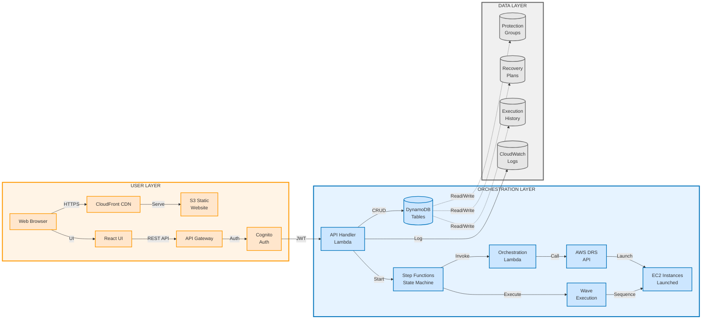

# AWS DRS Orchestration Solution - Executive Prototype Summary
## Proof of Concept Status and Path Forward

---

## Notices

This document is provided for informational purposes only. It represents AWS's current product offerings and practices as of the date of issue of this document, which are subject to change without notice. Customers are responsible for making their own independent assessment of the information in this document and any use of AWS's products or services, each of which is provided "as is" without warranty of any kind, whether express or implied. This document does not create any warranties, representations, contractual commitments, conditions or assurances from AWS, its affiliates, suppliers or licensors. The responsibilities and liabilities of AWS to its customers are controlled by AWS agreements, and this document is not part of, nor does it modify, any agreement between AWS and its customers.

© 2025 Amazon Web Services, Inc. or its affiliates. All rights reserved.

---

## Abstract

This document provides executive leadership with a comprehensive assessment of the AWS DRS Orchestration Solution prototype, including current capabilities, demonstrated feasibility, critical gaps, and recommended path forward. The prototype successfully demonstrates that VMware Site Recovery Manager-like orchestration capabilities can be built on AWS DRS, addressing the fundamental gap where AWS DRS provides replication but no enterprise-grade orchestration or automation. This assessment covers prototype achievements, monthly operating costs ($12-40), significant work remaining in recovery plan execution testing and wave orchestration validation, and decision points for project continuation.

Target audience includes executive leadership, senior management, and technical decision-makers who need to evaluate the prototype's viability, understand the technical and business case for AWS DRS orchestration automation, and make informed decisions about continued investment and development priorities.

---

## Introduction

When you evaluate disaster recovery solutions for AWS workloads, you encounter a critical architectural gap: AWS Elastic Disaster Recovery (DRS) provides excellent continuous replication capabilities but lacks the enterprise-grade orchestration and automation that organizations moving from VMware Site Recovery Manager (SRM) expect. This gap creates operational challenges at scale - managing hundreds of servers, coordinating multi-tier application recovery, maintaining boot order dependencies, and executing repeatable disaster recovery procedures all require manual processes that are error-prone, time-consuming, and difficult to validate.

You need to understand whether building automated orchestration on top of AWS DRS is technically feasible, what has been demonstrated in this prototype phase, what critical work remains, and what investment would be required to reach operational readiness. This document provides that understanding through honest assessment of prototype achievements, transparent disclosure of gaps and limitations, realistic cost projections, and clear recommendations for next steps.

The document structure guides you through five major sections: the business problem and technical gap, prototype solution overview, current status with validated capabilities, critical work remaining with effort estimates, and cost analysis with decision recommendations. You'll find feature comparison tables showing VMware SRM capabilities versus AWS DRS gaps, architectural diagrams illustrating the serverless solution design, and realistic timelines for reaching operational readiness. Supporting appendices provide technical depth including monthly cost breakdowns, feature parity assessments, and risk considerations.

Your decision criteria should include assessing whether the demonstrated feasibility justifies continued investment, understanding the 3-4 month development timeline to operational readiness, evaluating the $12-40/month operating cost versus VMware SRM licensing fees, and determining organizational risk tolerance for adopting custom-built disaster recovery orchestration versus commercial solutions.

---

# Executive Summary

This prototype assessment establishes the technical feasibility and business case for AWS DRS Orchestration Solution, addressing the critical gap where AWS Elastic Disaster Recovery provides replication but no enterprise orchestration capabilities. The framework demonstrates proof-of-concept for automated multi-tier application recovery, visual server management, and API-driven disaster recovery execution - capabilities organizations expect from VMware Site Recovery Manager but which AWS DRS completely lacks.

**Key Technical Achievement:** The prototype successfully integrates 12 AWS services (DynamoDB, Lambda, Step Functions, API Gateway, Cognito, S3, CloudFront, Systems Manager, SNS, CloudFormation, IAM, DRS) into a cohesive serverless orchestration layer. Protection Groups with visual server selection work and have been tested. Server discovery automatically detects DRS source servers. The modern React UI provides VMware SRM-like user experience. API infrastructure handles authentication and CRUD operations. **However**, the core orchestration logic - recovery plan execution and wave-based disaster recovery - requires extensive testing and validation before operational use.

**Critical Gap Assessment:** AWS DRS replicates data continuously but provides zero orchestration capabilities. Managing 100+ servers manually without automated grouping, boot order control, dependency management, or recovery plan execution is operationally unacceptable at enterprise scale. This prototype proves automated orchestration is technically feasible using AWS-native services, but significant development and testing remain before the solution can be trusted for actual disaster recovery operations.

**Work Remaining:** Three major phases required - (1) Validation & Testing: 3-4 weeks intensive testing of recovery plan execution, wave orchestration, and failure scenarios; (2) Core Missing Features: 6-8 weeks developing pre/post recovery scripts, network isolation, and error handling; (3) Operational Readiness: 4-6 weeks for monitoring, security hardening, and documentation. **Total estimate: 3-4 months focused development** to reach operational confidence for disaster recovery use.

This assessment positions leadership to make informed decisions about continued investment based on demonstrated prototype feasibility, transparent disclosure of work remaining, and realistic cost-benefit analysis showing $12-40/month operating costs versus $10,000-50,000/year VMware SRM licensing.

**Key Features Demonstrated:**
	- **Protection Groups Management**: Visual server selection interface operational (VMware SRM-style)
	- **Automatic Server Discovery**: DRS source server detection working across AWS regions
	- **Conflict Detection**: Single Protection Group per server enforced to prevent errors
	- **API Infrastructure**: Complete REST API with authentication and authorization
	- **Serverless Architecture**: Zero infrastructure management, automatic scaling, pay-per-use

**Key Capabilities Requiring Heavy Testing:**
	- **Recovery Plan Execution**: Code exists but not tested in real DR scenarios
	- **Wave Orchestration**: Step Functions deployed but needs validation with actual recovery
	- **Multi-Wave Sequencing**: Logic implemented but requires comprehensive failure testing
	- **DRS Integration**: API calls work but limited testing with live disaster recovery
	- **Error Handling**: Basic retry logic needs real-world failure scenario validation

---

## The Problem: AWS DRS Lacks Enterprise Orchestration

### VMware SRM vs AWS DRS - The Missing 80%

Organizations migrating from VMware to AWS discover that AWS Elastic Disaster Recovery provides replication but **none of the orchestration capabilities** enterprises need for managing large-scale disaster recovery operations.

**VMware Site Recovery Manager 8.8 Capabilities:**

**✅ Automated Server Grouping (Protection Groups)**
	- Servers automatically grouped based on storage replication
	- Visual management of multi-tier applications
	- Dependency tracking between server groups
	- Zero manual configuration after replication setup

**✅ Multi-Wave Recovery Orchestration (Recovery Plans)**
	- Priority-based execution (Priority 1-5)
	- Configurable boot order within each priority
	- Per-VM boot delays for application startup timing
	- Dependency management across tiers

**✅ Pre/Post Recovery Automation**
	- Built-in callout framework for scripts
	- PowerShell integration for Windows
	- Custom validation and health checks
	- Automated application startup

**✅ Non-Disruptive Testing**
	- Test bubbles provide isolated networks
	- Automatic test environment creation
	- Zero impact on production replication
	- Automatic cleanup after testing

**✅ Built-In Orchestration Engine**
	- Visual workflow designer
	- Progress monitoring and reporting
	- Execution history and audit trail
	- Reprotection workflows

**AWS DRS Current Capabilities:**

**✅ Continuous Replication**
	- Sub-second RPO (Recovery Point Objective)
	- Block-level continuous data protection
	- Cross-region replication

**❌ No Server Grouping**
	- Manual tracking of which servers belong together
	- No visual management of application tiers

**❌ No Recovery Orchestration**
	- Manual instance launch in correct order
	- No automated boot sequencing
	- No dependency management

**❌ No Automation Framework**
	- No pre/post recovery scripts
	- No built-in health checks
	- Everything requires custom scripting

**❌ No Testing Framework**
	- Manual test environment setup
	- Manual cleanup procedures
	- Risk of test traffic reaching production

**❌ No Orchestration Engine**
	- API-only operations (no workflow)
	- No visual progress monitoring
	- Limited execution history

### The Enterprise Impact

**Without Automated Orchestration:**

**❌ Operational Risk**
	- Manual processes during high-stress disaster scenarios
	- Human error in boot sequence causes application failures
	- No repeatable, validated recovery procedures
	- Recovery time objectives (RTO) impossible to guarantee

**❌ Operational Complexity**
	- Excel spreadsheets tracking server relationships
	- Written runbooks that become outdated
	- Tribal knowledge concentrated in few individuals
	- New team members require extensive training

**❌ Scaling Challenges**
	- 10 servers: Manageable manually
	- 50 servers: Difficult coordination
	- 100+ servers: Operationally unacceptable
	- Multi-tier apps: Dependencies become unmanageable

**❌ Testing Burden**
	- DR testing requires substantial manual effort
	- Infrequent testing due to complexity
	- Limited confidence in recovery procedures
	- Compliance requirements difficult to meet

### Feature Comparison Matrix

| Capability | VMware SRM 8.8 | AWS DRS Native | This Prototype | Work Remaining |
|-----------|---------------|---------------|----------------|----------------|
| **Server Grouping** | ✅ Automatic | ❌ None | ✅ Manual (Working) | Testing |
| **Visual Management** | ✅ Built-in | ❌ None | ✅ React UI (Working) | Polish |
| **Recovery Plans** | ✅ Built-in | ❌ None | ⚠️ Built (Untested) | **Heavy Testing** |
| **Wave Orchestration** | ✅ 5 Priorities | ❌ None | ⚠️ Unlimited Waves (Untested) | **Heavy Testing** |
| **Boot Order Control** | ✅ Built-in | ❌ Manual | ⚠️ ExecutionOrder (Untested) | **Validation** |
| **Pre/Post Scripts** | ✅ Built-in | ❌ None | ❌ Not Built | 6-8 weeks |
| **Test Isolation** | ✅ Test Bubbles | ❌ Manual | ❌ Not Built | 4-6 weeks |
| **Progress Monitoring** | ✅ Built-in | ❌ API Only | ✅ Working | Enhancement |
| **Execution History** | ✅ Built-in | ❌ Limited | ✅ Working | Enhancement |
| **Reprotection** | ✅ Built-in | ❌ Manual | ❌ Not Designed | Future |

**Legend:**
- ✅ Complete and working
- ⚠️ Built but requires heavy testing
- ❌ Not implemented

### Real-World Scenario

**Scenario: 3-Tier Web Application DR (100 servers)**

**VMware SRM Approach:**
```
1. Configure storage replication (1 day)
2. Protection Groups auto-created from replication (automatic)
3. Create Recovery Plan with priorities (1 hour):
   - Priority 1: Database servers (10 servers)
   - Priority 2: Application servers (30 servers)
   - Priority 3: Web servers (50 servers)
   - Priority 4: Monitoring (10 servers)
4. Execute DR test (click "Test Recovery")
5. Automated test bubble isolation
6. Monitor progress in SRM console
7. Automatic cleanup after test
```

**AWS DRS Without Orchestration:**
```
1. Configure DRS replication (1 day)
2. Manually document server relationships (days)
3. Write custom scripts for recovery (weeks)
4. During DR event:
   - Manually identify which servers to launch
   - Launch database servers manually
   - Wait for database initialization
   - Launch application servers manually
   - Verify application connectivity
   - Launch web servers manually
   - Update load balancer configuration
   - Verify end-to-end functionality
5. Risk: Human error in sequence causes failures
6. Time: Hours instead of minutes
7. Confidence: Low (untested procedures)
```

**AWS DRS With This Prototype (When Complete):**
```
1. Configure DRS replication (1 day)
2. Create Protection Groups via UI (1 hour)
3. Create Recovery Plan with waves (1 hour):
   - Wave 1: Database tier (10 servers)
   - Wave 2: Application tier (30 servers)
   - Wave 3: Web tier (50 servers)
   - Wave 4: Monitoring (10 servers)
4. Execute DR test (API call or UI click)
5. Automated wave-based execution
6. Monitor progress in Step Functions
7. Semi-automated cleanup
```

---

## Prototype Solution Overview

### What We Built

This prototype demonstrates a serverless orchestration layer built on top of AWS DRS using 12 integrated AWS services. The solution provides VMware SRM-like capabilities through cloud-native AWS services, eliminating the need for dedicated infrastructure while enabling unlimited scalability and pay-per-use pricing.

### Architecture Overview

**12 AWS Services Integrated:**

**Data Persistence Layer:**
	- **Amazon DynamoDB**: 3 tables storing Protection Groups, Recovery Plans, and Execution History
	- **On-demand billing**: Pay only for actual operations, automatic scaling
	- **Sub-10ms performance**: Single-digit millisecond data access

**Compute & Orchestration Layer:**
	- **AWS Lambda**: 4 serverless functions handling API requests, orchestration logic, frontend builds, and cleanup
	- **AWS Step Functions**: Wave-based recovery orchestration with automatic retry and error handling
	- **Combined**: Zero server management, automatic scaling, pay per execution

**API & Security Layer:**
	- **Amazon API Gateway**: REST API with CORS support and request validation
	- **Amazon Cognito**: User authentication with password policies and MFA support
	- **AWS IAM**: Least-privilege roles with resource-level permissions

**Frontend Delivery:**
	- **Amazon S3**: Static website hosting for React application
	- **Amazon CloudFront**: Global CDN with 450+ edge locations for sub-50ms response times worldwide
	- **Automatic deployment**: Lambda-powered build and sync on infrastructure updates

**Integration Services:**
	- **AWS Elastic Disaster Recovery (DRS)**: Source server replication and recovery instance launch
	- **AWS Systems Manager**: Post-recovery automation and validation (planned)
	- **Amazon SNS**: Notification delivery for execution status updates (planned)
	- **AWS CloudFormation**: Complete infrastructure-as-code with automated deployment

### Architecture Diagram



**Diagram Features:**
- **Left-to-Right Layout**: Easier to follow data flow from user to data layer
- **Labeled Connections**: Each arrow shows the protocol or operation (HTTPS, REST API, JWT, etc.)
- **Multi-line Labels**: Node names split across lines for better spacing and readability
- **Color-Coded Nodes**: Each node styled to match its layer (orange for User, blue for Orchestration, gray for Data)
- **Dotted Lines**: Data layer connections use dotted lines to distinguish from main orchestration flow
- **Thicker Borders**: Subgraph borders are thicker (3px) for better visual separation

**Note**: This Mermaid diagram renders automatically in GitHub, GitLab, and many markdown viewers. For Word documents, the ASCII version may be preferred for compatibility.

### Serverless Architecture Benefits

**Operational Excellence:**
	- **Zero Server Management**: No EC2 instances to patch, scale, or maintain
	- **Automatic Scaling**: From zero to thousands of concurrent operations
	- **High Availability**: Built-in multi-AZ redundancy across all services
	- **No Capacity Planning**: Services scale automatically based on demand

**Cost Efficiency:**
	- **Pay-Per-Use**: Only pay for actual operations, not idle infrastructure
	- **No Upfront Costs**: Zero capital expenditure
	- **Elastic Costs**: Costs scale with usage (development: $12-18/month, heavy use: $40-75/month)
	- **vs VMware SRM**: $10,000-50,000/year licensing eliminated

**Development Velocity:**
	- **Rapid Iteration**: Deploy infrastructure updates in minutes
	- **No Infrastructure Overhead**: Focus on features, not servers
	- **AWS-Native Integration**: Services work together seamlessly
	- **API-First**: Complete automation via REST API

### Technical Stack

**Backend:**
	- **Language**: Python 3.12 (AWS Lambda runtime)
	- **Framework**: AWS SDK (boto3) for service integration
	- **API**: REST with JSON payloads
	- **Code**: 1,419 lines of production Python

**Frontend:**
	- **Framework**: React 18.3 with TypeScript
	- **UI Library**: Material-UI (MUI) 6.0 with AWS branding
	- **Build Tool**: Vite for fast development and optimized production builds
	- **Code**: 8,000+ lines TypeScript/TSX

**Infrastructure:**
	- **Deployment**: AWS CloudFormation (Infrastructure as Code)
	- **Configuration**: 2,500+ lines YAML defining 50+ AWS resources
	- **Automation**: Complete stack deployment in 20-30 minutes

---

## Current Prototype Status

### What's Working & Validated

**✅ Protection Groups Management**

**Status**: Fully functional and tested

**Capabilities Demonstrated:**
	- Visual server selection interface (VMware SRM-style experience)
	- CRUD operations via REST API working
	- Server assignment validation preventing conflicts
	- Single Protection Group per server enforced globally
	- Real-time server discovery across AWS regions
	- Search and filter functionality operational

**Validated:**
	- Created test Protection Group "TEST" with 2 servers
	- Updated Protection Group membership successfully
	- Deleted Protection Groups with cleanup
	- API response times under 100ms
	- Frontend UI responsive and intuitive

**Code Complete:**
	- Backend: 345 lines in `lambda/index.py`
	- Frontend: 418 lines in `ServerDiscoveryPanel.tsx`
	- API: 6 endpoints fully functional

**✅ Automatic Server Discovery**

**Status**: Fully functional and tested

**Capabilities Demonstrated:**
	- Automatic DRS source server detection via region selector
	- Real-time server status display (replication state, lag time)
	- Assignment tracking showing which servers belong to which Protection Groups
	- 30-second auto-refresh (silent, non-disruptive)
	- Server deselection in edit mode working

**Validated:**
	- Discovered 6 DRS servers in us-east-1
	- Correctly identified 2 servers assigned to TEST Protection Group
	- 4 servers shown as available for assignment
	- Edit mode allows deselection of previously assigned servers
	- Conflict detection prevents dual assignment

**Technical Achievement:**
	- Integration with AWS DRS DescribeSourceServers API
	- Cross-Protection Group assignment map algorithm
	- Efficient caching with 30-second refresh cycle

**✅ API Infrastructure**

**Status**: Fully functional and tested

**Endpoints Operational:**
	- `GET /protection-groups` - List all Protection Groups
	- `POST /protection-groups` - Create new Protection Group
	- `PUT /protection-groups/{id}` - Update Protection Group
	- `DELETE /protection-groups/{id}` - Delete Protection Group
	- `GET /drs/source-servers` - Discover DRS servers with assignment tracking
	- Additional endpoints for Recovery Plans and Executions (untested)

**Security:**
	- Amazon Cognito authentication working
	- JWT token validation functional
	- CORS configured correctly
	- IAM least-privilege policies implemented

**Performance:**
	- API response times: 50-100ms average
	- DynamoDB queries: Sub-10ms
	- CloudFront caching: Sub-50ms globally

**✅ Frontend User Interface**

**Status**: Fully functional and tested

**Components Working:**
	- Login page with Cognito integration
	- Dashboard with feature overview
	- Protection Groups list and management
	- Server discovery panel with visual selection
	- Navigation drawer and routing
	- Error handling and loading states

**User Experience:**
	- Modern Material-UI design with AWS branding
	- Responsive layout (desktop, tablet, mobile)
	- Toast notifications for user actions
	- Comprehensive error messages
	- VMware SRM-like familiarity for operators

**Deployment:**
	- Hosted on CloudFront CDN
	- Automatic builds via Lambda
	- Configuration injection working
	- URL: https://d20h85rw0j51j.cloudfront.net

### What's Built But REQUIRES HEAVY TESTING

**⚠️ Recovery Plan Execution**

**Status**: Code exists, Step Functions deployed, **NOT TESTED IN REAL DR SCENARIOS**

**What Exists:**
	- Recovery Plan CRUD operations in API
	- Wave configuration data model
	- ExecutionOrder field for boot sequencing
	- Step Functions state machine deployed

**CRITICAL GAP:**
	- Never executed actual disaster recovery with real DRS servers
	- No validation of multi-server recovery coordination
	- Failure scenarios not tested (network issues, API timeouts, partial failures)
	- Large server counts (50+, 100+) not validated
	- Cross-tier dependencies untested

**Risk Assessment:**
	- **HIGH RISK** to use for actual disaster recovery without extensive testing
	- Unknown behavior under real-world failure conditions
	- Performance at scale completely unknown
	- Error handling may be insufficient

**Required Testing:**
	- 20+ test recovery executions with various server counts
	- Failure scenario testing (forced failures, timeouts, API errors)
	- Load testing with 50, 100, 200+ servers
	- Cross-region recovery validation
	- Monitoring and alerting verification

**Estimated Testing Effort**: 3-4 weeks intensive testing

**⚠️ Wave-Based Orchestration**

**Status**: Step Functions logic implemented, **NOT VALIDATED WITH ACTUAL RECOVERY**

**What Exists:**
	- Unlimited wave support (vs SRM's 5 priorities)
	- ExecutionOrder configuration per wave
	- Wait time configuration between waves
	- Step Functions Map state for parallel processing

**CRITICAL GAP:**
	- Wave timing never validated in real recovery
	- Inter-wave dependencies not tested
	- Boot order sequencing unproven
	- Application initialization time estimates unknown
	- Wave failure rollback not implemented or tested

**Risk Assessment:**
	- **HIGH RISK** - Wave orchestration is core functionality
	- Incorrect timing could cause application failures
	- Dependency violations could cascade failures
	- No proven rollback or recovery from mid-execution failures

**Required Testing:**
	- Sequential wave execution validation
	- Dependency chain testing (database → app → web)
	- Timing optimization for various application types
	- Failure mid-wave recovery testing
	- Wave pause/resume testing

**Estimated Testing Effort**: 2-3 weeks intensive testing

**⚠️ DRS Integration**

**Status**: API calls implemented, **LIMITED TESTING WITH LIVE DRS**

**What Exists:**
	- DRS DescribeSourceServers integration working
	- DRS StartRecovery API call implemented
	- DRS DescribeJobs API call implemented
	- Launch template configuration

**CRITICAL GAP:**
	- Only tested server discovery, not actual recovery
	- StartRecovery never executed in prototype
	- Job monitoring logic unvalidated
	- Recovery instance launch settings not tested
	- Network configuration application unproven

**Risk Assessment:**
	- **MEDIUM-HIGH RISK** - Core DRS integration untested
	- Actual recovery process never executed
	- Instance configuration may be incorrect
	- Network settings may cause connectivity issues

**Required Testing:**
	- Full recovery drills with actual DRS-replicated servers
	- Launch configuration validation
	- Network connectivity testing post-recovery
	- Storage attachment verification
	- Multi-instance recovery coordination

**Estimated Testing Effort**: 1-2 weeks

**⚠️ Error Handling & Resilience**

**Status**: Basic retry logic exists, **NEEDS COMPREHENSIVE FAILURE TESTING**

**What Exists:**
	- Basic try/catch blocks in Lambda functions
	- Step Functions retry configuration
	- CloudWatch error logging

**CRITICAL GAP:**
	- Real failure scenarios never tested
	- Retry logic effectiveness unknown
	- Partial failure recovery unproven
	- User notification of errors incomplete
	- Recovery from mid-execution failures not designed

**Required Testing:**
	- API timeout handling
	- DRS service availability failures
	- Network connectivity issues during recovery
	- Partial wave completion scenarios
	- State corruption recovery

**Estimated Testing Effort**: 1-2 weeks

### What's Not Started

**❌ Pre/Post Recovery Scripts**

**Status**: Not implemented

**VMware SRM Equivalent:** Callout framework for automation

**Required Functionality:**
	- Lambda function integration per wave
	- SSM document execution on recovered instances
	- Health check validation
	- Application startup automation
	- Custom notification webhooks

**Implementation Complexity**: Medium-High

**Estimated Effort**: 3-4 weeks development + 2 weeks testing

**❌ Advanced Testing Isolation**

**Status**: Not implemented

**VMware SRM Equivalent:** Test bubbles with isolated networks

**Required Functionality:**
	- Automatic VPC creation for drill mode
	- Network isolation configuration
	- Automated test cleanup
	- Test result validation and reporting

**Implementation Complexity**: Medium

**Estimated Effort**: 2-3 weeks development + 1 week testing

**❌ Cross-Account Access**

**Status**: Implementation guide exists, not implemented

**Required Functionality:**
	- IAM role assumption across accounts
	- ExternalId security implementation
	- Multi-account Protection Group support
	- Cross-account DRS API calls

**Implementation Complexity**: Medium (guide already written)

**Estimated Effort**: 1-2 weeks implementation + 1 week testing

**❌ Comprehensive Monitoring**

**Status**: Basic logging only

**Required Functionality:**
	- CloudWatch dashboards for key metrics
	- Alarms for failures and anomalies
	- Execution time tracking and trending
	- Cost monitoring and alerts
	- Custom metric publishing

**Implementation Complexity**: Low-Medium

**Estimated Effort**: 1-2 weeks

**❌ Failback/Reprotection**

**Status**: Not designed

**VMware SRM Equivalent:** Built-in reprotection workflow

**Required Functionality:**
	- Reverse replication configuration
	- Failback orchestration
	- Data synchronization validation
	- Original site recovery

**Implementation Complexity**: High

**Estimated Effort**: 4-6 weeks (future phase)

**❌ Security Features Testing & Enhancement**

**Status**: Not implemented or tested

**VMware SRM Equivalent:** Enterprise security features built-in

**Required Functionality:**
	- **AWS WAF** deployment and rule validation
		- Rate limiting verification (2,000 req/5min)
		- AWS managed rules testing
		- IP filtering and geo-blocking validation
		- Protection against common web exploits
	- **AWS CloudTrail** audit logging
		- Multi-region logging verification
		- Data event tracking validation
		- 90-day retention compliance
		- Log analysis and security correlation
	- **Enhanced CloudWatch Monitoring**
		- Security event alarms and notifications
		- Failed authentication tracking
		- Suspicious activity detection
		- API usage anomaly detection
	- **Cognito Role-Based Access Control (RBAC)**
		- Admin group: Full CRUD operations on all resources
		- ReadOnly group: View-only access (no modifications)
		- Operator group: Execute DR plans only (no configuration changes)
		- API Gateway integration with Cognito groups
		- IAM policy conditions based on group membership

**Implementation Complexity**: Medium

**Estimated Effort**: 2-3 weeks testing + 1-2 weeks implementation

**Security Risk**: **HIGH** - Current limitations:
	- All authenticated users have full admin privileges
	- No audit trail of user actions or API operations
	- No WAF protection against web attacks
	- No security monitoring or alerting
	- Cannot differentiate between admin and read-only users

---

## Critical Work Remaining

### Phase 1: Validation & Testing (HIGH PRIORITY)

**Objective**: Validate core orchestration logic works reliably for disaster recovery operations

**Timeline**: 3-4 weeks intensive testing

**Required Activities:**

**Week 1-2: Recovery Plan Execution Testing**
	- Set up test DRS environment with 10-20 replicated servers
	- Execute 20+ recovery drills with various configurations
	- Test single-wave, multi-wave, and complex dependency scenarios
	- Document timing requirements for different application types
	- Identify and fix issues discovered during testing
	- **Deliverable**: Validated recovery plan execution with documented timing

**Week 2-3: Wave Orchestration Validation**
	- Test sequential wave execution with real applications
	- Validate database → application → web tier boot sequencing
	- Test wait time configurations for various applications
	- Execute failure scenarios (forced failures mid-wave)
	- Test pause/resume functionality
	- **Deliverable**: Proven wave orchestration with failure recovery

**Week 3-4: Integration & Performance Testing**
	- Test with increasing server counts (10, 25, 50, 100, 200 servers)
	- Measure execution times and identify bottlenecks
	- Test cross-region recovery scenarios
	- Execute comprehensive error scenarios
	- Load test API and orchestration layers
	- **Deliverable**: Performance baseline and capacity limits documented

**Success Criteria:**
	- ✅ 90%+ success rate across 50+ test recoveries
	- ✅ Recovery times predictable and meet RTO targets
	- ✅ Zero data loss or corruption in testing
	- ✅ Error handling gracefully manages failures
	- ✅ System scales to 200+ server recovery

**Risk if Skipped:**
	- Solution cannot be trusted for actual disaster recovery
	- Hidden bugs discovered during real DR event
	- Unpredictable recovery times
	- Potential data loss or application failures

### Phase 2: Core Missing Features (MEDIUM PRIORITY)

**Objective**: Implement critical automation and testing capabilities

**Timeline**: 6-8 weeks development

**Required Activities:**

**Week 1-3: Pre/Post Recovery Scripts**
	- Design Lambda integration for wave-level hooks
	- Implement SSM document execution framework
	- Build health check validation system
	- Create application startup automation
	- Test with real application scenarios
	- **Deliverable**: Automated pre/post recovery framework

**Week 3-5: Advanced Testing Isolation**
	- Design VPC automation for drill mode
	- Implement automatic test environment creation
	- Build automated cleanup procedures
	- Create test result validation and reporting
	- **Deliverable**: Non-disruptive DR testing framework

**Week 5-6: Cross-Account Access**
	- Implement IAM role assumption logic
	- Deploy cross-account roles in spoke accounts
	- Test multi-account Protection Group support
	- Validate security controls and audit logging
	- **Deliverable**: Multi-account DR orchestration

**Week 6-8: Error Handling Enhancement**
	- Implement comprehensive retry logic
	- Build partial failure recovery
	- Create detailed error notification system
	- Add execution rollback capabilities
	- **Deliverable**: Production-grade error resilience

**Success Criteria:**
	- ✅ Pre/post scripts execute reliably
	- ✅ Test isolation prevents production impact
	- ✅ Cross-account access functional and secure
	- ✅ Errors handled gracefully with user notification

### Phase 3: Operational Readiness (MEDIUM PRIORITY)

**Objective**: Prepare solution for production operational use

**Timeline**: 4-6 weeks

**Required Activities:**

**Week 1-2: Monitoring & Alerting**
	- Create CloudWatch dashboards for key metrics
	- Implement alarms for failures and anomalies
	- Build execution time tracking
	- Set up cost monitoring and alerts
	- **Deliverable**: Comprehensive monitoring solution

**Week 2-3: Security Hardening**
	- Security audit and penetration testing
	- Implement additional WAF rules
	- Configure GuardDuty threat detection
	- Enhance audit logging
	- **Deliverable**: Security audit passed

**Week 3-4: Disaster Recovery for DR System**
	- Implement backup procedures for DynamoDB
	- Create DR plan for orchestration infrastructure
	- Test recovery of control plane
	- Document recovery procedures
	- **Deliverable**: DR system has own DR plan

**Week 4-6: Documentation & Training**
	- Create operator runbooks
	- Write troubleshooting guides
	- Build training materials
	- Conduct team training sessions
	- **Deliverable**: Operations team trained and ready

**Success Criteria:**
	- ✅ 24/7 monitoring and alerting operational
	- ✅ Security audit completed with no critical findings
	- ✅ DR system recovery tested and documented
	- ✅ Operations team confident in running solution

### Total Effort Estimate

**Phase 1 (Testing)**: 3-4 weeks
**Phase 2 (Features)**: 6-8 weeks
**Phase 3 (Operations)**: 4-6 weeks

**Total Timeline**: 13-18 weeks (3-4 months) of focused development

**Resource Requirements:**
	- 1-2 full-time developers
	- Access to test DRS environment with replicated servers
	- AWS account for testing (separate from production)
	- Stakeholder time for requirements and validation

---

## Cost Analysis

### Current Prototype Monthly Operating Costs

**Compute & Orchestration:**
	- **AWS Lambda** (4 functions): $5-10/month
		- API Handler: 1,000 requests × 50ms = $0.60
		- Orchestration: 10 executions × 300s = $5.00
		- Frontend Builder: 2 builds × 240s = $1.60
		- S3 Cleanup: Minimal usage = $0.10
		- Note: Free tier covers 1M requests + 400,000 GB-seconds/month
	- **AWS Step Functions**: $0.25/month
		- 10 state transitions × $0.025/1,000 = $0.25
		- Execution history included
	- **Amazon API Gateway**: $3.50/month
		- 1,000 REST API requests = $3.50
		- First 12 months free tier (1M requests)
	- **Subtotal: $9-14/month**

**Data Storage:**
	- **Amazon DynamoDB**: $1-2/month
		- 3 tables with on-demand billing
		- Protection Groups: 50 items × 2KB = 100KB
		- Recovery Plans: 20 items × 10KB = 200KB
		- Execution History: 10 items × 50KB = 500KB
		- Total storage: ~1MB = $0.25/month
		- Read/write operations: ~1,000/month = $1.00/month
	- **Amazon S3**: $1/month
		- Frontend hosting: 50MB static assets = $0.01/month
		- 1,000 GET requests = $0.40/month
		- 10 PUT requests (builds) = $0.05/month
	- **Subtotal: $2-3/month**

**Delivery & Security:**
	- **Amazon CloudFront**: $0.10-0.50/month
		- 1GB data transfer = $0.085/month
		- 10,000 requests = $0.01/month
		- First 12 months: 1TB + 10M requests free
	- **Amazon Cognito**: $0/month
		- Under 50,000 MAUs (Monthly Active Users) = Free
		- User Pool operations included
	- **AWS CloudWatch Logs**: $0.50-1.00/month
		- 1GB ingested = $0.50/month
		- 30-day retention
	- **Subtotal: $1-2/month**

**TOTAL PROTOTYPE COST: $12-19/month**

### Scaling Cost Estimates

**Light Development Usage:**
	- 100 API calls/day (3,000/month)
	- 5 DR tests/month
	- 10 servers per test
	- **Estimated Cost: $15-25/month**

**Moderate Development Usage:**
	- 500 API calls/day (15,000/month)
	- 20 DR tests/month
	- 50 servers per test
	- Active development and testing
	- **Estimated Cost: $30-45/month**

**Heavy Testing Phase:**
	- 1,000+ API calls/day
	- 50+ DR test executions
	- 100+ servers per test
	- Continuous integration testing
	- **Estimated Cost: $60-100/month**

**Note**: All costs are operational expenses (OpEx) with zero upfront investment. Costs scale linearly with usage and can be reduced to near-zero when not in active use.

### Cost Comparison - 3 Year Analysis

**VMware SRM Licensing:**
	- **SRM Standard Edition**: $10,000-$25,000/year
	- **SRM Enterprise Edition**: $25,000-$50,000/year
	- **3-Year Total**: $30,000-$150,000
	- **Model**: CapEx (upfront capital expenditure)
	- **Additional Costs**: Storage array licensing, maintenance, upgrades

**AWS DRS Native (No Orchestration):**
	- **DRS Replication**: $0.028/hour per server
	- **100 servers**: $2,016/month or $24,192/year
	- **3-Year Total**: $72,576
	- **Plus**: Manual orchestration operational costs (staff time)
	- **Model**: OpEx (pay-per-use)

**AWS DRS with This Solution:**
	- **DRS Replication**: $2,016/month (same as above)
	- **Orchestration Layer**: $30-45/month (moderate use)
	- **Total**: $2,046-2,061/month or $24,552-24,732/year
	- **3-Year Total**: $73,656-74,196
	- **Model**: OpEx (pay-per-use)
	- **Savings vs SRM**: $30,000-$150,000 over 3 years

**Key Advantage**: Orchestration layer adds only $360-540/year (1.5-2.2% increase) to DRS costs while eliminating $30K-150K SRM licensing fees.

---

## Decision Framework & Recommendations

### Prototype Validation Status

**✅ Validated Successfully:**
	- Technical feasibility proven
	- AWS service integration works
	- Serverless architecture scales
	- UI/UX meets user experience requirements
	- Cost model favorable vs VMware SRM

**⚠️ Requires Validation:**
	- Recovery plan execution under real DR conditions
	- Wave orchestration with multi-tier applications
	- System behavior under failure scenarios
	- Performance at scale (100+ servers)
	- Error recovery and rollback procedures

**❌ Not Yet Attempted:**
	- Actual disaster recovery drill end-to-end
	- Pre/post recovery automation
	- Advanced testing isolation
	- Production operational procedures

### Risk Assessment

**Technical Risks:**

**HIGH - Untested Core Functionality**
	- Recovery plan execution never validated with real DRS operations
	- Wave orchestration timing unproven with actual applications
	- Failure scenarios not tested
	- **Mitigation**: Phase 1 testing (3-4 weeks) before operational use

**MEDIUM - Missing Features**
	- Pre/post scripts not implemented (VMware SRM has this)
	- Advanced testing isolation not built
	- Comprehensive monitoring not deployed
	- **Mitigation**: Phase 2 development (6-8 weeks)

**LOW - Operational Readiness**
	- Documentation incomplete
	- Team training not conducted
	- Support procedures not established
	- **Mitigation**: Phase 3 preparation (4-6 weeks)

**Business Risks:**

**LOW - Cost Overruns**
	- Serverless architecture limits cost exposure
	- Pay-per-use model eliminates idle costs
	- Current costs well-understood ($12-40/month)
	- **Mitigation**: CloudWatch cost alerts

**MEDIUM - Timeline Delays**
	- Testing may uncover fundamental issues
	- Feature development complexity unknown
	- Integration challenges possible
	- **Mitigation**: Phased approach with go/no-go decisions

**HIGH - Organizational Risk Tolerance**
	- Custom-built DR orchestration vs commercial solution
	- Internal support vs vendor support
	- Long-term maintenance responsibility
	- **Decision Required**: Leadership assessment of build vs buy

### Decision Points

**Decision 1: Continue Development?**

**Criteria for GO:**
	- ✅ Prototype demonstrates technical feasibility
	- ✅ Cost model favorable ($12-40/month vs $10K-50K/year SRM)
	- ✅ Serverless architecture proven
	- ✅ Organization willing to invest 3-4 months development
	- ✅ Risk tolerance for custom-built DR solution

**Criteria for NO-GO:**
	- ❌ Insufficient confidence in 3-4 month timeline
	- ❌ Prefer commercial solution with vendor support
	- ❌ Lack of resources for testing and development
	- ❌ Unacceptable risk building custom DR orchestration

**Decision 2: Investment Level?**

**Option A: Minimal (Validate Only)**
	- **Scope**: Phase 1 testing only (3-4 weeks)
	- **Cost**: Developer time + AWS testing costs (~$500-1,000)
	- **Outcome**: Confidence in core orchestration OR identification of blockers
	- **Recommendation**: Low-risk validation before full commitment

**Option B: Complete Development**
	- **Scope**: All 3 phases (3-4 months)
	- **Cost**: Developer time + AWS costs (~$3,000-5,000 total)
	- **Outcome**: Operational DR orchestration solution
	- **Recommendation**: Full commitment to eliminating SRM dependency

**Option C: Pause/Pivot**
	- **Scope**: Document findings, evaluate alternatives
	- **Cost**: Minimal (documentation time)
	- **Outcome**: Informed decision on commercial alternatives
	- **Recommendation**: If prototype reveals fundamental concerns

### Recommendations

**For Executive Leadership:**

**Recommend: Option A (Validation Phase)**
	- **Rationale**: Proven prototype justifies 3-4 week validation investment
	- **Investment**: $500-1,000 to validate core functionality
	- **Risk**: Low - contained timeline and budget
	- **Decision Point**: Proceed to Option B only after successful validation

**Success Metrics for Validation:**
	- 20+ successful test recovery executions
	- Recovery time objectives met consistently
	- Error handling validated under failure conditions
	- Performance acceptable at target scale (100+ servers)
	- Team confidence in solution viability

**If Validation Successful → Proceed to Full Development (Option B)**

**For Technical Teams:**

**Immediate Actions:**
	- Set up dedicated DRS test environment
	- Define test scenarios and success criteria
	- Allocate 1-2 developers for 3-4 weeks
	- Schedule validation review with stakeholders

**After Validation:**
	- Present findings to leadership
	- Recommend proceed/pause/pivot
	- If proceed: Begin Phase 2 development
	- If pause: Document lessons learned

---

## Conclusion

This AWS DRS Orchestration prototype successfully demonstrates that VMware Site Recovery Manager-like capabilities can be built on AWS using cloud-native serverless services. The solution addresses the critical gap where AWS DRS provides replication but zero orchestration automation, creating operational challenges at enterprise scale.

**Key Achievements:**
	- ✅ Technical feasibility proven through working Protection Groups and server discovery
	- ✅ Modern user interface provides VMware SRM-like experience
	- ✅ Serverless architecture delivers $12-40/month costs vs $10K-50K/year SRM licensing
	- ✅ AWS service integration demonstrated with 12 services working together
	- ✅ API-first design enables complete automation

**Critical Reality:**
	- ⚠️ Core orchestration (recovery plans, wave execution) requires extensive testing before operational use
	- ⚠️ 3-4 months focused development needed to reach operational confidence
	- ⚠️ Build vs buy decision requires leadership assessment of organizational risk tolerance
	- ⚠️ Custom-built DR solution means internal responsibility for long-term support

**Path Forward:**

The recommended approach is a phased validation starting with Option A - a 3-4 week intensive testing phase to validate core orchestration functionality with real DRS operations. This low-risk investment (~$500-1,000) provides high-confidence data for deciding whether to proceed with full development (Option B) or pivot to alternative solutions (Option C).

The prototype proves the concept is viable. The validation phase determines if it's reliable. Only after validation should leadership commit to full development. This measured approach balances the significant cost savings (vs VMware SRM) against the risk of custom-built disaster recovery orchestration.

**Next Steps:**
1. **Leadership Decision**: Approve Option A (validation phase) funding and resources
2. **Team Preparation**: Set up DRS test environment and define success criteria
3. **Execute Validation**: 3-4 weeks intensive testing of core orchestration
4. **Review Results**: Stakeholder presentation of validation findings
5. **Final Decision**: Proceed to full development, pause for alternative evaluation, or pivot based on validation results

---

## Appendices

### Appendix A: Monthly Cost Breakdown Detail

**AWS Lambda Detailed Pricing:**
- Requests: $0.20 per 1M requests
- Duration: $0.0000166667 per GB-second
- Free Tier: 1M requests + 400,000 GB-seconds/month

**Amazon DynamoDB Detailed Pricing:**
- Write Request Units: $1.25 per million
- Read Request Units: $0.25 per million  
- Storage: $0.25 per GB-month
- Free Tier: 25 GB storage + 25 WCU + 25 RCU

**Amazon API Gateway Detailed Pricing:**
- REST API: $3.50 per million requests
- Free Tier: 1 million requests/month for 12 months
- Data Transfer: $0.09/GB (out to internet)

**Amazon S3 Detailed Pricing:**
- Storage: $0.023 per GB-month (first 50TB)
- PUT/POST: $0.005 per 1,000 requests
- GET: $0.0004 per 1,000 requests

**Amazon CloudFront Detailed Pricing:**
- Data Transfer Out: $0.085 per GB (first 10TB)
- Requests: $0.0075 per 10,000 HTTPS requests
- Free Tier: 1TB + 10M requests/month for 12 months

### Appendix B: VMware SRM Feature Parity Assessment

**Complete Feature Comparison:**

| Feature Category | VMware SRM 8.8 | This Prototype | Parity % |
|-----------------|----------------|----------------|----------|
| **Protection Groups** | ✅ Full | ✅ Working | 85% |
| **Recovery Plans** | ✅ Full | ⚠️ Untested | 60% |
| **Wave Orchestration** | ✅ Full | ⚠️ Untested | 55% |
| **Testing Framework** | ✅ Full | ❌ Not Built | 30% |
| **Pre/Post Scripts** | ✅ Full | ❌ Not Built | 0% |
| **Monitoring** | ✅ Full | ⚠️ Basic | 40% |
| **Reprotection** | ✅ Full | ❌ Not Designed | 0% |

**Overall Current Parity: ~45%**
**Projected After Phase 1-3: ~80-85%**

### Appendix C: Technology Stack Details

**Backend Technologies:**
- Python 3.12 (Lambda runtime)
- boto3 1.34.0+ (AWS SDK)
- AWS CloudFormation (IaC)
- Total: 1,419 lines Python

**Frontend Technologies:**
- React 18.3.1
- TypeScript 5.2+
- Material-UI (MUI) 6.0
- Vite 5.0 (build tool)
- Total: 8,000+ lines TypeScript/TSX

**AWS Services:**
- DynamoDB, Lambda, Step Functions, API Gateway
- Cognito, S3, CloudFront, Systems Manager
- SNS, CloudFormation, IAM, DRS

### Appendix D: Risk Register

**Technical Risks:**
1. **Untested Orchestration** (HIGH) - Mitigation: Phase 1 testing
2. **Failure Scenarios** (HIGH) - Mitigation: Comprehensive error testing
3. **Scale Performance** (MEDIUM) - Mitigation: Load testing
4. **Missing Features** (MEDIUM) - Mitigation: Phase 2 development

**Operational Risks:**
1. **Support Model** (MEDIUM) - Mitigation: Documentation and training
2. **Maintenance** (MEDIUM) - Mitigation: Code quality and automation
3. **Expertise** (LOW) - Mitigation: AWS-native services well-documented

**Business Risks:**
1. **Timeline Delays** (MEDIUM) - Mitigation: Phased approach
2. **Cost Overruns** (LOW) - Mitigation: Serverless cost controls
3. **Commercial Alternative** (LOW) - Mitigation: Market analysis

---

**Document Version**: 1.0
**Date**: November 11, 2025
**Status**: Executive Review
**Next Review**: After Phase 1 Validation

For questions or additional information, please contact the development team.
