# Enterprise DR Orchestration Platform - Product Requirements Document

**Version**: 1.1  
**Date**: January 7, 2026  
**Author**: Technical Architecture Team  
**Status**: Draft  

## Executive Summary

The Enterprise DR Orchestration Platform is a comprehensive disaster recovery orchestration solution that provides unified, wave-based orchestration across multiple DR technologies including AWS DRS, database failover/failback, application recovery, and infrastructure restoration. The platform leverages AWS Step Functions with pause/resume capabilities and tag-based wave orchestration to provide a "black box" API-driven solution that can be integrated into larger enterprise DR workflows.

## Product Vision

Create a technology-agnostic DR orchestration platform that:
- **Unifies Multiple DR Technologies**: Orchestrates AWS DRS, database failover, application recovery, and custom DR solutions
- **Provides API-First Integration**: Enables seamless integration into existing enterprise DR workflows
- **Leverages Proven Patterns**: Uses battle-tested Step Functions orchestration with pause/resume and tag-based wave management
- **Ensures Enterprise Scalability**: Supports complex multi-tier, multi-technology DR scenarios

## Key Stakeholders

| Role | Responsibility |
|------|----------------|
| **Enterprise DR Teams** | Primary users who orchestrate complex DR scenarios |
| **Application Teams** | Provide DR requirements and validate recovery procedures |
| **Database Teams** | Define database failover/failback procedures |
| **Infrastructure Teams** | Manage underlying DR infrastructure and dependencies |
| **Integration Partners** | Consume APIs for broader enterprise DR workflows |

## Core Requirements

### 1. Multi-Technology DR Orchestration

#### 1.1 Supported DR Technologies
- **AWS DRS Integration**: Leverage existing DRS orchestration solution as pluggable component
- **Database Failover/Failback**: Support for RDS, Aurora, on-premises databases
- **Application Recovery**: Custom application startup/shutdown procedures
- **Infrastructure Restoration**: Network, security, and compute resource provisioning
- **Storage Recovery**: EBS, EFS, S3 cross-region replication management
- **DNS/Load Balancer**: Route 53, ALB/NLB traffic shifting

#### 1.2 Technology Abstraction
- **Pluggable Architecture**: Each DR technology implemented as independent Step Functions sub-workflow
- **Standardized Interfaces**: Common input/output contracts for all DR technology components
- **Error Handling**: Consistent error propagation and recovery across all technologies
- **Status Reporting**: Unified status model across all DR technologies

### 2. Step Functions Orchestration Engine

#### 2.1 Wave-Based Execution
- **Unlimited Waves**: Support for complex multi-tier recovery scenarios
- **Wave Dependencies**: Explicit dependency management between waves
- **Parallel Execution**: Multiple technologies can execute within same wave
- **Sequential Constraints**: Enforce ordering when required (e.g., database before application)

#### 2.2 Pause/Resume Capabilities
- **Manual Validation Points**: Pause before critical waves for human approval
- **Long-Running Operations**: Support for operations that take hours or days
- **Task Token Management**: Leverage Step Functions `waitForTaskToken` pattern
- **Resume Context**: Maintain full execution context across pause/resume cycles

#### 2.3 Tag-Based Orchestration
- **Resource Tagging**: Use AWS tags to define DR groupings and wave assignments
- **Dynamic Discovery**: Automatically discover resources based on tag criteria
- **Tag Inheritance**: Support hierarchical tag structures for complex scenarios
- **Tag Validation**: Ensure tag consistency across all DR technologies

### 3. API-First Integration

#### 3.1 REST API Design
- **Execution Management**: Start, pause, resume, cancel, monitor DR executions
- **Wave Configuration**: Define wave structures and dependencies via API
- **Resource Discovery**: Query available resources by tag criteria
- **Status Monitoring**: Real-time execution status and progress tracking
- **Export Capabilities**: Provide execution results for downstream systems

#### 3.2 Integration Patterns
- **Webhook Notifications**: Push status updates to external systems
- **Event-Driven Architecture**: Publish events to EventBridge for loose coupling
- **Synchronous Operations**: Support for blocking API calls when needed
- **Asynchronous Operations**: Long-running operations with callback patterns

## API-Driven Architecture (No Frontend)

### Integration Patterns

The Enterprise DR Orchestration Platform is designed as a **headless, API-first solution** that integrates into existing enterprise workflows through multiple automation channels:

```mermaid
flowchart TD
    subgraph "🚀 Trigger Sources"
        CLI["💻 AWS CLI"]
        SSM["📋 SSM Documents"]
        EB["⚡ EventBridge Rules"]
        SF["🔄 Step Functions"]
        LAMBDA["⚡ Lambda Functions"]
        CICD["🔧 CI/CD Pipelines"]
        ITSM["🎫 ITSM Systems"]
    end
    
    subgraph "🌐 API Gateway Layer"
        REST["🔗 REST API"]
        AUTH["🔐 IAM Role Auth"]
        VALID["✅ Request Validation"]
    end
    
    subgraph "⚙️ Orchestration Engine"
        MASTER["🎯 Master Step Functions"]
        ADAPTERS["🔌 Technology Adapters"]
    end
    
    subgraph "📊 Monitoring & Notifications"
        CW["📈 CloudWatch"]
        SNS["📧 SNS Topics"]
        WEBHOOK["🔗 Webhooks"]
        EVENTS["📡 EventBridge Events"]
    end
    
    CLI --> REST
    SSM --> REST
    EB --> REST
    SF --> REST
    LAMBDA --> REST
    CICD --> REST
    ITSM --> REST
    
    REST --> AUTH
    AUTH --> VALID
    VALID --> MASTER
    MASTER --> ADAPTERS
    
    ADAPTERS --> CW
    ADAPTERS --> SNS
    ADAPTERS --> WEBHOOK
    ADAPTERS --> EVENTS
    
    classDef trigger fill:#4CAF50,stroke:#2E7D32,color:#fff
    classDef api fill:#2196F3,stroke:#1565C0,color:#fff
    classDef engine fill:#FF9800,stroke:#E65100,color:#fff
    classDef monitor fill:#9C27B0,stroke:#6A1B9A,color:#fff
    
    class CLI,SSM,EB,SF,LAMBDA,CICD,ITSM trigger
    class REST,AUTH,VALID api
    class MASTER,ADAPTERS engine
    class CW,SNS,WEBHOOK,EVENTS monitor
```



### 1. AWS CLI Integration

```bash
# Start DR execution via AWS CLI
aws apigateway invoke-rest-api \
  --rest-api-id $API_ID \
  --resource-path "/executions" \
  --method POST \
  --payload '{
    "planId": "enterprise-app-recovery",
    "executionType": "recovery",
    "tags": {
      "Environment": "production",
      "Application": "core-banking"
    }
  }' \
  --region us-east-1

# Monitor execution status
aws apigateway invoke-rest-api \
  --rest-api-id $API_ID \
  --resource-path "/executions/$EXECUTION_ID" \
  --method GET \
  --region us-east-1

# Pause execution for validation
aws apigateway invoke-rest-api \
  --rest-api-id $API_ID \
  --resource-path "/executions/$EXECUTION_ID/pause" \
  --method PUT \
  --region us-east-1

# Resume after validation
aws apigateway invoke-rest-api \
  --rest-api-id $API_ID \
  --resource-path "/executions/$EXECUTION_ID/resume" \
  --method PUT \
  --region us-east-1
```

### 2. SSM Document Integration

```yaml
# SSM Document for DR Execution
schemaVersion: '2.2'
description: 'Execute Enterprise DR Plan'
parameters:
  PlanId:
    type: String
    description: 'DR Plan ID to execute'
  ExecutionType:
    type: String
    description: 'Execution type (drill or recovery)'
    allowedValues:
      - drill
      - recovery
  Environment:
    type: String
    description: 'Target environment'
    allowedValues:
      - production
      - staging
      - development

mainSteps:
  - action: 'aws:executeAwsApi'
    name: 'StartDRExecution'
    inputs:
      Service: apigateway
      Api: invoke-rest-api
      rest-api-id: '{{resolve:ssm:/dr-platform/api-gateway-id}}'
      resource-path: '/executions'
      method: 'POST'
      payload: |
        {
          "planId": "{{ PlanId }}",
          "executionType": "{{ ExecutionType }}",
          "tags": {
            "Environment": "{{ Environment }}",
            "TriggerSource": "SSM",
            "ExecutionContext": "Automated"
          }
        }
    outputs:
      - Name: ExecutionId
        Selector: $.executionId
        Type: String

  - action: 'aws:waitForAwsResourceProperty'
    name: 'WaitForCompletion'
    inputs:
      Service: apigateway
      Api: invoke-rest-api
      rest-api-id: '{{resolve:ssm:/dr-platform/api-gateway-id}}'
      resource-path: '/executions/{{ StartDRExecution.ExecutionId }}'
      method: 'GET'
      PropertySelector: '$.status'
      DesiredValues:
        - 'completed'
        - 'failed'
        - 'cancelled'
      MaxAttempts: 120
      TimeoutSeconds: 7200  # 2 hours

  - action: 'aws:executeAwsApi'
    name: 'GetExecutionResults'
    inputs:
      Service: apigateway
      Api: invoke-rest-api
      rest-api-id: '{{resolve:ssm:/dr-platform/api-gateway-id}}'
      resource-path: '/executions/{{ StartDRExecution.ExecutionId }}/export'
      method: 'GET'
    outputs:
      - Name: Results
        Selector: '$'
        Type: StringMap
```

### 3. EventBridge Rule Integration

```json
{
  "Rules": [
    {
      "Name": "ScheduledDRDrill",
      "Description": "Monthly DR drill execution",
      "ScheduleExpression": "cron(0 2 1 * ? *)",
      "State": "ENABLED",
      "Targets": [
        {
          "Id": "1",
          "Arn": "arn:aws:lambda:us-east-1:ACCOUNT:function:dr-orchestration-trigger",
          "Input": "{
            \"planId\": \"monthly-drill-plan\",
            \"executionType\": \"drill\",
            \"tags\": {
              \"Environment\": \"production\",
              \"TriggerSource\": \"EventBridge\",
              \"ScheduleType\": \"Monthly\"
            }
          }"
        }
      ]
    },
    {
      "Name": "DisasterDetectedDR",
      "Description": "Automatic DR on disaster detection",
      "EventPattern": {
        "source": ["custom.monitoring"],
        "detail-type": ["Disaster Detected"],
        "detail": {
          "severity": ["CRITICAL"],
          "environment": ["production"]
        }
      },
      "State": "ENABLED",
      "Targets": [
        {
          "Id": "1",
          "Arn": "arn:aws:lambda:us-east-1:ACCOUNT:function:dr-orchestration-trigger",
          "Input": "{
            \"planId\": \"emergency-recovery-plan\",
            \"executionType\": \"recovery\",
            \"tags\": {
              \"Environment\": \"production\",
              \"TriggerSource\": \"EventBridge\",
              \"TriggerType\": \"Automatic\",
              \"Severity\": \"CRITICAL\"
            }
          }"
        }
      ]
    }
  ]
}
```

### 4. Lambda Trigger Function

```python
import json
import boto3
import requests
from typing import Dict, Any

def lambda_handler(event: Dict[str, Any], context: Any) -> Dict[str, Any]:
    """Lambda function to trigger DR orchestration from various sources"""
    
    # Assume DR execution role
    sts_client = boto3.client('sts')
    assumed_role = sts_client.assume_role(
        RoleArn=os.environ['DR_EXECUTION_ROLE_ARN'],
        RoleSessionName='DR-Orchestration-Trigger'
    )
    
    credentials = assumed_role['Credentials']
    
    # Prepare API request
    api_endpoint = os.environ['DR_API_ENDPOINT']
    
    # Extract execution parameters from event
    if 'source' in event and event['source'] == 'aws.events':
        # EventBridge trigger
        execution_params = json.loads(event['Input'])
    elif 'planId' in event:
        # Direct Lambda invocation
        execution_params = event
    else:
        # SSM or other trigger
        execution_params = {
            'planId': event.get('planId'),
            'executionType': event.get('executionType', 'drill'),
            'tags': event.get('tags', {})
        }
    
    # Add trigger context
    execution_params['tags']['TriggerFunction'] = context.function_name
    execution_params['tags']['TriggerTime'] = context.aws_request_id
    
    # Call DR orchestration API
    response = requests.post(
        f'{api_endpoint}/executions',
        headers={
            'Authorization': f'AWS4-HMAC-SHA256 {get_auth_header(credentials)}',
            'Content-Type': 'application/json'
        },
        json=execution_params
    )
    
    if response.status_code == 200:
        execution_result = response.json()
        
        # Publish success event
        eventbridge = boto3.client('events')
        eventbridge.put_events(
            Entries=[
                {
                    'Source': 'dr.orchestration',
                    'DetailType': 'DR Execution Started',
                    'Detail': json.dumps({
                        'executionId': execution_result['executionId'],
                        'planId': execution_params['planId'],
                        'executionType': execution_params['executionType'],
                        'triggerSource': execution_params['tags'].get('TriggerSource')
                    })
                }
            ]
        )
        
        return {
            'statusCode': 200,
            'body': json.dumps(execution_result)
        }
    else:
        # Handle error
        error_detail = {
            'error': 'DR execution failed to start',
            'statusCode': response.status_code,
            'response': response.text
        }
        
        # Publish error event
        eventbridge = boto3.client('events')
        eventbridge.put_events(
            Entries=[
                {
                    'Source': 'dr.orchestration',
                    'DetailType': 'DR Execution Failed',
                    'Detail': json.dumps(error_detail)
                }
            ]
        )
        
        raise Exception(f"DR execution failed: {response.text}")
```

### 5. CI/CD Pipeline Integration

```yaml
# GitHub Actions workflow for DR testing
name: DR Drill Execution

on:
  schedule:
    - cron: '0 6 * * 1'  # Every Monday at 6 AM
  workflow_dispatch:
    inputs:
      execution_type:
        description: 'Execution type'
        required: true
        default: 'drill'
        type: choice
        options:
          - drill
          - recovery
      environment:
        description: 'Target environment'
        required: true
        default: 'staging'
        type: choice
        options:
          - staging
          - production

jobs:
  execute-dr-drill:
    runs-on: ubuntu-latest
    steps:
      - name: Configure AWS credentials
        uses: aws-actions/configure-aws-credentials@v4
        with:
          role-to-assume: ${{ secrets.DR_EXECUTION_ROLE_ARN }}
          aws-region: us-east-1

      - name: Start DR execution
        id: start-dr
        run: |
          EXECUTION_RESPONSE=$(aws apigateway invoke-rest-api \
            --rest-api-id ${{ secrets.DR_API_GATEWAY_ID }} \
            --resource-path "/executions" \
            --method POST \
            --payload '{
              "planId": "ci-cd-drill-plan",
              "executionType": "${{ github.event.inputs.execution_type || 'drill' }}",
              "tags": {
                "Environment": "${{ github.event.inputs.environment || 'staging' }}",
                "TriggerSource": "GitHub Actions",
                "WorkflowRun": "${{ github.run_id }}"
              }
            }' \
            --region us-east-1 \
            --query 'body' \
            --output text)
          
          EXECUTION_ID=$(echo $EXECUTION_RESPONSE | jq -r '.executionId')
          echo "execution_id=$EXECUTION_ID" >> $GITHUB_OUTPUT

      - name: Monitor DR execution
        run: |
          EXECUTION_ID="${{ steps.start-dr.outputs.execution_id }}"
          
          while true; do
            STATUS_RESPONSE=$(aws apigateway invoke-rest-api \
              --rest-api-id ${{ secrets.DR_API_GATEWAY_ID }} \
              --resource-path "/executions/$EXECUTION_ID" \
              --method GET \
              --region us-east-1 \
              --query 'body' \
              --output text)
            
            STATUS=$(echo $STATUS_RESPONSE | jq -r '.status')
            echo "Current status: $STATUS"
            
            if [[ "$STATUS" == "completed" || "$STATUS" == "failed" || "$STATUS" == "cancelled" ]]; then
              break
            fi
            
            sleep 30
          done
          
          if [[ "$STATUS" != "completed" ]]; then
            echo "DR execution failed with status: $STATUS"
            exit 1
          fi

      - name: Get execution results
        run: |
          EXECUTION_ID="${{ steps.start-dr.outputs.execution_id }}"
          
          aws apigateway invoke-rest-api \
            --rest-api-id ${{ secrets.DR_API_GATEWAY_ID }} \
            --resource-path "/executions/$EXECUTION_ID/export" \
            --method GET \
            --region us-east-1 \
            --query 'body' \
            --output text | jq .
```

### Configuration Management & Data Storage

#### Parameter Store Integration

```python
# Configuration management via Parameter Store
class DRConfigurationManager:
    def __init__(self):
        self.ssm_client = boto3.client('ssm')
        self.base_path = '/dr-orchestration'
    
    def get_technology_config(self, technology: str, environment: str) -> dict:
        """Get technology-specific configuration from Parameter Store"""
        config_path = f'{self.base_path}/{environment}/{technology}'
        
        try:
            response = self.ssm_client.get_parameters_by_path(
                Path=config_path,
                Recursive=True,
                WithDecryption=True
            )
            
            config = {}
            for param in response['Parameters']:
                key = param['Name'].split('/')[-1]
                config[key] = param['Value']
            
            return config
        except ClientError as e:
            print(f"Error retrieving config for {technology}: {e}")
            return {}
    
    def get_wave_configuration(self, plan_id: str) -> list:
        """Get wave configuration from Parameter Store"""
        wave_path = f'{self.base_path}/plans/{plan_id}/waves'
        
        response = self.ssm_client.get_parameter(
            Name=wave_path,
            WithDecryption=True
        )
        
        return json.loads(response['Parameter']['Value'])

# Parameter Store structure
"""
/dr-orchestration/
├── production/
│   ├── database/
│   │   ├── rds-endpoint
│   │   ├── aurora-clusters
│   │   └── failover-timeout
│   ├── application/
│   │   ├── recovery-scripts-bucket
│   │   ├── ssm-document-name
│   │   └── health-check-endpoints
│   └── infrastructure/
│       ├── route53-hosted-zones
│       ├── load-balancer-arns
│       └── dns-ttl
├── staging/
│   └── [same structure]
└── plans/
    ├── enterprise-app-recovery/
    │   ├── waves
    │   ├── dependencies
    │   └── pause-points
    └── monthly-drill-plan/
        └── waves
"""
```

#### Secrets Manager Integration

```python
# Secrets management for sensitive configuration
class DRSecretsManager:
    def __init__(self):
        self.secrets_client = boto3.client('secretsmanager')
    
    def get_database_credentials(self, environment: str, db_identifier: str) -> dict:
        """Get database credentials for failover operations"""
        secret_name = f'dr-orchestration/{environment}/database/{db_identifier}'
        
        try:
            response = self.secrets_client.get_secret_value(SecretId=secret_name)
            return json.loads(response['SecretString'])
        except ClientError as e:
            print(f"Error retrieving database credentials: {e}")
            return {}
    
    def get_external_api_keys(self, technology: str) -> dict:
        """Get API keys for external system integration"""
        secret_name = f'dr-orchestration/external-apis/{technology}'
        
        response = self.secrets_client.get_secret_value(SecretId=secret_name)
        return json.loads(response['SecretString'])

# Secrets structure
"""
Secrets Manager:
├── dr-orchestration/production/database/
│   ├── rds-primary-cluster (username, password, endpoint)
│   └── aurora-cluster-01 (username, password, endpoint)
├── dr-orchestration/external-apis/
│   ├── servicenow (instance_url, username, password)
│   ├── datadog (api_key, app_key)
│   └── pagerduty (integration_key)
└── dr-orchestration/cross-account/
    ├── target-account-123456789 (role_arn, external_id)
    └── target-account-987654321 (role_arn, external_id)
"""
```

#### DynamoDB Requirements Analysis

**Comparison with Your DRS Solution:**

| Data Type | Your DRS Solution | Enterprise Platform | Storage Recommendation |
|-----------|-------------------|---------------------|------------------------|
| **Protection Groups** | DynamoDB | Not needed | Parameter Store (static config) |
| **Recovery Plans** | DynamoDB | Simplified | Parameter Store (JSON config) |
| **Execution History** | DynamoDB | **Required** | DynamoDB (real-time updates) |
| **Wave Definitions** | In Recovery Plans | Simplified | Parameter Store (static config) |
| **Server Assignments** | DynamoDB | Tag-based | No storage (dynamic discovery) |
| **User Management** | Cognito + DynamoDB | Not needed | IAM Roles only |
| **Target Accounts** | DynamoDB | **Required** | DynamoDB (cross-account config) |

#### Minimal DynamoDB Schema

```python
# Simplified DynamoDB schema for enterprise platform
class EnterpriseDRTables:
    def __init__(self):
        self.dynamodb = boto3.resource('dynamodb')
        
        # Only 2 tables needed vs 4 in your DRS solution
        self.execution_history = self.dynamodb.Table('dr-execution-history')
        self.cross_account_config = self.dynamodb.Table('dr-cross-account-config')
    
    def create_execution_record(self, execution_data: dict) -> None:
        """Create execution history record"""
        self.execution_history.put_item(
            Item={
                'ExecutionId': execution_data['executionId'],
                'PlanId': execution_data['planId'],
                'Status': 'initiated',
                'StartTime': datetime.utcnow().isoformat(),
                'ExecutionType': execution_data['executionType'],
                'TriggerSource': execution_data.get('triggerSource', 'API'),
                'StepFunctionArn': execution_data['stepFunctionArn'],
                'TaskToken': execution_data.get('taskToken'),
                'WaveProgress': [],
                'TechnologyResults': {},
                'TTL': int(time.time()) + (90 * 24 * 60 * 60)  # 90 days
            }
        )
    
    def update_wave_progress(self, execution_id: str, wave_data: dict) -> None:
        """Update wave execution progress"""
        self.execution_history.update_item(
            Key={'ExecutionId': execution_id},
            UpdateExpression='SET WaveProgress = list_append(if_not_exists(WaveProgress, :empty_list), :wave_data)',
            ExpressionAttributeValues={
                ':empty_list': [],
                ':wave_data': [wave_data]
            }
        )
    
    def get_cross_account_config(self, account_id: str) -> dict:
        """Get cross-account configuration"""
        response = self.cross_account_config.get_item(
            Key={'AccountId': account_id}
        )
        return response.get('Item', {})

# DynamoDB Table Definitions
execution_history_table = {
    'TableName': 'dr-execution-history',
    'KeySchema': [
        {'AttributeName': 'ExecutionId', 'KeyType': 'HASH'}
    ],
    'AttributeDefinitions': [
        {'AttributeName': 'ExecutionId', 'AttributeType': 'S'},
        {'AttributeName': 'Status', 'AttributeType': 'S'},
        {'AttributeName': 'StartTime', 'AttributeType': 'S'}
    ],
    'GlobalSecondaryIndexes': [
        {
            'IndexName': 'StatusIndex',
            'KeySchema': [
                {'AttributeName': 'Status', 'KeyType': 'HASH'},
                {'AttributeName': 'StartTime', 'KeyType': 'RANGE'}
            ],
            'Projection': {'ProjectionType': 'ALL'}
        }
    ],
    'BillingMode': 'PAY_PER_REQUEST'
}

cross_account_config_table = {
    'TableName': 'dr-cross-account-config',
    'KeySchema': [
        {'AttributeName': 'AccountId', 'KeyType': 'HASH'}
    ],
    'AttributeDefinitions': [
        {'AttributeName': 'AccountId', 'AttributeType': 'S'}
    ],
    'BillingMode': 'PAY_PER_REQUEST'
}
```

#### Configuration-Driven Architecture

```yaml
# Example Parameter Store configuration
# /dr-orchestration/plans/enterprise-app-recovery/waves
[
  {
    "waveNumber": 1,
    "name": "Database Tier",
    "technologies": [
      {
        "type": "database",
        "resources": {
          "tagFilters": {
            "DR-Tier": "database",
            "Environment": "production"
          }
        },
        "config": {
          "failoverTimeout": 300,
          "healthCheckRetries": 3
        }
      }
    ],
    "pauseBeforeWave": false,
    "dependencies": []
  },
  {
    "waveNumber": 2,
    "name": "Application Tier",
    "technologies": [
      {
        "type": "drs",
        "resources": {
          "tagFilters": {
            "DR-Tier": "application",
            "Environment": "production"
          }
        },
        "config": {
          "recoveryPlanId": "existing-drs-plan-123",
          "executionType": "recovery"
        }
      },
      {
        "type": "application",
        "resources": {
          "tagFilters": {
            "DR-Tier": "application",
            "Environment": "production"
          }
        },
        "config": {
          "ssmDocument": "DR-Application-Recovery",
          "scriptsBucket": "dr-recovery-scripts"
        }
      }
    ],
    "pauseBeforeWave": true,
    "dependencies": [1]
  }
]
```

#### Storage Strategy Summary

```mermaid
flowchart TD
    subgraph "📋 Static Configuration"
        PS["📦 Parameter Store"]
        SM["🔐 Secrets Manager"]
    end
    
    subgraph "🔄 Dynamic Data"
        DDB["🗃️ DynamoDB (2 tables)"]
        CW["📊 CloudWatch Logs"]
    end
    
    subgraph "🏷️ Resource Discovery"
        TAGS["🏷️ AWS Tags"]
        API["🔌 AWS APIs"]
    end
    
    PS --> |"Wave configs, Technology settings"| ADAPTERS["🔧 Technology Adapters"]
    SM --> |"Credentials, API keys"| ADAPTERS
    DDB --> |"Execution state, Cross-account config"| ADAPTERS
    TAGS --> |"Dynamic resource discovery"| ADAPTERS
    
    ADAPTERS --> CW
    ADAPTERS --> DDB
    
    classDef static fill:#4CAF50,stroke:#2E7D32,color:#fff
    classDef dynamic fill:#2196F3,stroke:#1565C0,color:#fff
    classDef discovery fill:#FF9800,stroke:#E65100,color:#fff
    
    class PS,SM static
    class DDB,CW dynamic
    class TAGS,API discovery
```



**Key Differences from Your DRS Solution:**

| Aspect | Your DRS Solution | Enterprise Platform |
|--------|-------------------|---------------------|
| **Tables** | 4 DynamoDB tables | 2 DynamoDB tables |
| **Configuration** | Database-stored | Parameter Store |
| **Resource Discovery** | Database + Tags | Tags only |
| **User Management** | Cognito + DynamoDB | IAM Roles |
| **Plan Storage** | DynamoDB | Parameter Store |
| **Secrets** | Environment variables | Secrets Manager |
| **Cost** | Higher (more tables) | Lower (minimal storage) |

### IAM Roles & Permissions

#### Master Execution Role (Enterprise Platform)

```yaml
DROrchestrationMasterRole:
  Type: AWS::IAM::Role
  Properties:
    RoleName: DR-Orchestration-Master-Role
    AssumeRolePolicyDocument:
      Version: '2012-10-17'
      Statement:
        - Effect: Allow
          Principal:
            Service:
              - lambda.amazonaws.com
              - states.amazonaws.com
              - apigateway.amazonaws.com
          Action: sts:AssumeRole
        - Effect: Allow
          Principal:
            AWS:
              - !Sub "arn:aws:iam::${SourceAccountId}:root"
              - !Sub "arn:aws:iam::${SourceAccountId}:role/EnterpriseAutomationRole"
          Action: sts:AssumeRole
          Condition:
            StringEquals:
              'sts:ExternalId': !Ref ExternalId
    ManagedPolicyArns:
      - arn:aws:iam::aws:policy/service-role/AWSLambdaBasicExecutionRole
    Policies:
      - PolicyName: DROrchestrationMasterPolicy
        PolicyDocument:
          Version: '2012-10-17'
          Statement:
            # Step Functions orchestration
            - Effect: Allow
              Action:
                - states:StartExecution
                - states:StopExecution
                - states:DescribeExecution
                - states:ListExecutions
                - states:SendTaskSuccess
                - states:SendTaskFailure
                - states:SendTaskHeartbeat
              Resource:
                - !Sub "arn:aws:states:*:${AWS::AccountId}:stateMachine:*"
                - !Sub "arn:aws:states:*:${AWS::AccountId}:execution:*"
            
            # DynamoDB access (minimal tables)
            - Effect: Allow
              Action:
                - dynamodb:GetItem
                - dynamodb:PutItem
                - dynamodb:UpdateItem
                - dynamodb:DeleteItem
                - dynamodb:Query
                - dynamodb:Scan
              Resource:
                - !Sub "arn:aws:dynamodb:*:${AWS::AccountId}:table/dr-execution-history"
                - !Sub "arn:aws:dynamodb:*:${AWS::AccountId}:table/dr-execution-history/index/*"
                - !Sub "arn:aws:dynamodb:*:${AWS::AccountId}:table/dr-cross-account-config"
            
            # Parameter Store configuration access
            - Effect: Allow
              Action:
                - ssm:GetParameter
                - ssm:GetParameters
                - ssm:GetParametersByPath
              Resource:
                - !Sub "arn:aws:ssm:*:${AWS::AccountId}:parameter/dr-orchestration/*"
            
            # Secrets Manager access
            - Effect: Allow
              Action:
                - secretsmanager:GetSecretValue
                - secretsmanager:DescribeSecret
              Resource:
                - !Sub "arn:aws:secretsmanager:*:${AWS::AccountId}:secret:dr-orchestration/*"
            
            # Lambda invocation for technology adapters
            - Effect: Allow
              Action:
                - lambda:InvokeFunction
              Resource:
                - !Sub "arn:aws:lambda:*:${AWS::AccountId}:function:dr-*"
            
            # EventBridge for notifications
            - Effect: Allow
              Action:
                - events:PutEvents
              Resource:
                - !Sub "arn:aws:events:*:${AWS::AccountId}:event-bus/*"
            
            # CloudWatch Logs
            - Effect: Allow
              Action:
                - logs:CreateLogGroup
                - logs:CreateLogStream
                - logs:PutLogEvents
              Resource:
                - !Sub "arn:aws:logs:*:${AWS::AccountId}:log-group:/aws/lambda/dr-*"
                - !Sub "arn:aws:logs:*:${AWS::AccountId}:log-group:/aws/stepfunctions/*"
            
            # Cross-account role assumption
            - Effect: Allow
              Action:
                - sts:AssumeRole
              Resource:
                - "arn:aws:iam::*:role/DR-*"
              Condition:
                StringEquals:
                  'aws:RequestedRegion': 
                    - us-east-1
                    - us-west-2
                    - eu-west-1
            
            # Integration with existing DRS solution
            - Effect: Allow
              Action:
                - states:StartExecution
              Resource:
                - !Sub "arn:aws:states:*:${AWS::AccountId}:stateMachine:aws-elasticdrs-orchestrator-*"
```

#### Technology Adapter Roles

```yaml
# Database Technology Adapter Role
DRDatabaseAdapterRole:
  Type: AWS::IAM::Role
  Properties:
    RoleName: DR-Database-Adapter-Role
    AssumeRolePolicyDocument:
      Version: '2012-10-17'
      Statement:
        - Effect: Allow
          Principal:
            Service: lambda.amazonaws.com
          Action: sts:AssumeRole
    ManagedPolicyArns:
      - arn:aws:iam::aws:policy/service-role/AWSLambdaBasicExecutionRole
    Policies:
      - PolicyName: DatabaseAdapterPolicy
        PolicyDocument:
          Version: '2012-10-17'
          Statement:
            # RDS/Aurora operations
            - Effect: Allow
              Action:
                - rds:DescribeDBInstances
                - rds:DescribeDBClusters
                - rds:RebootDBInstance
                - rds:FailoverDBCluster
                - rds:ModifyDBInstance
                - rds:ModifyDBCluster
              Resource: "*"
            
            # Resource discovery via tags
            - Effect: Allow
              Action:
                - rds:ListTagsForResource
                - tag:GetResources
              Resource: "*"
            
            # Step Functions callback
            - Effect: Allow
              Action:
                - states:SendTaskSuccess
                - states:SendTaskFailure
                - states:SendTaskHeartbeat
              Resource: "*"

# Application Technology Adapter Role
DRApplicationAdapterRole:
  Type: AWS::IAM::Role
  Properties:
    RoleName: DR-Application-Adapter-Role
    AssumeRolePolicyDocument:
      Version: '2012-10-17'
      Statement:
        - Effect: Allow
          Principal:
            Service: lambda.amazonaws.com
          Action: sts:AssumeRole
    ManagedPolicyArns:
      - arn:aws:iam::aws:policy/service-role/AWSLambdaBasicExecutionRole
    Policies:
      - PolicyName: ApplicationAdapterPolicy
        PolicyDocument:
          Version: '2012-10-17'
          Statement:
            # SSM for application recovery scripts
            - Effect: Allow
              Action:
                - ssm:SendCommand
                - ssm:GetCommandInvocation
                - ssm:DescribeInstanceInformation
                - ssm:ListCommandInvocations
              Resource: "*"
            
            # Lambda function invocation
            - Effect: Allow
              Action:
                - lambda:InvokeFunction
              Resource:
                - !Sub "arn:aws:lambda:*:${AWS::AccountId}:function:app-recovery-*"
            
            # EC2 for resource discovery
            - Effect: Allow
              Action:
                - ec2:DescribeInstances
                - ec2:DescribeTags
              Resource: "*"
            
            # S3 for recovery scripts
            - Effect: Allow
              Action:
                - s3:GetObject
                - s3:ListBucket
              Resource:
                - !Sub "arn:aws:s3:::dr-recovery-scripts-${AWS::AccountId}/*"
                - !Sub "arn:aws:s3:::dr-recovery-scripts-${AWS::AccountId}"

# Infrastructure Technology Adapter Role
DRInfrastructureAdapterRole:
  Type: AWS::IAM::Role
  Properties:
    RoleName: DR-Infrastructure-Adapter-Role
    AssumeRolePolicyDocument:
      Version: '2012-10-17'
      Statement:
        - Effect: Allow
          Principal:
            Service: lambda.amazonaws.com
          Action: sts:AssumeRole
    ManagedPolicyArns:
      - arn:aws:iam::aws:policy/service-role/AWSLambdaBasicExecutionRole
    Policies:
      - PolicyName: InfrastructureAdapterPolicy
        PolicyDocument:
          Version: '2012-10-17'
          Statement:
            # Route 53 DNS management
            - Effect: Allow
              Action:
                - route53:ChangeResourceRecordSets
                - route53:GetChange
                - route53:ListHostedZones
                - route53:ListResourceRecordSets
              Resource: "*"
            
            # Load Balancer management
            - Effect: Allow
              Action:
                - elasticloadbalancing:DescribeLoadBalancers
                - elasticloadbalancing:DescribeTargetGroups
                - elasticloadbalancing:DescribeTargetHealth
                - elasticloadbalancing:RegisterTargets
                - elasticloadbalancing:DeregisterTargets
                - elasticloadbalancing:ModifyTargetGroup
              Resource: "*"
            
            # Security Group management
            - Effect: Allow
              Action:
                - ec2:DescribeSecurityGroups
                - ec2:AuthorizeSecurityGroupIngress
                - ec2:AuthorizeSecurityGroupEgress
                - ec2:RevokeSecurityGroupIngress
                - ec2:RevokeSecurityGroupEgress
              Resource: "*"
```

#### DRS Solution Integration Role

```yaml
# Role for integrating with existing DRS solution
DRSIntegrationRole:
  Type: AWS::IAM::Role
  Properties:
    RoleName: DR-DRS-Integration-Role
    AssumeRolePolicyDocument:
      Version: '2012-10-17'
      Statement:
        - Effect: Allow
          Principal:
            Service: lambda.amazonaws.com
          Action: sts:AssumeRole
    ManagedPolicyArns:
      - arn:aws:iam::aws:policy/service-role/AWSLambdaBasicExecutionRole
    Policies:
      - PolicyName: DRSIntegrationPolicy
        PolicyDocument:
          Version: '2012-10-17'
          Statement:
            # Full DRS permissions (reuse from your solution)
            - Effect: Allow
              Action:
                - drs:*
              Resource: "*"
            
            # EC2 permissions for DRS operations
            - Effect: Allow
              Action:
                - ec2:DescribeInstances
                - ec2:DescribeImages
                - ec2:DescribeSnapshots
                - ec2:DescribeVolumes
                - ec2:DescribeSecurityGroups
                - ec2:DescribeSubnets
                - ec2:DescribeVpcs
                - ec2:DescribeLaunchTemplates
                - ec2:DescribeLaunchTemplateVersions
                - ec2:CreateTags
                - ec2:RunInstances
                - ec2:TerminateInstances
                - ec2:StopInstances
                - ec2:StartInstances
                - ec2:ModifyInstanceAttribute
              Resource: "*"
            
            # IAM permissions for DRS service roles
            - Effect: Allow
              Action:
                - iam:PassRole
              Resource:
                - !Sub "arn:aws:iam::${AWS::AccountId}:role/AWSElasticDisasterRecoveryReplicationServerRole"
                - !Sub "arn:aws:iam::${AWS::AccountId}:role/AWSElasticDisasterRecoveryRecoveryInstanceRole"
                - !Sub "arn:aws:iam::${AWS::AccountId}:role/AWSElasticDisasterRecoveryConversionServerRole"
            
            # Step Functions integration with existing DRS solution
            - Effect: Allow
              Action:
                - states:StartExecution
                - states:DescribeExecution
                - states:StopExecution
              Resource:
                - !Sub "arn:aws:states:*:${AWS::AccountId}:stateMachine:aws-elasticdrs-orchestrator-*"
                - !Sub "arn:aws:states:*:${AWS::AccountId}:execution:aws-elasticdrs-orchestrator-*"
            
            # DynamoDB access to existing DRS solution tables
            - Effect: Allow
              Action:
                - dynamodb:GetItem
                - dynamodb:PutItem
                - dynamodb:UpdateItem
                - dynamodb:Query
                - dynamodb:Scan
              Resource:
                - !Sub "arn:aws:dynamodb:*:${AWS::AccountId}:table/protection-groups-*"
                - !Sub "arn:aws:dynamodb:*:${AWS::AccountId}:table/recovery-plans-*"
                - !Sub "arn:aws:dynamodb:*:${AWS::AccountId}:table/execution-history-*"
                - !Sub "arn:aws:dynamodb:*:${AWS::AccountId}:table/target-accounts-*"
            
            # API Gateway access to existing DRS solution
            - Effect: Allow
              Action:
                - execute-api:Invoke
              Resource:
                - !Sub "arn:aws:execute-api:*:${AWS::AccountId}:*/*/GET/protection-groups*"
                - !Sub "arn:aws:execute-api:*:${AWS::AccountId}:*/*/POST/executions*"
                - !Sub "arn:aws:execute-api:*:${AWS::AccountId}:*/*/GET/executions*"
                - !Sub "arn:aws:execute-api:*:${AWS::AccountId}:*/*/PUT/executions*"
```

#### Cross-Account Target Role (Deploy in Target Accounts)

```yaml
# Role to be deployed in target AWS accounts
DRCrossAccountTargetRole:
  Type: AWS::IAM::Role
  Properties:
    RoleName: DR-Cross-Account-Target-Role
    AssumeRolePolicyDocument:
      Version: '2012-10-17'
      Statement:
        - Effect: Allow
          Principal:
            AWS: !Sub "arn:aws:iam::${HubAccountId}:role/DR-Orchestration-Master-Role"
          Action: sts:AssumeRole
          Condition:
            StringEquals:
              'sts:ExternalId': !Ref ExternalId
    Policies:
      - PolicyName: CrossAccountDRPolicy
        PolicyDocument:
          Version: '2012-10-17'
          Statement:
            # All permissions needed for DR operations in target account
            - Effect: Allow
              Action:
                # DRS permissions
                - drs:*
                # Database permissions
                - rds:*
                # Application permissions
                - ssm:SendCommand
                - ssm:GetCommandInvocation
                - lambda:InvokeFunction
                # Infrastructure permissions
                - route53:ChangeResourceRecordSets
                - elasticloadbalancing:*
                - ec2:*
                # Resource discovery
                - tag:GetResources
                - resource-groups:*
              Resource: "*"
            
            # IAM role passing for DRS
            - Effect: Allow
              Action:
                - iam:PassRole
              Resource:
                - !Sub "arn:aws:iam::${AWS::AccountId}:role/AWSElasticDisasterRecovery*"
```

#### Enterprise Integration Role (Deploy in Source Account)

```yaml
# Role for enterprise systems to assume
EnterpriseIntegrationRole:
  Type: AWS::IAM::Role
  Properties:
    RoleName: Enterprise-DR-Integration-Role
    AssumeRolePolicyDocument:
      Version: '2012-10-17'
      Statement:
        - Effect: Allow
          Principal:
            AWS:
              - !Sub "arn:aws:iam::${EnterpriseAccountId}:root"
              - !Sub "arn:aws:iam::${EnterpriseAccountId}:role/AutomationRole"
              - !Sub "arn:aws:iam::${EnterpriseAccountId}:role/ServiceNowIntegration"
          Action: sts:AssumeRole
          Condition:
            StringEquals:
              'sts:ExternalId': !Ref EnterpriseExternalId
            IpAddress:
              'aws:SourceIp':
                - '10.0.0.0/8'    # Enterprise network CIDR
                - '172.16.0.0/12' # Enterprise network CIDR
    Policies:
      - PolicyName: EnterpriseIntegrationPolicy
        PolicyDocument:
          Version: '2012-10-17'
          Statement:
            # API Gateway access
            - Effect: Allow
              Action:
                - execute-api:Invoke
              Resource:
                - !Sub "arn:aws:execute-api:*:${AWS::AccountId}:*/*/POST/executions"
                - !Sub "arn:aws:execute-api:*:${AWS::AccountId}:*/*/GET/executions/*"
                - !Sub "arn:aws:execute-api:*:${AWS::AccountId}:*/*/PUT/executions/*/pause"
                - !Sub "arn:aws:execute-api:*:${AWS::AccountId}:*/*/PUT/executions/*/resume"
                - !Sub "arn:aws:execute-api:*:${AWS::AccountId}:*/*/PUT/executions/*/cancel"
                - !Sub "arn:aws:execute-api:*:${AWS::AccountId}:*/*/GET/executions/*/export"
            
            # Lambda invocation for triggers
            - Effect: Allow
              Action:
                - lambda:InvokeFunction
              Resource:
                - !Sub "arn:aws:lambda:*:${AWS::AccountId}:function:dr-orchestration-trigger"
            
            # EventBridge for event publishing
            - Effect: Allow
              Action:
                - events:PutEvents
              Resource:
                - !Sub "arn:aws:events:*:${AWS::AccountId}:event-bus/default"
```

#### Role Summary

| Role | Purpose | Key Permissions |
|------|---------|----------------|
| **DR-Orchestration-Master-Role** | Main orchestration engine | Step Functions, DynamoDB, Parameter Store, DRS integration |
| **DR-Database-Adapter-Role** | Database failover operations | RDS, Aurora, resource discovery |
| **DR-Application-Adapter-Role** | Application recovery | SSM, Lambda, S3, EC2 |
| **DR-Infrastructure-Adapter-Role** | Infrastructure updates | Route 53, ELB, Security Groups |
| **DR-DRS-Integration-Role** | Existing DRS solution integration | Full DRS permissions, existing solution access |
| **DR-Cross-Account-Target-Role** | Cross-account operations | All DR permissions in target account |
| **Enterprise-DR-Integration-Role** | External system integration | API Gateway, Lambda triggers, EventBridge |

**Security Features:**
- **External ID validation** for cross-account access
- **IP address restrictions** for enterprise integration
- **Least privilege** principle with specific resource ARNs
- **Condition-based access** for enhanced security
- **Regional restrictions** for compliance requirements

```python
# ServiceNow workflow integration
class ServiceNowDRIntegration:
    def __init__(self, instance_url: str, username: str, password: str):
        self.instance_url = instance_url
        self.auth = (username, password)
        self.dr_api_endpoint = os.environ['DR_API_ENDPOINT']
    
    def create_change_request_with_dr(self, change_data: dict) -> dict:
        """Create ServiceNow change request that triggers DR execution"""
        
        # Create change request in ServiceNow
        change_response = requests.post(
            f'{self.instance_url}/api/now/table/change_request',
            auth=self.auth,
            headers={'Content-Type': 'application/json'},
            json={
                'short_description': change_data['description'],
                'category': 'Disaster Recovery',
                'priority': change_data.get('priority', '2'),
                'state': '1',  # New
                'work_notes': 'Automated DR execution will be triggered upon approval'
            }
        )
        
        change_number = change_response.json()['result']['number']
        
        # Set up approval workflow that triggers DR
        self.setup_dr_trigger_on_approval(change_number, change_data)
        
        return {
            'changeNumber': change_number,
            'status': 'pending_approval',
            'drPlanId': change_data['planId']
        }
    
    def setup_dr_trigger_on_approval(self, change_number: str, change_data: dict):
        """Set up business rule to trigger DR on change approval"""
        
        # Business rule script (deployed to ServiceNow)
        business_rule_script = f"""
        // Trigger DR execution when change is approved
        if (current.state == '3' && previous.state != '3') {{ // Approved
            var dr_payload = {{
                'planId': '{change_data['planId']}',
                'executionType': '{change_data.get('executionType', 'drill')}',
                'tags': {{
                    'Environment': '{change_data.get('environment', 'production')}',
                    'TriggerSource': 'ServiceNow',
                    'ChangeNumber': '{change_number}'
                }}
            }};
            
            // Call AWS Lambda to trigger DR
            var lambda_payload = {{
                'FunctionName': 'dr-orchestration-trigger',
                'Payload': JSON.stringify(dr_payload)
            }};
            
            // Invoke Lambda via ServiceNow AWS integration
            sn_ws.RESTMessageV2('AWS_Lambda_Invoke', 'POST').execute();
        }}
        """
```

### API-First Benefits

| Integration Method | Use Case | Benefits |
|-------------------|----------|----------|
| **AWS CLI** | Manual operations, scripts | Direct AWS integration, scriptable |
| **SSM Documents** | Automated runbooks | Parameter validation, wait conditions |
| **EventBridge** | Scheduled/event-driven | Automatic triggers, event patterns |
| **Lambda Functions** | Custom logic | Flexible integration, error handling |
| **CI/CD Pipelines** | Testing workflows | Automated validation, reporting |
| **ITSM Systems** | Change management | Approval workflows, audit trails |

This API-driven approach provides maximum flexibility for enterprise integration while eliminating the overhead of maintaining a frontend application.

#### 4.1 Existing DRS Solution Integration
- **Black Box Component**: Treat DRS solution as pluggable Step Functions sub-workflow
- **API Passthrough**: Expose DRS solution APIs through unified orchestration API
- **Status Aggregation**: Aggregate DRS execution status into overall orchestration status
- **Export Integration**: Consume DRS execution results for next phase decisions

#### 4.2 External System Integration
- **ITSM Integration**: ServiceNow, Remedy for change management and approvals
- **Monitoring Integration**: Datadog, New Relic for DR execution monitoring
- **Notification Systems**: Slack, PagerDuty, email for stakeholder communication
- **Audit Systems**: Splunk, CloudTrail for compliance and audit trails

## Technology Adapters Deep Dive

### Adapter Architecture Pattern

Each technology adapter follows a standardized interface pattern that integrates seamlessly with the Step Functions orchestration engine:

```python
# Standard Technology Adapter Interface
class TechnologyAdapter:
    def __init__(self, technology_type: str, config: dict):
        self.technology_type = technology_type
        self.config = config
        self.task_token = None
    
    def execute(self, task_token: str, resources: list, wave_config: dict) -> dict:
        """Standard execution interface for all technology adapters"""
        self.task_token = task_token
        
        try:
            # 1. Validate resources and configuration
            validated_resources = self.validate_resources(resources)
            
            # 2. Execute technology-specific operations
            execution_id = self.start_execution(validated_resources, wave_config)
            
            # 3. Monitor execution progress
            self.monitor_execution(execution_id)
            
            # 4. Generate standardized results
            results = self.generate_results(execution_id)
            
            # 5. Send success callback to Step Functions
            self.send_task_success(results)
            
            return results
            
        except Exception as e:
            # Send failure callback to Step Functions
            self.send_task_failure(str(e))
            raise
    
    def validate_resources(self, resources: list) -> list:
        """Technology-specific resource validation"""
        raise NotImplementedError
    
    def start_execution(self, resources: list, config: dict) -> str:
        """Start technology-specific execution"""
        raise NotImplementedError
    
    def monitor_execution(self, execution_id: str) -> None:
        """Monitor execution until completion"""
        raise NotImplementedError
    
    def generate_results(self, execution_id: str) -> dict:
        """Generate standardized results format"""
        raise NotImplementedError
```

### 1. Database Technology Adapter

```python
class DatabaseAdapter(TechnologyAdapter):
    def __init__(self, config: dict):
        super().__init__("database", config)
        self.rds_client = boto3.client('rds')
        self.aurora_client = boto3.client('rds')
    
    def validate_resources(self, resources: list) -> list:
        """Validate RDS/Aurora clusters and instances"""
        validated = []
        for resource in resources:
            if resource.startswith('cluster-'):
                # Validate Aurora cluster
                cluster = self.rds_client.describe_db_clusters(
                    DBClusterIdentifier=resource
                )['DBClusters'][0]
                validated.append({
                    'type': 'aurora_cluster',
                    'identifier': resource,
                    'engine': cluster['Engine'],
                    'status': cluster['Status']
                })
            else:
                # Validate RDS instance
                instance = self.rds_client.describe_db_instances(
                    DBInstanceIdentifier=resource
                )['DBInstances'][0]
                validated.append({
                    'type': 'rds_instance',
                    'identifier': resource,
                    'engine': instance['Engine'],
                    'status': instance['DBInstanceStatus']
                })
        return validated
    
    def start_execution(self, resources: list, config: dict) -> str:
        """Execute database failover operations"""
        execution_id = f"db-exec-{int(time.time())}"
        
        for resource in resources:
            if resource['type'] == 'aurora_cluster':
                # Aurora cluster failover
                self.rds_client.failover_db_cluster(
                    DBClusterIdentifier=resource['identifier'],
                    TargetDBInstanceIdentifier=config.get('target_instance')
                )
            elif resource['type'] == 'rds_instance':
                # RDS Multi-AZ failover
                self.rds_client.reboot_db_instance(
                    DBInstanceIdentifier=resource['identifier'],
                    ForceFailover=True
                )
        
        return execution_id
    
    def monitor_execution(self, execution_id: str) -> None:
        """Monitor database failover completion"""
        # Poll database status until all are available
        while True:
            all_available = True
            for resource in self.validated_resources:
                if resource['type'] == 'aurora_cluster':
                    cluster = self.rds_client.describe_db_clusters(
                        DBClusterIdentifier=resource['identifier']
                    )['DBClusters'][0]
                    if cluster['Status'] != 'available':
                        all_available = False
                        break
            
            if all_available:
                break
            time.sleep(30)  # Poll every 30 seconds
    
    def generate_results(self, execution_id: str) -> dict:
        """Generate database failover results"""
        return {
            'executionId': execution_id,
            'technology': 'database',
            'status': 'completed',
            'results': {
                'failedOverResources': [r['identifier'] for r in self.validated_resources],
                'executionTime': self.get_execution_time(),
                'nextPhaseReady': True,
                'validationRequired': False
            }
        }
```

### 2. Application Technology Adapter

```python
class ApplicationAdapter(TechnologyAdapter):
    def __init__(self, config: dict):
        super().__init__("application", config)
        self.ssm_client = boto3.client('ssm')
        self.lambda_client = boto3.client('lambda')
    
    def validate_resources(self, resources: list) -> list:
        """Validate application resources (EC2 instances, Lambda functions, etc.)"""
        validated = []
        for resource in resources:
            if resource.startswith('i-'):
                # EC2 instance with application
                validated.append({
                    'type': 'ec2_application',
                    'instanceId': resource,
                    'scripts': self.get_application_scripts(resource)
                })
            elif resource.startswith('arn:aws:lambda'):
                # Lambda function
                validated.append({
                    'type': 'lambda_function',
                    'functionArn': resource
                })
        return validated
    
    def start_execution(self, resources: list, config: dict) -> str:
        """Execute application recovery scripts"""
        execution_id = f"app-exec-{int(time.time())}"
        
        for resource in resources:
            if resource['type'] == 'ec2_application':
                # Execute SSM commands on EC2 instances
                for script in resource['scripts']:
                    self.ssm_client.send_command(
                        InstanceIds=[resource['instanceId']],
                        DocumentName='AWS-RunShellScript',
                        Parameters={
                            'commands': [script['command']]
                        }
                    )
            elif resource['type'] == 'lambda_function':
                # Invoke Lambda function for application recovery
                self.lambda_client.invoke(
                    FunctionName=resource['functionArn'],
                    InvocationType='Event',
                    Payload=json.dumps({
                        'action': 'recovery',
                        'executionId': execution_id
                    })
                )
        
        return execution_id
    
    def get_application_scripts(self, instance_id: str) -> list:
        """Get application-specific recovery scripts from tags or Parameter Store"""
        # Get scripts from EC2 tags or SSM Parameter Store
        scripts = []
        # Implementation would retrieve scripts based on application type
        return scripts
```

### 3. Infrastructure Technology Adapter

```python
class InfrastructureAdapter(TechnologyAdapter):
    def __init__(self, config: dict):
        super().__init__("infrastructure", config)
        self.ec2_client = boto3.client('ec2')
        self.route53_client = boto3.client('route53')
        self.elbv2_client = boto3.client('elbv2')
    
    def start_execution(self, resources: list, config: dict) -> str:
        """Execute infrastructure recovery operations"""
        execution_id = f"infra-exec-{int(time.time())}"
        
        # 1. Update DNS records
        self.update_dns_records(config.get('dns_updates', []))
        
        # 2. Update load balancer targets
        self.update_load_balancer_targets(config.get('lb_updates', []))
        
        # 3. Update security groups
        self.update_security_groups(config.get('sg_updates', []))
        
        return execution_id
    
    def update_dns_records(self, dns_updates: list) -> None:
        """Update Route 53 DNS records for failover"""
        for update in dns_updates:
            self.route53_client.change_resource_record_sets(
                HostedZoneId=update['hosted_zone_id'],
                ChangeBatch={
                    'Changes': [{
                        'Action': 'UPSERT',
                        'ResourceRecordSet': {
                            'Name': update['record_name'],
                            'Type': update['record_type'],
                            'TTL': 60,
                            'ResourceRecords': [{'Value': update['new_value']}]
                        }
                    }]
                }
            )
```

### Authentication Architecture: Flexible Authentication Options

Your DRS solution supports **flexible authentication deployment** allowing organizations to choose the authentication method that best fits their requirements:

**Option 1: Full UI Deployment (Cognito + Web UI)**
- Complete web interface with Cognito authentication
- 5 granular DRS roles with interactive user management
- Ideal for organizations wanting a complete UI experience

**Option 2: API-Only Deployment (Role-Based Authentication)**
- No web UI or Cognito deployment
- Pure IAM role-based authentication
- Headless operation for enterprise automation
- Full API functionality maintained

#### RBAC Roles (5 Total)

The DRS solution implements comprehensive Role-Based Access Control with 5 granular roles:

| Role | Description | Key Permissions |
|------|-------------|-----------------|
| **DRSOrchestrationAdmin** | Full administrative access | All operations including account deletion, configuration export/import, instance termination |
| **DRSRecoveryManager** | Recovery operations lead | Execute plans, terminate instances, manage configuration, register accounts (no account deletion) |
| **DRSPlanManager** | DR planning focus | Create/modify/delete protection groups & recovery plans, execute recovery (no instance termination) |
| **DRSOperator** | On-call operations | Execute/pause/resume recovery, modify existing plans (no create/delete, no instance termination) |
| **DRSReadOnly** | Audit and monitoring | View-only access to all resources for compliance officers |

#### Cognito Group Names

Users are assigned roles via AWS Cognito Groups. The following group names are supported:

**Primary DRS Roles (Recommended):**
- `DRSOrchestrationAdmin` - Full administrative access
- `DRSRecoveryManager` - Recovery operations and configuration
- `DRSPlanManager` - Plan and protection group management
- `DRSOperator` - Execution operations only
- `DRSReadOnly` - View-only access

**Legacy Group Names (Backward Compatible):**
- `DRS-Administrator` → DRSOrchestrationAdmin
- `DRS-Infrastructure-Admin` → DRSRecoveryManager
- `DRS-Recovery-Plan-Manager` → DRSPlanManager
- `DRS-Operator` → DRSOperator
- `DRS-Read-Only` → DRSReadOnly

#### Enhanced Authentication Implementation

```python
# Enhanced authentication in your existing API handler
def lambda_handler(event: Dict, context: Any) -> Dict:
    # Determine authentication method based on deployment configuration
    auth_mode = os.environ.get('AUTH_MODE', 'cognito')  # 'cognito' or 'role_based'
    
    if auth_mode == 'role_based':
        # Role-based authentication for API-only deployment
        auth_result = check_role_based_authorization(event)
    else:
        # Existing Cognito authentication for full UI deployment
        auth_result = check_authorization(event)  # Your existing function
    
    if not auth_result["authorized"]:
        return response(403, {"error": "Forbidden"})
    
    # Continue with existing logic...

def check_role_based_authorization(event: Dict) -> Dict:
    """Role-based authentication for API-only deployment."""
    method = event.get("httpMethod", "GET")
    path = event.get("path", "/")
    
    # Extract role from request context (assumed role)
    request_context = event.get('requestContext', {})
    identity = request_context.get('identity', {})
    user_arn = identity.get('userArn', '')
    
    if not user_arn or 'assumed-role' not in user_arn:
        return {"authorized": False, "reason": "No valid assumed role"}
    
    # Extract role name from ARN
    role_name = user_arn.split('/')[-2] if 'assumed-role' in user_arn else ''
    
    # Map role to DRS permission system
    if 'DRSOrchestrationAdmin' in role_name or 'DRS-Admin-Role' in role_name:
        allowed_permissions = [DRSPermission.ALL]  # Full access
    elif 'DRSRecoveryManager' in role_name or 'DRS-Execution-Role' in role_name:
        allowed_permissions = [DRSPermission.START_RECOVERY, DRSPermission.STOP_RECOVERY, DRSPermission.TERMINATE_INSTANCES]
    elif 'DRSPlanManager' in role_name:
        allowed_permissions = [DRSPermission.CREATE_PROTECTION_GROUPS, DRSPermission.CREATE_RECOVERY_PLANS, DRSPermission.START_RECOVERY]
    elif 'DRSOperator' in role_name:
        allowed_permissions = [DRSPermission.START_RECOVERY, DRSPermission.STOP_RECOVERY, DRSPermission.MODIFY_RECOVERY_PLANS]
    elif 'DRSReadOnly' in role_name or 'DRS-ReadOnly-Role' in role_name:
        allowed_permissions = [DRSPermission.VIEW_EXECUTIONS, DRSPermission.VIEW_RECOVERY_PLANS, DRSPermission.VIEW_PROTECTION_GROUPS]
    else:
        return {"authorized": False, "reason": "Unknown role"}
    
    # Reuse your existing endpoint permission logic
    required_permissions = get_endpoint_permissions(method, path)
    
    if any(perm in allowed_permissions for perm in required_permissions):
        return {"authorized": True, "user": {"roleArn": user_arn, "authType": "role-based"}}
    else:
        return {"authorized": False, "reason": f"Role lacks permissions: {required_permissions}"}
```

#### Deployment Configuration Options

```yaml
# CloudFormation parameter for authentication mode
Parameters:
  AuthenticationMode:
    Type: String
    Default: "cognito"
    AllowedValues:
      - "cognito"      # Full UI deployment with Cognito
      - "role_based"   # API-only deployment with IAM roles
    Description: "Authentication method for DRS solution"
  
  DeployWebUI:
    Type: String
    Default: "true"
    AllowedValues: ["true", "false"]
    Description: "Deploy web UI components (requires cognito auth mode)"

# Conditional resource deployment
Conditions:
  DeployCognito: !Equals [!Ref AuthenticationMode, "cognito"]
  DeployWebUI: !And 
    - !Equals [!Ref DeployWebUI, "true"]
    - !Condition DeployCognito

# Cognito resources (only deployed if needed)
CognitoUserPool:
  Type: AWS::Cognito::UserPool
  Condition: DeployCognito
  Properties:
    # Your existing Cognito configuration

# Frontend resources (only deployed if needed)
FrontendStack:
  Type: AWS::CloudFormation::Stack
  Condition: DeployWebUI
  Properties:
    # Your existing frontend stack

# Lambda environment variables
ApiHandlerFunction:
  Type: AWS::Lambda::Function
  Properties:
    Environment:
      Variables:
        AUTH_MODE: !Ref AuthenticationMode
        DEPLOY_WEB_UI: !Ref DeployWebUI
        USER_POOL_ID: !If [DeployCognito, !Ref CognitoUserPool, ""]
```

#### IAM Roles for API-Only Deployment

```yaml
# DRS Admin Role (full access)
DRSAdminRole:
  Type: AWS::IAM::Role
  Properties:
    RoleName: DRS-Admin-Role
    AssumeRolePolicyDocument:
      Version: '2012-10-17'
      Statement:
        - Effect: Allow
          Principal:
            AWS: !Sub "arn:aws:iam::${SourceAccountId}:root"
          Action: sts:AssumeRole
          Condition:
            StringEquals:
              'sts:ExternalId': !Ref ExternalId
    Policies:
      - PolicyName: DRSAdminPolicy
        PolicyDocument:
          Version: '2012-10-17'
          Statement:
            - Effect: Allow
              Action: "execute-api:Invoke"
              Resource: !Sub "arn:aws:execute-api:*:${AWS::AccountId}:*/*/*"

# DRS Execution Role (recovery operations)
DRSExecutionRole:
  Type: AWS::IAM::Role
  Properties:
    RoleName: DRS-Execution-Role
    AssumeRolePolicyDocument:
      Version: '2012-10-17'
      Statement:
        - Effect: Allow
          Principal:
            AWS: !Sub "arn:aws:iam::${SourceAccountId}:root"
          Action: sts:AssumeRole
    Policies:
      - PolicyName: DRSExecutionPolicy
        PolicyDocument:
          Version: '2012-10-17'
          Statement:
            - Effect: Allow
              Action: "execute-api:Invoke"
              Resource:
                - !Sub "arn:aws:execute-api:*:${AWS::AccountId}:*/*/POST/executions"
                - !Sub "arn:aws:execute-api:*:${AWS::AccountId}:*/*/PUT/executions/*"
                - !Sub "arn:aws:execute-api:*:${AWS::AccountId}:*/*/GET/executions/*"

# DRS ReadOnly Role (view only)
DRSReadOnlyRole:
  Type: AWS::IAM::Role
  Properties:
    RoleName: DRS-ReadOnly-Role
    AssumeRolePolicyDocument:
      Version: '2012-10-17'
      Statement:
        - Effect: Allow
          Principal:
            AWS: !Sub "arn:aws:iam::${SourceAccountId}:root"
          Action: sts:AssumeRole
    Policies:
      - PolicyName: DRSReadOnlyPolicy
        PolicyDocument:
          Version: '2012-10-17'
          Statement:
            - Effect: Allow
              Action: "execute-api:Invoke"
              Resource:
                - !Sub "arn:aws:execute-api:*:${AWS::AccountId}:*/*/GET/*"
```

#### API-Only Usage Examples

```bash
# Assume DRS execution role
aws sts assume-role \
  --role-arn "arn:aws:iam::ACCOUNT:role/DRS-Execution-Role" \
  --role-session-name "drs-recovery-session" \
  --external-id "your-external-id"

# Use assumed role credentials to call DRS API
export AWS_ACCESS_KEY_ID="ASIA..."
export AWS_SECRET_ACCESS_KEY="..."
export AWS_SESSION_TOKEN="..."

# Start DRS recovery (no UI needed)
curl -X POST https://api-gateway-url/prod/executions \
  --aws-sigv4 "aws:us-east-1:execute-api" \
  -d '{
    "recoveryPlanId": "plan-123",
    "executionType": "RECOVERY"
  }'
```

#### Deployment Scenarios

| Scenario | Auth Mode | Deploy UI | Use Case |
|----------|-----------|-----------|----------|
| **Full Interactive** | `cognito` | `true` | Complete web interface for manual operations |
| **API + UI** | `cognito` | `true` | Web interface + programmatic access |
| **Pure API** | `role_based` | `false` | Headless automation, enterprise integration |
| **Hybrid** | `cognito` | `false` | Cognito auth without UI (API-only with user management) |

**Benefits of Flexible Authentication:**
- **Enterprise Integration**: Pure role-based deployment for automation
- **Cost Optimization**: Skip UI deployment when not needed
- **Security Alignment**: Use organization's preferred authentication method
- **Operational Flexibility**: Choose deployment model per environment

### Role-Based Authentication Implementation

```yaml
# IAM Roles for Enterprise DR Platform
DRExecutionRole:
  Type: AWS::IAM::Role
  Properties:
    RoleName: DR-Orchestration-Execution-Role
    AssumeRolePolicyDocument:
      Version: '2012-10-17'
      Statement:
        - Effect: Allow
          Principal:
            AWS: 
              - !Sub "arn:aws:iam::${SourceAccountId}:root"
              - !Sub "arn:aws:iam::${SourceAccountId}:role/EnterpriseAutomationRole"
          Action: sts:AssumeRole
          Condition:
            StringEquals:
              'sts:ExternalId': !Ref ExternalId
    ManagedPolicyArns:
      - arn:aws:iam::aws:policy/AmazonDRSFullAccess
      - arn:aws:iam::aws:policy/AmazonRDSFullAccess
      - arn:aws:iam::aws:policy/AmazonEC2FullAccess
    Policies:
      - PolicyName: DROrchestrationPolicy
        PolicyDocument:
          Version: '2012-10-17'
          Statement:
            - Effect: Allow
              Action:
                - states:StartExecution
                - states:SendTaskSuccess
                - states:SendTaskFailure
                - lambda:InvokeFunction
                - ssm:SendCommand
                - route53:ChangeResourceRecordSets
              Resource: '*'

DRReadOnlyRole:
  Type: AWS::IAM::Role
  Properties:
    RoleName: DR-Orchestration-ReadOnly-Role
    AssumeRolePolicyDocument:
      Version: '2012-10-17'
      Statement:
        - Effect: Allow
          Principal:
            AWS: !Sub "arn:aws:iam::${SourceAccountId}:root"
          Action: sts:AssumeRole
    Policies:
      - PolicyName: DRReadOnlyPolicy
        PolicyDocument:
          Version: '2012-10-17'
          Statement:
            - Effect: Allow
              Action:
                - drs:Describe*
                - drs:List*
                - rds:Describe*
                - ec2:Describe*
                - states:DescribeExecution
                - states:ListExecutions
              Resource: '*'
```

### API Gateway Integration with Role-Based Auth

```python
# Lambda Authorizer for Role-Based Access
def lambda_authorizer(event, context):
    """Custom authorizer for role-based API access"""
    
    # Extract role ARN from request headers or token
    role_arn = event['headers'].get('X-Assumed-Role-Arn')
    
    if not role_arn:
        raise Exception('Unauthorized')
    
    # Determine permissions based on role
    if 'DR-Execution-Role' in role_arn:
        policy = generate_execution_policy()
    elif 'DR-ReadOnly-Role' in role_arn:
        policy = generate_readonly_policy()
    elif 'DR-Admin-Role' in role_arn:
        policy = generate_admin_policy()
    else:
        raise Exception('Unauthorized')
    
    return {
        'principalId': role_arn,
        'policyDocument': policy,
        'context': {
            'roleArn': role_arn,
            'permissions': get_role_permissions(role_arn)
        }
    }

def generate_execution_policy():
    """Generate policy for execution role"""
    return {
        'Version': '2012-10-17',
        'Statement': [
            {
                'Effect': 'Allow',
                'Action': 'execute-api:Invoke',
                'Resource': [
                    'arn:aws:execute-api:*:*:*/*/POST/executions',
                    'arn:aws:execute-api:*:*:*/*/PUT/executions/*/pause',
                    'arn:aws:execute-api:*:*:*/*/PUT/executions/*/resume',
                    'arn:aws:execute-api:*:*:*/*/GET/executions/*'
                ]
            }
        ]
    }
```

### Enterprise Integration Pattern

```python
# Enterprise system integration with role assumption
class EnterpriseDRClient:
    def __init__(self, role_arn: str, external_id: str):
        self.role_arn = role_arn
        self.external_id = external_id
        self.session = self._assume_role()
    
    def _assume_role(self) -> boto3.Session:
        """Assume the DR execution role"""
        sts_client = boto3.client('sts')
        
        response = sts_client.assume_role(
            RoleArn=self.role_arn,
            RoleSessionName='DR-Orchestration-Session',
            ExternalId=self.external_id,
            DurationSeconds=3600  # 1 hour session
        )
        
        credentials = response['Credentials']
        
        return boto3.Session(
            aws_access_key_id=credentials['AccessKeyId'],
            aws_secret_access_key=credentials['SecretAccessKey'],
            aws_session_token=credentials['SessionToken']
        )
    
    def start_dr_execution(self, plan_id: str, execution_type: str) -> dict:
        """Start DR execution using assumed role"""
        # Use the assumed role session to call API
        api_client = self.session.client('apigateway')
        
        response = requests.post(
            f'{API_ENDPOINT}/executions',
            headers={
                'Authorization': f'AWS4-HMAC-SHA256 {self._get_auth_header()}',
                'X-Assumed-Role-Arn': self.role_arn
            },
            json={
                'planId': plan_id,
                'executionType': execution_type
            }
        )
        
        return response.json()
```

### Benefits of Role-Based Authentication

| Aspect | Cognito-Based | Role-Based |
|--------|---------------|------------|
| **User Management** | Manual user creation | Automated via IAM |
| **Enterprise Integration** | Complex SAML/OIDC setup | Native AWS integration |
| **Permissions** | Custom groups | Native IAM policies |
| **Audit Trail** | CloudTrail + Cognito logs | CloudTrail only |
| **Cross-Account** | Complex federation | Native AssumeRole |
| **API Access** | JWT tokens | AWS SigV4 |
| **Automation** | Service accounts needed | Direct role assumption |
| **Compliance** | Additional complexity | Native AWS compliance |

The role-based approach is ideal for enterprise DR orchestration as it provides native AWS integration, better automation support, and simplified cross-account access patterns.

### Technology Adapter Integration with DRS Solution

#### DRS Solution as Core Technology Adapter

Your existing DRS solution serves as the **foundational DRS technology adapter** within the enterprise platform, providing proven wave-based orchestration, pause/resume capabilities, and comprehensive DRS management.

#### Complete DRS Adapter Implementation

```python
class DRSAdapter(TechnologyAdapter):
    """DRS technology adapter leveraging existing DRS solution.
    
    This adapter integrates your proven DRS orchestration solution as the core
    DRS technology component within the enterprise DR platform.
    """
    
    def __init__(self, config: dict):
        super().__init__("drs", config)
        self.drs_api_endpoint = config['drs_api_endpoint']
        self.drs_step_function_arn = config.get('drs_step_function_arn')
        self.drs_auth_config = config['drs_auth_config']
        self.integration_mode = config.get('integration_mode', 'api')  # 'api' or 'step_functions'
    
    def validate_resources(self, resources: dict) -> ValidationResult:
        """Validate DRS resources using existing DRS solution validation."""
        try:
            # Call your existing DRS validation endpoint
            validation_response = requests.post(
                f"{self.drs_api_endpoint}/validation/resources",
                json={
                    'resources': resources,
                    'validationType': 'pre_execution'
                },
                headers=self._get_auth_headers()
            )
            
            if validation_response.status_code == 200:
                result = validation_response.json()
                return ValidationResult(
                    valid=result['valid'],
                    message=result['message'],
                    details={
                        'drsValidation': result,
                        'resourceCount': len(resources.get('sourceServers', [])),
                        'protectionGroups': resources.get('protectionGroups', []),
                        'recoveryPlan': resources.get('recoveryPlanId')
                    }
                )
            else:
                return ValidationResult(
                    valid=False,
                    message=f"DRS validation failed: {validation_response.text}",
                    details={'error': validation_response.text}
                )
                
        except Exception as e:
            return ValidationResult(
                valid=False,
                message=f"DRS validation error: {str(e)}",
                details={'exception': str(e)}
            )
    
    def execute_operation(self, operation: str, resources: dict) -> ExecutionResult:
        """Execute DRS operation using existing DRS solution."""
        if operation == "recovery":
            return self._execute_drs_recovery(resources)
        elif operation == "drill":
            return self._execute_drs_drill(resources)
        elif operation == "terminate":
            return self._execute_drs_terminate(resources)
        else:
            raise ValueError(f"Unsupported DRS operation: {operation}")
    
    def _execute_drs_recovery(self, resources: dict) -> ExecutionResult:
        """Execute DRS recovery using your existing solution."""
        try:
            # Transform enterprise wave config to your DRS format
            drs_request = {
                "recoveryPlanId": resources.get('recoveryPlanId'),
                "executionType": "RECOVERY",
                "initiatedBy": "Enterprise-DR-Platform",
                "enterpriseContext": {
                    "parentExecutionId": resources.get('parentExecutionId'),
                    "waveNumber": resources.get('waveNumber'),
                    "technologyType": "drs"
                },
                "protectionGroups": resources.get('protectionGroups', []),
                "sourceServers": resources.get('sourceServers', [])
            }
            
            if self.integration_mode == 'step_functions':
                # Call your Step Functions directly
                operation_id = self._start_drs_step_function(drs_request)
            else:
                # Call your REST API
                operation_id = self._start_drs_api_execution(drs_request)
            
            # Monitor execution until completion
            self._monitor_drs_execution(operation_id)
            
            # Get results from your DRS solution
            drs_results = self._get_drs_execution_results(operation_id)
            
            return ExecutionResult(
                success=True,
                message=f"DRS recovery completed successfully",
                operation_id=operation_id,
                results={
                    "drsExecutionId": operation_id,
                    "recoveredInstances": drs_results.get('recoveredInstances', []),
                    "executionTime": drs_results.get('executionDuration'),
                    "nextPhaseReady": True,
                    "validationRequired": False,
                    "drsExportData": drs_results
                }
            )
            
        except Exception as e:
            return ExecutionResult(
                success=False,
                message=f"DRS recovery error: {str(e)}",
                operation_id=None
            )
    
    def _execute_drs_drill(self, resources: dict) -> ExecutionResult:
        """Execute DRS drill using your existing solution."""
        try:
            drs_request = {
                "recoveryPlanId": resources.get('recoveryPlanId'),
                "executionType": "DRILL",
                "initiatedBy": "Enterprise-DR-Platform",
                "enterpriseContext": {
                    "parentExecutionId": resources.get('parentExecutionId'),
                    "waveNumber": resources.get('waveNumber'),
                    "technologyType": "drs"
                },
                "protectionGroups": resources.get('protectionGroups', []),
                "sourceServers": resources.get('sourceServers', [])
            }
            
            if self.integration_mode == 'step_functions':
                operation_id = self._start_drs_step_function(drs_request)
            else:
                operation_id = self._start_drs_api_execution(drs_request)
            
            self._monitor_drs_execution(operation_id)
            drs_results = self._get_drs_execution_results(operation_id)
            
            return ExecutionResult(
                success=True,
                message=f"DRS drill completed successfully",
                operation_id=operation_id,
                results={
                    "drsExecutionId": operation_id,
                    "recoveredInstances": drs_results.get('recoveredInstances', []),
                    "executionTime": drs_results.get('executionDuration'),
                    "drillResults": drs_results.get('drillValidation', {}),
                    "nextPhaseReady": True,
                    "drsExportData": drs_results
                }
            )
            
        except Exception as e:
            return ExecutionResult(
                success=False,
                message=f"DRS drill error: {str(e)}",
                operation_id=None
            )
    
    def _start_drs_api_execution(self, drs_request: dict) -> str:
        """Start DRS execution via your REST API."""
        response = requests.post(
            f"{self.drs_api_endpoint}/executions",
            json=drs_request,
            headers=self._get_auth_headers()
        )
        
        if response.status_code == 200:
            return response.json()['executionId']
        else:
            raise Exception(f"DRS API execution failed: {response.text}")
    
    def _start_drs_step_function(self, drs_request: dict) -> str:
        """Start DRS execution via your Step Functions."""
        stepfunctions_client = boto3.client('stepfunctions')
        
        response = stepfunctions_client.start_execution(
            stateMachineArn=self.drs_step_function_arn,
            input=json.dumps(drs_request)
        )
        
        return response['executionArn'].split(':')[-1]  # Extract execution ID
    
    def _monitor_drs_execution(self, operation_id: str) -> None:
        """Monitor DRS execution until completion."""
        while True:
            status = self._get_drs_execution_status(operation_id)
            
            if status['status'] in ['COMPLETED', 'FAILED', 'CANCELLED']:
                if status['status'] != 'COMPLETED':
                    raise Exception(f"DRS execution failed: {status.get('error', 'Unknown error')}")
                break
            
            # Send heartbeat to Step Functions
            if hasattr(self, 'task_token'):
                self._send_heartbeat()
            
            time.sleep(30)  # Poll every 30 seconds
    
    def _get_drs_execution_status(self, operation_id: str) -> dict:
        """Get DRS execution status from your solution."""
        if self.integration_mode == 'step_functions':
            return self._get_step_function_status(operation_id)
        else:
            return self._get_api_status(operation_id)
    
    def _get_api_status(self, operation_id: str) -> dict:
        """Get status via your REST API."""
        response = requests.get(
            f"{self.drs_api_endpoint}/executions/{operation_id}",
            headers=self._get_auth_headers()
        )
        
        if response.status_code == 200:
            return response.json()
        else:
            raise Exception(f"Failed to get DRS status: {response.text}")
    
    def _get_step_function_status(self, execution_arn: str) -> dict:
        """Get status via Step Functions."""
        stepfunctions_client = boto3.client('stepfunctions')
        
        response = stepfunctions_client.describe_execution(
            executionArn=f"arn:aws:states:region:account:execution:StateMachine:{execution_arn}"
        )
        
        return {
            'status': response['status'],
            'startDate': response['startDate'].isoformat(),
            'stopDate': response.get('stopDate', '').isoformat() if response.get('stopDate') else None
        }
    
    def _get_drs_execution_results(self, operation_id: str) -> dict:
        """Get detailed execution results from your DRS solution."""
        response = requests.get(
            f"{self.drs_api_endpoint}/executions/{operation_id}/export",
            headers=self._get_auth_headers()
        )
        
        if response.status_code == 200:
            return response.json()
        else:
            raise Exception(f"Failed to get DRS results: {response.text}")
    
    def _get_auth_headers(self) -> dict:
        """Get authentication headers for your DRS API."""
        if self.drs_auth_config['type'] == 'cognito':
            token = self._get_cognito_token()
            return {'Authorization': f'Bearer {token}'}
        elif self.drs_auth_config['type'] == 'iam':
            # Use AWS SigV4 signing
            return self._get_sigv4_headers()
        else:
            raise ValueError(f"Unsupported auth type: {self.drs_auth_config['type']}")
    
    def _get_cognito_token(self) -> str:
        """Get Cognito JWT token for your DRS solution."""
        cognito_client = boto3.client('cognito-idp')
        
        response = cognito_client.initiate_auth(
            ClientId=self.drs_auth_config['client_id'],
            AuthFlow='USER_PASSWORD_AUTH',
            AuthParameters={
                'USERNAME': self.drs_auth_config['username'],
                'PASSWORD': self.drs_auth_config['password']
            }
        )
        
        return response['AuthenticationResult']['AccessToken']
    
    def monitor_status(self, operation_id: str) -> StatusResult:
        """Monitor ongoing DRS operation status."""
        status_data = self._get_drs_execution_status(operation_id)
        
        return StatusResult(
            status=status_data['status'],
            progress=status_data.get('progress', 0),
            message=status_data.get('message', ''),
            details={
                "drsExecutionId": operation_id,
                "currentWave": status_data.get('currentWave'),
                "completedWaves": status_data.get('completedWaves', []),
                "activeServers": status_data.get('activeServers', []),
                "estimatedCompletion": status_data.get('estimatedCompletion')
            }
        )
    
    def get_results(self, operation_id: str) -> dict:
        """Get comprehensive DRS operation results."""
        drs_results = self._get_drs_execution_results(operation_id)
        
        return {
            "operationId": operation_id,
            "operationType": "drs_orchestration",
            "completedAt": datetime.utcnow().isoformat(),
            "results": {
                "drsExecution": drs_results,
                "recoveredInstances": drs_results.get('recoveredInstances', []),
                "protectionGroups": drs_results.get('protectionGroups', []),
                "waveExecution": drs_results.get('waveExecution', {}),
                "performanceMetrics": {
                    "totalExecutionTime": drs_results.get('executionDuration'),
                    "waveExecutionTimes": drs_results.get('waveExecutionTimes', {}),
                    "serverLaunchTimes": drs_results.get('serverLaunchTimes', {}),
                    "pauseResumeCycles": drs_results.get('pauseResumeCycles', 0)
                },
                "enterpriseMetadata": {
                    "technologyType": "drs",
                    "adapterVersion": "1.0.0",
                    "integrationMode": self.integration_mode,
                    "nextPhaseReady": True
                }
            }
        }
```

#### DRS Adapter Configuration

```yaml
# Enterprise platform configuration for DRS adapter
drs_adapter_config:
  technology: "drs"
  drs_api_endpoint: "https://api-gateway-url/prod"
  drs_step_function_arn: "arn:aws:states:region:account:stateMachine:aws-elasticdrs-orchestrator"
  integration_mode: "api"  # or "step_functions"
  drs_auth_config:
    type: "cognito"  # or "iam"
    client_id: "your-cognito-client-id"
    username: "enterprise-platform-service"
    password: "${ssm:/enterprise-dr/drs-service-password}"
  
# Wave configuration using DRS adapter
waves:
  - waveNumber: 2
    name: "Application Tier Recovery"
    technology: "drs"
    operation: "recovery"
    resources:
      recoveryPlanId: "plan-app-tier-prod"
      protectionGroups:
        - "pg-app-servers-prod"
        - "pg-web-servers-prod"
      sourceServers:
        - "i-app01-prod"
        - "i-app02-prod"
        - "i-web01-prod"
    validation:
      preExecutionChecks: true
      serverHealthValidation: true
      networkConnectivityCheck: true
    pauseAfterWave: true
```

#### Step Functions Integration

```json
{
  "DRSWaveExecution": {
    "Type": "Task",
    "Resource": "arn:aws:lambda:region:account:function:drs-technology-adapter",
    "Parameters": {
      "operation": "recovery",
      "resources.$": "$.wave.drsResources",
      "taskToken.$": "$$.Task.Token",
      "enterpriseContext": {
        "parentExecutionId.$": "$.executionId",
        "waveNumber.$": "$.currentWave",
        "executionType.$": "$.executionType"
      }
    },
    "ResultPath": "$.drsResult",
    "TimeoutSeconds": 7200,
    "Retry": [
      {
        "ErrorEquals": ["States.TaskFailed"],
        "IntervalSeconds": 60,
        "MaxAttempts": 3,
        "BackoffRate": 2.0
      }
    ],
    "Catch": [
      {
        "ErrorEquals": ["States.ALL"],
        "Next": "DRSExecutionFailed",
        "ResultPath": "$.error"
      }
    ],
    "Next": "ValidateDRSResults"
  },
  "ValidateDRSResults": {
    "Type": "Choice",
    "Choices": [
      {
        "Variable": "$.drsResult.results.nextPhaseReady",
        "BooleanEquals": true,
        "Next": "ContinueToNextWave"
      }
    ],
    "Default": "DRSValidationFailed"
  }
}
```

#### API Integration Examples

```bash
# Start DRS recovery via enterprise platform
curl -X POST /api/v1/technologies/drs/recovery \
  -H "Authorization: Bearer $ENTERPRISE_TOKEN" \
  -d '{
    "recoveryPlanId": "plan-app-tier-prod",
    "protectionGroups": ["pg-app-servers-prod"],
    "sourceServers": ["i-app01", "i-app02"],
    "executionType": "recovery",
    "enterpriseContext": {
      "parentExecutionId": "enterprise-exec-123",
      "waveNumber": 2
    }
  }'

# Monitor DRS execution progress
curl -X GET /api/v1/technologies/drs/operations/drs-exec-456/status \
  -H "Authorization: Bearer $ENTERPRISE_TOKEN"

# Get comprehensive DRS results
curl -X GET /api/v1/technologies/drs/operations/drs-exec-456/results \
  -H "Authorization: Bearer $ENTERPRISE_TOKEN"

# Terminate DRS instances after drill
curl -X POST /api/v1/technologies/drs/terminate \
  -H "Authorization: Bearer $ENTERPRISE_TOKEN" \
  -d '{
    "executionId": "drs-exec-456",
    "terminateAll": true
  }'
```

#### DRS Solution Enhancement for Enterprise Integration

**Minimal Changes Required to Your Existing Solution:**

```python
# Enhancement to your existing API handler (lambda/api-handler/index.py)
def lambda_handler(event: Dict, context: Any) -> Dict:
    # Your existing authentication logic
    auth_result = check_authorization(event)
    if not auth_result["authorized"]:
        return response(403, {"error": "Forbidden"})
    
    # NEW: Enterprise platform integration support
    request_body = json.loads(event.get('body', '{}'))
    initiated_by = request_body.get('initiatedBy')
    
    if initiated_by == 'Enterprise-DR-Platform':
        # Add enterprise context to execution
        enterprise_context = {
            'isEnterpriseExecution': True,
            'parentExecutionId': request_body.get('enterpriseContext', {}).get('parentExecutionId'),
            'waveNumber': request_body.get('enterpriseContext', {}).get('waveNumber'),
            'technologyType': 'drs'
        }
        
        # Store enterprise context in execution record
        if 'executionData' not in request_body:
            request_body['executionData'] = {}
        request_body['executionData']['enterpriseContext'] = enterprise_context
    
    # Continue with your existing DRS logic...
    return handle_drs_request(event, context)

# Enhancement to your existing export functionality
def generate_export_data(execution_id: str) -> dict:
    # Your existing export logic
    export_data = get_existing_export_data(execution_id)
    
    # NEW: Add enterprise platform compatibility
    execution_record = get_execution_record(execution_id)
    enterprise_context = execution_record.get('enterpriseContext', {})
    
    if enterprise_context.get('isEnterpriseExecution'):
        # Enhance export for enterprise consumption
        export_data.update({
            'enterpriseCompatible': True,
            'technologyType': 'drs',
            'nextPhaseReady': True,
            'validationRequired': False,
            'standardizedResults': {
                'recoveredInstances': export_data.get('recoveredInstances', []),
                'executionTime': export_data.get('executionDuration'),
                'status': 'completed',
                'waveNumber': enterprise_context.get('waveNumber'),
                'parentExecutionId': enterprise_context.get('parentExecutionId')
            },
            'enterpriseMetadata': {
                'adapterVersion': '1.0.0',
                'integrationTimestamp': datetime.utcnow().isoformat(),
                'drsVersion': get_drs_solution_version()
            }
        })
    
    return export_data

# NEW: Enterprise service account creation
def create_enterprise_service_account():
    """Create service account for enterprise platform integration."""
    cognito_client = boto3.client('cognito-idp')
    
    # Create enterprise service user
    response = cognito_client.admin_create_user(
        UserPoolId=USER_POOL_ID,
        Username='enterprise-platform-service',
        UserAttributes=[
            {'Name': 'email', 'Value': 'enterprise-platform@company.com'},
            {'Name': 'email_verified', 'Value': 'true'}
        ],
        MessageAction='SUPPRESS',
        TemporaryPassword='TempPass123!'
    )
    
    # Set permanent password
    cognito_client.admin_set_user_password(
        UserPoolId=USER_POOL_ID,
        Username='enterprise-platform-service',
        Password=generate_secure_password(),
        Permanent=True
    )
    
    # Add to appropriate group (DRSOrchestrationAdmin for full access)
    cognito_client.admin_add_user_to_group(
        UserPoolId=USER_POOL_ID,
        Username='enterprise-platform-service',
        GroupName='DRSOrchestrationAdmin'
    )
```

#### Monitoring and Alerting Integration

```python
# CloudWatch metrics integration for DRS adapter
def publish_drs_metrics(self, operation_id: str, metrics: dict):
    """Publish DRS adapter metrics to CloudWatch."""
    cloudwatch = boto3.client('cloudwatch')
    
    cloudwatch.put_metric_data(
        Namespace='Enterprise-DR/DRS-Adapter',
        MetricData=[
            {
                'MetricName': 'ExecutionDuration',
                'Value': metrics['execution_duration'],
                'Unit': 'Seconds',
                'Dimensions': [
                    {'Name': 'Technology', 'Value': 'DRS'},
                    {'Name': 'Operation', 'Value': metrics['operation_type']},
                    {'Name': 'ExecutionType', 'Value': metrics['execution_type']}
                ]
            },
            {
                'MetricName': 'RecoveredInstances',
                'Value': metrics['recovered_instance_count'],
                'Unit': 'Count',
                'Dimensions': [
                    {'Name': 'Technology', 'Value': 'DRS'},
                    {'Name': 'RecoveryPlan', 'Value': metrics['recovery_plan_id']}
                ]
            },
            {
                'MetricName': 'WaveExecutionTime',
                'Value': metrics['wave_execution_time'],
                'Unit': 'Seconds',
                'Dimensions': [
                    {'Name': 'Technology', 'Value': 'DRS'},
                    {'Name': 'WaveNumber', 'Value': str(metrics['wave_number'])}
                ]
            }
        ]
    )

# EventBridge integration for DRS events
def publish_drs_events(self, operation_id: str, event_type: str, details: dict):
    """Publish DRS events to EventBridge for enterprise monitoring."""
    eventbridge = boto3.client('events')
    
    eventbridge.put_events(
        Entries=[
            {
                'Source': 'enterprise.dr.drs',
                'DetailType': f'DRS {event_type}',
                'Detail': json.dumps({
                    'operationId': operation_id,
                    'technology': 'drs',
                    'timestamp': datetime.utcnow().isoformat(),
                    'details': details
                }),
                'Resources': [
                    f'arn:aws:drs:region:account:operation/{operation_id}'
                ]
            }
        ]
    )
```

#### Enterprise Platform Integration Architecture

```mermaid
flowchart TD
    subgraph "🏢 Enterprise DR Platform"
        MASTER[Master Step Functions]
        API[Unified API Gateway]
        DISCOVERY[Tag-Based Discovery]
        MONITOR[Enterprise Monitoring]
    end
    
    subgraph "🔌 Technology Adapters"
        DRS_ADAPTER[DRS Adapter]
        DB_ADAPTER[Database Adapter]
        APP_ADAPTER[Application Adapter]
        INFRA_ADAPTER[Infrastructure Adapter]
    end
    
    subgraph "🎯 Your DRS Solution (Core Component)"
        DRS_API[DRS REST API<br/>47+ Endpoints]
        DRS_SF[DRS Step Functions<br/>Wave Orchestration]
        DRS_LAMBDA[DRS Lambda Functions<br/>7 Functions]
        DRS_DB[DRS DynamoDB Tables<br/>4 Tables]
        DRS_RBAC[DRS RBAC System<br/>5 Roles]
    end
    
    subgraph "☁️ AWS Services"
        AWS_DRS[AWS DRS Service]
        EC2[EC2 Recovery Instances]
        RDS[RDS Clusters]
        ROUTE53[Route 53]
        CW[CloudWatch]
        EB[EventBridge]
    end
    
    MASTER --> DRS_ADAPTER
    MASTER --> DB_ADAPTER
    MASTER --> APP_ADAPTER
    MASTER --> INFRA_ADAPTER
    
    DRS_ADAPTER --> DRS_API
    DRS_API --> DRS_SF
    DRS_SF --> DRS_LAMBDA
    DRS_LAMBDA --> DRS_DB
    DRS_LAMBDA --> AWS_DRS
    DRS_LAMBDA --> DRS_RBAC
    
    DB_ADAPTER --> RDS
    APP_ADAPTER --> EC2
    INFRA_ADAPTER --> ROUTE53
    
    AWS_DRS --> EC2
    
    DRS_ADAPTER --> CW
    DRS_ADAPTER --> EB
    MONITOR --> CW
    MONITOR --> EB
    
    classDef enterprise fill:#4CAF50,stroke:#2E7D32,color:#fff
    classDef adapter fill:#2196F3,stroke:#1565C0,color:#fff
    classDef drs fill:#FF9800,stroke:#E65100,color:#fff
    classDef aws fill:#9C27B0,stroke:#6A1B9A,color:#fff
    
    class MASTER,API,DISCOVERY,MONITOR enterprise
    class DRS_ADAPTER,DB_ADAPTER,APP_ADAPTER,INFRA_ADAPTER adapter
    class DRS_API,DRS_SF,DRS_LAMBDA,DRS_DB,DRS_RBAC drs
    class AWS_DRS,EC2,RDS,ROUTE53,CW,EB aws
```



#### DRS Solution Integration Benefits

**For Your DRS Solution:**
- **Enhanced Value**: Becomes foundational component of enterprise DR platform
- **Broader Adoption**: Integrated into multi-technology DR workflows across enterprise
- **Zero Disruption**: Continues operating independently with full backward compatibility
- **Extended Capabilities**: Gains enterprise orchestration context and cross-technology coordination
- **Enterprise Visibility**: Integrated into enterprise monitoring, alerting, and reporting systems
- **API Enhancement**: Existing 47+ API endpoints become part of unified enterprise DR API

**For Enterprise Platform:**
- **Proven DRS Engine**: Leverages battle-tested DRS orchestration with 100% reliability
- **Immediate DRS Capability**: Complete DRS functionality available from platform launch
- **Reduced Development Time**: No need to rebuild sophisticated DRS orchestration logic
- **Enterprise Scale**: Multi-technology orchestration built on proven DRS patterns
- **Comprehensive RBAC**: Inherits your sophisticated 5-role RBAC system
- **Advanced Features**: Wave-based execution, pause/resume, tag synchronization, cross-account support

#### Implementation Effort Summary

| Component | Effort | Description | Your DRS Solution Changes |
|-----------|--------|-------------|---------------------------|
| **DRS Adapter Development** | 3-4 days | Complete technology adapter implementation | None required |
| **API Enhancement** | 1 day | Add enterprise trigger support to existing handler | ~20 lines of code |
| **Export Enhancement** | 1 day | Standardize export format for enterprise consumption | ~30 lines of code |
| **Service Account Setup** | 0.5 days | Create enterprise platform service account | Cognito user creation |
| **Monitoring Integration** | 1 day | CloudWatch metrics and EventBridge events | Optional enhancement |
| **Testing & Validation** | 2 days | End-to-end integration testing | Validation only |
| **Documentation** | 1 day | Integration documentation and runbooks | None required |
| **Total Integration** | **1.5 weeks** | **Your DRS solution becomes enterprise-ready** | **~50 lines of code** |

#### Complete Multi-Technology Wave Execution Example

```yaml
# Enterprise DR Plan with DRS as core technology adapter
enterpriseRecoveryPlan:
  planId: "enterprise-app-recovery-prod"
  name: "Production Application Recovery"
  description: "Complete multi-tier application recovery with DRS as core component"
  
  waves:
    - waveNumber: 1
      name: "Database Tier"
      technologies:
        - type: "database"
          operation: "failover"
          resources:
            clusters: ["aurora-prod-cluster"]
            instances: ["rds-prod-primary"]
      pauseAfterWave: false
      dependencies: []
    
    - waveNumber: 2
      name: "Application Tier (DRS Core)"
      technologies:
        - type: "drs"  # Your DRS solution as core adapter
          operation: "recovery"
          resources:
            recoveryPlanId: "plan-app-tier-prod"
            protectionGroups: ["pg-app-servers-prod"]
            sourceServers: ["i-app01", "i-app02"]
            enterpriseContext:
              parentExecutionId: "enterprise-exec-123"
              waveNumber: 2
      pauseAfterWave: true  # Manual validation after DRS recovery
      dependencies: [1]
    
    - waveNumber: 3
      name: "Infrastructure Updates"
      technologies:
        - type: "infrastructure"
          operation: "dns_update"
          resources:
            route53Records:
              - hostedZoneId: "Z123456789"
                recordName: "app.company.com"
                newValue: "recovered-app-lb.us-west-2.elb.amazonaws.com"
      pauseAfterWave: false
      dependencies: [2]
```

**Result**: Your DRS solution becomes the **foundational technology adapter** for enterprise DR orchestration, providing proven DRS capabilities within a comprehensive multi-technology platform while maintaining complete independence and backward compatibility.

### Enterprise DR Orchestration Flow with DRS Integration

```mermaid
flowchart TD
    A["🏢 Enterprise DR Request"] --> B["🏷️ Tag-Based Discovery"]
    B --> C["⚙️ Master Step Functions"]
    
    C --> D["🌊 Wave 1: Database Tier"]
    C --> E["🌊 Wave 2: Application Tier"]
    C --> F["🌊 Wave 3: Infrastructure Tier"]
    
    D --> G["💾 RDS Failover"]
    E --> H["📦 Your DRS Solution"]
    E --> I["📱 Custom App Scripts"]
    F --> J["🌐 DNS/Load Balancer"]
    
    subgraph "🎯 Your Existing DRS Solution (Unchanged)"
        H --> K["DRS Step Functions"]
        K --> L["DRS Lambda Functions"]
        L --> M["AWS DRS Service"]
        M --> N["EC2 Recovery Instances"]
    end
    
    G --> O["✅ Wave Status Aggregation"]
    H --> O
    I --> O
    J --> O
    
    O --> P{"🤔 More Waves?"}
    P -->|Yes| Q["⏸️ Manual Validation"]
    P -->|No| R["🎉 Complete"]
    Q --> C
    
    O --> S["📤 Multi-Technology Export"]
    S --> T["🔗 Enterprise Systems"]
    
    classDef enterprise fill:#4CAF50,stroke:#2E7D32,color:#fff
    classDef wave fill:#2196F3,stroke:#1565C0,color:#fff
    classDef existing fill:#FF9800,stroke:#E65100,color:#fff
    classDef success fill:#8BC34A,stroke:#558B2F,color:#fff
    
    class A,C enterprise
    class D,E,F,O wave
    class H,K,L,M,N existing
    class R,S success
```


```

### DRS Solution Integration Pattern

```yaml
# Your existing DRS Step Functions becomes a sub-workflow
DRSExecution:
  Type: Task
  Resource: arn:aws:states:::states:startExecution.sync
  Parameters:
    StateMachineArn: !Ref YourExistingDRSStateMachine
    Input:
      PlanId.$: $.drsConfig.planId
      ExecutionType.$: $.drsConfig.executionType
      InitiatedBy: Enterprise-Platform
  ResultPath: $.drsResult
  Next: ProcessDRSResults
```

### Export Data Integration

```json
{
  "executionId": "enterprise-exec-12345",
  "waveNumber": 2,
  "technology": "drs",
  "status": "completed",
  "results": {
    "drsExecutionId": "drs-exec-67890",
    "recoveredInstances": [
      {
        "sourceInstanceId": "i-source01",
        "recoveryInstanceId": "i-recovery01",
        "privateIp": "10.0.1.100",
        "status": "running"
      }
    ],
    "executionTime": "PT15M30S",
    "nextPhaseReady": true,
    "drsExportData": "<your_existing_export_format>"
  }
}
```

### 1. Core Components

#### 1.1 Orchestration Engine


#### 1.2 Technology Integration Architecture


#### 1.2 Technology Adapters
- **DRS Adapter**: Integrates existing DRS orchestration solution
- **Database Adapter**: Handles RDS/Aurora failover via AWS APIs
- **Application Adapter**: Executes custom application recovery scripts
- **Infrastructure Adapter**: Manages EC2, VPC, security group provisioning

#### 1.3 API Gateway Layer
- **Unified REST API**: Single API endpoint for all DR orchestration operations
- **Authentication**: IAM-based authentication with role-based access control
- **Rate Limiting**: Protect backend systems from excessive API calls
- **Request Validation**: Ensure API requests meet schema requirements

### 2. Data Architecture

#### 2.1 Execution State Flow


#### 2.2 Tag-Based Resource Discovery Flow


#### 2.1 Execution State Management
```json
{
  "executionId": "exec-12345",
  "planId": "plan-67890",
  "status": "in_progress",
  "currentWave": 2,
  "waves": [
    {
      "waveNumber": 1,
      "name": "Database Tier",
      "status": "completed",
      "technologies": [
        {
          "type": "database",
          "status": "completed",
          "resources": ["rds-prod-01", "aurora-cluster-01"]
        }
      ]
    },
    {
      "waveNumber": 2,
      "name": "Application Tier",
      "status": "in_progress",
      "technologies": [
        {
          "type": "drs",
          "status": "in_progress",
          "subExecutionId": "drs-exec-456",
          "resources": ["i-app01", "i-app02"]
        },
        {
          "type": "application",
          "status": "pending",
          "resources": ["app-service-01"]
        }
      ]
    }
  ]
}
```

#### 2.2 Tag-Based Resource Discovery
```json
{
  "discoveryQuery": {
    "tags": {
      "Environment": "production",
      "DR-Tier": "application",
      "DR-Wave": "2"
    },
    "technologies": ["drs", "application", "database"]
  },
  "discoveredResources": {
    "drs": ["i-app01", "i-app02"],
    "application": ["app-service-01"],
    "database": []
  }
}
```

### 3. Integration Patterns

#### 3.1 DRS Solution Integration Flow


#### 3.2 Multi-Technology Wave Execution


#### 3.1 DRS Solution Integration
```yaml
# Step Functions Sub-Workflow Call
DRSExecution:
  Type: Task
  Resource: arn:aws:states:::states:startExecution.sync
  Parameters:
    StateMachineArn: !Ref DRSOrchestrationStateMachine
    Input:
      executionType: "recovery"
      recoveryPlanId.$: "$.drsConfig.planId"
      resources.$: "$.wave.drsResources"
  ResultPath: "$.drsResult"
  Next: ProcessDRSResults
```

#### 3.2 Export Data Structure
```json
{
  "executionId": "exec-12345",
  "waveNumber": 2,
  "technology": "drs",
  "status": "completed",
  "results": {
    "recoveredInstances": [
      {
        "sourceInstanceId": "i-source01",
        "recoveryInstanceId": "i-recovery01",
        "privateIp": "10.0.1.100",
        "publicIp": "54.123.45.67",
        "status": "running"
      }
    ],
    "executionTime": "PT15M30S",
    "nextPhaseReady": true,
    "validationRequired": false
  }
}
```

## API Specifications

### 1. Core Orchestration APIs

#### 1.1 Execution Management
```
POST /api/v1/executions
GET /api/v1/executions/{executionId}
PUT /api/v1/executions/{executionId}/pause
PUT /api/v1/executions/{executionId}/resume
PUT /api/v1/executions/{executionId}/cancel
GET /api/v1/executions/{executionId}/status
GET /api/v1/executions/{executionId}/export
```

#### 1.2 Wave Configuration
```
POST /api/v1/plans
GET /api/v1/plans/{planId}
PUT /api/v1/plans/{planId}
DELETE /api/v1/plans/{planId}
GET /api/v1/plans/{planId}/waves
POST /api/v1/plans/{planId}/waves
```

#### 1.3 Resource Discovery
```
POST /api/v1/discovery/resources
GET /api/v1/discovery/tags
GET /api/v1/discovery/technologies
```

### 2. Technology-Specific APIs

#### 2.1 DRS Integration
```
GET /api/v1/technologies/drs/plans
POST /api/v1/technologies/drs/executions
GET /api/v1/technologies/drs/executions/{executionId}
```

#### 2.2 Database Operations
```
GET /api/v1/technologies/database/clusters
POST /api/v1/technologies/database/failover
POST /api/v1/technologies/database/failback
GET /api/v1/technologies/database/status/{operationId}
```

### 3. Sample Technology Adapter: SQL Always On Availability Groups

#### 3.1 Adapter Implementation
```python
class SQLAlwaysOnAdapter(TechnologyAdapter):
    """SQL Server Always On Availability Group DR adapter."""
    
    def validate_resources(self, resources: dict) -> ValidationResult:
        """Validate AG configuration and readiness."""
        ag_name = resources.get('availabilityGroup')
        primary_replica = resources.get('primaryReplica')
        secondary_replica = resources.get('secondaryReplica')
        
        # Check AG health
        health_check = self._check_ag_health(ag_name)
        sync_status = self._check_sync_status(ag_name)
        
        return ValidationResult(
            valid=health_check and sync_status,
            message=f"AG {ag_name} ready for failover" if health_check else "AG not ready",
            details={
                "agHealth": health_check,
                "syncStatus": sync_status,
                "primaryReplica": primary_replica,
                "secondaryReplica": secondary_replica
            }
        )
    
    def execute_operation(self, operation: str, resources: dict) -> ExecutionResult:
        """Execute failover or failback operation."""
        if operation == "failover":
            return self._execute_failover(resources)
        elif operation == "failback":
            return self._execute_failback(resources)
        else:
            raise ValueError(f"Unsupported operation: {operation}")
    
    def _execute_failover(self, resources: dict) -> ExecutionResult:
        """Execute AG failover to secondary replica."""
        ag_name = resources['availabilityGroup']
        target_replica = resources['secondaryReplica']
        
        try:
            # Pre-failover validation
            if not self._validate_failover_readiness(ag_name, target_replica):
                return ExecutionResult(
                    success=False,
                    message="Failover validation failed",
                    operation_id=None
                )
            
            # Execute failover
            operation_id = self._start_failover(ag_name, target_replica)
            
            # Monitor failover progress
            while not self._is_failover_complete(operation_id):
                time.sleep(5)
                status = self._get_failover_status(operation_id)
                if status == "FAILED":
                    return ExecutionResult(
                        success=False,
                        message="Failover failed",
                        operation_id=operation_id
                    )
            
            return ExecutionResult(
                success=True,
                message=f"Failover to {target_replica} completed",
                operation_id=operation_id,
                results={
                    "newPrimary": target_replica,
                    "failoverTime": self._get_failover_duration(operation_id),
                    "dataLoss": self._check_data_loss(operation_id)
                }
            )
            
        except Exception as e:
            return ExecutionResult(
                success=False,
                message=f"Failover error: {str(e)}",
                operation_id=None
            )
    
    def monitor_status(self, operation_id: str) -> StatusResult:
        """Monitor ongoing AG operation status."""
        status = self._get_operation_status(operation_id)
        
        return StatusResult(
            status=status['state'],
            progress=status['progress'],
            message=status['message'],
            details={
                "currentPrimary": status['primary_replica'],
                "syncState": status['sync_state'],
                "lastBackup": status['last_backup'],
                "estimatedCompletion": status['eta']
            }
        )
    
    def get_results(self, operation_id: str) -> dict:
        """Get detailed operation results."""
        return {
            "operationId": operation_id,
            "operationType": "sql_always_on_failover",
            "completedAt": datetime.utcnow().isoformat(),
            "results": {
                "availabilityGroup": self._get_ag_info(operation_id),
                "replicaStatus": self._get_replica_status(operation_id),
                "databaseStatus": self._get_database_status(operation_id),
                "performanceMetrics": {
                    "failoverDuration": self._get_failover_duration(operation_id),
                    "dataLoss": self._check_data_loss(operation_id),
                    "downtime": self._calculate_downtime(operation_id)
                }
            }
        }
```

#### 3.2 Configuration Example
```yaml
# Wave configuration for SQL Always On failover
waves:
  - waveNumber: 1
    name: "Database Failover"
    technology: "sql_always_on"
    operation: "failover"
    resources:
      availabilityGroup: "ProductionAG"
      primaryReplica: "SQL-PROD-01"
      secondaryReplica: "SQL-DR-01"
      databases:
        - "ProductionDB"
        - "UserDB"
        - "LoggingDB"
    validation:
      syncLagThreshold: "5s"
      healthCheckTimeout: "30s"
      requireManualApproval: true
    pauseAfterWave: true
```

#### 3.3 API Integration
```bash
# Start SQL Always On failover
curl -X POST /api/v1/technologies/sql_always_on/failover \
  -H "Authorization: Bearer $TOKEN" \
  -d '{
    "availabilityGroup": "ProductionAG",
    "targetReplica": "SQL-DR-01",
    "databases": ["ProductionDB", "UserDB"],
    "validationChecks": true
  }'

# Monitor failover progress
curl -X GET /api/v1/technologies/sql_always_on/operations/op-12345/status \
  -H "Authorization: Bearer $TOKEN"

# Get failover results
curl -X GET /api/v1/technologies/sql_always_on/operations/op-12345/results \
  -H "Authorization: Bearer $TOKEN"
```

#### 3.4 Step Functions Integration
```json
{
  "SQLFailover": {
    "Type": "Task",
    "Resource": "arn:aws:lambda:region:account:function:sql-always-on-adapter",
    "Parameters": {
      "operation": "failover",
      "resources.$": "$.wave.sqlResources",
      "validationRequired.$": "$.wave.requireValidation"
    },
    "ResultPath": "$.sqlResult",
    "Retry": [
      {
        "ErrorEquals": ["States.TaskFailed"],
        "IntervalSeconds": 30,
        "MaxAttempts": 3,
        "BackoffRate": 2.0
      }
    ],
    "Catch": [
      {
        "ErrorEquals": ["States.ALL"],
        "Next": "SQLFailoverFailed",
        "ResultPath": "$.error"
      }
    ],
    "Next": "ValidateSQLFailover"
  }
}
```

#### 3.5 Monitoring and Alerting
```python
# CloudWatch metrics integration
def publish_metrics(self, operation_id: str, metrics: dict):
    """Publish SQL Always On metrics to CloudWatch."""
    cloudwatch = boto3.client('cloudwatch')
    
    cloudwatch.put_metric_data(
        Namespace='DR/SQLAlwaysOn',
        MetricData=[
            {
                'MetricName': 'FailoverDuration',
                'Value': metrics['failover_duration'],
                'Unit': 'Seconds',
                'Dimensions': [
                    {'Name': 'AvailabilityGroup', 'Value': metrics['ag_name']},
                    {'Name': 'Operation', 'Value': 'Failover'}
                ]
            },
            {
                'MetricName': 'DataLoss',
                'Value': metrics['data_loss_mb'],
                'Unit': 'Megabytes',
                'Dimensions': [
                    {'Name': 'AvailabilityGroup', 'Value': metrics['ag_name']}
                ]
            }
        ]
    )
```

### 4. Sample Technology Adapter: NetApp ONTAP

#### 4.1 Adapter Implementation
```python
class NetAppONTAPAdapter(TechnologyAdapter):
    """NetApp ONTAP storage DR adapter."""
    
    def validate_resources(self, resources: dict) -> ValidationResult:
        """Validate ONTAP cluster and SnapMirror relationships."""
        source_cluster = resources.get('sourceCluster')
        dest_cluster = resources.get('destinationCluster')
        volumes = resources.get('volumes', [])
        
        # Check cluster connectivity
        source_healthy = self._check_cluster_health(source_cluster)
        dest_healthy = self._check_cluster_health(dest_cluster)
        
        # Validate SnapMirror relationships
        snapmirror_status = self._check_snapmirror_status(volumes)
        
        return ValidationResult(
            valid=source_healthy and dest_healthy and snapmirror_status['healthy'],
            message="ONTAP clusters ready for failover" if all([source_healthy, dest_healthy, snapmirror_status['healthy']]) else "ONTAP validation failed",
            details={
                "sourceClusterHealth": source_healthy,
                "destClusterHealth": dest_healthy,
                "snapmirrorStatus": snapmirror_status,
                "volumeCount": len(volumes)
            }
        )
    
    def execute_operation(self, operation: str, resources: dict) -> ExecutionResult:
        """Execute ONTAP failover or failback."""
        if operation == "failover":
            return self._execute_failover(resources)
        elif operation == "failback":
            return self._execute_failback(resources)
        else:
            raise ValueError(f"Unsupported operation: {operation}")
    
    def _execute_failover(self, resources: dict) -> ExecutionResult:
        """Execute ONTAP volume failover via SnapMirror break."""
        dest_cluster = resources['destinationCluster']
        volumes = resources['volumes']
        
        try:
            operation_id = f"ontap-failover-{int(time.time())}"
            
            # Break SnapMirror relationships
            for volume in volumes:
                self._break_snapmirror(dest_cluster, volume)
            
            # Make destination volumes read-write
            for volume in volumes:
                self._make_volume_rw(dest_cluster, volume)
            
            # Update DNS/NFS exports if configured
            if resources.get('updateDNS'):
                self._update_dns_records(dest_cluster, volumes)
            
            return ExecutionResult(
                success=True,
                message=f"ONTAP failover completed for {len(volumes)} volumes",
                operation_id=operation_id,
                results={
                    "activeCluster": dest_cluster,
                    "volumesFailedOver": volumes,
                    "failoverTime": self._get_operation_duration(operation_id)
                }
            )
            
        except Exception as e:
            return ExecutionResult(
                success=False,
                message=f"ONTAP failover error: {str(e)}",
                operation_id=None
            )
    
    def _execute_failback(self, resources: dict) -> ExecutionResult:
        """Execute ONTAP volume failback via SnapMirror resync."""
        source_cluster = resources['sourceCluster']
        dest_cluster = resources['destinationCluster']
        volumes = resources['volumes']
        
        try:
            operation_id = f"ontap-failback-{int(time.time())}"
            
            # Resync SnapMirror relationships (reverse direction)
            for volume in volumes:
                self._resync_snapmirror(source_cluster, dest_cluster, volume)
            
            # Wait for initial sync completion
            self._wait_for_sync_completion(volumes)
            
            # Break reverse SnapMirror and make source read-write
            for volume in volumes:
                self._break_snapmirror(source_cluster, volume)
                self._make_volume_rw(source_cluster, volume)
            
            # Restore original SnapMirror relationships
            for volume in volumes:
                self._create_snapmirror(source_cluster, dest_cluster, volume)
            
            return ExecutionResult(
                success=True,
                message=f"ONTAP failback completed for {len(volumes)} volumes",
                operation_id=operation_id,
                results={
                    "activeCluster": source_cluster,
                    "volumesFailedBack": volumes,
                    "failbackTime": self._get_operation_duration(operation_id)
                }
            )
            
        except Exception as e:
            return ExecutionResult(
                success=False,
                message=f"ONTAP failback error: {str(e)}",
                operation_id=None
            )
```

#### 4.2 Configuration Example
```yaml
# Wave configuration for NetApp ONTAP failover
waves:
  - waveNumber: 1
    name: "Storage Failover"
    technology: "netapp_ontap"
    operation: "failover"
    resources:
      sourceCluster: "ontap-prod-01"
      destinationCluster: "ontap-dr-01"
      volumes:
        - "vol_database_prod"
        - "vol_application_data"
        - "vol_user_home"
      updateDNS: true
      nfsExports: true
    validation:
      snapmirrorLagThreshold: "15m"
      clusterHealthCheck: true
```

### 5. Sample Technology Adapter: S3 Cross-Region Replication

#### 5.1 Adapter Implementation
```python
class S3ReplicationAdapter(TechnologyAdapter):
    """S3 Cross-Region Replication DR adapter."""
    
    def validate_resources(self, resources: dict) -> ValidationResult:
        """Validate S3 buckets and replication status."""
        source_buckets = resources.get('sourceBuckets', [])
        dest_region = resources.get('destinationRegion')
        
        # Check replication status for each bucket
        replication_status = {}
        for bucket in source_buckets:
            status = self._check_replication_status(bucket, dest_region)
            replication_status[bucket] = status
        
        all_healthy = all(status['healthy'] for status in replication_status.values())
        
        return ValidationResult(
            valid=all_healthy,
            message="S3 replication ready for failover" if all_healthy else "S3 replication issues detected",
            details={
                "replicationStatus": replication_status,
                "destinationRegion": dest_region,
                "bucketCount": len(source_buckets)
            }
        )
    
    def execute_operation(self, operation: str, resources: dict) -> ExecutionResult:
        """Execute S3 failover or failback."""
        if operation == "failover":
            return self._execute_failover(resources)
        elif operation == "failback":
            return self._execute_failback(resources)
        else:
            raise ValueError(f"Unsupported operation: {operation}")
    
    def _execute_failover(self, resources: dict) -> ExecutionResult:
        """Execute S3 failover by updating DNS/CloudFront."""
        source_buckets = resources['sourceBuckets']
        dest_region = resources['destinationRegion']
        cloudfront_distributions = resources.get('cloudfrontDistributions', [])
        
        try:
            operation_id = f"s3-failover-{int(time.time())}"
            
            # Update CloudFront origins to point to destination region
            for dist_id in cloudfront_distributions:
                self._update_cloudfront_origin(dist_id, dest_region)
            
            # Update Route 53 records if configured
            if resources.get('route53Records'):
                for record in resources['route53Records']:
                    self._update_route53_record(record, dest_region)
            
            # Verify replication completeness
            replication_metrics = self._verify_replication_completeness(source_buckets, dest_region)
            
            return ExecutionResult(
                success=True,
                message=f"S3 failover completed for {len(source_buckets)} buckets",
                operation_id=operation_id,
                results={
                    "activeRegion": dest_region,
                    "bucketsFailedOver": source_buckets,
                    "cloudfrontUpdated": cloudfront_distributions,
                    "replicationMetrics": replication_metrics
                }
            )
            
        except Exception as e:
            return ExecutionResult(
                success=False,
                message=f"S3 failover error: {str(e)}",
                operation_id=None
            )
    
    def _execute_failback(self, resources: dict) -> ExecutionResult:
        """Execute S3 failback by reversing DNS/CloudFront changes."""
        source_region = resources['sourceRegion']
        source_buckets = resources['sourceBuckets']
        cloudfront_distributions = resources.get('cloudfrontDistributions', [])
        
        try:
            operation_id = f"s3-failback-{int(time.time())}"
            
            # Sync any changes back to source region
            for bucket in source_buckets:
                self._sync_bucket_changes(bucket, source_region)
            
            # Update CloudFront origins back to source region
            for dist_id in cloudfront_distributions:
                self._update_cloudfront_origin(dist_id, source_region)
            
            # Restore Route 53 records
            if resources.get('route53Records'):
                for record in resources['route53Records']:
                    self._update_route53_record(record, source_region)
            
            return ExecutionResult(
                success=True,
                message=f"S3 failback completed for {len(source_buckets)} buckets",
                operation_id=operation_id,
                results={
                    "activeRegion": source_region,
                    "bucketsFailedBack": source_buckets,
                    "cloudfrontUpdated": cloudfront_distributions
                }
            )
            
        except Exception as e:
            return ExecutionResult(
                success=False,
                message=f"S3 failback error: {str(e)}",
                operation_id=None
            )
```

#### 5.2 Configuration Example
```yaml
# Wave configuration for S3 failover
waves:
  - waveNumber: 1
    name: "Storage Failover"
    technology: "s3_replication"
    operation: "failover"
    resources:
      sourceBuckets:
        - "prod-application-data"
        - "prod-user-uploads"
        - "prod-static-assets"
      sourceRegion: "us-east-1"
      destinationRegion: "us-west-2"
      cloudfrontDistributions:
        - "E1234567890ABC"
        - "E0987654321DEF"
      route53Records:
        - hostedZoneId: "Z1234567890ABC"
          recordName: "api.example.com"
          recordType: "CNAME"
    validation:
      replicationLagThreshold: "5m"
      verifyObjectCount: true
```

#### 5.3 API Integration Examples
```bash
# NetApp ONTAP failover
curl -X POST /api/v1/technologies/netapp_ontap/failover \
  -H "Authorization: Bearer $TOKEN" \
  -d '{
    "sourceCluster": "ontap-prod-01",
    "destinationCluster": "ontap-dr-01",
    "volumes": ["vol_database_prod", "vol_application_data"],
    "updateDNS": true
  }'

# S3 replication failover
curl -X POST /api/v1/technologies/s3_replication/failover \
  -H "Authorization: Bearer $TOKEN" \
  -d '{
    "sourceBuckets": ["prod-application-data", "prod-user-uploads"],
    "destinationRegion": "us-west-2",
    "cloudfrontDistributions": ["E1234567890ABC"]
  }'
```

## Success Criteria

### 1. Functional Requirements
- **Multi-Technology Support**: Successfully orchestrate at least 4 different DR technologies
- **Wave Execution**: Support unlimited waves with complex dependency management
- **Pause/Resume**: Maintain execution state across pause/resume cycles up to 30 days
- **Tag-Based Discovery**: Automatically discover and group resources based on tag criteria
- **API Integration**: Provide complete REST API for external system integration

### 2. Performance Requirements
- **Execution Latency**: Start DR execution within 30 seconds of API call
- **Status Updates**: Provide real-time status updates with <5 second latency
- **Concurrent Executions**: Support up to 50 concurrent DR executions
- **Resource Discovery**: Complete tag-based discovery within 60 seconds
- **API Response Time**: 95% of API calls complete within 2 seconds

### 3. Integration Requirements
- **DRS Solution**: Successfully integrate existing DRS solution as sub-workflow
- **Export Compatibility**: Provide structured export data for downstream systems
- **Webhook Delivery**: 99.9% successful webhook delivery rate
- **Event Publishing**: Publish execution events to EventBridge with <1 second latency

## Implementation Phases

### Phase Timeline and Dependencies


### Phase 1: Core Orchestration Engine (8 weeks)
- Step Functions master state machine with wave execution
- Basic pause/resume functionality with task tokens
- Tag-based resource discovery framework
- Core REST API for execution management

### Phase 2: DRS Integration (4 weeks)
- Integrate existing DRS solution as sub-workflow
- Implement DRS-specific API passthrough
- Add DRS status aggregation to overall execution status
- Create DRS export data structures

### Phase 3: Database Technology Adapter (6 weeks)
- RDS/Aurora failover/failback automation
- Database status monitoring and validation
- Database-specific wave execution logic
- Integration with existing database management tools

### Phase 4: Application & Infrastructure Adapters (8 weeks)
- Custom application recovery script execution
- Infrastructure provisioning automation (EC2, VPC, Security Groups)
- DNS and load balancer management
- Storage recovery automation (EBS, EFS, S3)

### Phase 5: Enterprise Integration (6 weeks)
- ITSM system integration (ServiceNow, Remedy)
- Monitoring system integration (Datadog, New Relic)
- Notification system integration (Slack, PagerDuty)
- Audit and compliance reporting

## Risk Assessment

### Technical Risks
- **Step Functions Limits**: AWS Step Functions has execution time and payload size limits
- **State Management Complexity**: Managing complex execution state across multiple technologies
- **Error Handling**: Ensuring consistent error handling across all technology adapters
- **Performance Scaling**: Handling large numbers of concurrent executions

### Integration Risks
- **DRS Solution Coupling**: Changes to DRS solution may impact integration
- **External System Dependencies**: Reliance on external systems for critical functionality
- **API Versioning**: Managing API compatibility across multiple integration points
- **Data Consistency**: Ensuring consistent data models across all technologies

### Mitigation Strategies
- **Modular Architecture**: Design loosely coupled components to minimize integration risks
- **Comprehensive Testing**: Implement extensive integration testing across all technology adapters
- **Monitoring and Alerting**: Implement comprehensive monitoring for early issue detection
- **Rollback Procedures**: Design rollback capabilities for failed DR executions

## Conclusion

The Enterprise DR Orchestration Platform positions **your DRS solution as the foundational technology adapter** for enterprise disaster recovery orchestration. This architecture provides:

**Core DRS Engine**: Your proven DRS solution becomes the enterprise-grade DRS technology adapter
**Seamless Integration**: Minimal changes required to integrate into enterprise platform
**Enhanced Value**: Your solution gains multi-technology orchestration context
**Enterprise Scale**: Proven DRS patterns extended to database, application, and infrastructure recovery

The platform's API-first design enables your DRS solution to operate as both a standalone system and as an integral component of comprehensive enterprise disaster recovery orchestration.