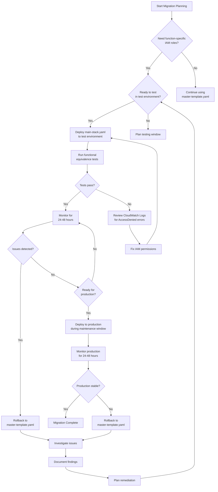

# Migration Guide: Function-Specific IAM Roles

## Overview

This guide explains how to migrate from the existing unified IAM role architecture (`master-template.yaml`) to the new function-specific IAM roles architecture (`main-stack.yaml`).

**Key Points:**
- Both architectures remain fully functional and supported
- Migration is optional and can be done gradually
- Rollback is supported without data loss
- Test environment validation is required before production migration

## Architecture Comparison

### Current Architecture (master-template.yaml)

```
master-template.yaml (root)
├── iam-stack.yaml (nested)
│   └── UnifiedOrchestrationRole (single role for all functions)
├── lambda-stack.yaml (nested)
│   ├── QueryHandlerFunction → UnifiedOrchestrationRole
│   ├── DataManagementHandlerFunction → UnifiedOrchestrationRole
│   ├── ExecutionHandlerFunction → UnifiedOrchestrationRole
│   ├── DrOrchestrationStepFunctionFunction → UnifiedOrchestrationRole
│   └── FrontendDeployerFunction → UnifiedOrchestrationRole
├── dynamodb-stack.yaml (nested)
├── eventbridge-stack.yaml (nested)
└── ... (other nested stacks)
```

**Characteristics:**
- Single IAM role with 20+ inline policies
- All Lambda functions share the same permissions
- Simpler to manage but violates least privilege principle
- Larger blast radius if credentials are compromised

### New Architecture (main-stack.yaml)

```
main-stack.yaml (root)
├── iam/roles-stack.yaml (nested)
│   ├── QueryHandlerRole (read-only)
│   ├── DataManagementRole (DynamoDB + DRS metadata)
│   ├── ExecutionHandlerRole (Step Functions + SNS)
│   ├── OrchestrationRole (DRS + EC2)
│   └── FrontendDeployerRole (S3 + CloudFront)
├── lambda/functions-stack.yaml (nested)
│   ├── QueryHandlerFunction → QueryHandlerRole
│   ├── DataManagementHandlerFunction → DataManagementRole
│   ├── ExecutionHandlerFunction → ExecutionHandlerRole
│   ├── DrOrchestrationStepFunctionFunction → OrchestrationRole
│   └── FrontendDeployerFunction → FrontendDeployerRole
├── dynamodb/tables-stack.yaml (nested)
├── eventbridge/rules-stack.yaml (nested)
└── ... (other service-specific nested stacks)
```

**Characteristics:**
- Five dedicated IAM roles, each with minimum required permissions
- Service-based directory structure for better organization
- Follows AWS security best practices (least privilege)
- Reduced blast radius if credentials are compromised
- Easier to audit and maintain permissions per function

## Migration Decision Tree



## Prerequisites

Before starting migration:

1. **Backup Current Configuration**
   ```bash
   # Export current stack configuration
   AWS_PAGER="" aws cloudformation describe-stacks \
     --stack-name aws-drs-orchestration-test \
     --region us-east-2 > backup-stack-config.json
   
   # Export current IAM role policies
   AWS_PAGER="" aws iam get-role \
     --role-name aws-drs-orchestration-orchestration-role-test \
     > backup-iam-role.json
   ```

2. **Verify Deployment Bucket Structure**
   ```bash
   # Ensure nested stack templates are in correct subfolders
   aws s3 ls s3://aws-drs-orchestration-438465159935-test/cfn/ --recursive
   
   # Expected structure:
   # cfn/main-stack.yaml
   # cfn/iam/roles-stack.yaml
   # cfn/lambda/functions-stack.yaml
   # cfn/dynamodb/tables-stack.yaml
   # cfn/eventbridge/rules-stack.yaml
   # ... (other service-specific stacks)
   ```

3. **Review CloudWatch Logs**
   ```bash
   # Check for recent errors in Lambda functions
   AWS_PAGER="" aws logs tail /aws/lambda/aws-drs-orchestration-query-handler-test --since 1h
   AWS_PAGER="" aws logs tail /aws/lambda/aws-drs-orchestration-data-management-handler-test --since 1h
   AWS_PAGER="" aws logs tail /aws/lambda/aws-drs-orchestration-execution-handler-test --since 1h
   ```

4. **Test Environment Access**
   - Verify AWS credentials for test account (438465159935)
   - Verify access to us-east-2 region
   - Verify CloudFormation permissions

## Migration Steps

### Step 1: Deploy New Architecture to Test Environment

**Option A: Using Unified Role (Backward Compatible)**

Deploy the new architecture but continue using the unified role:

```bash
# Sync nested stack templates to S3
aws s3 sync cfn/ s3://aws-drs-orchestration-438465159935-test/cfn/ \
  --exclude "*.md" \
  --exclude ".DS_Store" \
  --region us-east-2

# Deploy with unified role (UseFunctionSpecificRoles=false)
./scripts/deploy-main-stack.sh test
```

This deployment:
- Creates the new nested stack structure
- Uses the unified IAM role (same as master-template.yaml)
- Validates the new architecture without changing permissions
- Allows rollback to master-template.yaml if needed

**Option B: Using Function-Specific Roles**

Deploy with function-specific IAM roles:

```bash
# Sync nested stack templates to S3
aws s3 sync cfn/ s3://aws-drs-orchestration-438465159935-test/cfn/ \
  --exclude "*.md" \
  --exclude ".DS_Store" \
  --region us-east-2

# Deploy with function-specific roles (UseFunctionSpecificRoles=true)
./scripts/deploy-main-stack.sh test --use-function-specific-roles
```

This deployment:
- Creates the new nested stack structure
- Creates five dedicated IAM roles
- Assigns each Lambda function to its specific role
- Implements least privilege security model

### Step 2: Validate Deployment

```bash
# Check stack status
AWS_PAGER="" aws cloudformation describe-stacks \
  --stack-name aws-drs-orchestration-test \
  --region us-east-2 \
  --query 'Stacks[0].StackStatus'

# Expected: CREATE_COMPLETE or UPDATE_COMPLETE

# List all nested stacks
AWS_PAGER="" aws cloudformation list-stacks \
  --stack-status-filter CREATE_COMPLETE UPDATE_COMPLETE \
  --region us-east-2 \
  --query 'StackSummaries[?contains(StackName, `aws-drs-orchestration-test`)].StackName'

# Verify Lambda functions are using correct roles
AWS_PAGER="" aws lambda get-function \
  --function-name aws-drs-orchestration-query-handler-test \
  --region us-east-2 \
  --query 'Configuration.Role'
```

### Step 3: Run Functional Equivalence Tests

Test all Lambda functions to ensure they work identically:

```bash
# Test Query Handler (read-only operations)
aws lambda invoke \
  --function-name aws-drs-orchestration-query-handler-test \
  --region us-east-2 \
  --payload '{"operation": "list_source_servers"}' \
  response.json

cat response.json | jq .

# Test Data Management Handler (DynamoDB operations)
aws lambda invoke \
  --function-name aws-drs-orchestration-data-management-handler-test \
  --region us-east-2 \
  --payload '{"operation": "list_protection_groups"}' \
  response.json

cat response.json | jq .

# Test Execution Handler (Step Functions operations)
aws lambda invoke \
  --function-name aws-drs-orchestration-execution-handler-test \
  --region us-east-2 \
  --payload '{"operation": "find"}' \
  response.json

cat response.json | jq .

# Test Frontend Deployer (S3 operations)
aws lambda invoke \
  --function-name aws-drs-orchestration-frontend-deployer-test \
  --region us-east-2 \
  --payload '{"action": "deploy"}' \
  response.json

cat response.json | jq .
```

### Step 4: Monitor CloudWatch Logs

Monitor for AccessDenied errors:

```bash
# Query for AccessDenied errors across all functions
AWS_PAGER="" aws logs filter-log-events \
  --log-group-name /aws/lambda/aws-drs-orchestration-query-handler-test \
  --filter-pattern "AccessDenied" \
  --start-time $(date -u -d '1 hour ago' +%s)000 \
  --region us-east-2

# Repeat for other functions:
# - /aws/lambda/aws-drs-orchestration-data-management-handler-test
# - /aws/lambda/aws-drs-orchestration-execution-handler-test
# - /aws/lambda/aws-drs-orchestration-dr-orch-sf-test
# - /aws/lambda/aws-drs-orchestration-frontend-deployer-test
```

### Step 5: Run End-to-End Disaster Recovery Test

Execute a complete DR workflow:

```bash
# 1. Create a protection group
# 2. Create a recovery plan
# 3. Start a recovery execution
# 4. Monitor execution progress
# 5. Verify recovery instances are created
# 6. Terminate recovery instances
# 7. Verify cleanup

# Use the API Gateway endpoint or direct Lambda invocation
# Document any AccessDenied errors or unexpected behavior
```

### Step 6: Monitor for 24-48 Hours

- Check CloudWatch Alarms for AccessDenied errors
- Review Lambda execution metrics (duration, errors, throttles)
- Monitor DynamoDB read/write capacity
- Check Step Functions execution success rate
- Review API Gateway 4xx/5xx error rates

### Step 7: Rollback (If Needed)

If issues are detected, rollback to master-template.yaml:

```bash
# Option 1: Switch back to unified role (if using main-stack.yaml)
./scripts/deploy-main-stack.sh test

# Option 2: Redeploy master-template.yaml
./scripts/deploy.sh test

# Verify rollback
AWS_PAGER="" aws cloudformation describe-stacks \
  --stack-name aws-drs-orchestration-test \
  --region us-east-2 \
  --query 'Stacks[0].StackStatus'

# Verify Lambda functions are using unified role
AWS_PAGER="" aws lambda get-function \
  --function-name aws-drs-orchestration-query-handler-test \
  --region us-east-2 \
  --query 'Configuration.Role'
```

### Step 8: Production Migration (After Test Success)

**CRITICAL: Only proceed after 24-48 hours of stable test environment operation**

```bash
# 1. Schedule maintenance window
# 2. Notify stakeholders
# 3. Backup production configuration
# 4. Deploy to production during maintenance window

# Sync nested stack templates to production S3 bucket
aws s3 sync cfn/ s3://aws-drs-orchestration-production-bucket/cfn/ \
  --exclude "*.md" \
  --exclude ".DS_Store" \
  --region us-east-1

# Deploy to production (use appropriate script and parameters)
# NEVER use test scripts for production deployment
```

## Rollback Procedures

### Scenario 1: AccessDenied Errors After Migration

**Symptoms:**
- Lambda functions fail with AccessDenied errors
- CloudWatch Alarms trigger for security errors
- API Gateway returns 500 errors

**Resolution:**

1. **Identify Missing Permissions**
   ```bash
   # Check CloudWatch Logs for specific denied actions
   AWS_PAGER="" aws logs filter-log-events \
     --log-group-name /aws/lambda/aws-drs-orchestration-query-handler-test \
     --filter-pattern "AccessDenied" \
     --start-time $(date -u -d '1 hour ago' +%s)000 \
     --region us-east-2 | jq '.events[].message'
   ```

2. **Rollback to Unified Role**
   ```bash
   # Switch back to unified role
   ./scripts/deploy-main-stack.sh test
   
   # Or redeploy master-template.yaml
   ./scripts/deploy.sh test
   ```

3. **Document Missing Permissions**
   - Record the denied action (e.g., `drs:DescribeSourceServers`)
   - Record the resource ARN
   - Record the Lambda function name
   - Create GitHub issue for IAM policy update

### Scenario 2: Performance Degradation

**Symptoms:**
- Lambda execution duration increases
- API Gateway latency increases
- Step Functions executions timeout

**Resolution:**

1. **Compare Metrics**
   ```bash
   # Compare Lambda duration before and after migration
   AWS_PAGER="" aws cloudwatch get-metric-statistics \
     --namespace AWS/Lambda \
     --metric-name Duration \
     --dimensions Name=FunctionName,Value=aws-drs-orchestration-query-handler-test \
     --start-time $(date -u -d '24 hours ago' +%Y-%m-%dT%H:%M:%S) \
     --end-time $(date -u +%Y-%m-%dT%H:%M:%S) \
     --period 3600 \
     --statistics Average Maximum \
     --region us-east-2
   ```

2. **Rollback if Degradation > 10%**
   ```bash
   ./scripts/deploy.sh test
   ```

3. **Investigate Root Cause**
   - Check IAM policy evaluation time
   - Check cross-account role assumption latency
   - Check DynamoDB throttling
   - Check Lambda cold start times

### Scenario 3: Data Inconsistency

**Symptoms:**
- DynamoDB data appears corrupted
- Step Functions executions show unexpected state
- Recovery instances not tracked correctly

**Resolution:**

1. **IMMEDIATE ROLLBACK**
   ```bash
   ./scripts/deploy.sh test
   ```

2. **Verify Data Integrity**
   ```bash
   # Check DynamoDB tables
   AWS_PAGER="" aws dynamodb scan \
     --table-name aws-drs-orchestration-protection-groups-test \
     --region us-east-2 \
     --max-items 10
   
   # Check Step Functions executions
   AWS_PAGER="" aws stepfunctions list-executions \
     --state-machine-arn arn:aws:states:us-east-2:438465159935:stateMachine:aws-drs-orchestration-dr-orch-sf-test \
     --status-filter RUNNING \
     --max-results 10
   ```

3. **Restore from Backup (if needed)**
   - Use DynamoDB point-in-time recovery
   - Manually terminate orphaned recovery instances
   - Document data loss and root cause

## Testing Procedures

### Unit Tests

Run unit tests to verify CloudFormation template structure:

```bash
# Activate Python virtual environment
source .venv/bin/activate

# Run unit tests
pytest tests/unit/test_cloudformation_templates.py -v

# Run property-based tests
pytest tests/unit/test_iam_policies_property.py -v --hypothesis-show-statistics
```

### Integration Tests

Run integration tests in test environment:

```bash
# Test all Lambda functions
pytest tests/integration/test_lambda_functions.py -v

# Test IAM permissions
pytest tests/integration/test_iam_permissions.py -v

# Test negative security (unauthorized operations)
pytest tests/integration/test_security_negative.py -v
```

### Manual Testing Checklist

- [ ] Query Handler can list source servers
- [ ] Query Handler can describe DRS jobs
- [ ] Query Handler can query DynamoDB tables
- [ ] Query Handler CANNOT write to DynamoDB
- [ ] Query Handler CANNOT start DRS recovery
- [ ] Data Management Handler can create protection groups
- [ ] Data Management Handler can update recovery plans
- [ ] Data Management Handler can sync DRS tags
- [ ] Data Management Handler CANNOT start DRS recovery
- [ ] Execution Handler can start Step Functions executions
- [ ] Execution Handler can publish SNS notifications
- [ ] Execution Handler can coordinate recovery operations
- [ ] Orchestration Function can start DRS recovery
- [ ] Orchestration Function can create EC2 instances
- [ ] Orchestration Function can terminate recovery instances
- [ ] Frontend Deployer can upload files to S3
- [ ] Frontend Deployer can create CloudFront invalidations
- [ ] Frontend Deployer can empty versioned S3 buckets
- [ ] Frontend Deployer CANNOT access DRS
- [ ] Frontend Deployer CANNOT access DynamoDB

## Troubleshooting

### Issue: CloudFormation Stack Stuck in UPDATE_IN_PROGRESS

**Cause:** Nested stack dependency issue or resource creation timeout

**Resolution:**
```bash
# Check stack events
AWS_PAGER="" aws cloudformation describe-stack-events \
  --stack-name aws-drs-orchestration-test \
  --region us-east-2 \
  --max-items 20

# If stuck for > 30 minutes, cancel update
AWS_PAGER="" aws cloudformation cancel-update-stack \
  --stack-name aws-drs-orchestration-test \
  --region us-east-2

# Wait for ROLLBACK_COMPLETE
# Then retry deployment
```

### Issue: Nested Stack Template Not Found

**Cause:** Template URL references incorrect S3 path

**Resolution:**
```bash
# Verify S3 bucket structure
aws s3 ls s3://aws-drs-orchestration-438465159935-test/cfn/ --recursive

# Ensure templates are in correct subfolders:
# cfn/iam/roles-stack.yaml
# cfn/lambda/functions-stack.yaml
# etc.

# Re-sync templates
aws s3 sync cfn/ s3://aws-drs-orchestration-438465159935-test/cfn/ \
  --exclude "*.md" \
  --region us-east-2
```

### Issue: IAM Role Already Exists

**Cause:** Previous deployment left orphaned IAM roles

**Resolution:**
```bash
# List existing roles
AWS_PAGER="" aws iam list-roles \
  --query 'Roles[?contains(RoleName, `aws-drs-orchestration`)].RoleName'

# Delete orphaned roles (ONLY in test environment)
AWS_PAGER="" aws iam delete-role \
  --role-name aws-drs-orchestration-query-handler-role-test

# Retry deployment
```

### Issue: Lambda Function Cannot Assume Cross-Account Role

**Cause:** ExternalId mismatch or trust policy issue

**Resolution:**
```bash
# Verify ExternalId in IAM policy
AWS_PAGER="" aws iam get-role-policy \
  --role-name aws-drs-orchestration-orchestration-role-test \
  --policy-name CrossAccountAccess

# Verify trust policy in workload account
# ExternalId must match: aws-drs-orchestration-test

# Update workload account trust policy if needed
```

## Best Practices

1. **Always Test in Test Environment First**
   - Never deploy directly to production
   - Validate for 24-48 hours in test
   - Run comprehensive functional tests

2. **Monitor CloudWatch Alarms**
   - Set up alarms for AccessDenied errors
   - Monitor Lambda error rates
   - Track API Gateway 5xx errors

3. **Document All Changes**
   - Record deployment timestamps
   - Document any issues encountered
   - Track rollback procedures used

4. **Gradual Migration**
   - Start with unified role (UseFunctionSpecificRoles=false)
   - Validate new architecture works
   - Switch to function-specific roles (UseFunctionSpecificRoles=true)
   - Monitor for issues

5. **Maintain Rollback Capability**
   - Keep master-template.yaml functional
   - Test rollback procedures regularly
   - Document rollback decision criteria

## Support and Resources

- **CloudFormation Templates:** `/cfn/` directory
- **Deployment Scripts:** `/scripts/deploy-main-stack.sh`
- **IAM Role Documentation:** `/docs/IAM_ROLES.md`
- **Testing Guide:** `/docs/TESTING_GUIDE.md`
- **Troubleshooting Guide:** `/docs/TROUBLESHOOTING.md`

## Conclusion

Migration to function-specific IAM roles improves security posture by implementing least privilege principles. However, it requires careful planning, testing, and monitoring. Always validate in test environment before production deployment, and maintain rollback capability throughout the migration process.

**Remember:** Both architectures (master-template.yaml and main-stack.yaml) remain fully functional and supported. Choose the architecture that best fits your security requirements and operational capabilities.
