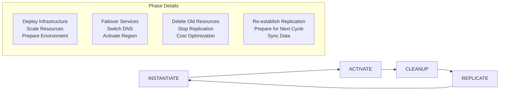

# DR Orchestration Artifacts Analysis

## Executive Summary

The `dr-orchestration-artifacts` repository represents a **comprehensive enterprise disaster recovery orchestration platform** that provides automated DR lifecycle management across multiple AWS services and applications. Our AWS DRS Orchestration solution is a **specialized component** within this broader platform, focusing specifically on DRS-based server recovery orchestration.

## Platform Architecture Overview

### Multi-Service DR Orchestration Platform

The dr-orchestration-artifacts solution provides a **modular, service-agnostic DR orchestration framework** that can orchestrate disaster recovery across multiple AWS services:

| Service Module | Purpose | DR Capabilities |
|----------------|---------|-----------------|
| **DRS** | Server-level DR | Instance recovery, failover/failback, replication management |
| **RDS (MySQL/SQL Server)** | Database DR | Failover, read replica promotion, cross-region replication |
| **Aurora** | Database cluster DR | Global database failover, cluster promotion |
| **ElastiCache** | Cache layer DR | Cluster failover, backup restoration |
| **OpenSearch** | Search service DR | Domain failover, snapshot restoration |
| **Route 53** | DNS failover | Health checks, weighted routing, failover routing |
| **ECS Service** | Container DR | Service scaling, task definition updates |
| **Lambda Function** | Serverless DR | Function deployment, configuration updates |
| **Auto Scaling** | Compute scaling | ASG configuration, capacity management |
| **MemoryDB** | In-memory DB DR | Cluster failover, snapshot restoration |
| **EventBridge** | Event routing DR | Rule management, target configuration |

### 4-Phase DR Lifecycle Model

The platform implements a **standardized 4-phase DR lifecycle** that applies across all services:



#### Phase Definitions

1. **INSTANTIATE**: Pre-warm infrastructure in secondary region
   - Deploy CloudFormation stacks
   - Scale up ECS/EKS clusters
   - Prepare DRS recovery instances
   - Configure network resources

2. **ACTIVATE**: Make secondary region primary
   - Failover databases (RDS, Aurora)
   - Switch DNS records (Route 53)
   - Start DRS recovery instances
   - Update application configurations

3. **CLEANUP**: Clean up old primary region
   - Delete inactive resources
   - Stop old database instances
   - Terminate DRS source servers
   - Optimize costs

4. **REPLICATE**: Re-establish replication
   - Create new read replicas
   - Configure DRS reverse replication
   - Sync data between regions
   - Prepare for next DR cycle

## Our DRS Solution's Role in the Platform

### Specialized DRS Module Integration

Our AWS DRS Orchestration solution serves as the **specialized DRS module** within this broader platform:

```python
# From dr-orchestration-artifacts/src/modulefactory/modules/drs.py
class DRS(Module):
    boto3_service_name = 'drs'
    
    def activate(self, event):
        """Failover/Failback orchestration"""
        # Our solution provides enhanced capabilities:
        # - Wave-based execution
        # - Protection group management
        # - Cross-account operations
        # - Advanced monitoring
        
    def cleanup(self, event):
        """Resource cleanup after DR"""
        # Our solution adds:
        # - Selective instance termination
        # - Execution history tracking
        # - RBAC-controlled cleanup
        
    def replicate(self, event):
        """Re-establish replication"""
        # Our solution enhances:
        # - Multi-region tag synchronization
        # - Automated server discovery
        # - Launch configuration management
```

### Enhanced Capabilities We Provide

Our DRS solution **significantly enhances** the basic DRS module with enterprise-grade features:

| Basic DRS Module | Our Enhanced Solution |
|------------------|----------------------|
| Simple hostname-based server lookup | **Protection Groups** with tag-based selection |
| Single-server operations | **Wave-based orchestration** with dependencies |
| Manual approval workflow | **Pause/Resume execution** with Step Functions |
| Basic failover/failback | **Cross-account, multi-region operations** |
| Limited monitoring | **Real-time dashboard** with execution history |
| No RBAC | **5-tier role-based access control** |
| Basic API | **47+ REST API endpoints** |

## Cross-Account Architecture Patterns

### Hub-and-Spoke Model

The dr-orchestration-artifacts solution uses a **hub-and-spoke cross-account model**:

```yaml
# From role-templates/TargetAccountsAssumeRole.yaml
TargetAccountAssumeRole:
  Type: 'AWS::IAM::Role'
  Properties:
    RoleName: aws-dr-orchestrator-execution-role
    AssumeRolePolicyDocument:
      Statement:
        - Effect: Allow
          Principal:
            AWS: 
              - "arn:aws:iam::${CentralAccountNumber}:role/aws-orchestrator-master-role-${PrimaryRegion}"
              - "arn:aws:iam::${CentralAccountNumber}:role/aws-orchestrator-master-role-${SecondaryRegion}"
          Action: "sts:AssumeRole"
    ManagedPolicyArns:
      - arn:aws:iam::aws:policy/AdministratorAccess  # Broad permissions
```

### Cross-Account Session Management

```python
# From src/modulefactory/modules/utils/boto3_session.py
class Boto3Session:
    def get_client(self):
        if self.account_id is not None:
            sts = boto3.client('sts')
            stsresponse = sts.assume_role(
                RoleArn=f"arn:aws:iam::{self.account_id}:role/{self.target_assume_role_name}",
                RoleSessionName='aws-dr-orchestrator-session',
                DurationSeconds=900,
            )
            self.credentials = stsresponse["Credentials"]
```

## Integration Opportunities

### 1. Platform Integration Strategy

Our DRS solution can integrate with the broader platform in multiple ways:

#### Option A: Enhanced DRS Module Replacement
Replace the basic DRS module with our enhanced solution:

```python
# Enhanced DRS module integration
class EnhancedDRS(Module):
    def __init__(self):
        self.drs_orchestrator_api = "https://api.drs-orchestration.com"
        self.protection_groups_client = ProtectionGroupsClient()
        self.recovery_plans_client = RecoveryPlansClient()
    
    def activate(self, event):
        """Use our wave-based orchestration"""
        plan_id = self.resolve_recovery_plan(event['StatePayload']['parameters'])
        execution = self.recovery_plans_client.start_execution(
            plan_id=plan_id,
            execution_type="recovery",
            cross_account=True
        )
        return {"execution_id": execution['executionId']}
```

#### Option B: Parallel Specialized Service
Run our solution as a specialized service alongside the platform:

```yaml
# Application manifest integration
- layer: 2
  resources:
    - action: "drs_orchestration"
      resourceName: "application_servers"
      parameters:
        api_endpoint: "https://api.drs-orchestration.com"
        protection_group_id: "pg-app-servers-prod"
        recovery_plan_id: "rp-app-failover-west"
        execution_type: "recovery"
```

### 2. Manifest-Driven Integration

Integrate our solution into the platform's manifest-driven approach:

```json
{
  "layer": 1,
  "resources": [
    {
      "action": "enhanced_drs",
      "resourceName": "database_tier",
      "parameters": {
        "protection_group_tags": {
          "Tier": "Database",
          "Environment": "Production"
        },
        "recovery_plan": "multi_wave_database_recovery",
        "pause_before_activation": true,
        "cross_account_targets": ["123456789012", "123456789013"]
      }
    }
  ]
}
```

### 3. Step Functions Integration

Enhance the platform's Step Functions with our orchestration capabilities:

```json
{
  "Comment": "Enhanced DR Orchestrator with DRS Wave Execution",
  "StartAt": "Request Approval",
  "States": {
    "DRS Wave Execution": {
      "Type": "Task",
      "Resource": "arn:aws:states:::lambda:invoke.waitForTaskToken",
      "Parameters": {
        "FunctionName": "aws-elasticdrs-orchestrator-api-handler",
        "Payload": {
          "httpMethod": "POST",
          "path": "/executions",
          "body": {
            "planId.$": "$.recovery_plan_id",
            "executionType": "recovery",
            "taskToken.$": "$$.Task.Token"
          }
        }
      },
      "Next": "Check DRS Execution Status"
    }
  }
}
```

## Key Architectural Differences

### 1. Permissions Model

| Platform Approach | Our Approach |
|-------------------|--------------|
| **AdministratorAccess** for simplicity | **Least-privilege IAM** with granular permissions |
| Single execution role | **5-tier RBAC** with role-based access |
| No external ID validation | **External ID validation** for security |

### 2. Service Integration

| Platform Approach | Our Approach |
|-------------------|--------------|
| **Service-agnostic** modules | **DRS-specialized** with deep integration |
| Basic hostname lookup | **Tag-based protection groups** |
| Simple failover operations | **Wave-based orchestration** with dependencies |

### 3. Monitoring and Control

| Platform Approach | Our Approach |
|-------------------|--------------|
| CloudWatch dashboard aggregation | **Real-time execution monitoring** |
| Basic Step Functions logging | **Comprehensive audit trails** |
| Manual approval gates | **Pause/resume with task tokens** |

## Enhancement Recommendations

### 1. Security Hardening

**Current Platform Issue**: Uses `AdministratorAccess` for cross-account roles

**Our Enhancement**:
```yaml
# Enhanced cross-account role with least privilege
TargetAccountDRSRole:
  Type: 'AWS::IAM::Role'
  Properties:
    RoleName: enhanced-drs-orchestrator-execution-role
    AssumeRolePolicyDocument:
      Statement:
        - Effect: Allow
          Principal:
            AWS: "arn:aws:iam::${CentralAccountNumber}:role/drs-orchestrator-hub-role"
          Action: "sts:AssumeRole"
          Condition:
            StringEquals:
              "sts:ExternalId": "drs-orchestration-${AWS::AccountId}"
    Policies:
      - PolicyName: DRSOrchestrationPermissions
        PolicyDocument:
          Statement:
            - Effect: Allow
              Action:
                - "drs:*"
                - "ec2:Describe*"
                - "ec2:CreateTags"
                - "ec2:TerminateInstances"
              Resource: "*"
```

### 2. Enhanced Module Factory Integration

**Current Limitation**: Basic DRS operations only

**Our Enhancement**:
```python
class EnhancedDRSModule(Module):
    def __init__(self):
        self.api_client = DRSOrchestrationAPIClient()
        
    def activate(self, event):
        """Enhanced activation with wave-based execution"""
        # Convert platform parameters to our protection group format
        protection_group = self.create_protection_group_from_hostnames(
            event['StatePayload']['parameters']['HostNames']
        )
        
        # Create recovery plan with wave configuration
        recovery_plan = self.create_recovery_plan_from_manifest(
            event['StatePayload']
        )
        
        # Execute with our enhanced orchestration
        execution = self.api_client.start_execution(
            plan_id=recovery_plan['planId'],
            execution_type='recovery',
            cross_account=True
        )
        
        return {
            "execution_id": execution['executionId'],
            "enhanced_monitoring_url": f"https://drs-orchestration.com/executions/{execution['executionId']}"
        }
```

### 3. Unified Dashboard Integration

**Enhancement**: Integrate our real-time monitoring into the platform dashboard

```python
# Enhanced dashboard with DRS orchestration metrics
def create_enhanced_dashboard():
    dashboard_widgets = [
        # Existing platform widgets
        *get_platform_widgets(),
        
        # Our enhanced DRS widgets
        {
            "type": "metric",
            "properties": {
                "metrics": [
                    ["AWS/DRS/Orchestration", "ActiveExecutions"],
                    ["AWS/DRS/Orchestration", "WaveCompletionRate"],
                    ["AWS/DRS/Orchestration", "CrossAccountOperations"]
                ],
                "title": "Enhanced DRS Orchestration Metrics"
            }
        }
    ]
```

## Strategic Value Proposition

### 1. Platform Enhancement

Our DRS solution **significantly enhances** the platform's DRS capabilities:

- **10x More Sophisticated**: Wave-based vs simple hostname operations
- **Enterprise Security**: RBAC vs AdministratorAccess
- **Real-time Monitoring**: Live dashboard vs basic CloudWatch
- **Cross-Account Scale**: Multi-account orchestration vs single account

### 2. Customer Value

**For Platform Users**:
- **Reduced Complexity**: Our UI abstracts complex DRS operations
- **Enhanced Reliability**: Wave-based execution with pause/resume
- **Better Security**: Granular permissions and audit trails
- **Operational Excellence**: Real-time monitoring and control

**For Platform Operators**:
- **Specialized Expertise**: Deep DRS integration knowledge
- **Proven Patterns**: Battle-tested orchestration workflows
- **Scalable Architecture**: Handles enterprise-scale deployments
- **Comprehensive API**: 47+ endpoints for automation

### 3. Integration Benefits

**Immediate Value**:
- Replace basic DRS module with enterprise-grade solution
- Maintain platform's manifest-driven approach
- Enhance security with least-privilege permissions
- Add real-time monitoring capabilities

**Long-term Value**:
- Establish pattern for specialized service modules
- Create reference architecture for cross-account orchestration
- Enable advanced DR scenarios (multi-tier, dependency-aware)
- Support enterprise compliance requirements

## Conclusion

The dr-orchestration-artifacts platform provides an excellent **foundation for multi-service DR orchestration**, while our AWS DRS Orchestration solution offers **specialized, enterprise-grade DRS capabilities** that significantly enhance the platform's server recovery capabilities.

**Key Integration Opportunities**:

1. **Enhanced Module Replacement**: Replace basic DRS module with our solution
2. **Manifest Integration**: Support platform's manifest-driven approach
3. **Security Enhancement**: Implement least-privilege cross-account patterns
4. **Monitoring Integration**: Add real-time DRS orchestration metrics
5. **API Integration**: Provide programmatic access to advanced DRS features

**Strategic Recommendation**: Position our solution as the **specialized DRS orchestration engine** within the broader platform, providing enterprise customers with sophisticated server recovery capabilities while maintaining the platform's service-agnostic architecture for other AWS services.

This integration approach maximizes value for both solutions while providing customers with a comprehensive, enterprise-grade disaster recovery orchestration platform.