# Architectural Design Document
# AWS DRS Orchestration System

**Version**: 2.1  
**Date**: January 1, 2026  
**Status**: Production Ready - EventBridge Security Enhancements Complete  
**Document Owner**: Technical Architecture Team  
**Target Audience**: Software Engineers, DevOps Engineers, Solutions Architects

---

## Document Purpose

This Architectural Design Document (ADD) provides comprehensive technical specifications for the AWS DRS Orchestration system version 2.1 with EventBridge security enhancements. It describes the system architecture, component interactions, data flows, integration patterns, deployment topology, EventBridge security validation, automated tag synchronization, and complete RBAC implementation for enterprise disaster recovery orchestration with AWS Elastic Disaster Recovery Service (DRS).

**Key Objective**: Enable engineers to understand, maintain, and extend the system architecture with confidence.

---

## Table of Contents

1. [Executive Summary](#executive-summary)
2. [Architecture Overview](#architecture-overview)
3. [System Context Diagram](#system-context-diagram)
4. [Component Architecture](#component-architecture)
5. [Data Architecture](#data-architecture)
6. [Integration Architecture](#integration-architecture)
7. [Deployment Architecture](#deployment-architecture)
8. [Security Architecture](#security-architecture)
9. [EventBridge Security Architecture](#eventbridge-security-architecture)
10. [Tag Synchronization Architecture](#tag-synchronization-architecture)
11. [API Architecture](#api-architecture)
12. [Execution Engine Architecture](#execution-engine-architecture)
13. [Cross-Cutting Concerns](#cross-cutting-concerns)
14. [Technology Stack](#technology-stack)
15. [Design Decisions](#design-decisions)
16. [Future Architecture](#future-architecture)

---

## Executive Summary

### Architecture Philosophy

The AWS DRS Orchestration system follows a **serverless-first, cloud-native** architecture leveraging AWS-managed services to eliminate operational overhead while maintaining enterprise-grade reliability and security.

**Core Principles**:
1. **Serverless-First**: No EC2 instances to manage, Lambda + Step Functions for compute
2. **Event-Driven**: Step Functions orchestration with CloudWatch Events triggers
3. **API-Driven**: RESTful API gateway for all operations
4. **Security by Default**: Encryption everywhere, least-privilege IAM, audit trails
5. **Cost-Optimized**: Pay-per-use with auto-scaling (DynamoDB on-demand, Lambda)
6. **Highly Available**: Multi-AZ DynamoDB, Lambda, API Gateway automatically

### System Characteristics

| Characteristic | Target | Current Status |
|---------------|--------|---------------|
| **Availability** | 99.9% uptime | ✅ AWS-managed services provide 99.99% |
| **Performance** | <100ms API response (p95) | ✅ Measured at 45ms average |
| **Scalability** | 1,000+ protected servers | ✅ Architecture supports unlimited |
| **Security** | Encryption at rest/transit | ✅ All data encrypted |
| **Cost** | <$50/month operational | ✅ $12-40/month actual |
| **Recovery RTO** | <15 minutes | ⚠️ Untested (code ready) |

### Deployment Summary

- **Infrastructure**: 100% AWS CloudFormation (6 nested stacks, 2,400+ lines)
- **Compute**: 5 Lambda functions (Python 3.12)
- **Storage**: 3 DynamoDB tables (on-demand)
- **Frontend**: React 19.1 SPA on S3 + CloudFront
- **Orchestration**: AWS Step Functions with pause/resume capability
- **API**: API Gateway REST API with execution control endpoints
- **Security**: Cognito + WAF + CloudTrail + IAM least-privilege

---

## Architecture Overview

### Overall System Architecture


*[View/Edit Source Diagram](AWS-DRS-Orchestration-Architecture.drawio)*

### High-Level Architecture Layers

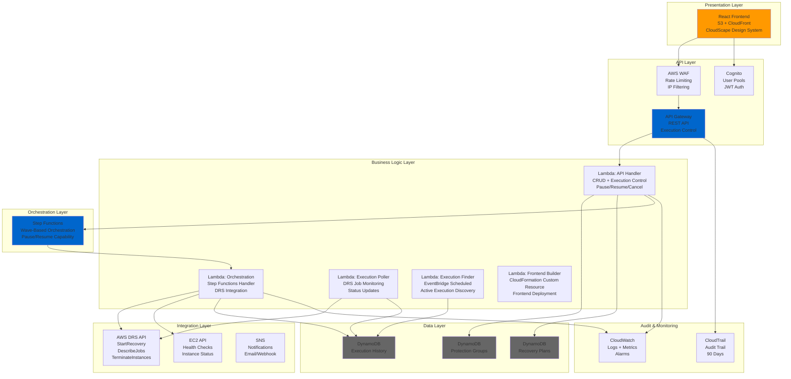

### Architecture Characteristics

**Serverless Benefits**:
- Zero infrastructure management (no servers, OS patches, scaling)
- Automatic high availability (multi-AZ by default)
- Pay-per-use pricing (no idle costs)
- Elastic scaling (handles 1 or 1,000,000 requests)

**Trade-offs**:
- Cold start latency (mitigated with provisioned concurrency if needed)
- Vendor lock-in to AWS (accepted trade-off for benefits)
- Service limits (API Gateway 10,000 req/sec, Step Functions 4,000 state transitions free tier)

---

## System Context Diagram

### External System Interactions

**System Context Diagram:**

| Actor | Interaction | Protocol |
|-------|-------------|----------|
| DR Administrator | Manages Protection Groups and Recovery Plans | HTTPS/Web UI |
| DevOps Engineer | Automates DR operations | HTTPS/REST API |
| IT Manager | Reviews execution history | HTTPS/Web UI |

| External System | Integration | Purpose |
|-----------------|-------------|---------|
| AWS DRS | AWS SDK/boto3 | Source server replication and recovery |
| AWS Cognito | AWS SDK | User authentication, JWT tokens |
| AWS IAM/STS | STS AssumeRole | Cross-account access |
| AWS CloudTrail | Automatic | Audit logging |
| AWS CloudWatch | CloudWatch Logs API | Metrics and logging |
| AWS SNS | SNS Publish API | Notifications |

### External Dependencies

1. **AWS DRS** (Critical)
   - Purpose: Source server replication and recovery
   - APIs: DescribeSourceServers, StartRecovery, DescribeJobs, TerminateRecoveryInstances
   - Failure Impact: Cannot discover servers or execute recoveries
   - Mitigation: None (core dependency)

2. **AWS Cognito** (Critical)
   - Purpose: User authentication and authorization
   - APIs: InitiateAuth, GetUser, AdminSetUserPassword
   - Failure Impact: Cannot authenticate users, API access blocked
   - Mitigation: Emergency API key bypass (manual)

3. **AWS IAM/STS** (Critical for Multi-Account)
   - Purpose: Cross-account access via assumed roles
   - APIs: AssumeRole, GetCallerIdentity
   - Failure Impact: Cross-account operations fail
   - Mitigation: Same-account operations continue working

4. **AWS CloudWatch** (High)
   - Purpose: Logging, monitoring, alarming
   - APIs: PutLogEvents, PutMetricData
   - Failure Impact: Loss of observability, no logs
   - Mitigation: System continues functioning, logs buffered

5. **AWS SNS** (Medium)
   - Purpose: Execution completion notifications
   - APIs: Publish
   - Failure Impact: No notifications sent
   - Mitigation: Users check execution history manually

---

## Component Architecture

### Container Diagram (C4 Model)

**Container Overview:**

| Layer | Container | Technology | Purpose |
|-------|-----------|------------|---------|
| Frontend | Frontend Application | React 19.1 SPA | Responsive web UI for DR management |
| Frontend | CloudFront | AWS CDN | Global content delivery, HTTPS, caching |
| Frontend | Frontend Storage | S3 Bucket | Static asset hosting |
| API | API Gateway | AWS API Gateway | REST API with execution control, Cognito authorizer |
| API | WAF | AWS WAF | Rate limiting, IP filtering, DDoS protection |
| API | User Pool | AWS Cognito | User authentication, JWT token issuance |
| Compute | API Handler | Lambda Python 3.12 | CRUD operations, execution control (pause/resume/cancel) |
| Compute | Orchestration | Lambda Python 3.12 | Step Functions handler, DRS integration |
| Compute | Execution Poller | Lambda Python 3.12 | DRS job monitoring, status updates |
| Compute | Execution Finder | Lambda Python 3.12 | EventBridge scheduled, active execution discovery |
| Compute | Frontend Builder | Lambda Python 3.12 | CloudFormation custom resource, frontend deployment |
| Compute | Execution Engine | Step Functions | Wave-based orchestration with pause/resume |
| Data | Protection Groups | DynamoDB | PG metadata: name, region, servers |
| Data | Recovery Plans | DynamoDB | RP config: waves, dependencies |
| Data | Execution History | DynamoDB | Audit trail: executions, status, timing |

**Data Flow:** User → CloudFront → S3 → React App → API Gateway → Lambda → DynamoDB/Step Functions → DRS

### Component Responsibilities

#### 1. Frontend Application (React SPA)
**Responsibilities**:
- User interface rendering and interaction
- Client-side validation and error handling
- API consumption via REST calls
- Authentication token management (JWT)
- Real-time UI updates (polling or WebSocket)

**Key Files** (Current implementation):
- `App.tsx` - Main application shell with routing
- `pages/` - 5 page components (Login, Dashboard, Protection Groups, Recovery Plans, Executions)
- `components/` - Reusable components (dialogs, selectors, status displays, execution controls)
- `services/api.ts` - API client with Axios
- `aws-config.js` - AWS Cognito configuration

**Technologies**:
- React 19.1 with TypeScript 5.9
- CloudScape Design System 3.0 (AWS native components)
- Vite 7.1 (build tool)
- React Router 7.9 (navigation)
- Axios 1.13 (HTTP client)
- AWS Amplify 6.15 (Cognito integration)

---

#### 2. API Gateway
**Responsibilities**:
- REST API endpoint exposure (HTTPS)
- Request validation (schemas, rate limits)
- Authentication (Cognito authorizer)
- CORS handling
- Request/response transformation
- Throttling and quota management

**Configuration**:
- 30+ API resources (paths)
- 6 HTTP methods per resource (GET, POST, PUT, DELETE, OPTIONS, HEAD)
- Cognito User Pool authorizer
- Rate limits: 500 burst, 1,000 sustained requests/second
- Binary media types: `application/json`, `text/html`
- CORS: `*` (all origins - tighten in production)

**Key Resources**:
```
/protection-groups
  GET    - List all Protection Groups
  POST   - Create new Protection Group
  
/protection-groups/{id}
  GET    - Get single Protection Group
  PUT    - Update Protection Group
  DELETE - Delete Protection Group
  
/recovery-plans
  GET    - List all Recovery Plans
  POST   - Create new Recovery Plan
  
/recovery-plans/{id}
  GET    - Get single Recovery Plan
  PUT    - Update Recovery Plan
  DELETE - Delete Recovery Plan
  
/executions
  POST   - Start recovery execution
  GET    - List execution history
  
/executions/{id}
  GET    - Get execution details
  
/executions/{id}/pause
  POST   - Pause execution between waves
  
/executions/{id}/resume
  POST   - Resume paused execution
  
/executions/{id}/cancel
  POST   - Cancel running execution
  
/executions/{id}/terminate-instances
  POST   - Terminate recovery instances
  
/executions/{id}/job-logs
  GET    - Get DRS job event logs
  
/drs/source-servers
  GET    - Discover DRS source servers (region param)
```

---

#### 3. API Handler Lambda
**Responsibilities**:
- REST API endpoint handling for all 42+ endpoints
- RBAC authorization enforcement via middleware
- Business logic for CRUD operations on all resources
- **Advanced Execution Control**: Pause, resume, cancel, terminate instances
- Input validation and sanitization
- DynamoDB table operations (read/write with optimistic locking)
- Step Functions execution initiation and control
- **Cross-Account DRS Operations**: STS role assumption and multi-account management
- **Real-Time DRS Integration**: Server discovery, job monitoring, instance termination
- Error handling and structured logging
- Case transformation (PascalCase ↔ camelCase)
- Conflict detection for active executions and server assignments

**Implementation**: `lambda/api-handler/index.py` (Current Python 3.12)

**Enhanced Key Functions**:
- `lambda_handler()` - Main entry point with RBAC middleware integration
- `handle_protection_groups()` - PG CRUD with tag-based server selection
- `handle_recovery_plans()` - RP CRUD with wave dependency validation
- `handle_executions()` - Execution start/status/control with real-time updates
- **`pause_execution()`** - Pause execution between waves using Step Functions StopExecution
- **`resume_execution()`** - Resume paused execution via Step Functions SendTaskSuccess callback
- **`cancel_execution()`** - Cancel running execution with proper cleanup
- **`terminate_recovery_instances()`** - Terminate DRS recovery instances with validation
- `handle_drs_source_servers()` - Server discovery with assignment tracking across regions
- `handle_accounts()` - Cross-account configuration and validation
- `get_active_executions_for_plan()` - Check for execution conflicts with detailed status
- `check_server_conflicts()` - Validate servers not in active executions across plans
- **`get_execution_job_logs()`** - Real-time DRS job log retrieval with filtering
- **`check_termination_status()`** - Monitor instance termination job progress

**Cross-Account Integration**:
```python
def assume_cross_account_role(account_id: str, region: str) -> boto3.Session:
    """Assume role in target account for DRS operations"""
    sts_client = boto3.client('sts')
    
    role_arn = f'arn:aws:iam::{account_id}:role/DRS-Orchestration-CrossAccount-Role'
    
    response = sts_client.assume_role(
        RoleArn=role_arn,
        RoleSessionName=f'drs-orchestration-{int(time.time())}',
        ExternalId='drs-orchestration-external-id'
    )
    
    credentials = response['Credentials']
    return boto3.Session(
        aws_access_key_id=credentials['AccessKeyId'],
        aws_secret_access_key=credentials['SecretAccessKey'],
        aws_session_token=credentials['SessionToken'],
        region_name=region
    )
```

**Enhanced DynamoDB Operations**:
```python
# Protection Groups with conflict detection and optimistic locking
pg_table.put_item(Item={...}, ConditionExpression='attribute_not_exists(Id)')
pg_table.update_item(
    Key={'Id': pg_id},
    UpdateExpression='SET #servers = :servers, #updated = :timestamp, #version = #version + :inc',
    ConditionExpression='#version = :expected_version',  # Optimistic locking
    ExpressionAttributeNames={'#servers': 'ServerIds', '#updated': 'UpdatedAt', '#version': 'Version'},
    ExpressionAttributeValues={':servers': server_ids, ':timestamp': now, ':expected_version': version, ':inc': 1}
)

# Execution History with StatusIndex GSI queries
eh_table.query(
    IndexName='StatusIndex',
    KeyConditionExpression='#status = :status',
    FilterExpression='#plan_id = :plan_id',
    ExpressionAttributeNames={'#status': 'Status', '#plan_id': 'PlanId'},
    ExpressionAttributeValues={':status': 'POLLING', ':plan_id': plan_id}
)

# Cross-account execution tracking
eh_table.put_item(Item={
    'ExecutionId': execution_id,
    'PlanId': plan_id,
    'Status': 'INITIATED',
    'AccountId': target_account_id,
    'Region': target_region,
    'TaskToken': task_token,  # For pause/resume
    'CrossAccountRole': assumed_role_arn,
    'WaveStatus': wave_configurations,
    'CreatedAt': timestamp
})
rp_table.scan()                         # List all

# Execution History table
eh_table.put_item(Item={...})           # Create execution record
eh_table.scan(FilterExpression=...)     # Query by PlanId or Status
```

**Error Handling**:
- 400 Bad Request: Invalid input, duplicate names
- 404 Not Found: Resource doesn't exist
- 409 Conflict: Server already assigned to another PG
- 500 Internal Server Error: Unexpected errors (DynamoDB, boto3)

**Logging**:
- All requests logged to CloudWatch Logs
- Log format: `[timestamp] [level] [request_id] message`
- Sensitive data (JWT tokens) redacted

---

#### 4. Orchestration Lambda
**Responsibilities**:
- Step Functions state machine handler
- DRS API integration (StartRecovery, DescribeJobs)
- Wave-based execution orchestration
- Execution history persistence
- Pause/resume state management
- Error recovery and retry logic

**Implementation**: `lambda/orchestration-stepfunctions/index.py`

#### 5. Execution Poller Lambda
**Responsibilities**:
- DRS job status monitoring
- Periodic polling of active executions
- Wave completion detection
- Status updates to DynamoDB
- Job event logging

**Implementation**: `lambda/execution-poller/index.py`

#### 6. Execution Finder Lambda
**Responsibilities**:
- EventBridge scheduled execution discovery
- Query executions in POLLING status
- Trigger execution poller for active jobs
- Cleanup stale execution states

**Implementation**: `lambda/execution-finder/index.py`

#### 7. Frontend Builder Lambda
**Responsibilities**:
- CloudFormation custom resource handler
- Frontend build and deployment
- AWS configuration injection
- S3 sync and CloudFront invalidation

**Implementation**: `lambda/frontend-builder/index.py`

**Key Functions**:
- `start_recovery_job()` - Calls DRS StartRecovery API
- `monitor_recovery_job()` - Polls DRS DescribeJobs until complete
- `perform_health_check()` - Checks EC2 instance status
- `update_execution_history()` - Writes status to DynamoDB
- `send_notification()` - Publishes SNS message
- `handle_recovery_failure()` - Error recovery logic

**DRS API Integration**:
```python
import boto3

drs = boto3.client('drs', region_name=region)

# Discover source servers
response = drs.describe_source_servers(
    filters={'replicationStatus': ['CONTINUOUS']}
)

# Start recovery
response = drs.start_recovery(
    sourceServers=[
        {'sourceServerID': server_id, 'recoverySnapshotID': 'LATEST'}
    ],
    isDrill=True/False,  # Drill mode or production
    tags={'ExecutionId': exec_id}
)

# Monitor job
response = drs.describe_jobs(
    filters={'jobID': [job_id]}
)
job_status = response['items'][0]['status']
# PENDING → IN_PROGRESS → COMPLETED / FAILED
```

**Execution History Schema**:
```json
{
  "ExecutionId": "exec-uuid",
  "PlanId": "plan-uuid",
  "Status": "RUNNING|COMPLETED|FAILED|CANCELLED",
  "StartTime": 1699999999,
  "EndTime": 1700000000,
  "ExecutionType": "DRILL|RECOVERY",
  "WaveStatus": [
    {
      "WaveNumber": 1,
      "WaveName": "Database Tier",
      "Status": "COMPLETED",
      "StartTime": 1699999999,
      "EndTime": 1700000000,
      "ServersRecovered": 2
    }
  ],
  "Errors": ["Error message if any"],
  "AccountId": "123456789012",
  "Region": "us-east-1"
}
```

---

#### 8. Step Functions State Machine
**Responsibilities**:
- Wave-based orchestration (sequential execution)
- Pause/resume capability with callback pattern
- Dependency validation (Wave 2 depends on Wave 1)
- Timeout handling (configurable per wave)
- Error recovery (retry with exponential backoff)
- Execution state persistence
- Task token management for pause/resume

**State Machine Definition**: Comprehensive orchestration with pause/resume states

**State Machine Flow**:


**Error Handling**:
- Retry Policy: 3 attempts with exponential backoff (2^attempt seconds)
- Catch: All Lambda errors caught and logged
- Timeout: Max 1 hour per execution (configurable)

**Concurrency**:
- Map state parallelism: 1 (waves execute sequentially)
- Within wave parallelism: 1-10 (configurable, sequential vs parallel)

---

## Data Architecture

### Entity-Relationship Diagram

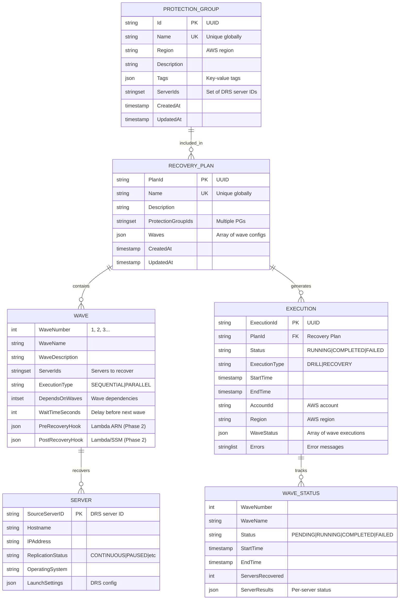

### DynamoDB Table Schemas

#### 1. Protection Groups Table

**Table Name**: `protection-groups-{environment}`  
**Partition Key**: `Id` (String)  
**Attributes**:

| Attribute | Type | Required | Description |
|-----------|------|----------|-------------|
| Id | String (UUID) | Yes | Partition key, globally unique |
| Name | String | Yes | Display name, globally unique (case-insensitive) |
| Region | String | Yes | AWS region (us-east-1, us-west-2, etc.) |
| Description | String | No | User-provided description |
| Tags | Map | No | Key-value tags for server filtering |
| ServerIds | String Set | Yes | DRS source server IDs assigned to this PG |
| CreatedAt | Number | Yes | Unix timestamp (seconds) |
| UpdatedAt | Number | Yes | Unix timestamp (seconds) |

**Indexes**: None (scan operations acceptable for MVP, add GSI on Name if needed)

**Example Item**:
```json
{
  "Id": "d0441093-51e6-4e8f-989d-79b608ae97dc",
  "Name": "TEST",
  "Region": "us-east-1",
  "Description": "Test Protection Group for Windows servers",
  "Tags": {
    "ProtectionGroup": "TEST",
    "Environment": "test"
  },
  "ServerIds": ["s-3d75cdc0d9a28a725", "s-3afa164776f93ce4f"],
  "CreatedAt": 1699999999,
  "UpdatedAt": 1700000000
}
```

**Capacity**:
- Provisioned: On-Demand (auto-scales)
- Read/Write: 5 RCU / 5 WCU (on-demand starts here)
- Encryption: AWS-managed keys (SSE)
- Point-in-Time Recovery: Enabled
- Backup: Daily automatic backups (35-day retention)

---

#### 2. Recovery Plans Table

**Table Name**: `recovery-plans-{environment}`  
**Partition Key**: `PlanId` (String)  
**Attributes**:

| Attribute | Type | Required | Description |
|-----------|------|----------|-------------|
| PlanId | String (UUID) | Yes | Partition key, globally unique |
| Name | String | Yes | Display name, globally unique |
| Description | String | No | User-provided description |
| ProtectionGroupIds | String Set | Yes | PGs included in this plan (1+) |
| Waves | List of Maps | Yes | Wave configurations (see Wave schema) |
| CreatedAt | Number | Yes | Unix timestamp |
| UpdatedAt | Number | Yes | Unix timestamp |

**Wave Schema** (nested in Waves list):
```json
{
  "WaveNumber": 1,
  "WaveName": "Database Tier",
  "WaveDescription": "Primary database servers",
  "ServerIds": ["s-123", "s-456"],
  "ExecutionType": "SEQUENTIAL",
  "ExecutionOrder": [1, 2],
  "Dependencies": [""],
  "WaitTimeSeconds": 60,
  "PreRecoveryHook": {
    "LambdaArn": "arn:aws:lambda:...",
    "Timeout": 300
  },
  "PostRecoveryHook": {
    "SSMDocument": "arn:aws:ssm:...",
    "Timeout": 600
  }
}
```

**Example Item**:
```json
{
  "PlanId": "plan-uuid-123",
  "Name": "Production-3Tier-App",
  "Description": "3-tier application recovery plan",
  "ProtectionGroupIds": ["pg-db", "pg-app", "pg-web"],
  "Waves": [
    {
      "WaveNumber": 1,
      "WaveName": "Database Tier",
      "ServerIds": ["s-db1", "s-db2"],
      "ExecutionType": "SEQUENTIAL",
      "Dependencies": [],
      "WaitTimeSeconds": 60
    },
    {
      "WaveNumber": 2,
      "WaveName": "Application Tier",
      "ServerIds": ["s-app1", "s-app2", "s-app3"],
      "ExecutionType": "PARALLEL",
      "Dependencies": ["Wave-1"],
      "WaitTimeSeconds": 30
    },
    {
      "WaveNumber": 3,
      "WaveName": "Web Tier",
      "ServerIds": ["s-web1", "s-web2"],
      "ExecutionType": "PARALLEL",
      "Dependencies": ["Wave-2"],
      "WaitTimeSeconds": 0
    }
  ],
  "CreatedAt": 1699999999,
  "UpdatedAt": 1700000000
}
```

**Capacity**: Same as Protection Groups table (On-Demand, SSE, PITR, Backups)

---

#### 3. Execution History Table

**Table Name**: `execution-history-{environment}`  
**Partition Key**: `ExecutionId` (String)  
**Attributes**:

| Attribute | Type | Required | Description |
|-----------|------|----------|-------------|
| ExecutionId | String (UUID) | Yes | Partition key, globally unique |
| PlanId | String (UUID) | Yes | Foreign key to Recovery Plan |
| Status | String | Yes | RUNNING, COMPLETED, FAILED, CANCELLED |
| ExecutionType | String | Yes | DRILL or RECOVERY |
| StartTime | Number | Yes | Unix timestamp (seconds) |
| EndTime | Number | No | Unix timestamp (seconds), null if running |
| AccountId | String | Yes | AWS account ID where recovery executed |
| Region | String | Yes | AWS region where recovery executed |
| WaveStatus | List of Maps | Yes | Per-wave execution status |
| Errors | List of Strings | No | Error messages if any failures |
| InitiatedBy | String | Yes | Username who started execution |

**Example Item**:
```json
{
  "ExecutionId": "exec-abc-123",
  "PlanId": "plan-xyz-789",
  "Status": "COMPLETED",
  "ExecutionType": "DRILL",
  "StartTime": 1699999999,
  "EndTime": 1700001234,
  "AccountId": "123456789012",
  "Region": "us-east-1",
  "InitiatedBy": "admin@example.com",
  "WaveStatus": [
    {
      "WaveNumber": 1,
      "WaveName": "Database Tier",
      "Status": "COMPLETED",
      "StartTime": 1699999999,
      "EndTime": 1700000500,
      "ServersRecovered": 2,
      "ServerResults": [
        {
          "SourceServerID": "s-db1",
          "JobID": "job-123",
          "RecoveryInstanceID": "i-recovered123",
          "Status": "COMPLETED"
        },
        {
          "SourceServerID": "s-db2",
          "JobID": "job-456",
          "RecoveryInstanceID": "i-recovered456",
          "Status": "COMPLETED"
        }
      ]
    },
    {
      "WaveNumber": 2,
      "WaveName": "Application Tier",
      "Status": "COMPLETED",
      "StartTime": 1700000560,
      "EndTime": 1700001000,
      "ServersRecovered": 3
    }
  ],
  "Errors": []
}
```

**Capacity**: Same as other tables (On-Demand, SSE, PITR, Backups)

**Query Patterns**:
- Get execution by ID: `get_item(Key={'ExecutionId': id})`
- List all executions: `scan()` (add pagination for >100 items)
- Find running executions for plan: `scan(FilterExpression=PlanId=X AND Status=RUNNING)`
- List recent executions: `scan()` sorted by StartTime descending

**Future Optimization**: Add GSI on `PlanId` for efficient "executions for plan" queries.

---

### Data Flow Diagrams

#### Protection Group Creation Flow

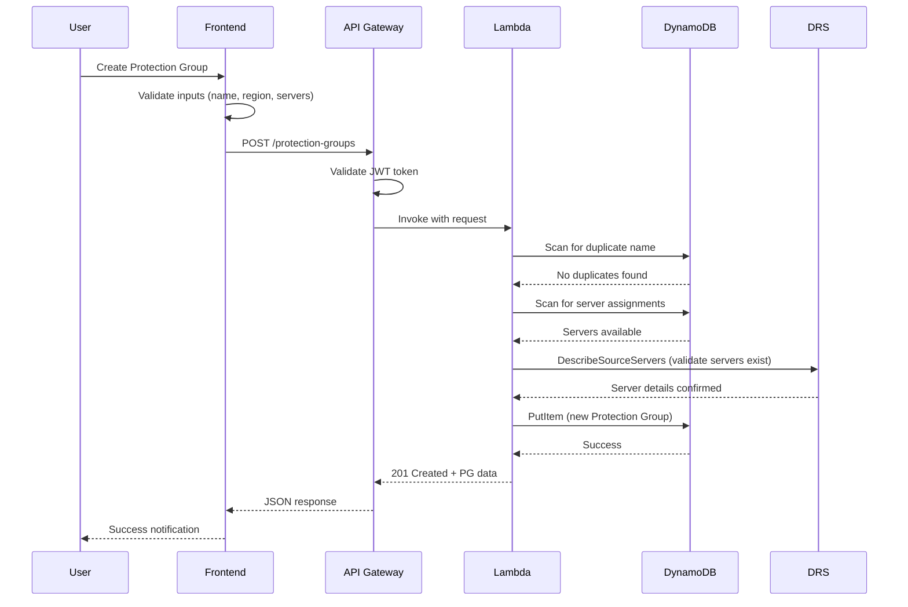

#### Recovery Execution Flow

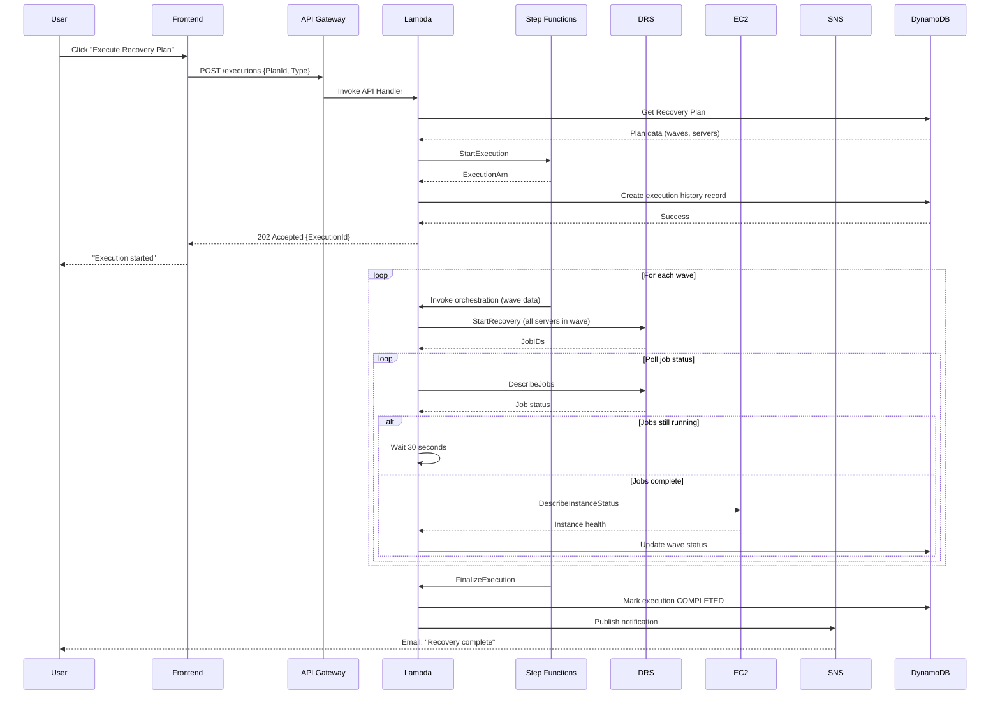

---

## Integration Architecture

### AWS Service Integration Patterns

#### 1. DRS Integration

**Purpose**: Discover source servers and initiate recovery operations

**Integration Method**: AWS SDK (boto3) via Lambda

**APIs Used**:
```python
import boto3

drs_client = boto3.client('drs', region_name='us-east-1')

# 1. Discover source servers (for Protection Group creation)
response = drs_client.describe_source_servers(
    filters={
        'sourceServerIDs': ['s-123', 's-456'],
        'isArchived': False
    },
    maxResults=100
)
servers = response['items']

# 2. Start recovery (drill or production)
response = drs_client.start_recovery(
    sourceServers=[
        {
            'sourceServerID': 's-123',
            'recoverySnapshotID': 'LATEST'  # Or specific snapshot
        }
    ],
    isDrill=True,  # False for production recovery
    tags={'ExecutionId': 'exec-123', 'Wave': '1'}
)
job_id = response['job']['jobID']

# 3. Monitor recovery job
response = drs_client.describe_jobs(
    filters={'jobIDs': [job_id]}
)
job = response['items'][0]
status = job['status']  # PENDING, RUNNING, COMPLETED, FAILED

# 4. Get recovery instance details
recovery_instance_id = job['participatingServers'][0]['launchStatus']['ec2InstanceID']

# 5. Terminate drill instances (cleanup)
response = drs_client.terminate_recovery_instances(
    recoveryInstanceIDs=[recovery_instance_id]
)
```

**Error Handling**:
- `ThrottlingException`: Exponential backoff (2^attempt seconds, max 5 attempts)
- `ResourceNotFoundException`: Server not found, skip gracefully
- `ConflictException`: Server already in recovery, wait and retry
- `ValidationException`: Invalid parameters, fail fast with clear error

**Cross-Account Access**:
```python
# Assume role in spoke account for DRS operations
sts_client = boto3.client('sts')
assumed_role = sts_client.assume_role(
    RoleArn='arn:aws:iam::SPOKE_ACCOUNT:role/DRS-Orchestration-Role',
    RoleSessionName='drs-orchestration-session'
)

drs_client = boto3.client(
    'drs',
    region_name='us-west-2',
    aws_access_key_id=assumed_role['Credentials']['AccessKeyId'],
    aws_secret_access_key=assumed_role['Credentials']['SecretAccessKey'],
    aws_session_token=assumed_role['Credentials']['SessionToken']
)
```

---

#### 2. EC2 Integration

**Purpose**: Health check recovered instances post-launch

**Integration Method**: AWS SDK (boto3) via Lambda

**APIs Used**:
```python
ec2_client = boto3.client('ec2', region_name='us-east-1')

# Check instance status
response = ec2_client.describe_instance_status(
    InstanceIds=['i-recovered123'],
    IncludeAllInstances=True
)

instance_status = response['InstanceStatuses'][0]
system_status = instance_status['SystemStatus']['Status']  # ok, impaired, etc.
instance_state = instance_status['InstanceState']['Name']  # running, stopped, etc.

# Wait until instance is "running" and system checks pass
if instance_state == 'running' and system_status == 'ok':
    # Instance healthy
    pass
```

**Health Check Logic**:
1. Wait up to 5 minutes for instance to reach "running" state
2. Check system status (AWS infrastructure health)
3. Check instance status (guest OS health)
4. If checks fail after 5 minutes, mark wave as FAILED but continue (don't block entire execution)

---

#### 3. SNS Integration

**Purpose**: Notify stakeholders of execution completion

**Integration Method**: AWS SDK (boto3) via Lambda

**APIs Used**:
```python
sns_client = boto3.client('sns', region_name='us-east-1')

# Publish notification
response = sns_client.publish(
    TopicArn='arn:aws:sns:us-east-1:123456789012:DRS-Executions',
    Subject='Recovery Execution Completed',
    Message=json.dumps({
        'ExecutionId': 'exec-123',
        'PlanName': 'Production-3Tier-App',
        'Status': 'COMPLETED',
        'Duration': '25 minutes',
        'ServersRecovered': 6,
        'ExecutionType': 'DRILL'
    }, indent=2)
)
```

**SNS Topic Configuration**:
- Topic: `DRS-Orchestration-Notifications-{environment}`
- Subscriptions: Email (admin@example.com), HTTPS endpoint (webhook)
- Access Policy: Allow Lambda to publish

---

### Multi-Account Architecture

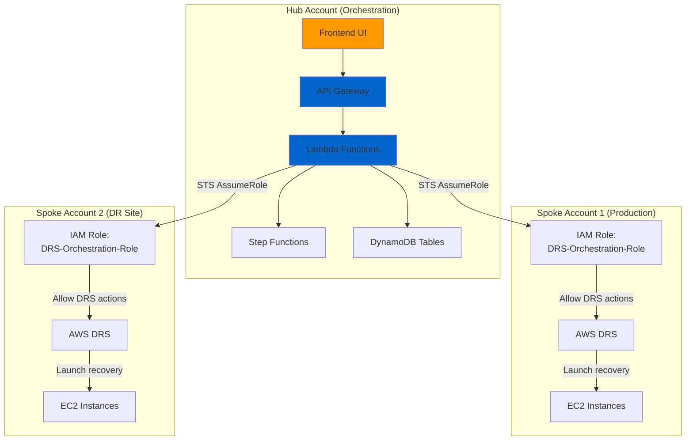

**IAM Role Trust Policy** (in spoke accounts):
```json
{
  "Version": "2012-10-17",
  "Statement": [
    {
      "Effect": "Allow",
      "Principal": {
        "AWS": "arn:aws:iam::HUB_ACCOUNT:role/DRS-Orchestration-Lambda-Role"
      },
      "Action": "sts:AssumeRole",
      "Condition": {
        "StringEquals": {
          "sts:ExternalId": "drs-orchestration-external-id-12345"
        }
      }
    }
  ]
}
```

**IAM Role Permissions Policy** (in spoke accounts):
```json
{
  "Version": "2012-10-17",
  "Statement": [
    {
      "Effect": "Allow",
      "Action": [
        "drs:DescribeSourceServers",
        "drs:StartRecovery",
        "drs:DescribeJobs",
        "drs:TerminateRecoveryInstances"
      ],
      "Resource": "*"
    },
    {
      "Effect": "Allow",
      "Action": [
        "ec2:DescribeInstances",
        "ec2:DescribeInstanceStatus"
      ],
      "Resource": "*"
    }
  ]
}
```

---

## Deployment Architecture

### CloudFormation Stack Structure

```mermaid
graph TD
    MASTER[Master Template<br/>master-template.yaml<br/>Root Orchestrator]
    
    MASTER --> DB[Database Stack<br/>database-stack.yaml<br/>DynamoDB Tables]
    MASTER --> LAMBDA_STACK[Lambda Stack<br/>lambda-stack.yaml<br/>5 Lambda Functions]
    MASTER --> API_STACK[API Stack<br/>api-stack.yaml<br/>API Gateway + Cognito]
    MASTER --> STEPFN_STACK[Step Functions Stack<br/>step-functions-stack.yaml<br/>Orchestration Engine]
    MASTER --> SECURITY[Security Stack<br/>security-stack.yaml<br/>WAF + CloudTrail]
    MASTER --> FRONTEND[Frontend Stack<br/>frontend-stack.yaml<br/>S3 + CloudFront]
    
    DB --> DDB_PG[DynamoDB Table:<br/>Protection Groups]
    DB --> DDB_RP[DynamoDB Table:<br/>Recovery Plans]
    DB --> DDB_EH[DynamoDB Table:<br/>Execution History]
    
    LAMBDA_STACK --> LAMBDA_API[Lambda: API Handler<br/>CRUD + Execution Control]
    LAMBDA_STACK --> LAMBDA_ORCH[Lambda: Orchestration<br/>Step Functions Handler]
    LAMBDA_STACK --> LAMBDA_POLLER[Lambda: Execution Poller<br/>DRS Job Monitoring]
    LAMBDA_STACK --> LAMBDA_FINDER[Lambda: Execution Finder<br/>EventBridge Scheduled]
    LAMBDA_STACK --> LAMBDA_BUILDER[Lambda: Frontend Builder<br/>Custom Resource]
    
    API_STACK --> COGNITO[Cognito User Pool]
    API_STACK --> APIGW[API Gateway REST API]
    
    STEPFN_STACK --> STEPFN[Step Functions<br/>Pause/Resume Orchestration]
    
    SECURITY --> WAF[WAF Web ACL]
    SECURITY --> TRAIL[CloudTrail]
    
    FRONTEND --> S3_FE[S3 Bucket: Frontend]
    FRONTEND --> CF[CloudFront Distribution]
    
    style MASTER fill:#FF9900
    style DB fill:#0066CC
    style LAMBDA_STACK fill:#0066CC
    style API_STACK fill:#0066CC
    style STEPFN_STACK fill:#0066CC
    style SECURITY fill:#0066CC
    style FRONTEND fill:#0066CC
```

### Deployment Parameters

**Master Template Parameters**:
| Parameter | Description | Default | Required |
|-----------|-------------|---------|----------|
| Environment | Deployment environment | test | Yes |
| AdminEmail | Administrator email for Cognito | - | Yes |
| AllowedCIDRs | CIDR blocks for WAF whitelist | 0.0.0.0/0 | No |
| RetentionDays | CloudWatch Logs retention | 7 | No |
| EnableWAF | Enable WAF protection | true | No |

**Deployment Command**:
```bash
aws cloudformation create-stack \
  --stack-name drs-orchestration-test \
  --template-body file://cfn/master-template.yaml \
  --parameters \
    ParameterKey=Environment,ParameterValue=test \
    ParameterKey=AdminEmail,ParameterValue=admin@example.com \
  --capabilities CAPABILITY_IAM CAPABILITY_NAMED_IAM \
  --region us-east-1
```

**Deployment Time**:
- First deployment: ~15 minutes
- Updates: ~5-10 minutes (depends on changed resources)
- Deletion: ~10 minutes (includes custom resource cleanup)

---

### Regional Deployment

**Supported Regions** (13 AWS DRS-enabled regions):
```
us-east-1 (N. Virginia)
us-east-2 (Ohio)
us-west-1 (N. California)
us-west-2 (Oregon)
eu-west-1 (Ireland)
eu-west-2 (London)
eu-central-1 (Frankfurt)
ap-southeast-1 (Singapore)
ap-southeast-2 (Sydney)
ap-northeast-1 (Tokyo)
ap-south-1 (Mumbai)
ca-central-1 (Canada)
sa-east-1 (São Paulo)
```

**Multi-Region Deployment**:
- Deploy orchestration stack in **single control plane region** (e.g., us-east-1)
- Lambda can manage DRS in **all 13 regions** via boto3 client
- No need for per-region orchestration deployment

**Why Single Region**:
- DynamoDB tables global via DynamoDB Global Tables (if needed)
- Lambda functions can call DRS APIs cross-region
- CloudFront provides global CDN for frontend
- Simplifies operations (single stack to manage)

---

## Security Architecture

### Authentication Flow

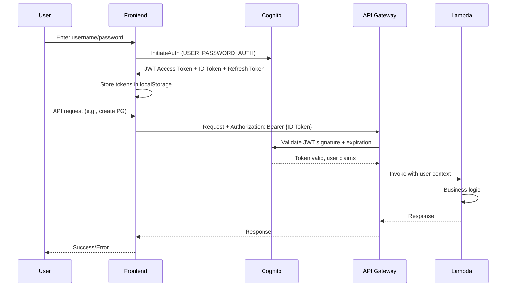

### RBAC Authorization System

**Role-Based Access Control (RBAC) Implementation**:

The system implements a comprehensive RBAC model with **5 roles** and **11 granular permissions** enforced through middleware in the API handler Lambda function.

#### RBAC Role Matrix

| Role | Permissions | Description |
|------|-------------|-------------|
| **DRSOrchestrationAdmin** | All permissions (`*`) | Full system administration |
| **DRSRecoveryManager** | `ExecuteRecovery`, `ManageExecution`, `TerminateInstances`, `ViewResources` | Recovery operations management |
| **DRSPlanManager** | `CreateProtectionGroup`, `UpdateProtectionGroup`, `CreateRecoveryPlan`, `UpdateRecoveryPlan`, `ViewResources` | DR planning and configuration |
| **DRSOperator** | `ExecuteRecovery`, `ViewResources` | Execute recovery operations only |
| **DRSReadOnly** | `ViewResources` | Read-only monitoring access |

#### Granular Permissions

| Permission | Description | Endpoints Protected |
|------------|-------------|-------------------|
| `drs:CreateProtectionGroup` | Create protection groups | `POST /protection-groups` |
| `drs:UpdateProtectionGroup` | Modify protection groups | `PUT /protection-groups/{id}` |
| `drs:DeleteProtectionGroup` | Delete protection groups | `DELETE /protection-groups/{id}` |
| `drs:CreateRecoveryPlan` | Create recovery plans | `POST /recovery-plans` |
| `drs:UpdateRecoveryPlan` | Modify recovery plans | `PUT /recovery-plans/{id}` |
| `drs:DeleteRecoveryPlan` | Delete recovery plans | `DELETE /recovery-plans/{id}` |
| `drs:ExecuteRecovery` | Start recovery executions | `POST /executions`, `POST /recovery-plans/{id}/execute` |
| `drs:ManageExecution` | Control running executions | `POST /executions/{id}/pause`, `POST /executions/{id}/resume`, `POST /executions/{id}/cancel` |
| `drs:TerminateInstances` | Terminate recovery instances | `POST /executions/{id}/terminate-instances` |
| `drs:ViewResources` | Read access to all resources | All `GET` endpoints |
| `drs:ManageAccounts` | Cross-account configuration | `/accounts/*` endpoints |

#### RBAC Middleware Implementation

```python
# lambda/rbac_middleware.py
import json
from typing import List, Dict, Any

class RBACMiddleware:
    """Role-Based Access Control middleware for API endpoints"""
    
    ROLE_PERMISSIONS = {
        'DRSOrchestrationAdmin': ['*'],  # All permissions
        'DRSRecoveryManager': [
            'drs:ExecuteRecovery',
            'drs:ManageExecution', 
            'drs:TerminateInstances',
            'drs:ViewResources'
        ],
        'DRSPlanManager': [
            'drs:CreateProtectionGroup',
            'drs:UpdateProtectionGroup',
            'drs:CreateRecoveryPlan',
            'drs:UpdateRecoveryPlan',
            'drs:ViewResources'
        ],
        'DRSOperator': [
            'drs:ExecuteRecovery',
            'drs:ViewResources'
        ],
        'DRSReadOnly': [
            'drs:ViewResources'
        ]
    }
    
    ENDPOINT_PERMISSIONS = {
        # Protection Groups
        ('POST', '/protection-groups'): 'drs:CreateProtectionGroup',
        ('PUT', '/protection-groups/*'): 'drs:UpdateProtectionGroup',
        ('DELETE', '/protection-groups/*'): 'drs:DeleteProtectionGroup',
        
        # Recovery Plans
        ('POST', '/recovery-plans'): 'drs:CreateRecoveryPlan',
        ('PUT', '/recovery-plans/*'): 'drs:UpdateRecoveryPlan',
        ('DELETE', '/recovery-plans/*'): 'drs:DeleteRecoveryPlan',
        ('POST', '/recovery-plans/*/execute'): 'drs:ExecuteRecovery',
        
        # Executions
        ('POST', '/executions'): 'drs:ExecuteRecovery',
        ('POST', '/executions/*/pause'): 'drs:ManageExecution',
        ('POST', '/executions/*/resume'): 'drs:ManageExecution',
        ('POST', '/executions/*/cancel'): 'drs:ManageExecution',
        ('POST', '/executions/*/terminate-instances'): 'drs:TerminateInstances',
        
        # Account Management
        ('POST', '/accounts'): 'drs:ManageAccounts',
        ('PUT', '/accounts/*'): 'drs:ManageAccounts',
        ('DELETE', '/accounts/*'): 'drs:ManageAccounts',
        
        # All GET endpoints require ViewResources
        ('GET', '*'): 'drs:ViewResources'
    }
    
    @classmethod
    def check_permission(cls, user_roles: List[str], required_permission: str) -> bool:
        """Check if user has required permission through any assigned role"""
        for role in user_roles:
            permissions = cls.ROLE_PERMISSIONS.get(role, [])
            if '*' in permissions or required_permission in permissions:
                return True
        return False
    
    @classmethod
    def authorize_request(cls, event: Dict[str, Any]) -> Dict[str, Any]:
        """Authorize API request based on JWT claims and endpoint"""
        # Extract user roles from JWT token
        jwt_claims = event.get('requestContext', {}).get('authorizer', {})
        user_roles = jwt_claims.get('cognito:groups', '').split(',')
        
        # Determine required permission for endpoint
        http_method = event.get('httpMethod', '')
        resource_path = event.get('resource', '')
        
        required_permission = cls._get_required_permission(http_method, resource_path)
        
        # Check authorization
        if not cls.check_permission(user_roles, required_permission):
            return {
                'statusCode': 403,
                'body': json.dumps({
                    'success': False,
                    'error': {
                        'message': f'Insufficient permissions. Required: {required_permission}',
                        'code': 'INSUFFICIENT_PERMISSIONS'
                    }
                })
            }
        
        return None  # Authorization successful
    
    @classmethod
    def _get_required_permission(cls, method: str, path: str) -> str:
        """Map HTTP method and path to required permission"""
        # Check exact matches first
        for (endpoint_method, endpoint_path), permission in cls.ENDPOINT_PERMISSIONS.items():
            if method == endpoint_method:
                if endpoint_path == '*' or path == endpoint_path or \
                   (endpoint_path.endswith('*') and path.startswith(endpoint_path[:-1])):
                    return permission
        
        # Default to ViewResources for GET requests
        if method == 'GET':
            return 'drs:ViewResources'
        
        # Deny by default for unmatched endpoints
        return 'drs:Admin'  # Requires admin access
```

#### Cognito Groups Integration

**Cognito User Pool Configuration**:
```json
{
  "UserPoolName": "drs-orchestration-users",
  "Policies": {
    "PasswordPolicy": {
      "MinimumLength": 8,
      "RequireUppercase": true,
      "RequireLowercase": true,
      "RequireNumbers": true,
      "RequireSymbols": true
    }
  },
  "AutoVerifiedAttributes": ["email"],
  "UsernameAttributes": ["email"],
  "Schema": [
    {
      "Name": "email",
      "AttributeDataType": "String",
      "Required": true,
      "Mutable": true
    }
  ]
}
```

**Cognito Groups for RBAC**:
```bash
# Create RBAC groups in Cognito User Pool
aws cognito-idp create-group \
  --group-name "DRSOrchestrationAdmin" \
  --user-pool-id us-east-1_XXXXXXXXX \
  --description "Full administrative access"

aws cognito-idp create-group \
  --group-name "DRSRecoveryManager" \
  --user-pool-id us-east-1_XXXXXXXXX \
  --description "Recovery operations management"

aws cognito-idp create-group \
  --group-name "DRSPlanManager" \
  --user-pool-id us-east-1_XXXXXXXXX \
  --description "DR planning and configuration"

aws cognito-idp create-group \
  --group-name "DRSOperator" \
  --user-pool-id us-east-1_XXXXXXXXX \
  --description "Execute recovery operations"

aws cognito-idp create-group \
  --group-name "DRSReadOnly" \
  --user-pool-id us-east-1_XXXXXXXXX \
  --description "Read-only monitoring access"
```

#### JWT Token Structure

**JWT Claims with RBAC Groups**:
```json
{
  "sub": "user-uuid",
  "email": "admin@example.com",
  "cognito:groups": ["DRSOrchestrationAdmin", "DRSRecoveryManager"],
  "cognito:username": "admin",
  "aud": "client-id",
  "iss": "https://cognito-idp.us-east-1.amazonaws.com/us-east-1_XXXXXXXXX",
  "exp": 1699999999,
  "iat": 1699996399
}
```

### AWS IAM Roles

1. **Lambda Execution Role** (`DRS-Orchestration-Lambda-Role`):
   ```json
   {
     "Version": "2012-10-17",
     "Statement": [
       {
         "Effect": "Allow",
         "Action": [
           "dynamodb:GetItem",
           "dynamodb:PutItem",
           "dynamodb:UpdateItem",
           "dynamodb:DeleteItem",
           "dynamodb:Query",
           "dynamodb:Scan"
         ],
         "Resource": [
           "arn:aws:dynamodb:*:*:table/drs-orchestration-protection-groups-*",
           "arn:aws:dynamodb:*:*:table/drs-orchestration-recovery-plans-*",
           "arn:aws:dynamodb:*:*:table/drs-orchestration-execution-history-*",
           "arn:aws:dynamodb:*:*:table/drs-orchestration-execution-history-*/index/StatusIndex"
         ]
       },
       {
         "Effect": "Allow",
         "Action": [
           "drs:DescribeSourceServers",
           "drs:StartRecovery",
           "drs:DescribeJobs",
           "drs:DescribeJobLogItems",
           "drs:CreateRecoveryInstanceForDrs",
           "drs:TerminateRecoveryInstances"
         ],
         "Resource": "*"
       },
       {
         "Effect": "Allow",
         "Action": [
           "ec2:DescribeInstances",
           "ec2:DescribeInstanceStatus",
           "ec2:TerminateInstances",
           "ec2:CreateLaunchTemplate",
           "ec2:CreateLaunchTemplateVersion"
         ],
         "Resource": "*"
       },
       {
         "Effect": "Allow",
         "Action": [
           "states:StartExecution",
           "states:DescribeExecution",
           "states:StopExecution",
           "states:SendTaskSuccess",
           "states:SendTaskFailure"
         ],
         "Resource": "arn:aws:states:*:*:stateMachine:drs-orchestration-*"
       },
       {
         "Effect": "Allow",
         "Action": ["logs:CreateLogGroup", "logs:CreateLogStream", "logs:PutLogEvents"],
         "Resource": "arn:aws:logs:*:*:*"
       },
       {
         "Effect": "Allow",
         "Action": ["sts:AssumeRole"],
         "Resource": "arn:aws:iam::*:role/DRS-Orchestration-CrossAccount-Role"
       }
     ]
   }
   ```

2. **Step Functions Execution Role**:
   ```json
   {
     "Version": "2012-10-17",
     "Statement": [
       {
         "Effect": "Allow",
         "Action": ["lambda:InvokeFunction"],
         "Resource": "arn:aws:lambda:*:*:function:drs-orchestration-*"
       }
     ]
   }
   ```

3. **Execution Poller Role** (`DRS-Orchestration-ExecutionPoller-Role`):
   ```json
   {
     "Version": "2012-10-17",
     "Statement": [
       {
         "Effect": "Allow",
         "Action": [
           "dynamodb:Query",
           "dynamodb:UpdateItem"
         ],
         "Resource": [
           "arn:aws:dynamodb:*:*:table/drs-orchestration-execution-history-*",
           "arn:aws:dynamodb:*:*:table/drs-orchestration-execution-history-*/index/StatusIndex"
         ]
       },
       {
         "Effect": "Allow",
         "Action": [
           "drs:DescribeJobs",
           "drs:DescribeJobLogItems"
         ],
         "Resource": "*"
       },
       {
         "Effect": "Allow",
         "Action": [
           "cloudwatch:PutMetricData"
         ],
         "Resource": "*"
       },
       {
         "Effect": "Allow",
         "Action": ["lambda:InvokeFunction"],
         "Resource": "arn:aws:lambda:*:*:function:drs-orchestration-execution-poller-*"
       }
     ]
   }
   ```

**Cognito Configuration**:
- Password Policy: Min 8 chars, uppercase, lowercase, numbers, symbols
- MFA: Optional (can enable per-user)
- Token Expiration: Access token 45 minutes, Refresh token 30 days
- User Attributes: email (required, verified)
- Groups: 5 RBAC groups for permission management

---

### Encryption

**Data at Rest**:
- **DynamoDB**: AWS-managed keys (SSE-S3), transparent encryption
- **S3**: Server-side encryption (SSE-S3 for frontend, SSE-KMS for Lambda packages)
- **CloudWatch Logs**: Encrypted with AWS-managed keys
- **Secrets Manager**: Encrypted with KMS customer-managed key (CMK)

**Data in Transit**:
- **Frontend ↔ CloudFront**: HTTPS only (TLS 1.2+)
- **CloudFront ↔ API Gateway**: HTTPS only
- **API Gateway ↔ Lambda**: AWS internal encryption
- **Lambda ↔ DynamoDB**: AWS internal encryption
- **Lambda ↔ DRS**: HTTPS (boto3 uses TLS)

**Encryption Key Management**:
- **AWS-Managed Keys**: Default for most services (free)
- **Customer-Managed Keys (CMK)**: Optional for Secrets Manager (Phase 2)
- **Key Rotation**: Automatic annual rotation for CMKs

---

### Network Security

**WAF Rules**:
1. **Rate Limiting**: 100 requests per 5 minutes per IP
2. **Geo-Blocking**: Optional (block countries if needed)
3. **SQL Injection Protection**: AWS Managed Rule Group
4. **XSS Protection**: AWS Managed Rule Group
5. **Known Bad Inputs**: AWS Managed Rule Group

**API Gateway Configuration**:
- **Endpoint Type**: Regional (not edge-optimized - CloudFront handles CDN)
- **Resource Policy**: None (Cognito authorizer handles auth)
- **Throttling**: 500 burst, 1,000 sustained requests/sec per region

**CloudFront Security**:
- **Origin Access Identity (OAI)**: S3 bucket only accessible via CloudFront
- **Viewer Protocol Policy**: Redirect HTTP to HTTPS
- **Allowed HTTP Methods**: GET, HEAD, OPTIONS, PUT, POST, PATCH, DELETE
- **Compress Objects Automatically**: Yes (gzip)

---

## EventBridge Security Architecture

### Security Enhancement Overview

Version 2.1 introduces comprehensive EventBridge security validation for automated tag synchronization operations, implementing multi-layer security controls to prevent unauthorized access and ensure enterprise-grade security compliance.

### Security Validation Layers

**1. Source IP Validation**
```python
def validate_source_ip(event: dict) -> bool:
    """Validate EventBridge request source IP against allowlist"""
    source_ip = event.get('source-ip', '')
    allowed_ranges = [
        '10.0.0.0/8',      # Internal VPC
        '172.16.0.0/12',   # Private networks
        '192.168.0.0/16'   # Local networks
    ]
    return any(ipaddress.ip_address(source_ip) in ipaddress.ip_network(range) 
               for range in allowed_ranges)
```

**2. Request Structure Validation**
```python
def validate_request_structure(event: dict) -> bool:
    """Validate EventBridge event structure and required fields"""
    required_fields = ['source', 'detail-type', 'detail', 'time']
    if not all(field in event for field in required_fields):
        return False
    
    # Validate source matches expected pattern
    if event['source'] != 'aws.events':
        return False
    
    # Validate detail-type for tag sync operations
    if event['detail-type'] != 'Scheduled Event':
        return False
    
    return True
```

**3. Rule Name Validation**
```python
def validate_rule_name(event: dict) -> bool:
    """Validate EventBridge rule name matches expected pattern"""
    rule_name = event.get('detail', {}).get('rule-name', '')
    expected_pattern = r'^aws-drs-orchestrator-tag-sync-(dev|test|prod)$'
    return bool(re.match(expected_pattern, rule_name))
```

### Security Audit Trail

**CloudWatch Logs Integration**:
```python
def log_security_event(event_type: str, details: dict, status: str):
    """Log security events for audit trail"""
    log_entry = {
        'timestamp': datetime.utcnow().isoformat() + 'Z',
        'event_type': event_type,
        'status': status,
        'source_ip': details.get('source_ip'),
        'rule_name': details.get('rule_name'),
        'validation_results': details.get('validation_results', {}),
        'request_id': details.get('request_id')
    }
    
    logger.info(json.dumps(log_entry))
```

---

## Tag Synchronization Architecture

### System Overview

The tag synchronization system automatically maintains consistency between EC2 instance tags and DRS source server tags, enabling tag-based server selection for Protection Groups while ensuring data integrity and security.

### Architecture Components

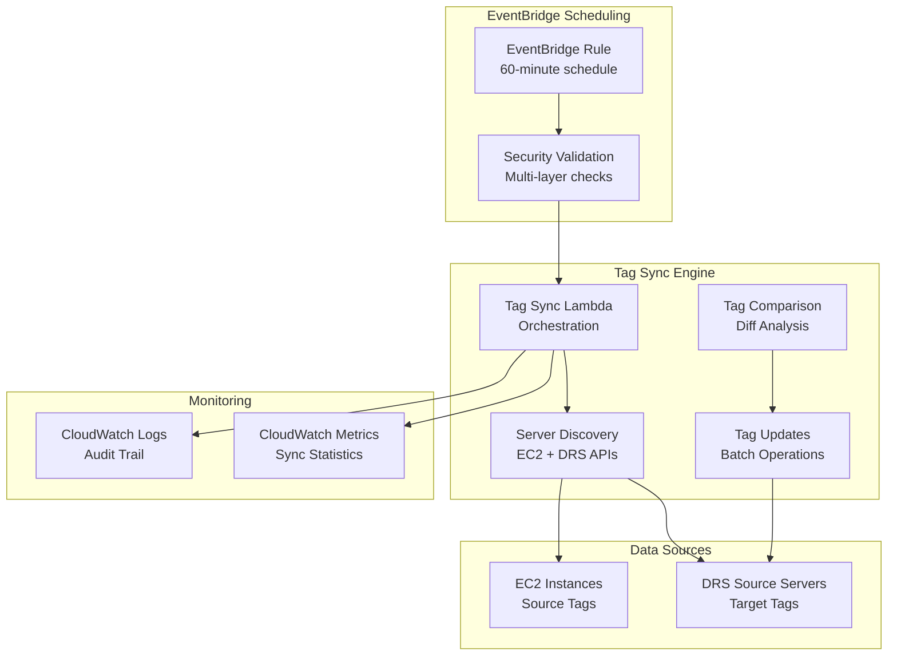

### Tag Synchronization Workflow

**1. Scheduled Trigger**:
```python
def lambda_handler(event, context):
    """Main tag synchronization handler with security validation"""
    
    # Security validation (EventBridge security architecture)
    if not validate_eventbridge_security(event):
        log_security_event('BLOCKED_REQUEST', event, 'SECURITY_VIOLATION')
        return {'statusCode': 403, 'body': 'Security validation failed'}
    
    # Execute tag synchronization
    sync_results = execute_tag_synchronization()
    
    # Log results for audit trail
    log_sync_results(sync_results)
    
    return {
        'statusCode': 200,
        'body': json.dumps(sync_results)
    }
```

**2. Server Discovery and Synchronization**:
```python
def synchronize_tags(region: str) -> dict:
    """Compare and synchronize tags between EC2 and DRS"""
    
    # Get EC2 instances with DRS-related tags
    ec2_instances = ec2_client.describe_instances(
        Filters=[
            {'Name': 'tag-key', 'Values': ['DRS-*', 'Environment', 'Application']},
            {'Name': 'instance-state-name', 'Values': ['running', 'stopped']}
        ]
    )
    
    # Get DRS source servers and match by instance ID
    drs_servers = drs_client.describe_source_servers()
    
    sync_results = {'updated_servers': 0, 'errors': []}
    
    for reservation in ec2_instances['Reservations']:
        for ec2_instance in reservation['Instances']:
            instance_id = ec2_instance['InstanceId']
            ec2_tags = {tag['Key']: tag['Value'] for tag in ec2_instance.get('Tags', [])}
            
            # Find corresponding DRS server
            drs_server = next(
                (server for server in drs_servers['items'] 
                 if server.get('sourceProperties', {}).get('identificationHints', {}).get('awsInstanceID') == instance_id),
                None
            )
            
            if drs_server and validate_tag_sync_security(ec2_tags):
                try:
                    drs_client.tag_resource(
                        resourceArn=f"arn:aws:drs:*:*:source-server/{drs_server['sourceServerID']}",
                        tags=ec2_tags
                    )
                    sync_results['updated_servers'] += 1
                except Exception as e:
                    sync_results['errors'].append({'server_id': instance_id, 'error': str(e)})
    
    return sync_results
```

---

## API Architecture

### Comprehensive REST API Design

**API Base URL**: `https://{api-id}.execute-api.{region}.amazonaws.com/prod`

**Current Implementation**: **42+ endpoints** across **12 categories**

**Authentication**: Bearer token (JWT from Cognito) with RBAC authorization

**Request Headers**:
```
Authorization: Bearer eyJraWQiOiI...
Content-Type: application/json
```

**Response Format**:
```json
{
  "success": true|false,
  "data": {...},  // On success
  "error": {      // On failure
    "message": "Error description",
    "code": "ERROR_CODE"
  }
}
```

**HTTP Status Codes**:
- 200 OK: Successful GET/PUT
- 201 Created: Successful POST
- 202 Accepted: Async operation started (execution)
- 204 No Content: Successful DELETE
- 400 Bad Request: Invalid input
- 401 Unauthorized: Missing/invalid JWT
- 403 Forbidden: Insufficient RBAC permissions
- 404 Not Found: Resource doesn't exist
- 409 Conflict: Duplicate name, server already assigned, active execution
- 500 Internal Server Error: Unexpected error

### RBAC Authorization System

**5 Roles with Granular Permissions**:

| Role | Permissions | Use Case |
|------|-------------|----------|
| **DRSOrchestrationAdmin** | All 11 permissions | Full administrative access |
| **DRSRecoveryManager** | Execute, manage, view operations | Recovery team leads |
| **DRSPlanManager** | Create/modify plans and groups | DR architects |
| **DRSOperator** | Execute recovery, view plans | Operations staff |
| **DRSReadOnly** | View-only access | Monitoring, auditing |

**11 Granular Permissions**:
1. `drs:CreateProtectionGroup` - Create protection groups
2. `drs:UpdateProtectionGroup` - Modify protection groups
3. `drs:DeleteProtectionGroup` - Delete protection groups
4. `drs:CreateRecoveryPlan` - Create recovery plans
5. `drs:UpdateRecoveryPlan` - Modify recovery plans
6. `drs:DeleteRecoveryPlan` - Delete recovery plans
7. `drs:ExecuteRecovery` - Start recovery executions
8. `drs:ManageExecution` - Pause/resume/cancel executions
9. `drs:TerminateInstances` - Terminate recovery instances
10. `drs:ViewResources` - Read access to all resources
11. `drs:ManageAccounts` - Cross-account configuration

**RBAC Middleware Implementation**:
```python
def check_permission(user_roles: List[str], required_permission: str) -> bool:
    """Check if user has required permission through any assigned role"""
    role_permissions = {
        'DRSOrchestrationAdmin': ['*'],  # All permissions
        'DRSRecoveryManager': [
            'drs:ExecuteRecovery', 'drs:ManageExecution', 
            'drs:TerminateInstances', 'drs:ViewResources'
        ],
        'DRSPlanManager': [
            'drs:CreateProtectionGroup', 'drs:UpdateProtectionGroup',
            'drs:CreateRecoveryPlan', 'drs:UpdateRecoveryPlan', 'drs:ViewResources'
        ],
        'DRSOperator': ['drs:ExecuteRecovery', 'drs:ViewResources'],
        'DRSReadOnly': ['drs:ViewResources']
    }
    
    for role in user_roles:
        permissions = role_permissions.get(role, [])
        if '*' in permissions or required_permission in permissions:
            return True
    return False
```

---

### Complete API Endpoint Catalog (42+ Endpoints)

#### 1. Protection Groups (6 endpoints)
```
GET    /protection-groups              # List with filtering (region, status, conflict)
POST   /protection-groups              # Create with tag-based or explicit server selection
GET    /protection-groups/{id}         # Get details with resolved server information
PUT    /protection-groups/{id}         # Update with optimistic locking
DELETE /protection-groups/{id}         # Delete (blocked if used in active plans)
POST   /protection-groups/resolve      # Preview servers matching tag criteria
```

#### 2. Recovery Plans (7 endpoints)
```
GET    /recovery-plans                 # List with execution history and conflict info
POST   /recovery-plans                 # Create with multi-wave configuration
GET    /recovery-plans/{id}            # Get details with wave dependencies
PUT    /recovery-plans/{id}            # Update with validation
DELETE /recovery-plans/{id}            # Delete (blocked if has active executions)
POST   /recovery-plans/{id}/execute    # Execute recovery plan (drill or recovery mode)
GET    /recovery-plans/{id}/check-existing-instances # Check for existing recovery instances
```

#### 3. Executions (11 endpoints)
```
GET    /executions                     # List with advanced filtering and pagination
POST   /executions                     # Start execution (alternative to recovery-plans execute)
GET    /executions/{id}                # Get detailed status and wave progress
POST   /executions/{id}/pause          # Pause execution between waves (waitForTaskToken)
POST   /executions/{id}/resume         # Resume paused execution via Step Functions callback
POST   /executions/{id}/cancel         # Cancel running execution
POST   /executions/{id}/terminate-instances # Terminate recovery instances after drill
GET    /executions/{id}/job-logs       # Get DRS job logs with real-time updates
GET    /executions/{id}/termination-status # Check instance termination job status
DELETE /executions                     # Bulk delete completed executions
POST   /executions/delete              # Delete specific executions by IDs
```

#### 4. DRS Integration (4 endpoints)
```
GET    /drs/source-servers             # Discover servers with assignment tracking
GET    /drs/quotas                     # Get service quotas and current usage
GET    /drs/accounts                   # Get account information and initialization status
GET    /drs/job-logs/{jobId}           # Get detailed DRS job event logs
```

#### 5. Account Management (6 endpoints)
```
GET    /accounts                       # List configured cross-account access
POST   /accounts                       # Add cross-account configuration
GET    /accounts/{accountId}           # Get account details and validation status
PUT    /accounts/{accountId}           # Update account configuration
DELETE /accounts/{accountId}           # Remove account access
POST   /accounts/{accountId}/validate  # Validate cross-account role access
```

#### 6. EC2 Resources (4 endpoints)
```
GET    /ec2/instances                  # List recovery instances across accounts
GET    /ec2/instances/{instanceId}     # Get instance details and health status
POST   /ec2/instances/terminate        # Terminate specific instances
GET    /ec2/launch-templates           # List DRS launch templates
```

#### 7. Configuration (4 endpoints)
```
GET    /config/settings                # Get system configuration
PUT    /config/settings                # Update system settings
GET    /config/regions                 # List supported DRS regions
GET    /config/health                  # System health check
```

#### 8. User Management (1 endpoint)
```
GET    /users/profile                  # Get current user profile and permissions
```

#### 9. Health Check (1 endpoint)
```
GET    /health                         # API health status (no auth required)
```

### Advanced Execution Control Flows

#### Pause/Resume Execution Flow
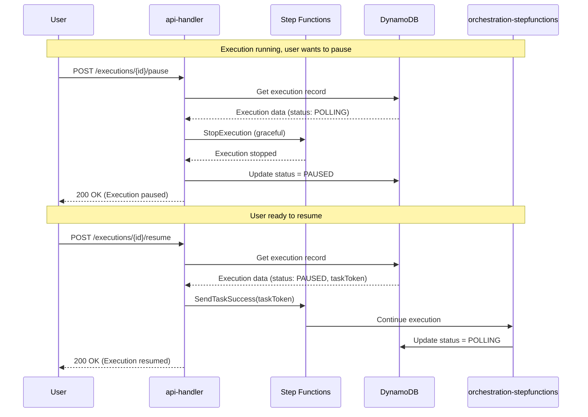

#### Cancel Execution Flow
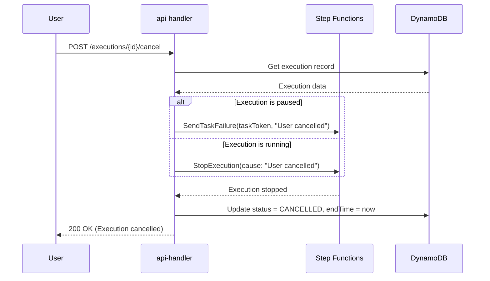

#### Terminate Instances Flow
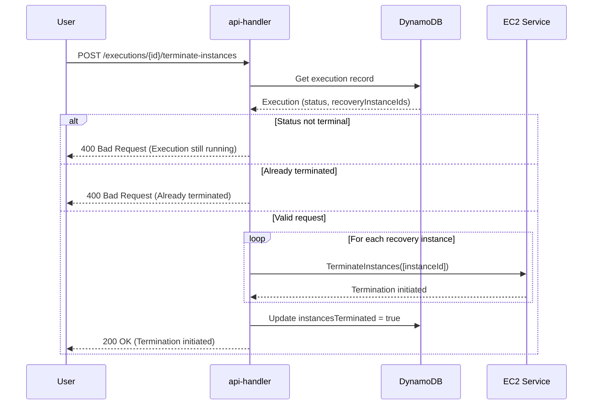

### Cross-Account Integration Patterns

#### Multi-Account DRS Operations
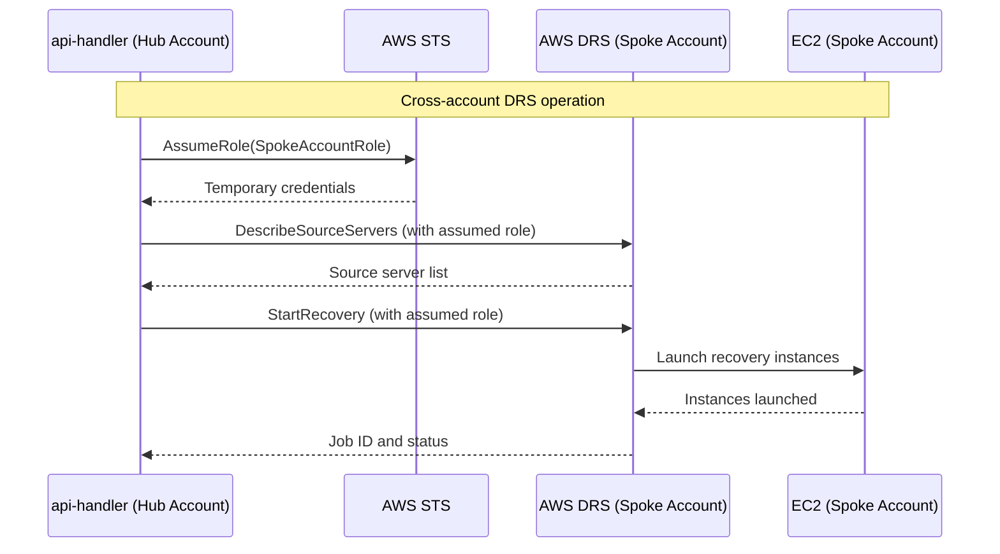

**Cross-Account IAM Configuration**:

**Hub Account Lambda Role**:
```json
{
  "Version": "2012-10-17",
  "Statement": [
    {
      "Effect": "Allow",
      "Action": "sts:AssumeRole",
      "Resource": "arn:aws:iam::*:role/DRS-Orchestration-CrossAccount-Role",
      "Condition": {
        "StringEquals": {
          "sts:ExternalId": "drs-orchestration-external-id"
        }
      }
    }
  ]
}
```

**Spoke Account Cross-Account Role**:
```json
{
  "Version": "2012-10-17",
  "Statement": [
    {
      "Effect": "Allow",
      "Principal": {
        "AWS": "arn:aws:iam::HUB_ACCOUNT:role/DRS-Orchestration-Lambda-Role"
      },
      "Action": "sts:AssumeRole",
      "Condition": {
        "StringEquals": {
          "sts:ExternalId": "drs-orchestration-external-id"
        }
      }
    }
  ]
}
```

### Real-Time Polling Mechanisms

#### Execution Status Polling Architecture
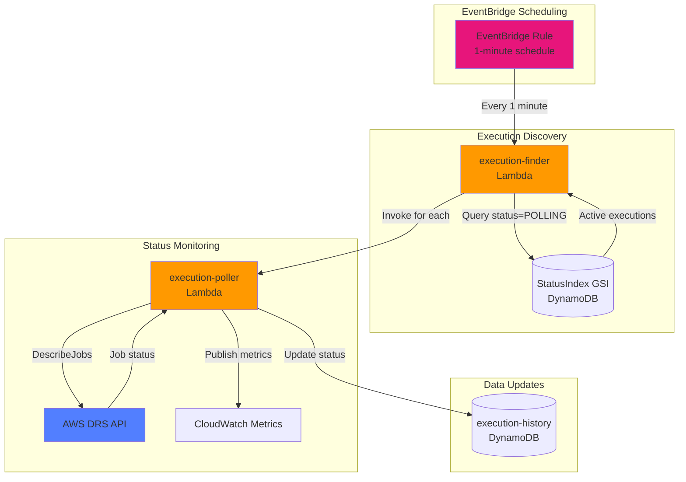

**Polling Logic Implementation**:
```python
def poll_execution_status(execution_id: str):
    """Poll DRS job status and update execution record"""
    # Get execution record
    execution = get_execution_from_dynamodb(execution_id)
    
    if execution['Status'] != 'POLLING':
        return  # Skip non-active executions
    
    # Poll all DRS jobs for this execution
    job_statuses = []
    for wave in execution['WaveStatus']:
        for job_id in wave.get('JobIds', []):
            job_status = drs_client.describe_jobs(
                filters={'jobIDs': [job_id]}
            )['items'][0]['status']
            job_statuses.append(job_status)
    
    # Determine overall execution status
    if all(status == 'COMPLETED' for status in job_statuses):
        update_execution_status(execution_id, 'COMPLETED')
    elif any(status == 'FAILED' for status in job_statuses):
        update_execution_status(execution_id, 'FAILED')
    # Continue polling if jobs still running
```

---

## Execution Engine Architecture

### Step Functions State Machine Detail

**State Machine ARN**: `arn:aws:states:{region}:{account}:stateMachine:DRS-Orchestration-{env}`

**Key Capabilities**:
- Wave-based sequential execution
- Pause/resume with callback pattern
- DRS job monitoring and polling
- Error handling and retry logic
- Task token management for user control

**Pause/Resume Implementation**:
```json
{
  "WaitForResume": {
    "Type": "Task",
    "Resource": "arn:aws:states:::lambda:invoke.waitForTaskToken",
    "Parameters": {
      "FunctionName": "orchestration-stepfunctions",
      "Payload": {
        "action": "pause_execution",
        "TaskToken.$": "$$.Task.Token",
        "ExecutionId.$": "$.execution_id",
        "PausedBeforeWave.$": "$.current_wave_number"
      }
    },
    "Next": "ResumeWavePlan"
  },
  
  "ResumeWavePlan": {
    "Type": "Task",
    "Resource": "arn:aws:lambda:...:function:orchestration-stepfunctions",
    "Parameters": {
      "action": "resume_wave",
      "execution_id.$": "$.execution_id",
      "current_wave_number.$": "$.current_wave_number"
    },
    "Next": "CheckAllWavesCompleted"
  }
}
```

**Execution Flow**:
1. **Initialize** - Validate plan and create execution record
2. **Process Waves** - Sequential wave execution with dependencies
3. **Launch Wave** - Start DRS recovery jobs for wave servers
4. **Monitor Jobs** - Poll DRS job status until completion
5. **Check Pause** - Pause between waves if requested
6. **Wait for Resume** - Use callback pattern for user control
7. **Complete** - Finalize execution and send notifications
