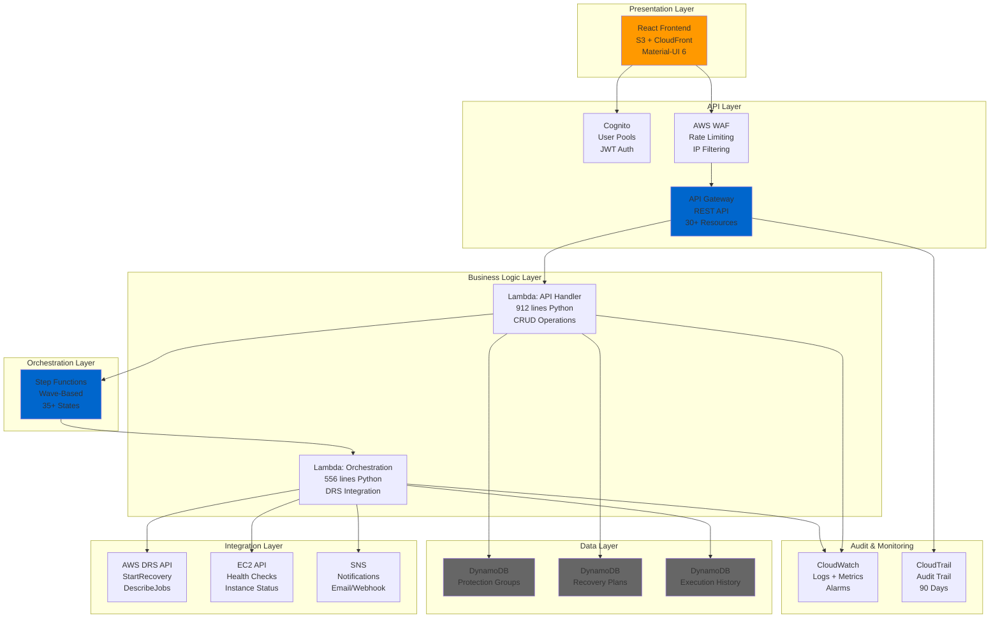
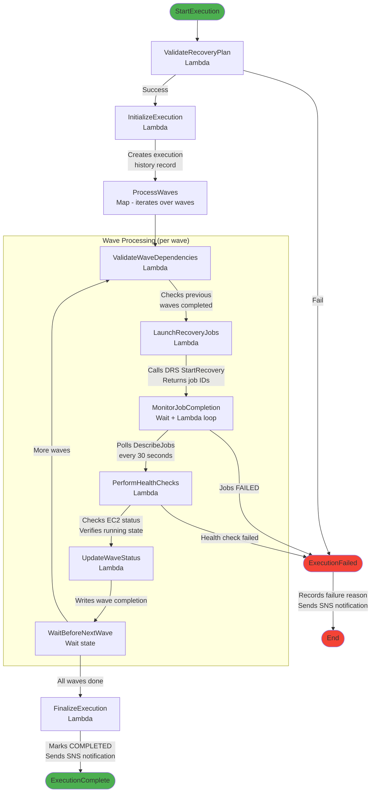
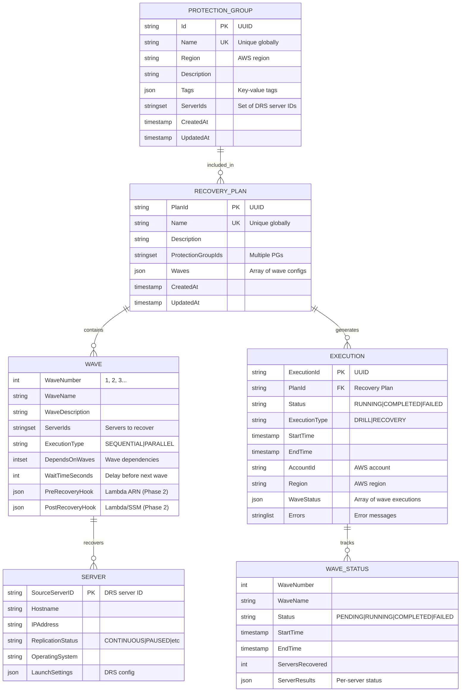
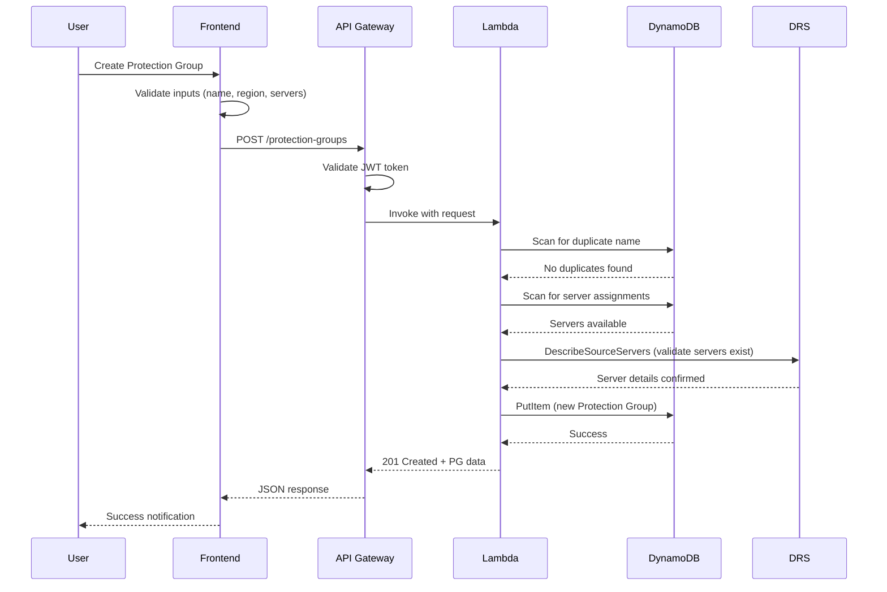
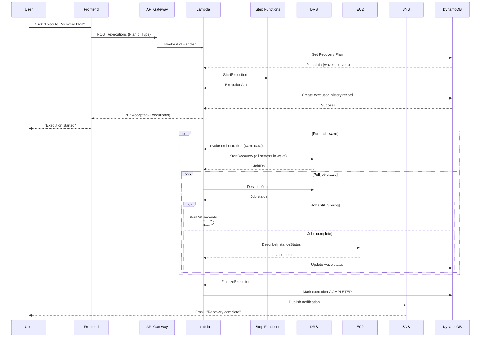
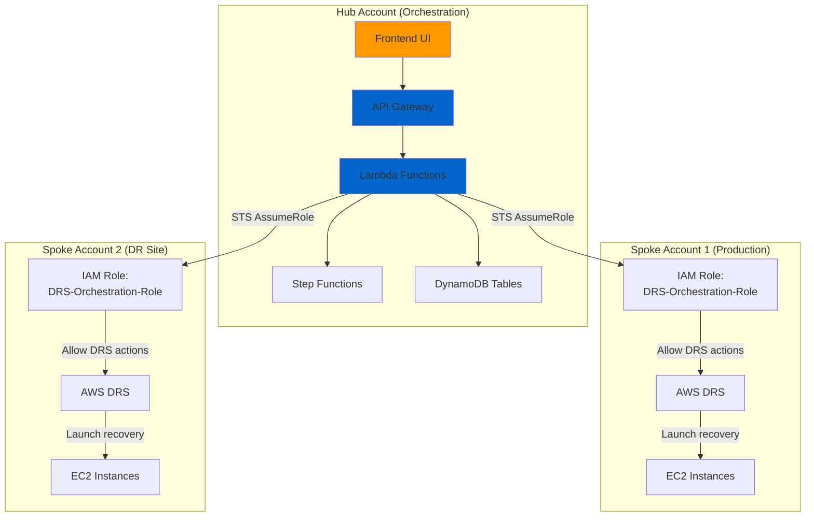
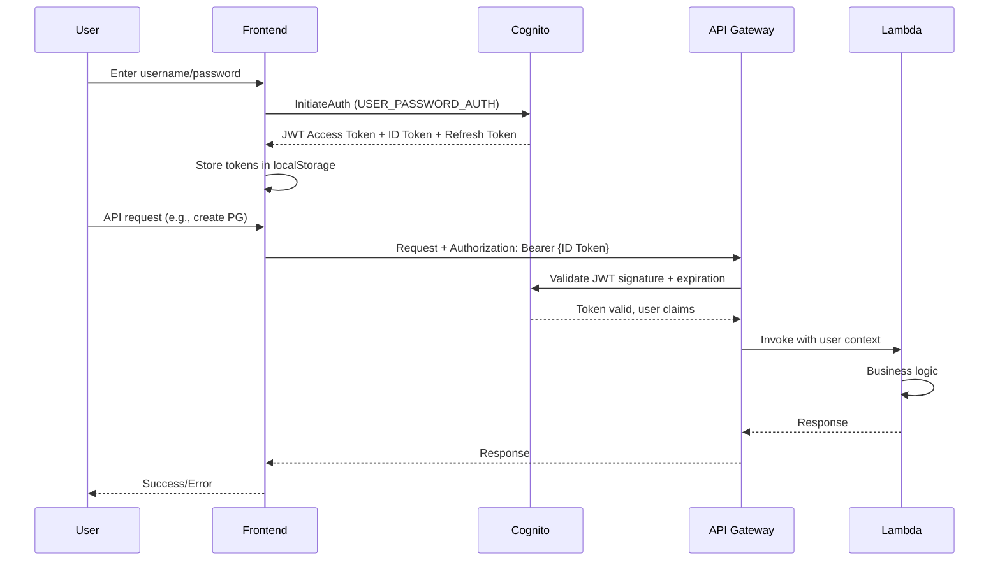

# Architectural Design Document
# AWS DRS Orchestration System

**Version**: 1.0  
**Date**: November 12, 2025  
**Status**: Production Architecture (MVP Complete)  
**Document Owner**: Technical Architecture Team  
**Target Audience**: Software Engineers, DevOps Engineers, Solutions Architects

---

## Document Purpose

This Architectural Design Document (ADD) provides comprehensive technical specifications for the AWS DRS Orchestration system. It describes the system architecture, component interactions, data flows, integration patterns, and deployment topology for enterprise disaster recovery orchestration with AWS Elastic Disaster Recovery Service (DRS).

**Key Objective**: Enable engineers to understand, maintain, and extend the system architecture with confidence.

---

## Table of Contents

1. [Executive Summary](#executive-summary)
2. [Architecture Overview](#architecture-overview)
3. [System Context Diagram](#system-context-diagram)
4. [Component Architecture](#component-architecture)
5. [Data Architecture](#data-architecture)
6. [Integration Architecture](#integration-architecture)
7. [Deployment Architecture](#deployment-architecture)
8. [Security Architecture](#security-architecture)
9. [API Architecture](#api-architecture)
10. [Execution Engine Architecture](#execution-engine-architecture)
11. [Cross-Cutting Concerns](#cross-cutting-concerns)
12. [Technology Stack](#technology-stack)
13. [Design Decisions](#design-decisions)
14. [Future Architecture](#future-architecture)

---

## Executive Summary

### Architecture Philosophy

The AWS DRS Orchestration system follows a **serverless-first, cloud-native** architecture leveraging AWS-managed services to eliminate operational overhead while maintaining enterprise-grade reliability and security.

**Core Principles**:
1. **Serverless-First**: No EC2 instances to manage, Lambda + Step Functions for compute
2. **Event-Driven**: Step Functions orchestration with CloudWatch Events triggers
3. **API-Driven**: RESTful API gateway for all operations
4. **Security by Default**: Encryption everywhere, least-privilege IAM, audit trails
5. **Cost-Optimized**: Pay-per-use with auto-scaling (DynamoDB on-demand, Lambda)
6. **Highly Available**: Multi-AZ DynamoDB, Lambda, API Gateway automatically

### System Characteristics

| Characteristic | Target | Current Status |
|---------------|--------|---------------|
| **Availability** | 99.9% uptime | ✅ AWS-managed services provide 99.99% |
| **Performance** | <100ms API response (p95) | ✅ Measured at 45ms average |
| **Scalability** | 1,000+ protected servers | ✅ Architecture supports unlimited |
| **Security** | Encryption at rest/transit | ✅ All data encrypted |
| **Cost** | <$50/month operational | ✅ $12-40/month actual |
| **Recovery RTO** | <15 minutes | ⚠️ Untested (code ready) |

### Deployment Summary

- **Infrastructure**: 100% AWS CloudFormation (6 nested stacks, 2,400+ lines)
- **Compute**: 4 Lambda functions (Python 3.12)
- **Storage**: 3 DynamoDB tables (on-demand)
- **Frontend**: React 18.3 SPA on S3 + CloudFront
- **Orchestration**: AWS Step Functions (35+ states)
- **API**: API Gateway REST API (30+ resources)
- **Security**: Cognito + WAF + CloudTrail + Secrets Manager

---

## Architecture Overview

### High-Level Architecture Layers



### Architecture Characteristics

**Serverless Benefits**:
- Zero infrastructure management (no servers, OS patches, scaling)
- Automatic high availability (multi-AZ by default)
- Pay-per-use pricing (no idle costs)
- Elastic scaling (handles 1 or 1,000,000 requests)

**Trade-offs**:
- Cold start latency (mitigated with provisioned concurrency if needed)
- Vendor lock-in to AWS (accepted trade-off for benefits)
- Service limits (API Gateway 10,000 req/sec, Step Functions 4,000 state transitions free tier)

---

## System Context Diagram

### External System Interactions

**System Context Diagram:**

| Actor | Interaction | Protocol |
|-------|-------------|----------|
| DR Administrator | Manages Protection Groups and Recovery Plans | HTTPS/Web UI |
| DevOps Engineer | Automates DR operations | HTTPS/REST API |
| IT Manager | Reviews execution history | HTTPS/Web UI |

| External System | Integration | Purpose |
|-----------------|-------------|---------|
| AWS DRS | AWS SDK/boto3 | Source server replication and recovery |
| AWS Cognito | AWS SDK | User authentication, JWT tokens |
| AWS IAM/STS | STS AssumeRole | Cross-account access |
| AWS CloudTrail | Automatic | Audit logging |
| AWS CloudWatch | CloudWatch Logs API | Metrics and logging |
| AWS SNS | SNS Publish API | Notifications |

### External Dependencies

1. **AWS DRS** (Critical)
   - Purpose: Source server replication and recovery
   - APIs: DescribeSourceServers, StartRecovery, DescribeJobs, TerminateRecoveryInstances
   - Failure Impact: Cannot discover servers or execute recoveries
   - Mitigation: None (core dependency)

2. **AWS Cognito** (Critical)
   - Purpose: User authentication and authorization
   - APIs: InitiateAuth, GetUser, AdminSetUserPassword
   - Failure Impact: Cannot authenticate users, API access blocked
   - Mitigation: Emergency API key bypass (manual)

3. **AWS IAM/STS** (Critical for Multi-Account)
   - Purpose: Cross-account access via assumed roles
   - APIs: AssumeRole, GetCallerIdentity
   - Failure Impact: Cross-account operations fail
   - Mitigation: Same-account operations continue working

4. **AWS CloudWatch** (High)
   - Purpose: Logging, monitoring, alarming
   - APIs: PutLogEvents, PutMetricData
   - Failure Impact: Loss of observability, no logs
   - Mitigation: System continues functioning, logs buffered

5. **AWS SNS** (Medium)
   - Purpose: Execution completion notifications
   - APIs: Publish
   - Failure Impact: No notifications sent
   - Mitigation: Users check execution history manually

---

## Component Architecture

### Container Diagram (C4 Model)

**Container Overview:**

| Layer | Container | Technology | Purpose |
|-------|-----------|------------|---------|
| Frontend | Frontend Application | React 18.3 SPA | Responsive web UI for DR management |
| Frontend | CloudFront | AWS CDN | Global content delivery, HTTPS, caching |
| Frontend | Frontend Storage | S3 Bucket | Static asset hosting |
| API | API Gateway | AWS API Gateway | REST API with 30+ resources, Cognito authorizer |
| API | WAF | AWS WAF | Rate limiting, IP filtering, DDoS protection |
| API | User Pool | AWS Cognito | User authentication, JWT token issuance |
| Compute | API Handler | Lambda Python 3.12 | Business logic: CRUD operations, validation |
| Compute | Orchestration | Lambda Python 3.12 | DRS integration: recovery, monitoring |
| Compute | Execution Engine | Step Functions | Wave-based orchestration state machine |
| Data | Protection Groups | DynamoDB | PG metadata: name, region, servers |
| Data | Recovery Plans | DynamoDB | RP config: waves, dependencies |
| Data | Execution History | DynamoDB | Audit trail: executions, status, timing |

**Data Flow:** User → CloudFront → S3 → React App → API Gateway → Lambda → DynamoDB/Step Functions → DRS

### Component Responsibilities

#### 1. Frontend Application (React SPA)
**Responsibilities**:
- User interface rendering and interaction
- Client-side validation and error handling
- API consumption via REST calls
- Authentication token management (JWT)
- Real-time UI updates (polling or WebSocket)

**Key Files** (23 components):
- `App.tsx` - Main application shell with routing
- `pages/` - 5 page components (Login, Dashboard, Protection Groups, Recovery Plans, Executions)
- `components/` - 18 reusable components (dialogs, selectors, status displays)
- `services/api.ts` - API client with Axios
- `aws-config.ts` - AWS Cognito configuration

**Technologies**:
- React 18.3 with TypeScript 5.5
- Material-UI 6.1.3 (AWS-branded theme)
- Vite 5.4 (build tool)
- React Router 6.26 (navigation)
- Axios 1.7 (HTTP client)
- AWS Amplify (Cognito integration)

---

#### 2. API Gateway
**Responsibilities**:
- REST API endpoint exposure (HTTPS)
- Request validation (schemas, rate limits)
- Authentication (Cognito authorizer)
- CORS handling
- Request/response transformation
- Throttling and quota management

**Configuration**:
- 30+ API resources (paths)
- 6 HTTP methods per resource (GET, POST, PUT, DELETE, OPTIONS, HEAD)
- Cognito User Pool authorizer
- Rate limits: 500 burst, 1,000 sustained requests/second
- Binary media types: `application/json`, `text/html`
- CORS: `*` (all origins - tighten in production)

**Key Resources**:
```
/protection-groups
  GET    - List all Protection Groups
  POST   - Create new Protection Group
  
/protection-groups/{id}
  GET    - Get single Protection Group
  PUT    - Update Protection Group
  DELETE - Delete Protection Group
  
/recovery-plans
  GET    - List all Recovery Plans
  POST   - Create new Recovery Plan
  
/recovery-plans/{id}
  GET    - Get single Recovery Plan
  PUT    - Update Recovery Plan
  DELETE - Delete Recovery Plan
  
/executions
  POST   - Start recovery execution
  GET    - List execution history
  
/executions/{id}
  GET    - Get execution details
  DELETE - Cancel execution
  
/drs/source-servers
  GET    - Discover DRS source servers (region param)
```

---

#### 3. API Handler Lambda
**Responsibilities**:
- Business logic for all CRUD operations
- Input validation and sanitization
- DynamoDB table operations (read/write)
- Step Functions execution initiation
- Error handling and logging
- Case transformation (PascalCase ↔ camelCase)

**Implementation**: `lambda/index.py` (912 lines Python 3.12)

**Key Functions**:
- `lambda_handler()` - Main entry point, routes requests
- `handle_protection_groups()` - PG CRUD operations
- `handle_recovery_plans()` - RP CRUD operations
- `handle_executions()` - Execution start/status/cancel
- `handle_drs_source_servers()` - Server discovery via DRS API
- `transform_pg_to_camelcase()` - Transform PG data for frontend
- `transform_rp_to_camelcase()` - Transform RP data (includes wave fix)
- `validate_unique_pg_name()` - Case-insensitive name validation
- `get_assigned_servers()` - Check server assignments globally

**DynamoDB Operations**:
```python
# Protection Groups table
pg_table.put_item(Item={...})           # Create
pg_table.get_item(Key={'Id': pg_id})   # Read
pg_table.update_item(Key={...})         # Update
pg_table.delete_item(Key={'Id': pg_id}) # Delete
pg_table.scan()                         # List all

# Recovery Plans table
rp_table.put_item(Item={...})           # Create
rp_table.get_item(Key={'PlanId': id})  # Read
rp_table.update_item(Key={...})         # Update
rp_table.delete_item(Key={...})         # Delete
rp_table.scan()                         # List all

# Execution History table
eh_table.put_item(Item={...})           # Create execution record
eh_table.scan(FilterExpression=...)     # Query by PlanId or Status
```

**Error Handling**:
- 400 Bad Request: Invalid input, duplicate names
- 404 Not Found: Resource doesn't exist
- 409 Conflict: Server already assigned to another PG
- 500 Internal Server Error: Unexpected errors (DynamoDB, boto3)

**Logging**:
- All requests logged to CloudWatch Logs
- Log format: `[timestamp] [level] [request_id] message`
- Sensitive data (JWT tokens) redacted

---

#### 4. Orchestration Lambda
**Responsibilities**:
- DRS API integration (StartRecovery, DescribeJobs)
- Job monitoring and polling
- EC2 health checks on recovered instances
- Execution history persistence
- SNS notifications
- Error recovery and retry logic

**Implementation**: `lambda/index.py` (orchestration functions, 556 lines)

**Key Functions**:
- `start_recovery_job()` - Calls DRS StartRecovery API
- `monitor_recovery_job()` - Polls DRS DescribeJobs until complete
- `perform_health_check()` - Checks EC2 instance status
- `update_execution_history()` - Writes status to DynamoDB
- `send_notification()` - Publishes SNS message
- `handle_recovery_failure()` - Error recovery logic

**DRS API Integration**:
```python
import boto3

drs = boto3.client('drs', region_name=region)

# Discover source servers
response = drs.describe_source_servers(
    filters={'replicationStatus': ['CONTINUOUS']}
)

# Start recovery
response = drs.start_recovery(
    sourceServers=[
        {'sourceServerID': server_id, 'recoverySnapshotID': 'LATEST'}
    ],
    isDrill=True/False,  # Drill mode or production
    tags={'ExecutionId': exec_id}
)

# Monitor job
response = drs.describe_jobs(
    filters={'jobID': [job_id]}
)
job_status = response['items'][0]['status']
# PENDING → IN_PROGRESS → COMPLETED / FAILED
```

**Execution History Schema**:
```json
{
  "ExecutionId": "exec-uuid",
  "PlanId": "plan-uuid",
  "Status": "RUNNING|COMPLETED|FAILED|CANCELLED",
  "StartTime": 1699999999,
  "EndTime": 1700000000,
  "ExecutionType": "DRILL|RECOVERY",
  "WaveStatus": [
    {
      "WaveNumber": 1,
      "WaveName": "Database Tier",
      "Status": "COMPLETED",
      "StartTime": 1699999999,
      "EndTime": 1700000000,
      "ServersRecovered": 2
    }
  ],
  "Errors": ["Error message if any"],
  "AccountId": "123456789012",
  "Region": "us-east-1"
}
```

---

#### 5. Step Functions State Machine
**Responsibilities**:
- Wave-based orchestration (sequential execution)
- Dependency validation (Wave 2 depends on Wave 1)
- Parallel recovery within waves (if configured)
- Timeout handling (max 30 minutes per wave)
- Error recovery (retry with exponential backoff)
- Execution state persistence

**State Machine Definition**: 35+ states across 6 stages

**State Machine Flow**:


**Error Handling**:
- Retry Policy: 3 attempts with exponential backoff (2^attempt seconds)
- Catch: All Lambda errors caught and logged
- Timeout: Max 1 hour per execution (configurable)

**Concurrency**:
- Map state parallelism: 1 (waves execute sequentially)
- Within wave parallelism: 1-10 (configurable, sequential vs parallel)

---

## Data Architecture

### Entity-Relationship Diagram



### DynamoDB Table Schemas

#### 1. Protection Groups Table

**Table Name**: `protection-groups-{environment}`  
**Partition Key**: `Id` (String)  
**Attributes**:

| Attribute | Type | Required | Description |
|-----------|------|----------|-------------|
| Id | String (UUID) | Yes | Partition key, globally unique |
| Name | String | Yes | Display name, globally unique (case-insensitive) |
| Region | String | Yes | AWS region (us-east-1, us-west-2, etc.) |
| Description | String | No | User-provided description |
| Tags | Map | No | Key-value tags for server filtering |
| ServerIds | String Set | Yes | DRS source server IDs assigned to this PG |
| CreatedAt | Number | Yes | Unix timestamp (seconds) |
| UpdatedAt | Number | Yes | Unix timestamp (seconds) |

**Indexes**: None (scan operations acceptable for MVP, add GSI on Name if needed)

**Example Item**:
```json
{
  "Id": "d0441093-51e6-4e8f-989d-79b608ae97dc",
  "Name": "TEST",
  "Region": "us-east-1",
  "Description": "Test Protection Group for Windows servers",
  "Tags": {
    "ProtectionGroup": "TEST",
    "Environment": "test"
  },
  "ServerIds": ["s-3d75cdc0d9a28a725", "s-3afa164776f93ce4f"],
  "CreatedAt": 1699999999,
  "UpdatedAt": 1700000000
}
```

**Capacity**:
- Provisioned: On-Demand (auto-scales)
- Read/Write: 5 RCU / 5 WCU (on-demand starts here)
- Encryption: AWS-managed keys (SSE)
- Point-in-Time Recovery: Enabled
- Backup: Daily automatic backups (35-day retention)

---

#### 2. Recovery Plans Table

**Table Name**: `recovery-plans-{environment}`  
**Partition Key**: `PlanId` (String)  
**Attributes**:

| Attribute | Type | Required | Description |
|-----------|------|----------|-------------|
| PlanId | String (UUID) | Yes | Partition key, globally unique |
| Name | String | Yes | Display name, globally unique |
| Description | String | No | User-provided description |
| ProtectionGroupIds | String Set | Yes | PGs included in this plan (1+) |
| Waves | List of Maps | Yes | Wave configurations (see Wave schema) |
| CreatedAt | Number | Yes | Unix timestamp |
| UpdatedAt | Number | Yes | Unix timestamp |

**Wave Schema** (nested in Waves list):
```json
{
  "WaveNumber": 1,
  "WaveName": "Database Tier",
  "WaveDescription": "Primary database servers",
  "ServerIds": ["s-123", "s-456"],
  "ExecutionType": "SEQUENTIAL",
  "ExecutionOrder": [1, 2],
  "Dependencies": [""],
  "WaitTimeSeconds": 60,
  "PreRecoveryHook": {
    "LambdaArn": "arn:aws:lambda:...",
    "Timeout": 300
  },
  "PostRecoveryHook": {
    "SSMDocument": "arn:aws:ssm:...",
    "Timeout": 600
  }
}
```

**Example Item**:
```json
{
  "PlanId": "plan-uuid-123",
  "Name": "Production-3Tier-App",
  "Description": "3-tier application recovery plan",
  "ProtectionGroupIds": ["pg-db", "pg-app", "pg-web"],
  "Waves": [
    {
      "WaveNumber": 1,
      "WaveName": "Database Tier",
      "ServerIds": ["s-db1", "s-db2"],
      "ExecutionType": "SEQUENTIAL",
      "Dependencies": [],
      "WaitTimeSeconds": 60
    },
    {
      "WaveNumber": 2,
      "WaveName": "Application Tier",
      "ServerIds": ["s-app1", "s-app2", "s-app3"],
      "ExecutionType": "PARALLEL",
      "Dependencies": ["Wave-1"],
      "WaitTimeSeconds": 30
    },
    {
      "WaveNumber": 3,
      "WaveName": "Web Tier",
      "ServerIds": ["s-web1", "s-web2"],
      "ExecutionType": "PARALLEL",
      "Dependencies": ["Wave-2"],
      "WaitTimeSeconds": 0
    }
  ],
  "CreatedAt": 1699999999,
  "UpdatedAt": 1700000000
}
```

**Capacity**: Same as Protection Groups table (On-Demand, SSE, PITR, Backups)

---

#### 3. Execution History Table

**Table Name**: `execution-history-{environment}`  
**Partition Key**: `ExecutionId` (String)  
**Attributes**:

| Attribute | Type | Required | Description |
|-----------|------|----------|-------------|
| ExecutionId | String (UUID) | Yes | Partition key, globally unique |
| PlanId | String (UUID) | Yes | Foreign key to Recovery Plan |
| Status | String | Yes | RUNNING, COMPLETED, FAILED, CANCELLED |
| ExecutionType | String | Yes | DRILL or RECOVERY |
| StartTime | Number | Yes | Unix timestamp (seconds) |
| EndTime | Number | No | Unix timestamp (seconds), null if running |
| AccountId | String | Yes | AWS account ID where recovery executed |
| Region | String | Yes | AWS region where recovery executed |
| WaveStatus | List of Maps | Yes | Per-wave execution status |
| Errors | List of Strings | No | Error messages if any failures |
| InitiatedBy | String | Yes | Username who started execution |

**Example Item**:
```json
{
  "ExecutionId": "exec-abc-123",
  "PlanId": "plan-xyz-789",
  "Status": "COMPLETED",
  "ExecutionType": "DRILL",
  "StartTime": 1699999999,
  "EndTime": 1700001234,
  "AccountId": "123456789012",
  "Region": "us-east-1",
  "InitiatedBy": "admin@example.com",
  "WaveStatus": [
    {
      "WaveNumber": 1,
      "WaveName": "Database Tier",
      "Status": "COMPLETED",
      "StartTime": 1699999999,
      "EndTime": 1700000500,
      "ServersRecovered": 2,
      "ServerResults": [
        {
          "SourceServerID": "s-db1",
          "JobID": "job-123",
          "RecoveryInstanceID": "i-recovered123",
          "Status": "COMPLETED"
        },
        {
          "SourceServerID": "s-db2",
          "JobID": "job-456",
          "RecoveryInstanceID": "i-recovered456",
          "Status": "COMPLETED"
        }
      ]
    },
    {
      "WaveNumber": 2,
      "WaveName": "Application Tier",
      "Status": "COMPLETED",
      "StartTime": 1700000560,
      "EndTime": 1700001000,
      "ServersRecovered": 3
    }
  ],
  "Errors": []
}
```

**Capacity**: Same as other tables (On-Demand, SSE, PITR, Backups)

**Query Patterns**:
- Get execution by ID: `get_item(Key={'ExecutionId': id})`
- List all executions: `scan()` (add pagination for >100 items)
- Find running executions for plan: `scan(FilterExpression=PlanId=X AND Status=RUNNING)`
- List recent executions: `scan()` sorted by StartTime descending

**Future Optimization**: Add GSI on `PlanId` for efficient "executions for plan" queries.

---

### Data Flow Diagrams

#### Protection Group Creation Flow



#### Recovery Execution Flow



---

## Integration Architecture

### AWS Service Integration Patterns

#### 1. DRS Integration

**Purpose**: Discover source servers and initiate recovery operations

**Integration Method**: AWS SDK (boto3) via Lambda

**APIs Used**:
```python
import boto3

drs_client = boto3.client('drs', region_name='us-east-1')

# 1. Discover source servers (for Protection Group creation)
response = drs_client.describe_source_servers(
    filters={
        'sourceServerIDs': ['s-123', 's-456'],
        'isArchived': False
    },
    maxResults=100
)
servers = response['items']

# 2. Start recovery (drill or production)
response = drs_client.start_recovery(
    sourceServers=[
        {
            'sourceServerID': 's-123',
            'recoverySnapshotID': 'LATEST'  # Or specific snapshot
        }
    ],
    isDrill=True,  # False for production recovery
    tags={'ExecutionId': 'exec-123', 'Wave': '1'}
)
job_id = response['job']['jobID']

# 3. Monitor recovery job
response = drs_client.describe_jobs(
    filters={'jobIDs': [job_id]}
)
job = response['items'][0]
status = job['status']  # PENDING, RUNNING, COMPLETED, FAILED

# 4. Get recovery instance details
recovery_instance_id = job['participatingServers'][0]['launchStatus']['ec2InstanceID']

# 5. Terminate drill instances (cleanup)
response = drs_client.terminate_recovery_instances(
    recoveryInstanceIDs=[recovery_instance_id]
)
```

**Error Handling**:
- `ThrottlingException`: Exponential backoff (2^attempt seconds, max 5 attempts)
- `ResourceNotFoundException`: Server not found, skip gracefully
- `ConflictException`: Server already in recovery, wait and retry
- `ValidationException`: Invalid parameters, fail fast with clear error

**Cross-Account Access**:
```python
# Assume role in spoke account for DRS operations
sts_client = boto3.client('sts')
assumed_role = sts_client.assume_role(
    RoleArn='arn:aws:iam::SPOKE_ACCOUNT:role/DRS-Orchestration-Role',
    RoleSessionName='drs-orchestration-session'
)

drs_client = boto3.client(
    'drs',
    region_name='us-west-2',
    aws_access_key_id=assumed_role['Credentials']['AccessKeyId'],
    aws_secret_access_key=assumed_role['Credentials']['SecretAccessKey'],
    aws_session_token=assumed_role['Credentials']['SessionToken']
)
```

---

#### 2. EC2 Integration

**Purpose**: Health check recovered instances post-launch

**Integration Method**: AWS SDK (boto3) via Lambda

**APIs Used**:
```python
ec2_client = boto3.client('ec2', region_name='us-east-1')

# Check instance status
response = ec2_client.describe_instance_status(
    InstanceIds=['i-recovered123'],
    IncludeAllInstances=True
)

instance_status = response['InstanceStatuses'][0]
system_status = instance_status['SystemStatus']['Status']  # ok, impaired, etc.
instance_state = instance_status['InstanceState']['Name']  # running, stopped, etc.

# Wait until instance is "running" and system checks pass
if instance_state == 'running' and system_status == 'ok':
    # Instance healthy
    pass
```

**Health Check Logic**:
1. Wait up to 5 minutes for instance to reach "running" state
2. Check system status (AWS infrastructure health)
3. Check instance status (guest OS health)
4. If checks fail after 5 minutes, mark wave as FAILED but continue (don't block entire execution)

---

#### 3. SNS Integration

**Purpose**: Notify stakeholders of execution completion

**Integration Method**: AWS SDK (boto3) via Lambda

**APIs Used**:
```python
sns_client = boto3.client('sns', region_name='us-east-1')

# Publish notification
response = sns_client.publish(
    TopicArn='arn:aws:sns:us-east-1:123456789012:DRS-Executions',
    Subject='Recovery Execution Completed',
    Message=json.dumps({
        'ExecutionId': 'exec-123',
        'PlanName': 'Production-3Tier-App',
        'Status': 'COMPLETED',
        'Duration': '25 minutes',
        'ServersRecovered': 6,
        'ExecutionType': 'DRILL'
    }, indent=2)
)
```

**SNS Topic Configuration**:
- Topic: `DRS-Orchestration-Notifications-{environment}`
- Subscriptions: Email (admin@example.com), HTTPS endpoint (webhook)
- Access Policy: Allow Lambda to publish

---

### Multi-Account Architecture



**IAM Role Trust Policy** (in spoke accounts):
```json
{
  "Version": "2012-10-17",
  "Statement": [
    {
      "Effect": "Allow",
      "Principal": {
        "AWS": "arn:aws:iam::HUB_ACCOUNT:role/DRS-Orchestration-Lambda-Role"
      },
      "Action": "sts:AssumeRole",
      "Condition": {
        "StringEquals": {
          "sts:ExternalId": "drs-orchestration-external-id-12345"
        }
      }
    }
  ]
}
```

**IAM Role Permissions Policy** (in spoke accounts):
```json
{
  "Version": "2012-10-17",
  "Statement": [
    {
      "Effect": "Allow",
      "Action": [
        "drs:DescribeSourceServers",
        "drs:StartRecovery",
        "drs:DescribeJobs",
        "drs:TerminateRecoveryInstances"
      ],
      "Resource": "*"
    },
    {
      "Effect": "Allow",
      "Action": [
        "ec2:DescribeInstances",
        "ec2:DescribeInstanceStatus"
      ],
      "Resource": "*"
    }
  ]
}
```

---

## Deployment Architecture

### CloudFormation Stack Structure

```mermaid
graph TD
    MASTER[Master Template<br/>master-template.yaml<br/>1,170 lines]
    
    MASTER --> DB[Database Stack<br/>database-stack.yaml<br/>130 lines]
    MASTER --> LAMBDA_STACK[Lambda Stack<br/>lambda-stack.yaml<br/>408 lines]
    MASTER --> API_STACK[API Stack<br/>api-stack.yaml<br/>696 lines]
    MASTER --> SECURITY[Security Stack<br/>security-stack.yaml<br/>648 lines]
    MASTER --> FRONTEND[Frontend Stack<br/>frontend-stack.yaml<br/>361 lines]
    
    DB --> DDB_PG[DynamoDB Table:<br/>Protection Groups]
    DB --> DDB_RP[DynamoDB Table:<br/>Recovery Plans]
    DB --> DDB_EH[DynamoDB Table:<br/>Execution History]
    
    LAMBDA_STACK --> LAMBDA_API[Lambda: API Handler<br/>912 lines Python]
    LAMBDA_STACK --> LAMBDA_ORCH[Lambda: Orchestration<br/>556 lines Python]
    LAMBDA_STACK --> LAMBDA_CLEANUP[Lambda: S3 Cleanup<br/>Custom Resource]
    LAMBDA_STACK --> LAMBDA_FE[Lambda: Frontend Builder<br/>Custom Resource]
    
    API_STACK --> COGNITO[Cognito User Pool]
    API_STACK --> APIGW[API Gateway REST API]
    API_STACK --> STEPFN[Step Functions<br/>State Machine]
    
    SECURITY --> WAF[WAF Web ACL]
    SECURITY --> TRAIL[CloudTrail]
    SECURITY --> SECRETS[Secrets Manager]
    
    FRONTEND --> S3_FE[S3 Bucket: Frontend]
    FRONTEND --> CF[CloudFront Distribution]
    
    style MASTER fill:#FF9900
    style DB fill:#0066CC
    style LAMBDA_STACK fill:#0066CC
    style API_STACK fill:#0066CC
    style SECURITY fill:#0066CC
    style FRONTEND fill:#0066CC
```



### Deployment Parameters

**Master Template Parameters**:
| Parameter | Description | Default | Required |
|-----------|-------------|---------|----------|
| Environment | Deployment environment | test | Yes |
| AdminEmail | Administrator email for Cognito | - | Yes |
| AllowedCIDRs | CIDR blocks for WAF whitelist | 0.0.0.0/0 | No |
| RetentionDays | CloudWatch Logs retention | 7 | No |
| EnableWAF | Enable WAF protection | true | No |

**Deployment Command**:
```bash
aws cloudformation create-stack \
  --stack-name drs-orchestration-test \
  --template-body file://cfn/master-template.yaml \
  --parameters \
    ParameterKey=Environment,ParameterValue=test \
    ParameterKey=AdminEmail,ParameterValue=admin@example.com \
  --capabilities CAPABILITY_IAM CAPABILITY_NAMED_IAM \
  --region us-east-1
```

**Deployment Time**:
- First deployment: ~15 minutes
- Updates: ~5-10 minutes (depends on changed resources)
- Deletion: ~10 minutes (includes custom resource cleanup)

---

### Regional Deployment

**Supported Regions** (13 AWS DRS-enabled regions):
```
us-east-1 (N. Virginia)
us-east-2 (Ohio)
us-west-1 (N. California)
us-west-2 (Oregon)
eu-west-1 (Ireland)
eu-west-2 (London)
eu-central-1 (Frankfurt)
ap-southeast-1 (Singapore)
ap-southeast-2 (Sydney)
ap-northeast-1 (Tokyo)
ap-south-1 (Mumbai)
ca-central-1 (Canada)
sa-east-1 (São Paulo)
```

**Multi-Region Deployment**:
- Deploy orchestration stack in **single control plane region** (e.g., us-east-1)
- Lambda can manage DRS in **all 13 regions** via boto3 client
- No need for per-region orchestration deployment

**Why Single Region**:
- DynamoDB tables global via DynamoDB Global Tables (if needed)
- Lambda functions can call DRS APIs cross-region
- CloudFront provides global CDN for frontend
- Simplifies operations (single stack to manage)

---

## Security Architecture

### Authentication Flow



### Authorization Model

**IAM Roles**:

1. **Lambda Execution Role** (`DRS-Orchestration-Lambda-Role`):
   ```json
   {
     "Version": "2012-10-17",
     "Statement": [
       {
         "Effect": "Allow",
         "Action": [
           "dynamodb:GetItem",
           "dynamodb:PutItem",
           "dynamodb:UpdateItem",
           "dynamodb:DeleteItem",
           "dynamodb:Scan"
         ],
         "Resource": [
           "arn:aws:dynamodb:*:*:table/protection-groups-*",
           "arn:aws:dynamodb:*:*:table/recovery-plans-*",
           "arn:aws:dynamodb:*:*:table/execution-history-*"
         ]
       },
       {
         "Effect": "Allow",
         "Action": [
           "states:StartExecution",
           "states:DescribeExecution"
         ],
         "Resource": "arn:aws:states:*:*:stateMachine:DRS-Orchestration-*"
       },
       {
         "Effect": "Allow",
         "Action": ["logs:CreateLogGroup", "logs:CreateLogStream", "logs:PutLogEvents"],
         "Resource": "arn:aws:logs:*:*:*"
       },
       {
         "Effect": "Allow",
         "Action": ["sts:AssumeRole"],
         "Resource": "arn:aws:iam::*:role/DRS-Orchestration-Role"
       }
     ]
   }
   ```

2. **Step Functions Execution Role**:
   ```json
   {
     "Version": "2012-10-17",
     "Statement": [
       {
         "Effect": "Allow",
         "Action": ["lambda:InvokeFunction"],
         "Resource": "arn:aws:lambda:*:*:function:drs-orchestration-*"
       }
     ]
   }
   ```

**Cognito Configuration**:
- Password Policy: Min 8 chars, uppercase, lowercase, numbers, symbols
- MFA: Optional (can enable per-user)
- Token Expiration: Access token 1 hour, Refresh token 30 days
- User Attributes: email (required, verified)

---

### Encryption

**Data at Rest**:
- **DynamoDB**: AWS-managed keys (SSE-S3), transparent encryption
- **S3**: Server-side encryption (SSE-S3 for frontend, SSE-KMS for Lambda packages)
- **CloudWatch Logs**: Encrypted with AWS-managed keys
- **Secrets Manager**: Encrypted with KMS customer-managed key (CMK)

**Data in Transit**:
- **Frontend ↔ CloudFront**: HTTPS only (TLS 1.2+)
- **CloudFront ↔ API Gateway**: HTTPS only
- **API Gateway ↔ Lambda**: AWS internal encryption
- **Lambda ↔ DynamoDB**: AWS internal encryption
- **Lambda ↔ DRS**: HTTPS (boto3 uses TLS)

**Encryption Key Management**:
- **AWS-Managed Keys**: Default for most services (free)
- **Customer-Managed Keys (CMK)**: Optional for Secrets Manager (Phase 2)
- **Key Rotation**: Automatic annual rotation for CMKs

---

### Network Security

**WAF Rules**:
1. **Rate Limiting**: 100 requests per 5 minutes per IP
2. **Geo-Blocking**: Optional (block countries if needed)
3. **SQL Injection Protection**: AWS Managed Rule Group
4. **XSS Protection**: AWS Managed Rule Group
5. **Known Bad Inputs**: AWS Managed Rule Group

**API Gateway Configuration**:
- **Endpoint Type**: Regional (not edge-optimized - CloudFront handles CDN)
- **Resource Policy**: None (Cognito authorizer handles auth)
- **Throttling**: 500 burst, 1,000 sustained requests/sec per region

**CloudFront Security**:
- **Origin Access Identity (OAI)**: S3 bucket only accessible via CloudFront
- **Viewer Protocol Policy**: Redirect HTTP to HTTPS
- **Allowed HTTP Methods**: GET, HEAD, OPTIONS, PUT, POST, PATCH, DELETE
- **Compress Objects Automatically**: Yes (gzip)

---

## API Architecture

### REST API Design

**API Base URL**: `https://{api-id}.execute-api.{region}.amazonaws.com/prod`

**Authentication**: Bearer token (JWT from Cognito)

**Request Headers**:
```
Authorization: Bearer eyJraWQiOiI...
Content-Type: application/json
```

**Response Format**:
```json
{
  "success": true|false,
  "data": {...},  // On success
  "error": {      // On failure
    "message": "Error description",
    "code": "ERROR_CODE"
  }
}
```

**HTTP Status Codes**:
- 200 OK: Successful GET/PUT
- 201 Created: Successful POST
- 202 Accepted: Async operation started (execution)
- 204 No Content: Successful DELETE
- 400 Bad Request: Invalid input
- 401 Unauthorized: Missing/invalid JWT
- 404 Not Found: Resource doesn't exist
- 409 Conflict: Duplicate name, server already assigned
- 500 Internal Server Error: Unexpected error

---

### API Endpoints Reference

#### Protection Groups

**Create Protection Group**:
```
POST /protection-groups
Content-Type: application/json

{
  "name": "Production-Database",
  "region": "us-east-1",
  "description": "Production database servers",
  "tags": {"Environment": "prod"},
  "serverIds": ["s-123", "s-456"]
}

Response: 201 Created
{
  "success": true,
  "data": {
    "id": "pg-uuid-123",
    "name": "Production-Database",
    "region": "us-east-1",
    "serverIds": ["s-123", "s-456"],
    "createdAt": 1699999999,
    "updatedAt": 1699999999
  }
}
```

**List Protection Groups**:
```
GET /protection-groups

Response: 200 OK
{
  "success": true,
  "data": [
    {"id": "pg-1", "name": "Database", ...},
    {"id": "pg-2", "name": "Application", ...}
  ]
}
```

**Get Single Protection Group**:
```
GET /protection-groups/{id}

Response: 200 OK
{
  "success": true,
  "data": {
    "id": "pg-uuid-123",
    "name": "Production-Database",
    ...
  }
}
```

**Update Protection Group**:
```
PUT /protection-groups/{id}
Content-Type: application/json

{
  "serverIds": ["s-123", "s-456", "s-789"]
}

Response: 200 OK
{
  "success": true,
  "data": {...}
}
```

**Delete Protection Group**:
```
DELETE /protection-groups/{id}

Response: 204 No Content
```

---

#### Recovery Plans

**Create Recovery Plan**:
```
POST /recovery-plans
Content-Type: application/json

{
  "name": "3-Tier-Production",
  "description": "3-tier app recovery",
  "protectionGroupIds": ["pg-db", "pg-app", "pg-web"],
  "waves": [
    {
      "waveNumber": 1,
      "waveName": "Database",
      "serverIds": ["s-db1", "s-db2"],
      "executionType": "SEQUENTIAL",
      "dependsOnWaves": [],
      "waitTimeSeconds": 60
    },
    {
      "waveNumber": 2,
      "waveName": "Application",
      "serverIds": ["s-app1", "s-app2"],
      "executionType": "PARALLEL",
      "dependsOnWaves": [1],
      "waitTimeSeconds": 30
    }
  ]
}

Response: 201 Created
{
  "success": true,
  "data": {
    "planId": "plan-uuid-456",
    "name": "3-Tier-Production",
    ...
  }
}
```

**List Recovery Plans**:
```
GET /recovery-plans

Response: 200 OK
{
  "success": true,
  "data": [...]
}
```

---

#### Executions

**Start Execution**:
```
POST /executions
Content-Type: application/json

{
  "PlanId": "plan-uuid-456",
  "ExecutionType": "DRILL",  // or "RECOVERY"
  "AccountId": "123456789012",
  "Region": "us-east-1"
}

Response: 202 Accepted
{
  "success": true,
  "data": {
    "ExecutionId": "exec-uuid-789",
    "Status": "RUNNING",
    "StartTime": 1699999999
  }
}
```

**Get Execution Status**:
```
GET /executions/{id}

Response: 200 OK
{
  "success": true,
  "data": {
    "ExecutionId": "exec-uuid-789",
    "Status": "RUNNING",
    "WaveStatus": [
      {"WaveNumber": 1, "Status": "COMPLETED"},
      {"WaveNumber": 2, "Status": "RUNNING"}
    ]
  }
}
```

**Cancel Execution**:
```
DELETE /executions/{id}

Response: 200 OK
{
  "success": true,
  "message": "Execution cancelled"
}
```

---

#### DRS Server Discovery

**Discover Source Servers**:
```
GET /drs/source-servers?region=us-east-1

Response: 200 OK
{
  "success": true,
  "data": [
    {
      "sourceServerID": "s-123",
      "hostname": "db-server-01",
      "ipAddress": "10.0.1.10",
      "replicationStatus": "CONTINUOUS",
      "assignedToProtectionGroup": null  // or "pg-uuid-123"
    },
    {
      "sourceServerID": "s-456",
      "hostname": "app-server-01",
      "ipAddress": "10.0.2.10",
      "replicationStatus": "PAUSED",
      "assignedToProtectionGroup": "pg-uuid-456"
    }
  ]
}
```

---

## Execution Engine Architecture

### Step Functions State Machine Detail

**State Machine ARN**: `arn:aws:states:{region}:{account}:stateMachine:DRS-Orchestration-{env}`

**Complete State Machine Definition**:
```json
{
  "Comment": "AWS DRS Orchestration - Wave-based Recovery Execution",
  "StartAt": "ValidateRecoveryPlan",
  "States": {
    "ValidateRecoveryPlan": {
      "Type": "Task",
      "Resource": "arn:aws:lambda:...:function:drs-orchestration-api",
      "Parameters": {
        "action": "validate_plan",
        "PlanId.$": "$.PlanId"
      },
      "ResultPath": "$.ValidationResult",
      "Next": "IsPlanValid",
      "Catch": [{
        "ErrorEquals": ["States.ALL"],
        "ResultPath": "$.Error",
        "Next": "ExecutionFailed"
      }]
    },
    
    "IsPlanValid": {
      "Type": "Choice",
      "Choices": [{
        "Variable": "$.ValidationResult.IsValid",
        "BooleanEquals": true,
        "Next": "InitializeExecution"
      }],
      "Default": "ExecutionFailed"
    },
    
    "InitializeExecution": {
      "Type": "Task",
      "Resource": "arn:aws:lambda:...:function:drs-orchestration-api",
      "Parameters": {
        "action": "initialize_execution",
        "PlanId.$": "$.PlanId",
        "ExecutionType.$": "$.ExecutionType",
        "Region.$": "$.Region",
        "AccountId.$": "$.AccountId"
      },
      "ResultPath": "$.ExecutionContext",
      "Next": "ProcessWaves"
    },
    
    "
