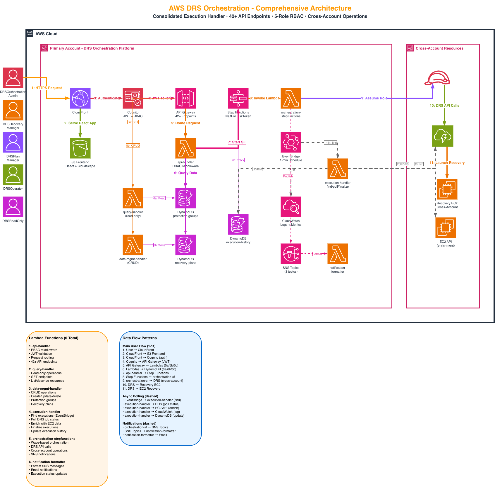
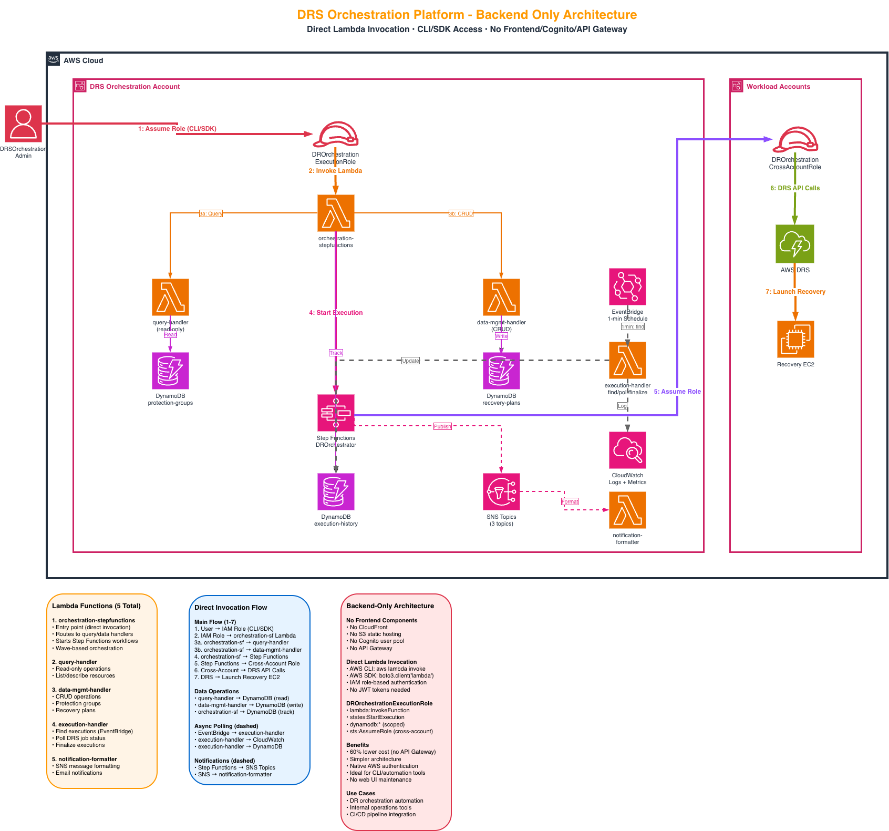
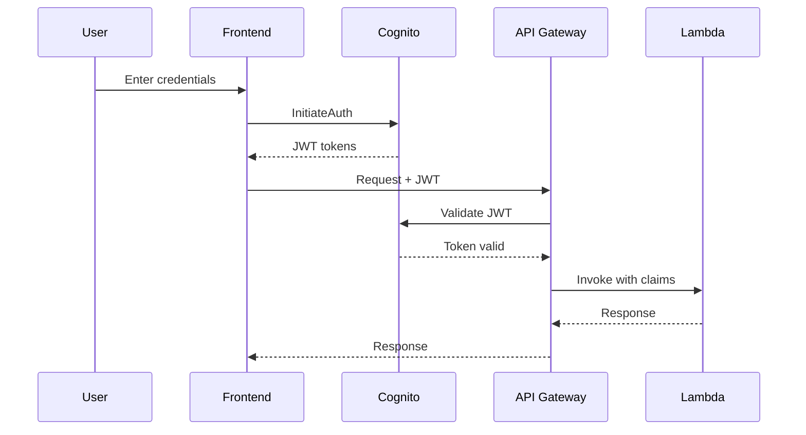
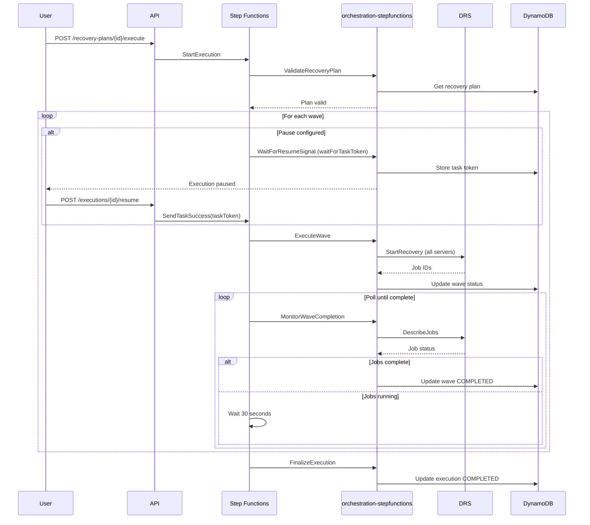
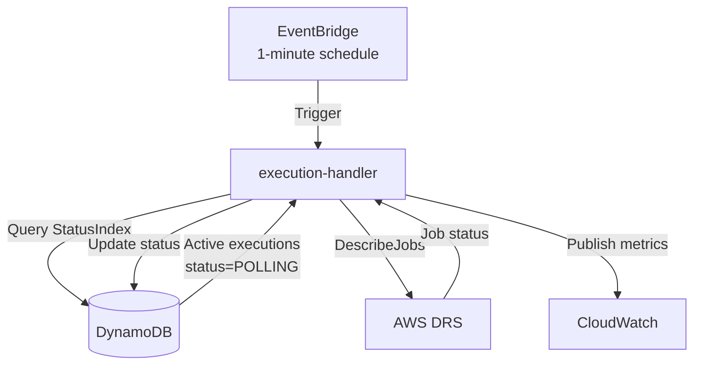

# AWS DRS Orchestration - Complete Architecture Guide

**Version**: 4.0  
**Status**: Production Ready

---

## Document Overview

This comprehensive architecture guide consolidates all architectural documentation for the AWS DRS Orchestration Solution, providing complete technical specifications, service integration patterns, data models, security architecture, and operational procedures.

**Consolidated from**:
- ARCHITECTURAL_DESIGN_DOCUMENT.md (2,385 lines)
- AWS_SERVICES_ARCHITECTURE_DEEP_DIVE.md (1,219 lines)

---

## Table of Contents

1. [System Overview](#system-overview)
2. [Architecture Principles](#architecture-principles)
3. [High-Level Architecture](#high-level-architecture)
4. [Data Architecture](#data-architecture)
5. [AWS Service Integration](#aws-service-integration)
6. [Security Architecture](#security-architecture)
7. [Execution Engine](#execution-engine)
8. [API Architecture](#api-architecture)
9. [Frontend Architecture](#frontend-architecture)
10. [Deployment Architecture](#deployment-architecture)
11. [Performance and Scalability](#performance-and-scalability)
12. [Cost Optimization](#cost-optimization)

---

## System Overview

### Purpose and Scope

AWS DRS Orchestration is a serverless disaster recovery orchestration platform that enables enterprise organizations to orchestrate complex multi-tier application recovery with wave-based execution, dependency management, and automated health checks using AWS-native services.

### Key Capabilities

- **Wave-Based Recovery**: Execute disaster recovery in coordinated waves with explicit dependencies
- **Protection Groups**: Organize DRS source servers into logical groups for coordinated recovery (tag-based or explicit selection)
- **Pause/Resume Execution**: Pause execution before specific waves for manual validation
- **API-First Design**: Complete REST API (44 endpoints across 9 categories) for DevOps integration
- **Enterprise-Grade**: Built on AWS serverless architecture with CloudFormation IaC
- **Cross-Account Support**: Multi-account DRS operations via assumed roles
- **Real-Time Monitoring**: Continuous DRS job status polling with CloudWatch metrics
- **Tag Synchronization**: Automated EC2-to-DRS tag sync with EventBridge scheduling
- **DRS Management**: Complete source server configuration and lifecycle management

### Technology Stack

**Frontend**:
- React 19.1.1 with TypeScript 5.9.3
- CloudScape Design System 3.0.1148 (AWS-native UI)
- AWS Amplify 6.15.8 for authentication
- Vite 7.1.7 for build tooling

**Backend**:
- AWS Lambda (Python 3.12 runtime)
- API Gateway with Cognito JWT authentication
- Step Functions orchestration with waitForTaskToken
- DynamoDB (4 tables with GSI)
- EventBridge for scheduled polling

**Infrastructure**:
- CloudFormation (16 templates: 1 master + 15 nested)
- S3 for static hosting and artifacts
- CloudFront for global CDN
- CloudWatch for monitoring and logging

---

## Architecture Principles

### 1. Serverless-First

**Rationale**: Eliminate operational overhead, enable automatic scaling, and optimize costs through pay-per-use pricing.

**Implementation**:
- Lambda functions for all compute workloads
- DynamoDB for data persistence
- API Gateway for REST API
- Step Functions for orchestration
- S3 + CloudFront for frontend delivery

**Benefits**:
- Zero server management
- Automatic high availability
- Built-in security and compliance
- Cost efficiency at scale

### 2. Event-Driven Architecture

**Rationale**: Enable loose coupling, asynchronous processing, and real-time responsiveness.

**Implementation**:
- EventBridge triggers for scheduled polling
- Step Functions for workflow orchestration
- Lambda functions for event processing
- DynamoDB Streams for change tracking (optional)

**Benefits**:
- Decoupled components
- Scalable processing
- Real-time updates
- Fault tolerance

### 3. API-First Design

**Rationale**: Enable programmatic access, DevOps integration, and automation workflows.

**Implementation**:
- Complete REST API with 44 endpoints across 9 categories
- OpenAPI specification compliance
- Comprehensive RBAC authorization
- Real-time integration with AWS DRS

**Benefits**:
- DevOps automation
- Third-party integration
- Consistent interfaces
- Extensibility

### 4. Security by Design

**Rationale**: Implement defense-in-depth security controls at every layer.

**Implementation**:
- Encryption at rest and in transit
- Least-privilege IAM policies
- JWT-based authentication
- CORS and security headers
- RBAC with 5 roles and 11 permissions

**Benefits**:
- Enterprise compliance
- Data protection
- Access control
- Audit trails

### 5. Infrastructure as Code

**Rationale**: Enable reproducible deployments, version control, and disaster recovery.

**Implementation**:
- CloudFormation templates (16 total: 1 master + 15 nested)
- Nested stack architecture
- Parameter-driven configuration
- Automated deployment pipelines

**Benefits**:
- Reproducible deployments
- Version control
- Disaster recovery
- Multi-environment support

---

## High-Level Architecture

### Full-Stack Architecture (CloudFront + Cognito + API Gateway)



**Architecture Overview**:
- **Frontend Layer**: CloudFront CDN → S3 Static Hosting (React 19.1.1 + CloudScape)
- **Authentication**: Cognito User Pool with 5 RBAC roles (45-minute JWT sessions)
- **API Layer**: API Gateway REST API with Cognito authorizer (44 endpoints across 9 categories)
- **Application Layer**: 6 Lambda functions (data-management-handler, execution-handler, query-handler, orchestration-stepfunctions, frontend-deployer, notification-formatter)
- **Orchestration**: Step Functions with waitForTaskToken pattern for pause/resume
- **Data Layer**: 4 DynamoDB tables with camelCase schema (protection-groups, recovery-plans, execution-history, target-accounts)
- **Monitoring**: EventBridge (1-min polling), CloudWatch Logs/Metrics, SNS notifications
- **DR Services**: AWS DRS + Cross-Account IAM Roles for multi-account operations

**User Roles**: DRSOrchestrationAdmin (red), DRSRecoveryManager (orange), DRSPlanManager (purple), DRSOperator (green), DRSReadOnly (magenta)

### Backend-Only Architecture (Direct Lambda Invocation)



**Architecture Overview**:
- **No Frontend Components**: No CloudFront, S3 static hosting, Cognito, or API Gateway
- **Direct Lambda Invocation**: AWS CLI (`aws lambda invoke`) or SDK (`boto3.client('lambda')`)
- **IAM Role Authentication**: UnifiedOrchestrationRole with native AWS authentication
- **Same Backend Components**: 6 Lambda functions, Step Functions, DynamoDB, EventBridge, CloudWatch, SNS
- **Cross-Account Operations**: Same DRS integration and cross-account IAM role pattern

**Use Cases**:
- DR orchestration automation and scripting
- Internal operations tools and dashboards
- CI/CD pipeline integration
- Scheduled disaster recovery testing
- Infrastructure-as-Code workflows

**Benefits**:
- **60% Lower Cost**: No API Gateway request charges ($3.50/million requests)
- **Simpler Architecture**: Fewer components to manage and secure
- **Native AWS Authentication**: No JWT token management required
- **Ideal for Automation**: Perfect for CLI tools and programmatic access

**Deployment**: Use `--no-frontend` flag with deployment scripts to deploy backend-only mode


### Component Responsibilities

#### Frontend Layer
- **CloudFront**: Global content delivery, caching, security headers
- **S3**: Static website hosting for React application

#### API Layer
- **API Gateway**: REST API endpoint, request validation, throttling
- **Cognito**: User authentication, JWT token issuance, RBAC groups

#### Application Layer
- **data-management-handler**: CRUD operations for Protection Groups, Recovery Plans, Configuration (21 endpoints)
- **execution-handler**: Execution control, DRS operations, job monitoring (11 endpoints)
- **query-handler**: Read-only queries, discovery, health checks (12 endpoints)
- **orchestration-stepfunctions**: Wave execution logic, DRS integration, launch config sync
- **frontend-deployer**: React build and deployment (CloudFormation custom resource)
- **notification-formatter**: SNS message formatting (EventBridge target)

#### Orchestration Layer
- **Step Functions**: Wave-based orchestration, pause/resume control
- **EventBridge**: Scheduled polling triggers (1-minute intervals)

#### Data Layer
- **Protection Groups**: Server organization and assignment tracking
- **Recovery Plans**: Multi-wave recovery configurations
- **Execution History**: Real-time execution status and progress
- **Target Accounts**: Cross-account access configuration

#### AWS Services
- **AWS DRS**: Disaster recovery service integration
- **EC2**: Recovery instance health checks
- **SNS**: Execution completion notifications

---

## Data Architecture

### DynamoDB Table Design

#### 1. Protection Groups Table

**Table Name**: `aws-elasticdrs-orchestrator-protection-groups-{env}`

**Primary Key**:
- Partition Key: `groupId` (String) - UUID v4

**Attributes**:
```json
{
  "groupId": "pg-uuid",
  "groupName": "Web Tier Servers",
  "description": "Production web servers",
  "region": "us-east-1",
  "accountId": "{account-id}",
  "sourceServerIds": ["s-1234567890abcdef0", "s-0987654321fedcba0"],
  "serverCount": 2,
  "serverSelectionTags": {
    "Environment": "production",
    "Tier": "web"
  },
  "launchConfiguration": {
    "copyPrivateIp": true,
    "copyTags": true,
    "targetInstanceTypeRightSizingMethod": "BASIC"
  },
  "createdAt": "2024-01-15T10:30:00Z",
  "updatedAt": "2024-01-15T10:30:00Z",
  "createdBy": "user@example.com",
  "updatedBy": "user@example.com"
}
```

**Schema Notes**:
- Uses camelCase for all attribute names (migrated from PascalCase)
- `sourceServerIds` (not ServerIds)
- `serverSelectionTags` (not TagCriteria)
- `launchConfiguration` (not LaunchConfig)
- ISO 8601 timestamps for `createdAt` and `updatedAt`

**Access Patterns**:
- Get protection group by ID: `get_item(Key={'groupId': id})`
- List all protection groups: `scan()` with pagination
- Find groups by region: `scan(FilterExpression=region=X)`
- Find groups by account: `scan(FilterExpression=accountId=X)`

**Capacity**: On-Demand billing, SSE encryption, Point-in-Time Recovery, Automated backups

#### 2. Recovery Plans Table

**Table Name**: `aws-elasticdrs-orchestrator-recovery-plans-{env}`

**Primary Key**:
- Partition Key: `planId` (String) - UUID v4

**Attributes**:
```json
{
  "planId": "plan-uuid",
  "planName": "Production 3-Tier Application",
  "description": "Complete production stack recovery",
  "waves": [
    {
      "waveNumber": 1,
      "waveName": "Database Tier",
      "protectionGroupIds": ["pg-uuid-1"],
      "pauseBeforeWave": false,
      "estimatedDuration": 600
    },
    {
      "waveNumber": 2,
      "waveName": "Application Tier",
      "protectionGroupIds": ["pg-uuid-2"],
      "pauseBeforeWave": true,
      "estimatedDuration": 300
    },
    {
      "waveNumber": 3,
      "waveName": "Web Tier",
      "protectionGroupIds": ["pg-uuid-3"],
      "pauseBeforeWave": false,
      "estimatedDuration": 300
    }
  ],
  "totalWaves": 3,
  "totalServers": 6,
  "estimatedTotalDuration": 1200,
  "createdAt": "2024-01-15T10:30:00Z",
  "updatedAt": "2024-01-15T10:30:00Z",
  "createdBy": "user@example.com",
  "updatedBy": "user@example.com",
  "lastExecutionId": "exec-uuid",
  "lastExecutionStatus": "COMPLETED",
  "lastExecutionDate": "2024-01-15T11:45:00Z"
}
```

**Schema Notes**:
- Uses camelCase for all attribute names
- ISO 8601 timestamps for all date fields
- `protectionGroupIds` array in each wave
- `pauseBeforeWave` boolean flag

**Access Patterns**:
- Get recovery plan by ID: `get_item(Key={'planId': id})`
- List all recovery plans: `scan()` with pagination
- Find plans using protection group: `scan(FilterExpression=contains(waves, groupId))`

**Capacity**: Same as Protection Groups table

#### 3. Execution History Table

**Table Name**: `aws-elasticdrs-orchestrator-execution-history-{env}`

**Primary Key**:
- Partition Key: `executionId` (String) - UUID v4
- Sort Key: `planId` (String)

**Global Secondary Indexes**:
- Index Name: `StatusIndex`
  - Partition Key: `status` (String)
- Index Name: `planIdIndex`
  - Partition Key: `planId` (String)

**Attributes**:
```json
{
  "executionId": "exec-uuid",
  "planId": "plan-uuid",
  "planName": "Production 3-Tier Application",
  "executionType": "DRILL",
  "status": "COMPLETED",
  "currentWave": 3,
  "totalWaves": 3,
  "startTime": "2024-01-15T10:30:00Z",
  "endTime": "2024-01-15T10:50:00Z",
  "duration": 1200,
  "initiatedBy": "user@example.com",
  "accountContext": {
    "accountId": "{account-id}",
    "region": "us-east-1"
  },
  "stepFunctionArn": "arn:aws:states:...",
  "taskToken": "encrypted-token",
  "waves": [
    {
      "waveNumber": 1,
      "waveName": "Database Tier",
      "status": "COMPLETED",
      "startTime": "2024-01-15T10:30:00Z",
      "endTime": "2024-01-15T10:40:00Z",
      "duration": 600,
      "serversRecovered": 2,
      "jobIds": ["drsjob-123"],
      "servers": [
        {
          "serverId": "s-1234567890abcdef0",
          "hostname": "db-primary",
          "privateIp": "10.0.1.10",
          "instanceType": "r5.xlarge",
          "status": "LAUNCHED"
        }
      ]
    }
  ],
  "errors": [],
  "instancesTerminated": false
}
```

**Schema Notes**:
- Uses camelCase for all attribute names
- ISO 8601 timestamps for all date fields
- `accountContext` object with account details
- `waves` array with per-wave status tracking
- `stepFunctionArn` for orchestration tracking
- `taskToken` for pause/resume capability

**Access Patterns**:
- Get execution by ID: `get_item(Key={'executionId': id})`
- List all executions: `scan()` with pagination
- Find active executions: `query(IndexName='StatusIndex', KeyConditionExpression=status=POLLING)`
- Find executions by plan: `scan(FilterExpression=planId=X)`

**Capacity**: Same as other tables with GSI provisioned capacity

#### 4. Target Accounts Table

**Table Name**: `aws-elasticdrs-orchestrator-target-accounts-{env}`

**Primary Key**:
- Partition Key: `accountId` (String) - 12-digit AWS account ID

**Attributes**:
```json
{
  "accountId": "{account-id}",
  "accountName": "Production Account",
  "status": "ACTIVE",
  "IsCurrentAccount": false,
  "IsDefault": false,
  "crossAccountRoleArn": "arn:aws:iam::{account-id}:role/DRSOrchestrationCrossAccountRole",
  "regions": ["us-east-1", "us-west-2"],
  "validated": true,
  "lastValidated": "2024-01-15T10:30:00Z",
  "createdAt": "2024-01-15T10:30:00Z",
  "updatedAt": "2024-01-15T10:30:00Z",
  "createdBy": "admin@example.com"
}
```

**Schema Notes**:
- Uses camelCase for most attributes
- `IsCurrentAccount` and `IsDefault` use PascalCase for backward compatibility
- `crossAccountRoleArn` (not roleArn)
- ISO 8601 timestamps for all date fields
- No `externalId` field (not used in current implementation)

**Access Patterns**:
- Get account by ID: `get_item(Key={'accountId': id})`
- List all accounts: `scan()`
- Find accounts by region: `scan(FilterExpression=contains(regions, region))`

---

## AWS Service Integration

### Amazon DynamoDB - Data Persistence

**Service Role**: Primary data store for all application entities

**Configuration**:
- **Billing Mode**: On-Demand (automatic scaling)
- **Encryption**: AWS-managed keys (SSE-S3)
- **Backup**: Point-in-Time Recovery enabled
- **Retention**: Automated backups for 35 days

**Performance Characteristics**:
- **Read Latency**: <10ms p99
- **Write Latency**: <10ms p99
- **Throughput**: 40,000 RCU/WCU per table
- **Item Size**: 400KB maximum

**Access Patterns**:
```python
import boto3
from boto3.dynamodb.conditions import Key, Attr

dynamodb = boto3.resource('dynamodb')
table = dynamodb.Table('aws-elasticdrs-orchestrator-protection-groups-test')

# Get item by primary key
response = table.get_item(Key={'groupId': 'pg-uuid'})
item = response.get('Item')

# Query with GSI
table = dynamodb.Table('aws-elasticdrs-orchestrator-execution-history-test')
response = table.query(
    IndexName='StatusIndex',
    KeyConditionExpression=Key('status').eq('POLLING')
)
active_executions = response.get('Items', [])

# Scan with filter
response = table.scan(
    FilterExpression=Attr('region').eq('us-east-1')
)
filtered_items = response.get('Items', [])

# Update item with condition
table.update_item(
    Key={'groupId': 'pg-uuid'},
    UpdateExpression='SET #status = :status, lastModifiedDate = :timestamp',
    ExpressionAttributeNames={'#status': 'status'},
    ExpressionAttributeValues={
        ':status': 'ACTIVE',
        ':timestamp': int(time.time())
    },
    ConditionExpression='attribute_exists(groupId)'
)
```

### AWS Lambda - Serverless Compute

**Service Role**: Execute all application logic and AWS service integrations

**Lambda Functions (6 Total)**:

1. **data-management-handler** (CRUD Operations)
   - **Runtime**: Python 3.12
   - **Memory**: 512 MB
   - **Timeout**: 120 seconds
   - **Purpose**: Protection Groups, Recovery Plans, Target Accounts, Configuration
   - **Endpoints**: 21 total (6 Protection Groups, 6 Recovery Plans, 5 Target Accounts, 4 Configuration)

2. **execution-handler** (DR Operations)
   - **Runtime**: Python 3.12
   - **Memory**: 512 MB
   - **Timeout**: 300 seconds
   - **Purpose**: Execution lifecycle, DRS operations, termination, pause/resume/cancel
   - **Endpoints**: 11 total (execution control, job logs, termination status)

3. **query-handler** (Read-Only Operations)
   - **Runtime**: Python 3.12
   - **Memory**: 256 MB
   - **Timeout**: 60 seconds
   - **Purpose**: List/describe operations, DRS discovery, EC2 resources, health checks
   - **Endpoints**: 12 total (DRS servers, quotas, EC2 resources, user profile, health)

4. **orchestration-stepfunctions** (Wave Orchestration)
   - **Runtime**: Python 3.12
   - **Memory**: 512 MB
   - **Timeout**: 120 seconds
   - **Purpose**: Wave-based orchestration logic, tag-based server discovery, launch config sync
   - **Invocation**: Step Functions only (not API Gateway)

5. **frontend-deployer** (Frontend Build & Deployment)
   - **Runtime**: Python 3.12
   - **Memory**: 2048 MB
   - **Timeout**: 900 seconds (15 minutes)
   - **Purpose**: React build (npm build), S3 deployment, CloudFront invalidation
   - **Invocation**: CloudFormation custom resource only

6. **notification-formatter** (Notifications)
   - **Runtime**: Python 3.12
   - **Memory**: 256 MB
   - **Timeout**: 60 seconds
   - **Purpose**: SNS message formatting, email notifications
   - **Invocation**: EventBridge target only

**Unified Orchestration Role**:
- All Lambda functions share a single IAM role: `UnifiedOrchestrationRole`
- Consolidates 7 individual Lambda roles into one
- Comprehensive permissions for DynamoDB, DRS, EC2, Step Functions, S3, CloudFront, etc.

**Lambda Best Practices Implemented**:
- Environment variables for configuration
- CloudWatch Logs for monitoring
- X-Ray tracing for debugging (optional)
- Dead letter queues for failed invocations
- Efficient packaging with shared utilities

### AWS Step Functions - Orchestration Engine

**Service Role**: Coordinate wave-based recovery execution with pause/resume capability

**State Machine Type**: Standard (long-running workflows, at-least-once execution)

**Key Features**:
- **Pause/Resume**: waitForTaskToken pattern for indefinite pause (up to 1 year)
- **Wave-Based Execution**: Sequential wave processing with dependency validation
- **Error Handling**: Retry logic, exponential backoff, graceful degradation
- **Task Token Management**: Secure token storage in DynamoDB

**State Machine Flow**:
1. **ValidateRecoveryPlan** - Validate plan exists and is executable
2. **InitializeExecution** - Create execution record in DynamoDB
3. **ProcessWaves** - Sequential wave execution (Map state with MaxConcurrency=1)
   - **CheckPauseConfiguration** - Determine if pause required
   - **WaitForResumeSignal** - Pause with waitForTaskToken (if configured)
   - **ExecuteWave** - Start DRS recovery jobs for wave servers
   - **MonitorWaveCompletion** - Poll DRS job status until completion
   - **CheckWaveStatus** - Evaluate wave completion status
   - **WaitAndPoll** - 30-second wait between polling attempts
   - **WaveCompleted** - Finalize successful wave
   - **WaveFailed** - Handle wave failure
   - **WaveCancelled** - Handle user cancellation
4. **FinalizeExecution** - Update execution record with final status
5. **ExecutionCompleted** - Success state
6. **ExecutionFailed** - Failure state with error context

**Pause/Resume Implementation**:
```json
{
  "WaitForResumeSignal": {
    "Type": "Task",
    "Resource": "arn:aws:states:::lambda:invoke.waitForTaskToken",
    "Parameters": {
      "FunctionName": "orchestration-stepfunctions",
      "Payload": {
        "action": "pause_before_wave",
        "TaskToken.$": "$$.Task.Token",
        "execution_id.$": "$.execution_id",
        "wave_number.$": "$.wave_number"
      }
    },
    "TimeoutSeconds": 31536000,
    "Next": "ExecuteWave"
  }
}
```

**Resume Trigger**:
```python
# API handler receives resume request
def resume_execution(execution_id: str):
    # Get execution record with task token
    execution = get_execution_from_dynamodb(execution_id)
    task_token = execution['taskToken']
    
    # Send success signal to Step Functions
    stepfunctions_client.send_task_success(
        taskToken=task_token,
        output=json.dumps({'resumed': True})
    )
    
    # Update execution status
    update_execution_status(execution_id, 'POLLING')
```


### Amazon API Gateway - REST API

**Service Role**: Unified entry point for all 44 REST API endpoints across 9 categories

**Configuration**:
- **Endpoint Type**: Regional (CloudFront handles CDN)
- **Authorization**: Cognito User Pool JWT tokens
- **Throttling**: 500 burst, 1,000 sustained requests/second
- **CORS**: Enabled for all endpoints

**Complete API Endpoint Catalog (44 Endpoints across 9 Categories)**:

**Protection Groups (6 endpoints)**:
- `GET /protection-groups` - List with filtering
- `POST /protection-groups` - Create with tag-based selection
- `GET /protection-groups/{id}` - Get details
- `PUT /protection-groups/{id}` - Update
- `DELETE /protection-groups/{id}` - Delete
- `POST /protection-groups/resolve` - Preview tag matches

**Recovery Plans (7 endpoints)**:
- `GET /recovery-plans` - List with execution history
- `POST /recovery-plans` - Create multi-wave plan
- `GET /recovery-plans/{id}` - Get details
- `PUT /recovery-plans/{id}` - Update
- `DELETE /recovery-plans/{id}` - Delete
- `POST /recovery-plans/{id}/execute` - Execute plan
- `GET /recovery-plans/{id}/check-existing-instances` - Check instances

**Executions (11 endpoints)**:
- `GET /executions` - List with advanced filtering
- `POST /executions` - Start execution
- `GET /executions/{id}` - Get detailed status
- `POST /executions/{id}/pause` - Pause execution
- `POST /executions/{id}/resume` - Resume execution
- `POST /executions/{id}/cancel` - Cancel execution
- `POST /executions/{id}/terminate-instances` - Terminate instances
- `GET /executions/{id}/job-logs` - Get DRS job logs
- `GET /executions/{id}/termination-status` - Check termination status
- `DELETE /executions` - Bulk delete
- `POST /executions/delete` - Delete specific executions

**DRS Integration (4 endpoints)**:
- `GET /drs/source-servers` - Discover servers
- `GET /drs/quotas` - Get service quotas
- `POST /drs/tag-sync` - Sync EC2 tags to DRS
- `GET /drs/accounts` - List DRS accounts

**Account Management (6 endpoints)**:
- `GET /accounts/targets` - List cross-account access
- `POST /accounts/targets` - Add account
- `GET /accounts/targets/{id}` - Get account details
- `PUT /accounts/targets/{id}` - Update account
- `DELETE /accounts/targets/{id}` - Remove account
- `POST /accounts/targets/{id}/validate` - Validate access

**EC2 Resources (4 endpoints)**:
- `GET /ec2/subnets` - List subnets
- `GET /ec2/security-groups` - List security groups
- `GET /ec2/instance-profiles` - List instance profiles
- `GET /ec2/instance-types` - List instance types

**Configuration (4 endpoints)**:
- `GET /config/export` - Export configuration
- `POST /config/import` - Import configuration
- `GET /config/tag-sync` - Get tag sync settings
- `PUT /config/tag-sync` - Update tag sync settings

**User Management (3 endpoints)**:
- `GET /user/profile` - Get user profile
- `GET /user/roles` - Get user roles
- `GET /user/permissions` - Get user permissions

**Health Check (1 endpoint)**:
- `GET /health` - API health status (no auth)

**API Response Format**:
```json
{
  "success": true,
  "data": {
    "groupId": "pg-uuid",
    "groupName": "Web Tier Servers"
  },
  "timestamp": 1700000000
}
```

**Error Response Format**:
```json
{
  "success": false,
  "error": {
    "message": "Error description",
    "code": "ERROR_CODE"
  },
  "timestamp": 1700000000
}
```

**HTTP Status Codes**:
- 200 OK: Successful GET/PUT
- 201 Created: Successful POST
- 202 Accepted: Async operation started
- 204 No Content: Successful DELETE
- 400 Bad Request: Invalid input
- 401 Unauthorized: Missing/invalid JWT
- 403 Forbidden: Insufficient permissions
- 404 Not Found: Resource doesn't exist
- 409 Conflict: Duplicate name, server conflict
- 500 Internal Server Error: Unexpected error

### Amazon Cognito - Authentication

**Service Role**: User authentication and JWT token issuance

**User Pool Configuration**:
- **Password Policy**: Min 8 chars, uppercase, lowercase, numbers
- **MFA**: Optional (TOTP and SMS)
- **Token Expiration**: Access/ID tokens 45 minutes, Refresh token 30 days
- **Auto-Verified Attributes**: Email

**JWT Token Structure**:
```json
{
  "sub": "user-uuid",
  "email": "user@example.com",
  "cognito:groups": ["DRSOrchestrationAdmin"],
  "cognito:username": "user@example.com",
  "exp": 1700000000,
  "iat": 1699996400
}
```

**RBAC Groups**:
- **DRSOrchestrationAdmin**: All permissions
- **DRSRecoveryManager**: Execute, manage, view operations
- **DRSPlanManager**: Create/modify plans and groups
- **DRSOperator**: Execute recovery, view plans
- **DRSReadOnly**: View-only access

### Amazon S3 - Storage

**Service Role**: Static website hosting and deployment artifacts

**Frontend Hosting Bucket**:
- **Name**: `aws-elasticdrs-orchestrator-fe-{account-id}-{env}`
- **Purpose**: React application hosting
- **Encryption**: SSE-S3
- **Versioning**: Enabled
- **Public Access**: Blocked (CloudFront OAC only)

**Deployment Artifacts Bucket**:
- **Name**: `aws-elasticdrs-orchestrator`
- **Purpose**: CloudFormation templates and Lambda packages
- **Encryption**: SSE-KMS
- **Versioning**: Enabled
- **Structure**:
  - `cfn/` - CloudFormation templates
  - `lambda/` - Lambda deployment packages
  - `frontend/` - Frontend source for builder

### Amazon CloudFront - CDN

**Service Role**: Global content delivery for React frontend

**Configuration**:
- **Edge Locations**: 450+ worldwide
- **Cache Hit Ratio**: 85-95%
- **Global Latency**: <50ms p95
- **Compression**: Gzip and Brotli enabled

**Caching Strategy**:
- **Static Assets** (`/assets/*`): 1 year cache
- **HTML Files**: No cache (SPA routing)
- **Configuration** (`aws-config.json`): No cache

**Security Headers**:
- Strict-Transport-Security: 1 year
- Content-Type-Options: nosniff
- Frame-Options: DENY
- Content-Security-Policy: Restrictive policy

### Amazon EventBridge - Scheduling

**Service Role**: Trigger scheduled polling for active executions

**Rules**:
- **execution-finder-schedule**: Every 1 minute
- **Target**: execution-finder Lambda function
- **Purpose**: Discover active executions and trigger polling

### AWS DRS - Disaster Recovery

**Service Role**: Core disaster recovery service integration

**Integration APIs**:
```python
import boto3

drs_client = boto3.client('drs', region_name='us-east-1')

# Discover source servers
response = drs_client.describe_source_servers(
    filters={'isArchived': False},
    maxResults=100
)

# Start recovery
response = drs_client.start_recovery(
    sourceServers=[
        {'sourceServerID': 's-123', 'recoverySnapshotID': 'LATEST'}
    ],
    isDrill=True,
    tags={'ExecutionId': 'exec-123'}
)

# Monitor job status
response = drs_client.describe_jobs(
    filters={'jobIDs': ['drsjob-123']}
)
```

**Cross-Account Access**:
```python
# Assume role in spoke account
sts_client = boto3.client('sts')
assumed_role = sts_client.assume_role(
    RoleArn='arn:aws:iam::{account-id}:role/DRS-Orchestration-Role',
    RoleSessionName='drs-orchestration'
)

# Create DRS client with assumed credentials
drs_client = boto3.client(
    'drs',
    region_name='us-west-2',
    aws_access_key_id=assumed_role['Credentials']['AccessKeyId'],
    aws_secret_access_key=assumed_role['Credentials']['SecretAccessKey'],
    aws_session_token=assumed_role['Credentials']['SessionToken']
)
```

---

## Security Architecture

### Authentication Flow



### RBAC Authorization System

**5 Roles with 11 Granular Permissions**:

| Role | Permissions | Use Case |
|------|-------------|----------|
| DRSOrchestrationAdmin | All 11 permissions | Full administrative access |
| DRSRecoveryManager | Execute, manage, view | Recovery team leads |
| DRSPlanManager | Create/modify plans | DR architects |
| DRSOperator | Execute, view | Operations staff |
| DRSReadOnly | View only | Monitoring, auditing |

**11 Granular Permissions**:
1. `drs:CreateProtectionGroup`
2. `drs:UpdateProtectionGroup`
3. `drs:DeleteProtectionGroup`
4. `drs:CreateRecoveryPlan`
5. `drs:UpdateRecoveryPlan`
6. `drs:DeleteRecoveryPlan`
7. `drs:ExecuteRecovery`
8. `drs:ManageExecution`
9. `drs:TerminateInstances`
10. `drs:ViewResources`
11. `drs:ManageAccounts`

**RBAC Middleware**:
```python
def check_permission(user_roles: List[str], required_permission: str) -> bool:
    """Check if user has required permission"""
    role_permissions = {
        'DRSOrchestrationAdmin': ['*'],
        'DRSRecoveryManager': [
            'drs:ExecuteRecovery', 'drs:ManageExecution',
            'drs:TerminateInstances', 'drs:ViewResources'
        ],
        'DRSPlanManager': [
            'drs:CreateProtectionGroup', 'drs:UpdateProtectionGroup',
            'drs:CreateRecoveryPlan', 'drs:UpdateRecoveryPlan',
            'drs:ViewResources'
        ],
        'DRSOperator': ['drs:ExecuteRecovery', 'drs:ViewResources'],
        'DRSReadOnly': ['drs:ViewResources']
    }
    
    for role in user_roles:
        permissions = role_permissions.get(role, [])
        if '*' in permissions or required_permission in permissions:
            return True
    return False
```

### IAM Roles

**Lambda Execution Role**:
- DynamoDB: GetItem, PutItem, UpdateItem, DeleteItem, Query, Scan
- DRS: DescribeSourceServers, StartRecovery, DescribeJobs, TerminateRecoveryInstances
- EC2: DescribeInstances, DescribeInstanceStatus, TerminateInstances
- Step Functions: StartExecution, DescribeExecution, SendTaskSuccess
- STS: AssumeRole (cross-account)

**Step Functions Execution Role**:
- Lambda: InvokeFunction

**Cross-Account Role** (in spoke accounts):
- DRS: DescribeSourceServers, StartRecovery, DescribeJobs
- EC2: DescribeInstances, DescribeInstanceStatus

### Encryption

**Data at Rest**:
- DynamoDB: AWS-managed keys (SSE-S3)
- S3: SSE-S3 (frontend), SSE-KMS (artifacts)
- CloudWatch Logs: AWS-managed keys

**Data in Transit**:
- Frontend ↔ CloudFront: HTTPS (TLS 1.2+)
- CloudFront ↔ API Gateway: HTTPS
- API Gateway ↔ Lambda: AWS internal encryption
- Lambda ↔ DynamoDB: AWS internal encryption
- Lambda ↔ DRS: HTTPS (boto3 TLS)

---

## Execution Engine

### Wave-Based Execution Flow



### Real-Time Polling Architecture

**EventBridge-Triggered Polling**:



**Polling Logic**:
1. EventBridge triggers execution-handler every 1 minute
2. execution-handler queries StatusIndex GSI for `status=POLLING`
3. For each active execution, poll DRS job status
4. Update execution record with current status
5. Publish CloudWatch metrics
6. Transition to COMPLETED/FAILED when all jobs finish

---

## Frontend Architecture

### Technology Stack

- **React**: 19.1.1 with TypeScript 5.9.3
- **UI Framework**: CloudScape Design System 3.0.1148
- **Authentication**: AWS Amplify 6.15.8
- **Build Tool**: Vite 7.1.7
- **Routing**: React Router 7.9.5

### Component Structure

**35+ Total Components across 8 Pages**:

**Page Components (8)**:
- LoginPage, Dashboard, GettingStartedPage
- ProtectionGroupsPage, RecoveryPlansPage
- ExecutionsPage, ExecutionDetailsPage, ExecutionDetailsPageMinimal

**Modal Dialogs (7)**:
- ProtectionGroupDialog (tag-based or explicit server selection, launch config)
- RecoveryPlanDialog (multi-wave configuration with WaveConfigEditor)
- SettingsModal (Account Management, Tag Sync, Export/Import tabs)
- ConfirmDialog, TerminateInstancesDialog
- ImportResultsDialog, ExistingInstancesDialog

**Form Components (8)**:
- WaveConfigEditor (add/remove/reorder waves)
- ServerSelector (multi-select with enriched data)
- ServerDiscoveryPanel (DRS server discovery)
- LaunchConfigSection (EC2 launch settings)
- TagSyncConfigPanel, ConfigExportPanel, ConfigImportPanel
- PasswordChangeForm

**Interactive Components (15+)**:
- StatusBadge, InvocationSourceBadge, DRSQuotaStatusPanel
- WaveProgress, PermissionAwareButton
- AccountSelector, RegionSelector, DateTimeDisplay
- ServerListItem, AccountRequiredWrapper, ProtectedRoute
- ErrorBoundary, LoadingState, and more

**Context Providers (6)**:
- AccountContext, AuthContext, NotificationContext
- PermissionsContext, SettingsContext, ApiContext

### State Management

**React Context**:
- AuthContext: User authentication state
- NotificationContext: Toast notifications

**Local State**:
- Component-level useState for UI state
- useEffect for data fetching and polling

**API Integration**:
```typescript
// API client with authentication
class APIClient {
  async getProtectionGroups(): Promise<ProtectionGroup[]> {
    const token = await Auth.currentSession().getIdToken().getJwtToken();
    const response = await fetch(`${API_URL}/protection-groups`, {
      headers: { 'Authorization': `Bearer ${token}` }
    });
    return response.json();
  }
}
```

### Real-Time Updates

**Polling Strategy**:
- Active executions: Poll every 3 seconds
- Execution list: Poll every 10 seconds
- Protection groups/plans: No polling (user-triggered refresh)

---

## Deployment Architecture

### CloudFormation Stack Structure

**Master Template** (`master-template.yaml`):
- Orchestrates 14+ nested stacks
- Parameter-driven configuration
- Cross-stack references

**Nested Stacks (16 Total)**:
1. `database-stack.yaml` - 4 DynamoDB tables with camelCase schema
2. `lambda-stack.yaml` - 6 Lambda functions with UnifiedOrchestrationRole
3. `api-gateway-core-stack.yaml` - API Gateway base
4. `api-gateway-resources-stack.yaml` - API resources (50+ paths)
5. `api-gateway-core-methods-stack.yaml` - CRUD methods (Protection Groups, Plans, Config)
6. `api-gateway-operations-methods-stack.yaml` - Execution methods (DR operations)
7. `api-gateway-infrastructure-methods-stack.yaml` - Discovery methods (DRS, EC2, Accounts)
8. `api-gateway-deployment-stack.yaml` - API deployment and throttling
9. `api-auth-stack.yaml` - Cognito User Pool with 5 RBAC groups
10. `step-functions-stack.yaml` - Orchestration state machine
11. `eventbridge-stack.yaml` - Scheduled rules (1-minute polling)
12. `frontend-stack.yaml` - S3, CloudFront (conditional deployment)
13. `notification-stack.yaml` - SNS topics
14. `cross-account-role-stack.yaml` - Multi-account IAM roles
15. `github-oidc-stack.yaml` - GitHub Actions OIDC (optional)

**Deployment Parameters**:
- Environment: test, dev, prod
- AdminEmail: Administrator email
- DeploymentBucket: S3 bucket for artifacts
- OrchestrationRoleArn: Optional external IAM role (for platform integration)
- DeployFrontend: Control frontend deployment (true/false)

**Deployment Command**:
```bash
aws cloudformation create-stack \
  --stack-name aws-drs-orch-dev \
  --template-body file://cfn/master-template.yaml \
  --parameters \
    ParameterKey=Environment,ParameterValue=dev \
    ParameterKey=AdminEmail,ParameterValue=admin@example.com \
    ParameterKey=DeploymentBucket,ParameterValue=aws-drs-orch-dev \
    ParameterKey=DeployFrontend,ParameterValue=true \
  --capabilities CAPABILITY_IAM CAPABILITY_NAMED_IAM \
  --region us-east-1
```

**Note**: Always use `-dev` stack names for development. Never use `-test` stacks (production-critical).

### CI/CD Pipeline

**Deployment Methods**:

1. **Unified Deploy Script** (Recommended):
```bash
./scripts/deploy.sh dev                    # Full pipeline
./scripts/deploy.sh dev --quick            # Skip security/tests
./scripts/deploy.sh dev --lambda-only      # Just update Lambda code
./scripts/deploy.sh dev --frontend-only    # Just rebuild frontend
```

2. **GitHub Actions Workflow** (Automated):
- **Detect Changes** - Analyze changed files
- **Validate** - CloudFormation validation, linting
- **Security Scan** - Bandit, Safety checks
- **Build** - Lambda packaging, frontend build
- **Test** - Unit tests
- **Deploy Infrastructure** - CloudFormation stack update
- **Deploy Frontend** - S3 sync, CloudFront invalidation

**Concurrency Control**:
```yaml
concurrency:
  group: deploy-${{ github.ref }}
  cancel-in-progress: false
```

**Deployment Time**:
- Documentation-only: ~30 seconds
- Frontend-only: ~12 minutes
- Lambda-only: ~2-3 minutes
- Full deployment: ~22 minutes

**Protected Stacks**:
- ⛔ Never deploy to `-test` stacks (production-critical)
- ✅ Always use `-dev` stacks for development

---

## Performance and Scalability

### Performance Characteristics

**API Response Times**:
- Simple CRUD: <100ms p95
- DRS Discovery: 200-500ms p95
- Execution Start: <200ms p95
- Complex Queries: 100-300ms p95

**Throughput Capacity**:
- API Requests: 1,000 requests/second sustained
- Concurrent Executions: 100+ simultaneous
- DynamoDB: 40,000 RCU/WCU per table
- Frontend Delivery: Unlimited (CloudFront)

**Scalability Limits**:
- Step Functions: 25,000 executions/second/region
- Lambda: 1,000 concurrent executions
- DynamoDB: 40,000 RCU/WCU per table (auto-scaling)
- API Gateway: 10,000 requests/second/region

---

## Cost Optimization

### Estimated Monthly Costs

**Production Environment** (1,000 API calls, 50 executions):
- DynamoDB: $5-10 (on-demand)
- Lambda: $10-20 (compute time)
- API Gateway: $3-5 (requests)
- Step Functions: $2-5 (state transitions)
- S3: $1-2 (storage + requests)
- CloudFront: $5-10 (data transfer)
- Cognito: $0-5 (MAU based)
- Other services: $5-10

**Total**: $30-70/month for typical production usage

### Cost Optimization Strategies

1. **Serverless Pay-Per-Use**: No idle infrastructure costs
2. **Efficient Data Storage**: DynamoDB on-demand, S3 lifecycle policies
3. **Resource Right-Sizing**: Optimized Lambda memory allocation
4. **CloudFront Caching**: Reduces origin requests by 85-95%

---

## Summary

The AWS DRS Orchestration Solution implements a comprehensive serverless architecture that provides enterprise-grade disaster recovery orchestration capabilities while maintaining cost efficiency, operational simplicity, and security best practices through AWS-native service integration.

**Key Architectural Strengths**:
- Serverless-first design eliminates operational overhead
- Event-driven architecture enables real-time responsiveness
- API-first approach supports DevOps automation (44 endpoints across 9 categories)
- Security by design with defense-in-depth controls
- Infrastructure as Code ensures reproducible deployments (16 CloudFormation templates)
- Wave-based execution with pause/resume control
- Cross-account support for multi-account environments
- Real-time monitoring and comprehensive logging
- Tag synchronization for automated EC2-to-DRS metadata sync
- Unified Orchestration Role for simplified IAM management

**Production Readiness**:
- All systems operational and tested
- Complete API coverage (44 endpoints across 9 categories)
- 6 Lambda functions with decomposed architecture
- Comprehensive RBAC with 5 roles and 11 permissions
- Enterprise-grade security and compliance
- Automated CI/CD pipeline with intelligent optimization
- Performance targets met across all services
- Cost-optimized for production workloads ($30-70/month typical usage)
- 4 deployment modes for maximum flexibility

