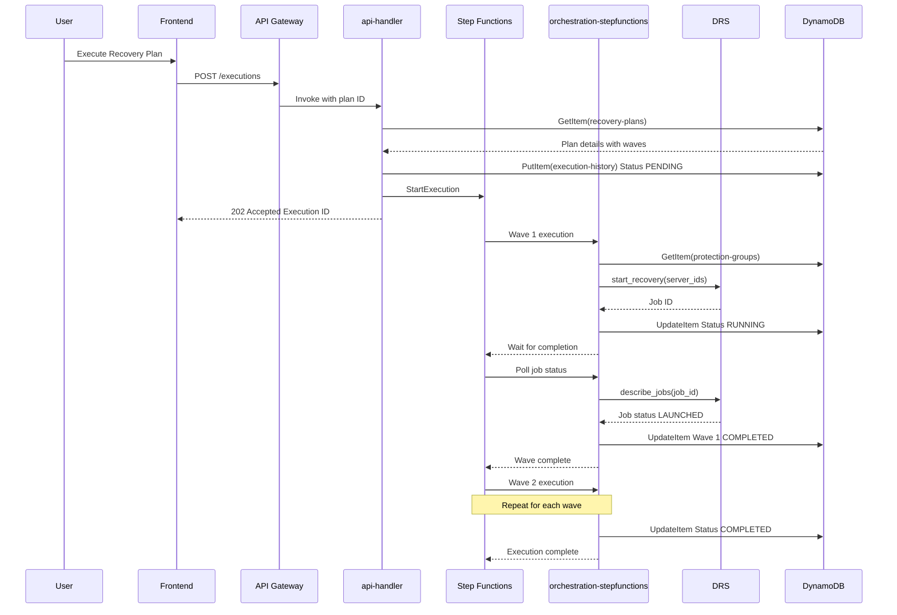
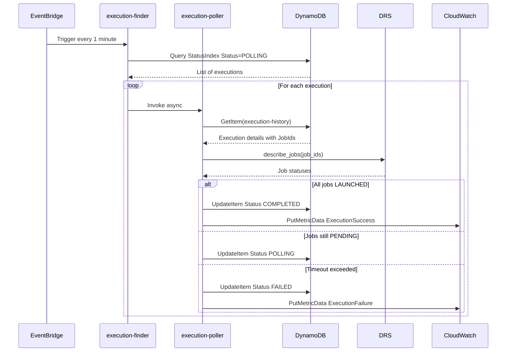
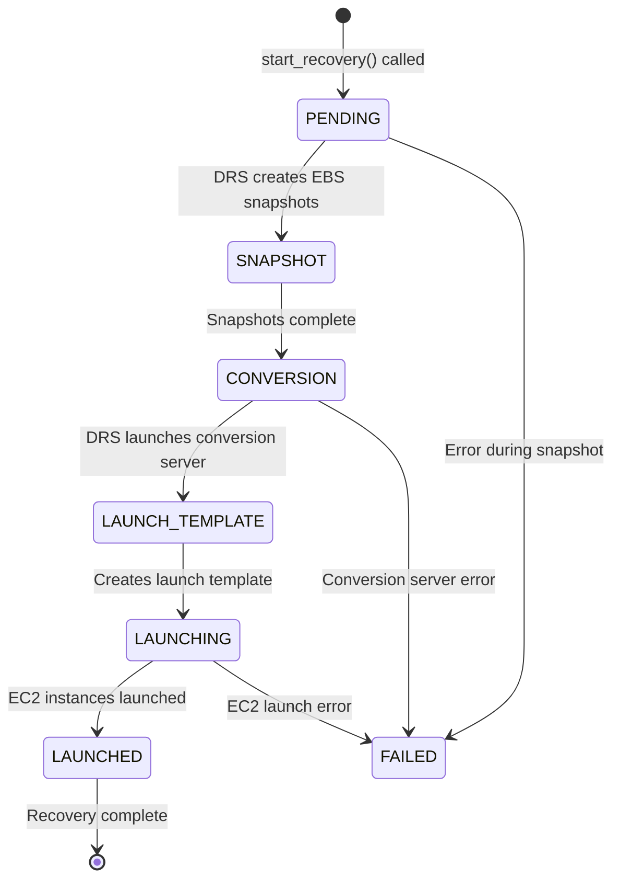
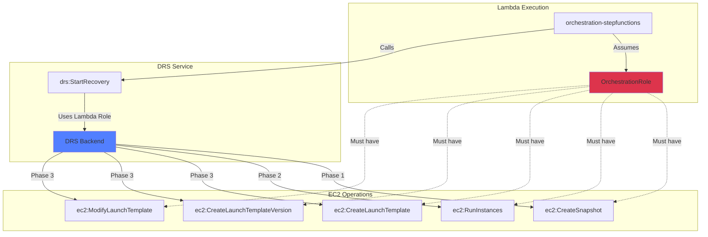
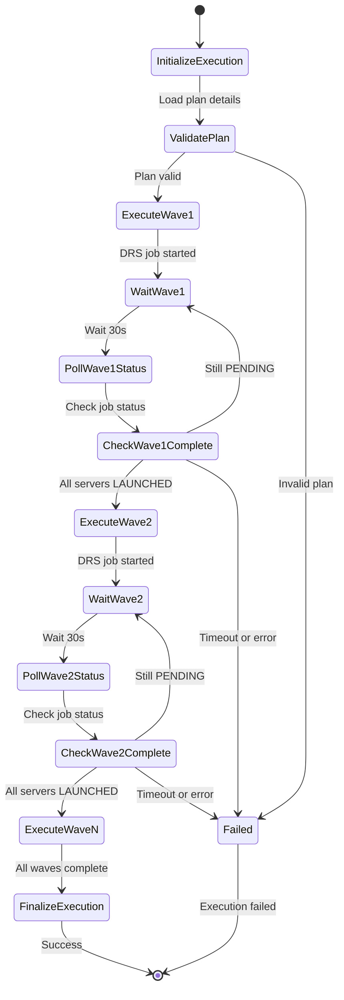

# Architecture Diagrams

Complete visual reference for AWS DRS Orchestration architecture, data flows, and component interactions.

## Table of Contents

1. [High-Level Architecture](#high-level-architecture)
2. [Lambda Functions Architecture](#lambda-functions-architecture)
3. [Data Flow Diagrams](#data-flow-diagrams)
4. [DRS Integration Flow](#drs-integration-flow)
5. [Step Functions Orchestration](#step-functions-orchestration)
6. [Deployment Architecture](#deployment-architecture)

---

## High-Level Architecture


**Key Components:**
- **5 Lambda Functions**: API handler, orchestration-stepfunctions, execution finder, execution poller, frontend builder
- **3 DynamoDB Tables**: Protection groups, recovery plans, execution history
- **1 Step Functions State Machine**: Wave-based orchestration engine
- **1 EventBridge Rule**: Triggers execution finder every 1 minute

---

## Lambda Functions Architecture


**Lambda Function Details:**

| Function | Handler | Timeout | Memory | Role | Purpose |
|----------|---------|---------|--------|------|---------|
| api-handler | index.lambda_handler | 120s | 512 MB | ApiHandlerRole | REST API endpoints |
| orchestration-stepfunctions | orchestration_stepfunctions.handler | 120s | 512 MB | OrchestrationRole | Step Functions orchestration |
| orchestration | drs_orchestrator.lambda_handler | 120s | 512 MB | OrchestrationRole | Legacy orchestrator |
| execution-finder | execution_finder.lambda_handler | 60s | 256 MB | ExecutionFinderRole | Find POLLING executions |
| execution-poller | execution_poller.lambda_handler | 120s | 256 MB | ExecutionPollerRole | Poll DRS job status |
| frontend-builder | build_and_deploy.lambda_handler | 900s | 2048 MB | CustomResourceRole | Deploy frontend |

---

## Data Flow Diagrams

### Protection Group Creation Flow


### Recovery Plan Execution Flow



### Execution Monitoring Flow



---

## DRS Integration Flow

### DRS Recovery Job Lifecycle



### IAM Permission Flow for DRS Operations



**Key Insight**: When Lambda calls `drs:StartRecovery`, DRS performs EC2 operations using the **Lambda role's IAM permissions**, not the DRS service-linked role. This is why OrchestrationRole needs comprehensive EC2 permissions.

**DRS Recovery Phases:**

| Phase | Description | Required Permissions |
|-------|-------------|---------------------|
| 1. Snapshot | EBS snapshots of source volumes | `ec2:CreateSnapshot` |
| 2. Conversion | Temporary EC2 instance converts snapshots to AMI | `ec2:RunInstances` |
| 3. Launch Template | Creates EC2 launch template for recovery | `ec2:CreateLaunchTemplate`, `ec2:CreateLaunchTemplateVersion`, `ec2:ModifyLaunchTemplate` |
| 4. Recovery | Final EC2 instances launched | `ec2:RunInstances`, `drs:CreateRecoveryInstanceForDrs` |

---

## Step Functions Orchestration

### State Machine Flow



### Wave Execution Pattern


**Wave Execution Rules:**

1. **One DRS job per wave** - All servers in a wave launched with single `start_recovery()` call
2. **Sequential execution** - Wave N+1 starts only after Wave N completes
3. **LAUNCHED status** - Trust DRS job status without requiring `recoveryInstanceID`
4. **Dependency validation** - Circular dependencies detected at plan creation

**Wave Execution Steps:**

For each wave:
1. Get protection groups assigned to wave
2. Collect all server IDs from protection groups
3. Call `drs:StartRecovery` with server IDs
4. Store DRS job ID in execution history
5. Poll `drs:DescribeJobs` until all servers show `launchStatus: LAUNCHED`

---

## Deployment Architecture

### CloudFormation Nested Stacks


### S3 Deployment Bucket Structure

```text
s3://aws-drs-orchestration/
├── cfn/                                   # CloudFormation templates
│   ├── master-template.yaml
│   ├── database-stack.yaml
│   ├── lambda-stack.yaml
│   ├── api-stack.yaml
│   ├── frontend-stack.yaml
│   ├── security-stack.yaml
│   └── step-functions-stack.yaml
├── lambda/                                # Lambda deployment packages (from CI/CD)
│   ├── api-handler.zip                    # index.py
│   ├── orchestration.zip                  # drs_orchestrator.py
│   ├── execution-finder.zip               # poller/execution_finder.py
│   └── execution-poller.zip               # poller/execution_poller.py
└── frontend/
    ├── index.html
    ├── assets/
    │   ├── index-[hash].js
    │   └── index-[hash].css
    └── aws-config.js                      # Generated by CI/CD with Cognito/API config
```

> **Note**: The `orchestration-stepfunctions.zip` and `frontend-builder.zip` packages are not currently built by CI/CD. They require manual packaging if needed.

### Technology Stack Versions

| Component | Technology | Version |
|-----------|------------|---------|
| **Frontend** | React | 19.1.1 |
| | TypeScript | 5.9.3 |
| | Vite | 7.1.7 |
| | CloudScape Design System | 3.0.1148 |
| | AWS Amplify | 6.15.8 |
| | React Router | 7.9.5 |
| | Axios | 1.13.2 |
| **Backend** | Python | 3.12 |
| | boto3 | (Lambda runtime) |
| | crhelper | 2.0.11 |
| **Infrastructure** | CloudFormation | 2010-09-09 |
| | DynamoDB | On-demand |
| | API Gateway | REST |
| | Step Functions | Standard |

---

## Component Interaction Matrix

| Component | Interacts With | Purpose |
|-----------|----------------|---------|
| **api-handler** | DynamoDB (all 3 tables) | CRUD operations |
| | AWS DRS | Server discovery |
| | Step Functions | Start executions |
| | Lambda (self) | Async invocation |
| **orchestration-stepfunctions** | DynamoDB (all 3 tables) | Read plans, update execution |
| | AWS DRS | start_recovery, describe_jobs |
| | EC2 | Launch template operations |
| **execution-finder** | DynamoDB (execution-history) | Query StatusIndex GSI |
| | Lambda (execution-poller) | Invoke for each execution |
| **execution-poller** | DynamoDB (execution-history) | Update execution status |
| | AWS DRS | describe_jobs |
| | CloudWatch | Put metrics |
| **frontend-builder** | S3 | Upload frontend artifacts |
| | CloudFront | Create invalidation |

---

## Summary

This architecture provides:

- **5 Lambda functions** for API, orchestration, and monitoring
- **3 DynamoDB tables** for data persistence with GSI for efficient queries
- **1 Step Functions state machine** for wave-based orchestration
- **1 EventBridge rule** for scheduled execution monitoring
- **Modular CloudFormation** with 6 nested stacks for maintainability
- **Serverless design** with pay-per-use pricing (~$12-40/month)
- **Enterprise-grade** with encryption, authentication, and audit trails

**Critical Architectural Decisions:**
1. **DRS uses calling role permissions** - OrchestrationRole needs EC2 permissions
2. **One DRS job per wave** - All servers launched together for efficiency
3. **LAUNCHED status is reliable** - No need to wait for recoveryInstanceID
4. **EventBridge polling** - 1-minute schedule for execution monitoring
5. **Step Functions orchestration** - Replaces legacy Lambda-based orchestrator
