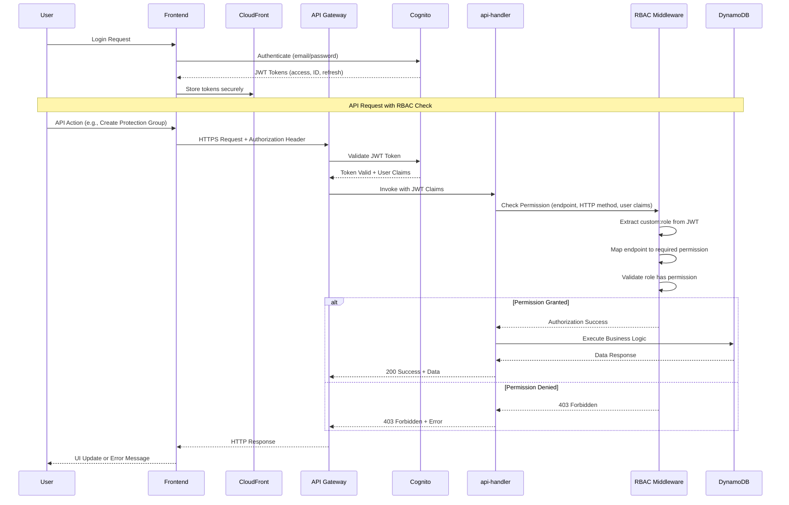
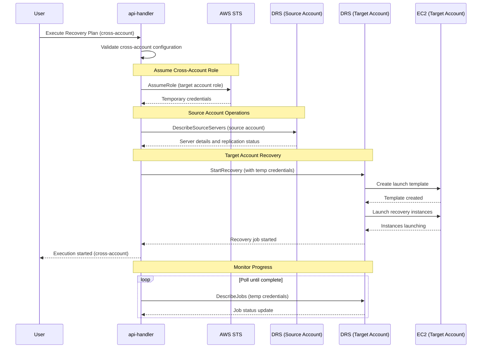
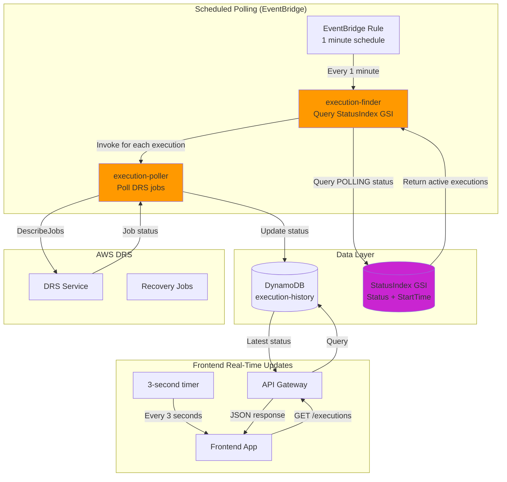
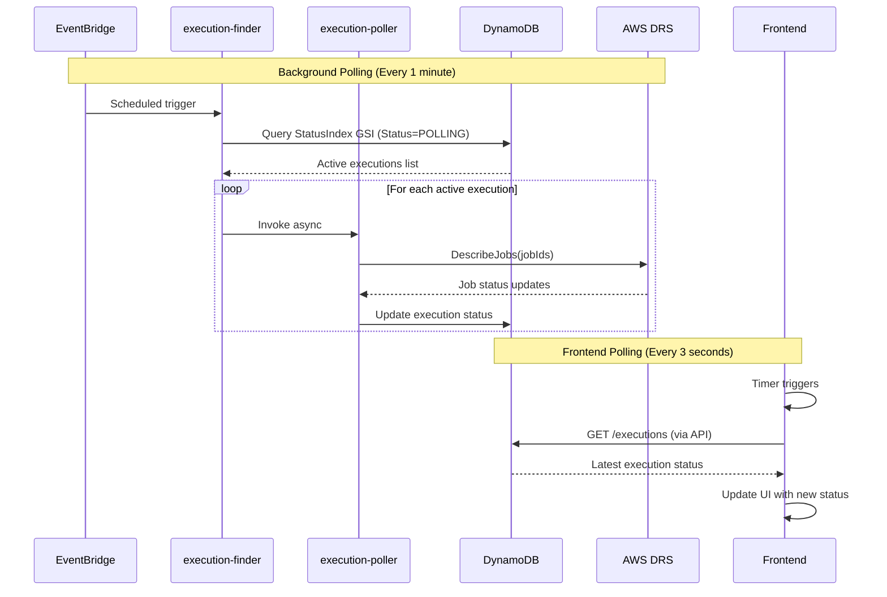
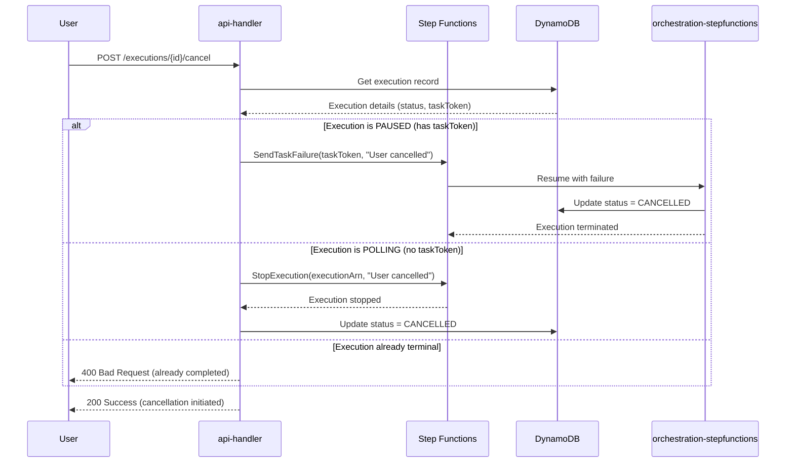
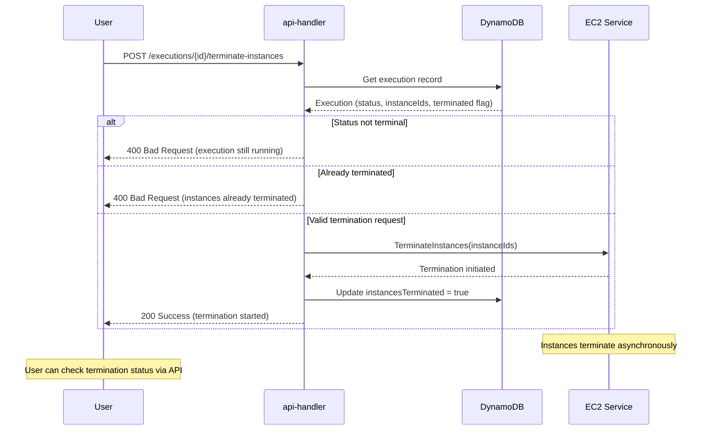

# Architecture Diagrams

Complete visual reference for AWS DRS Orchestration architecture, data flows, and component interactions.

## Overall Architecture


*[View/Edit Source Diagram](AWS-DRS-Orchestration-Architecture.drawio)*

---

## Table of Contents

1. [High-Level Architecture](#high-level-architecture)
2. [Lambda Functions Architecture](#lambda-functions-architecture)
3. [Data Flow Diagrams](#data-flow-diagrams)
4. [DRS Integration Flow](#drs-integration-flow)
5. [Step Functions Orchestration](#step-functions-orchestration)
6. [Pause/Resume Flow](#pauseresume-flow)
7. [Deployment Architecture](#deployment-architecture)

---

## High-Level Architecture


**Key Components:**

- **5 Lambda Functions**: API handler, orchestration-stepfunctions, execution finder, execution poller, frontend builder
- **3 DynamoDB Tables**: Protection groups, recovery plans, execution history (with StatusIndex GSI)
- **1 Step Functions State Machine**: Wave-based orchestration with `waitForTaskToken` for pause/resume
- **1 EventBridge Rule**: Triggers execution finder every 1 minute
- **Cognito User Pool**: JWT authentication with 45-minute session timeout

---

## Lambda Functions Architecture


### Lambda Function Details

| Function | File | Timeout | Memory | Purpose |
|----------|------|---------|--------|---------|
| api-handler | index.py | 120s | 512 MB | REST API endpoints, DRS integration, EC2 terminate |
| orchestration-stepfunctions | orchestration_stepfunctions.py | 120s | 512 MB | Step Functions orchestration, wave execution, pause/resume |
| execution-finder | poller/execution_finder.py | 60s | 256 MB | Query StatusIndex GSI, invoke poller |
| execution-poller | poller/execution_poller.py | 120s | 256 MB | Poll DRS job status, update execution records |
| frontend-builder | build_and_deploy.py | 900s | 2048 MB | CloudFormation custom resource for frontend deployment |

---

## Data Flow Diagrams

### User Request Flow


### Execution Start Flow


---

## DRS Integration Flow

### Recovery Job Lifecycle


### DRS API Integration


**Critical IAM Note**: DRS uses the calling Lambda role's IAM permissions for all EC2 operations. The Lambda execution role must include:

- `drs:CreateRecoveryInstanceForDrs` (often missing)
- `ec2:CreateLaunchTemplate`, `ec2:CreateLaunchTemplateVersion`
- `ec2:RunInstances`, `ec2:TerminateInstances`
- Full list in [PRD Technical Specifications](../requirements/PRODUCT_REQUIREMENTS_DOCUMENT.md#drs-integration)

---

## Step Functions Orchestration

### State Machine Definition


### Execution Status Transitions


---

## Pause/Resume Flow

The pause/resume mechanism uses Step Functions `waitForTaskToken` callback pattern, allowing executions to pause indefinitely (up to 1 year) until user intervention.

### Pause/Resume Sequence


### Task Token Storage


**Key Implementation Details**:

- Task token passed to Lambda via Step Functions context
- Token stored in DynamoDB `execution-history` table
- Maximum pause duration: 1 year (31536000 seconds)
- Resume triggers `SendTaskSuccess` with stored token
- Cancel triggers `SendTaskFailure` with stored token

---

## Terminate Instances Flow

After drill completion, users can terminate recovery EC2 instances to manage costs.


**Constraints**:

- Only available for terminal states: COMPLETED, FAILED, CANCELLED
- Prevents duplicate termination attempts
- Updates execution record with `instancesTerminated: true`

---

## Deployment Architecture

### S3 Deployment Bucket Structure

```text
s3://{deployment-bucket}/
├── cfn/                              # CloudFormation templates
│   ├── master-template.yaml
│   ├── database-stack.yaml
│   ├── lambda-stack.yaml
│   ├── api-stack.yaml
│   ├── step-functions-stack.yaml
│   ├── security-stack.yaml
│   └── frontend-stack.yaml
├── lambda/                           # Function deployment packages
│   ├── api-handler.zip
│   ├── orchestration-stepfunctions.zip
│   ├── execution-finder.zip
│   ├── execution-poller.zip
│   └── frontend-builder.zip
└── frontend/                         # Frontend build artifacts
    ├── index.html
    ├── assets/
    └── aws-config.json
```

### Nested Stack Architecture


**Stack Dependencies**:

1. **database-stack**: Creates DynamoDB tables (no dependencies)
2. **lambda-stack**: Creates Lambda functions (depends on database-stack outputs)
3. **api-stack**: Creates API Gateway + Cognito (depends on lambda-stack outputs)
4. **step-functions-stack**: Creates state machine (depends on lambda-stack outputs)
5. **security-stack**: Creates WAF + CloudTrail (optional, no dependencies)
6. **frontend-stack**: Creates S3 + CloudFront (depends on api-stack outputs)

---

## Technology Stack Versions

### Frontend Technologies

| Technology | Version | Purpose |
|------------|---------|---------|
| React | 19.1.1 | UI framework with hooks |
| TypeScript | 5.9.3 | Type safety |
| CloudScape Design System | 3.0.1148 | AWS-native UI components |
| Vite | 7.1.7 | Build tool and dev server |
| AWS Amplify | 6.15.8 | Cognito authentication |
| Axios | 1.13.2 | HTTP client |
| React Router | 7.9.5 | Client-side routing |
| react-hot-toast | 2.6.0 | Toast notifications |
| date-fns | 4.1.0 | Date formatting |
| ESLint | 9.36.0 | Code quality |

### Backend Technologies

| Technology | Version | Purpose |
|------------|---------|---------|
| Python | 3.12 | Lambda runtime |
| boto3 | (runtime) | AWS SDK |
| crhelper | 2.0.11 | CloudFormation custom resources |

### AWS Services

| Service | Purpose |
|---------|---------|
| API Gateway | REST API with Cognito authorizer |
| Cognito | User authentication (45-minute session timeout) |
| Step Functions | Orchestration with waitForTaskToken |
| DynamoDB | NoSQL database (3 tables + GSI) |
| S3 | Static hosting + deployment artifacts |
| CloudFront | CDN for frontend distribution |
| CloudFormation | Infrastructure as Code (7 nested stacks) |
| Lambda | Serverless compute (5 functions) |
| EventBridge | Scheduled polling (1-minute intervals) |
| CloudWatch | Logging and metrics |
| IAM | Least-privilege access control |
| AWS DRS | Elastic Disaster Recovery integration |

---

| Component | Reads From | Writes To | Invokes |
|-----------|------------|-----------|---------|
| api-handler | DynamoDB (all 3 tables), DRS | DynamoDB, CloudWatch Logs | Step Functions, EC2 |
| orchestration-stepfunctions | DynamoDB, DRS | DynamoDB, CloudWatch Logs | DRS StartRecovery |
| execution-finder | DynamoDB (StatusIndex GSI) | CloudWatch Logs | execution-poller |
| execution-poller | DynamoDB, DRS | DynamoDB, CloudWatch Metrics | - |
| frontend-builder | S3 (deployment bucket) | S3 (frontend bucket), CloudFront | - |
| Step Functions | - | CloudWatch Logs | orchestration-stepfunctions |
| EventBridge | - | - | execution-finder |
| Frontend | API Gateway | - | Cognito Auth |

---

## RBAC Authorization Flow

### JWT Token Validation and Permission Check



### RBAC Permission Matrix

| Role | Permissions | Endpoint Access |
|------|-------------|-----------------|
| **DRSAdmin** | All permissions | All 42+ endpoints |
| **DRSOperator** | Execute, manage, view, terminate | 35+ endpoints (no account management) |
| **DRSViewer** | View only | 15+ read-only endpoints |
| **DRSAuditor** | View + execution history | 20+ endpoints (no modifications) |
| **DRSCrossAccount** | Cross-account operations | 25+ endpoints (account-specific) |

---

## Cross-Account DRS Operations

### Cross-Account Recovery Execution Flow



### Cross-Account IAM Configuration

**Source Account Role (DRS servers)**:
```json
{
  "Version": "2012-10-17",
  "Statement": [
    {
      "Effect": "Allow",
      "Action": [
        "drs:DescribeSourceServers",
        "drs:GetReplicationConfiguration"
      ],
      "Resource": "*"
    }
  ]
}
```

**Target Account Role (Recovery instances)**:
```json
{
  "Version": "2012-10-17",
  "Statement": [
    {
      "Effect": "Allow",
      "Action": [
        "drs:StartRecovery",
        "drs:DescribeJobs",
        "drs:CreateRecoveryInstanceForDrs",
        "ec2:RunInstances",
        "ec2:CreateLaunchTemplate",
        "ec2:CreateLaunchTemplateVersion",
        "ec2:TerminateInstances"
      ],
      "Resource": "*"
    }
  ]
}
```

---

## Real-Time Polling Mechanisms

### Execution Status Polling Architecture



### Polling State Transitions

```mermaid
stateDiagram-v2
    [*] --> PENDING: Execution Created
    PENDING --> INITIATED: Step Functions Started
    INITIATED --> POLLING: DRS Job Started
    
    state POLLING {
        [*] --> CheckJobStatus
        CheckJobStatus --> LAUNCHING: All jobs LAUNCHED
        CheckJobStatus --> POLLING: Jobs still in progress
        CheckJobStatus --> FAILED: Any job FAILED
    }
    
    POLLING --> PAUSED: Pause before wave
    PAUSED --> POLLING: User resumes
    PAUSED --> CANCELLED: User cancels
    
    POLLING --> COMPLETED: All waves done
    POLLING --> PARTIAL: Some waves failed
    POLLING --> CANCELLED: User cancels
    
    COMPLETED --> [*]
    PARTIAL --> [*]
    FAILED --> [*]
    CANCELLED --> [*]
```

### Real-Time Update Flow



---

## Cancel and Terminate Flows

### Execution Cancellation Flow



### Instance Termination Flow



---

## Advanced Execution Control Patterns

### Wave-Based Execution with Dependencies

```mermaid
graph TB
    subgraph "Recovery Plan Structure"
        Plan[Recovery Plan]
        W1[Wave 1: Database Tier<br/>pauseBeforeWave: false]
        W2[Wave 2: Application Tier<br/>pauseBeforeWave: true]
        W3[Wave 3: Web Tier<br/>pauseBeforeWave: false]
    end
    
    subgraph "Execution Flow"
        Start[Start Execution]
        ExecW1[Execute Wave 1]
        MonitorW1[Monitor Wave 1 Jobs]
        CompleteW1[Wave 1 Complete]
        
        PauseW2[Pause Before Wave 2]
        WaitW2[Wait for Resume Signal]
        ExecW2[Execute Wave 2]
        MonitorW2[Monitor Wave 2 Jobs]
        CompleteW2[Wave 2 Complete]
        
        ExecW3[Execute Wave 3]
        MonitorW3[Monitor Wave 3 Jobs]
        CompleteW3[Wave 3 Complete]
        
        End[Execution Complete]
    end
    
    Plan --> W1
    W1 --> W2
    W2 --> W3
    
    Start --> ExecW1
    ExecW1 --> MonitorW1
    MonitorW1 --> CompleteW1
    CompleteW1 --> PauseW2
    PauseW2 --> WaitW2
    WaitW2 -->|User Resume| ExecW2
    ExecW2 --> MonitorW2
    MonitorW2 --> CompleteW2
    CompleteW2 --> ExecW3
    ExecW3 --> MonitorW3
    MonitorW3 --> CompleteW3
    CompleteW3 --> End
    
    style PauseW2 fill:#E7157B
    style WaitW2 fill:#E7157B
```



### Task Token Management for Pause/Resume

```mermaid
sequenceDiagram
    participant SF as Step Functions
    participant Lambda as orchestration-stepfunctions
    participant DDB as DynamoDB
    participant API as api-handler
    participant User
    
    Note over SF,Lambda: Wave configured with pauseBeforeWave=true
    
    SF->>Lambda: Invoke with taskToken
    Lambda->>DDB: Store taskToken in execution record
    Lambda->>DDB: Update status = PAUSED
    Lambda->>DDB: Store wave context (number, name, servers)
    Lambda-->>SF: Return (no SendTaskSuccess yet)
    
    Note over SF: Step Functions waits indefinitely
    Note over SF: Maximum wait: 1 year (31536000 seconds)
    
    User->>API: POST /executions/{id}/resume
    API->>DDB: Get execution record
    DDB-->>API: taskToken + wave context
    API->>SF: SendTaskSuccess(taskToken, waveContext)
    SF->>Lambda: Continue with wave execution
    Lambda->>DDB: Update status = POLLING
    Lambda->>Lambda: Execute DRS StartRecovery
```

---

## Component Interaction Matrix (Enhanced)

### Service Communication Patterns

| Source Service | Target Service | Communication Type | Purpose | Frequency |
|----------------|----------------|--------------------|---------|-----------|
| **Frontend** | **CloudFront** | HTTPS | Static asset delivery | Continuous |
| **Frontend** | **API Gateway** | HTTPS + JWT | API requests | Per user action |
| **API Gateway** | **Cognito** | AWS API | JWT validation | Per API request |
| **API Gateway** | **api-handler** | Synchronous invoke | Request processing | Per API request |
| **api-handler** | **DynamoDB** | AWS SDK | CRUD operations | Per API request |
| **api-handler** | **Step Functions** | AWS SDK | Start executions | Per execution start |
| **api-handler** | **AWS DRS** | AWS SDK | Server discovery | Per DRS query |
| **api-handler** | **EC2** | AWS SDK | Instance termination | Per terminate request |
| **Step Functions** | **orchestration-stepfunctions** | Synchronous invoke | Wave execution | Per wave |
| **orchestration-stepfunctions** | **AWS DRS** | AWS SDK | Recovery operations | Per wave |
| **orchestration-stepfunctions** | **DynamoDB** | AWS SDK | Status updates | Per wave transition |
| **EventBridge** | **execution-finder** | Scheduled invoke | Polling trigger | Every 1 minute |
| **execution-finder** | **DynamoDB** | AWS SDK | Query active executions | Every 1 minute |
| **execution-finder** | **execution-poller** | Asynchronous invoke | Job status polling | Per active execution |
| **execution-poller** | **AWS DRS** | AWS SDK | Job status queries | Per polling cycle |
| **execution-poller** | **DynamoDB** | AWS SDK | Status updates | Per job status change |
| **execution-poller** | **CloudWatch** | AWS SDK | Metrics publishing | Per status update |
| **frontend-builder** | **S3** | AWS SDK | Deploy frontend | Per deployment |
| **frontend-builder** | **CloudFront** | AWS SDK | Cache invalidation | Per deployment |

### Data Flow Patterns

```mermaid
graph LR
    subgraph "User Interface Layer"
        User[User Browser]
        Frontend[React Frontend]
    end
    
    subgraph "Content Delivery"
        CF[CloudFront CDN]
        S3Frontend[S3 Frontend Bucket]
    end
    
    subgraph "API Layer"
        APIGW[API Gateway]
        Cognito[Cognito User Pool]
    end
    
    subgraph "Compute Layer"
        APIHandler[api-handler Lambda]
        OrchSF[orchestration-stepfunctions]
        ExecFinder[execution-finder]
        ExecPoller[execution-poller]
    end
    
    subgraph "Orchestration"
        StepFn[Step Functions]
        EventBridge[EventBridge]
    end
    
    subgraph "Data Layer"
        DDBProtection[(protection-groups)]
        DDBPlans[(recovery-plans)]
        DDBHistory[(execution-history)]
    end
    
    subgraph "AWS Services"
        DRS[AWS DRS]
        EC2[EC2 Service]
    end
    
    User -.->|HTTPS| CF
    CF -.->|Origin| S3Frontend
    User -.->|API Calls| APIGW
    APIGW -.->|Auth| Cognito
    APIGW -.->|Invoke| APIHandler
    
    APIHandler -.->|CRUD| DDBProtection
    APIHandler -.->|CRUD| DDBPlans
    APIHandler -.->|CRUD| DDBHistory
    APIHandler -.->|Start| StepFn
    APIHandler -.->|Query| DRS
    APIHandler -.->|Terminate| EC2
    
    StepFn -.->|Invoke| OrchSF
    OrchSF -.->|Recovery| DRS
    OrchSF -.->|Update| DDBHistory
    
    EventBridge -.->|Schedule| ExecFinder
    ExecFinder -.->|Query| DDBHistory
    ExecFinder -.->|Invoke| ExecPoller
    ExecPoller -.->|Poll| DRS
    ExecPoller -.->|Update| DDBHistory
    
    style APIHandler fill:#FF9900
    style OrchSF fill:#FF9900
    style ExecFinder fill:#FF9900
    style ExecPoller fill:#FF9900
```

---

## Summary

This architecture provides:

- **Serverless**: No servers to manage, pay-per-use pricing
- **Scalable**: Handles multiple concurrent executions
- **Resilient**: Built-in retry logic, error handling
- **Secure**: Cognito JWT auth, IAM least-privilege, encryption at rest
- **Observable**: CloudWatch logs and metrics for all components
- **Maintainable**: Modular nested stacks, Infrastructure as Code

**Key Patterns**:

- `waitForTaskToken` for pause/resume capability
- StatusIndex GSI for efficient execution polling
- EventBridge scheduled triggers for background processing
- CloudFront + S3 for global frontend distribution
- API Gateway + Cognito for secure API access
- RBAC middleware for granular permission control
- Cross-account DRS operations with STS role assumption
- Real-time polling with dual-layer architecture (EventBridge + Frontend)

**Advanced Features**:

- **42+ REST API endpoints** across 12 categories
- **5-role RBAC system** with 11 granular permissions
- **Cross-account orchestration** with STS role assumption
- **Pause/resume execution control** with indefinite wait capability
- **Real-time DRS integration** with job status monitoring
- **Instance termination management** for cost optimization
- **Tag-based server selection** with conflict detection
- **Wave-based execution** with dependency management
