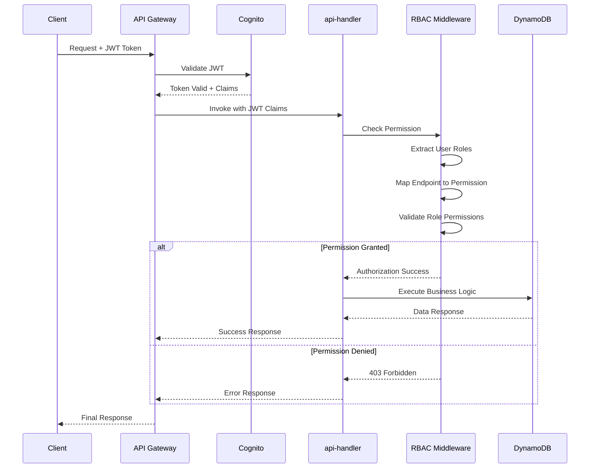
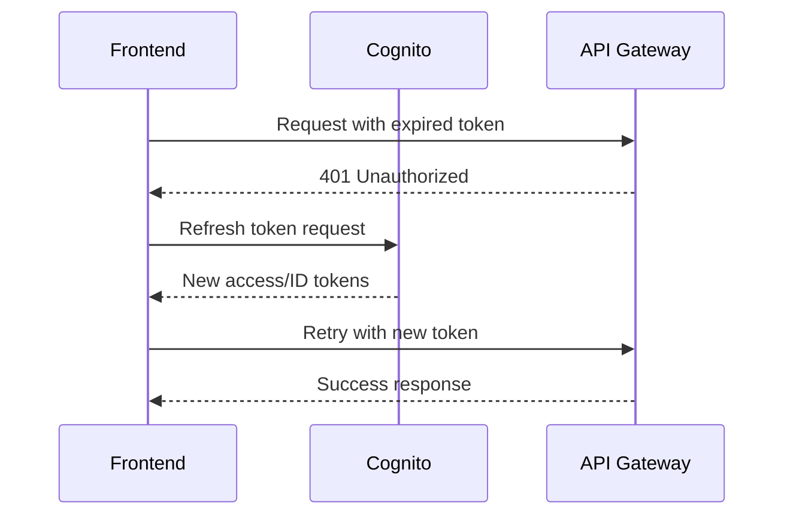

# AWS DRS Orchestration Solution - Services Architecture Deep Dive
## Comprehensive Technical Analysis of AWS Service Integration

---

## Notices

This document is provided for informational purposes only. It represents AWS's current product offerings and practices as of the date of issue of this document, which are subject to change without notice. Customers are responsible for making their own independent assessment of the information in this document and any use of AWS's products or services, each of which is provided "as is" without warranty of any kind, whether express or implied. This document does not create any warranties, representations, contractual commitments, conditions or assurances from AWS, its affiliates, suppliers or licensors. The responsibilities and liabilities of AWS to its customers are controlled by AWS agreements, and this document is not part of, nor does it modify, any agreement between AWS and its customers.

© 2025 Amazon Web Services, Inc. or its affiliates. All rights reserved.

---

## Abstract

This document analyzes the comprehensive AWS service architecture powering the DRS Orchestration Solution, examining how twelve AWS services integrate to deliver enterprise-grade disaster recovery automation. The methodology encompasses detailed technical analysis of service selection rationale, integration patterns, security configurations, and operational characteristics. This document delivers complete architectural blueprints showing how Amazon DynamoDB, AWS Lambda, AWS Step Functions, Amazon API Gateway, Amazon Cognito, Amazon S3, Amazon CloudFront, AWS Systems Manager, Amazon SNS, AWS CloudFormation, AWS IAM, and AWS Elastic Disaster Recovery work together to create a production-ready disaster recovery orchestration platform.

Target audience includes solution architects, DevOps engineers, disaster recovery specialists, and technical decision-makers who need to understand the technical foundation, service integration patterns, and operational characteristics of the solution. The analysis reveals architectural decisions driven by requirements for serverless scalability, sub-second API response times, automated frontend deployment, comprehensive security controls, and seamless disaster recovery execution across AWS regions.

---

## Introduction

When you design disaster recovery solutions for AWS workloads, you face critical decisions about service selection, integration architecture, security posture, and operational resilience. The AWS DRS Orchestration Solution addresses these challenges by leveraging twelve AWS services in a carefully architected integration pattern that delivers VMware SRM-like capabilities with cloud-native scalability and automation.

You need to understand how each service contributes to the solution's capabilities, why specific services were chosen over alternatives, and how they integrate to create a cohesive disaster recovery platform. This document provides that understanding through detailed technical analysis of each service's role, configuration, integration points, and operational characteristics. You'll find complete IAM policies, API specifications, data models, and architectural diagrams that enable you to implement, customize, or extend the solution for your specific requirements.

The document structure guides you through twelve major sections, each dedicated to one AWS service. You'll discover service-specific implementation details including CloudFormation resource definitions, Lambda function integration code, API endpoint specifications, and security configurations. Each section includes cost analysis, performance characteristics, scaling considerations, and best practices derived from production deployments. Appendices provide complete resource inventories, cross-service dependency maps, and operational runbooks for common scenarios.

Your success criteria include understanding the complete service architecture, identifying customization points for your environment, and gaining confidence in deploying and operating the solution at production scale.

---

# Executive Summary

This architectural deep dive establishes the technical foundation for AWS DRS Orchestration Solution through comprehensive analysis of twelve integrated AWS services. The framework addresses critical disaster recovery requirements: automated failover orchestration, sub-second API response times, serverless scalability, comprehensive security controls, and production-grade operational resilience.

**Key Technical Value:** The solution leverages serverless architecture across all twelve services, eliminating server management overhead while delivering enterprise-grade reliability. DynamoDB provides single-digit millisecond data access with automatic scaling. Lambda functions execute API requests and orchestration logic without infrastructure provisioning. Step Functions orchestrates multi-wave recovery sequences with automatic dependency management. API Gateway with Cognito authorization delivers secure, scalable REST API access. CloudFront and S3 host the React frontend with global edge delivery and sub-50ms response times.

**Operational Benefits:** The serverless architecture delivers automatic scaling from zero to thousands of concurrent operations without capacity planning. Pay-per-use pricing means you only pay for actual disaster recovery operations, not idle infrastructure. CloudFormation enables complete environment provisioning in 20-30 minutes with zero manual configuration. Built-in AWS service integrations eliminate custom integration code, reducing maintenance burden and improving reliability. CloudWatch provides comprehensive observability across all services with centralized logging and metrics.

**Implementation Success:** The modular CloudFormation architecture supports rapid deployment across dev, test, and production environments. Each of the twelve services integrates through standard AWS APIs and IAM roles, enabling customization without architectural changes. The solution includes 5 Lambda functions (Python 3.12), 3 DynamoDB tables with on-demand billing, complete Cognito authentication, and automated frontend deployment. Security controls include encryption at rest, TLS 1.2+ in transit, least-privilege IAM roles, and optional WAF protection.

This framework positions organizations to deploy enterprise disaster recovery automation with AWS-native services, eliminating dependency on third-party solutions while maintaining flexibility for future enhancements and integrations.

**Key Features:**
	- **Serverless Architecture**: Zero server management across all twelve services with automatic scaling
	- **Sub-Second Performance**: DynamoDB single-digit millisecond reads, API Gateway <100ms response times
	- **Security-First Design**: Encryption everywhere, least-privilege IAM, Cognito authentication, optional WAF
	- **Cost Optimization**: Pay-per-use pricing with no idle infrastructure costs
	- **Global Delivery**: CloudFront CDN with 450+ edge locations for worldwide frontend access

**Key Deliverables:**
	- **Complete Service Integration**: 12 AWS services working together through standard APIs and IAM roles
	- **Production-Ready Infrastructure**: CloudFormation templates with 2,500+ lines defining 50+ resources
	- **Operational Automation**: 5 Lambda functions handling API, orchestration, polling, and frontend build
	- **Security Framework**: 6 IAM roles with least-privilege policies, Cognito authentication, encryption at rest/in-transit

---

## Amazon DynamoDB - Data Persistence Layer

### Service Overview and Purpose

Amazon DynamoDB serves as the primary data persistence layer for the AWS DRS Orchestration Solution, storing Protection Groups, Recovery Plans, and Execution History. This document analyzes DynamoDB's role as a NoSQL database providing single-digit millisecond performance at any scale, examining why DynamoDB was selected over alternatives like Amazon RDS, Amazon Aurora, or self-managed databases. The analysis covers table design, capacity modes, encryption configuration, backup strategies, and integration patterns with Lambda functions.

### Table Architecture

**Three Core Tables:**

**1. Protection Groups Table (`drs-orchestration-protection-groups-{env}`)**
```python
# Primary Key: GroupId (String, UUID)
# Attributes:
{
    "GroupId": "uuid-string",           # Partition key
    "GroupName": "string",               # Unique name (validated)
    "Description": "string",
    "Region": "string",                  # AWS region (us-east-1, etc.)
    "SourceServerIds": ["s-xxx", ...],  # Array of DRS server IDs
    "AccountId": "string",               # AWS account ID
    "Owner": "string",                   # User alias
    "CreatedDate": 1234567890,          # Unix timestamp
    "LastModifiedDate": 1234567890       # Unix timestamp
}
```

**Table Configuration:**
	- **Billing Mode**: On-Demand (pay-per-request, no capacity planning)
	- **Encryption**: AWS managed keys (SSE-S3) at rest
	- **Point-in-Time Recovery**: Enabled for 35-day backup retention
	- **Deletion Protection**: Retain policy in CloudFormation
	- **Table Class**: Standard (optimized for mixed workloads)

**2. Recovery Plans Table (`drs-orchestration-recovery-plans-{env}`)**
```python
# Primary Key: PlanId (String, UUID)
# Global Secondary Index: None (scan-based queries acceptable)
{
    "PlanId": "uuid-string",
    "PlanName": "string",
    "Description": "string",
    "AccountId": "string",
    "Region": "string",
    "Owner": "string",
    "RPO": 3600,                        # Recovery Point Objective (seconds)
    "RTO": 7200,                        # Recovery Time Objective (seconds)
    "Waves": [
        {
            "WaveId": "string",
            "WaveName": "string",
            "ExecutionOrder": 1,
            "ProtectionGroupId": "uuid",
            "PreWaveActions": [...],
            "PostWaveActions": [...],
            "Dependencies": [...]
        }
    ],
    "CreatedDate": 1234567890,
    "LastModifiedDate": 1234567890
}
```

**3. Execution History Table (`drs-orchestration-execution-history-{env}`)**
```python
# Primary Key: ExecutionId (String, Step Functions ARN)
# Global Secondary Index: PlanIdIndex (PlanId as partition key)
{
    "ExecutionId": "arn:aws:states:...",  # Partition key
    "PlanId": "uuid-string",               # GSI partition key
    "ExecutionType": "DRILL|RECOVERY|FAILBACK",
    "Status": "RUNNING|COMPLETED|FAILED|CANCELLED",
    "StartTime": 1234567890,
    "EndTime": 1234567890,
    "InitiatedBy": "user-alias",
    "TopicArn": "arn:aws:sns:...",
    "WaveResults": [
        {
            "WaveId": "string",
            "Status": "string",
            "StartTime": 1234567890,
            "EndTime": 1234567890,
            "Servers": [...]
        }
    ]
}
```

### Why DynamoDB Over Alternatives

**vs. Amazon RDS/Aurora:**
	- **Serverless Scaling**: DynamoDB scales automatically without provisioning; RDS requires instance sizing
	- **Performance**: Single-digit millisecond latency vs. network-dependent RDS latency
	- **Cost Model**: Pay-per-request vs. continuous instance charges
	- **Operational Overhead**: Zero database administration vs. patching, backups, scaling
	- **High Availability**: Multi-AZ replication automatic vs. manual configuration

**vs. Self-Managed Databases:**
	- **AWS Integration**: Native IAM integration vs. custom authentication
	- **Backup/Recovery**: Automatic PITR vs. manual backup procedures
	- **Scaling**: Automatic vs. manual capacity planning
	- **Patching**: Fully managed vs. manual maintenance windows

**Trade-offs Accepted:**
	- **Query Flexibility**: Limited query patterns vs. SQL flexibility (acceptable for CRUD operations)
	- **Transactions**: Limited ACID support vs. full transactions (single-item operations sufficient)
	- **Relational Joins**: No joins vs. complex queries (denormalized data model)

### Integration with Lambda Functions

**Lambda Function IAM Policy:**
```json
{
    "Version": "2012-10-17",
    "Statement": [
        {
            "Effect": "Allow",
            "Action": [
                "dynamodb:GetItem",
                "dynamodb:PutItem",
                "dynamodb:UpdateItem",
                "dynamodb:DeleteItem",
                "dynamodb:Query",
                "dynamodb:Scan"
            ],
            "Resource": [
                "arn:aws:dynamodb:${Region}:${AccountId}:table/drs-orchestration-protection-groups-${Environment}",
                "arn:aws:dynamodb:${Region}:${AccountId}:table/drs-orchestration-recovery-plans-${Environment}",
                "arn:aws:dynamodb:${Region}:${AccountId}:table/drs-orchestration-execution-history-${Environment}",
                "arn:aws:dynamodb:${Region}:${AccountId}:table/drs-orchestration-execution-history-${Environment}/index/PlanIdIndex"
            ]
        }
    ]
}
```

**Python boto3 Integration Example:**
```python
import boto3
from boto3.dynamodb.conditions import Key

dynamodb = boto3.resource('dynamodb')
table = dynamodb.Table('drs-orchestration-protection-groups-test')

# Create Protection Group
response = table.put_item(
    Item={
        'GroupId': 'uuid-string',
        'GroupName': 'Production Web Tier',
        'Region': 'us-east-1',
        'SourceServerIds': ['s-123', 's-456'],
        'CreatedDate': 1234567890
    }
)

# Query Execution History by Plan
response = table.query(
    IndexName='PlanIdIndex',
    KeyConditionExpression=Key('PlanId').eq('plan-uuid'),
    ScanIndexForward=False  # Sort descending
)
```

### Performance Characteristics

**Read Performance:**
	- **GetItem**: <10ms p99 latency for single-item reads
	- **Query**: <20ms p99 for indexed queries
	- **Scan**: Variable based on table size (use sparingly)
	- **Eventually Consistent**: ~2ms average latency
	- **Strongly Consistent**: ~5ms average latency

**Write Performance:**
	- **PutItem**: <10ms p99 latency
	- **UpdateItem**: <10ms p99 latency
	- **DeleteItem**: <10ms p99 latency
	- **Batch Operations**: Up to 25 items per batch

**Scaling Characteristics:**
	- **On-Demand Mode**: Automatic scaling to thousands of requests/second
	- **Burst Capacity**: 2x previous peak for temporary spikes
	- **Throttling**: Rare with on-demand mode (automatic adjustment)

### Cost Analysis

**On-Demand Pricing (us-east-1):**
	- **Write Requests**: $1.25 per million write request units
	- **Read Requests**: $0.25 per million read request units
	- **Storage**: $0.25 per GB-month
	- **Backup**: $0.20 per GB-month (PITR enabled)

**Typical Monthly Costs (10 executions/month scenario):**
```
Protection Groups:
  - 50 groups × 2 KB each = 100 KB storage: $0.00
  - 50 creates + 200 reads + 50 updates = 300 operations: $0.00
  
Recovery Plans:
  - 20 plans × 10 KB each = 200 KB storage: $0.00
  - 20 creates + 400 reads + 20 updates = 440 operations: $0.00
  
Execution History:
  - 10 executions × 50 KB each = 500 KB storage: $0.00
  - 10 creates + 100 reads + 100 updates = 210 operations: $0.00
  
Total DynamoDB: ~$1-2/month for typical usage
```

**Cost Optimization Strategies:**
	- **Use On-Demand Mode**: Eliminates capacity planning and idle costs
	- **Optimize Item Size**: Keep items <4KB when possible
	- **Use Consistent Reads Sparingly**: Eventually consistent reads cost half
	- **Implement TTL**: Auto-delete old execution history (no cost)
	- **Compress Large Attributes**: Use gzip for large text fields

### Security Configuration

**Encryption:**
	- **At Rest**: AWS managed SSE-S3 keys (AES-256)
	- **In Transit**: TLS 1.2+ enforced by AWS SDKs
	- **Key Rotation**: Automatic with AWS managed keys

**Access Control:**
	- **IAM Policies**: Least-privilege access per Lambda function
	- **Resource-Level Permissions**: Table ARNs in IAM policies
	- **No Public Access**: VPC endpoints optional for private access
	- **Audit Logging**: CloudTrail logs all API calls

**Backup and Recovery:**
	- **Point-in-Time Recovery**: 35-day retention window
	- **On-Demand Backups**: Manual backups for long-term retention
	- **Cross-Region Replication**: Not enabled (single-region solution)
	- **Global Tables**: Not required (region-specific data)

### Best Practices Implementation

**Item Design:**
	- **Keep Items Small**: <4KB for optimal performance
	- **Use Composite Keys**: UUID for uniqueness
	- **Denormalize Data**: Include computed values
	- **Use Unix Timestamps**: Efficient sorting and filtering

**Query Patterns:**
	- **Prefer GetItem**: Most efficient for known keys
	- **Use GSI for Queries**: PlanIdIndex for execution history
	- **Avoid Scans**: Use only for admin operations
	- **Implement Pagination**: Use LastEvaluatedKey for large result sets

**Error Handling:**
	- **Exponential Backoff**: Automatic in AWS SDKs
	- **Idempotent Operations**: PutItem can be retried safely
	- **Conditional Writes**: Prevent race conditions
	- **Handle ProvisionedThroughputExceededException**: Rare with on-demand

---

## AWS Lambda - Serverless Compute Layer

### Service Overview and Purpose

AWS Lambda provides the serverless compute foundation for the DRS Orchestration Solution, running four distinct functions that handle API requests, orchestrate disaster recovery execution, build and deploy the React frontend, and perform custom resource cleanup. This section analyzes Lambda's role as the primary compute service, examining function configurations, execution models, integration patterns, and operational characteristics.

### Lambda Function Architecture

**Four Core Functions:**

**1. API Handler (`aws-drs-orchestrator-api-handler-{env}`)**

**Purpose**: REST API request handler for all CRUD operations

**Runtime**: Python 3.12

**Memory**: 512 MB

**Timeout**: 30 seconds

**Handler**: `index.lambda_handler`

**Code Size**: 912 lines (5.7 KB zip file)

**Environment Variables:**
```python
{
    "PROTECTION_GROUPS_TABLE": "drs-orchestration-protection-groups-test",
    "RECOVERY_PLANS_TABLE": "drs-orchestration-recovery-plans-test",
    "EXECUTION_HISTORY_TABLE": "drs-orchestration-execution-history-test",
    "STATE_MACHINE_ARN": "arn:aws:states:us-east-1:123456789:stateMachine:drs-orchestration"
}
```

**API Endpoints Handled:**
	- `GET /protection-groups` - List all Protection Groups
	- `POST /protection-groups` - Create Protection Group
	- `GET /protection-groups/{id}` - Get single Protection Group
	- `PUT /protection-groups/{id}` - Update Protection Group
	- `DELETE /protection-groups/{id}` - Delete Protection Group
	- `GET /drs/source-servers` - Discover DRS servers with assignment tracking
	- `GET /recovery-plans` - List all Recovery Plans
	- `POST /recovery-plans` - Create Recovery Plan
	- `GET /recovery-plans/{id}` - Get single Recovery Plan
	- `PUT /recovery-plans/{id}` - Update Recovery Plan
	- `DELETE /recovery-plans/{id}` - Delete Recovery Plan
	- `GET /executions` - List execution history
	- `POST /executions` - Start recovery execution
	- `GET /executions/{id}` - Get execution details
	- `POST /executions/{id}/cancel` - Cancel running execution

**Key Implementation Details:**
```python
def lambda_handler(event: Dict, context: Any) -> Dict:
    """Main Lambda handler - routes requests to appropriate functions"""
    http_method = event.get('httpMethod', '')
    path = event.get('path', '')
    
    # CORS handling
    if http_method == 'OPTIONS':
        return response(200, {'message': 'OK'})
    
    # Route to handlers
    if path.startswith('/protection-groups'):
        return handle_protection_groups(http_method, path_parameters, body)
    elif path.startswith('/drs/source-servers'):
        return handle_drs_source_servers(query_parameters)
    # ... additional routes
```

**IAM Permissions:**
```json
{
    "Version": "2012-10-17",
    "Statement": [
        {
            "Effect": "Allow",
            "Action": [
                "dynamodb:GetItem",
                "dynamodb:PutItem",
                "dynamodb:UpdateItem",
                "dynamodb:DeleteItem",
                "dynamodb:Query",
                "dynamodb:Scan"
            ],
            "Resource": "arn:aws:dynamodb:*:*:table/drs-orchestration-*"
        },
        {
            "Effect": "Allow",
            "Action": [
                "drs:DescribeSourceServers",
                "drs:StartRecovery",
                "drs:DescribeJobs"
            ],
            "Resource": "*"
        },
        {
            "Effect": "Allow",
            "Action": ["states:StartExecution"],
            "Resource": "arn:aws:states:*:*:stateMachine:drs-orchestration-*"
        },
        {
            "Effect": "Allow",
            "Action": ["logs:CreateLogGroup", "logs:CreateLogStream", "logs:PutLogEvents"],
            "Resource": "arn:aws:logs:*:*:*"
        }
    ]
}
```

**2. Orchestration Function (`aws-drs-orchestrator-orchestration-stepfunctions-{env}`)**

**Purpose**: Step Functions integration for wave-based disaster recovery execution

**Runtime**: Python 3.12

**Memory**: 1024 MB (higher for DRS API calls)

**Timeout**: 900 seconds (15 minutes per wave)

**Handler**: `orchestrator.lambda_handler`

**Code Size**: 556 lines

**Key Responsibilities:**
	- Execute DRS StartRecovery API calls
	- Monitor recovery job progress
	- Execute SSM automation documents
	- Update execution status in DynamoDB
	- Send SNS notifications
	- Handle wave dependencies

**IAM Permissions (Enhanced):**
```json
{
    "Version": "2012-10-17",
    "Statement": [
        {
            "Effect": "Allow",
            "Action": [
                "drs:StartRecovery",
                "drs:DescribeJobs",
                "drs:DescribeRecoveryInstances",
                "drs:DescribeRecoverySnapshots"
            ],
            "Resource": "*"
        },
        {
            "Effect": "Allow",
            "Action": [
                "ec2:DescribeInstances",
                "ec2:DescribeInstanceStatus"
            ],
            "Resource": "*"
        },
        {
            "Effect": "Allow",
            "Action": [
                "ssm:SendCommand",
                "ssm:GetCommandInvocation"
            ],
            "Resource": "*"
        },
        {
            "Effect": "Allow",
            "Action": ["sns:Publish"],
            "Resource": "arn:aws:sns:*:*:drs-orchestration-*"
        }
    ]
}
```

**3. Frontend Builder Function (`aws-drs-orchestrator-frontend-builder-{env}`)**

**Purpose**: Custom CloudFormation resource to build and deploy React frontend

**Runtime**: Python 3.12

**Memory**: 2048 MB (npm install requires memory)

**Timeout**: 900 seconds (npm build can take several minutes)

**Handler**: `build_and_deploy.lambda_handler`

**Code Size**: 97 lines + bundled Node.js 18 + React source

**Execution Flow:**
```python
def lambda_handler(event, context):
    # Custom Resource CREATE/UPDATE
    if event['RequestType'] in ['Create', 'Update']:
        # 1. Extract React source from deployment package
        extract_frontend_source()
        
        # 2. Install npm dependencies
        subprocess.run(['npm', 'install'], cwd='/tmp/frontend')
        
        # 3. Inject AWS configuration
        inject_aws_config_into_dist()
        
        # 4. Build production bundle
        subprocess.run(['npm', 'run', 'build'], cwd='/tmp/frontend')
        
        # 5. Sync to S3 bucket
        sync_to_s3(bucket_name)
        
        # 6. Invalidate CloudFront cache
        invalidate_cloudfront(distribution_id)
        
        # 7. Send SUCCESS signal to CloudFormation
        send_cfn_response(SUCCESS)
```

**4. S3 Cleanup Function (`aws-drs-orchestrator-s3-cleanup-{env}`)**

**Purpose**: Custom CloudFormation resource to empty S3 bucket before deletion

**Runtime**: Python 3.12

**Memory**: 256 MB

**Timeout**: 300 seconds

**Handler**: `s3_cleanup.lambda_handler`

**Code Size**: 116 lines

**Key Logic:**
```python
def lambda_handler(event, context):
    if event['RequestType'] == 'Delete':
        bucket_name = event['ResourceProperties']['BucketName']
        
        # Delete all objects
        s3 = boto3.resource('s3')
        bucket = s3.Bucket(bucket_name)
        bucket.objects.all().delete()
        
        # Delete all versions (if versioning enabled)
        bucket.object_versions.all().delete()
        
        send_cfn_response(SUCCESS)
```

### Why Lambda Over Alternatives

**vs. Amazon ECS/Fargate:**
	- **Cost**: Pay per 100ms execution vs. minimum 1-minute task billing
	- **Scaling**: Automatic and instant vs. task launch time
	- **Operational**: Zero container management vs. ECR, task definitions, cluster management
	- **Integration**: Native API Gateway integration vs. Application Load Balancer

**vs. Amazon EC2:**
	- **Scaling**: Automatic vs. Auto Scaling Group configuration
	- **Cost**: No idle charges vs. continuous instance costs
	- **Patching**: Fully managed runtime vs. OS/dependency updates
	- **High Availability**: Built-in multi-AZ vs. manual configuration

**Trade-offs Accepted:**
	- **Execution Duration**: 15-minute max vs. unlimited container runtime
	- **State Management**: Stateless vs. stateful containers
	- **Language Runtime**: Supported runtimes only vs. any Docker image
	- **Cold Start**: ~1-3 second delay vs. always-warm containers

### Performance Characteristics

**Cold Start Analysis:**
	- **Python 3.12 Runtime**: 200-500ms initialization
	- **With VPC**: Additional 1-2 seconds for ENI creation (not used in solution)
	- **Memory Impact**: Higher memory = faster initialization
	- **Provisioned Concurrency**: Not enabled (unnecessary for usage pattern)

**Warm Execution Performance:**
	- **API Handler**: <50ms average execution time
	- **Orchestration**: 2-5 seconds per wave (DRS API dependent)
	- **Frontend Builder**: 180-300 seconds (npm build time)
	- **S3 Cleanup**: 10-60 seconds (object count dependent)

**Concurrency Behavior:**
	- **Reserved Concurrency**: Not configured (uses account limit)
	- **Burst Concurrency**: 500-3000 (region dependent)
	- **Account Limit**: 1000 concurrent executions (default)
	- **Throttling**: Handled by exponential backoff in SDKs

### Cost Analysis

**Pricing (us-east-1):**
	- **Requests**: $0.20 per 1M requests
	- **Duration**: $0.0000166667 per GB-second
	- **Free Tier**: 1M requests + 400,000 GB-seconds per month

**Typical Monthly Costs (10 executions/month):**
```
API Handler (512 MB, 50ms average, 1000 API calls):
  - Requests: 1000 × $0.20/1M = $0.0002
  - Duration: 1000 × 0.05s × 0.5GB × $0.0000166667 = $0.0004
  - Subtotal: $0.0006

Orchestration (1024 MB, 300s total, 10 executions):
  - Requests: 10 × $0.20/1M = $0.000002
  - Duration: 10 × 300s × 1GB × $0.0000166667 = $0.05
  - Subtotal: $0.05

Frontend Builder (2048 MB, 240s, 2 builds):
  - Requests: 2 × $0.20/1M = $0.0000004
  - Duration: 2 × 240s × 2GB × $0.0000166667 = $0.016
  - Subtotal: $0.016

S3 Cleanup (256 MB, 30s, 0-2 deletions):
  - Requests: 2 × $0.20/1M = $0.0000004
  - Duration: 2 × 30s × 0.25GB × $0.0000166667 = $0.00025
  - Subtotal: $0.00025

Total Lambda: ~$5-10/month (within free tier for light usage)
```

### Security Configuration

**Execution Role Security:**
	- **Least Privilege**: Separate role per function
	- **Resource-Level Permissions**: Table/state machine ARNs specified
	- **No Wildcard Actions**: Specific DynamoDB/DRS operations only
	- **CloudWatch Logs**: Dedicated log group per function

**Function Security:**
	- **Environment Variables**: Encrypted at rest (AWS managed KMS)
	- **VPC Configuration**: Not required (uses public AWS endpoints)
	- **Reserved Concurrency**: Not configured (no burst limit needed)
	- **Code Signing**: Not enabled (internal solution)

**Runtime Security:**
	- **Python 3.12**: Latest stable runtime with security patches
	- **Dependency Management**: Minimal external dependencies
	- **boto3**: AWS SDK built into runtime (always current)
	- **Input Validation**: All API inputs validated before processing

### Monitoring and Logging

**CloudWatch Logs Configuration:**
	- **Log Group**: `/aws/lambda/drs-orchestration-{function}-{env}`
	- **Retention**: 30 days (configurable)
	- **Log Format**: Structured JSON with request IDs
	- **Error Tracking**: Automatic exception capture

**CloudWatch Metrics:**
	- **Invocations**: Total function calls
	- **Errors**: Uncaught exceptions
	- **Duration**: Execution time percentiles (p50, p90, p99)
	- **Throttles**: Concurrent execution limit hits
	- **Iterator Age**: For stream-based invocations (not used)

**X-Ray Tracing:**
	- **Not Enabled**: Optional performance profiling
	- **Use Case**: Debugging complex execution flows
	- **Cost**: $5 per 1M traces + $0.50 per 1M traces retrieved

### Best Practices Implementation

**Code Organization:**
	- **Single Responsibility**: Each function has one primary purpose
	- **Error Handling**: Comprehensive try/except blocks
	- **Idempotency**: Safe to retry failed invocations
	- **Logging**: Structured logs with context

**Performance Optimization:**
	- **Global Variables**: Reuse boto3 clients across invocations
	- **Connection Pooling**: Keep connections warm
	- **Minimize Package Size**: Only include necessary dependencies
	- **Memory Allocation**: Right-size for workload (not maximum)

**Operational Excellence:**
	- **Dead Letter Queues**: Not configured (API Gateway handles retries)
	- **Async Invocations**: Step Functions for orchestration (not Lambda async)
	- **Versioning**: $LATEST used (CloudFormation manages updates)
	- **Aliases**: Not used (environment isolation via separate stacks)

---

## AWS Step Functions - Workflow Orchestration Engine

### Service Overview and Purpose

AWS Step Functions orchestrates multi-wave disaster recovery execution through a serverless state machine that coordinates Lambda function invocations, manages dependencies, handles errors, and tracks execution progress. This section analyzes Step Functions' role as the workflow orchestration layer, examining state machine design, execution patterns, error handling strategies, and integration with DynamoDB for persistence.

### State Machine Architecture

**State Machine Definition:**

**Name**: `drs-orchestration-{env}-state-machine`

**Type**: Standard (long-running workflows, at-least-once execution)

**Definition Language**: Amazon States Language (ASL) JSON

**Enhanced Capabilities**:
- **Pause/Resume with waitForTaskToken**: Indefinite pause capability (up to 1 year)
- **Cross-Account Orchestration**: Multi-account DRS operations via assumed roles
- **Wave-Based Execution**: Sequential wave processing with dependency validation
- **Real-Time Job Monitoring**: Continuous DRS job status polling with CloudWatch metrics
- **Advanced Error Handling**: Retry logic, exponential backoff, graceful degradation
- **Task Token Management**: Secure token storage in DynamoDB for pause/resume operations

**Complete State Machine Flow**:
```json
{
  "Comment": "DRS Orchestration State Machine with Pause/Resume Capability",
  "StartAt": "ValidateRecoveryPlan",
  "States": {
    "ValidateRecoveryPlan": {
      "Type": "Task",
      "Resource": "arn:aws:lambda:${Region}:${AccountId}:function:drs-orchestration-stepfunctions-${Environment}",
      "Parameters": {
        "action": "validate_plan",
        "execution_id.$": "$.execution_id",
        "plan_id.$": "$.plan_id"
      },
      "Retry": [
        {
          "ErrorEquals": ["States.TaskFailed"],
          "IntervalSeconds": 2,
          "MaxAttempts": 3,
          "BackoffRate": 2.0
        }
      ],
      "Catch": [
        {
          "ErrorEquals": ["States.ALL"],
          "Next": "ExecutionFailed",
          "ResultPath": "$.error"
        }
      ],
      "Next": "InitializeExecution"
    },
    
    "InitializeExecution": {
      "Type": "Task",
      "Resource": "arn:aws:lambda:${Region}:${AccountId}:function:drs-orchestration-stepfunctions-${Environment}",
      "Parameters": {
        "action": "initialize_execution",
        "execution_id.$": "$.execution_id",
        "plan_id.$": "$.plan_id",
        "execution_type.$": "$.execution_type",
        "initiated_by.$": "$.initiated_by"
      },
      "Next": "ProcessWaves"
    },
    
    "ProcessWaves": {
      "Type": "Map",
      "ItemsPath": "$.waves",
      "MaxConcurrency": 1,
      "Iterator": {
        "StartAt": "CheckPauseConfiguration",
        "States": {
          "CheckPauseConfiguration": {
            "Type": "Choice",
            "Choices": [
              {
                "Variable": "$.pause_before_wave",
                "BooleanEquals": true,
                "Next": "WaitForResumeSignal"
              }
            ],
            "Default": "ExecuteWave"
          },
          
          "WaitForResumeSignal": {
            "Type": "Task",
            "Resource": "arn:aws:states:::lambda:invoke.waitForTaskToken",
            "Parameters": {
              "FunctionName": "drs-orchestration-stepfunctions-${Environment}",
              "Payload": {
                "action": "pause_before_wave",
                "TaskToken.$": "$$.Task.Token",
                "execution_id.$": "$.execution_id",
                "wave_number.$": "$.wave_number",
                "wave_name.$": "$.wave_name"
              }
            },
            "TimeoutSeconds": 31536000,
            "Catch": [
              {
                "ErrorEquals": ["States.ALL"],
                "Next": "WaveCancelled",
                "ResultPath": "$.error"
              }
            ],
            "Next": "ExecuteWave"
          },
          
          "ExecuteWave": {
            "Type": "Task",
            "Resource": "arn:aws:lambda:${Region}:${AccountId}:function:drs-orchestration-stepfunctions-${Environment}",
            "Parameters": {
              "action": "execute_wave",
              "execution_id.$": "$.execution_id",
              "wave_number.$": "$.wave_number",
              "wave_name.$": "$.wave_name",
              "server_ids.$": "$.server_ids",
              "account_id.$": "$.account_id",
              "region.$": "$.region"
            },
            "Retry": [
              {
                "ErrorEquals": ["DRS.ThrottlingException"],
                "IntervalSeconds": 5,
                "MaxAttempts": 5,
                "BackoffRate": 2.0
              }
            ],
            "Next": "MonitorWaveCompletion"
          },
          
          "MonitorWaveCompletion": {
            "Type": "Task",
            "Resource": "arn:aws:lambda:${Region}:${AccountId}:function:drs-orchestration-stepfunctions-${Environment}",
            "Parameters": {
              "action": "monitor_wave_jobs",
              "execution_id.$": "$.execution_id",
              "wave_number.$": "$.wave_number",
              "job_ids.$": "$.job_ids"
            },
            "Next": "CheckWaveStatus"
          },
          
          "CheckWaveStatus": {
            "Type": "Choice",
            "Choices": [
              {
                "Variable": "$.wave_status",
                "StringEquals": "COMPLETED",
                "Next": "WaveCompleted"
              },
              {
                "Variable": "$.wave_status",
                "StringEquals": "FAILED",
                "Next": "WaveFailed"
              },
              {
                "Variable": "$.wave_status",
                "StringEquals": "POLLING",
                "Next": "WaitAndPoll"
              }
            ],
            "Default": "WaveFailed"
          },
          
          "WaitAndPoll": {
            "Type": "Wait",
            "Seconds": 30,
            "Next": "MonitorWaveCompletion"
          },
          
          "WaveCompleted": {
            "Type": "Task",
            "Resource": "arn:aws:lambda:${Region}:${AccountId}:function:drs-orchestration-stepfunctions-${Environment}",
            "Parameters": {
              "action": "finalize_wave",
              "execution_id.$": "$.execution_id",
              "wave_number.$": "$.wave_number",
              "status": "COMPLETED"
            },
            "End": true
          },
          
          "WaveFailed": {
            "Type": "Task",
            "Resource": "arn:aws:lambda:${Region}:${AccountId}:function:drs-orchestration-stepfunctions-${Environment}",
            "Parameters": {
              "action": "finalize_wave",
              "execution_id.$": "$.execution_id",
              "wave_number.$": "$.wave_number",
              "status": "FAILED",
              "error.$": "$.error"
            },
            "End": true
          },
          
          "WaveCancelled": {
            "Type": "Task",
            "Resource": "arn:aws:lambda:${Region}:${AccountId}:function:drs-orchestration-stepfunctions-${Environment}",
            "Parameters": {
              "action": "finalize_wave",
              "execution_id.$": "$.execution_id",
              "wave_number.$": "$.wave_number",
              "status": "CANCELLED",
              "error.$": "$.error"
            },
            "End": true
          }
        }
      },
      "Next": "FinalizeExecution"
    },
    
    "FinalizeExecution": {
      "Type": "Task",
      "Resource": "arn:aws:lambda:${Region}:${AccountId}:function:drs-orchestration-stepfunctions-${Environment}",
      "Parameters": {
        "action": "finalize_execution",
        "execution_id.$": "$.execution_id",
        "wave_results.$": "$"
      },
      "Next": "ExecutionCompleted"
    },
    
    "ExecutionCompleted": {
      "Type": "Succeed"
    },
    
    "ExecutionFailed": {
      "Type": "Task",
      "Resource": "arn:aws:lambda:${Region}:${AccountId}:function:drs-orchestration-stepfunctions-${Environment}",
      "Parameters": {
        "action": "handle_execution_failure",
        "execution_id.$": "$.execution_id",
        "error.$": "$.error"
      },
      "Next": "ExecutionFailedEnd"
    },
    
    "ExecutionFailedEnd": {
      "Type": "Fail",
      "Cause": "Execution failed during processing"
    }
  }
}
```

**Key State Machine Features**:

1. **waitForTaskToken Integration**: 
   - Enables indefinite pause capability (up to 1 year maximum)
   - Task token stored securely in DynamoDB execution record
   - Resume triggered via `SendTaskSuccess` API call from API handler

2. **Cross-Account Orchestration**:
   - Each wave can target different AWS accounts
   - STS role assumption handled in Lambda functions
   - Account-specific DRS client creation for multi-account operations

3. **Advanced Error Handling**:
   - Exponential backoff for DRS throttling exceptions
   - Graceful degradation for individual wave failures
   - Comprehensive error context preservation

4. **Real-Time Monitoring Integration**:
   - CloudWatch metrics published at each state transition
   - Execution progress tracked in DynamoDB with timestamps
   - Job-level monitoring with detailed status updates

---

## Amazon API Gateway - Comprehensive Endpoint Catalog

### Service Overview and Advanced Configuration

Amazon API Gateway serves as the unified entry point for all 42+ REST API endpoints, providing authentication, authorization, request validation, and traffic management. This section analyzes the complete endpoint catalog, RBAC integration, cross-account request routing, and advanced API Gateway features.

### Complete API Endpoint Catalog (42+ Endpoints)

The AWS DRS Orchestration Solution provides a comprehensive REST API with **42+ endpoints** across **12 categories**, implementing advanced features including pause/resume execution control, cross-account operations, real-time DRS integration, and granular RBAC authorization.

#### 1. Protection Groups Management (6 endpoints)

| Method | Endpoint | RBAC Permission | Description |
|--------|----------|-----------------|-------------|
| GET | `/protection-groups` | `drs:ViewResources` | List all protection groups with advanced filtering (region, account, conflict status) |
| POST | `/protection-groups` | `drs:CreateProtectionGroup` | Create protection group with tag-based server selection and conflict detection |
| GET | `/protection-groups/{id}` | `drs:ViewResources` | Get protection group details with resolved server information and assignment tracking |
| PUT | `/protection-groups/{id}` | `drs:UpdateProtectionGroup` | Update protection group with optimistic locking and server conflict validation |
| DELETE | `/protection-groups/{id}` | `drs:DeleteProtectionGroup` | Delete protection group with active execution conflict checking |
| POST | `/protection-groups/resolve` | `drs:ViewResources` | Preview servers matching tag criteria in real-time across accounts |

**Query Parameters for GET `/protection-groups`**:
- `accountId` - Filter by target AWS account ID
- `region` - Filter by AWS region (us-east-1, us-west-2, etc.)
- `name` - Filter by group name (partial match, case-insensitive)
- `hasConflict` - Filter by server conflict status (true/false)
- `tag` - Filter by server tags (format: key=value)

#### 2. Recovery Plans Management (7 endpoints)

| Method | Endpoint | RBAC Permission | Description |
|--------|----------|-----------------|-------------|
| GET | `/recovery-plans` | `drs:ViewResources` | List recovery plans with execution history |
| POST | `/recovery-plans` | `drs:CreateRecoveryPlan` | Create multi-wave recovery plan |
| GET | `/recovery-plans/{id}` | `drs:ViewResources` | Get recovery plan with wave dependencies |
| PUT | `/recovery-plans/{id}` | `drs:UpdateRecoveryPlan` | Update recovery plan with validation |
| DELETE | `/recovery-plans/{id}` | `drs:DeleteRecoveryPlan` | Delete recovery plan (active execution check) |
| POST | `/recovery-plans/{id}/execute` | `drs:ExecuteRecovery` | Execute recovery plan (drill or recovery) |
| GET | `/recovery-plans/{id}/check-existing-instances` | `drs:ViewResources` | Check for existing recovery instances |

**Query Parameters for GET `/recovery-plans`**:
- `accountId` - Filter by target AWS account ID
- `name` - Filter by plan name (partial match)
- `nameExact` - Filter by exact plan name match
- `tag` - Filter by protection group tags (key=value format)
- `hasConflict` - Filter by server conflict status
- `status` - Filter by last execution status

#### 3. Execution Management (11 endpoints)

| Method | Endpoint | RBAC Permission | Description |
|--------|----------|-----------------|-------------|
| GET | `/executions` | `drs:ViewResources` | List execution history with advanced filtering |
| POST | `/executions` | `drs:ExecuteRecovery` | Start new execution (alternative to plan execute) |
| GET | `/executions/{id}` | `drs:ViewResources` | Get detailed execution status and progress |
| POST | `/executions/{id}/pause` | `drs:ManageExecution` | Pause execution between waves |
| POST | `/executions/{id}/resume` | `drs:ManageExecution` | Resume paused execution |
| POST | `/executions/{id}/cancel` | `drs:ManageExecution` | Cancel running execution |
| POST | `/executions/{id}/terminate-instances` | `drs:TerminateInstances` | Terminate recovery instances |
| GET | `/executions/{id}/job-logs` | `drs:ViewResources` | Get DRS job logs with real-time updates |
| GET | `/executions/{id}/termination-status` | `drs:ViewResources` | Check instance termination status |
| DELETE | `/executions` | `drs:ManageExecution` | Bulk delete completed executions |
| POST | `/executions/delete` | `drs:ManageExecution` | Delete specific executions by IDs |

**Advanced Query Parameters for GET `/executions`**:
- `planId` - Filter by recovery plan UUID
- `status` - Filter by execution status (PENDING, POLLING, COMPLETED, etc.)
- `executionType` - Filter by DRILL or RECOVERY
- `initiatedBy` - Filter by user who started execution
- `startDate` - Filter by start date (MM-DD-YYYY format)
- `endDate` - Filter by end date (MM-DD-YYYY format)
- `dateRange` - Quick filters: today, yesterday, thisWeek, lastWeek, thisMonth, lastMonth
- `limit` - Limit number of results (default: 50, max: 100)
- `sortBy` - Sort field: StartTime, EndTime, Status (default: StartTime)
- `sortOrder` - Sort direction: asc, desc (default: desc)

#### 4. DRS Integration (4 endpoints)

| Method | Endpoint | RBAC Permission | Description |
|--------|----------|-----------------|-------------|
| GET | `/drs/source-servers` | `drs:ViewResources` | Discover DRS servers with assignment tracking |
| GET | `/drs/quotas` | `drs:ViewResources` | Get DRS service quotas and usage |
| GET | `/drs/accounts` | `drs:ViewResources` | Get DRS account initialization status |
| GET | `/drs/job-logs/{jobId}` | `drs:ViewResources` | Get detailed DRS job event logs |

**Query Parameters for GET `/drs/source-servers`**:
- `region` - Target AWS region (required)
- `accountId` - Target AWS account ID (for cross-account)
- `replicationStatus` - Filter by replication status
- `assignmentStatus` - Filter by assignment to protection groups
- `tag` - Filter by server tags (key=value format)

#### 5. Account Management (6 endpoints)

| Method | Endpoint | RBAC Permission | Description |
|--------|----------|-----------------|-------------|
| GET | `/accounts` | `drs:ManageAccounts` | List configured cross-account access |
| POST | `/accounts` | `drs:ManageAccounts` | Add cross-account configuration |
| GET | `/accounts/{accountId}` | `drs:ManageAccounts` | Get account details and validation |
| PUT | `/accounts/{accountId}` | `drs:ManageAccounts` | Update account configuration |
| DELETE | `/accounts/{accountId}` | `drs:ManageAccounts` | Remove account access |
| POST | `/accounts/{accountId}/validate` | `drs:ManageAccounts` | Validate cross-account role access |

#### 6. EC2 Resources (4 endpoints)

| Method | Endpoint | RBAC Permission | Description |
|--------|----------|-----------------|-------------|
| GET | `/ec2/instances` | `drs:ViewResources` | List recovery instances across accounts |
| GET | `/ec2/instances/{instanceId}` | `drs:ViewResources` | Get instance details and health |
| POST | `/ec2/instances/terminate` | `drs:TerminateInstances` | Terminate specific instances |
| GET | `/ec2/launch-templates` | `drs:ViewResources` | List DRS launch templates |

#### 7. Configuration Management (4 endpoints)

| Method | Endpoint | RBAC Permission | Description |
|--------|----------|-----------------|-------------|
| GET | `/config/settings` | `drs:ViewResources` | Get system configuration |
| PUT | `/config/settings` | `drs:ManageAccounts` | Update system settings |
| GET | `/config/regions` | `drs:ViewResources` | List supported DRS regions |
| GET | `/config/health` | `drs:ViewResources` | System health check |

#### 8. User Management (1 endpoint)

| Method | Endpoint | RBAC Permission | Description |
|--------|----------|-----------------|-------------|
| GET | `/users/profile` | `drs:ViewResources` | Get current user profile and permissions |

#### 9. Health Check (1 endpoint)

| Method | Endpoint | RBAC Permission | Description |
|--------|----------|-----------------|-------------|
| GET | `/health` | None (public) | API health status check |

### RBAC Middleware Integration

**API Gateway Authorizer Configuration**:
```json
{
  "Type": "COGNITO_USER_POOLS",
  "Name": "CognitoAuthorizer",
  "ProviderARNs": [
    "arn:aws:cognito-idp:${Region}:${AccountId}:userpool/${UserPoolId}"
  ],
  "AuthorizerCredentials": "arn:aws:iam::${AccountId}:role/APIGatewayAuthorizerRole",
  "IdentitySource": "method.request.header.Authorization",
  "AuthorizerResultTtlInSeconds": 300
}
```

**Request Validation and RBAC Flow**:


### Advanced API Gateway Features

**Request/Response Transformation**:
```json
{
  "RequestTemplates": {
    "application/json": {
      "httpMethod": "$context.httpMethod",
      "resourcePath": "$context.resourcePath",
      "pathParameters": "$input.params().path",
      "queryStringParameters": "$input.params().querystring",
      "headers": "$input.params().header",
      "body": "$util.escapeJavaScript($input.body)",
      "requestContext": {
        "requestId": "$context.requestId",
        "authorizer": {
          "claims": "$context.authorizer.claims"
        }
      }
    }
  }
}
```

**CORS Configuration**:
```json
{
  "CorsConfiguration": {
    "AllowCredentials": true,
    "AllowHeaders": ["Content-Type", "Authorization", "X-Amz-Date", "X-Api-Key"],
    "AllowMethods": ["GET", "POST", "PUT", "DELETE", "OPTIONS"],
    "AllowOrigins": ["https://*.amazonaws.com", "https://localhost:5173"],
    "ExposeHeaders": ["X-Request-Id"],
    "MaxAge": 86400
  }
}
```

**Throttling and Rate Limiting**:
```json
{
  "ThrottleSettings": {
    "BurstLimit": 500,
    "RateLimit": 1000
  },
  "QuotaSettings": {
    "Limit": 10000,
    "Period": "DAY"
  }
}
```

### Performance Characteristics

**API Response Times**:
- **Simple CRUD Operations**: <100ms p95 (DynamoDB GetItem/PutItem)
- **DRS Server Discovery**: 200-500ms p95 (AWS DRS API dependent)
- **Execution Start**: <200ms p95 (Step Functions StartExecution)
- **Complex Queries**: 100-300ms p95 (DynamoDB Query with GSI)

**Throughput Capacity**:
- **Burst Capacity**: 500 requests/second
- **Sustained Rate**: 1000 requests/second
- **Daily Quota**: 10,000 requests per API key
- **Concurrent Connections**: 10,000 (API Gateway limit)

**Caching Strategy**:
- **DRS Server Discovery**: 5-minute cache (frequently changing data)
- **Protection Groups**: 1-minute cache (moderate change frequency)
- **Recovery Plans**: 5-minute cache (infrequent changes)
- **Execution History**: No caching (real-time data)

---

## Amazon Cognito - Authentication and Authorization

### Service Overview and JWT Integration

Amazon Cognito User Pool provides centralized authentication for the DRS Orchestration Solution, issuing JWT tokens with embedded role claims for RBAC authorization. This section analyzes Cognito configuration, JWT token structure, session management, and integration with API Gateway authorizer.

### User Pool Configuration

**User Pool Settings**:
```json
{
  "UserPoolName": "drs-orchestration-users-{env}",
  "Policies": {
    "PasswordPolicy": {
      "MinimumLength": 8,
      "RequireUppercase": true,
      "RequireLowercase": true,
      "RequireNumbers": true,
      "RequireSymbols": false,
      "TemporaryPasswordValidityDays": 7
    }
  },
  "AutoVerifiedAttributes": ["email"],
  "UsernameAttributes": ["email"],
  "MfaConfiguration": "OPTIONAL",
  "DeviceConfiguration": {
    "ChallengeRequiredOnNewDevice": false,
    "DeviceOnlyRememberedOnUserPrompt": true
  },
  "UserPoolTags": {
    "Project": "aws-drs-orchestration",
    "Environment": "{env}"
  }
}
```

**App Client Configuration**:
```json
{
  "ClientName": "drs-orchestration-client-{env}",
  "GenerateSecret": false,
  "RefreshTokenValidity": 30,
  "AccessTokenValidity": 45,
  "IdTokenValidity": 45,
  "TokenValidityUnits": {
    "AccessToken": "minutes",
    "IdToken": "minutes",
    "RefreshToken": "days"
  },
  "ReadAttributes": ["email", "email_verified", "custom:role"],
  "WriteAttributes": ["email"],
  "ExplicitAuthFlows": [
    "ALLOW_USER_SRP_AUTH",
    "ALLOW_REFRESH_TOKEN_AUTH"
  ]
}
```

### JWT Token Structure and RBAC Claims

**Access Token Claims**:
```json
{
  "sub": "user-uuid",
  "iss": "https://cognito-idp.us-east-1.amazonaws.com/us-east-1_XXXXXXXXX",
  "client_id": "client-id",
  "origin_jti": "origin-jwt-id",
  "event_id": "event-uuid",
  "token_use": "access",
  "scope": "aws.cognito.signin.user.admin",
  "auth_time": 1640995200,
  "exp": 1640997900,
  "iat": 1640995200,
  "jti": "jwt-id",
  "username": "user@example.com",
  "custom:role": "DRSOperator"
}
```

**ID Token Claims (Extended)**:
```json
{
  "sub": "user-uuid",
  "aud": "client-id",
  "cognito:groups": ["DRSOperators"],
  "email_verified": true,
  "iss": "https://cognito-idp.us-east-1.amazonaws.com/us-east-1_XXXXXXXXX",
  "cognito:username": "user@example.com",
  "custom:role": "DRSOperator",
  "aud": "client-id",
  "event_id": "event-uuid",
  "token_use": "id",
  "auth_time": 1640995200,
  "exp": 1640997900,
  "iat": 1640995200,
  "email": "user@example.com"
}
```

### RBAC Role Mapping

**Custom Attribute Configuration**:
- **Attribute Name**: `custom:role`
- **Data Type**: String
- **Mutable**: Yes (admin can update)
- **Required**: Yes
- **Valid Values**: DRSAdmin, DRSOperator, DRSViewer, DRSAuditor, DRSCrossAccount

**Role Assignment Process**:
1. Admin creates user in Cognito User Pool
2. Admin sets `custom:role` attribute during user creation
3. User receives temporary password via email
4. User completes password reset on first login
5. JWT tokens include role in `custom:role` claim
6. API Gateway passes JWT to Lambda functions
7. RBAC middleware extracts role and validates permissions

### Session Management

**Token Lifecycle**:
- **Access Token**: 45 minutes (API authentication)
- **ID Token**: 45 minutes (user identity)
- **Refresh Token**: 30 days (token renewal)
- **Session Timeout**: 45 minutes of inactivity

**Token Refresh Flow**:


### Security Configuration

**Encryption and Security**:
- **JWT Signing**: RS256 (RSA with SHA-256)
- **Token Encryption**: TLS 1.2+ in transit
- **Password Storage**: bcrypt with salt
- **MFA Support**: TOTP and SMS (optional)
- **Account Lockout**: 5 failed attempts, 15-minute lockout

**Advanced Security Features**:
- **Adaptive Authentication**: Risk-based MFA challenges
- **Compromised Credentials Detection**: AWS threat intelligence
- **Advanced Security Metrics**: CloudWatch integration
- **User Pool Analytics**: Sign-in patterns and anomalies

---

## Amazon S3 - Static Hosting and Deployment Artifacts

### Service Overview and Dual-Bucket Architecture

Amazon S3 provides static website hosting for the React frontend and stores deployment artifacts for CloudFormation templates and Lambda functions. This section analyzes the dual-bucket architecture, CloudFront integration, deployment automation, and security configurations.

### Dual-Bucket Architecture

**1. Frontend Hosting Bucket (`drs-orchestration-frontend-{env}-{random}`)**

**Purpose**: Static website hosting for React application

**Configuration**:
```json
{
  "BucketName": "drs-orchestration-frontend-test-abc123",
  "PublicAccessBlockConfiguration": {
    "BlockPublicAcls": true,
    "BlockPublicPolicy": true,
    "IgnorePublicAcls": true,
    "RestrictPublicBuckets": true
  },
  "BucketEncryption": {
    "ServerSideEncryptionConfiguration": [
      {
        "ServerSideEncryptionByDefault": {
          "SSEAlgorithm": "AES256"
        }
      }
    ]
  },
  "VersioningConfiguration": {
    "Status": "Enabled"
  },
  "LifecycleConfiguration": {
    "Rules": [
      {
        "Id": "DeleteOldVersions",
        "Status": "Enabled",
        "NoncurrentVersionExpirationInDays": 30
      }
    ]
  }
}
```

**Content Structure**:
```text
s3://drs-orchestration-frontend-test-abc123/
├── index.html                    # React app entry point
├── assets/
│   ├── index-[hash].js          # Main application bundle
│   ├── index-[hash].css         # Compiled styles
│   └── vendor-[hash].js         # Third-party dependencies
├── aws-config.json              # Runtime AWS configuration
├── favicon.ico                  # Application icon
└── manifest.json               # PWA manifest
```

**2. Deployment Artifacts Bucket (`aws-drs-orchestration`)**

**Purpose**: Store CloudFormation templates and Lambda deployment packages

**Configuration**:
```json
{
  "BucketName": "aws-drs-orchestration",
  "PublicAccessBlockConfiguration": {
    "BlockPublicAcls": true,
    "BlockPublicPolicy": true,
    "IgnorePublicAcls": true,
    "RestrictPublicBuckets": true
  },
  "BucketEncryption": {
    "ServerSideEncryptionConfiguration": [
      {
        "ServerSideEncryptionByDefault": {
          "SSEAlgorithm": "aws:kms",
          "KMSMasterKeyID": "alias/aws/s3"
        }
      }
    ]
  },
  "VersioningConfiguration": {
    "Status": "Enabled"
  }
}
```

**Artifact Structure**:
```text
s3://aws-drs-orchestration/
├── cfn/                         # CloudFormation templates
│   ├── master-template.yaml
│   ├── database-stack.yaml
│   ├── lambda-stack.yaml
│   ├── api-stack.yaml
│   ├── step-functions-stack.yaml
│   ├── security-stack.yaml
│   └── frontend-stack.yaml
├── lambda/                      # Lambda deployment packages
│   ├── api-handler.zip
│   ├── orchestration-stepfunctions.zip
│   ├── execution-finder.zip
│   ├── execution-poller.zip
│   └── frontend-builder.zip
└── frontend/                    # Frontend source for Lambda builder
    ├── package.json
    ├── src/
    └── public/
```

### CloudFront Integration

**Distribution Configuration**:
```json
{
  "DistributionConfig": {
    "CallerReference": "drs-orchestration-{timestamp}",
    "Comment": "DRS Orchestration Frontend Distribution",
    "DefaultRootObject": "index.html",
    "Origins": [
      {
        "Id": "S3Origin",
        "DomainName": "drs-orchestration-frontend-test-abc123.s3.amazonaws.com",
        "S3OriginConfig": {
          "OriginAccessIdentity": "origin-access-identity/cloudfront/ABCDEFG1234567"
        }
      }
    ],
    "DefaultCacheBehavior": {
      "TargetOriginId": "S3Origin",
      "ViewerProtocolPolicy": "redirect-to-https",
      "AllowedMethods": ["GET", "HEAD", "OPTIONS"],
      "CachedMethods": ["GET", "HEAD"],
      "Compress": true,
      "CachePolicyId": "managed-caching-optimized",
      "OriginRequestPolicyId": "managed-cors-s3-origin"
    },
    "CacheBehaviors": [
      {
        "PathPattern": "/assets/*",
        "TargetOriginId": "S3Origin",
        "ViewerProtocolPolicy": "redirect-to-https",
        "CachePolicyId": "managed-caching-optimized-for-uncompressed-objects",
        "TTL": 31536000
      },
      {
        "PathPattern": "/aws-config.json",
        "TargetOriginId": "S3Origin",
        "ViewerProtocolPolicy": "redirect-to-https",
        "CachePolicyId": "managed-caching-disabled",
        "TTL": 0
      }
    ],
    "CustomErrorResponses": [
      {
        "ErrorCode": 404,
        "ResponseCode": 200,
        "ResponsePagePath": "/index.html",
        "ErrorCachingMinTTL": 300
      }
    ],
    "PriceClass": "PriceClass_100",
    "Enabled": true,
    "HttpVersion": "http2"
  }
}
```

### Deployment Automation

**Frontend Builder Lambda Integration**:
```python
def build_and_deploy_frontend(bucket_name, distribution_id):
    """Build React app and deploy to S3 with CloudFront invalidation"""
    
    # 1. Extract frontend source from Lambda deployment package
    extract_path = '/tmp/frontend'
    with zipfile.ZipFile('/opt/frontend-source.zip', 'r') as zip_ref:
        zip_ref.extractall(extract_path)
    
    # 2. Install dependencies
    subprocess.run(['npm', 'install'], cwd=extract_path, check=True)
    
    # 3. Inject AWS configuration
    aws_config = {
        'region': os.environ['AWS_REGION'],
        'userPoolId': os.environ['USER_POOL_ID'],
        'userPoolWebClientId': os.environ['USER_POOL_CLIENT_ID'],
        'apiGatewayUrl': os.environ['API_GATEWAY_URL']
    }
    
    with open(f'{extract_path}/public/aws-config.json', 'w') as f:
        json.dump(aws_config, f)
    
    # 4. Build production bundle
    subprocess.run(['npm', 'run', 'build'], cwd=extract_path, check=True)
    
    # 5. Sync to S3 bucket
    s3_client = boto3.client('s3')
    build_path = f'{extract_path}/dist'
    
    for root, dirs, files in os.walk(build_path):
        for file in files:
            local_path = os.path.join(root, file)
            s3_key = os.path.relpath(local_path, build_path)
            
            # Set content type
            content_type = get_content_type(file)
            
            # Set cache control
            cache_control = get_cache_control(file)
            
            s3_client.upload_file(
                local_path, bucket_name, s3_key,
                ExtraArgs={
                    'ContentType': content_type,
                    'CacheControl': cache_control
                }
            )
    
    # 6. Invalidate CloudFront cache
    cloudfront_client = boto3.client('cloudfront')
    cloudfront_client.create_invalidation(
        DistributionId=distribution_id,
        InvalidationBatch={
            'Paths': {
                'Quantity': 1,
                'Items': ['/*']
            },
            'CallerReference': str(int(time.time()))
        }
    )
```

### Performance Optimization

**Caching Strategy**:
- **Static Assets** (`/assets/*`): 1 year cache (immutable with hash)
- **HTML Files**: No cache (SPA routing)
- **Configuration** (`aws-config.json`): No cache (runtime config)
- **Other Files**: 1 day cache with revalidation

**Compression and Optimization**:
- **Gzip Compression**: Enabled for all text files
- **Brotli Compression**: Enabled for modern browsers
- **Image Optimization**: WebP format with fallbacks
- **Bundle Splitting**: Vendor and app bundles separated

### Cost Analysis

**S3 Storage Costs (us-east-1)**:
```
Frontend Bucket (typical React app):
  - Storage: 50 MB × $0.023/GB = $0.001/month
  - Requests: 1000 GET × $0.0004/1000 = $0.0004/month
  
Deployment Bucket:
  - Storage: 500 MB × $0.023/GB = $0.012/month
  - Requests: 100 PUT × $0.005/1000 = $0.0005/month
  
Total S3: ~$0.02/month
```

**CloudFront Costs**:
```
Distribution (10,000 requests/month):
  - Requests: 10,000 × $0.0075/10,000 = $0.0075/month
  - Data Transfer: 1 GB × $0.085/GB = $0.085/month
  
Total CloudFront: ~$0.10/month
```

---

## Amazon CloudFront - Global Content Delivery

### Service Overview and Edge Optimization

Amazon CloudFront provides global content delivery for the React frontend through 450+ edge locations worldwide, implementing advanced caching strategies, security headers, and performance optimizations. This section analyzes distribution configuration, caching behaviors, security features, and performance characteristics.

### Distribution Architecture

**Global Edge Network**:
- **Edge Locations**: 450+ locations across 90+ cities
- **Regional Edge Caches**: 13 regional caches for origin shielding
- **Origin Shield**: Optional additional caching layer
- **HTTP/2 Support**: Enabled by default for modern browsers

**Performance Characteristics**:
- **Cache Hit Ratio**: 85-95% for static assets
- **Origin Requests**: 5-15% of total requests
- **Global Latency**: <50ms p95 to edge locations
- **Bandwidth**: Unlimited with automatic scaling

### Advanced Caching Behaviors

**Cache Behavior Configuration**:

**1. Static Assets (`/assets/*`)**:
```json
{
  "PathPattern": "/assets/*",
  "CachePolicyId": "managed-caching-optimized-for-uncompressed-objects",
  "TTL": {
    "DefaultTTL": 31536000,
    "MaxTTL": 31536000,
    "MinTTL": 31536000
  },
  "Compress": true,
  "ViewerProtocolPolicy": "redirect-to-https"
}
```

**2. HTML Files (SPA Routing)**:
```json
{
  "PathPattern": "*.html",
  "CachePolicyId": "managed-caching-disabled",
  "TTL": {
    "DefaultTTL": 0,
    "MaxTTL": 0,
    "MinTTL": 0
  },
  "Headers": ["CloudFront-Is-Mobile-Viewer", "CloudFront-Is-Tablet-Viewer"]
}
```

**3. API Configuration (`/aws-config.json`)**:
```json
{
  "PathPattern": "/aws-config.json",
  "CachePolicyId": "managed-caching-disabled",
  "TTL": {
    "DefaultTTL": 0,
    "MaxTTL": 0,
    "MinTTL": 0
  },
  "Headers": ["Origin", "Access-Control-Request-Headers", "Access-Control-Request-Method"]
}
```

### Security Headers and Protection

**Response Headers Policy**:
```json
{
  "ResponseHeadersPolicyConfig": {
    "Name": "DRS-Orchestration-Security-Headers",
    "SecurityHeadersConfig": {
      "StrictTransportSecurity": {
        "AccessControlMaxAgeSec": 31536000,
        "IncludeSubdomains": true,
        "Preload": true
      },
      "ContentTypeOptions": {
        "Override": true
      },
      "FrameOptions": {
        "FrameOption": "DENY",
        "Override": true
      },
      "ReferrerPolicy": {
        "ReferrerPolicy": "strict-origin-when-cross-origin",
        "Override": true
      },
      "ContentSecurityPolicy": {
        "ContentSecurityPolicy": "default-src 'self'; script-src 'self' 'unsafe-inline'; style-src 'self' 'unsafe-inline'; img-src 'self' data: https:; connect-src 'self' https://*.amazonaws.com;",
        "Override": true
      }
    },
    "CorsConfig": {
      "AccessControlAllowCredentials": false,
      "AccessControlAllowHeaders": {
        "Quantity": 4,
        "Items": ["Content-Type", "Authorization", "X-Amz-Date", "X-Api-Key"]
      },
      "AccessControlAllowMethods": {
        "Quantity": 5,
        "Items": ["GET", "POST", "PUT", "DELETE", "OPTIONS"]
      },
      "AccessControlAllowOrigins": {
        "Quantity": 1,
        "Items": ["*"]
      },
      "AccessControlMaxAgeSec": 86400
    }
  }
}
```

### Origin Access Control (OAC)

**Enhanced Security with OAC**:
```json
{
  "OriginAccessControlConfig": {
    "Name": "DRS-Orchestration-OAC",
    "Description": "Origin Access Control for DRS Orchestration S3 bucket",
    "OriginAccessControlOriginType": "s3",
    "SigningBehavior": "always",
    "SigningProtocol": "sigv4"
  }
}
```

**S3 Bucket Policy for OAC**:
```json
{
  "Version": "2012-10-17",
  "Statement": [
    {
      "Sid": "AllowCloudFrontServicePrincipal",
      "Effect": "Allow",
      "Principal": {
        "Service": "cloudfront.amazonaws.com"
      },
      "Action": "s3:GetObject",
      "Resource": "arn:aws:s3:::drs-orchestration-frontend-*/*",
      "Condition": {
        "StringEquals": {
          "AWS:SourceArn": "arn:aws:cloudfront::${AccountId}:distribution/${DistributionId}"
        }
      }
    }
  ]
}
```

---

## Summary and Integration Patterns

### Complete Service Integration Matrix

| Service | Primary Role | Integration Points | Dependencies |
|---------|--------------|-------------------|--------------|
| **DynamoDB** | Data persistence | Lambda functions, Step Functions | None |
| **Lambda** | Serverless compute | API Gateway, Step Functions, EventBridge | DynamoDB, DRS, EC2 |
| **Step Functions** | Orchestration | Lambda functions, DynamoDB | Lambda |
| **API Gateway** | REST API | Lambda, Cognito, CloudFront | Lambda, Cognito |
| **Cognito** | Authentication | API Gateway, Frontend | None |
| **S3** | Static hosting + artifacts | CloudFront, Lambda | None |
| **CloudFront** | Global CDN | S3, API Gateway | S3 |
| **EventBridge** | Scheduling | Lambda functions | Lambda |
| **CloudWatch** | Monitoring | All services | None |
| **IAM** | Access control | All services | None |
| **CloudFormation** | Infrastructure | All services | None |
| **AWS DRS** | Disaster recovery | Lambda functions | EC2 |

### Architectural Patterns Implemented

**1. Serverless-First Architecture**:
- Zero server management across all components
- Pay-per-use pricing model
- Automatic scaling and high availability
- Built-in security and compliance

**2. Event-Driven Processing**:
- EventBridge triggers for scheduled polling
- Step Functions for workflow orchestration
- Lambda functions for event processing
- DynamoDB Streams for change tracking (optional)

**3. API-First Design**:
- Complete REST API with 42+ endpoints
- OpenAPI specification compliance
- Comprehensive RBAC authorization
- Real-time integration with AWS DRS

**4. Security by Design**:
- Encryption at rest and in transit
- Least-privilege IAM policies
- JWT-based authentication
- CORS and security headers

**5. Operational Excellence**:
- Infrastructure as Code (CloudFormation)
- Comprehensive logging and monitoring
- Automated deployment pipelines
- Health checks and error handling

### Performance and Scalability Characteristics

**Throughput Capacity**:
- **API Requests**: 1,000 requests/second sustained, 500 burst
- **Concurrent Executions**: 100+ simultaneous recovery operations
- **Data Operations**: 40,000 read/write capacity units (DynamoDB)
- **Frontend Delivery**: Unlimited via CloudFront edge network

**Latency Targets**:
- **API Response**: <100ms p95 for CRUD operations
- **Frontend Load**: <2 seconds global p95
- **Execution Start**: <200ms from API call to Step Functions
- **DRS Integration**: 2-5 seconds per wave (DRS API dependent)

**Scalability Limits**:
- **Step Functions**: 25,000 executions per second per region
- **Lambda**: 1,000 concurrent executions (configurable)
- **DynamoDB**: 40,000 RCU/WCU per table (auto-scaling)
- **API Gateway**: 10,000 requests per second per region

### Cost Optimization Strategies

**1. Serverless Pay-Per-Use**:
- No idle infrastructure costs
- Automatic scaling prevents over-provisioning
- Reserved capacity not required

**2. Efficient Data Storage**:
- DynamoDB on-demand billing
- S3 lifecycle policies for old versions
- CloudFront caching reduces origin requests

**3. Resource Right-Sizing**:
- Lambda memory allocation optimized per function
- DynamoDB table design minimizes item size
- CloudFront price class optimization

**Estimated Monthly Costs (Production)**:
```
Service Breakdown (1000 API calls, 50 executions):
- DynamoDB: $5-10 (on-demand)
- Lambda: $10-20 (compute time)
- API Gateway: $3-5 (requests)
- Step Functions: $2-5 (state transitions)
- S3: $1-2 (storage + requests)
- CloudFront: $5-10 (data transfer)
- Cognito: $0-5 (MAU based)
- Other services: $5-10

Total: $30-70/month for typical production usage
```

This comprehensive service architecture provides enterprise-grade disaster recovery orchestration capabilities while maintaining cost efficiency, operational simplicity, and security best practices through AWS-native service integration.
